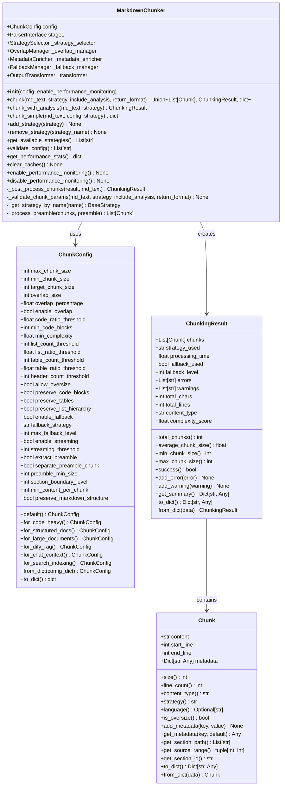
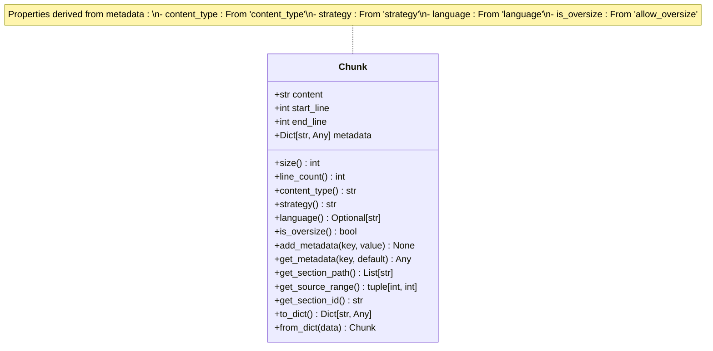
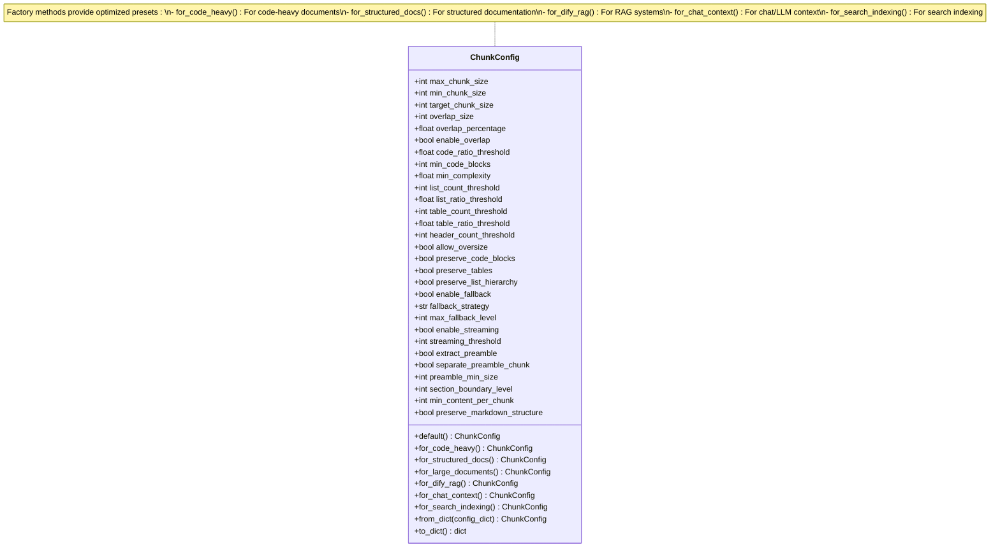
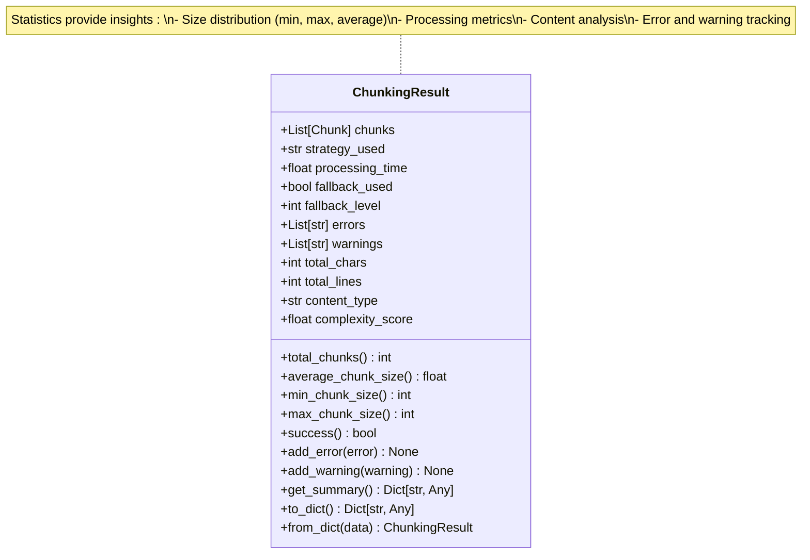
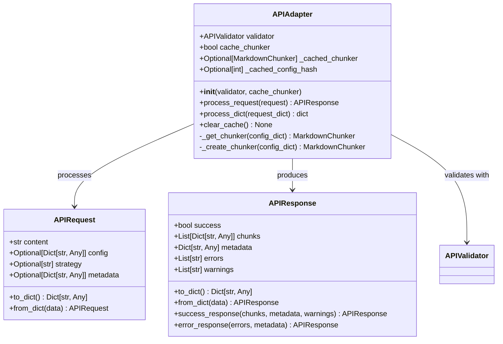
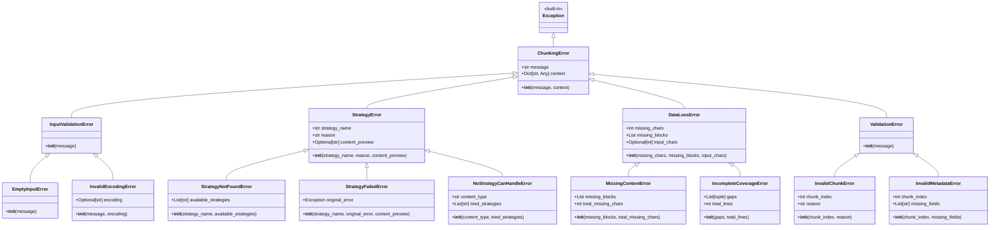
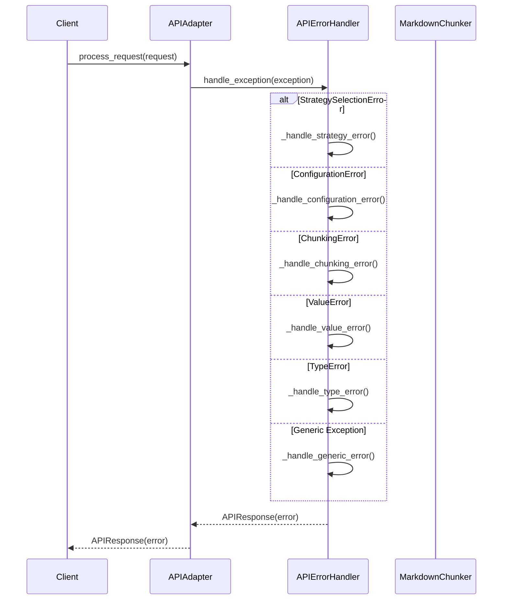
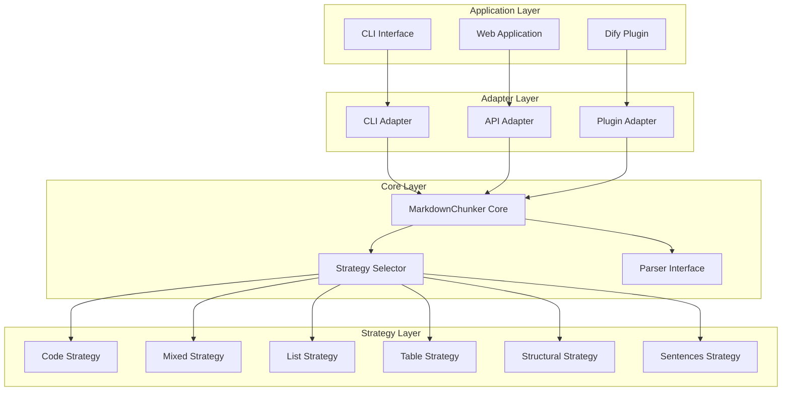
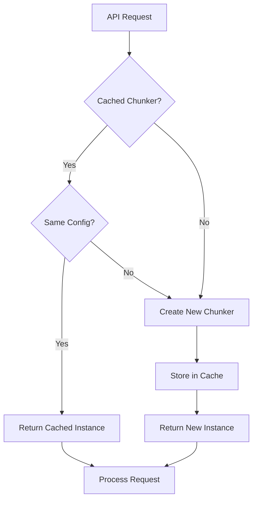

# API Reference

<cite>
**Referenced Files in This Document**
- [markdown_chunker/__init__.py](file://markdown_chunker/__init__.py)
- [markdown_chunker/chunker/core.py](file://markdown_chunker/chunker/core.py)
- [markdown_chunker/chunker/types.py](file://markdown_chunker/chunker/types.py)
- [markdown_chunker/api/adapter.py](file://markdown_chunker/api/adapter.py)
- [markdown_chunker/api/types.py](file://markdown_chunker/api/types.py)
- [markdown_chunker/api/validator.py](file://markdown_chunker/api/validator.py)
- [markdown_chunker/api/error_handler.py](file://markdown_chunker/api/error_handler.py)
- [markdown_chunker/chunker/errors.py](file://markdown_chunker/chunker/errors.py)
- [markdown_chunker/chunker/strategies/base.py](file://markdown_chunker/chunker/strategies/base.py)
- [examples/basic_usage.py](file://examples/basic_usage.py)
- [examples/api_usage.py](file://examples/api_usage.py)
- [README.md](file://README.md)
</cite>

## Table of Contents
1. [Introduction](#introduction)
2. [Core API Classes](#core-api-classes)
3. [Data Types and Structures](#data-types-and-structures)
4. [REST API Adapter](#rest-api-adapter)
5. [Error Handling](#error-handling)
6. [Usage Examples](#usage-examples)
7. [Adapter Pattern Implementation](#adapter-pattern-implementation)
8. [Versioning and Backward Compatibility](#versioning-and-backward-compatibility)
9. [Extending the API](#extending-the-api)
10. [Performance Considerations](#performance-considerations)

## Introduction

The MarkdownChunker library provides intelligent markdown chunking capabilities with adaptive strategies based on content analysis. The API offers multiple interface types including Python library, REST API, and CLI through a unified adapter pattern.

### Key Features

- **Adaptive Strategy Selection**: Automatic content analysis determines optimal chunking approach
- **Multiple Strategies**: 6 specialized strategies for different content types
- **Flexible Configuration**: Comprehensive configuration options for various use cases
- **REST API Support**: Production-ready REST API with validation and error handling
- **Backward Compatibility**: Maintains compatibility across versions with deprecation warnings

## Core API Classes

### MarkdownChunker Class

The main interface for markdown chunking operations.



**Diagram sources**
- [markdown_chunker/chunker/core.py](file://markdown_chunker/chunker/core.py#L41-L780)
- [markdown_chunker/chunker/types.py](file://markdown_chunker/chunker/types.py#L36-L1061)

#### Constructor Parameters

| Parameter | Type | Default | Description |
|-----------|------|---------|-------------|
| `config` | `Optional[ChunkConfig]` | `None` | Configuration for chunking behavior. If `None`, uses default configuration. |
| `enable_performance_monitoring` | `bool` | `False` | Enable performance monitoring and optimization tracking. |

#### Methods

##### `chunk(md_text, strategy=None, include_analysis=False, return_format="objects")`

Unified chunking method supporting multiple return formats.

**Parameters:**

| Parameter | Type | Default | Description |
|-----------|------|---------|-------------|
| `md_text` | `str` | - | Markdown content to process. Must be valid UTF-8 text. |
| `strategy` | `Optional[str]` | `None` | Strategy override. Valid values: `"code"`, `"mixed"`, `"list"`, `"table"`, `"structural"`, `"sentences"`, `"auto"` |
| `include_analysis` | `bool` | `False` | Include detailed analysis metadata in result. |
| `return_format` | `Literal["objects", "dict"]` | `"objects"` | Output format for the result. |

**Returns:**
- `List[Chunk]`: When `include_analysis=False`, `return_format="objects"`
- `ChunkingResult`: When `include_analysis=True`, `return_format="objects"`
- `dict`: When `return_format="dict"`

**Raises:**
- `ValueError`: If `md_text` is empty or invalid
- `StrategySelectionError`: If specified strategy is not found
- `ChunkingError`: If chunking fails completely

**Examples:**

```python
# Basic usage (backward compatible)
chunker = MarkdownChunker()
chunks = chunker.chunk("# Hello\n\nWorld")

# With detailed analysis
result = chunker.chunk("# Hello\n\nWorld", include_analysis=True)

# As dictionary (for JSON APIs)
data = chunker.chunk("# Hello\n\nWorld", return_format="dict")

# Force specific strategy
chunks = chunker.chunk(code_doc, strategy="code")
```

##### `add_strategy(strategy)`

Add a custom strategy to the chunker.

**Parameters:**
- `strategy`: Custom strategy instance implementing `BaseStrategy`.

**See Also:**
- [`remove_strategy()`](#remove_strategystrategy_name)
- [`get_available_strategies()`](#get_available_strategies)

##### `remove_strategy(strategy_name)`

Remove a strategy from the chunker.

**Parameters:**
- `strategy_name`: Name of strategy to remove.

**See Also:**
- [`add_strategy()`](#add_strategystrategy)
- [`get_available_strategies()`](#get_available_strategies)

##### `get_available_strategies()`

Get list of available strategy names.

**Returns:**
- `List[str]`: Available strategy names.

**See Also:**
- [`add_strategy()`](#add_strategystrategy)
- [`remove_strategy()`](#remove_strategystrategy_name)

##### `get_performance_stats()`

Get performance statistics for all operations.

**Returns:**
- `dict`: Performance metrics including timing statistics.

**See Also:**
- [`enable_performance_monitoring()`](#enable_performance_monitoring)
- [`disable_performance_monitoring()`](#disable_performance_monitoring)

**Section sources**
- [markdown_chunker/chunker/core.py](file://markdown_chunker/chunker/core.py#L41-L780)

## Data Types and Structures

### Chunk Dataclass

Represents a single chunk of content with metadata.



**Diagram sources**
- [markdown_chunker/chunker/types.py](file://markdown_chunker/chunker/types.py#L36-L500)

#### Properties

| Property | Type | Description |
|----------|------|-------------|
| `size` | `int` | Size of chunk content in characters. |
| `line_count` | `int` | Number of lines in the chunk. |
| `content_type` | `str` | Type of content (code, text, list, table, mixed). |
| `strategy` | `str` | Strategy used to create this chunk. |
| `language` | `Optional[str]` | Programming language for code chunks. |
| `is_oversize` | `bool` | Whether chunk exceeds normal size limits. |

#### Methods

| Method | Parameters | Returns | Description |
|--------|------------|---------|-------------|
| `add_metadata()` | `key: str, value: Any` | `None` | Add metadata to the chunk. |
| `get_metadata()` | `key: str, default: Any = None` | `Any` | Get metadata value with optional default. |
| `get_section_path()` | - | `List[str]` | Get hierarchical section path. |
| `get_source_range()` | - | `tuple[int, int]` | Get character offset range. |
| `get_section_id()` | - | `str` | Get stable section identifier. |
| `to_dict()` | - | `Dict[str, Any]` | Convert chunk to dictionary for JSON serialization. |
| `from_dict()` | `data: Dict[str, Any]` | `Chunk` | Create chunk from dictionary. |

### ChunkConfig Dataclass

Configuration for chunking behavior.



**Diagram sources**
- [markdown_chunker/chunker/types.py](file://markdown_chunker/chunker/types.py#L497-L1061)

#### Configuration Profiles

| Profile | Purpose | Key Settings |
|---------|---------|--------------|
| `for_code_heavy()` | Code documentation | Larger chunks, aggressive code detection |
| `for_structured_docs()` | Well-organized docs | Respect document hierarchy |
| `for_dify_rag()` | RAG systems | Balanced settings for retrieval |
| `for_chat_context()` | Chat/LLM context | Optimal for conversational AI |
| `for_search_indexing()` | Search systems | Optimized for search relevance |

### ChunkingResult Dataclass

Complete result of a chunking operation.



**Diagram sources**
- [markdown_chunker/chunker/types.py](file://markdown_chunker/chunker/types.py#L322-L500)

**Section sources**
- [markdown_chunker/chunker/types.py](file://markdown_chunker/chunker/types.py#L36-L1061)

## REST API Adapter

### APIAdapter Class

Adapter for processing API requests with caching and validation.



**Diagram sources**
- [markdown_chunker/api/adapter.py](file://markdown_chunker/api/adapter.py#L15-L162)
- [markdown_chunker/api/types.py](file://markdown_chunker/api/types.py#L11-L162)

#### Constructor Parameters

| Parameter | Type | Default | Description |
|-----------|------|---------|-------------|
| `validator` | `Optional[APIValidator]` | `None` | Optional custom validator. |
| `cache_chunker` | `bool` | `True` | Whether to cache chunker instance. |

#### Methods

##### `process_request(request)`

Process API request with validation and chunking.

**Parameters:**
- `request`: `APIRequest` containing content, config, strategy, and metadata.

**Returns:**
- `APIResponse`: Response with chunks or errors.

##### `process_dict(request_dict)`

Process request from dictionary.

**Parameters:**
- `request_dict`: Request as dictionary.

**Returns:**
- `dict`: Response as dictionary.

##### `clear_cache()`

Clear cached chunker instance.

**Section sources**
- [markdown_chunker/api/adapter.py](file://markdown_chunker/api/adapter.py#L15-L162)

### API Request/Response Schema

#### APIRequest Structure

| Field | Type | Required | Description |
|-------|------|----------|-------------|
| `content` | `str` | Yes | Markdown content to chunk. |
| `config` | `Optional[Dict[str, Any]]` | No | Configuration dictionary. |
| `strategy` | `Optional[str]` | No | Strategy override. |
| `metadata` | `Optional[Dict[str, Any]]` | No | Request metadata. |

#### APIResponse Structure

| Field | Type | Description |
|-------|------|-------------|
| `success` | `bool` | Whether operation succeeded. |
| `chunks` | `List[Dict[str, Any]]` | List of chunk dictionaries. |
| `metadata` | `Dict[str, Any]` | Response metadata. |
| `errors` | `List[str]` | List of error messages. |
| `warnings` | `List[str]` | List of warning messages. |

#### Response Metadata Fields

| Field | Type | Description |
|-------|------|-------------|
| `strategy_used` | `str` | Strategy used for chunking. |
| `processing_time` | `float` | Processing time in seconds. |
| `fallback_used` | `bool` | Whether fallback strategy was used. |
| `fallback_level` | `int` | Fallback level used. |
| `total_chunks` | `int` | Total number of chunks. |
| `total_chars` | `int` | Total characters processed. |
| `content_type` | `str` | Detected content type. |
| `complexity_score` | `float` | Content complexity score. |

**Section sources**
- [markdown_chunker/api/types.py](file://markdown_chunker/api/types.py#L11-L162)

## Error Handling

### Error Hierarchy



**Diagram sources**
- [markdown_chunker/chunker/errors.py](file://markdown_chunker/chunker/errors.py#L11-L210)

### API Error Handling

#### APIErrorHandler Class

Centralized error handler for API operations.



**Diagram sources**
- [markdown_chunker/api/error_handler.py](file://markdown_chunker/api/error_handler.py#L18-L235)

#### Error Response Format

| Field | Type | Description |
|-------|------|-------------|
| `success` | `bool` | Always `false` for error responses. |
| `errors` | `List[str]` | List of error messages. |
| `metadata` | `Dict[str, Any]` | Error metadata including type and code. |

**Section sources**
- [markdown_chunker/api/error_handler.py](file://markdown_chunker/api/error_handler.py#L18-L235)
- [markdown_chunker/chunker/errors.py](file://markdown_chunker/chunker/errors.py#L11-L210)

## Usage Examples

### Synchronous Usage

#### Basic Chunking

```python
from markdown_chunker import MarkdownChunker

# Initialize chunker
chunker = MarkdownChunker()

# Basic chunking
markdown = "# Hello World\n\nThis is a test document."
chunks = chunker.chunk(markdown)

# Process chunks
for i, chunk in enumerate(chunks):
    print(f"Chunk {i}: {chunk.size} chars")
    print(f"Lines {chunk.start_line}-{chunk.end_line}")
```

#### With Analysis and Custom Config

```python
from markdown_chunker import MarkdownChunker, ChunkConfig

# Custom configuration
config = ChunkConfig(
    max_chunk_size=2048,
    min_chunk_size=256,
    enable_overlap=True,
    overlap_size=100
)

# Initialize with config
chunker = MarkdownChunker(config)

# Chunk with analysis
result = chunker.chunk_with_analysis(markdown)
print(f"Strategy: {result.strategy_used}")
print(f"Chunks: {len(result.chunks)}")
print(f"Processing time: {result.processing_time:.3f}s")
```

#### Strategy Override

```python
# Force specific strategy
chunks = chunker.chunk(markdown, strategy="code")
for chunk in chunks:
    print(f"Strategy: {chunk.metadata['strategy']}")
```

### Asynchronous Usage

#### Using with Async Patterns

```python
import asyncio
from markdown_chunker import MarkdownChunker

async def process_document_async(document):
    chunker = MarkdownChunker()
    
    # Process in background
    loop = asyncio.get_event_loop()
    result = await loop.run_in_executor(None, lambda: chunker.chunk_with_analysis(document))
    
    return result

# Usage
async def main():
    document = "# Async Processing\n\nThis is an async example."
    result = await process_document_async(document)
    print(f"Async chunks: {len(result.chunks)}")
```

### REST API Usage

#### Basic API Request

```python
from markdown_chunker.api import APIAdapter, APIRequest

# Create adapter
adapter = APIAdapter()

# Create request
request = APIRequest(
    content="# Hello World\n\nThis is a test.",
    config=None,  # Use defaults
    strategy="auto"
)

# Process request
response = adapter.process_request(request)

if response.success:
    print(f"Chunks: {len(response.chunks)}")
    print(f"Strategy: {response.metadata['strategy_used']}")
else:
    print(f"Error: {response.errors}")
```

#### API with Custom Configuration

```python
request = APIRequest(
    content=document,
    config={
        "max_chunk_size": 500,
        "min_chunk_size": 100,
        "enable_overlap": True,
        "overlap_size": 50
    },
    strategy="auto"
)

response = adapter.process_request(request)
```

#### JSON Serialization

```python
# Convert to JSON
response_dict = {
    "success": response.success,
    "chunks": response.chunks,
    "metadata": response.metadata
}

import json
json_str = json.dumps(response_dict, indent=2)
```

### Convenience Functions

#### chunk_text() Function

```python
from markdown_chunker import chunk_text

# Simple one-line interface
chunks = chunk_text("# Hello\n\nWorld")
for chunk in chunks:
    print(f"{chunk.size} chars")
```

#### chunk_file() Function

```python
from markdown_chunker import chunk_file

# Chunk from file
chunks = chunk_file("README.md")
print(f"Created {len(chunks)} chunks")
```

**Section sources**
- [examples/basic_usage.py](file://examples/basic_usage.py#L1-L364)
- [examples/api_usage.py](file://examples/api_usage.py#L1-L356)

## Adapter Pattern Implementation

### Architecture Overview

The MarkdownChunker implements a flexible adapter pattern that enables multiple interface types through a unified core.



**Diagram sources**
- [markdown_chunker/api/adapter.py](file://markdown_chunker/api/adapter.py#L15-L162)
- [markdown_chunker/chunker/core.py](file://markdown_chunker/chunker/core.py#L41-L780)

### Interface Types

#### 1. Python Library Interface

Direct Python API access through `MarkdownChunker` class.

```python
# Core library usage
from markdown_chunker import MarkdownChunker, ChunkConfig

chunker = MarkdownChunker()
chunks = chunker.chunk(markdown_text)
```

#### 2. REST API Interface

Production-ready REST API with validation and error handling.

```python
# REST API usage
from markdown_chunker.api import APIAdapter, APIRequest

adapter = APIAdapter()
request = APIRequest(content=markdown, config=config)
response = adapter.process_request(request)
```

#### 3. CLI Interface

Command-line interface through adapter pattern.

```python
# CLI usage (via adapter)
adapter = CLIAdapter()
result = adapter.process_command(args)
```

### Caching Strategy

The adapter implements intelligent caching to optimize performance:



**Diagram sources**
- [markdown_chunker/api/adapter.py](file://markdown_chunker/api/adapter.py#L95-L135)

**Section sources**
- [markdown_chunker/api/adapter.py](file://markdown_chunker/api/adapter.py#L15-L162)

## Versioning and Backward Compatibility

### Version Information

The library follows semantic versioning with the current version being `1.0.0`.

### Backward Compatibility Guarantees

#### Current Compatibility Status

- **✓** `chunk()` method maintains backward compatibility
- **✓** `chunk_with_analysis()` is deprecated but functional
- **✓** `chunk_simple()` is deprecated but functional
- **✓** Core data structures remain stable

#### Deprecated Methods

| Method | Replacement | Status | Removal Plan |
|--------|-------------|--------|--------------|
| `chunk_with_analysis()` | `chunk(include_analysis=True)` | Deprecated | Version 2.0.0 |
| `chunk_simple()` | `chunk(return_format="dict")` | Deprecated | Version 2.0.0 |

#### Configuration Compatibility

- **✓** All configuration parameters remain supported
- **✓** Factory methods preserve behavior
- **✓** Custom configurations work unchanged

### Migration Guide

#### From `chunk_with_analysis()` to `chunk()`

```python
# OLD (deprecated)
result = chunker.chunk_with_analysis(markdown)

# NEW (recommended)
result = chunker.chunk(markdown, include_analysis=True)
```

#### From `chunk_simple()` to `chunk()`

```python
# OLD (deprecated)
result = chunker.chunk_simple(markdown)

# NEW (recommended)
result = chunker.chunk(markdown, return_format="dict")
```

**Section sources**
- [markdown_chunker/__init__.py](file://markdown_chunker/__init__.py#L440-L776)

## Extending the API

### Creating Custom Strategies

#### Strategy Implementation

```python
from markdown_chunker.chunker.strategies.base import BaseStrategy
from markdown_chunker.chunker.types import Chunk

class CustomStrategy(BaseStrategy):
    def __init__(self):
        super().__init__()
        self.name = "custom"
        self.priority = 50
    
    @property
    def priority(self) -> int:
        return 50
    
    def can_handle(self, analysis, config) -> bool:
        # Custom logic to determine if strategy applies
        return analysis.complexity_score > 0.5
    
    def calculate_quality(self, analysis) -> float:
        # Calculate quality score (0.0-1.0)
        return 0.7
    
    def apply(self, content, stage1_results, config) -> List[Chunk]:
        # Implement chunking logic
        # Return list of Chunk objects
        return [Chunk(content, 1, 1, {})]
```

#### Adding Strategy to Chunker

```python
chunker = MarkdownChunker()
chunker.add_strategy(CustomStrategy())

# Strategy is now available
chunks = chunker.chunk(text, strategy="custom")
```

### Custom Validators

#### Creating Custom Validator

```python
from markdown_chunker.api.validator import APIValidator
from markdown_chunker.api.types import APIError

class CustomValidator(APIValidator):
    def validate_custom_field(self, value) -> List[APIError]:
        errors = []
        if not value:
            errors.append(APIError.validation_error("custom_field", "Custom field is required"))
        return errors
    
    def validate_request(self, request):
        errors = super().validate_request(request)
        errors.extend(self.validate_custom_field(request.custom_field))
        return errors
```

### Custom Error Handlers

#### Creating Custom Error Handler

```python
from markdown_chunker.api.error_handler import APIErrorHandler

class CustomErrorHandler(APIErrorHandler):
    def handle_exception(self, exception, context=None):
        # Custom error handling logic
        if isinstance(exception, CustomError):
            return self._handle_custom_error(exception, context)
        return super().handle_exception(exception, context)
    
    def _handle_custom_error(self, exception, context):
        # Custom error response
        return APIResponse.error_response(
            errors=[f"Custom error: {str(exception)}"],
            metadata={"error_type": "CustomError"}
        )
```

**Section sources**
- [markdown_chunker/chunker/strategies/base.py](file://markdown_chunker/chunker/strategies/base.py#L16-L380)

## Performance Considerations

### Performance Monitoring

The library includes built-in performance monitoring:

```python
# Enable monitoring
chunker = MarkdownChunker(enable_performance_monitoring=True)

# Process documents
chunks = chunker.chunk(large_document)

# Get statistics
stats = chunker.get_performance_stats()
print(f"Average chunk time: {stats['chunk']['avg_time']:.3f}s")
print(f"Total operations: {stats['chunk']['count']}")
```

### Caching Strategy

#### API Adapter Caching

```python
# Caching reduces overhead for repeated requests
adapter = APIAdapter(cache_chunker=True)

# Same configuration reused
request1 = APIRequest(content="doc1", config={"max_chunk_size": 1000})
request2 = APIRequest(content="doc2", config={"max_chunk_size": 1000})

# Only one chunker instance created
response1 = adapter.process_request(request1)
response2 = adapter.process_request(request2)
```

#### Memory Management

- **Chunker caching**: Reuse chunker instances when possible
- **Configuration hashing**: Efficient cache key generation
- **Lazy loading**: Strategies loaded on demand

### Optimization Recommendations

#### For Large Documents

```python
# Use streaming for large documents
config = ChunkConfig(
    enable_streaming=True,
    streaming_threshold=10 * 1024 * 1024  # 10MB
)

chunker = MarkdownChunker(config)
```

#### For High-Throughput Applications

```python
# Enable caching and monitoring
adapter = APIAdapter(cache_chunker=True)
chunker = MarkdownChunker(enable_performance_monitoring=True)

# Process multiple documents efficiently
for document in documents:
    response = adapter.process_request(APIRequest(content=document))
```

**Section sources**
- [markdown_chunker/chunker/core.py](file://markdown_chunker/chunker/core.py#L661-L717)
- [markdown_chunker/api/adapter.py](file://markdown_chunker/api/adapter.py#L33-L141)