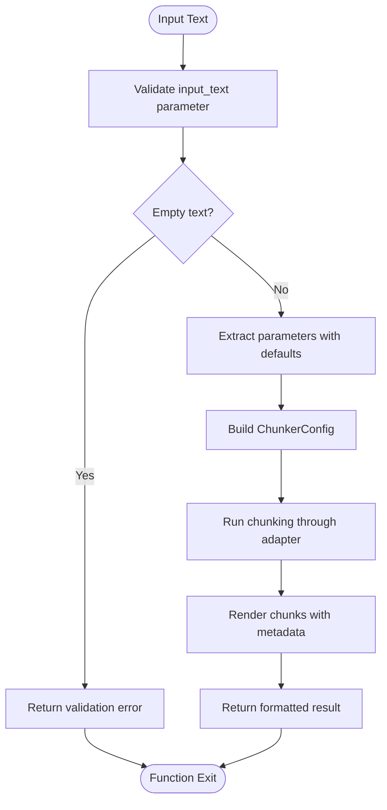
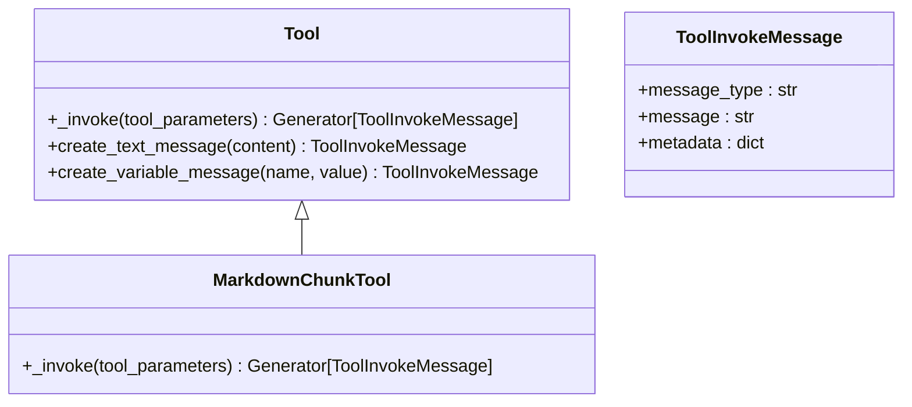
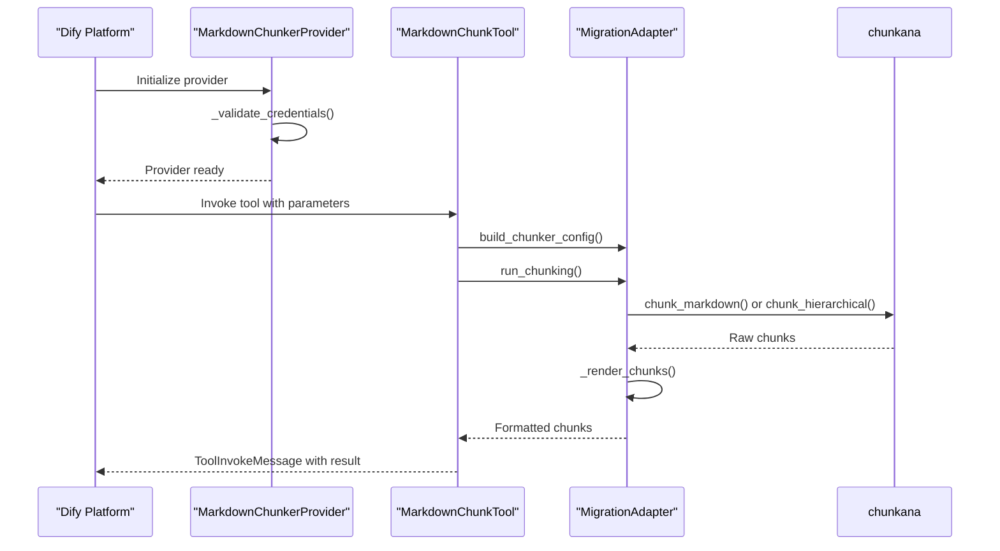
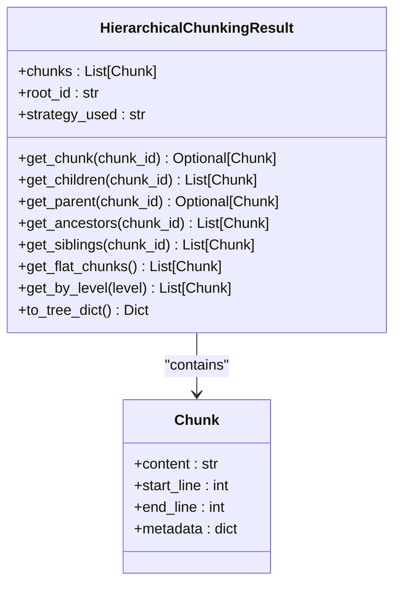
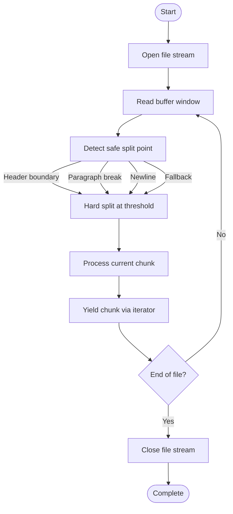
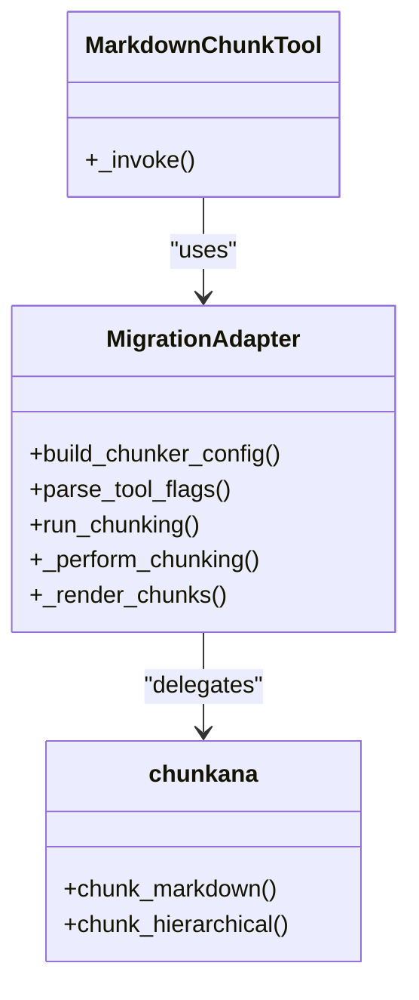

# API Reference

<cite>
**Referenced Files in This Document**   
- [manifest.yaml](file://manifest.yaml)
- [provider/markdown_chunker.py](file://provider/markdown_chunker.py)
- [provider/markdown_chunker.yaml](file://provider/markdown_chunker.yaml)
- [main.py](file://main.py)
- [adapter.py](file://adapter.py)
- [input_validator.py](file://input_validator.py)
- [output_filter.py](file://output_filter.py)
- [tools/markdown_chunk_tool.py](file://tools/markdown_chunk_tool.py)
- [tools/markdown_chunk_tool.yaml](file://tools/markdown_chunk_tool.yaml)
- [docs/api/config.md](file://docs/api/config.md)
- [docs/api/types.md](file://docs/api/types.md)
- [docs/api/chunk_metadata.md](file://docs/api/chunk_metadata.md)
- [docs/api/streaming.md](file://docs/api/streaming.md)
</cite>

## Table of Contents
1. [Introduction](#introduction)
2. [Python Library API](#python-library-api)
3. [Dify Plugin API](#dify-plugin-api)
4. [Configuration API](#configuration-api)
5. [Data Models](#data-models)
6. [Streaming API](#streaming-api)
7. [Error Handling](#error-handling)
8. [Versioning and Migration](#versioning-and-migration)
9. [Client Implementation Guidelines](#client-implementation-guidelines)
10. [Performance Optimization](#performance-optimization)

## Introduction

The dify-markdown-chunker-1 library provides advanced Markdown chunking capabilities with structural awareness for improved RAG (Retrieval-Augmented Generation) performance. Built on the chunkana engine, this library intelligently splits Markdown documents while preserving semantic context and document structure.

The API consists of three main components:
- **Python Library API**: Core functions for chunking text and files
- **Dify Plugin API**: Integration with Dify platform through tool interface
- **Configuration API**: Flexible configuration options for chunking behavior

The library supports multiple chunking strategies including code-aware, list-aware, structural, and fallback approaches, automatically selecting the optimal strategy based on content analysis.

**Section sources**
- [main.py](file://main.py#L1-L38)
- [manifest.yaml](file://manifest.yaml#L1-L49)

## Python Library API

The Python library API provides programmatic access to the chunking functionality through the `chunk_text()` and `chunk_file()` functions. These functions are exposed through the migration adapter that ensures backward compatibility while leveraging the advanced chunkana engine.

### chunk_text()

Processes Markdown text and returns chunks according to the specified configuration.


```mermaid
flowchart TD
Start([Input Text]) --> Validate["Validate input_text parameter"]
Validate --> CheckEmpty{"Empty text?"}
CheckEmpty --> |Yes| ReturnError["Return validation error"]
CheckEmpty --> |No| ExtractParams["Extract parameters with defaults"]
ExtractParams --> BuildConfig["Build ChunkerConfig"]
BuildConfig --> RunChunking["Run chunking through adapter"]
RunChunking --> Render["Render chunks with metadata"]
Render --> ReturnResult["Return formatted result"]
ReturnError --> End([Function Exit])
ReturnResult --> End
```

**Diagram sources**
- [adapter.py](file://adapter.py#L71-L352)
- [tools/markdown_chunk_tool.py](file://tools/markdown_chunk_tool.py#L47-L126)

### chunk_file()

Processes a Markdown file and returns chunks. This function reads the file content and delegates to the same chunking pipeline as `chunk_text()`.

The function signature and parameter handling are identical to `chunk_text()`, with the primary difference being the source of the input text (file system vs. direct string input).

**Section sources**
- [tools/markdown_chunk_tool.py](file://tools/markdown_chunk_tool.py#L47-L126)
- [adapter.py](file://adapter.py#L71-L352)

## Dify Plugin API

The Dify plugin API exposes the chunking functionality through a standardized tool interface defined in the manifest and provider files. This allows integration with the Dify platform for use in Knowledge Base processing pipelines.

### Tool Interface

The tool interface is defined in `tools/markdown_chunk_tool.yaml` and implemented in `tools/markdown_chunk_tool.py`. The tool follows the Dify plugin specification and provides a consistent interface for chunking operations.


```mermaid
classDiagram
class Tool {
+_invoke(tool_parameters) Generator[ToolInvokeMessage]
+create_text_message(content) ToolInvokeMessage
+create_variable_message(name, value) ToolInvokeMessage
}
class MarkdownChunkTool {
+_invoke(tool_parameters) Generator[ToolInvokeMessage]
}
class ToolInvokeMessage {
+message_type : str
+message : str
+metadata : dict
}
Tool <|-- MarkdownChunkTool
```

**Diagram sources**
- [tools/markdown_chunk_tool.py](file://tools/markdown_chunk_tool.py#L29-L126)
- [tools/markdown_chunk_tool.yaml](file://tools/markdown_chunk_tool.yaml#L1-L178)

### Provider Interface

The provider interface is defined in `provider/markdown_chunker.yaml` and implemented in `provider/markdown_chunker.py`. The provider manages the tool and handles credential validation (though no credentials are required for this local operation).


```mermaid
sequenceDiagram
participant Dify as "Dify Platform"
participant Provider as "MarkdownChunkerProvider"
participant Tool as "MarkdownChunkTool"
participant Adapter as "MigrationAdapter"
Dify->>Provider : Initialize provider
Provider->>Provider : _validate_credentials()
Provider-->>Dify : Provider ready
Dify->>Tool : Invoke tool with parameters
Tool->>Adapter : build_chunker_config()
Tool->>Adapter : run_chunking()
Adapter->>chunkana : chunk_markdown() or chunk_hierarchical()
chunkana-->>Adapter : Raw chunks
Adapter->>Adapter : _render_chunks()
Adapter-->>Tool : Formatted chunks
Tool-->>Dify : ToolInvokeMessage with result
```

**Diagram sources**
- [provider/markdown_chunker.py](file://provider/markdown_chunker.py#L15-L36)
- [provider/markdown_chunker.yaml](file://provider/markdown_chunker.yaml#L1-L23)
- [manifest.yaml](file://manifest.yaml#L1-L49)

## Configuration API

The configuration API provides flexible options for controlling chunking behavior through the `ChunkConfig` class and related configuration objects.

### ChunkConfig

The main configuration class that controls chunking behavior and strategy selection.

| Parameter | Type | Default | Description |
|---------|------|---------|-------------|
| `max_chunk_size` | int | 4096 | Maximum chunk size in characters |
| `min_chunk_size` | int | 512 | Minimum chunk size in characters |
| `overlap_size` | int | 200 | Overlap size between chunks (0 = disabled) |
| `preserve_atomic_blocks` | bool | True | Keep code blocks and tables intact |
| `extract_preamble` | bool | True | Extract content before first header |
| `code_threshold` | float | 0.3 | Code ratio threshold for CodeAwareStrategy |
| `structure_threshold` | int | 3 | Minimum headers for StructuralStrategy |
| `strategy_override` | str | None | Force specific strategy: "code_aware", "structural", "fallback" |
| `use_adaptive_sizing` | bool | False | Enable adaptive chunk sizing based on content complexity |
| `adaptive_config` | AdaptiveSizeConfig | None | Adaptive sizing configuration |

**Section sources**
- [docs/api/config.md](file://docs/api/config.md#L1-L395)
- [adapter.py](file://adapter.py#L94-L119)

### AdaptiveSizeConfig

Controls adaptive chunk sizing behavior when enabled.

| Parameter | Type | Default | Description |
|---------|------|---------|-------------|
| `base_size` | int | 1500 | Base chunk size for medium complexity content |
| `min_scale` | float | 0.5 | Minimum scaling factor (0.5 = 50% of base_size) |
| `max_scale` | float | 1.5 | Maximum scaling factor (1.5 = 150% of base_size) |
| `code_weight` | float | 0.4 | Weight for code ratio in complexity calculation |
| `table_weight` | float | 0.3 | Weight for table ratio in complexity calculation |
| `list_weight` | float | 0.2 | Weight for list ratio in complexity calculation |
| `sentence_length_weight` | float | 0.1 | Weight for average sentence length in complexity calculation |

**Section sources**
- [docs/api/config.md](file://docs/api/config.md#L63-L116)

## Data Models

The library defines several key data models for representing chunks, configurations, and hierarchical relationships.

### Chunk

Represents a single chunk of Markdown content with associated metadata.

| Field | Type | Description |
|------|------|-------------|
| `content` | str | The chunk's Markdown content |
| `start_line` | int | Starting line number (1-indexed) |
| `end_line` | int | Ending line number (1-indexed) |
| `metadata` | dict | Additional metadata about the chunk |

### ChunkConfig

Configuration object for controlling chunking behavior (detailed in Configuration API section).

### HierarchicalChunkingResult

Result object for hierarchical chunking with navigation methods.


```mermaid
classDiagram
class HierarchicalChunkingResult {
+chunks : List[Chunk]
+root_id : str
+strategy_used : str
+get_chunk(chunk_id) Optional[Chunk]
+get_children(chunk_id) List[Chunk]
+get_parent(chunk_id) Optional[Chunk]
+get_ancestors(chunk_id) List[Chunk]
+get_siblings(chunk_id) List[Chunk]
+get_flat_chunks() List[Chunk]
+get_by_level(level) List[Chunk]
+to_tree_dict() Dict
}
class Chunk {
+content : str
+start_line : int
+end_line : int
+metadata : dict
}
HierarchicalChunkingResult --> Chunk : "contains"
```

**Diagram sources**
- [docs/api/types.md](file://docs/api/types.md#L442-L549)
- [adapter.py](file://adapter.py#L171-L178)

## Streaming API

The streaming API provides memory-efficient processing of large Markdown files through buffer-based chunking.

### StreamingConfig

Configuration for streaming operations.

| Parameter | Type | Default | Description |
|---------|------|---------|-------------|
| `buffer_size` | int | 100,000 | Size of buffer window in characters (100KB) |
| `overlap_lines` | int | 20 | Context lines preserved between buffer windows |
| `max_memory_mb` | int | 100 | Maximum memory usage ceiling in megabytes |
| `safe_split_threshold` | float | 0.8 | Position to look for split points (80% of buffer) |

### chunk_file_streaming()

Streams chunks from a file with memory-efficient processing.


```mermaid
flowchart TD
Start([Start]) --> OpenFile["Open file stream"]
OpenFile --> ReadBuffer["Read buffer window"]
ReadBuffer --> DetectSplit["Detect safe split point"]
DetectSplit --> |Header boundary| Split["Split at header"]
DetectSplit --> |Paragraph break| Split["Split at paragraph"]
DetectSplit --> |Newline| Split["Split at newline"]
DetectSplit --> |Fallback| Split["Hard split at threshold"]
Split --> ProcessChunk["Process current chunk"]
ProcessChunk --> YieldChunk["Yield chunk via iterator"]
YieldChunk --> CheckEOF{"End of file?"}
CheckEOF --> |No| ReadBuffer
CheckEOF --> |Yes| CloseFile["Close file stream"]
CloseFile --> End([Complete])
```

**Diagram sources**
- [docs/api/streaming.md](file://docs/api/streaming.md#L64-L334)

## Error Handling

The library implements comprehensive error handling strategies to ensure robust operation.

### Validation

Input validation is performed at multiple levels:
- Parameter validation in the tool interface
- Content validation in the migration adapter
- Structural validation in the chunkana engine

### Exception Types

The library may raise the following exceptions:
- `ValueError`: For invalid parameter values
- `FileNotFoundError`: When attempting to process non-existent files
- `UnicodeDecodeError`: For encoding issues in file processing
- Various exceptions from the underlying chunkana engine

### Graceful Degradation

When errors occur, the library attempts to provide graceful degradation:
- Empty input returns appropriate error messages
- Invalid configurations use default values
- Processing errors return partial results when possible

**Section sources**
- [tools/markdown_chunk_tool.py](file://tools/markdown_chunk_tool.py#L122-L125)
- [input_validator.py](file://input_validator.py#L14-L46)
- [output_filter.py](file://output_filter.py#L24-L116)

## Versioning and Migration

The library supports backward compatibility and provides migration paths from previous versions.

### Version Compatibility

The current version (2.1.7) maintains compatibility with:
- Previous plugin versions through the migration adapter
- Existing configuration parameters
- Output format expectations

### Migration Adapter

The `MigrationAdapter` class provides a compatibility layer between the plugin's tool interface and the chunkana library.


```mermaid
classDiagram
class MigrationAdapter {
+build_chunker_config()
+parse_tool_flags()
+run_chunking()
+_perform_chunking()
+_render_chunks()
}
class MarkdownChunkTool {
+_invoke()
}
class chunkana {
+chunk_markdown()
+chunk_hierarchical()
}
MarkdownChunkTool --> MigrationAdapter : "uses"
MigrationAdapter --> chunkana : "delegates"
```

**Diagram sources**
- [adapter.py](file://adapter.py#L43-L352)
- [tests/test_migration_adapter.py](file://tests/test_migration_adapter.py#L1-L189)

## Client Implementation Guidelines

### Basic Usage

```python
from dify_plugin import Tool

# Create tool instance
tool = MarkdownChunkTool()

# Define parameters
params = {
    "input_text": "# Header\n\nContent...",
    "max_chunk_size": 4096,
    "chunk_overlap": 200,
    "strategy": "auto"
}

# Invoke tool
result = tool._invoke(params)
```

### Configuration Best Practices

- Use `max_chunk_size` of 4096 for general content
- Set `chunk_overlap` to 200 for optimal context preservation
- Use `strategy="auto"` for automatic strategy selection
- Enable `include_metadata=True` for RAG applications
- Consider `enable_hierarchy=True` for documents with clear structure

### Performance Tips

- For large files (>10MB), use streaming API
- Cache configuration objects when processing multiple documents
- Use appropriate chunk sizes for your use case
- Consider adaptive sizing for mixed content types

**Section sources**
- [docs/api/config.md](file://docs/api/config.md#L186-L183)
- [docs/api/streaming.md](file://docs/api/streaming.md#L294-L310)

## Performance Optimization

### Memory Management

The library is optimized for memory efficiency:
- Streaming API keeps memory usage below configured limits
- Buffer-based processing for large files
- Efficient data structures for chunk representation

### Processing Speed

Typical performance characteristics:
- ~20MB/sec processing speed
- Linear scaling with document size
- Minimal overhead for metadata processing

### Optimization Recommendations

| Scenario | Recommendation |
|--------|---------------|
| Large files (>10MB) | Use streaming API |
| Memory-constrained environments | Reduce buffer_size |
| Mixed content types | Enable adaptive sizing |
| Structured documents | Use structural strategy |
| Code-heavy content | Use code-aware strategy |

**Section sources**
- [docs/api/streaming.md](file://docs/api/streaming.md#L182-L210)
- [docs/api/config.md](file://docs/api/config.md#L160-L166)