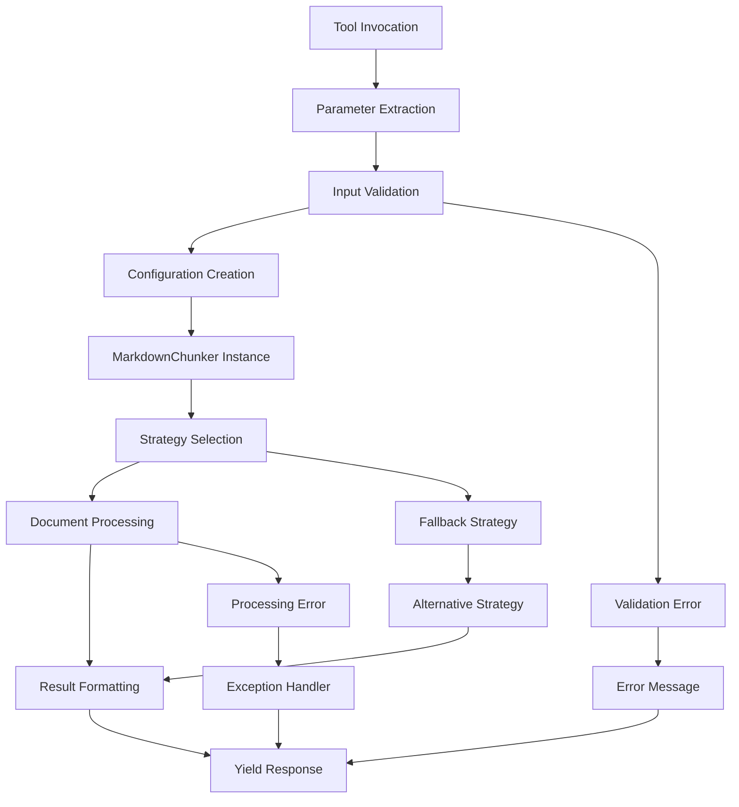
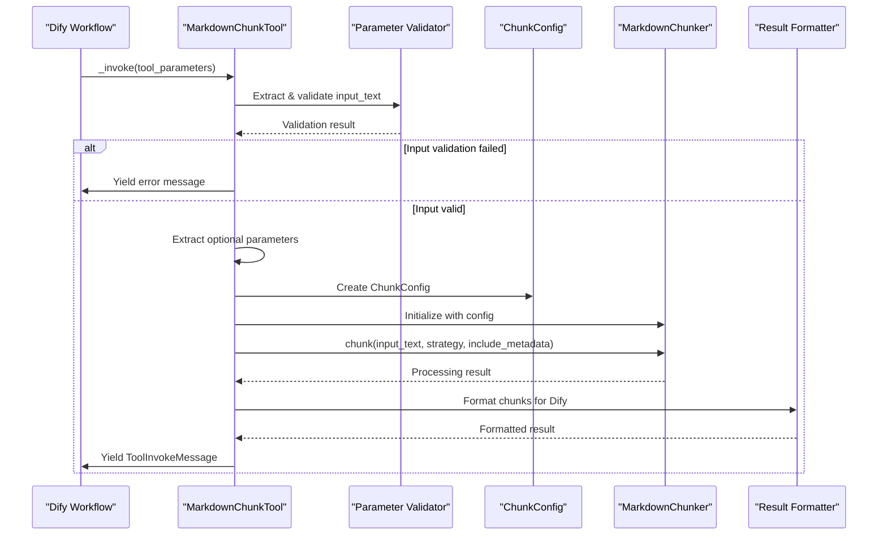
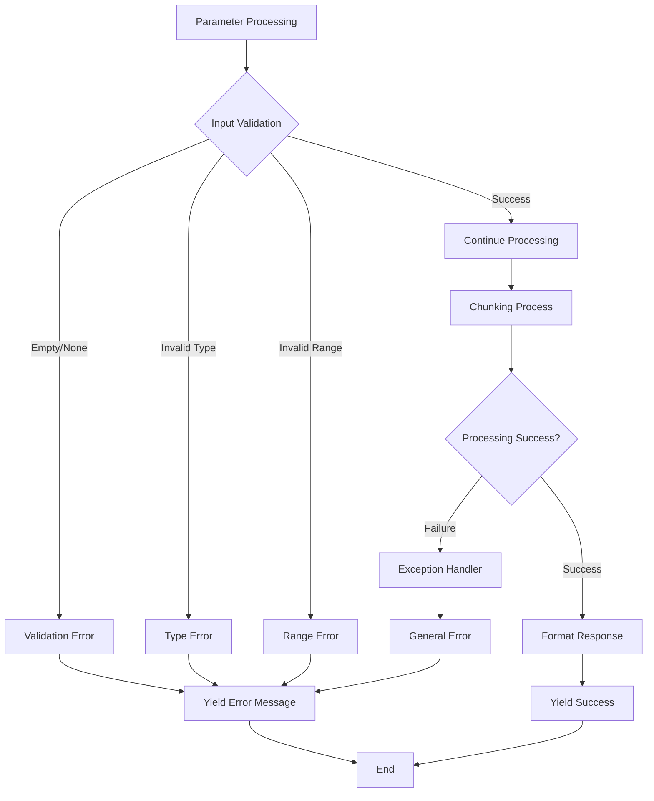
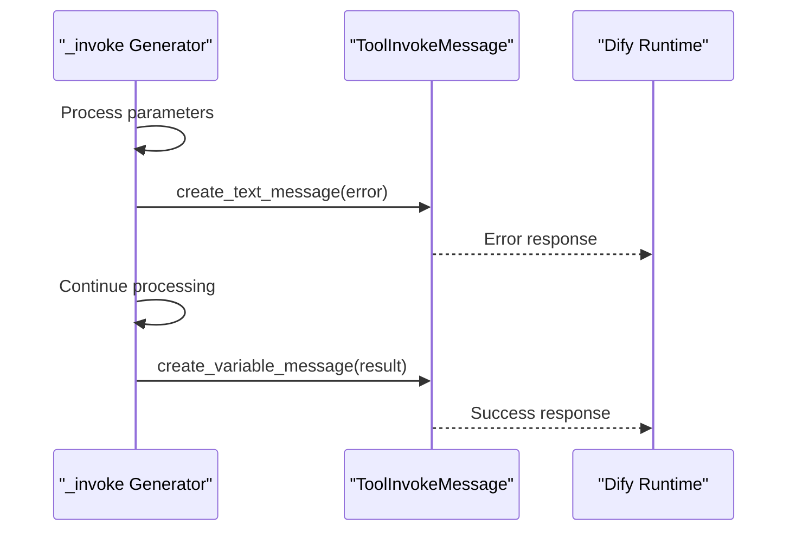

# Command Reference

<cite>
**Referenced Files in This Document**
- [tools/markdown_chunk_tool.py](file://tools/markdown_chunk_tool.py)
- [tools/markdown_chunk_tool.yaml](file://tools/markdown_chunk_tool.yaml)
- [main.py](file://main.py)
- [provider/markdown_chunker.py](file://provider/markdown_chunker.py)
- [examples/basic_usage.py](file://examples/basic_usage.py)
- [examples/api_usage.py](file://examples/api_usage.py)
- [markdown_chunker/chunker/types.py](file://markdown_chunker/chunker/types.py)
- [README.md](file://README.md)
</cite>

## Table of Contents
1. [Introduction](#introduction)
2. [Command Invocation Pattern](#command-invocation-pattern)
3. [Parameter Reference](#parameter-reference)
4. [Implementation Details](#implementation-details)
5. [Usage Examples](#usage-examples)
6. [Error Handling](#error-handling)
7. [Response Format](#response-format)
8. [Integration Patterns](#integration-patterns)

## Introduction

The Dify Markdown Chunker Plugin provides advanced, structure-aware chunking capabilities for Markdown documents in RAG (Retrieval-Augmented Generation) systems. The tool accepts a primary command with configurable parameters and produces intelligently segmented content while preserving document structure and semantic context.

The plugin operates as a Dify tool that integrates seamlessly with knowledge base ingestion pipelines, offering six intelligent chunking strategies that automatically adapt to document content types.

## Command Invocation Pattern

The CLI tool follows a standardized command structure with the following invocation pattern:



**Diagram sources**
- [tools/markdown_chunk_tool.py](file://tools/markdown_chunk_tool.py#L83-L177)

**Section sources**
- [tools/markdown_chunk_tool.py](file://tools/markdown_chunk_tool.py#L83-L177)

## Parameter Reference

### Required Parameters

| Parameter | Type | Description | Default | Constraints |
|-----------|------|-------------|---------|-------------|
| `input_text` | string | The Markdown text content to be chunked | - | Required, cannot be empty or whitespace-only |

### Optional Parameters

| Parameter | Type | Description | Default | Constraints |
|-----------|------|-------------|---------|-------------|
| `max_chunk_size` | number | Maximum size of each chunk in characters | 1000 | Must be positive integer |
| `chunk_overlap` | number | Number of characters to overlap between consecutive chunks | 100 | Must be non-negative |
| `strategy` | select | Chunking strategy selection | "auto" | Must be one of: auto, code, structural, mixed |
| `include_metadata` | boolean | Include structural metadata with each chunk | true | Boolean value |

### Parameter Details

#### `input_text` (Required String)
- **Purpose**: The Markdown document content to be processed
- **Validation**: Must contain non-whitespace content
- **Processing**: Passed directly to the MarkdownChunker for analysis

#### `max_chunk_size` (Optional Number)
- **Purpose**: Controls the maximum size of individual chunks
- **Default**: 1000 characters
- **Minimum**: 1 character
- **Impact**: Larger values create bigger chunks with more context but may exceed RAG token limits

#### `chunk_overlap` (Optional Number)
- **Purpose**: Creates overlap between consecutive chunks to maintain context
- **Default**: 100 characters
- **Range**: 0 to `max_chunk_size`
- **Use Case**: Essential for RAG systems to maintain semantic continuity

#### `strategy` (Optional Select)
- **Purpose**: Determines the chunking approach based on content analysis
- **Options**:
  - `auto`: Automatic strategy detection (recommended)
  - `code`: Optimized for code-heavy documents
  - `structural`: Preserves document hierarchy
  - `mixed`: Balanced approach for mixed content
- **Default**: "auto" (automatic detection)

#### `include_metadata` (Optional Boolean)
- **Purpose**: Controls whether rich metadata accompanies each chunk
- **Default**: true
- **RAG Impact**: Significant for search and retrieval systems
- **Output Format**: JSON metadata embedded in response

**Section sources**
- [tools/markdown_chunk_tool.yaml](file://tools/markdown_chunk_tool.yaml#L24-L117)

## Implementation Details

### `_invoke Method Implementation

The `_invoke` method serves as the core processing engine with the following implementation flow:



**Diagram sources**
- [tools/markdown_chunk_tool.py](file://tools/markdown_chunk_tool.py#L83-L177)

#### Input Validation Process

The tool implements comprehensive input validation:

1. **Content Presence Check**: Ensures `input_text` is provided and contains meaningful content
2. **Whitespace Handling**: Accepts whitespace-only content (processed as valid)
3. **Type Validation**: Validates parameter types according to YAML specification
4. **Range Validation**: Checks numeric parameters against valid ranges

#### ChunkConfig Creation

The tool creates a `ChunkConfig` instance with the following process:

1. **Parameter Extraction**: Retrieves all parameters from `tool_parameters`
2. **Default Application**: Applies YAML-specified defaults for missing parameters
3. **Strategy Normalization**: Converts "auto" strategy to None for internal processing
4. **Configuration Validation**: Leverages `ChunkConfig`'s built-in validation

#### MarkdownChunker Integration

The tool integrates with the core chunking library through:

1. **Instance Creation**: `MarkdownChunker(config)`
2. **Strategy Application**: Passes strategy parameter to chunk() method
3. **Metadata Control**: Manages `include_analysis` parameter for metadata inclusion
4. **Format Specification**: Requests "dict" format for structured results

**Section sources**
- [tools/markdown_chunk_tool.py](file://tools/markdown_chunk_tool.py#L83-L177)

## Usage Examples

### Basic Documentation Processing

```yaml
# Standard documentation chunking
- tool: markdown_chunker
  config:
    max_chunk_size: 2048
    strategy: auto
    include_metadata: true
```

**Use Case**: General documentation processing with automatic strategy selection.

### Code Documentation Optimization

```yaml
# API documentation with code emphasis
- tool: markdown_chunker
  config:
    max_chunk_size: 3072
    strategy: code
    chunk_overlap: 200
    include_metadata: true
```

**Use Case**: API reference documentation with larger chunks and code-focused strategy.

### Technical Specifications Processing

```yaml
# Technical specification with strict structure
- tool: markdown_chunker
  config:
    max_chunk_size: 1536
    strategy: structural
    chunk_overlap: 150
    include_metadata: true
```

**Use Case**: Technical specifications requiring strict adherence to document hierarchy.

### Large Document Processing

```yaml
# Large document with streaming considerations
- tool: markdown_chunker
  config:
    max_chunk_size: 4096
    strategy: auto
    chunk_overlap: 300
    include_metadata: false
```

**Use Case**: Large documents where processing speed is prioritized over metadata.

### Mixed Content Handling

```yaml
# Mixed documentation with balanced approach
- tool: markdown_chunker
  config:
    max_chunk_size: 2048
    strategy: mixed
    chunk_overlap: 100
    include_metadata: true
```

**Use Case**: Documents containing code, tables, lists, and text requiring balanced treatment.

**Section sources**
- [examples/basic_usage.py](file://examples/basic_usage.py#L1-L364)
- [examples/api_usage.py](file://examples/api_usage.py#L1-L356)

## Error Handling

### Validation Errors

The tool implements comprehensive error handling for various failure scenarios:



**Diagram sources**
- [tools/markdown_chunk_tool.py](file://tools/markdown_chunk_tool.py#L172-L177)

#### Error Categories

1. **Input Validation Errors**
   - Empty or whitespace-only `input_text`
   - Invalid parameter types
   - Out-of-range numeric values

2. **Processing Errors**
   - Chunking failures during document analysis
   - Strategy selection conflicts
   - Memory limitations for large documents

3. **Serialization Errors**
   - JSON encoding failures for metadata
   - Unicode handling issues

#### Error Response Format

All errors are returned as `ToolInvokeMessage` instances with appropriate error messages:

- **Validation Errors**: Clear descriptions of parameter issues
- **Processing Errors**: Technical error messages with context
- **General Exceptions**: User-friendly error summaries

**Section sources**
- [tools/markdown_chunk_tool.py](file://tools/markdown_chunk_tool.py#L172-L177)

## Response Format

### Yield-Based Response Pattern

The tool implements a generator-based response pattern using `ToolInvokeMessage` instances:



**Diagram sources**
- [tools/markdown_chunk_tool.py](file://tools/markdown_chunk_tool.py#L103-L170)

### Success Response Structure

When processing succeeds, the tool yields a `ToolInvokeMessage` with:

1. **Variable Name**: `"result"`
2. **Variable Value**: Array of formatted chunk strings
3. **Content Format**: Each chunk includes optional metadata

### Metadata Filtering

The tool applies sophisticated metadata filtering for RAG optimization:

#### Excluded Metadata Fields
- Statistical fields: `char_count`, `line_count`, `word_count`, `avg_line_length`
- Count fields: `item_count`, `nested_item_count`, `unordered_item_count`
- Internal execution fields: `execution_fallback_level`, `execution_strategy_used`
- Redundant fields: `preview`, `total_chunks`

#### Included Metadata Fields
- Content type indicators: `content_type`, `strategy`
- Structural information: `section_path`, `section_id`
- Language identification: `language` (for code blocks)
- Boolean flags: `is_*` and `has_*` fields with truthy values

**Section sources**
- [tools/markdown_chunk_tool.py](file://tools/markdown_chunk_tool.py#L34-L81)

## Integration Patterns

### Dify Workflow Integration

The tool integrates seamlessly with Dify workflows through:

1. **Plugin Registration**: Registered as `markdown_chunk_tool` in manifest
2. **Parameter Mapping**: Direct mapping from YAML configuration to tool parameters
3. **Response Handling**: Automatic conversion to Dify-compatible message format

### API Adapter Pattern

For REST API integration, the tool supports:

1. **Structured Requests**: `APIRequest` objects with configuration
2. **Batch Processing**: Multiple document processing in single requests
3. **Streaming Responses**: Progressive chunk delivery for large documents

### Configuration Profiles

The tool supports predefined configuration profiles for common use cases:

| Profile | Purpose | Key Settings |
|---------|---------|--------------|
| `for_dify_rag()` | RAG systems | Balanced chunk sizes, metadata included |
| `for_code_heavy()` | API documentation | Larger chunks, code-focused strategy |
| `for_structured_docs()` | Technical manuals | Respectful of document hierarchy |
| `for_chat_context()` | LLM context | Optimized for conversational AI |

**Section sources**
- [main.py](file://main.py#L1-L31)
- [provider/markdown_chunker.py](file://provider/markdown_chunker.py#L1-L36)
- [markdown_chunker/chunker/types.py](file://markdown_chunker/chunker/types.py#L573-L800)