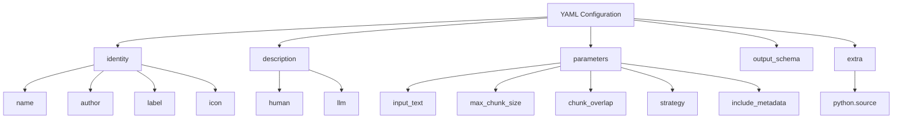
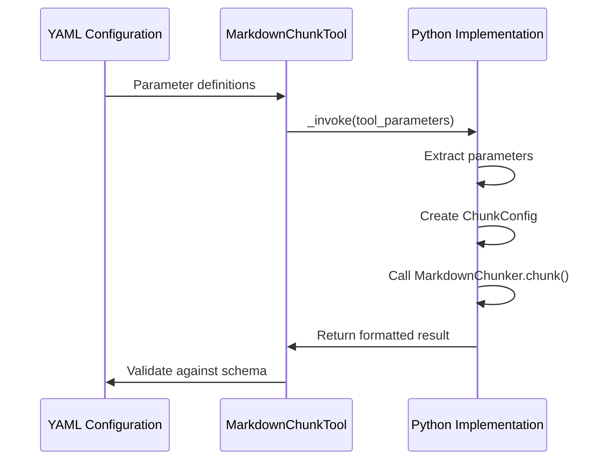

# Configuration File

<cite>
**Referenced Files in This Document**
- [tools/markdown_chunk_tool.yaml](file://tools/markdown_chunk_tool.yaml)
- [tools/markdown_chunk_tool.py](file://tools/markdown_chunk_tool.py)
- [provider/markdown_chunker.yaml](file://provider/markdown_chunker.yaml)
- [provider/markdown_chunker.py](file://provider/markdown_chunker.py)
- [markdown_chunker/chunker/types.py](file://markdown_chunker/chunker/types.py)
- [markdown_chunker/chunker/core.py](file://markdown_chunker/chunker/core.py)
- [tests/test_metadata_filtering.py](file://tests/test_metadata_filtering.py)
- [examples/basic_usage.py](file://examples/basic_usage.py)
</cite>

## Table of Contents
1. [Introduction](#introduction)
2. [Configuration File Structure](#configuration-file-structure)
3. [Identity Section](#identity-section)
4. [Description Section](#description-section)
5. [Parameters Section](#parameters-section)
6. [Output Schema](#output-schema)
7. [Extra Configuration](#extra-configuration)
8. [Parameter Mapping to Implementation](#parameter-mapping-to-implementation)
9. [Metadata Filtering Logic](#metadata-filtering-logic)
10. [Configuration Examples](#configuration-examples)
11. [Best Practices](#best-practices)

## Introduction

The CLI tool's YAML configuration file (`markdown_chunk_tool.yaml`) serves as the bridge between the Dify platform and the Advanced Markdown Chunker Python implementation. This configuration file defines the tool's identity, parameters, and behavior while establishing the connection to the underlying Python implementation in `markdown_chunk_tool.py`.

The configuration follows a structured format that enables the Dify platform to understand the tool's capabilities, validate inputs, and properly integrate with the chunking functionality. The file includes comprehensive parameter definitions, localization support, and metadata filtering configurations that optimize the tool for Retrieval-Augmented Generation (RAG) systems.

## Configuration File Structure

The YAML configuration file is organized into distinct sections that define different aspects of the tool's behavior and integration:



**Diagram sources**
- [tools/markdown_chunk_tool.yaml](file://tools/markdown_chunk_tool.yaml#L1-L128)

**Section sources**
- [tools/markdown_chunk_tool.yaml](file://tools/markdown_chunk_tool.yaml#L1-L128)

## Identity Section

The identity section defines the tool's basic identification and branding information:

### Name and Author
- **name**: `markdown_chunk_tool` - The unique identifier for the tool
- **author**: `asukhodko` - The developer responsible for the tool

### Localization Support
The tool supports multiple languages through the label field:
- **en_US**: "Markdown Chunker" - English version
- **zh_Hans**: "Markdown 分块器" - Simplified Chinese version  
- **ru_RU**: "Markdown чанкер" - Russian version

### Icon Resource
- **icon**: `icon.svg` - Visual representation of the tool

**Section sources**
- [tools/markdown_chunk_tool.yaml](file://tools/markdown_chunk_tool.yaml#L1-L8)

## Description Section

The description section provides comprehensive information about the tool's purpose and capabilities:

### Human Description
Provides a detailed explanation of the tool's functionality:
- **en_US**: "Advanced Markdown chunking with structural awareness for better RAG performance. Intelligently splits documents while preserving context and structure."
- **zh_Hans**: "具有结构感知的高级 Markdown 分块，提升 RAG 性能。智能分割文档，同时保留上下文和结构。"
- **ru_RU**: "Продвинутое чанкование Markdown с учётом структуры для улучшения RAG. Интеллектуально разделяет документы, сохраняя контекст и структуру."

### LLM Description
Provides a structured description for AI agents:
- **Purpose**: Intelligent splitting of Markdown content while preserving structure
- **Capabilities**: Supports configurable chunk size, overlap, and multiple strategies
- **Use Cases**: Processing large Markdown documents for RAG systems

**Section sources**
- [tools/markdown_chunk_tool.yaml](file://tools/markdown_chunk_tool.yaml#L10-L21)

## Parameters Section

The parameters section defines all input parameters with their types, defaults, and localization support:

### Parameter Definitions

#### input_text
- **type**: `string` - Required parameter containing the Markdown text to be chunked
- **required**: `true` - Must be provided by the user
- **form**: `llm` - Used in LLM interactions
- **label**: Localized labels for user interface
- **human_description**: Detailed description for human users
- **llm_description**: Technical description for AI agents

#### max_chunk_size
- **type**: `number` - Maximum size of each chunk in characters
- **required**: `false` - Uses default value if not specified
- **default**: `1000` - Default maximum chunk size
- **form**: `form` - Available in web forms
- **label**: Localized labels for user interface
- **human_description**: "Maximum size of each chunk in characters (default: 1000)"
- **llm_description**: "Maximum number of characters allowed in each chunk. Larger values create bigger chunks with more context."

#### chunk_overlap
- **type**: `number` - Number of characters to overlap between consecutive chunks
- **required**: `false` - Uses default value if not specified
- **default**: `100` - Default overlap size
- **form**: `form` - Available in web forms
- **label**: Localized labels for user interface
- **human_description**: "Number of characters to overlap between consecutive chunks (default: 100)"
- **llm_description**: "Number of characters that overlap between consecutive chunks to maintain context continuity."

#### strategy
- **type**: `select` - Dropdown selection parameter
- **required**: `false` - Uses default value if not specified
- **default**: `"auto"` - Automatic strategy selection
- **form**: `form` - Available in web forms
- **label**: Localized labels for user interface
- **human_description**: "Strategy for chunking the document (default: auto - automatically detect best strategy)"
- **llm_description**: "The chunking strategy to use. Auto automatically selects the best strategy based on content analysis."
- **options**: Available strategies with localized labels:
  - `auto`: "Auto (detect best strategy)"
  - `code`: "Code-focused"
  - `structural`: "Structural (headers)"
  - `mixed`: "Mixed content"

#### include_metadata
- **type**: `boolean` - Whether to include structural metadata with each chunk
- **required**: `false` - Uses default value if not specified
- **default**: `true` - Include metadata by default
- **form**: `form` - Available in web forms
- **label**: Localized labels for user interface
- **human_description**: "Include structural metadata with each chunk (default: true)"
- **llm_description**: "Whether to include metadata about chunk structure, type, strategy used, line numbers, and complexity score."

**Section sources**
- [tools/markdown_chunk_tool.yaml](file://tools/markdown_chunk_tool.yaml#L23-L118)

## Output Schema

The output schema defines the structure of the tool's response:

### Result Structure
- **type**: `object` - The response contains a structured object
- **properties**: Defines the shape of the output
- **$ref**: References a JSON schema for general structure validation

The schema ensures that the tool's output conforms to Dify's expectations for tool responses, enabling proper integration with the platform's workflow system.

**Section sources**
- [tools/markdown_chunk_tool.yaml](file://tools/markdown_chunk_tool.yaml#L119-L124)

## Extra Configuration

The extra section establishes the connection between the YAML configuration and the Python implementation:

### Python Source Link
- **source**: `tools/markdown_chunk_tool.py` - Specifies the Python file containing the tool implementation

This field creates the binding between the configuration definition and the actual implementation, allowing the Dify platform to locate and execute the appropriate Python code when the tool is invoked.

**Section sources**
- [tools/markdown_chunk_tool.yaml](file://tools/markdown_chunk_tool.yaml#L125-L128)

## Parameter Mapping to Implementation

The YAML configuration parameters map directly to the `_invoke` method parameters in the Python implementation. Understanding this mapping is crucial for maintaining consistency between the configuration and the actual behavior:



**Diagram sources**
- [tools/markdown_chunk_tool.py](file://tools/markdown_chunk_tool.py#L83-L178)
- [tools/markdown_chunk_tool.yaml](file://tools/markdown_chunk_tool.yaml#L23-L118)

### Parameter Extraction Process

The Python implementation extracts parameters from the `tool_parameters` dictionary using the following pattern:

1. **Required Parameters**: `input_text` is extracted first and validated for presence
2. **Optional Parameters**: Remaining parameters use `.get()` with appropriate defaults
3. **Configuration Creation**: Parameters are passed to `ChunkConfig` constructor
4. **Method Invocation**: Parameters are forwarded to `MarkdownChunker.chunk()` method

### Configuration Object Creation

The YAML parameters map to the `ChunkConfig` class as follows:

| YAML Parameter | ChunkConfig Attribute | Default Value | Description |
|----------------|----------------------|---------------|-------------|
| `max_chunk_size` | `max_chunk_size` | 1000 | Maximum chunk size in characters |
| `chunk_overlap` | `overlap_size` | 100 | Overlap size in characters |
| `strategy` | Passed to `chunk()` method | "auto" | Strategy selection parameter |
| `include_metadata` | `include_analysis` | true | Include metadata flag |

**Section sources**
- [tools/markdown_chunk_tool.py](file://tools/markdown_chunk_tool.py#L83-L178)
- [markdown_chunker/chunker/types.py](file://markdown_chunker/chunker/types.py#L497-L1027)

## Metadata Filtering Logic

The Python implementation includes sophisticated metadata filtering logic that removes statistical and internal fields while preserving RAG-useful metadata. This filtering occurs in the `_filter_metadata_for_rag` method:

### Excluded Field Categories

The metadata filtering excludes several categories of fields:

#### Statistical Fields
- `avg_line_length`, `avg_word_length`, `char_count`, `line_count`, `size_bytes`, `word_count`
- These fields provide statistical information but aren't useful for retrieval

#### Count Fields
- `item_count`, `nested_item_count`, `unordered_item_count`, `ordered_item_count`, `max_nesting`, `task_item_count`
- Count-based metadata that doesn't aid in semantic retrieval

#### Internal Execution Fields
- `execution_fallback_level`, `execution_fallback_used`, `execution_strategy_used`, `strategy`
- Internal processing information not relevant for RAG

#### Preamble Internal Fields
- `preamble.char_count`, `preamble.line_count`, `preamble.has_metadata`, `preamble.metadata_fields`, `preamble.type`
- Internal preamble processing details

#### Redundant Fields
- `preamble_type`, `preview`, `total_chunks`
- Fields that don't contribute to retrieval effectiveness

### Boolean Field Filtering

The implementation applies special filtering to boolean fields:
- Only `True` values are included for `is_*` and `has_*` fields
- `False` values are excluded to reduce noise
- This preserves semantic information while removing unnecessary data

### Nested Object Handling

The filtering handles nested objects like the preamble:
- Preserves only the `content` field from preamble objects
- Excludes internal preamble metadata fields
- Maintains the essential content while removing processing details

### RAG-Optimized Fields

The filtering preserves fields that are valuable for retrieval:
- `content_type`, `list_type`, `chunk_index`, `overlap_type`, `overlap_size`
- `start_number`, `language`, `has_nested_lists`, `has_numbers`
- These fields provide semantic context for search and retrieval

**Section sources**
- [tools/markdown_chunk_tool.py](file://tools/markdown_chunk_tool.py#L34-L81)
- [tests/test_metadata_filtering.py](file://tests/test_metadata_filtering.py#L1-L312)

## Configuration Examples

### Basic Configuration for RAG Systems

For typical RAG applications, the default configuration works well:

```yaml
parameters:
  - name: input_text
    type: string
    required: true
    form: llm
  
  - name: max_chunk_size
    type: number
    required: false
    default: 1000
    form: form
  
  - name: chunk_overlap
    type: number
    required: false
    default: 100
    form: form
  
  - name: strategy
    type: select
    required: false
    default: auto
    form: form
    options:
      - value: auto
      - value: structural
      - value: code
      - value: mixed
  
  - name: include_metadata
    type: boolean
    required: false
    default: true
    form: form
```

### Code Documentation Configuration

For technical documentation with extensive code examples:

```yaml
parameters:
  - name: max_chunk_size
    default: 2048
  - name: chunk_overlap
    default: 150
  - name: strategy
    default: code
  - name: include_metadata
    default: true
```

### List-Heavy Document Configuration

For documents with extensive lists and tables:

```yaml
parameters:
  - name: strategy
    default: mixed
  - name: max_chunk_size
    default: 1500
  - name: chunk_overlap
    default: 50
```

### Performance-Optimized Configuration

For high-throughput processing:

```yaml
parameters:
  - name: max_chunk_size
    default: 4096
  - name: chunk_overlap
    default: 0
  - name: strategy
    default: auto
  - name: include_metadata
    default: false
```

## Best Practices

### Parameter Design Guidelines

1. **Default Values**: Choose sensible defaults that work for most use cases
2. **Type Safety**: Use appropriate types to prevent runtime errors
3. **Validation**: Leverage YAML schema validation for parameter consistency
4. **Documentation**: Provide clear descriptions for all parameters

### Metadata Management

1. **Selective Inclusion**: Only include metadata that aids retrieval
2. **Filtering Strategy**: Remove statistical and internal fields
3. **Boolean Optimization**: Filter out `False` values for cleaner metadata
4. **Nested Object Handling**: Preserve essential nested data while removing internals

### Integration Considerations

1. **Source Mapping**: Ensure the `extra.python.source` field points to the correct implementation
2. **Schema Compliance**: Follow Dify's output schema requirements
3. **Error Handling**: Implement robust error handling in the Python code
4. **Testing**: Validate configuration against implementation behavior

### Performance Optimization

1. **Chunk Size Tuning**: Balance between context preservation and processing efficiency
2. **Overlap Configuration**: Use appropriate overlap for your use case
3. **Strategy Selection**: Leverage automatic strategy selection when possible
4. **Metadata Control**: Disable metadata inclusion when not needed for performance