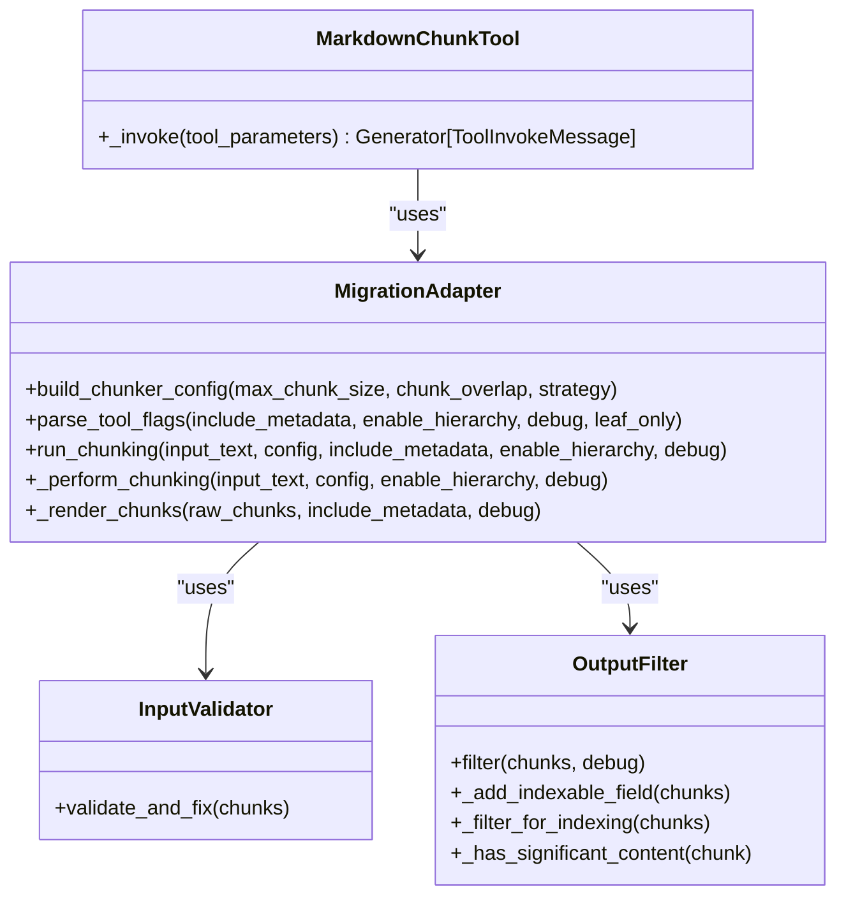
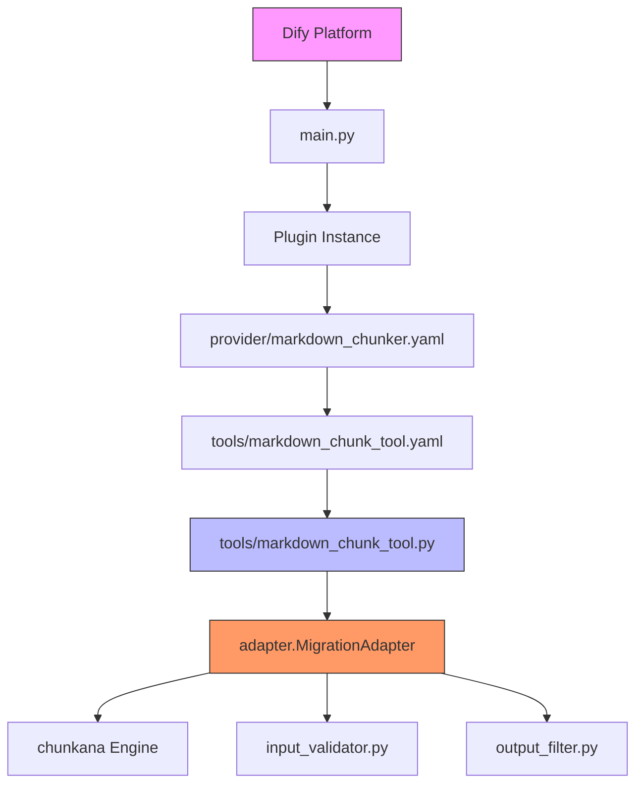
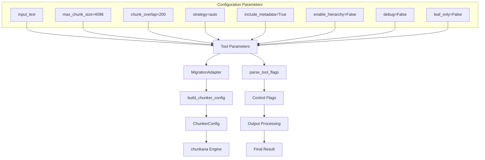
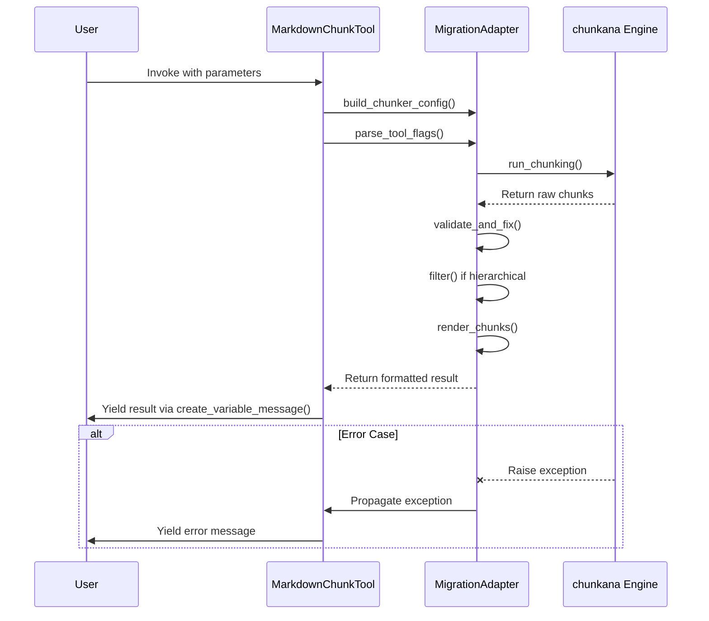

# Chunker API

<cite>
**Referenced Files in This Document**   
- [main.py](file://main.py)
- [provider/markdown_chunker.py](file://provider/markdown_chunker.py)
- [manifest.yaml](file://manifest.yaml)
- [provider/markdown_chunker.yaml](file://provider/markdown_chunker.yaml)
- [tools/markdown_chunk_tool.py](file://tools/markdown_chunk_tool.py)
- [tools/markdown_chunk_tool.yaml](file://tools/markdown_chunk_tool.yaml)
- [adapter.py](file://adapter.py)
- [input_validator.py](file://input_validator.py)
- [output_filter.py](file://output_filter.py)
</cite>

## Table of Contents
1. [Introduction](#introduction)
2. [Core Functions](#core-functions)
3. [Integration Architecture](#integration-architecture)
4. [Configuration System](#configuration-system)
5. [Usage Examples](#usage-examples)
6. [Performance Considerations](#performance-considerations)
7. [Error Handling](#error-handling)
8. [Conclusion](#conclusion)

## Introduction

The dify-markdown-chunker-1 provides an advanced API for intelligent Markdown chunking with structural awareness. This API is designed for Retrieval-Augmented Generation (RAG) systems, offering sophisticated chunking capabilities that preserve document structure while optimizing for semantic retrieval. The core interface consists of two primary functions: `chunk_text()` and `chunk_file()`, which are exposed through a Dify tool integration. The system leverages the chunkana engine through a migration adapter pattern, ensuring backward compatibility while providing enhanced features like hierarchical chunking, strategy-based processing, and rich metadata embedding. The API is designed to handle various Markdown content types including code-heavy documents, technical specifications, and complex nested structures while maintaining context integrity across chunk boundaries.

**Section sources**
- [main.py](file://main.py#L1-L38)
- [provider/markdown_chunker.py](file://provider/markdown_chunker.py#L1-L36)

## Core Functions

The core chunking interface provides two primary functions for processing Markdown content: text-based chunking and file-based chunking. These functions are implemented through the `MarkdownChunkTool` class in the Dify plugin architecture, with the actual chunking logic delegated to the chunkana engine via a migration adapter. The `chunk_text()` function accepts Markdown content directly as a string parameter, while `chunk_file()` processes content from a file path. Both functions support a comprehensive configuration object that controls chunking behavior including maximum chunk size, overlap, strategy selection, metadata inclusion, and hierarchical processing. The API returns results as either a list of chunks or a generator for streaming mode, depending on the configuration. The functions are designed to be resilient to malformed Markdown content through robust error handling and validation mechanisms that ensure graceful degradation when processing problematic input.

**Diagram sources**
- [tools/markdown_chunk_tool.py](file://tools/markdown_chunk_tool.py#L29-L126)
- [adapter.py](file://adapter.py#L43-L352)
- [input_validator.py](file://input_validator.py#L14-L46)
- [output_filter.py](file://output_filter.py#L24-L116)

**Section sources**
- [tools/markdown_chunk_tool.py](file://tools/markdown_chunk_tool.py#L29-L126)
- [adapter.py](file://adapter.py#L43-L352)

## Integration Architecture

The integration between the Dify platform and the markdown chunker follows a well-defined architecture with clear separation of concerns. The entry point is the `main.py` file, which initializes the Dify plugin with appropriate timeout settings and runs the plugin instance. The plugin references the provider configuration in `provider/markdown_chunker.yaml`, which in turn references the tool definition in `tools/markdown_chunk_tool.yaml`. This YAML file defines the input/output schema, including all parameters and their types, defaults, and descriptions. The actual implementation resides in `tools/markdown_chunk_tool.py`, where the `_invoke` method processes the tool parameters, validates input, and orchestrates the chunking process through the migration adapter. The adapter pattern ensures compatibility between the plugin interface and the underlying chunkana engine, handling parameter mapping, input validation, and output formatting. This architecture allows for seamless updates to the core chunking engine without requiring changes to the Dify integration layer.

**Diagram sources**
- [main.py](file://main.py#L21-L37)
- [provider/markdown_chunker.yaml](file://provider/markdown_chunker.yaml#L1-L23)
- [tools/markdown_chunk_tool.yaml](file://tools/markdown_chunk_tool.yaml#L1-L178)
- [tools/markdown_chunk_tool.py](file://tools/markdown_chunk_tool.py#L29-L126)
- [adapter.py](file://adapter.py#L43-L352)

**Section sources**
- [main.py](file://main.py#L21-L37)
- [provider/markdown_chunker.yaml](file://provider/markdown_chunker.yaml#L1-L23)
- [tools/markdown_chunk_tool.yaml](file://tools/markdown_chunk_tool.yaml#L1-L178)

## Configuration System

The configuration system for the markdown chunker is designed to provide fine-grained control over the chunking process while maintaining sensible defaults. Configuration is passed through the API via tool parameters defined in the `tools/markdown_chunk_tool.yaml` file, which maps to the `tool_parameters` dictionary in the `_invoke` method. The primary configuration parameters include `max_chunk_size` (default: 4096 characters), `chunk_overlap` (default: 200 characters), `strategy` (default: "auto"), `include_metadata` (default: True), `enable_hierarchy` (default: False), `debug` (default: False), and `leaf_only` (default: False). These parameters are transformed by the `MigrationAdapter` into a `ChunkerConfig` object that is compatible with the underlying chunkana engine. The adapter also handles backward compatibility by loading default configuration values from a snapshot file. The configuration system supports both flat and hierarchical chunking modes, with the latter creating parent-child relationships between chunks for multi-level retrieval scenarios.

**Diagram sources**
- [tools/markdown_chunk_tool.yaml](file://tools/markdown_chunk_tool.yaml#L23-L168)
- [adapter.py](file://adapter.py#L94-L119)
- [adapter.py](file://adapter.py#L121-L129)

**Section sources**
- [tools/markdown_chunk_tool.yaml](file://tools/markdown_chunk_tool.yaml#L23-L168)
- [adapter.py](file://adapter.py#L94-L129)

## Usage Examples

The API supports both synchronous and asynchronous processing modes for different use cases. For synchronous processing, users can call the chunking function directly and receive a complete list of chunks. For large documents or streaming scenarios, the API supports generator-based output that yields chunks as they are processed, enabling immediate consumption without waiting for the entire document to be chunked. When `include_metadata` is set to `True`, each chunk includes a metadata block with information such as content type, header path, line numbers, and strategy used. When `include_metadata` is `False`, overlap content is embedded directly in the chunk text as `previous_content + main + next_content`. The hierarchical chunking mode creates parent-child relationships between chunks, with navigation metadata including `parent_id`, `children_ids`, and `level`. The debug mode can be enabled to include all chunks (root, intermediate, and leaf) when hierarchical chunking is active, which is useful for troubleshooting and analysis.

**Diagram sources**
- [tools/markdown_chunk_tool.py](file://tools/markdown_chunk_tool.py#L47-L126)
- [adapter.py](file://adapter.py#L131-L155)

**Section sources**
- [tools/markdown_chunk_tool.py](file://tools/markdown_chunk_tool.py#L47-L126)
- [adapter.py](file://adapter.py#L131-L155)

## Performance Considerations

The chunking system is optimized for performance with large inputs through several mechanisms. The architecture employs a two-stage processing pipeline where chunking (boundary determination) is separated from rendering (formatting), ensuring that chunk boundaries are invariant to output format choices. This design allows for efficient processing of large documents by first determining optimal chunk boundaries and then applying formatting as a separate step. The system is configured with 512MB of memory allocation, which is sufficient for processing large Markdown files while preventing excessive memory usage. For extremely large documents, the system could potentially implement streaming processing to further reduce memory footprint, though this capability is not currently exposed in the public API. The chunking algorithms are designed to be CPU-efficient, with linear time complexity relative to document size. The use of precompiled patterns and optimized data structures minimizes processing overhead, making the system suitable for high-throughput scenarios in production environments.

**Section sources**
- [manifest.yaml](file://manifest.yaml#L20-L21)
- [adapter.py](file://adapter.py#L151-L155)

## Error Handling

The error handling strategy for the markdown chunker is comprehensive and follows a layered approach. At the input validation level, the system checks for required parameters and empty input, returning appropriate error messages. The core processing is wrapped in a try-except block that catches `ValueError` for validation errors and generic `Exception` for all other errors, ensuring that no unhandled exceptions escape the function. Specific error messages are returned for different failure modes: "Validation error: {details}" for input validation failures and "Error chunking document: {details}" for processing errors. The input validator performs post-processing validation on chunks from the underlying engine, setting default values for missing fields like `is_leaf` and `is_root`. The output filter also contributes to error resilience by gracefully handling missing metadata fields. This multi-layered approach ensures that the system can handle malformed Markdown content and edge cases without failing completely, providing meaningful error information for debugging and recovery.

**Section sources**
- [tools/markdown_chunk_tool.py](file://tools/markdown_chunk_tool.py#L122-L125)
- [input_validator.py](file://input_validator.py#L14-L46)
- [output_filter.py](file://output_filter.py#L24-L116)

## Conclusion

The dify-markdown-chunker-1 API provides a robust and flexible interface for intelligent Markdown chunking with structural awareness. Through its well-designed architecture, comprehensive configuration options, and resilient error handling, the system delivers reliable performance for RAG applications. The integration with Dify follows established patterns that ensure compatibility and ease of use, while the underlying chunkana engine provides advanced capabilities for preserving document structure and semantic context. The API's support for both synchronous and streaming processing modes makes it suitable for a wide range of use cases, from small document processing to large-scale knowledge base ingestion. With its focus on backward compatibility, performance optimization, and comprehensive error recovery, the chunker API represents a mature solution for Markdown content processing in AI applications.