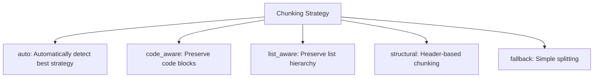
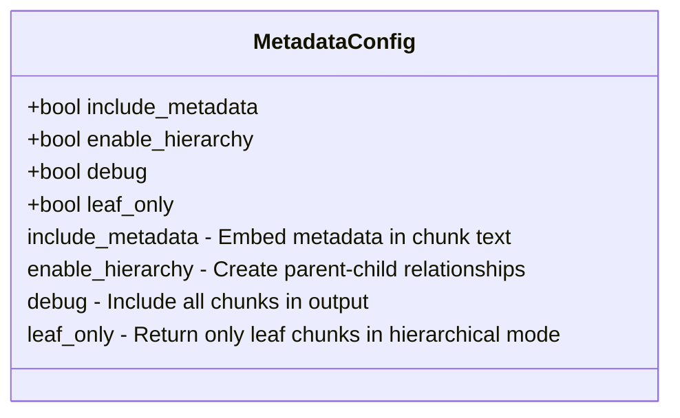
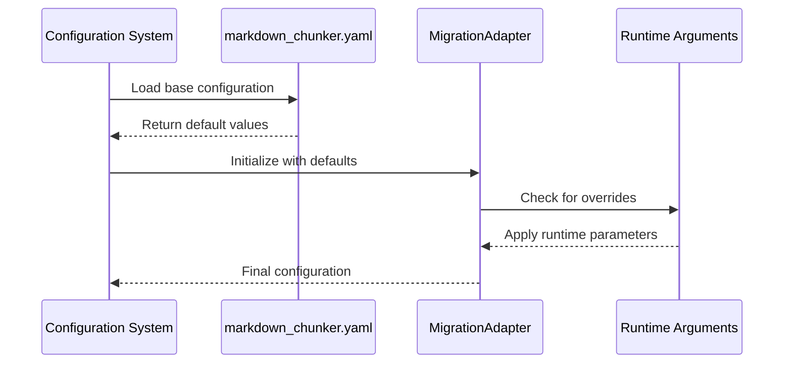
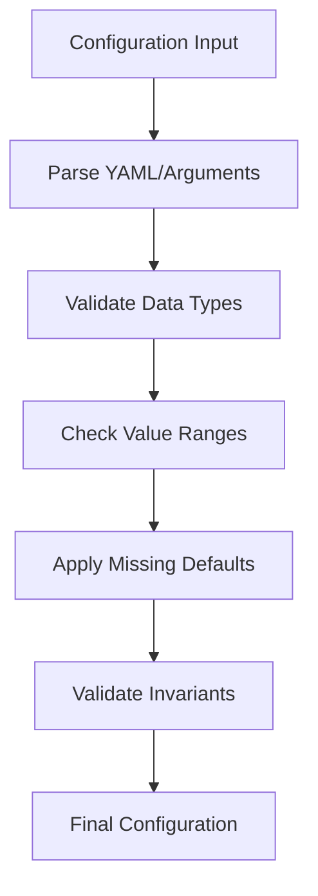
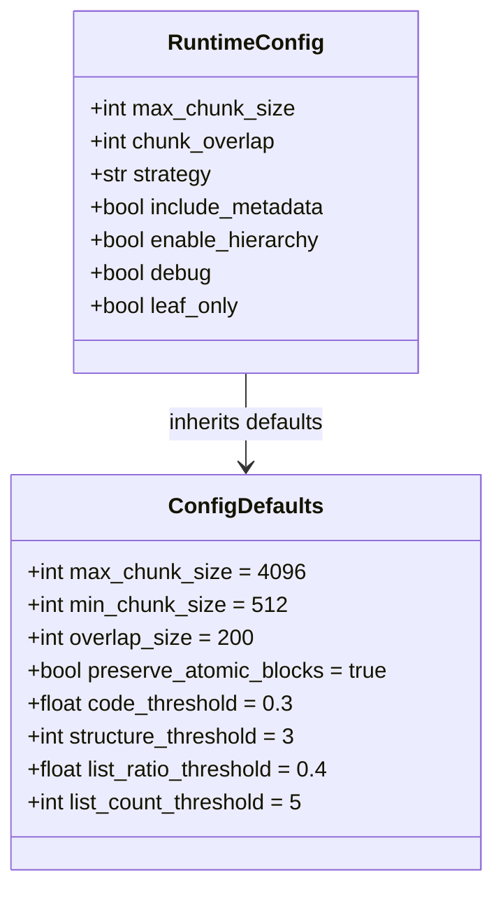
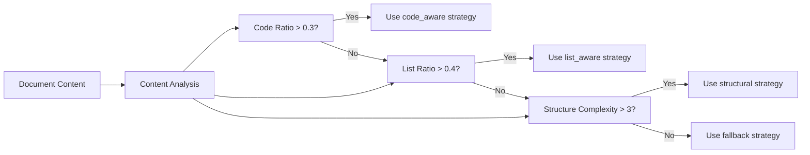
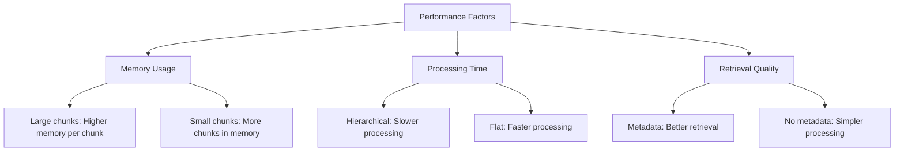
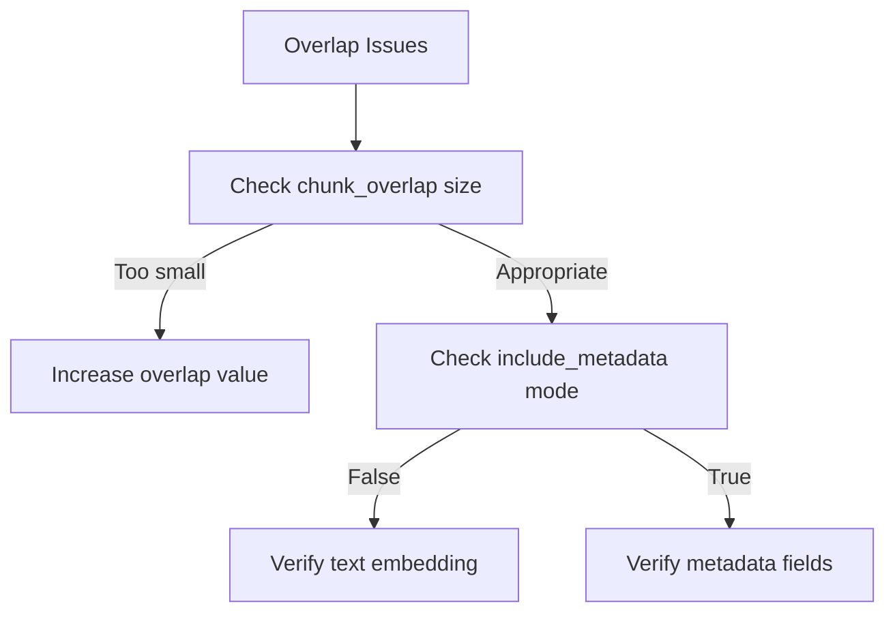

# Configuration API

<cite>
**Referenced Files in This Document**   
- [provider/markdown_chunker.yaml](file://provider/markdown_chunker.yaml)
- [tools/markdown_chunk_tool.yaml](file://tools/markdown_chunk_tool.yaml)
- [adapter.py](file://adapter.py)
- [input_validator.py](file://input_validator.py)
- [output_filter.py](file://output_filter.py)
- [tests/config_defaults_snapshot.json](file://tests/config_defaults_snapshot.json)
</cite>

## Table of Contents
1. [Introduction](#introduction)
2. [Configuration Parameters](#configuration-parameters)
3. [Configuration Loading and Override Mechanism](#configuration-loading-and-override-mechanism)
4. [Schema Validation and Default Value Inheritance](#schema-validation-and-default-value-inheritance)
5. [Configuration Profiles for Document Types](#configuration-profiles-for-document-types)
6. [Parameter-Behavior Relationship](#parameter-behavior-relationship)
7. [Optimization Guidelines](#optimization-guidelines)
8. [Troubleshooting Misconfigurations](#troubleshooting-misconfigurations)

## Introduction
The Configuration API in dify-markdown-chunker-1 provides a comprehensive system for controlling the behavior of the Advanced Markdown Chunker. This API enables users to customize chunking strategies, size thresholds, metadata options, and streaming settings to optimize document processing for various use cases. The configuration system is designed to be both flexible and robust, supporting both declarative configuration through YAML files and dynamic overrides via runtime arguments. The system leverages pydantic models for schema validation and implements a sophisticated default value inheritance mechanism to ensure consistent behavior across different deployment scenarios.

## Configuration Parameters
The configuration API exposes several key parameters that control the chunking behavior of the system. These parameters are organized into logical groups based on their functionality.

### Chunking Strategy Selection
The chunking strategy parameter determines the algorithm used to split Markdown documents into chunks. The system supports multiple strategies tailored to different document types and content structures.

**Diagram sources**
- [tools/markdown_chunk_tool.yaml](file://tools/markdown_chunk_tool.yaml#L68-L108)

**Section sources**
- [tools/markdown_chunk_tool.yaml](file://tools/markdown_chunk_tool.yaml#L68-L108)

### Size Thresholds
Size thresholds control the dimensions of the generated chunks, balancing between context preservation and processing efficiency.

| Parameter | Default Value | Description |
|---------|-------------|-------------|
| max_chunk_size | 4096 | Maximum size of each chunk in characters |
| chunk_overlap | 200 | Characters to overlap between consecutive chunks |
| min_chunk_size | 512 | Minimum size threshold for valid chunks |

**Section sources**
- [tests/config_defaults_snapshot.json](file://tests/config_defaults_snapshot.json#L4-L6)
- [adapter.py](file://adapter.py#L106-L107)

### Metadata Options
Metadata configuration parameters control the inclusion and formatting of metadata in the output chunks, enhancing retrieval capabilities in RAG systems.

**Diagram sources**
- [tools/markdown_chunk_tool.yaml](file://tools/markdown_chunk_tool.yaml#L109-L167)
- [adapter.py](file://adapter.py#L121-L130)

**Section sources**
- [tools/markdown_chunk_tool.yaml](file://tools/markdown_chunk_tool.yaml#L109-L167)

### Streaming Settings
Streaming settings control the processing and output behavior for large documents, enabling efficient handling of extensive content.

| Parameter | Default Value | Description |
|---------|-------------|-------------|
| enable_hierarchy | false | Create parent-child relationships between chunks |
| debug | false | Enable debug mode to include all chunks |
| leaf_only | false | Return only leaf chunks in hierarchical mode |

**Section sources**
- [tools/markdown_chunk_tool.yaml](file://tools/markdown_chunk_tool.yaml#L124-L167)

## Configuration Loading and Override Mechanism
The configuration system follows a hierarchical approach to loading and applying settings, with multiple layers of precedence.

### YAML Configuration Loading
The primary configuration is loaded from the markdown_chunker.yaml file in the provider directory. This file contains the default configuration that serves as the foundation for all chunking operations.

**Diagram sources**
- [provider/markdown_chunker.yaml](file://provider/markdown_chunker.yaml)
- [adapter.py](file://adapter.py#L82-L92)

**Section sources**
- [provider/markdown_chunker.yaml](file://provider/markdown_chunker.yaml)
- [adapter.py](file://adapter.py#L82-L92)

### Runtime Argument Override
Runtime arguments take precedence over YAML configuration, allowing dynamic customization of chunking behavior without modifying configuration files.

The override mechanism follows these rules:
1. Runtime arguments are processed after YAML configuration loading
2. Each runtime parameter replaces the corresponding YAML value
3. Unspecified parameters retain their YAML-defined defaults
4. Validation is performed after all overrides are applied

**Section sources**
- [adapter.py](file://adapter.py#L83-L92)
- [tools/markdown_chunk_tool.py](file://tools/markdown_chunk_tool.py#L82-L89)

## Schema Validation and Default Value Inheritance
The configuration system implements robust schema validation and a comprehensive default value inheritance mechanism to ensure reliability and consistency.

### Schema Validation Process
Configuration validation is performed using pydantic models integrated through the chunkana library. The validation process occurs in multiple stages:

**Diagram sources**
- [adapter.py](file://adapter.py#L100-L119)
- [input_validator.py](file://input_validator.py)

**Section sources**
- [adapter.py](file://adapter.py#L100-L119)
- [input_validator.py](file://input_validator.py)

### Default Value Inheritance
Default values are inherited from multiple sources in a specific priority order:

1. **Snapshot Defaults**: Pre-migration configuration snapshot provides baseline defaults
2. **YAML Configuration**: Provider YAML file can override snapshot defaults
3. **Runtime Parameters**: Runtime arguments have highest precedence

The config_defaults_snapshot.json file contains the canonical default values that ensure backward compatibility across versions.

**Diagram sources**
- [tests/config_defaults_snapshot.json](file://tests/config_defaults_snapshot.json)
- [adapter.py](file://adapter.py#L103-L112)

**Section sources**
- [tests/config_defaults_snapshot.json](file://tests/config_defaults_snapshot.json)
- [adapter.py](file://adapter.py#L103-L112)

## Configuration Profiles for Document Types
The system supports specialized configuration profiles optimized for different document types, leveraging the auto strategy detection capability.

### Code Documentation Profile
For technical documentation with extensive code examples, the code_aware strategy is recommended with adjusted thresholds.

| Parameter | Recommended Value | Rationale |
|---------|-----------------|---------|
| strategy | code_aware | Preserves code block integrity |
| max_chunk_size | 6144 | Accommodates larger code examples |
| chunk_overlap | 300 | Ensures context around code blocks |
| include_metadata | true | Enhances code context retrieval |

**Section sources**
- [adapter.py](file://adapter.py#L101-L102)
- [tools/markdown_chunk_tool.yaml](file://tools/markdown_chunk_tool.yaml#L88-L92)

### Technical Blogs Profile
For blog-style content with mixed text and code, the auto strategy with default settings typically performs optimally.

| Parameter | Recommended Value | Rationale |
|---------|-----------------|---------|
| strategy | auto | Automatically detects content patterns |
| max_chunk_size | 4096 | Balanced context and granularity |
| chunk_overlap | 200 | Standard context preservation |
| enable_hierarchy | false | Flat structure suits blog content |

**Section sources**
- [tools/markdown_chunk_tool.yaml](file://tools/markdown_chunk_tool.yaml#L71-L87)

### Research Papers Profile
For academic papers with complex structure and mathematical content, the structural strategy with hierarchical output is recommended.

| Parameter | Recommended Value | Rationale |
|---------|-----------------|---------|
| strategy | structural | Respects section hierarchy |
| enable_hierarchy | true | Preserves paper structure |
| leaf_only | true | Focuses on content chunks |
| include_metadata | true | Maintains citation context |

**Section sources**
- [tools/markdown_chunk_tool.yaml](file://tools/markdown_chunk_tool.yaml#L124-L137)

## Parameter-Behavior Relationship
The configuration parameters directly influence the chunking behavior and output characteristics of the system.

### Strategy-Content Relationship
The selected strategy adapts to content characteristics through threshold-based detection:

**Diagram sources**
- [tests/config_defaults_snapshot.json](file://tests/config_defaults_snapshot.json#L9-L12)
- [adapter.py](file://adapter.py#L101-L102)

**Section sources**
- [tests/config_defaults_snapshot.json](file://tests/config_defaults_snapshot.json#L9-L12)

### Size-Overlap Relationship
The relationship between chunk size and overlap affects context preservation and redundancy:

| max_chunk_size | chunk_overlap | Context Preservation | Redundancy | Use Case |
|---------------|--------------|---------------------|----------|---------|
| Large | Small | Moderate | Low | General purpose |
| Large | Large | High | High | Complex context |
| Small | Small | Low | Low | Granular retrieval |
| Small | Large | High | Very High | Critical context |

**Section sources**
- [tools/markdown_chunk_tool.yaml](file://tools/markdown_chunk_tool.yaml#L38-L67)

## Optimization Guidelines
Optimizing configurations requires understanding the trade-offs between different parameters and their impact on downstream applications.

### Performance Optimization
For optimal performance, consider these guidelines:

1. **Memory Usage**: Larger chunk sizes reduce the number of chunks but increase memory per chunk
2. **Processing Time**: Hierarchical chunking adds processing overhead but improves structure preservation
3. **Retrieval Quality**: Metadata inclusion enhances retrieval precision at the cost of storage

**Diagram sources**
- [adapter.py](file://adapter.py#L151-L155)
- [output_filter.py](file://output_filter.py)

**Section sources**
- [adapter.py](file://adapter.py#L151-L155)
- [output_filter.py](file://output_filter.py)

### Use Case Optimization
Tailor configurations to specific use cases:

- **Vector Database Indexing**: Use leaf_only=true to avoid indexing structural nodes
- **Content Analysis**: Use debug=true to access all chunk levels for comprehensive analysis
- **API Integration**: Use moderate chunk sizes (4096-6144) for balanced performance
- **Mobile Applications**: Use smaller chunks (2048-3072) for limited bandwidth scenarios

**Section sources**
- [tools/markdown_chunk_tool.yaml](file://tools/markdown_chunk_tool.yaml#L154-L167)
- [output_filter.py](file://output_filter.py#L49-L58)

## Troubleshooting Misconfigurations
Common configuration issues and their solutions:

### Strategy Selection Issues
**Problem**: Inappropriate strategy selection leading to poor chunk quality
**Solution**: 
1. Verify content analysis thresholds in config_defaults_snapshot.json
2. Explicitly set strategy parameter instead of relying on auto detection
3. Check code_ratio and list_ratio calculations in content analysis

**Section sources**
- [tests/config_defaults_snapshot.json](file://tests/config_defaults_snapshot.json#L9-L12)

### Overlap Configuration Issues
**Problem**: Insufficient context preservation between chunks
**Solution**:
1. Increase chunk_overlap value (typically 5-10% of max_chunk_size)
2. Ensure include_metadata=true for metadata-based overlap
3. Verify overlap implementation in _embed_overlap method

**Diagram sources**
- [adapter.py](file://adapter.py#L243-L295)
- [tools/markdown_chunk_tool.yaml](file://tools/markdown_chunk_tool.yaml#L53-L67)

**Section sources**
- [adapter.py](file://adapter.py#L243-L295)

### Hierarchical Chunking Issues
**Problem**: Unexpected chunk filtering in hierarchical mode
**Solution**:
1. Check leaf_only and debug flag interactions
2. Verify indexable field calculation in _add_indexable_field
3. Review filter logic in OutputFilter class

**Section sources**
- [output_filter.py](file://output_filter.py#L30-L58)
- [adapter.py](file://adapter.py#L188-L190)