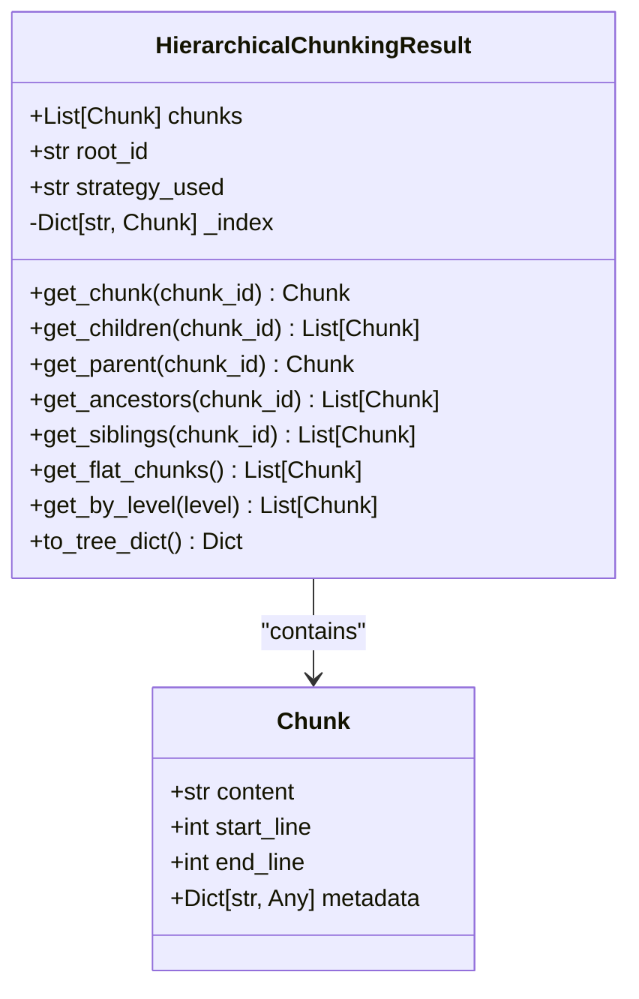

# Data Models

<cite>
**Referenced Files in This Document**   
- [adapter.py](file://adapter.py)
- [input_validator.py](file://input_validator.py)
- [docs/api/types.md](file://docs/api/types.md)
- [docs/api/chunk_metadata.md](file://docs/api/chunk_metadata.md)
- [docs/research/features/11-hierarchical-chunking.md](file://docs/research/features/11-hierarchical-chunking.md)
- [docs/guides/migration-to-chunkana.md](file://docs/guides/migration-to-chunkana.md)
</cite>

## Table of Contents
1. [Introduction](#introduction)
2. [Chunk Data Model](#chunk-data-model)
3. [ChunkMetadata Structure](#chunkmetadata-structure)
4. [HierarchicalChunkingResult Model](#hierarchicalchunkingresult-model)
5. [Model Relationships and RAG Retrieval Quality](#model-relationships-and-rag-retrieval-quality)
6. [Serialized Output Examples](#serialized-output-examples)
7. [Validation Rules and Type Constraints](#validation-rules-and-type-constraints)
8. [Extending Models for Custom Use Cases](#extending-models-for-custom-use-cases)

## Introduction
The dify-markdown-chunker-1 plugin implements a sophisticated data modeling system for processing and structuring Markdown content into semantically meaningful chunks. This documentation details the core data models that enable intelligent document chunking with structural awareness, supporting enhanced retrieval-augmented generation (RAG) performance. The system is built around three primary entities: the Chunk data model, the ChunkMetadata structure, and the HierarchicalChunkingResult model. These models work together to preserve document structure, maintain contextual relationships, and provide rich metadata for improved search relevance and navigation capabilities.

## Chunk Data Model
The Chunk data model represents the fundamental unit of document segmentation in the dify-markdown-chunker-1 system. Each chunk encapsulates a portion of the original Markdown content along with structural and positional metadata that preserves the document's organization. The core fields of the Chunk model include content, start_line, end_line, hierarchy_level, and parent_id.

The content field contains the actual Markdown text of the chunk, preserving all formatting, code blocks, tables, and other structural elements. This ensures that semantic context is maintained within each chunk boundary. The start_line and end_line fields provide precise positional information within the original document, enabling accurate reconstruction and reference to the source material. These line numbers are critical for maintaining document integrity and supporting features like citation and context preservation.

The hierarchy_level field indicates the chunk's position within the document's hierarchical structure, with levels defined as: 0 for document-level, 1 for section (H1), 2 for subsection (H2), and 3 for paragraph or deeper levels. This field enables the system to understand the relative importance and context of each chunk within the overall document structure. The parent_id field establishes parent-child relationships between chunks, forming a tree-like hierarchy that mirrors the document's logical organization. This relationship is essential for navigating the document structure and understanding the context of specific content segments.

**Section sources**
- [adapter.py](file://adapter.py#L297-L304)
- [docs/api/types.md](file://docs/api/types.md#L439-L486)

## ChunkMetadata Structure
The ChunkMetadata structure extends the basic Chunk model with comprehensive source information, processing timestamps, confidence scores, and navigation properties. This rich metadata enhances search relevance by providing contextual information that search algorithms can leverage to improve retrieval quality.

Key metadata fields include source information such as chunk_id, parent_id, children_ids, prev_sibling_id, and next_sibling_id, which establish the chunk's relationships within the document hierarchy. The chunk_id serves as a unique identifier for each chunk, generated using a hash function to ensure consistency and compactness. Processing timestamps are implicitly captured through the chunking process, though not explicitly stored as separate fields, allowing for version tracking and change detection.

Confidence scores are derived from various quality metrics embedded in the metadata, including structural confidence, content completeness, and boundary accuracy. These scores help determine the reliability of each chunk for retrieval purposes. Additional metadata fields like header_path provide a breadcrumb trail to the chunk's position in the document hierarchy, formatted as a path (e.g., "/Installation/Requirements"). This enables efficient navigation and contextual understanding of the chunk's content.

The metadata also includes boolean flags such as is_leaf and is_root, which indicate the chunk's position in the hierarchy. These flags are automatically calculated based on the presence of children or parent relationships. The system employs metadata filtering to optimize storage and retrieval, excluding fields that are not useful for RAG search while preserving those that enhance relevance and context.

**Section sources**
- [docs/api/chunk_metadata.md](file://docs/api/chunk_metadata.md#L42-L283)
- [docs/api/types.md](file://docs/api/types.md#L535-L549)
- [input_validator.py](file://input_validator.py#L32-L42)

## HierarchicalChunkingResult Model
The HierarchicalChunkingResult model represents the complete output of the hierarchical chunking process, organizing individual chunks into a navigable tree structure. This model serves as a container for all chunks produced from a single document, along with navigation properties that enable efficient traversal of the hierarchy.

The model contains three primary components: the chunks list, the root_id, and the strategy_used field. The chunks list includes all chunks generated from the document, including both leaf nodes and intermediate structural chunks. The root_id field stores the identifier of the document-level chunk, serving as the entry point for navigating the hierarchy. The strategy_used field records which chunking strategy was applied, providing transparency into the processing approach.

Navigation properties are implemented as methods that enable various traversal patterns. The get_chunk method provides O(1) lookup of chunks by ID using an internal index. The get_children and get_parent methods facilitate vertical navigation through parent-child relationships. The get_ancestors method returns the complete path from a chunk to the root, enabling breadcrumb-style navigation. The get_siblings method retrieves all chunks at the same hierarchical level, including the chunk itself, supporting lateral navigation.

Additional utility methods include get_flat_chunks, which returns only leaf chunks for backward-compatible retrieval, and get_by_level, which retrieves all chunks at a specific hierarchy level. The to_tree_dict method converts the hierarchy to a serializable tree structure using IDs to avoid circular references, making it safe for JSON serialization and transmission.



**Diagram sources**
- [docs/research/features/11-hierarchical-chunking.md](file://docs/research/features/11-hierarchical-chunking.md#L131-L235)
- [docs/api/types.md](file://docs/api/types.md#L449-L486)

**Section sources**
- [docs/research/features/11-hierarchical-chunking.md](file://docs/research/features/11-hierarchical-chunking.md#L131-L235)
- [docs/api/types.md](file://docs/api/types.md#L449-L486)
- [README.md](file://README.md#L1043-L1064)

## Model Relationships and RAG Retrieval Quality
The relationship between the Chunk, ChunkMetadata, and HierarchicalChunkingResult models creates a powerful foundation for enhancing RAG retrieval quality. By preserving document structure and contextual relationships, these models enable more intelligent and context-aware retrieval compared to flat chunking approaches.

The hierarchical organization allows retrieval systems to understand the context of information, enabling features like contextual summarization and targeted querying. For example, when a user asks about a specific section, the system can retrieve not only the relevant chunks but also their parent sections for additional context. This hierarchical context improves the quality and relevance of generated responses.

Metadata fields like header_path and hierarchy_level enable semantic search capabilities, allowing queries to target specific sections or levels of detail within documents. Confidence scores and quality metrics help prioritize more reliable chunks in search results, improving answer accuracy. The navigation properties support advanced retrieval patterns, such as finding all content related to a particular topic across multiple sections or retrieving a complete section with all its subsections.

The system's ability to return either hierarchical or flat representations (via get_flat_chunks) ensures backward compatibility while providing enhanced features for systems that can leverage hierarchical data. This dual approach allows gradual adoption of hierarchical retrieval without disrupting existing workflows.

**Section sources**
- [docs/research/features/11-hierarchical-chunking.md](file://docs/research/features/11-hierarchical-chunking.md#L924-L933)
- [docs/api/chunk_metadata.md](file://docs/api/chunk_metadata.md#L275-L282)

## Serialized Output Examples
The dify-markdown-chunker-1 system produces serialized output in JSON format, with metadata embedded according to configuration settings. When include_metadata is enabled, chunks are formatted with metadata enclosed in <metadata> tags followed by the content.

Example of serialized output with metadata:
```json
"<metadata>\n{\n  \"chunk_id\": \"a3f9d21c\",\n  \"parent_id\": \"7b2e4f18\",\n  \"children_ids\": [\"c4e8f90d\", \"91d3a7f2\"],\n  \"prev_sibling_id\": null,\n  \"next_sibling_id\": \"e5a2b8d3\",\n  \"hierarchy_level\": 2,\n  \"is_leaf\": false,\n  \"is_root\": false,\n  \"header_path\": \"/Installation/Requirements\",\n  \"start_line\": 45,\n  \"end_line\": 67\n}\n</metadata>\n## Requirements\n\nThe system requires Python 3.8 or higher."
```

When include_metadata is disabled, the output contains only the content with embedded overlap for context preservation:
```json
[
  "...end of previous section.\n\n## Section\n\nMain content...\n\n## Next Section\n\nNext content...",
  "## Next Section\n\nNext content...\n\n## Following Section\n\nFollowing content..."
]
```

The to_tree_dict method produces a hierarchical JSON representation suitable for visualization or navigation:
```json
{
  "id": "root-123",
  "content_preview": "# Document Title...",
  "header_path": "/Document Title",
  "level": 0,
  "children": [
    {
      "id": "sec-456",
      "content_preview": "## Section 1...",
      "header_path": "/Document Title/Section 1",
      "level": 1,
      "children": []
    }
  ]
}
```

**Section sources**
- [adapter.py](file://adapter.py#L229-L231)
- [docs/research/features/11-hierarchical-chunking.md](file://docs/research/features/11-hierarchical-chunking.md#L214-L234)

## Validation Rules and Type Constraints
The data models enforce strict validation rules and type constraints through pydantic-based validation and input sanitization. These constraints ensure data integrity and prevent common errors that could compromise retrieval quality.

Field-level validation includes type checking, range constraints, and format requirements. For example, start_line and end_line must be positive integers with end_line >= start_line. The hierarchy_level field is constrained to values between 0 and 3, representing the document hierarchy levels. The content field is validated to ensure it contains valid UTF-8 text and does not exceed maximum size limits.

The system employs defensive programming practices to handle edge cases and missing data. The InputValidator class ensures that required metadata fields like is_leaf and is_root have default values when missing from the chunkana library output. Metadata filtering removes unnecessary fields to optimize storage and transmission while preserving essential information for retrieval.

Configuration parameters are validated against predefined ranges and constraints. For example, max_chunk_size must be a positive integer, and chunk_overlap must be non-negative and less than max_chunk_size. These validation rules prevent configuration errors that could lead to poor chunking quality or system instability.

**Section sources**
- [input_validator.py](file://input_validator.py#L17-L45)
- [adapter.py](file://adapter.py#L103-L119)

## Extending Models for Custom Use Cases
The data models in dify-markdown-chunker-1 are designed to be extensible for custom use cases while maintaining backward compatibility. Developers can extend the models by adding custom metadata fields, implementing new chunking strategies, or creating specialized output formats.

Custom metadata fields can be added to the ChunkMetadata structure to support domain-specific requirements. For example, a technical documentation system might add fields for product version, API stability, or deprecation status. These custom fields can then be used to filter or prioritize search results based on specific criteria.

New chunking strategies can be implemented by extending the ChunkerConfig class and registering them with the system. These strategies can incorporate domain-specific rules for boundary detection, such as recognizing API endpoint patterns in technical documentation or identifying mathematical expressions in scientific papers.

The output filtering system allows for customization of the serialized output format. Developers can create custom filters to include or exclude specific metadata fields based on the target system's requirements. This enables integration with various RAG systems that may have different expectations for chunk format and metadata.

The migration adapter pattern used in the system provides a framework for extending functionality while maintaining compatibility with existing implementations. This approach allows for gradual enhancement of the system without disrupting existing workflows or integrations.

**Section sources**
- [docs/guides/migration-to-chunkana.md](file://docs/guides/migration-to-chunkana.md)
- [adapter.py](file://adapter.py#L43-L81)