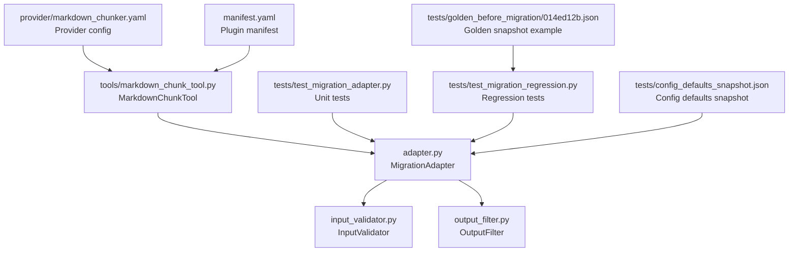
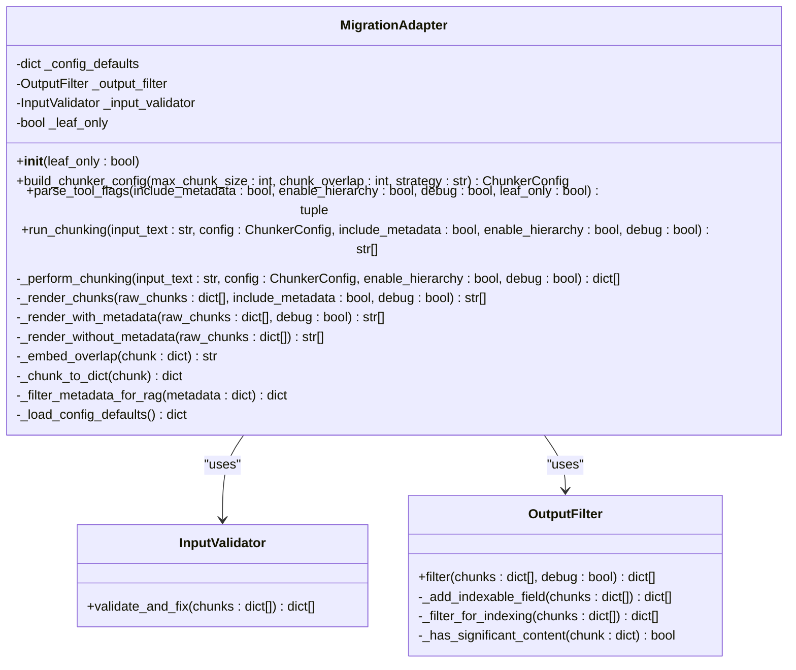
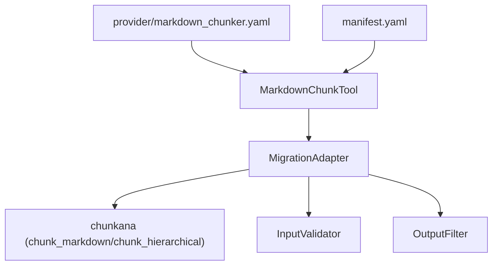

# Migration API

<cite>
**Referenced Files in This Document**
- [adapter.py](file://adapter.py)
- [input_validator.py](file://input_validator.py)
- [output_filter.py](file://output_filter.py)
- [tests/test_migration_adapter.py](file://tests/test_migration_adapter.py)
- [tests/test_migration_regression.py](file://tests/test_migration_regression.py)
- [tests/config_defaults_snapshot.json](file://tests/config_defaults_snapshot.json)
- [tests/golden_before_migration/014ed12b.json](file://tests/golden_before_migration/014ed12b.json)
- [tools/markdown_chunk_tool.py](file://tools/markdown_chunk_tool.py)
- [provider/markdown_chunker.yaml](file://provider/markdown_chunker.yaml)
- [manifest.yaml](file://manifest.yaml)
</cite>

## Table of Contents
1. [Introduction](#introduction)
2. [Project Structure](#project-structure)
3. [Core Components](#core-components)
4. [Architecture Overview](#architecture-overview)
5. [Detailed Component Analysis](#detailed-component-analysis)
6. [Dependency Analysis](#dependency-analysis)
7. [Performance Considerations](#performance-considerations)
8. [Troubleshooting Guide](#troubleshooting-guide)
9. [Conclusion](#conclusion)
10. [Appendices](#appendices)

## Introduction
This document explains the migration API provided by the migration adapter in dify-markdown-chunker-1. The adapter enables seamless migration from legacy chunking behavior to the chunkana engine while preserving backward compatibility. It converts legacy chunking results and parameters into the new chunkana format, manages metadata filtering for RAG, embeds overlap context when metadata is disabled, and ensures hierarchical chunking compatibility.

The migration adapter is used by the Dify plugin’s tool to expose a familiar interface while leveraging chunkana’s advanced chunking capabilities. Validation and filtering layers ensure robustness and consistent output across environments.

## Project Structure
The migration adapter lives in the adapter module and integrates with input validation and output filtering utilities. Tests validate migration behavior and regression against historical snapshots.

**Diagram sources**
- [adapter.py](file://adapter.py#L1-L352)
- [input_validator.py](file://input_validator.py#L1-L46)
- [output_filter.py](file://output_filter.py#L1-L116)
- [tools/markdown_chunk_tool.py](file://tools/markdown_chunk_tool.py#L1-L126)
- [provider/markdown_chunker.yaml](file://provider/markdown_chunker.yaml#L1-L23)
- [manifest.yaml](file://manifest.yaml#L1-L49)
- [tests/test_migration_adapter.py](file://tests/test_migration_adapter.py#L1-L189)
- [tests/test_migration_regression.py](file://tests/test_migration_regression.py#L73-L111)
- [tests/config_defaults_snapshot.json](file://tests/config_defaults_snapshot.json#L1-L22)
- [tests/golden_before_migration/014ed12b.json](file://tests/golden_before_migration/014ed12b.json#L1-L30)

**Section sources**
- [adapter.py](file://adapter.py#L1-L352)
- [tools/markdown_chunk_tool.py](file://tools/markdown_chunk_tool.py#L1-L126)
- [provider/markdown_chunker.yaml](file://provider/markdown_chunker.yaml#L1-L23)
- [manifest.yaml](file://manifest.yaml#L1-L49)

## Core Components
- MigrationAdapter: Orchestrates migration from legacy chunking to chunkana, including parameter mapping, chunking, rendering, and filtering.
- InputValidator: Ensures chunk metadata contains required fields and applies defaults for missing keys.
- OutputFilter: Filters hierarchical chunks for downstream consumers, respecting indexability semantics.

Key responsibilities:
- Parameter mapping from tool parameters to chunkana configuration.
- Two-stage processing: chunking (boundary-invariant) and rendering (format-dependent).
- Metadata filtering for RAG and overlap embedding when metadata is disabled.
- Backward compatibility with legacy workflows and snapshot validation.

**Section sources**
- [adapter.py](file://adapter.py#L43-L352)
- [input_validator.py](file://input_validator.py#L14-L46)
- [output_filter.py](file://output_filter.py#L16-L116)

## Architecture Overview
The migration adapter sits between the Dify tool and the chunkana library. It validates inputs, builds a chunker configuration, performs chunking, renders outputs with or without metadata, and filters hierarchical results.

```mermaid
sequenceDiagram
participant Tool as "MarkdownChunkTool"
participant Adapter as "MigrationAdapter"
participant Validator as "InputValidator"
participant Filter as "OutputFilter"
participant Chunkana as "chunkana (chunk_markdown/chunk_hierarchical)"
Tool->>Adapter : build_chunker_config(max_chunk_size, chunk_overlap, strategy)
Adapter-->>Tool : ChunkerConfig
Tool->>Adapter : parse_tool_flags(include_metadata, enable_hierarchy, debug, leaf_only)
Adapter-->>Tool : flags
Tool->>Adapter : run_chunking(input_text, config, include_metadata, enable_hierarchy, debug)
Adapter->>Chunkana : chunk_markdown or chunk_hierarchical
Chunkana-->>Adapter : raw_chunks (list of dicts)
Adapter->>Validator : validate_and_fix(raw_chunks)
Validator-->>Adapter : validated_chunks
Adapter->>Filter : filter(validated_chunks, debug)
Filter-->>Adapter : filtered_chunks
Adapter->>Adapter : _render_chunks(filtered_chunks, include_metadata, debug)
Adapter-->>Tool : formatted_result (list of strings)
```

**Diagram sources**
- [tools/markdown_chunk_tool.py](file://tools/markdown_chunk_tool.py#L66-L120)
- [adapter.py](file://adapter.py#L94-L208)
- [input_validator.py](file://input_validator.py#L17-L46)
- [output_filter.py](file://output_filter.py#L30-L59)

## Detailed Component Analysis

### MigrationAdapter
Purpose:
- Provide a compatibility layer between legacy plugin behavior and the chunkana engine.
- Maintain exact behavioral compatibility while exposing enhanced features.

Key methods and responsibilities:
- build_chunker_config: Maps tool parameters to chunkana configuration, including strategy override and overlap handling.
- parse_tool_flags: Extracts control flags from tool parameters.
- run_chunking: Two-stage pipeline: chunking (boundary-invariant) and rendering (format-dependent).
- _perform_chunking: Calls chunkana, normalizes results, validates, and filters hierarchical results.
- _render_chunks: Formats output either with metadata blocks or with embedded overlap content.
- _render_with_metadata: Produces dify-style metadata blocks and content.
- _render_without_metadata: Embeds previous/next context into each chunk string.
- _embed_overlap: Safely combines previous/next content with current content.
- _filter_metadata_for_rag: Keeps only RAG-relevant metadata fields.
- _chunk_to_dict: Converts chunkana chunk objects to dictionaries.
- _load_config_defaults: Loads pre-migration defaults from snapshot for consistency.

Compatibility and defaults:
- Loads defaults from a snapshot to preserve legacy behavior.
- Excludes unsupported parameters (e.g., enable_overlap) during config construction.
- Maintains boundary invariance: chunk boundaries do not depend on include_metadata.

Edge-case handling:
- Graceful fallback in overlap embedding when metadata is malformed.
- Defaults for missing is_leaf/is_root metadata.
- Filtering for hierarchical mode prevents indexing of root and optionally non-significant internal nodes.

**Section sources**
- [adapter.py](file://adapter.py#L71-L352)
- [tests/config_defaults_snapshot.json](file://tests/config_defaults_snapshot.json#L1-L22)

#### Class Diagram

**Diagram sources**
- [adapter.py](file://adapter.py#L71-L352)
- [input_validator.py](file://input_validator.py#L14-L46)
- [output_filter.py](file://output_filter.py#L16-L116)

### Conversion Functions and Parameters
- build_chunker_config:
  - Parameters: max_chunk_size, chunk_overlap, strategy.
  - Behavior: Merges defaults from snapshot, sets strategy_override to None for “auto”, excludes unsupported parameters, and returns a ChunkerConfig.
  - Notes: legacy parameter enable_overlap is ignored; overlap is controlled via overlap_size.

- parse_tool_flags:
  - Parameters: include_metadata, enable_hierarchy, debug, leaf_only.
  - Behavior: Returns a tuple of flags consumed by run_chunking.

- run_chunking:
  - Parameters: input_text, config, include_metadata, enable_hierarchy, debug.
  - Behavior: Performs chunking via chunkana, validates and filters results, then renders according to include_metadata.

- _render_chunks:
  - With metadata: Produces <metadata> blocks containing filtered metadata plus content.
  - Without metadata: Emits concatenated strings with embedded overlap content.

- _filter_metadata_for_rag:
  - Removes statistical and execution-related fields; excludes is_leaf/is_root; prunes false-valued has_/is_ fields.

- _embed_overlap:
  - Safely concatenates previous_content, content, and next_content with markdown separators; falls back to content on errors.

**Section sources**
- [adapter.py](file://adapter.py#L94-L208)
- [tests/test_migration_adapter.py](file://tests/test_migration_adapter.py#L16-L189)

### Structural Differences and Deprecated Fields
- Legacy vs. new format:
  - Legacy: Metadata was embedded as part of the chunk string with a dedicated metadata block.
  - New: Metadata is filtered and embedded only when include_metadata is True; otherwise overlap is embedded directly into the chunk string.
- Deprecated fields:
  - enable_overlap: Removed; overlap handled via overlap_size.
  - Statistical and preview fields: Filtered out for RAG-friendly outputs.
  - Execution fields: Removed to avoid noise in downstream systems.

Validation and defaults:
- Missing is_leaf/is_root defaults are injected to ensure hierarchical filtering works consistently.

**Section sources**
- [adapter.py](file://adapter.py#L114-L119)
- [adapter.py](file://adapter.py#L306-L348)
- [input_validator.py](file://input_validator.py#L17-L46)

### Examples of Migration: Before/After Comparison
- Before migration (legacy):
  - Output contained metadata blocks and preserved legacy metadata fields.
  - Example snapshot shows a metadata block with fields like strategy, content_type, chunk_index, header_path, start_line, end_line.
- After migration (chunkana-powered):
  - Same chunk boundaries and content preserved.
  - Metadata filtered for RAG; overlap embedded when metadata is disabled.
  - Hierarchical mode supported with leaf-only filtering and indexable semantics.

Validation:
- Regression tests compare adapter output against golden snapshots to ensure behavioral parity.

**Section sources**
- [tests/golden_before_migration/014ed12b.json](file://tests/golden_before_migration/014ed12b.json#L1-L30)
- [tests/test_migration_regression.py](file://tests/test_migration_regression.py#L73-L111)

### Compatibility Layer
- Full backward compatibility:
  - Tool parameters remain unchanged; adapter maps them to chunkana configuration.
  - Snapshot defaults ensure identical behavior across versions.
  - Legacy import alias maintained for tests.
- Hierarchical chunking:
  - Root chunks excluded; leaf-only mode supported; non-leaf chunks with significant content included when configured.
- Output filtering:
  - Indexable field respects library-provided values; non-leaf chunks may be included if they contain meaningful content.

**Section sources**
- [adapter.py](file://adapter.py#L71-L119)
- [output_filter.py](file://output_filter.py#L30-L116)
- [tests/test_migration_adapter.py](file://tests/test_migration_adapter.py#L146-L189)

### Data Integrity and Edge Cases
- Data integrity:
  - Boundary invariance: chunk boundaries are independent of include_metadata.
  - Validation: Missing metadata fields defaulted; warnings logged for missing is_leaf.
  - Filtering: Hierarchical results sanitized for downstream consumers.
- Edge cases:
  - Corrupted metadata: overlap embedding falls back to content-only.
  - Empty chunks: Rendered as empty strings; overlap embedding returns empty when no parts exist.
  - Debug mode: Hierarchical mode returns more chunks (intermediate nodes) for inspection.

**Section sources**
- [adapter.py](file://adapter.py#L141-L156)
- [adapter.py](file://adapter.py#L243-L296)
- [input_validator.py](file://input_validator.py#L17-L46)
- [output_filter.py](file://output_filter.py#L43-L59)

## Dependency Analysis
The adapter depends on:
- chunkana: chunk_markdown and chunk_hierarchical for core chunking.
- InputValidator: Validates and normalizes chunk metadata.
- OutputFilter: Filters hierarchical results for indexing.

Integration points:
- Tool invocation: MarkdownChunkTool extracts parameters and delegates to MigrationAdapter.
- Provider configuration: Tool is wired via provider/markdown_chunker.yaml.
- Plugin manifest: Declares tool and runtime environment.

**Diagram sources**
- [tools/markdown_chunk_tool.py](file://tools/markdown_chunk_tool.py#L47-L120)
- [adapter.py](file://adapter.py#L94-L208)
- [input_validator.py](file://input_validator.py#L14-L46)
- [output_filter.py](file://output_filter.py#L16-L116)
- [provider/markdown_chunker.yaml](file://provider/markdown_chunker.yaml#L17-L23)
- [manifest.yaml](file://manifest.yaml#L28-L41)

**Section sources**
- [tools/markdown_chunk_tool.py](file://tools/markdown_chunk_tool.py#L47-L120)
- [provider/markdown_chunker.yaml](file://provider/markdown_chunker.yaml#L17-L23)
- [manifest.yaml](file://manifest.yaml#L28-L41)

## Performance Considerations
- Bulk migration operations:
  - Prefer hierarchical mode with leaf_only enabled to reduce indexing volume.
  - Reduce max_chunk_size and disable overlap for smaller, more manageable chunks.
  - Disable debug mode in production to avoid returning intermediate hierarchical nodes.
- Memory usage:
  - Process large documents in batches or use streaming approaches when applicable.
  - Avoid accumulating all chunks in memory; emit results incrementally where possible.
- Strategy selection:
  - Use faster strategies for large-scale migrations.
  - Disable advanced features (e.g., code context binding) when not needed.

[No sources needed since this section provides general guidance]

## Troubleshooting Guide
Common issues and resolutions:
- Unexpected chunk counts in hierarchical mode:
  - Verify leaf_only flag and debug mode; debug mode intentionally returns more chunks.
- Missing is_leaf warnings:
  - Indicates missing metadata; defaults are applied automatically.
- Metadata not appearing:
  - Ensure include_metadata is True; otherwise overlap is embedded in the chunk content.
- Legacy import errors:
  - Replace legacy imports with adapter import and update method calls to run_chunking.

Validation references:
- Unit tests confirm metadata filtering and chunking behavior.
- Regression tests compare against golden snapshots to ensure parity.

**Section sources**
- [tests/test_migration_adapter.py](file://tests/test_migration_adapter.py#L67-L104)
- [tests/test_migration_adapter.py](file://tests/test_migration_adapter.py#L104-L189)
- [tests/test_migration_regression.py](file://tests/test_migration_regression.py#L73-L111)

## Conclusion
The migration adapter provides a robust, backward-compatible bridge from legacy chunking to the chunkana engine. It preserves chunk boundaries, normalizes metadata for RAG, embeds overlap content when needed, and filters hierarchical results for downstream consumers. Tests validate both functional correctness and behavioral parity with historical outputs, ensuring smooth migration for existing workflows.

[No sources needed since this section summarizes without analyzing specific files]

## Appendices

### API Reference: MigrationAdapter
- build_chunker_config(max_chunk_size=4096, chunk_overlap=200, strategy="auto") -> ChunkerConfig
- parse_tool_flags(include_metadata=True, enable_hierarchy=False, debug=False, leaf_only=False) -> tuple
- run_chunking(input_text, config, include_metadata=True, enable_hierarchy=False, debug=False) -> list[str]
- _filter_metadata_for_rag(metadata) -> dict
- _embed_overlap(chunk) -> str

**Section sources**
- [adapter.py](file://adapter.py#L94-L208)
- [adapter.py](file://adapter.py#L306-L348)
- [adapter.py](file://adapter.py#L243-L296)

### Integration Points
- Tool invocation: MarkdownChunkTool constructs adapter, builds config, parses flags, and runs chunking.
- Provider and manifest: Tool is declared and executed within the Dify plugin runtime.

**Section sources**
- [tools/markdown_chunk_tool.py](file://tools/markdown_chunk_tool.py#L66-L120)
- [provider/markdown_chunker.yaml](file://provider/markdown_chunker.yaml#L17-L23)
- [manifest.yaml](file://manifest.yaml#L28-L41)