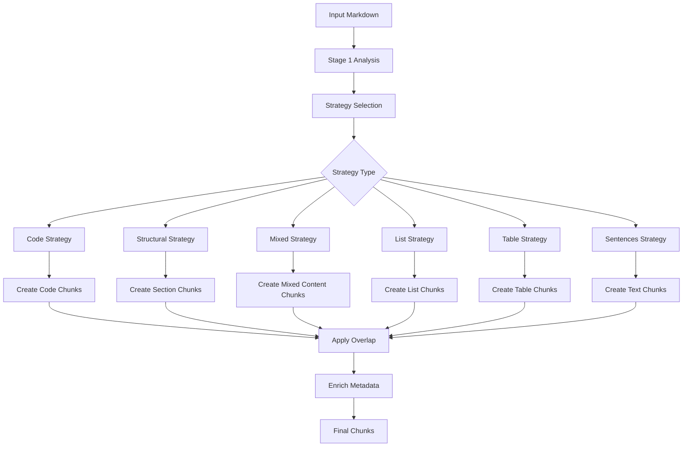

# Chunk

<cite>
**Referenced Files in This Document**   
- [types.py](file://markdown_chunker/chunker/types.py)
- [core.py](file://markdown_chunker/chunker/core.py)
- [mixed_strategy.py](file://markdown_chunker/chunker/strategies/mixed_strategy.py)
- [structural_strategy.py](file://markdown_chunker/chunker/strategies/structural_strategy.py)
- [basic_usage.py](file://examples/basic_usage.py)
- [rag_integration.py](file://examples/rag_integration.py)
- [manual-test-result.md](file://manual-tests-result/manual-test-result.md)
</cite>

## Table of Contents
1. [Introduction](#introduction)
2. [Core Fields](#core-fields)
3. [Properties](#properties)
4. [Utility Methods](#utility-methods)
5. [Chunk Creation Process](#chunk-creation-process)
6. [Metadata Enrichment](#metadata-enrichment)
7. [RAG and Search Applications](#rag-and-search-applications)
8. [Examples](#examples)

## Introduction
The Chunk dataclass is the fundamental unit of content representation in the markdown-chunker system. It encapsulates a semantically meaningful fragment of a Markdown document with its content, positional information, and rich metadata. Each Chunk preserves context and structure while fitting within configurable size constraints, making it ideal for downstream applications like retrieval-augmented generation (RAG) and semantic search.

**Section sources**
- [types.py](file://markdown_chunker/chunker/types.py#L36-L48)

## Core Fields
The Chunk dataclass contains four core fields that define its fundamental characteristics:

**content**: The actual text content of the chunk as a string. This contains the Markdown text that the chunk represents, preserving all formatting and structure within its boundaries.

**start_line**: An integer representing the starting line number in the original document (1-based indexing). This provides positional context for where the chunk begins in the source document.

**end_line**: An integer representing the ending line number in the original document. This must be greater than or equal to start_line, defining the inclusive range of lines the chunk spans.

**metadata**: A dictionary containing additional information about the chunk. This field uses a default factory to ensure each chunk has its own independent metadata dictionary. The metadata stores various properties and characteristics that describe the chunk's content, type, and processing context.

These fields are validated during initialization to ensure data integrity. The validation checks that start_line is at least 1, end_line is not less than start_line, and content is not empty or whitespace-only.

**Section sources**
- [types.py](file://markdown_chunker/chunker/types.py#L45-L57)

## Properties
The Chunk class provides several computed properties that offer convenient access to derived information:

### size
Returns the number of characters in the chunk's content. This property is calculated as the length of the content string and is useful for determining chunk size for processing constraints.

```python
@property
def size(self) -> int:
    return len(self.content)
```

### line_count
Calculates the number of lines spanned by the chunk using the formula `end_line - start_line + 1`. This provides a quick way to determine the vertical extent of the chunk in the original document.

```python
@property
def line_count(self) -> int:
    return self.end_line - self.start_line + 1
```

### content_type
Returns the type of content in the chunk from the metadata, defaulting to "text" if not specified. Common values include "code", "text", "list", "table", and "mixed". This property helps applications quickly identify the nature of the chunk's content.

```python
@property
def content_type(self) -> str:
    return self.metadata.get("content_type", "text")
```

### strategy
Returns the chunking strategy used to create this chunk from the metadata, defaulting to "unknown" if not set. This indicates whether the chunk was created using the code, structural, sentences, list, table, or mixed strategy.

```python
@property
def strategy(self) -> str:
    return self.metadata.get("strategy", "unknown")
```

### language
Returns the programming language identifier for code chunks, or None if not applicable. For code blocks with language specification (e.g., ```python), this property contains the language name like "python", "javascript", or "rust".

```python
@property
def language(self) -> Optional[str]:
    return self.metadata.get("language")
```

### is_oversize
Indicates whether the chunk exceeds normal size limits. Returns True if the chunk was allowed to exceed max_chunk_size, typically for indivisible elements like large code blocks or tables that cannot be split without losing meaning.

```python
@property
def is_oversize(self) -> bool:
    return self.metadata.get("allow_oversize", False)
```

### section_path
Returns a list of header texts forming the hierarchical path to this chunk's section. This property provides semantic context by showing the document structure leading to the chunk's location, such as ["Chapter 1", "Introduction", "Background"].

```python
def get_section_path(self) -> List[str]:
    return self.metadata.get("section_path", [])
```

### source_range
Returns a tuple of (start_offset, end_offset) representing the character position range in the source document. This provides byte-level precision for locating the chunk within the original text, complementing the line-based positioning.

```python
def get_source_range(self) -> tuple[int, int]:
    return (
        self.metadata.get("start_offset", 0),
        self.metadata.get("end_offset", 0)
    )
```

### section_id
Returns a stable identifier for the section containing this chunk, typically as a URL-friendly slug. This provides a consistent way to reference document sections across processing runs.

```python
def get_section_id(self) -> str:
    return self.metadata.get("section_id", "")
```

**Section sources**
- [types.py](file://markdown_chunker/chunker/types.py#L60-L257)

## Utility Methods
The Chunk class provides several utility methods for metadata manipulation and serialization:

### add_metadata()
Adds a key-value pair to the chunk's metadata dictionary. This method allows dynamic enrichment of chunk information during processing.

```python
def add_metadata(self, key: str, value: Any) -> None:
    self.metadata[key] = value
```

### get_metadata()
Retrieves a metadata value with an optional default. This method safely accesses metadata values, returning the specified default (None by default) if the key doesn't exist.

```python
def get_metadata(self, key: str, default: Any = None) -> Any:
    return self.metadata.get(key, default)
```

### to_dict()
Converts the chunk to a dictionary representation suitable for JSON serialization. The returned dictionary includes content, positional information, size metrics, content type, and all metadata.

```python
def to_dict(self) -> Dict[str, Any]:
    return {
        "content": self.content,
        "start_line": self.start_line,
        "end_line": self.end_line,
        "size": self.size,
        "line_count": self.line_count,
        "content_type": self.content_type,
        "metadata": self.metadata,
    }
```

### from_dict()
Class method that creates a Chunk instance from a dictionary, typically the output of to_dict(). This enables round-trip serialization and deserialization.

```python
@classmethod
def from_dict(cls, data: Dict[str, Any]) -> "Chunk":
    return cls(
        content=data["content"],
        start_line=data["start_line"],
        end_line=data["end_line"],
        metadata=data.get("metadata", {}),
    )
```

**Section sources**
- [types.py](file://markdown_chunker/chunker/types.py#L174-L291)

## Chunk Creation Process
Chunks are created through a multi-stage process that begins with document analysis and strategy selection. The MarkdownChunker orchestrates this process by first using Stage 1 parsing to analyze the document structure, detect elements like code blocks and tables, and assess content characteristics.

Based on this analysis, the system selects an appropriate chunking strategy:
- **CodeStrategy**: For documents with high code content ratio
- **StructuralStrategy**: For documents with clear hierarchical structure
- **MixedStrategy**: For documents with diverse content types
- **ListStrategy**: For list-heavy documents
- **TableStrategy**: For table-dominant content
- **SentencesStrategy**: For general text documents

Each strategy processes the document according to its specialized logic. For example, the MixedStrategy groups related content elements and creates chunks that preserve semantic boundaries, while the StructuralStrategy respects section hierarchies defined by headers.

During chunk creation, the system applies configuration parameters such as max_chunk_size, min_chunk_size, and overlap settings. When indivisible elements like large code blocks exceed size limits, they are preserved as oversize chunks with appropriate metadata flags.



**Diagram sources**
- [core.py](file://markdown_chunker/chunker/core.py#L119-L154)
- [orchestrator.py](file://markdown_chunker/chunker/orchestrator.py#L23-L200)

## Metadata Enrichment
The chunking system automatically enriches chunks with comprehensive metadata that describes their characteristics and context. This metadata serves multiple purposes, from debugging and analysis to enabling sophisticated downstream processing.

Key metadata fields include:
- **content_type**: Categorizes the chunk's primary content type
- **strategy**: Records which algorithm created the chunk
- **section_path**: Provides hierarchical context through parent headers
- **section_id**: Offers a stable identifier for the containing section
- **has_code/has_table/has_list**: Boolean flags indicating content features
- **language**: Specifies programming language for code chunks
- **is_oversize**: Indicates chunks exceeding size limits
- **chunk_index**: Position within the sequence of all chunks
- **header_level**: Markdown header level if applicable
- **element_types**: For mixed content, lists the types of elements contained

The MetadataEnricher component systematically adds these fields during processing, ensuring consistent metadata across all chunks. This enrichment enables applications to filter, sort, and process chunks based on their characteristics without parsing the content directly.

**Section sources**
- [types.py](file://markdown_chunker/chunker/types.py#L110-L132)
- [structural_strategy.py](file://markdown_chunker/chunker/strategies/structural_strategy.py#L1121-L1135)
- [components/__init__.py](file://markdown_chunker/chunker/components/__init__.py#L9-L11)

## RAG and Search Applications
Chunks are specifically designed for retrieval-augmented generation (RAG) and semantic search applications. Their structured format with rich metadata makes them ideal for vector database storage and efficient retrieval.

In RAG pipelines, chunks serve as the units of information that are:
- Embedded into vector representations
- Stored in vector databases with metadata filtering
- Retrieved based on query similarity
- Provided as context to language models

The metadata enables sophisticated retrieval patterns:
- Filtering code chunks when answering programming questions
- Prioritizing recent sections based on document structure
- Excluding preamble or boilerplate content
- Weighting results by content type or quality metrics

For search applications, the combination of content, position, and metadata allows for:
- Precise result highlighting with line number references
- Faceted search by content type or document section
- Context-aware ranking that considers semantic importance
- Efficient filtering to reduce search space

The overlap feature (when enabled) ensures that context is preserved across chunk boundaries, preventing information fragmentation in retrieved results.

**Section sources**
- [rag_integration.py](file://examples/rag_integration.py#L13-L432)
- [types.py](file://markdown_chunker/chunker/types.py#L259-L291)

## Examples
The following examples demonstrate common patterns for working with Chunk objects:

**Accessing basic properties:**
```python
# Get chunk characteristics
print(f"Size: {chunk.size} characters")
print(f"Lines: {chunk.line_count}")
print(f"Content type: {chunk.content_type}")
print(f"Created with: {chunk.strategy} strategy")
```

**Working with metadata:**
```python
# Add custom metadata
chunk.add_metadata("importance", 0.95)
chunk.add_metadata("category", "tutorial")

# Retrieve metadata with defaults
language = chunk.get_metadata("language", "unknown")
section = chunk.get_metadata("section_path", [])
```

**Using utility methods:**
```python
# Convert to serializable format
data = chunk.to_dict()
json_string = json.dumps(data)

# Restore from dictionary
restored_chunk = Chunk.from_dict(data)
```

**Filtering chunks in RAG applications:**
```python
# Filter for code chunks
code_chunks = [c for c in chunks if c.language is not None]

# Find chunks in specific section
relevant_chunks = [
    c for c in chunks 
    if "API Reference" in c.get_section_path()
]

# Get oversize chunks for special processing
oversize_chunks = [c for c in chunks if c.is_oversize]
```

These patterns illustrate how Chunk objects can be effectively utilized in various applications, leveraging their rich data model and utility methods.

**Section sources**
- [basic_usage.py](file://examples/basic_usage.py#L14-L364)
- [rag_integration.py](file://examples/rag_integration.py#L13-L432)