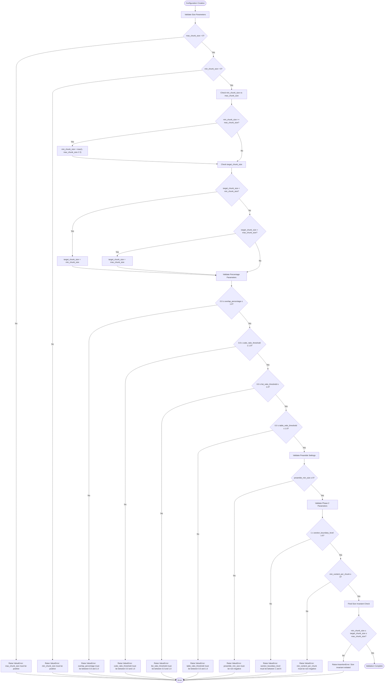

# ChunkConfig Dataclass Documentation

<cite>
**Referenced Files in This Document**
- [types.py](file://markdown_chunker/chunker/types.py)
- [basic_usage.py](file://examples/basic_usage.py)
- [api_usage.py](file://examples/api_usage.py)
- [rag_integration.py](file://examples/rag_integration.py)
- [dify_integration.py](file://examples/dify_integration.py)
- [test_chunk_config_validation.py](file://tests/chunker/test_chunk_config_validation.py)
- [test_serialization.py](file://tests/chunker/test_serialization.py)
</cite>

## Table of Contents
1. [Introduction](#introduction)
2. [Core Configuration Parameters](#core-configuration-parameters)
3. [Overlap and Context Settings](#overlap-and-context-settings)
4. [Strategy Selection Thresholds](#strategy-selection-thresholds)
5. [Behavior Flags and Options](#behavior-flags-and-options)
6. [Performance and Streaming Settings](#performance-and-streaming-settings)
7. [Validation Logic and Auto-Adjustment](#validation-logic-and-auto-adjustment)
8. [Factory Methods and Predefined Profiles](#factory-methods-and-predefined-profiles)
9. [Custom Configuration Examples](#custom-configuration-examples)
10. [Integration Scenarios](#integration-scenarios)
11. [Best Practices](#best-practices)

## Introduction

The `ChunkConfig` dataclass serves as the central configuration hub for the markdown chunking process in the Python Markdown Chunker library. It provides comprehensive control over all aspects of how markdown documents are segmented into manageable chunks, including size limits, strategy selection thresholds, overlap settings, and behavior flags.

This configuration system is designed with flexibility and robustness in mind, featuring automatic validation and intelligent auto-adjustment capabilities to ensure optimal chunking behavior across diverse use cases.

**Section sources**
- [types.py](file://markdown_chunker/chunker/types.py#L497-L572)

## Core Configuration Parameters

### Size Limits

The size parameters define the fundamental boundaries for chunk creation:

| Parameter | Type | Default | Purpose |
|-----------|------|---------|---------|
| `max_chunk_size` | int | 4096 | Maximum size in characters per chunk |
| `min_chunk_size` | int | 512 | Minimum size in characters per chunk |
| `target_chunk_size` | int | 2048 | Target size aiming for when possible |

**Impact and Purpose:**
- **max_chunk_size**: Defines the upper boundary for chunk size, preventing excessively large chunks that could overwhelm downstream processing
- **min_chunk_size**: Ensures chunks aren't too small, maintaining meaningful content units
- **target_chunk_size**: Serves as the ideal chunk size, with the chunker striving to achieve this balance

**Auto-Adjustment Behavior:**
- If `target_chunk_size` exceeds `max_chunk_size`, it's automatically reduced to match
- If `target_chunk_size` falls below `min_chunk_size`, it's increased to match
- If `min_chunk_size` equals or exceeds `max_chunk_size`, it's adjusted to `max_chunk_size // 2`

**Section sources**
- [types.py](file://markdown_chunker/chunker/types.py#L574-L578)
- [types.py](file://markdown_chunker/chunker/types.py#L621-L664)

## Overlap and Context Settings

### Overlap Configuration

Overlap settings maintain contextual continuity between adjacent chunks:

| Parameter | Type | Default | Purpose |
|-----------|------|---------|---------|
| `overlap_size` | int | 200 | Fixed overlap size in characters |
| `overlap_percentage` | float | 0.1 (10%) | Maximum overlap as percentage of chunk size |
| `enable_overlap` | bool | True | Whether to create overlapping chunks |

**Effective Overlap Calculation:**
The system calculates effective overlap using: `min(overlap_size, chunk_size * overlap_percentage, chunk_size // 4)`

**Use Cases:**
- **RAG Systems**: Maintains context continuity for retrieval-augmented generation
- **Semantic Search**: Preserves contextual information across chunk boundaries
- **Document Analysis**: Enables smooth transitions between content segments

**Section sources**
- [types.py](file://markdown_chunker/chunker/types.py#L579-L582)
- [types.py](file://markdown_chunker/chunker/types.py#L996-L1001)

## Strategy Selection Thresholds

The chunker employs multiple strategies based on content analysis. These thresholds determine when each strategy is activated:

### Code Strategy Thresholds

| Parameter | Type | Default | Purpose |
|-----------|------|---------|---------|
| `code_ratio_threshold` | float | 0.3 | Minimum code content ratio for code strategy |
| `min_code_blocks` | int | 1 | Minimum code blocks for code strategy activation |

**Impact:**
- Lower values (0.3) make the system more sensitive to code content
- Higher values require more substantial code presence
- Adjust based on document composition and use case requirements

### Structural Strategy Thresholds

| Parameter | Type | Default | Purpose |
|-----------|------|---------|---------|
| `header_count_threshold` | int | 3 | Minimum headers for structural strategy |
| `list_count_threshold` | int | 5 | Minimum lists for list strategy |
| `list_ratio_threshold` | float | 0.6 | Minimum list content ratio for list strategy |
| `table_count_threshold` | int | 3 | Minimum tables for table strategy |
| `table_ratio_threshold` | float | 0.4 | Minimum table content ratio for table strategy |

### Mixed Content Strategy

| Parameter | Type | Default | Purpose |
|-----------|------|---------|---------|
| `min_complexity` | float | 0.3 | Minimum complexity score for mixed strategy |

**Complexity Scoring:**
- Ranges from 0.0 (simple) to 1.0 (highly complex)
- Based on content diversity and structural elements
- Enables intelligent strategy selection for mixed-content documents

**Section sources**
- [types.py](file://markdown_chunker/chunker/types.py#L584-L593)

## Behavior Flags and Options

### Preservation Settings

These flags control how specific markdown elements are handled during chunking:

| Parameter | Type | Default | Purpose |
|-----------|------|---------|---------|
| `allow_oversize` | bool | True | Allow chunks larger than max_chunk_size for indivisible elements |
| `preserve_code_blocks` | bool | True | Keep code blocks intact when possible |
| `preserve_tables` | bool | True | Keep tables intact when possible |
| `preserve_list_hierarchy` | bool | True | Maintain list item relationships |

**Oversize Behavior:**
- Atomic blocks (code, tables) exceeding `max_chunk_size` are always created as standalone chunks
- This ensures no data loss while maintaining content integrity
- Essential for preserving code examples and tabular data

### Fallback Configuration

| Parameter | Type | Default | Purpose |
|-----------|------|---------|---------|
| `enable_fallback` | bool | True | Enable fallback strategies when primary strategy fails |
| `fallback_strategy` | str | "sentences" | Strategy to use when primary fails |
| `max_fallback_level` | int | 4 | Maximum fallback depth |

**Fallback Strategy Chain:**
1. Primary strategy selection
2. Fallback to secondary strategy if primary fails
3. Continue through fallback chain until success or exhaustion

**Section sources**
- [types.py](file://markdown_chunker/chunker/types.py#L594-L604)

## Performance and Streaming Settings

### Memory and Performance Control

| Parameter | Type | Default | Purpose |
|-----------|------|---------|---------|
| `enable_streaming` | bool | False | Enable streaming for large documents |
| `streaming_threshold` | int | 10MB | Size threshold for enabling streaming |

**Streaming Benefits:**
- Reduces memory consumption for large documents
- Enables processing of documents exceeding available RAM
- Provides progress feedback for long-running operations

**Section sources**
- [types.py](file://markdown_chunker/chunker/types.py#L605-L607)

## Validation Logic and Auto-Adjustment

### Post-Initialization Validation

The `__post_init__` method performs comprehensive validation and auto-correction:



**Diagram sources**
- [types.py](file://markdown_chunker/chunker/types.py#L621-L664)

### Validation Rules

1. **Size Parameters**: Must be positive integers
2. **Percentage Parameters**: Must be between 0.0 and 1.0
3. **Preamble Settings**: Non-negative values only
4. **Phase 2 Parameters**: Valid ranges enforced
5. **Size Invariants**: `min_chunk_size ≤ target_chunk_size ≤ max_chunk_size`

**Section sources**
- [types.py](file://markdown_chunker/chunker/types.py#L621-L664)
- [test_chunk_config_validation.py](file://tests/chunker/test_chunk_config_validation.py#L13-L207)

## Factory Methods and Predefined Profiles

The ChunkConfig class provides several factory methods for common use cases:

### Default Configuration

```python
@classmethod
def default(cls) -> "ChunkConfig":
    """Create default configuration with balanced settings."""
    return cls()
```

**Default Values:**
- `max_chunk_size`: 4096
- `min_chunk_size`: 512
- `target_chunk_size`: 2048
- `enable_overlap`: True
- `overlap_size`: 200

### Code-Heavy Documents

```python
@classmethod
def for_code_heavy(cls) -> "ChunkConfig":
    """Optimized for technical documentation with extensive code examples."""
    return cls(
        max_chunk_size=6144,
        target_chunk_size=3072,
        code_ratio_threshold=0.5,
        min_code_blocks=2,
        allow_oversize=True,
        preserve_code_blocks=True,
        overlap_size=300,
    )
```

**Use Cases:**
- API documentation with code examples
- Technical tutorials
- Software documentation
- Programming guides

### RAG-Optimized Configuration

```python
@classmethod
def for_dify_rag(cls) -> "ChunkConfig":
    """Tuned for Retrieval-Augmented Generation systems."""
    return cls(
        max_chunk_size=3072,
        min_chunk_size=256,
        target_chunk_size=1536,
        overlap_size=150,
        enable_overlap=True,
        code_ratio_threshold=0.6,
        preserve_code_blocks=True,
        preserve_list_hierarchy=True,
        allow_oversize=False,
    )
```

**RAG Benefits:**
- Moderate chunk sizes for better semantic search
- Enabled overlap for context preservation
- Structured element preservation
- No oversize chunks for embedding compatibility

### Chat/LLM Context Configuration

```python
@classmethod
def for_chat_context(cls) -> "ChunkConfig":
    """Optimized for LLM chat contexts and context windows."""
    return cls(
        max_chunk_size=1536,
        min_chunk_size=200,
        overlap_size=200,
        enable_overlap=True,
        code_ratio_threshold=0.5,
        list_count_threshold=4,
        table_count_threshold=2,
        min_complexity=0.1,
    )
```

**Chat Optimization:**
- Smaller chunks fit LLM context windows
- Generous overlap maintains conversation flow
- Balanced sensitivity to different content types

### Search Indexing Configuration

```python
@classmethod
def for_search_indexing(cls) -> "ChunkConfig":
    """Optimized for semantic search and indexing applications."""
    return cls(
        max_chunk_size=1024,
        min_chunk_size=100,
        overlap_size=100,
        enable_overlap=True,
        code_ratio_threshold=0.4,
        list_count_threshold=6,
        table_count_threshold=3,
        preserve_list_hierarchy=True,
    )
```

**Search Benefits:**
- Small chunks improve search granularity
- Generous overlap enhances search coverage
- List hierarchy preservation improves navigation

### Large Document Processing

```python
@classmethod
def for_large_documents(cls) -> "ChunkConfig":
    """Optimized for processing large documents efficiently."""
    return cls(
        max_chunk_size=8192,
        target_chunk_size=4096,
        enable_streaming=True,
        overlap_size=400,
        overlap_percentage=0.05,
    )
```

**Large Document Benefits:**
- Fewer, larger chunks reduce overhead
- Streaming enables memory-efficient processing
- Smaller overlap percentage improves efficiency

### Compact Configuration

```python
@classmethod
def compact(cls) -> "ChunkConfig":
    """For applications requiring maximum granularity."""
    return cls(
        max_chunk_size=2048,
        min_chunk_size=256,
        target_chunk_size=1024,
        overlap_size=100,
    )
```

**Granularity Benefits:**
- Many small chunks for precise matching
- Better for semantic search applications
- Higher granularity retrieval

**Section sources**
- [types.py](file://markdown_chunker/chunker/types.py#L666-L1027)

## Custom Configuration Examples

### API Documentation Configuration

```python
# Balanced settings for API documentation
config = ChunkConfig(
    max_chunk_size=3072,
    min_chunk_size=256,
    overlap_size=150,
    enable_overlap=True,
    code_ratio_threshold=0.6,
    list_count_threshold=3,
    table_count_threshold=2,
    min_complexity=0.2,
)
```

### Fast Processing Configuration

```python
# Optimized for maximum throughput
config = ChunkConfig(
    max_chunk_size=8192,
    min_chunk_size=1024,
    target_chunk_size=4096,
    overlap_size=100,
    enable_overlap=False,
    allow_oversize=True,
    enable_streaming=True,
)
```

### Embedding Preparation Configuration

```python
# Small chunks with overlap for embeddings
config = ChunkConfig(
    max_chunk_size=500,
    min_chunk_size=100,
    enable_overlap=True,
    overlap_size=50,
    code_ratio_threshold=0.7,
    preserve_code_blocks=True,
)
```

**Section sources**
- [basic_usage.py](file://examples/basic_usage.py#L115-L125)
- [rag_integration.py](file://examples/rag_integration.py#L13-L35)

## Integration Scenarios

### RAG System Integration

```python
# RAG-optimized configuration
config = ChunkConfig.for_dify_rag()

# Prepare chunks for embedding generation
def prepare_chunks_for_embeddings(markdown: str, max_chunk_size: int = 500):
    config = ChunkConfig(
        max_chunk_size=max_chunk_size,
        min_chunk_size=100,
        enable_overlap=True,
        overlap_size=50
    )
    # Process and return embedding-ready chunks
```

### API Integration

```python
# API-compatible configuration
config = ChunkConfig.for_api_default()

# JSON serialization support
data = config.to_dict()
restored_config = ChunkConfig.from_dict(data)
```

### Dify RAG System Integration

```python
# Dify-compatible configuration
config = ChunkConfig(
    max_chunk_size=1536,
    min_chunk_size=200,
    overlap_size=200,
    enable_overlap=True
)

# Metadata enrichment for Dify
enriched_chunk = {
    "content": chunk.content,
    "metadata": {
        **chunk.metadata,
        "chunk_id": f"chunk_{chunk.index}",
        "document_id": "api_docs_v1",
        "section": "authentication",
        "language": "en",
        "version": "1.0",
        "indexed_at": "2025-11-09T00:00:00Z",
        "chunking_strategy": result.strategy_used,
        "chunk_index": chunk.index,
        "total_chunks": len(result.chunks)
    }
}
```

**Section sources**
- [rag_integration.py](file://examples/rag_integration.py#L13-L53)
- [dify_integration.py](file://examples/dify_integration.py#L70-L132)

## Best Practices

### Configuration Selection Guidelines

1. **Default Configuration**: Use for general-purpose chunking
2. **Code-Heavy Documents**: Use `for_code_heavy()` for technical documentation
3. **RAG Systems**: Use `for_dify_rag()` for retrieval-augmented generation
4. **Chat Applications**: Use `for_chat_context()` for LLM conversations
5. **Search Applications**: Use `for_search_indexing()` for semantic search
6. **Large Documents**: Use `for_large_documents()` for processing large files
7. **High Granularity**: Use `compact()` for applications requiring fine-grained chunks

### Performance Optimization

- **Memory Usage**: Enable streaming for documents > 10MB
- **Processing Speed**: Increase chunk sizes for faster processing
- **Context Preservation**: Enable overlap for RAG and search applications
- **Content Quality**: Adjust strategy thresholds based on document characteristics

### Validation and Testing

- Always validate configurations using the built-in validation logic
- Test with representative document samples
- Monitor chunk distribution and adjust parameters as needed
- Consider fallback behavior for edge cases

### Migration and Compatibility

- Use factory methods for consistent configuration across environments
- Leverage JSON serialization for configuration persistence
- Maintain backward compatibility with default values
- Document custom configuration rationale for team consistency

**Section sources**
- [test_serialization.py](file://tests/chunker/test_serialization.py#L152-L222)