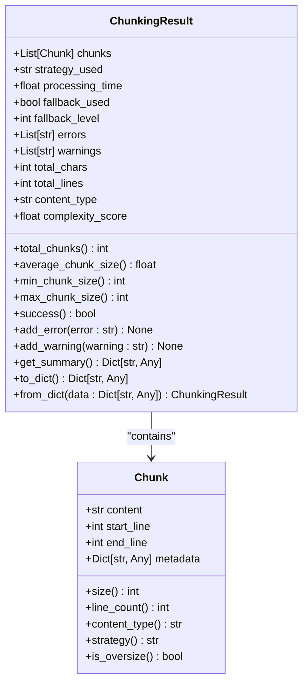
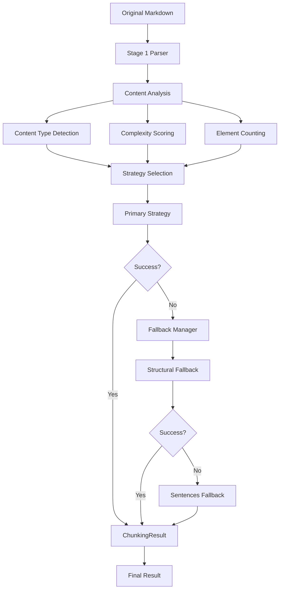
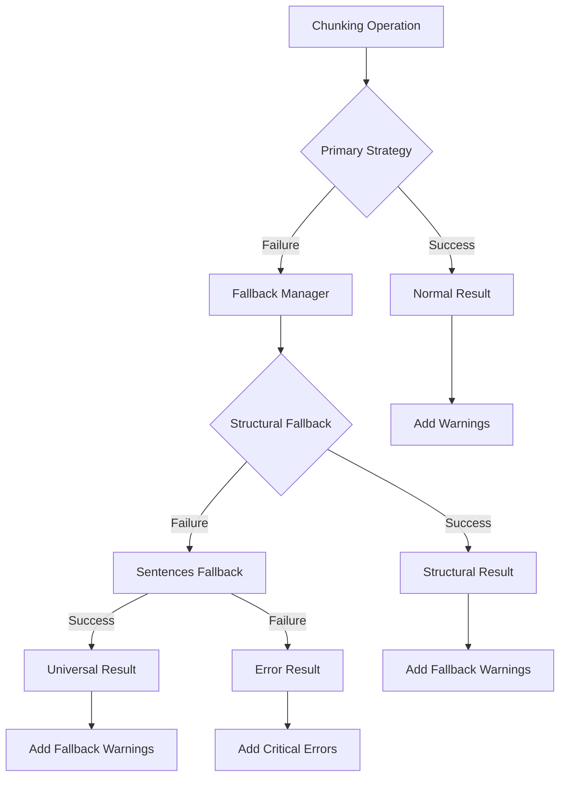

# ChunkingResult Dataclass Documentation

<cite>
**Referenced Files in This Document**
- [types.py](file://markdown_chunker/chunker/types.py)
- [test_types.py](file://tests/chunker/test_types.py)
- [fallback_manager.py](file://markdown_chunker/chunker/components/fallback_manager.py)
- [orchestrator.py](file://markdown_chunker/chunker/orchestrator.py)
- [basic_usage.py](file://examples/basic_usage.py)
- [analyzer.py](file://markdown_chunker/parser/analyzer.py)
- [structural_strategy.py](file://markdown_chunker/chunker/strategies/structural_strategy.py)
</cite>

## Table of Contents
1. [Introduction](#introduction)
2. [Core Dataclass Structure](#core-dataclass-structure)
3. [Field Descriptions](#field-descriptions)
4. [Properties and Calculations](#properties-and-calculations)
5. [Utility Methods](#utility-methods)
6. [Analysis Metrics](#analysis-metrics)
7. [Error and Warning Management](#error-and-warning-management)
8. [Serialization and Deserialization](#serialization-and-deserialization)
9. [Usage Patterns and Examples](#usage-patterns-and-examples)
10. [Quality Evaluation and Optimization](#quality-evaluation-and-optimization)
11. [Troubleshooting Guide](#troubleshooting-guide)

## Introduction

The `ChunkingResult` dataclass serves as the central container for storing and analyzing the results of markdown chunking operations. It encapsulates all generated chunks, performance metrics, strategy information, and diagnostic data needed for evaluating chunking quality, troubleshooting issues, and optimizing configuration settings.

This comprehensive data structure enables developers to:
- Assess chunking effectiveness through statistical analysis
- Identify potential issues through error and warning tracking
- Compare different chunking strategies and configurations
- Monitor performance characteristics and resource utilization
- Make informed decisions about chunking optimization

## Core Dataclass Structure

The `ChunkingResult` dataclass is defined with the following structure:



**Diagram sources**
- [types.py](file://markdown_chunker/chunker/types.py#L322-L493)

**Section sources**
- [types.py](file://markdown_chunker/chunker/types.py#L322-L343)

## Field Descriptions

### Core Processing Fields

#### `chunks: List[Chunk]`
**Purpose**: Contains all generated chunks from the chunking operation.

**Details**:
- Each chunk represents a semantically meaningful fragment of the original markdown
- Maintains original content with line number preservation
- Includes comprehensive metadata for each chunk
- Enables detailed analysis of chunk distribution and characteristics

**Use Cases**:
- Access individual chunks for processing or storage
- Analyze chunk distribution patterns
- Validate chunk boundaries and content integrity
- Support overlap and metadata operations

#### `strategy_used: str`
**Purpose**: Identifies the chunking strategy that was successfully applied.

**Details**:
- Reflects either automatic strategy selection or manual override
- Supports all available strategies: "code", "mixed", "list", "table", "structural", "sentences"
- Indicates fallback strategy if fallback was triggered
- Essential for understanding chunking behavior and quality

**Use Cases**:
- Strategy comparison and selection optimization
- Performance analysis across different approaches
- Debugging strategy-related issues
- Configuration tuning based on content characteristics

#### `processing_time: float`
**Purpose**: Records the total time taken for the chunking operation in seconds.

**Details**:
- Measures end-to-end processing from input to result
- Includes Stage 1 analysis, strategy selection, and chunk generation
- Accounts for fallback processing overhead
- Provides baseline for performance optimization

**Use Cases**:
- Performance monitoring and optimization
- Resource allocation planning
- Benchmarking different configurations
- Identifying bottlenecks in processing pipeline

### Fallback and Recovery Fields

#### `fallback_used: bool = False`
**Purpose**: Indicates whether fallback strategies were activated during processing.

**Details**:
- Set to `True` when primary strategy fails and fallback is required
- Remains `False` for successful primary strategy execution
- Critical for understanding chunking reliability
- Essential for monitoring system robustness

**Use Cases**:
- Reliability assessment and SLA monitoring
- Strategy selection validation
- System health monitoring
- Performance impact analysis

#### `fallback_level: int = 0`
**Purpose**: Specifies the depth of fallback processing used.

**Details**:
- `0`: Primary strategy succeeded
- `1`: Structural fallback used
- `2`: Sentences fallback used
- Higher levels indicate more severe processing challenges
- Provides insight into system stress levels

**Use Cases**:
- Fallback frequency analysis
- Strategy effectiveness evaluation
- System resilience measurement
- Configuration optimization insights

### Diagnostic Information

#### `errors: List[str] = field(default_factory=list)`
**Purpose**: Collects critical errors encountered during chunking.

**Details**:
- Contains error messages from strategy failures, parsing issues, or processing exceptions
- Critical errors prevent successful chunk generation
- Enables comprehensive error tracking and resolution
- Supports automated error reporting and monitoring

**Use Cases**:
- Error diagnosis and resolution
- System reliability monitoring
- Automated error reporting
- Performance impact assessment

#### `warnings: List[str] = field(default_factory=list)`
**Purpose**: Captures non-critical issues and optimization opportunities.

**Details**:
- Includes warnings about chunk sizing, content quality, or configuration issues
- Warnings don't prevent successful chunking but indicate areas for improvement
- Enables proactive optimization and maintenance
- Supports continuous improvement initiatives

**Use Cases**:
- Quality assurance and optimization
- Proactive issue identification
- Configuration tuning guidance
- Performance monitoring

**Section sources**
- [types.py](file://markdown_chunker/chunker/types.py#L330-L337)

## Properties and Calculations

### Statistical Properties

#### `total_chunks: int`
**Calculation**: `len(self.chunks)`

**Purpose**: Provides the total count of generated chunks.

**Use Cases**:
- Chunk distribution analysis
- Content density assessment
- Storage requirement estimation
- Processing workload characterization

#### `average_chunk_size: float`
**Calculation**: `sum(chunk.size for chunk in self.chunks) / len(self.chunks)`

**Purpose**: Calculates the mean size of all chunks in characters.

**Edge Cases**:
- Returns `0.0` when no chunks are generated
- Handles empty chunks gracefully
- Provides insight into chunking granularity

**Use Cases**:
- Size optimization analysis
- Memory usage estimation
- Performance characterization
- Quality assessment

#### `min_chunk_size: int`
**Calculation**: `min(chunk.size for chunk in self.chunks) if self.chunks else 0`

**Purpose**: Identifies the smallest chunk size in the result.

**Use Cases**:
- Minimum size validation
- Content preservation analysis
- Edge case identification
- Quality assurance

#### `max_chunk_size: int`
**Calculation**: `max(chunk.size for chunk in self.chunks) if self.chunks else 0`

**Purpose**: Identifies the largest chunk size in the result.

**Use Cases**:
- Maximum size validation
- Oversized chunk detection
- Performance bottleneck identification
- Quality assurance

### Success Determination

#### `success: bool`
**Calculation**: `len(self.chunks) > 0 and not any("critical" in error.lower() for error in self.errors)`

**Purpose**: Determines whether the chunking operation completed successfully.

**Logic**:
- Requires at least one chunk to be generated
- Rejects results with critical errors
- Allows results with warnings and fallback usage
- Provides clear pass/fail indication

**Use Cases**:
- Quality gates and validation
- Automated processing decisions
- System reliability assessment
- Performance monitoring

**Section sources**
- [types.py](file://markdown_chunker/chunker/types.py#L344-L426)

## Utility Methods

### Error and Warning Management

#### `add_error(error: str) -> None`
**Purpose**: Adds an error message to the result.

**Implementation Details**:
- Appends error to the internal `errors` list
- Supports multiple error messages
- Enables comprehensive error tracking

**Use Cases**:
- Error collection during processing
- Validation feedback
- Debugging assistance
- Monitoring integration

#### `add_warning(warning: str) -> None`
**Purpose**: Adds a warning message to the result.

**Implementation Details**:
- Appends warning to the internal `warnings` list
- Supports multiple warning messages
- Enables proactive issue identification

**Use Cases**:
- Non-critical issue tracking
- Quality improvement suggestions
- Configuration optimization hints
- Performance monitoring

### Summary Generation

#### `get_summary() -> Dict[str, Any]`
**Purpose**: Creates a comprehensive summary of the chunking result.

**Returns**: Dictionary containing key metrics and status indicators

**Summary Contents**:
- `success`: Boolean indicating operation success
- `total_chunks`: Total chunk count
- `strategy_used`: Applied strategy name
- `fallback_used`: Fallback activation status
- `fallback_level`: Fallback depth level
- `processing_time`: Processing duration
- `average_chunk_size`: Mean chunk size
- `size_range`: [min, max] chunk sizes
- `total_chars`: Original character count
- `content_type`: Detected content type
- `complexity_score`: Content complexity rating
- `errors`: Error count
- `warnings`: Warning count

**Use Cases**:
- Performance dashboards
- Monitoring systems
- Reporting and analytics
- Automated decision-making

### Serialization Methods

#### `to_dict() -> Dict[str, Any]`
**Purpose**: Converts the result to a dictionary for JSON serialization.

**Structure**:
- `chunks`: List of chunk dictionaries
- `strategy_used`: Strategy name
- `processing_time`: Processing time
- `fallback_used`: Fallback status
- `fallback_level`: Fallback level
- `errors`: Error list
- `warnings`: Warning list
- `statistics`: Detailed statistics

**Use Cases**:
- API response formatting
- Data persistence
- Inter-service communication
- Logging and auditing

#### `from_dict(data: Dict[str, Any]) -> "ChunkingResult"`
**Purpose**: Creates a ChunkingResult from a dictionary.

**Implementation Details**:
- Reconstructs chunks from serialized data
- Restores statistics from separate statistics section
- Handles missing optional fields gracefully
- Maintains backward compatibility

**Use Cases**:
- Data deserialization
- Persistence restoration
- Cross-system data transfer
- Testing and mocking

**Section sources**
- [types.py](file://markdown_chunker/chunker/types.py#L427-L493)

## Analysis Metrics

### Content Analysis Integration

The `ChunkingResult` integrates with Stage 1 analysis to provide comprehensive content insights:

#### `total_chars: int = 0`
**Source**: `stage1_results.analysis.total_chars`
**Purpose**: Total character count in original content
**Use Cases**: Content size analysis, processing cost estimation, storage planning

#### `total_lines: int = 0`
**Source**: `stage1_results.analysis.total_lines`
**Purpose**: Total line count in original content
**Use Cases**: Line-based processing analysis, formatting assessment, readability evaluation

#### `content_type: str = "unknown"`
**Source**: `stage1_results.analysis.content_type`
**Purpose**: Detected content classification
**Values**: "code", "text", "list", "table", "mixed", "header", "preamble"
**Use Cases**: Strategy selection guidance, content-specific optimization, quality assessment

#### `complexity_score: float = 0.0`
**Source**: `stage1_results.analysis.complexity_score`
**Purpose**: Content complexity rating (0.0 to 1.0)
**Calculation**: Based on structural elements, nesting depth, and content diversity
**Use Cases**: Strategy recommendation, processing difficulty assessment, quality prediction

### Content Analysis Workflow



**Diagram sources**
- [orchestrator.py](file://markdown_chunker/chunker/orchestrator.py#L118-L339)
- [analyzer.py](file://markdown_chunker/parser/analyzer.py#L74-L206)

**Section sources**
- [orchestrator.py](file://markdown_chunker/chunker/orchestrator.py#L304-L308)

## Error and Warning Management

### Error Classification

The `ChunkingResult` distinguishes between different types of issues:

#### Critical Errors
- Prevent successful chunk generation
- Trigger fallback mechanisms
- Indicate system failures
- Require immediate attention

#### Warnings
- Non-blocking issues
- Optimization opportunities
- Quality improvement suggestions
- Proactive monitoring indicators

### Error Handling Strategies



**Diagram sources**
- [fallback_manager.py](file://markdown_chunker/chunker/components/fallback_manager.py#L60-L175)

### Common Error Patterns

#### Strategy Selection Failures
- Invalid strategy names
- Insufficient content for strategy
- Configuration conflicts
- Resource limitations

#### Processing Failures
- Parsing errors
- Memory constraints
- Timeout conditions
- System resource exhaustion

#### Content-Specific Issues
- Empty or malformed content
- Unsupported content types
- Encoding problems
- Size limitations

**Section sources**
- [fallback_manager.py](file://markdown_chunker/chunker/components/fallback_manager.py#L106-L166)

## Serialization and Deserialization

### JSON Serialization Benefits

The serialization capabilities enable seamless integration with various systems:

#### Data Persistence
- Database storage of chunking results
- File system persistence
- Cache storage for performance
- Backup and archival

#### Inter-System Communication
- API response formatting
- Message queue payloads
- Microservice communication
- Event-driven architectures

#### Testing and Simulation
- Test fixture creation
- Mock data generation
- Regression testing
- Performance benchmarking

### Serialization Format

```json
{
  "chunks": [
    {
      "content": "# Header\nContent...",
      "start_line": 1,
      "end_line": 5,
      "size": 25,
      "line_count": 5,
      "content_type": "header",
      "metadata": {
        "strategy": "structural",
        "section_path": ["Introduction", "Getting Started"]
      }
    }
  ],
  "strategy_used": "structural",
  "processing_time": 0.123,
  "fallback_used": false,
  "fallback_level": 0,
  "errors": [],
  "warnings": [],
  "statistics": {
    "total_chunks": 1,
    "total_chars": 100,
    "total_lines": 10,
    "average_chunk_size": 25.0,
    "min_chunk_size": 25,
    "max_chunk_size": 25,
    "content_type": "header",
    "complexity_score": 0.8
  }
}
```

**Section sources**
- [types.py](file://markdown_chunker/chunker/types.py#L454-L493)

## Usage Patterns and Examples

### Basic Usage Patterns

#### Simple Chunking with Analysis
```python
# Basic chunking with result analysis
result = chunker.chunk_with_analysis(markdown_text)
print(f"Strategy: {result.strategy_used}")
print(f"Chunks: {len(result.chunks)}")
print(f"Success: {result.success}")
```

#### Performance Monitoring
```python
# Track processing performance
start_time = time.time()
result = chunker.chunk_with_analysis(document)
processing_time = time.time() - start_time

print(f"Processing time: {processing_time:.3f}s")
print(f"Throughput: {result.total_chars / processing_time:.0f} chars/s")
```

#### Quality Assessment
```python
# Evaluate chunking quality
summary = result.get_summary()
print(f"Chunk distribution: {summary['size_range']}")
print(f"Average size: {summary['average_chunk_size']:.0f} chars")
print(f"Content type: {summary['content_type']}")
print(f"Complexity: {summary['complexity_score']:.2f}")
```

### Advanced Usage Patterns

#### Strategy Comparison
```python
# Compare different strategies
strategies = ["structural", "code", "list", "table", "mixed"]
results = {}

for strategy in strategies:
    result = chunker.chunk_with_analysis(document, strategy=strategy)
    results[strategy] = result.get_summary()

# Analyze results
best_strategy = max(results.items(), key=lambda x: x[1]['success'])
```

#### Configuration Optimization
```python
# Optimize chunking configuration
configs = [
    ChunkConfig(max_chunk_size=1000, min_chunk_size=200),
    ChunkConfig(max_chunk_size=2000, min_chunk_size=500),
    ChunkConfig(max_chunk_size=4000, min_chunk_size=1000)
]

optimization_results = []
for config in configs:
    chunker = MarkdownChunker(config)
    result = chunker.chunk_with_analysis(document)
    
    optimization_results.append({
        'config': config,
        'summary': result.get_summary(),
        'quality_score': calculate_quality_score(result)
    })
```

#### Error Analysis Pipeline
```python
# Comprehensive error analysis
def analyze_chunking_issues(results):
    """Analyze patterns in chunking failures."""
    error_patterns = {}
    
    for result in results:
        if not result.success:
            # Group by error types
            for error in result.errors:
                category = categorize_error(error)
                error_patterns.setdefault(category, 0)
                error_patterns[category] += 1
    
    return error_patterns
```

**Section sources**
- [basic_usage.py](file://examples/basic_usage.py#L50-L364)

## Quality Evaluation and Optimization

### Quality Metrics

#### Chunk Size Distribution Analysis
The `ChunkingResult` provides comprehensive metrics for evaluating chunk size quality:

```python
def evaluate_chunk_size_quality(result: ChunkingResult) -> dict:
    """Evaluate chunk size distribution quality."""
    stats = result.get_summary()
    
    return {
        'average_deviation': abs(stats['average_chunk_size'] - target_size),
        'size_variance': stats['max_chunk_size'] - stats['min_chunk_size'],
        'size_balance': 1.0 - (stats['size_variance'] / stats['max_chunk_size']),
        'oversized_chunks': sum(1 for chunk in result.chunks if chunk.is_oversize),
        'chunk_count': stats['total_chunks']
    }
```

#### Content Type Matching
```python
def evaluate_content_type_matching(result: ChunkingResult) -> dict:
    """Assess content type alignment with strategy."""
    content_types = [chunk.content_type for chunk in result.chunks]
    strategy = result.strategy_used
    
    # Strategy-specific expectations
    expectations = {
        'code': ['code'],
        'structural': ['header', 'text'],
        'list': ['list'],
        'table': ['table'],
        'mixed': ['code', 'text', 'list', 'table'],
        'sentences': ['text']
    }
    
    expected_types = set(expectations.get(strategy, []))
    actual_types = set(content_types)
    
    return {
        'coverage': len(expected_types & actual_types) / len(expected_types),
        'diversity': len(actual_types),
        'alignment': expected_types == actual_types
    }
```

### Optimization Strategies

#### Automatic Configuration Tuning
```python
def optimize_chunking_config(content: str, target_quality: float = 0.8) -> ChunkConfig:
    """Automatically optimize chunking configuration."""
    # Initial analysis
    chunker = MarkdownChunker()
    result = chunker.chunk_with_analysis(content)
    
    # Adjust based on content characteristics
    config = ChunkConfig.default()
    
    if result.content_type == 'code':
        config = ChunkConfig.for_code_heavy()
    elif result.content_type == 'text':
        config = ChunkConfig.for_structured_docs()
    
    # Fine-tune based on quality metrics
    summary = result.get_summary()
    if summary['size_variance'] > 1000:
        config.max_chunk_size = 2048  # Reduce variability
    
    return config
```

#### Fallback Usage Analysis
```python
def analyze_fallback_usage(results: List[ChunkingResult]) -> dict:
    """Analyze fallback usage patterns."""
    fallback_stats = {
        'total_operations': len(results),
        'successful_operations': 0,
        'fallback_used': 0,
        'fallback_levels': {0: 0, 1: 0, 2: 0},
        'average_processing_time': 0
    }
    
    for result in results:
        if result.success:
            fallback_stats['successful_operations'] += 1
        if result.fallback_used:
            fallback_stats['fallback_used'] += 1
            fallback_stats['fallback_levels'][result.fallback_level] += 1
        
        fallback_stats['average_processing_time'] += result.processing_time
    
    # Calculate rates
    fallback_stats['success_rate'] = (
        fallback_stats['successful_operations'] / fallback_stats['total_operations']
    )
    fallback_stats['fallback_rate'] = (
        fallback_stats['fallback_used'] / fallback_stats['total_operations']
    )
    fallback_stats['average_processing_time'] /= fallback_stats['total_operations']
    
    return fallback_stats
```

### Performance Benchmarking

#### Throughput Analysis
```python
def benchmark_chunking_performance(documents: List[str], configs: List[ChunkConfig]) -> dict:
    """Benchmark chunking performance across configurations."""
    results = {}
    
    for config in configs:
        chunker = MarkdownChunker(config)
        config_results = []
        
        for doc in documents:
            start_time = time.time()
            result = chunker.chunk_with_analysis(doc)
            processing_time = time.time() - start_time
            
            config_results.append({
                'doc_size': len(doc),
                'chunk_count': len(result.chunks),
                'processing_time': processing_time,
                'throughput': len(doc) / processing_time if processing_time > 0 else 0
            })
        
        results[config.max_chunk_size] = config_results
    
    return results
```

**Section sources**
- [test_types.py](file://tests/chunker/test_types.py#L178-L202)

## Troubleshooting Guide

### Common Issues and Solutions

#### Low Success Rate
**Symptoms**: Many `ChunkingResult` instances show `success = False`
**Causes**:
- Invalid input content
- Configuration conflicts
- Resource limitations
- Strategy selection issues

**Solutions**:
```python
def diagnose_low_success_rate(results: List[ChunkingResult]) -> dict:
    """Diagnose reasons for low success rate."""
    diagnostics = {
        'total_results': len(results),
        'successful': sum(1 for r in results if r.success),
        'failed_with_errors': sum(1 for r in results if not r.success and r.errors),
        'failed_with_fallback': sum(1 for r in results if not r.success and r.fallback_used),
        'error_types': {},
        'fallback_patterns': {}
    }
    
    # Analyze error patterns
    for result in results:
        if not result.success:
            for error in result.errors:
                error_type = categorize_error(error)
                diagnostics['error_types'].setdefault(error_type, 0)
                diagnostics['error_types'][error_type] += 1
    
    return diagnostics
```

#### Poor Chunk Quality
**Symptoms**: Irregular chunk sizes, poor content preservation
**Causes**:
- Suboptimal configuration
- Inappropriate strategy selection
- Content complexity mismatch

**Solutions**:
```python
def improve_chunk_quality(result: ChunkingResult) -> ChunkConfig:
    """Suggest configuration improvements."""
    summary = result.get_summary()
    
    # Analyze size distribution
    size_variance = summary['max_chunk_size'] - summary['min_chunk_size']
    avg_size = summary['average_chunk_size']
    
    # Suggest adjustments
    config = ChunkConfig.default()
    
    if size_variance > 2000:
        # Reduce chunk size variation
        config.max_chunk_size = int(avg_size * 1.5)
        config.min_chunk_size = int(avg_size * 0.5)
    
    if summary['content_type'] == 'code':
        # Optimize for code content
        config = ChunkConfig.for_code_heavy()
    
    return config
```

#### Performance Issues
**Symptoms**: High processing times, memory usage
**Causes**:
- Large documents
- Complex content
- Inefficient configurations
- System resource constraints

**Solutions**:
```python
def optimize_for_performance(content: str, config: ChunkConfig) -> ChunkConfig:
    """Optimize configuration for performance."""
    # Check content characteristics
    lines = content.count('\n')
    chars = len(content)
    
    optimized_config = copy.deepcopy(config)
    
    # Adjust for large documents
    if chars > 100000:  # 100KB+
        optimized_config.enable_streaming = True
        optimized_config.streaming_threshold = 50000  # 50KB threshold
    
    # Adjust for complex content
    if lines > 1000:  # Complex structure
        optimized_config.max_chunk_size = 2048  # Smaller chunks
        optimized_config.enable_overlap = True
    
    return optimized_config
```

### Diagnostic Tools

#### Comprehensive Analysis Function
```python
def comprehensive_chunking_analysis(results: List[ChunkingResult]) -> dict:
    """Perform comprehensive analysis of chunking results."""
    if not results:
        return {'error': 'No results provided'}
    
    # Aggregate statistics
    all_chunks = []
    for result in results:
        all_chunks.extend(result.chunks)
    
    # Calculate metrics
    total_chars = sum(chunk.size for chunk in all_chunks)
    total_lines = sum(chunk.line_count for chunk in all_chunks)
    
    # Content type distribution
    content_types = {}
    for chunk in all_chunks:
        content_types.setdefault(chunk.content_type, 0)
        content_types[chunk.content_type] += 1
    
    # Strategy usage
    strategies = {}
    for result in results:
        strategies.setdefault(result.strategy_used, 0)
        strategies[result.strategy_used] += 1
    
    # Fallback analysis
    fallbacks = {0: 0, 1: 0, 2: 0}
    for result in results:
        if result.fallback_used:
            fallbacks[result.fallback_level] += 1
    
    return {
        'total_documents': len(results),
        'total_chunks': len(all_chunks),
        'total_characters': total_chars,
        'total_lines': total_lines,
        'avg_chunk_size': total_chars / len(all_chunks) if all_chunks else 0,
        'content_type_distribution': content_types,
        'strategy_usage': strategies,
        'fallback_distribution': fallbacks,
        'success_rate': sum(1 for r in results if r.success) / len(results),
        'avg_processing_time': sum(r.processing_time for r in results) / len(results)
    }
```

#### Error Pattern Recognition
```python
def recognize_error_patterns(results: List[ChunkingResult]) -> dict:
    """Recognize common error patterns."""
    error_patterns = {}
    
    for result in results:
        if not result.success:
            error_key = ''
            for error in result.errors:
                # Categorize by error type
                if 'timeout' in error.lower():
                    error_key = 'timeout'
                elif 'memory' in error.lower():
                    error_key = 'memory'
                elif 'parse' in error.lower():
                    error_key = 'parse'
                elif 'strategy' in error.lower():
                    error_key = 'strategy'
            
            error_patterns.setdefault(error_key, [])
            error_patterns[error_key].append(result)
    
    return error_patterns
```

**Section sources**
- [test_types.py](file://tests/chunker/test_types.py#L150-L202)
- [fallback_manager.py](file://markdown_chunker/chunker/components/fallback_manager.py#L176-L213)