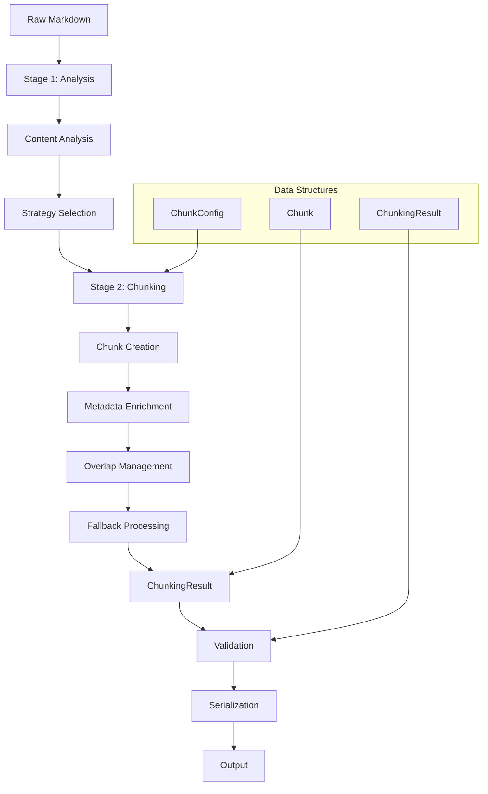

# Data Models

<cite>
**Referenced Files in This Document**
- [markdown_chunker/chunker/types.py](file://markdown_chunker/chunker/types.py)
- [examples/basic_usage.py](file://examples/basic_usage.py)
- [examples/api_usage.py](file://examples/api_usage.py)
- [tests/chunker/test_types.py](file://tests/chunker/test_types.py)
- [tests/chunker/test_serialization.py](file://tests/chunker/test_serialization.py)
- [tests/chunker/test_chunker.py](file://tests/chunker/test_chunker.py)
- [markdown_chunker/chunker/components/metadata_enricher.py](file://markdown_chunker/chunker/components/metadata_enricher.py)
</cite>

## Table of Contents
1. [Introduction](#introduction)
2. [Core Data Structures](#core-data-structures)
3. [Chunk Dataclass](#chunk-dataclass)
4. [ChunkConfig Dataclass](#chunkconfig-dataclass)
5. [ChunkingResult Dataclass](#chunkingresult-dataclass)
6. [Utility Components](#utility-components)
7. [Factory Methods and Configuration Profiles](#factory-methods-and-configuration-profiles)
8. [Serialization and JSON Support](#serialization-and-json-support)
9. [Pipeline Flow and Usage Patterns](#pipeline-flow-and-usage-patterns)
10. [Best Practices and Examples](#best-practices-and-examples)

## Introduction

The Python Markdown Chunker uses three primary dataclasses to represent and manage the chunking process: `Chunk`, `ChunkConfig`, and `ChunkingResult`. These data structures form the foundation of the chunking pipeline, providing type safety, validation, and comprehensive metadata tracking throughout the processing stages.

Each dataclass serves a specific purpose in the chunking workflow:
- **Chunk**: Represents individual pieces of content with metadata
- **ChunkConfig**: Defines configuration parameters for the chunking process
- **ChunkingResult**: Encapsulates complete results including chunks, metrics, and error information

## Core Data Structures

The chunking system is built around three fundamental dataclasses that work together to provide a robust and flexible chunking solution:

```mermaid
classDiagram
class Chunk {
+str content
+int start_line
+int end_line
+Dict~str,Any~ metadata
+size() int
+line_count() int
+content_type() str
+strategy() str
+language() Optional~str~
+is_oversize() bool
+add_metadata(key, value) void
+get_metadata(key, default) Any
+get_section_path() str[]
+get_source_range() tuple~int,int~
+get_section_id() str
+to_dict() Dict~str,Any~
+from_dict(data) Chunk
}
class ChunkConfig {
+int max_chunk_size
+int min_chunk_size
+int target_chunk_size
+int overlap_size
+float overlap_percentage
+bool enable_overlap
+float code_ratio_threshold
+int min_code_blocks
+float min_complexity
+int list_count_threshold
+float list_ratio_threshold
+int table_count_threshold
+float table_ratio_threshold
+int header_count_threshold
+bool allow_oversize
+bool preserve_code_blocks
+bool preserve_tables
+bool preserve_list_hierarchy
+bool enable_fallback
+str fallback_strategy
+int max_fallback_level
+bool enable_streaming
+int streaming_threshold
+bool extract_preamble
+bool separate_preamble_chunk
+int preamble_min_size
+int section_boundary_level
+int min_content_per_chunk
+bool preserve_markdown_structure
+default() ChunkConfig
+for_code_heavy() ChunkConfig
+for_dify_rag() ChunkConfig
+for_chat_context() ChunkConfig
+for_search_indexing() ChunkConfig
+get_effective_overlap_size(chunk_size) int
+to_dict() Dict~str,Any~
+from_dict(data) ChunkConfig
}
class ChunkingResult {
+Chunk[] chunks
+str strategy_used
+float processing_time
+bool fallback_used
+int fallback_level
+str[] errors
+str[] warnings
+int total_chars
+int total_lines
+str content_type
+float complexity_score
+total_chunks() int
+average_chunk_size() float
+min_chunk_size() int
+max_chunk_size() int
+success() bool
+add_error(error) void
+add_warning(warning) void
+get_summary() Dict~str,Any~
+to_dict() Dict~str,Any~
+from_dict(data) ChunkingResult
}
ChunkingResult --> Chunk : contains
ChunkConfig --> ChunkingResult : configures
```



**Diagram sources**
- [markdown_chunker/chunker/types.py](file://markdown_chunker/chunker/types.py#L36-L1061)

## Chunk Dataclass

The `Chunk` dataclass represents a single piece of content extracted from a markdown document during the chunking process. It encapsulates the content itself along with metadata that provides context and enables advanced processing capabilities.

### Fields and Properties

| Field | Type | Description | Validation |
|-------|------|-------------|------------|
| `content` | `str` | The actual text content of the chunk | Must be non-empty |
| `start_line` | `int` | Starting line number (1-based) | Must be >= 1 |
| `end_line` | `int` | Ending line number (1-based) | Must be >= start_line |
| `metadata` | `Dict[str, Any]` | Additional metadata about the chunk | Default: empty dict |

### Key Properties

The Chunk dataclass provides several computed properties for easy access to common information:

#### Size Properties
- **`size`**: Character count of the chunk content
- **`line_count`**: Number of lines spanned by the chunk

#### Content Analysis Properties
- **`content_type`**: Type of content (code, text, list, table, mixed, header, preamble)
- **`strategy`**: Strategy used to create this chunk
- **`language`**: Programming language for code chunks (when applicable)

#### Quality Indicators
- **`is_oversize`**: Whether the chunk exceeds normal size limits

### Utility Methods

#### Metadata Management
- **`add_metadata(key, value)`**: Add arbitrary metadata to the chunk
- **`get_metadata(key, default)`**: Retrieve metadata with optional default value

#### Advanced Navigation
- **`get_section_path()`**: Hierarchical section path for the chunk
- **`get_source_range()`**: Character offset range in the original document
- **`get_section_id()`**: Stable section identifier

### Validation and Constraints

The Chunk dataclass includes automatic validation in its `__post_init__` method:

```python
# Validation rules enforced:
# 1. start_line must be >= 1 (1-based line numbering)
# 2. end_line must be >= start_line
# 3. content cannot be empty or whitespace-only
```

**Section sources**
- [markdown_chunker/chunker/types.py](file://markdown_chunker/chunker/types.py#L36-L319)

## ChunkConfig Dataclass

The `ChunkConfig` dataclass provides comprehensive configuration for the chunking process, controlling all aspects from size limits to strategy selection thresholds. It offers both fine-grained control and pre-configured profiles for common use cases.

### Core Configuration Parameters

#### Size Limits
| Parameter | Default | Description |
|-----------|---------|-------------|
| `max_chunk_size` | 4096 | Maximum size in characters per chunk |
| `min_chunk_size` | 512 | Minimum size in characters per chunk |
| `target_chunk_size` | 2048 | Target size for chunks when possible |

#### Overlap Settings
| Parameter | Default | Description |
|-----------|---------|-------------|
| `overlap_size` | 200 | Fixed overlap size in characters |
| `overlap_percentage` | 0.1 | Percentage of chunk to overlap (10%) |
| `enable_overlap` | True | Whether to create overlapping chunks |

### Strategy Selection Thresholds

The configuration includes numerous thresholds that influence strategy selection:

| Parameter | Default | Purpose |
|-----------|---------|---------|
| `code_ratio_threshold` | 0.3 | Document must have ≥30% code content |
| `min_code_blocks` | 1 | Minimum code blocks for code strategy |
| `min_complexity` | 0.3 | Minimum complexity for mixed strategy |
| `list_count_threshold` | 5 | Minimum lists for list strategy |
| `list_ratio_threshold` | 0.6 | Ratio threshold for list strategy |
| `table_count_threshold` | 3 | Minimum tables for table strategy |
| `table_ratio_threshold` | 0.4 | Ratio threshold for table strategy |
| `header_count_threshold` | 3 | Minimum headers for structural strategy |

### Behavior Flags

#### Preservation Settings
- **`allow_oversize`**: Allow chunks larger than max_chunk_size for indivisible elements
- **`preserve_code_blocks`**: Keep code blocks intact
- **`preserve_tables`**: Keep tables intact
- **`preserve_list_hierarchy`**: Keep list items together

#### Advanced Features
- **`enable_fallback`**: Enable fallback strategies when primary fails
- **`enable_streaming`**: Enable streaming for large documents
- **`extract_preamble`**: Extract document preamble

### Factory Methods and Profiles

The ChunkConfig class provides several factory methods for common configurations:

#### Built-in Profiles
- **`default()`**: Balanced settings for general use
- **`for_code_heavy()`**: Optimized for technical documentation
- **`for_dify_rag()`**: Optimized for RAG systems
- **`for_chat_context()`**: Optimized for chat/LLM context
- **`for_search_indexing()`**: Optimized for search applications

#### Specialized Profiles
- **`for_structured_docs()`**: For well-organized documentation
- **`for_large_documents()`**: For processing large documents
- **`compact()`**: For smaller, more numerous chunks
- **`for_fast_processing()`**: For maximum throughput

### Validation and Auto-Adjustment

The configuration undergoes comprehensive validation in `__post_init__`:

```python
# Validation rules:
# 1. Size parameters must be positive
# 2. min_chunk_size ≤ target_chunk_size ≤ max_chunk_size
# 3. Percentages must be between 0.0 and 1.0
# 4. Auto-adjustments for invalid combinations
```

**Section sources**
- [markdown_chunker/chunker/types.py](file://markdown_chunker/chunker/types.py#L497-L1061)

## ChunkingResult Dataclass

The `ChunkingResult` dataclass encapsulates the complete output of a chunking operation, including the generated chunks, analysis information, performance metrics, and error handling. It serves as the primary interface for accessing chunking results.

### Core Output Fields

| Field | Type | Description |
|-------|------|-------------|
| `chunks` | `List[Chunk]` | The generated chunks |
| `strategy_used` | `str` | Strategy selected for chunking |
| `processing_time` | `float` | Time taken for chunking operation (seconds) |

### Status and Error Information

| Field | Type | Default | Description |
|-------|------|---------|-------------|
| `fallback_used` | `bool` | `False` | Whether fallback strategy was used |
| `fallback_level` | `int` | `0` | Level of fallback strategy used |
| `errors` | `List[str]` | `[]` | List of error messages |
| `warnings` | `List[str]` | `[]` | List of warning messages |

### Analysis and Statistics

The result includes comprehensive analysis information populated from Stage 1 processing:

| Field | Type | Description |
|-------|------|-------------|
| `total_chars` | `int` | Total character count in source |
| `total_lines` | `int` | Total line count in source |
| `content_type` | `str` | Detected content type |
| `complexity_score` | `float` | Document complexity score (0.0-1.0) |

### Computed Properties

The ChunkingResult provides several computed properties for easy access to result statistics:

#### Quantitative Metrics
- **`total_chunks`**: Total number of chunks created
- **`average_chunk_size`**: Mean size of all chunks
- **`min_chunk_size`**: Size of smallest chunk
- **`max_chunk_size`**: Size of largest chunk

#### Quality Indicators
- **`success`**: Whether chunking completed successfully (has chunks and no critical errors)

### Utility Methods

#### Error and Warning Management
- **`add_error(error)`**: Add an error message
- **`add_warning(warning)`**: Add a warning message

#### Result Summarization
- **`get_summary()`**: Generate a summary dictionary with key metrics

### Serialization Support

Both `to_dict()` and `from_dict()` methods provide JSON serialization support:

```python
# Complete serialization structure includes:
{
    "chunks": [...],           # Serialized chunks
    "strategy_used": "...",    # Strategy name
    "processing_time": 0.0,   # Processing time
    "fallback_used": false,    # Fallback flag
    "fallback_level": 0,      # Fallback level
    "errors": [],             # Error messages
    "warnings": [],           # Warning messages
    "statistics": {           # Detailed statistics
        "total_chunks": 0,
        "total_chars": 0,
        "total_lines": 0,
        "average_chunk_size": 0.0,
        "min_chunk_size": 0,
        "max_chunk_size": 0,
        "content_type": "unknown",
        "complexity_score": 0.0
    }
}
```

**Section sources**
- [markdown_chunker/chunker/types.py](file://markdown_chunker/chunker/types.py#L322-L495)

## Utility Components

The chunking system includes several utility components that enhance the functionality of the core data structures:

### ContentType Enum

Defines the types of content that can be found in chunks:

```python
class ContentType(Enum):
    CODE = "code"
    TEXT = "text"
    LIST = "list"
    TABLE = "table"
    MIXED = "mixed"
    HEADER = "header"
    PREAMBLE = "preamble"
```

### StrategyType Enum

Lists the available chunking strategies:

```python
class StrategyType(Enum):
    CODE = "code"
    MIXED = "mixed"
    LIST = "list"
    TABLE = "table"
    STRUCTURAL = "structural"
    SENTENCES = "sentences"
```

### Type Aliases

Convenient type aliases for common usage patterns:

```python
ChunkList = List[Chunk]
MetadataDict = Dict[str, Any]
StrategyName = str
```

**Section sources**
- [markdown_chunker/chunker/types.py](file://markdown_chunker/chunker/types.py#L13-L1061)

## Factory Methods and Configuration Profiles

The ChunkConfig class provides several factory methods that offer pre-configured settings optimized for specific use cases:

### Default Configuration
```python
config = ChunkConfig.default()
# Equivalent to: ChunkConfig()
```

### Code-Heavy Documents
Optimized for technical documentation with extensive code examples:
```python
config = ChunkConfig.for_code_heavy()
# Settings: max_chunk_size=6144, code_ratio_threshold=0.5, larger overlap
```

### RAG Systems
Tuned for Retrieval-Augmented Generation applications:
```python
config = ChunkConfig.for_dify_rag()
# Settings: max_chunk_size=3072, moderate overlap, semantic focus
```

### Chat/LLM Context
Optimized for chat applications and LLM context windows:
```python
config = ChunkConfig.for_chat_context()
# Settings: smaller chunks, higher overlap, balanced thresholds
```

### Search Applications
Designed for search indexing and retrieval:
```python
config = ChunkConfig.for_search_indexing()
# Settings: small chunks, overlap, list hierarchy preservation
```

### Performance Profiles
Specialized for different performance characteristics:

#### Fast Processing
Maximizes throughput with larger chunks and minimal overlap:
```python
config = ChunkConfig.for_fast_processing()
# Settings: large chunks, no overlap, streaming enabled
```

#### Compact Chunks
Creates smaller, more numerous chunks for fine-grained processing:
```python
config = ChunkConfig.compact()
# Settings: smaller max_chunk_size, frequent overlap
```

**Section sources**
- [markdown_chunker/chunker/types.py](file://markdown_chunker/chunker/types.py#L667-L1061)

## Serialization and JSON Support

All core dataclasses provide comprehensive JSON serialization support through `to_dict()` and `from_dict()` methods:

### Chunk Serialization
```python
# Chunk to dictionary
chunk_dict = chunk.to_dict()
# Result: {
#     "content": "...",
#     "start_line": 1,
#     "end_line": 10,
#     "size": 100,
#     "line_count": 10,
#     "content_type": "text",
#     "metadata": {...}
# }

# Dictionary to Chunk
chunk = Chunk.from_dict(chunk_dict)
```

### ChunkConfig Serialization
```python
# Configuration to dictionary
config_dict = config.to_dict()
# Result: {
#     "max_chunk_size": 4096,
#     "min_chunk_size": 512,
#     "overlap_size": 200,
#     "enable_overlap": True,
#     "code_ratio_threshold": 0.7,
#     "list_count_threshold": 5,
#     "table_count_threshold": 3,
#     "min_complexity": 0.3
# }

# Dictionary to configuration
config = ChunkConfig.from_dict(config_dict)
```

### ChunkingResult Serialization
```python
# Complete result to dictionary
result_dict = result.to_dict()
# Includes all chunks, statistics, and metadata
```

### Round-Trip Testing
The system includes comprehensive serialization testing to ensure data integrity:

```python
# Test round-trip serialization
original = ChunkConfig(max_chunk_size=2048)
serialized = original.to_dict()
restored = ChunkConfig.from_dict(serialized)
assert restored.max_chunk_size == original.max_chunk_size
```

**Section sources**
- [tests/chunker/test_serialization.py](file://tests/chunker/test_serialization.py#L81-L222)

## Pipeline Flow and Usage Patterns

The chunking data structures flow through a multi-stage pipeline that transforms raw markdown content into optimized chunks:



### Basic Usage Pattern

```python
# Simple chunking
chunker = MarkdownChunker()
chunks = chunker.chunk(markdown_text)

# With analysis
result = chunker.chunk_with_analysis(markdown_text)
print(f"Strategy: {result.strategy_used}")
print(f"Chunks: {len(result.chunks)}")
print(f"Success: {result.success}")
```

### Configuration-Driven Usage

```python
# Custom configuration
config = ChunkConfig(
    max_chunk_size=2048,
    enable_overlap=True,
    overlap_size=100
)
chunker = MarkdownChunker(config)
result = chunker.chunk_with_analysis(markdown_text)
```

### Factory Method Usage

```python
# Pre-configured profile
config = ChunkConfig.for_code_heavy()
chunker = MarkdownChunker(config)
result = chunker.chunk_with_analysis(api_documentation)
```

### Error Handling Pattern

```python
result = chunker.chunk_with_analysis(markdown_text)
if not result.success:
    print(f"Errors: {result.errors}")
    print(f"Warnings: {result.warnings}")
else:
    # Process successful chunks
    for chunk in result.chunks:
        process_chunk(chunk)
```

**Section sources**
- [tests/chunker/test_chunker.py](file://tests/chunker/test_chunker.py#L100-L168)

## Best Practices and Examples

### Configuration Selection Guidelines

Choose the appropriate configuration profile based on your use case:

#### For Technical Documentation
```python
config = ChunkConfig.for_code_heavy()
# or
config = ChunkConfig.for_code_docs()
```

#### For RAG Applications
```python
config = ChunkConfig.for_dify_rag()
# or
config = ChunkConfig.for_search_indexing()
```

#### For Chat/LLM Applications
```python
config = ChunkConfig.for_chat_context()
```

### Metadata Utilization

Leverage chunk metadata for advanced processing:

```python
# Access chunk metadata
for chunk in result.chunks:
    strategy = chunk.metadata.get('strategy')
    content_type = chunk.metadata.get('content_type')
    language = chunk.metadata.get('language')
    
    if strategy == 'code':
        # Process code-specific chunks
        process_code_chunk(chunk)
    elif strategy == 'list':
        # Process list-specific chunks
        process_list_chunk(chunk)
```

### Performance Monitoring

Track chunking performance and quality:

```python
result = chunker.chunk_with_analysis(document)
print(f"Processing time: {result.processing_time:.3f}s")
print(f"Average chunk size: {result.average_chunk_size:.1f} chars")
print(f"Strategy efficiency: {result.strategy_used}")

# Check for performance issues
if result.processing_time > 1.0:
    print("Warning: Slow processing detected")
```

### Error Recovery Strategies

Implement robust error handling:

```python
result = chunker.chunk_with_analysis(document)
if not result.success:
    if result.fallback_used:
        print(f"Fallback strategy used at level {result.fallback_level}")
    
    # Log errors for debugging
    for error in result.errors:
        log_error(error)
    
    # Consider alternative approaches
    if len(result.chunks) == 0:
        print("No chunks generated - document may be malformed")
```

### Batch Processing Patterns

Process multiple documents efficiently:

```python
documents = [doc1, doc2, doc3]
results = []

for doc in documents:
    result = chunker.chunk_with_analysis(doc)
    results.append({
        'success': result.success,
        'chunk_count': len(result.chunks),
        'strategy': result.strategy_used,
        'processing_time': result.processing_time
    })

# Analyze batch performance
total_chunks = sum(r['chunk_count'] for r in results)
avg_time = sum(r['processing_time'] for r in results) / len(results)
```

**Section sources**
- [examples/basic_usage.py](file://examples/basic_usage.py#L1-L364)
- [examples/api_usage.py](file://examples/api_usage.py#L1-L356)