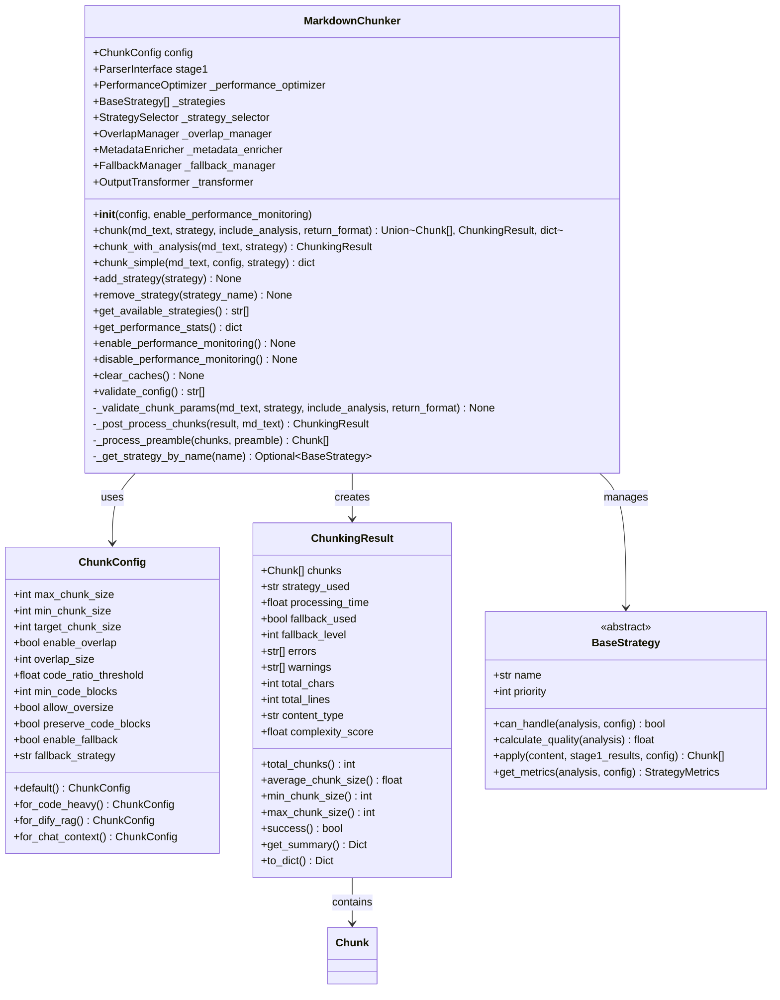

# MarkdownChunker Class API Documentation

<cite>
**Referenced Files in This Document**
- [markdown_chunker/__init__.py](file://markdown_chunker/__init__.py)
- [markdown_chunker/chunker/core.py](file://markdown_chunker/chunker/core.py)
- [markdown_chunker/chunker/types.py](file://markdown_chunker/chunker/types.py)
- [markdown_chunker/chunker/performance.py](file://markdown_chunker/chunker/performance.py)
- [markdown_chunker/chunker/orchestrator.py](file://markdown_chunker/chunker/orchestrator.py)
- [markdown_chunker/chunker/strategies/base.py](file://markdown_chunker/chunker/strategies/base.py)
- [markdown_chunker/chunker/selector.py](file://markdown_chunker/chunker/selector.py)
- [examples/api_usage.py](file://examples/api_usage.py)
- [examples/basic_usage.py](file://examples/basic_usage.py)
- [tests/chunker/test_chunker.py](file://tests/chunker/test_chunker.py)
</cite>

## Table of Contents
1. [Introduction](#introduction)
2. [Class Overview](#class-overview)
3. [Constructor and Initialization](#constructor-and-initialization)
4. [Core Chunking Methods](#core-chunking-methods)
5. [Strategy Management](#strategy-management)
6. [Performance Monitoring](#performance-monitoring)
7. [Configuration and Validation](#configuration-and-validation)
8. [Error Handling](#error-handling)
9. [Usage Examples](#usage-examples)
10. [Common Issues and Solutions](#common-issues-and-solutions)

## Introduction

The `MarkdownChunker` class serves as the primary interface for Stage 2 chunking operations in the Dify Markdown Chunker system. It orchestrates the entire chunking process, from content analysis through strategy selection to final chunk generation, while providing intelligent automatic strategy selection and comprehensive error handling.

The class implements a sophisticated pipeline that combines:
- **Stage 1 Analysis**: Content analysis and element detection
- **Strategy Selection**: Automatic or manual strategy selection based on content characteristics
- **Adaptive Chunking**: Application of optimal chunking strategies
- **Post-Processing**: Overlap management, metadata enrichment, and validation
- **Fallback Mechanisms**: Graceful degradation when primary strategies fail

## Class Overview



**Diagram sources**
- [markdown_chunker/chunker/core.py](file://markdown_chunker/chunker/core.py#L40-L150)
- [markdown_chunker/chunker/types.py](file://markdown_chunker/chunker/types.py#L292-L495)
- [markdown_chunker/chunker/strategies/base.py](file://markdown_chunker/chunker/strategies/base.py#L16-L95)

## Constructor and Initialization

### `__init__(self, config: Optional[ChunkConfig] = None, enable_performance_monitoring: bool = False)`

Creates a new MarkdownChunker instance with the specified configuration.

**Parameters:**
- `config` (Optional[ChunkConfig]): Configuration for chunking behavior. If None, uses default configuration with `max_chunk_size=4096`, `min_chunk_size=512`, and `enable_overlap=True`. See ChunkConfig for all options.
- `enable_performance_monitoring` (bool): Enable performance monitoring and optimization. When True, tracks timing metrics for all operations. Defaults to False for minimal overhead.

**Returns:** None

**Exceptions:**
- No explicit exceptions during initialization, but configuration validation occurs internally

**Notes:**
- The chunker is thread-safe for read operations
- Strategies are initialized once and reused
- Performance optimizer tracks metrics automatically when enabled
- All 6 strategies are loaded at initialization

**Section sources**
- [markdown_chunker/chunker/core.py](file://markdown_chunker/chunker/core.py#L61-L152)

## Core Chunking Methods

### `chunk(self, md_text: str, strategy: Optional[str] = None, include_analysis: bool = False, return_format: Literal["objects", "dict"] = "objects") -> Union[List[Chunk], ChunkingResult, dict]`

Unified chunking method supporting multiple return formats.

This is the primary method for chunking markdown documents. It automatically selects the optimal chunking strategy based on content analysis, or uses a specified strategy if provided.

**Parameters:**
- `md_text` (str): Markdown content to process. Must be valid UTF-8 text.
- `strategy` (Optional[str]): Optional strategy override. Valid values:
  - None: Auto-select based on content (default)
  - "code": For code-heavy documents (≥70% code)
  - "mixed": For mixed content with diverse elements
  - "list": For list-heavy documents (≥5 lists)
  - "table": For table-heavy documents (≥3 tables)
  - "structural": For well-structured documents with headers
  - "sentences": For simple text documents
- `include_analysis` (bool): Include detailed analysis metadata in result.
  - False: Returns List[Chunk] (default, backward compatible)
  - True: Returns ChunkingResult with full metadata
- `return_format` (Literal["objects", "dict"]): Output format for the result.
  - "objects": Return Python objects (Chunk/ChunkingResult)
  - "dict": Return dictionary representation (JSON-serializable)

**Returns:**
- The return type depends on parameters:
  - List[Chunk]: When `include_analysis=False`, `return_format="objects"` (default)
  - ChunkingResult: When `include_analysis=True`, `return_format="objects"`
  - dict: When `return_format="dict"` (regardless of `include_analysis`)

**Raises:**
- `ValueError`: If `md_text` is empty or invalid
- `StrategySelectionError`: If specified strategy is not found
- `ChunkingError`: If chunking fails completely

**Examples:**

```python
# Basic usage (backward compatible)
chunker = MarkdownChunker()
chunks = chunker.chunk("# Hello\n\nWorld")
print(len(chunks))  # 1
print(chunks[0].content)  # '# Hello\n\nWorld'

# With detailed analysis
result = chunker.chunk("# Hello\n\nWorld", include_analysis=True)
print(result.strategy_used)  # 'structural'
print(result.processing_time)  # 0.123
print(len(result.chunks))  # 1

# As dictionary (for JSON APIs)
data = chunker.chunk("# Hello\n\nWorld", return_format="dict")
print(data['chunks'][0]['content'])  # '# Hello\n\nWorld'
print(data['strategy_used'])  # 'structural'

# Force specific strategy
chunks = chunker.chunk(code_doc, strategy="code")
print(chunks[0].metadata['strategy'])  # 'code'

# Combine parameters
data = chunker.chunk(
    "# Test",
    strategy="structural",
    include_analysis=True,
    return_format="dict"
)
print(data['metadata']['strategy_used'])  # 'structural'
```

**Section sources**
- [markdown_chunker/chunker/core.py](file://markdown_chunker/chunker/core.py#L154-L262)

### `chunk_with_analysis(self, md_text: str, strategy: Optional[str] = None) -> ChunkingResult`

**Deprecated**: Use `chunk()` with `include_analysis=True` instead. This method will be removed in version 2.0.0.

**Parameters:**
- `md_text` (str): Markdown content to chunk
- `strategy` (Optional[str]): Optional strategy override

**Returns:**
- ChunkingResult with chunks, strategy used, analysis, etc.

**Raises:**
- `ChunkingError`: If chunking fails completely

**See Also:**
- `chunk()`: Unified chunking method

**Section sources**
- [markdown_chunker/chunker/core.py](file://markdown_chunker/chunker/core.py#L410-L446)

### `chunk_simple(self, md_text: str, config: Optional[dict] = None, strategy: Optional[str] = None) -> dict`

**Deprecated**: Use `chunk()` with `return_format='dict'` instead. This method will be removed in version 2.0.0.

**Parameters:**
- `md_text` (str): Markdown content to chunk
- `config` (Optional[dict]): Optional configuration as dictionary
- `strategy` (Optional[str]): Optional strategy override

**Returns:**
- Dictionary with chunks and metadata

**Examples:**
```python
# Old way (deprecated)
result = chunker.chunk_simple("# Test")

# New way (recommended)
result = chunker.chunk("# Test", return_format="dict")

# With custom config (old way)
result = chunker.chunk_simple("# Test", config={'max_chunk_size': 2048})

# With custom config (new way)
chunker = MarkdownChunker(ChunkConfig(max_chunk_size=2048))
result = chunker.chunk("# Test", return_format="dict")
```

**See Also:**
- `chunk()`: Unified chunking method

**Section sources**
- [markdown_chunker/chunker/core.py](file://markdown_chunker/chunker/core.py#L719-L774)

## Strategy Management

### `add_strategy(self, strategy: BaseStrategy) -> None`

Add a custom strategy to the chunker.

Allows extending the chunker with custom chunking strategies. The new strategy will be available for automatic selection and manual override via the strategy parameter.

**Parameters:**
- `strategy` (BaseStrategy): Custom strategy instance implementing BaseStrategy. Must have unique name and implement `can_handle()` and `apply()` methods.

**Examples:**

```python
from markdown_chunker.chunker.strategies.base import BaseStrategy

class CustomStrategy(BaseStrategy):
    def __init__(self):
        super().__init__()
        self.name = "custom"
        self.priority = 50
    
    def can_handle(self, analysis, config):
        return analysis.complexity_score > 0.5
    
    def apply(self, text, stage1_results, config):
        # Custom chunking logic
        return [Chunk(text, 1, 1, {})]

chunker = MarkdownChunker()
chunker.add_strategy(CustomStrategy())
print("custom" in chunker.get_available_strategies())  # True
chunks = chunker.chunk(text, strategy="custom")
```

**See Also:**
- `remove_strategy()`: Remove a strategy
- `get_available_strategies()`: List all strategies
- `BaseStrategy`: Base class for custom strategies

**Notes:**
- Strategy selector is recreated after adding
- Duplicate strategy names will override existing ones
- Custom strategies participate in automatic selection

**Section sources**
- [markdown_chunker/chunker/core.py](file://markdown_chunker/chunker/core.py#L501-L551)

### `remove_strategy(self, strategy_name: str) -> None`

Remove a strategy from the chunker.

Removes a strategy by name, making it unavailable for both automatic selection and manual override. Useful for disabling strategies that don't fit your use case.

**Parameters:**
- `strategy_name` (str): Name of strategy to remove. Must match exactly one of the available strategy names (case-sensitive).

**Examples:**

```python
chunker = MarkdownChunker()
print(len(chunker.get_available_strategies()))  # 6

# Remove table strategy if you never process tables
chunker.remove_strategy("table")
print(len(chunker.get_available_strategies()))  # 5
print("table" in chunker.get_available_strategies())  # False

# Trying to use removed strategy will raise error
try:
    chunker.chunk(text, strategy="table")
except StrategySelectionError as e:
    print("Strategy not found")
```

**See Also:**
- `add_strategy()`: Add a custom strategy
- `get_available_strategies()`: List all strategies

**Notes:**
- Strategy selector is recreated after removal
- Removing all strategies will cause chunking to fail
- Built-in strategies can be removed but not restored
- No error if strategy name doesn't exist

**Section sources**
- [markdown_chunker/chunker/core.py](file://markdown_chunker/chunker/core.py#L553-L601)

### `get_available_strategies(self) -> List[str]`

Get list of available strategy names.

Returns all strategy names that can be used with the `chunk()` method's strategy parameter. Includes both built-in and custom strategies.

**Returns:**
- List of strategy names (strings) that can be passed to `chunk(strategy=...)`. Default strategies: "code", "mixed", "list", "table", "structural", "sentences".

**Examples:**

```python
chunker = MarkdownChunker()
strategies = chunker.get_available_strategies()
print(strategies)  # ['code', 'mixed', 'list', 'table', 'structural', 'sentences']

# Check if specific strategy is available
if "code" in chunker.get_available_strategies():
    chunks = chunker.chunk(code_doc, strategy="code")

# After adding custom strategy
chunker.add_strategy(CustomStrategy())
print("custom" in chunker.get_available_strategies())  # True
```

**See Also:**
- `chunk()`: Main chunking method that accepts strategy parameter
- `add_strategy()`: Add custom strategies
- `remove_strategy()`: Remove strategies

**Notes:**
- Order of strategies in list is not guaranteed
- Strategy names are case-sensitive
- Empty list means no strategies available (will cause errors)

**Section sources**
- [markdown_chunker/chunker/core.py](file://markdown_chunker/chunker/core.py#L602-L641)

## Performance Monitoring

### `get_performance_stats(self) -> dict`

Get performance statistics for all operations.

Returns detailed timing metrics for chunking operations when performance monitoring is enabled. Useful for profiling and optimization.

**Returns:**
- Dictionary with performance metrics including:
  - `'chunk'`: Stats for chunk() method (count, total_time, avg_time)
  - `'strategy_selection'`: Stats for strategy selection
  - `'overlap'`: Stats for overlap processing
  - `'metadata'`: Stats for metadata enrichment
  Each stat includes: count, total_time, avg_time, min_time, max_time

**Examples:**

```python
# Enable monitoring first
chunker = MarkdownChunker(enable_performance_monitoring=True)

# Process some documents
for doc in documents:
    chunker.chunk(doc)

# Get statistics
stats = chunker.get_performance_stats()
print(f"Average chunk time: {stats['chunk']['avg_time']:.3f}s")
print(f"Total operations: {stats['chunk']['count']}")

# Check for performance issues
if stats['chunk']['max_time'] > 1.0:
    print("Warning: Slow chunking detected")
```

**See Also:**
- `enable_performance_monitoring()`: Enable monitoring
- `disable_performance_monitoring()`: Disable monitoring
- `clear_caches()`: Clear performance caches

**Notes:**
- Returns empty dict if monitoring is disabled
- Stats are cumulative since chunker creation
- Use clear_caches() to reset statistics
- Minimal overhead when monitoring is enabled (<5%)

**Section sources**
- [markdown_chunker/chunker/core.py](file://markdown_chunker/chunker/core.py#L660-L704)

### `enable_performance_monitoring(self)`

Enable performance monitoring.

**Section sources**
- [markdown_chunker/chunker/core.py](file://markdown_chunker/chunker/core.py#L710-L712)

### `disable_performance_monitoring(self)`

Disable performance monitoring.

**Section sources**
- [markdown_chunker/chunker/core.py](file://markdown_chunker/chunker/core.py#L714-L716)

### `clear_caches(self)`

Clear all performance caches.

**Section sources**
- [markdown_chunker/chunker/core.py](file://markdown_chunker/chunker/core.py#L706-L708)

## Configuration and Validation

### `validate_config(self) -> List[str]`

Validate current configuration.

**Returns:**
- List of validation errors (empty if valid)

**Section sources**
- [markdown_chunker/chunker/core.py](file://markdown_chunker/chunker/core.py#L642-L660)

## Error Handling

The MarkdownChunker class implements comprehensive error handling through several mechanisms:

### Strategy Selection Errors

```python
try:
    chunks = chunker.chunk(document, strategy="invalid_strategy")
except StrategySelectionError as e:
    print(f"Strategy error: {e}")
    # Handle strategy selection failure
```

### Configuration Errors

```python
try:
    chunker = MarkdownChunker(invalid_config)
except ConfigurationError as e:
    print(f"Configuration error: {e}")
    # Handle invalid configuration
```

### Chunking Errors

```python
try:
    result = chunker.chunk(document)
    if not result.success:
        print(f"Chunking errors: {result.errors}")
        print(f"Warnings: {result.warnings}")
except ChunkingError as e:
    print(f"Chunking error: {e}")
    # Handle chunking failure
```

**Section sources**
- [markdown_chunker/api/error_handler.py](file://markdown_chunker/api/error_handler.py#L51-L79)

## Usage Examples

### Basic Initialization and Chunking

```python
from markdown_chunker import MarkdownChunker, ChunkConfig

# Basic usage with default configuration
chunker = MarkdownChunker()
markdown = "# Hello World\n\nThis is a test document."
chunks = chunker.chunk(markdown)
print(f"Created {len(chunks)} chunks")

# With custom configuration
config = ChunkConfig(
    max_chunk_size=2048,
    min_chunk_size=256,
    enable_overlap=True
)
chunker = MarkdownChunker(config)
result = chunker.chunk(markdown, include_analysis=True)
print(f"Strategy used: {result.strategy_used}")
print(f"Processing time: {result.processing_time:.3f}s")
```

### Using Configuration Profiles

```python
# Code-heavy documentation
config = ChunkConfig.for_code_heavy()
chunker = MarkdownChunker(config)
chunks = chunker.chunk(api_documentation)

# RAG system configuration
config = ChunkConfig.for_dify_rag()
chunker = MarkdownChunker(config)
chunks = chunker.chunk(context_document)

# Chat context optimization
config = ChunkConfig.for_chat_context()
chunker = MarkdownChunker(config)
chunks = chunker.chunk(chat_history)
```

### Strategy Override Examples

```python
# Force code strategy for code-heavy content
chunks = chunker.chunk(code_document, strategy="code")

# Force structural strategy for well-formatted documents
chunks = chunker.chunk(structured_doc, strategy="structural")

# Force sentences strategy for simple text
chunks = chunker.chunk(simple_text, strategy="sentences")
```

### Performance Monitoring

```python
# Enable monitoring
chunker = MarkdownChunker(enable_performance_monitoring=True)

# Process documents
documents = [doc1, doc2, doc3]
for doc in documents:
    chunker.chunk(doc)

# Get performance statistics
stats = chunker.get_performance_stats()
print(f"Average chunk time: {stats['chunk']['avg_time']:.3f}s")
print(f"Total chunks: {stats['chunk']['count']}")

# Clear caches if needed
chunker.clear_caches()
```

**Section sources**
- [examples/basic_usage.py](file://examples/basic_usage.py#L14-L364)
- [examples/api_usage.py](file://examples/api_usage.py#L16-L356)

## Common Issues and Solutions

### Strategy Selection Errors

**Problem**: `StrategySelectionError` when specifying invalid strategy names.

**Solution**: Use `get_available_strategies()` to check valid strategy names:

```python
chunker = MarkdownChunker()
available = chunker.get_available_strategies()
print(f"Available strategies: {available}")

# Use valid strategy name
chunks = chunker.chunk(document, strategy="code")  # Not "CODE" or "Code"
```

### Configuration Validation Issues

**Problem**: Configuration errors when creating chunker instances.

**Solution**: Use predefined configuration profiles or validate manually:

```python
# Use factory methods
config = ChunkConfig.for_code_heavy()

# Or validate custom configuration
config = ChunkConfig(max_chunk_size=4096, min_chunk_size=512)
errors = chunker.validate_config()
if errors:
    print(f"Configuration errors: {errors}")
```

### Performance Monitoring Issues

**Problem**: High memory usage with performance monitoring enabled.

**Solution**: Disable monitoring for production or use selective monitoring:

```python
# Disable monitoring for production
chunker = MarkdownChunker(enable_performance_monitoring=False)

# Or selectively monitor specific operations
chunker.enable_performance_monitoring()
# Only monitor chunking operations
stats = chunker.get_performance_stats()
```

### Memory and Performance Optimization

**Problem**: Slow chunking for large documents.

**Solution**: Use appropriate configuration and monitoring:

```python
# For large documents
config = ChunkConfig.for_large_documents()
chunker = MarkdownChunker(config)

# Enable performance monitoring to identify bottlenecks
chunker.enable_performance_monitoring()
result = chunker.chunk(large_document)
stats = chunker.get_performance_stats()
```

### Error Recovery Patterns

```python
def robust_chunking(chunker, document, fallback_strategy="sentences"):
    """Robust chunking with error recovery."""
    try:
        # Try with automatic strategy selection
        result = chunker.chunk(document, include_analysis=True)
        if result.success:
            return result.chunks
            
        # If automatic selection fails, try fallback strategy
        print(f"Automatic strategy failed, trying {fallback_strategy}")
        return chunker.chunk(document, strategy=fallback_strategy)
        
    except Exception as e:
        # Fallback to sentences strategy as last resort
        print(f"All strategies failed: {e}")
        return chunker.chunk(document, strategy="sentences")
```

**Section sources**
- [tests/chunker/test_chunker.py](file://tests/chunker/test_chunker.py#L196-L305)