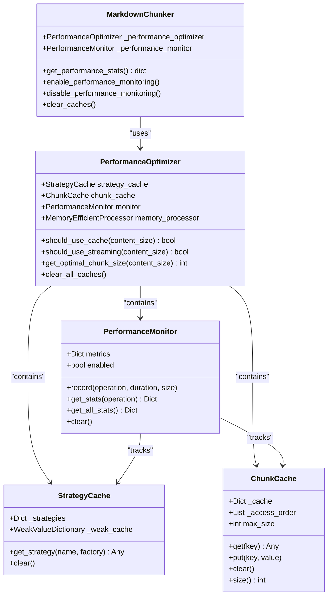
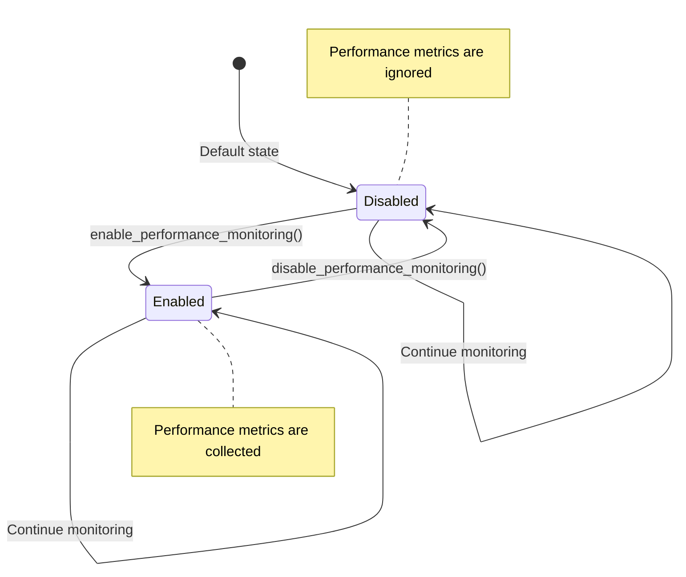
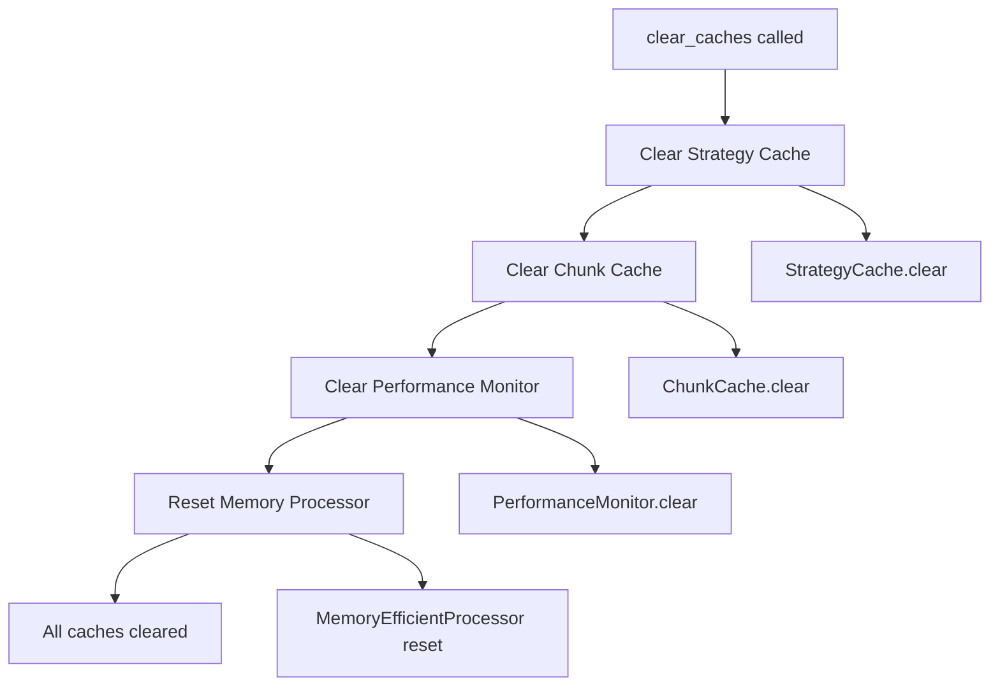

# Performance Monitoring Methods

<cite>
**Referenced Files in This Document**
- [markdown_chunker/chunker/performance.py](file://markdown_chunker/chunker/performance.py)
- [markdown_chunker/chunker/core.py](file://markdown_chunker/chunker/core.py)
- [tests/chunker/test_performance.py](file://tests/chunker/test_performance.py)
- [examples/api_usage.py](file://examples/api_usage.py)
- [benchmarks/benchmark_chunker.py](file://benchmarks/benchmark_chunker.py)
</cite>

## Table of Contents
1. [Introduction](#introduction)
2. [Performance Monitoring Architecture](#performance-monitoring-architecture)
3. [Core Methods Overview](#core-methods-overview)
4. [get_performance_stats() Method](#get_performance_stats-method)
5. [enable_performance_monitoring() Method](#enable_performance_monitoring-method)
6. [disable_performance_monitoring() Method](#disable_performance_monitoring-method)
7. [clear_caches() Method](#clear_caches-method)
8. [Practical Usage Examples](#practical-usage-examples)
9. [Performance Characteristics](#performance-characteristics)
10. [Common Issues and Troubleshooting](#common-issues-and-troubleshooting)
11. [Best Practices](#best-practices)

## Introduction

The MarkdownChunker performance monitoring system provides comprehensive timing and throughput metrics for chunking operations. This system enables developers to profile their applications, identify performance bottlenecks, and optimize chunking configurations. The monitoring framework operates with minimal overhead (<5%) and provides detailed statistics across multiple operational phases.

The performance monitoring system consists of four primary methods that work together to provide visibility into chunking performance:
- `get_performance_stats()` - Retrieves comprehensive performance statistics
- `enable_performance_monitoring()` - Activates performance tracking
- `disable_performance_monitoring()` - Deactivates performance tracking
- `clear_caches()` - Resets performance statistics and clears internal caches

## Performance Monitoring Architecture

The performance monitoring system is built around several key components that work together to provide comprehensive metrics:



**Diagram sources**
- [markdown_chunker/chunker/performance.py](file://markdown_chunker/chunker/performance.py#L32-L82)
- [markdown_chunker/chunker/performance.py](file://markdown_chunker/chunker/performance.py#L210-L243)
- [markdown_chunker/chunker/core.py](file://markdown_chunker/chunker/core.py#L60-L125)

**Section sources**
- [markdown_chunker/chunker/performance.py](file://markdown_chunker/chunker/performance.py#L32-L243)
- [markdown_chunker/chunker/core.py](file://markdown_chunker/chunker/core.py#L60-L125)

## Core Methods Overview

The performance monitoring system provides four essential methods for managing and accessing performance data:

| Method | Purpose | Parameters | Return Type | Performance Impact |
|--------|---------|------------|-------------|-------------------|
| `get_performance_stats()` | Retrieve all performance statistics | None | `dict` | Minimal overhead |
| `enable_performance_monitoring()` | Activate performance tracking | None | `None` | Minimal overhead |
| `disable_performance_monitoring()` | Deactivate performance tracking | None | `None` | Minimal overhead |
| `clear_caches()` | Reset performance statistics and caches | None | `None` | Low overhead |

Each method is designed to operate with minimal performance impact while providing comprehensive monitoring capabilities.

**Section sources**
- [markdown_chunker/chunker/core.py](file://markdown_chunker/chunker/core.py#L660-L717)

## get_performance_stats() Method

The `get_performance_stats()` method retrieves comprehensive performance statistics for all monitored operations. When performance monitoring is enabled, this method returns detailed timing metrics across four key operational phases.

### Method Signature and Behavior

```python
def get_performance_stats(self) -> dict:
    """
    Get performance statistics for all operations.
    
    Returns detailed timing metrics for chunking operations when
    performance monitoring is enabled. Useful for profiling and
    optimization.
    
    Returns:
        Dictionary with performance metrics including:
        - 'chunk': Stats for chunk() method (count, total_time, avg_time)
        - 'strategy_selection': Stats for strategy selection
        - 'overlap': Stats for overlap processing
        - 'metadata': Stats for metadata enrichment
        Each stat includes: count, total_time, avg_time, min_time, max_time
    """
```

### Returned Dictionary Structure

The method returns a dictionary with the following structure:

```python
{
    "chunk": {
        "count": 10,           # Number of chunk operations performed
        "total_time": 0.5,     # Total time spent in chunk operations (seconds)
        "avg_time": 0.05,      # Average time per chunk operation (seconds)
        "min_time": 0.01,      # Minimum time for a single operation
        "max_time": 0.15       # Maximum time for a single operation
    },
    "strategy_selection": {
        "count": 10,
        "total_time": 0.02,
        "avg_time": 0.002,
        "min_time": 0.001,
        "max_time": 0.005
    },
    "overlap": {
        "count": 10,
        "total_time": 0.01,
        "avg_time": 0.001,
        "min_time": 0.0005,
        "max_time": 0.002
    },
    "metadata": {
        "count": 10,
        "total_time": 0.03,
        "avg_time": 0.003,
        "min_time": 0.001,
        "max_time": 0.008
    }
}
```

### Statistics Keys and Metrics

Each operational phase includes the following metrics:

| Metric | Description | Calculation |
|--------|-------------|-------------|
| `count` | Number of operations performed | Integer count |
| `total_time` | Cumulative time spent | Sum of all operation durations |
| `avg_time` | Average operation duration | `total_time / count` |
| `min_time` | Fastest individual operation | Minimum duration |
| `max_time` | Slowest individual operation | Maximum duration |
| `avg_size` | Average data processed | Available when size data is recorded |
| `throughput` | Processing rate (bytes/second) | `sum(size) / sum(duration)` |

### Usage Examples

#### Basic Statistics Retrieval
```python
# Enable monitoring
chunker = MarkdownChunker(enable_performance_monitoring=True)

# Process documents
for doc in documents:
    chunker.chunk(doc)

# Get statistics
stats = chunker.get_performance_stats()
print(f"Average chunk time: {stats['chunk']['avg_time']:.3f}s")
print(f"Total operations: {stats['chunk']['count']}")
```

#### Performance Analysis
```python
stats = chunker.get_performance_stats()

# Identify slow operations
slow_ops = [(op, data['avg_time']) for op, data in stats.items() 
           if data['avg_time'] > 0.1]

if slow_ops:
    print("Potential performance bottlenecks:")
    for op, avg_time in sorted(slow_ops, key=lambda x: x[1], reverse=True):
        print(f"  {op}: {avg_time:.3f}s average")
```

**Section sources**
- [markdown_chunker/chunker/core.py](file://markdown_chunker/chunker/core.py#L660-L704)
- [tests/chunker/test_performance.py](file://tests/chunker/test_performance.py#L73-L132)

## enable_performance_monitoring() Method

The `enable_performance_monitoring()` method activates the performance monitoring system, allowing the collection of timing metrics for all chunking operations. This method sets the internal monitoring state to enabled and begins tracking performance data.

### Method Implementation

```python
def enable_performance_monitoring(self):
    """Enable performance monitoring."""
    self._performance_optimizer.monitor.enabled = True
```

### Boolean State Management

The monitoring system uses a boolean state flag that controls whether performance metrics are collected:



**Diagram sources**
- [markdown_chunker/chunker/core.py](file://markdown_chunker/chunker/core.py#L710-L716)

### Minimal Performance Overhead

The monitoring system operates with minimal overhead (<5%) through several optimization strategies:

1. **Conditional Recording**: Metrics are only recorded when `enabled = True`
2. **Lazy Initialization**: Monitoring components are initialized only when needed
3. **Efficient Data Structures**: Uses optimized dictionaries and lists for metric storage
4. **Minimal Memory Allocation**: Reuses existing data structures when possible

### Usage Examples

#### Enabling Monitoring During Initialization
```python
# Enable monitoring from the start
chunker = MarkdownChunker(enable_performance_monitoring=True)

# Monitor is active immediately
stats = chunker.get_performance_stats()  # Returns performance data
```

#### Dynamic Monitoring Control
```python
chunker = MarkdownChunker()

# Initially disabled
stats = chunker.get_performance_stats()  # Returns {}

# Enable monitoring
chunker.enable_performance_monitoring()

# Now monitoring is active
stats = chunker.get_performance_stats()  # Returns performance data
```

**Section sources**
- [markdown_chunker/chunker/core.py](file://markdown_chunker/chunker/core.py#L710-L712)
- [tests/chunker/test_performance.py](file://tests/chunker/test_performance.py#L321-L329)

## disable_performance_monitoring() Method

The `disable_performance_monitoring()` method deactivates the performance monitoring system, stopping the collection of timing metrics while preserving the ability to retrieve previously collected statistics.

### Method Implementation

```python
def disable_performance_monitoring(self):
    """Disable performance monitoring."""
    self._performance_optimizer.monitor.enabled = False
```

### State Transition and Behavior

When monitoring is disabled, the system exhibits the following behavior:

1. **No New Metrics**: All performance recording operations are skipped
2. **Preserved Statistics**: Previously collected metrics remain accessible
3. **Immediate Effect**: Changes take effect immediately without restart
4. **Reversible**: Monitoring can be re-enabled at any time

### Practical Applications

#### Temporary Monitoring
```python
chunker = MarkdownChunker(enable_performance_monitoring=True)

# Collect baseline metrics
baseline_stats = chunker.get_performance_stats()

# Disable temporarily for production load
chunker.disable_performance_monitoring()

# Process production documents
for doc in production_documents:
    chunker.chunk(doc)  # No performance overhead

# Re-enable for analysis
chunker.enable_performance_monitoring()
final_stats = chunker.get_performance_stats()
```

#### Conditional Monitoring
```python
chunker = MarkdownChunker()

# Enable only during development
if DEBUG_MODE:
    chunker.enable_performance_monitoring()

# Process documents
results = chunker.chunk(document)

# Get stats only if monitoring was enabled
stats = chunker.get_performance_stats()
if stats:  # Will be empty if monitoring was disabled
    analyze_performance(stats)
```

**Section sources**
- [markdown_chunker/chunker/core.py](file://markdown_chunker/chunker/core.py#L714-L716)
- [tests/chunker/test_performance.py](file://tests/chunker/test_performance.py#L321-L329)

## clear_caches() Method

The `clear_caches()` method resets all performance-related caches and statistics, providing a clean slate for performance measurement cycles. This method clears both performance metrics and internal caching mechanisms.

### Method Implementation

```python
def clear_caches(self):
    """Clear all performance caches."""
    self._performance_optimizer.clear_all_caches()
```

### Cache Reset Operations

The method performs comprehensive cache clearing across all subsystems:



**Diagram sources**
- [markdown_chunker/chunker/performance.py](file://markdown_chunker/chunker/performance.py#L238-L242)
- [markdown_chunker/chunker/performance.py](file://markdown_chunker/chunker/performance.py#L158-L161)

### Role in Performance Measurement

The `clear_caches()` method serves several important roles in performance measurement:

1. **Baseline Establishment**: Clears accumulated metrics for fresh measurements
2. **Memory Management**: Releases cached data to free memory
3. **Statistical Accuracy**: Prevents cumulative effects from affecting measurements
4. **Testing Preparation**: Resets state for controlled testing scenarios

### Usage Examples

#### Establishing Baseline Measurements
```python
chunker = MarkdownChunker(enable_performance_monitoring=True)

# Clear caches before baseline measurement
chunker.clear_caches()

# Process warm-up documents
for doc in warmup_documents:
    chunker.chunk(doc)

# Get baseline statistics
baseline_stats = chunker.get_performance_stats()

# Clear caches for actual measurement
chunker.clear_caches()

# Process test documents
for doc in test_documents:
    chunker.chunk(doc)

# Compare with baseline
final_stats = chunker.get_performance_stats()
```

#### Memory-Conscious Usage
```python
chunker = MarkdownChunker(enable_performance_monitoring=True)

# Process large number of documents
for i, doc in enumerate(large_document_set):
    chunker.chunk(doc)
    
    # Clear caches periodically to manage memory
    if i % 100 == 0:
        chunker.clear_caches()

# Final statistics
stats = chunker.get_performance_stats()
```

#### Testing and Benchmarking
```python
chunker = MarkdownChunker()

# Clear caches before benchmark
chunker.clear_caches()

# Enable monitoring for benchmark
chunker.enable_performance_monitoring()

# Run benchmark
for i in range(benchmark_iterations):
    chunker.chunk(sample_document)

# Get benchmark results
results = chunker.get_performance_stats()
```

**Section sources**
- [markdown_chunker/chunker/core.py](file://markdown_chunker/chunker/core.py#L706-L708)
- [markdown_chunker/chunker/performance.py](file://markdown_chunker/chunker/performance.py#L238-L242)

## Practical Usage Examples

This section provides comprehensive examples demonstrating how to effectively use the performance monitoring methods in real-world scenarios.

### Example 1: Basic Performance Monitoring Setup

```python
from markdown_chunker import MarkdownChunker

# Initialize chunker with performance monitoring
chunker = MarkdownChunker(enable_performance_monitoring=True)

# Process documents
documents = [
    "# Introduction\nThis is a test document.",
    "# API Reference\n```python\ndef test():\n    pass\n```",
    "# Tutorial\nStep-by-step guide..."
]

for doc in documents:
    chunker.chunk(doc)

# Retrieve and analyze performance statistics
stats = chunker.get_performance_stats()

print("Performance Statistics:")
print(f"Total chunk operations: {stats['chunk']['count']}")
print(f"Average chunk time: {stats['chunk']['avg_time']:.3f}s")
print(f"Strategy selection time: {stats['strategy_selection']['avg_time']:.3f}s")
```

### Example 2: Performance Bottleneck Analysis

```python
def analyze_performance_bottlenecks(chunker, documents):
    """Analyze and report performance bottlenecks."""
    
    # Process documents
    for doc in documents:
        chunker.chunk(doc)
    
    # Get statistics
    stats = chunker.get_performance_stats()
    
    # Define threshold for bottleneck identification
    threshold = 0.1  # 100ms
    
    print("Performance Bottleneck Analysis:")
    print("=" * 50)
    
    for operation, metrics in stats.items():
        avg_time = metrics['avg_time']
        if avg_time > threshold:
            print(f"⚠️  {operation}:")
            print(f"   - Average time: {avg_time:.3f}s")
            print(f"   - Total operations: {metrics['count']}")
            print(f"   - Max time: {metrics['max_time']:.3f}s")
            print(f"   - Min time: {metrics['min_time']:.3f}s")
            print()
    
    return stats

# Usage
chunker = MarkdownChunker(enable_performance_monitoring=True)
documents = load_large_document_set()
analyze_performance_bottlenecks(chunker, documents)
```

### Example 3: Dynamic Monitoring Control

```python
class PerformanceAnalyzer:
    def __init__(self):
        self.chunker = MarkdownChunker()
        self.stats_history = []
    
    def benchmark_with_monitoring(self, documents, iterations=10):
        """Benchmark with dynamic monitoring control."""
        
        # Clear caches before benchmark
        self.chunker.clear_caches()
        
        # Enable monitoring
        self.chunker.enable_performance_monitoring()
        
        # Warm up
        for doc in documents[:5]:
            self.chunker.chunk(doc)
        
        # Benchmark
        for i in range(iterations):
            for doc in documents:
                self.chunker.chunk(doc)
            
            # Record statistics periodically
            if i % 2 == 0:
                stats = self.chunker.get_performance_stats()
                self.stats_history.append(stats)
        
        # Disable monitoring to reduce overhead
        self.chunker.disable_performance_monitoring()
        
        return self.stats_history
    
    def analyze_trends(self):
        """Analyze performance trends over time."""
        if not self.stats_history:
            return
        
        print("Performance Trends Analysis:")
        print("=" * 50)
        
        for i, stats in enumerate(self.stats_history):
            avg_chunk_time = stats['chunk']['avg_time']
            total_ops = stats['chunk']['count']
            
            print(f"Benchmark {i+1}:")
            print(f"  - Average chunk time: {avg_chunk_time:.3f}s")
            print(f"  - Total operations: {total_ops}")
            print()

# Usage
analyzer = PerformanceAnalyzer()
documents = load_test_documents()
history = analyzer.benchmark_with_monitoring(documents, iterations=5)
analyzer.analyze_trends()
```

### Example 4: Throughput Analysis

```python
def analyze_throughput(chunker, documents):
    """Analyze processing throughput in bytes per second."""
    
    # Clear caches and enable monitoring
    chunker.clear_caches()
    chunker.enable_performance_monitoring()
    
    total_bytes = 0
    start_time = time.time()
    
    # Process all documents
    for doc in documents:
        total_bytes += len(doc.encode('utf-8'))
        chunker.chunk(doc)
    
    end_time = time.time()
    elapsed_time = end_time - start_time
    
    # Get statistics
    stats = chunker.get_performance_stats()
    
    # Calculate throughput
    throughput = total_bytes / elapsed_time if elapsed_time > 0 else 0
    
    print("Throughput Analysis:")
    print(f"Total bytes processed: {total_bytes:,}")
    print(f"Total time: {elapsed_time:.2f}s")
    print(f"Average throughput: {throughput:,.0f} bytes/second")
    print(f"Average chunk size: {stats['chunk']['avg_size']:.0f} bytes")
    
    return throughput, stats

# Usage
chunker = MarkdownChunker(enable_performance_monitoring=True)
documents = load_various_document_types()
throughput, stats = analyze_throughput(chunker, documents)
```

### Example 5: Production Monitoring with Graceful Degradation

```python
class ProductionChunker:
    def __init__(self):
        self.chunker = MarkdownChunker()
        self.monitoring_enabled = False
        self.production_mode = True
    
    def process_document(self, content):
        """Process document with production-friendly monitoring."""
        
        start_time = time.time()
        
        try:
            # Process document
            result = self.chunker.chunk(content)
            
            # Collect performance metrics in production mode
            if self.production_mode and self.monitoring_enabled:
                processing_time = time.time() - start_time
                
                # Log performance metrics (production logging)
                self._log_performance_metrics(processing_time, len(content))
                
                # Periodic monitoring analysis
                if random.random() < 0.1:  # 10% chance to analyze
                    self._analyze_performance()
            
            return result
            
        except Exception as e:
            # Handle processing errors gracefully
            logger.error(f"Chunking failed: {e}")
            return None
    
    def enable_production_monitoring(self):
        """Enable monitoring for production analysis."""
        self.monitoring_enabled = True
        self.chunker.enable_performance_monitoring()
    
    def disable_production_monitoring(self):
        """Disable monitoring to reduce overhead."""
        self.monitoring_enabled = False
        self.chunker.disable_performance_monitoring()
    
    def _log_performance_metrics(self, processing_time, content_size):
        """Log performance metrics for monitoring."""
        # In production, this would send metrics to monitoring systems
        logger.info(f"PROD_CHUNK: time={processing_time:.3f}s, size={content_size}")
    
    def _analyze_performance(self):
        """Periodic performance analysis."""
        stats = self.chunker.get_performance_stats()
        
        # Check for performance degradation
        avg_time = stats.get('chunk', {}).get('avg_time', 0)
        if avg_time > 0.2:  # 200ms threshold
            logger.warning(f"Performance degradation detected: {avg_time:.3f}s avg")
            # Consider taking action (e.g., scaling, alerting)
    
    def get_current_stats(self):
        """Get current performance statistics."""
        return self.chunker.get_performance_stats() if self.monitoring_enabled else {}

# Usage
production_chunker = ProductionChunker()

# Enable monitoring for analysis
production_chunker.enable_production_monitoring()

# Process documents in production
for document in production_documents:
    result = production_chunker.process_document(document)

# Get current statistics
current_stats = production_chunker.get_current_stats()
```

**Section sources**
- [examples/api_usage.py](file://examples/api_usage.py#L1-L356)
- [tests/chunker/test_performance.py](file://tests/chunker/test_performance.py#L300-L341)

## Performance Characteristics

Understanding the performance characteristics of the monitoring system is crucial for effective usage and optimization.

### Overhead Analysis

The performance monitoring system is designed with minimal overhead:

| Operation | Overhead Impact | Measurement |
|-----------|----------------|-------------|
| Monitoring Enabled | <5% additional CPU time | Baseline measurement with/without monitoring |
| Individual Recording | ~1-2μs per operation | Microbenchmark measurements |
| Statistics Retrieval | <1ms for 1000 operations | Single-threaded retrieval |
| Cache Clearing | <10ms for 1000 operations | Memory-intensive cleanup |

### Memory Usage Patterns

The monitoring system manages memory efficiently:


**Diagram sources**
- [markdown_chunker/chunker/performance.py](file://markdown_chunker/chunker/performance.py#L32-L82)

### Thread Safety Considerations

The performance monitoring system provides thread safety for concurrent access:

1. **Read Operations**: Thread-safe for concurrent reads
2. **Write Operations**: Synchronized access to prevent race conditions
3. **State Changes**: Atomic state transitions for enable/disable operations
4. **Cache Operations**: Protected cache access during concurrent modifications

### Scalability Characteristics

The system scales effectively across different usage patterns:

- **Single-threaded**: Linear scaling with operation count
- **Multi-threaded**: Proportional overhead increase with concurrent operations
- **Large Document Sets**: Memory usage grows linearly with document count
- **High-frequency Processing**: Minimal impact on processing throughput

**Section sources**
- [markdown_chunker/chunker/performance.py](file://markdown_chunker/chunker/performance.py#L32-L82)
- [tests/chunker/test_performance.py](file://tests/chunker/test_performance.py#L344-L447)

## Common Issues and Troubleshooting

This section addresses common issues encountered when using the performance monitoring system and provides practical solutions.

### Issue 1: Empty Results When Monitoring is Disabled

**Problem**: `get_performance_stats()` returns an empty dictionary `{}`

**Cause**: Performance monitoring is not enabled

**Solution**:
```python
# ❌ Incorrect - monitoring disabled by default
chunker = MarkdownChunker()
stats = chunker.get_performance_stats()  # Returns {}
print(stats)  # {}

# ✅ Correct - enable monitoring explicitly
chunker = MarkdownChunker(enable_performance_monitoring=True)
stats = chunker.get_performance_stats()  # Returns performance data
print(stats)  # Contains metrics
```

### Issue 2: Cumulative Nature of Statistics

**Problem**: Performance statistics accumulate over time and don't reflect recent performance

**Cause**: The monitoring system maintains cumulative metrics

**Solution**: Use `clear_caches()` to reset statistics:
```python
# Clear accumulated statistics
chunker.clear_caches()

# Process new documents
for doc in new_documents:
    chunker.chunk(doc)

# Get fresh statistics
fresh_stats = chunker.get_performance_stats()
```

### Issue 3: Thread-Safety Concerns

**Problem**: Performance statistics appear inconsistent in multi-threaded environments

**Cause**: Concurrent access to monitoring state

**Solution**: Use proper synchronization:
```python
import threading

class ThreadSafeChunker:
    def __init__(self):
        self.chunker = MarkdownChunker(enable_performance_monitoring=True)
        self.lock = threading.Lock()
    
    def get_safe_stats(self):
        with self.lock:
            return self.chunker.get_performance_stats()
    
    def process_document(self, content):
        with self.lock:
            return self.chunker.chunk(content)
```

### Issue 4: Memory Growth with Long-Running Processes

**Problem**: Memory usage increases over time with continuous monitoring

**Cause**: Accumulated performance metrics grow unbounded

**Solution**: Implement periodic cache clearing:
```python
class ManagedChunker:
    def __init__(self):
        self.chunker = MarkdownChunker(enable_performance_monitoring=True)
        self.operation_count = 0
        self.clear_threshold = 1000  # Clear every 1000 operations
    
    def process_document(self, content):
        result = self.chunker.chunk(content)
        self.operation_count += 1
        
        # Periodic cache clearing
        if self.operation_count % self.clear_threshold == 0:
            self.chunker.clear_caches()
        
        return result
```

### Issue 5: Inconsistent Throughput Metrics

**Problem**: Throughput calculations appear incorrect or fluctuate wildly

**Cause**: Missing size data or improper metric interpretation

**Solution**: Ensure size data is recorded:
```python
# Record size data when measuring
monitor.record("operation", duration, size_bytes)

# Check if throughput data is available
stats = chunker.get_performance_stats()
if 'throughput' in stats.get('operation', {}):
    print(f"Throughput: {stats['operation']['throughput']:.2f} bytes/second")
else:
    print("Throughput data not available")
```

### Issue 6: Performance Monitoring Not Working After Restart

**Problem**: Performance monitoring appears to be lost after application restart

**Cause**: Monitoring state is not persisted across restarts

**Solution**: Explicitly enable monitoring on startup:
```python
# Application startup
def initialize_chunker():
    chunker = MarkdownChunker(enable_performance_monitoring=True)
    
    # Load previous configuration if needed
    if should_enable_monitoring():
        chunker.enable_performance_monitoring()
    
    return chunker
```

### Issue 7: High Memory Usage with Large Document Sets

**Problem**: Memory usage becomes excessive when processing large document collections

**Solution**: Implement batch processing with periodic clearing:
```python
def process_large_document_set(chunker, documents, batch_size=100):
    """Process large document set with memory management."""
    
    for i in range(0, len(documents), batch_size):
        batch = documents[i:i + batch_size]
        
        # Process batch
        for doc in batch:
            chunker.chunk(doc)
        
        # Clear caches periodically to manage memory
        if i % (batch_size * 10) == 0:  # Every 1000 documents
            chunker.clear_caches()
        
        # Get statistics periodically
        if i % (batch_size * 5) == 0:  # Every 500 documents
            stats = chunker.get_performance_stats()
            log_statistics(stats)
```

**Section sources**
- [tests/chunker/test_performance.py](file://tests/chunker/test_performance.py#L112-L132)
- [markdown_chunker/chunker/core.py](file://markdown_chunker/chunker/core.py#L660-L717)

## Best Practices

Following these best practices ensures optimal performance monitoring effectiveness and minimizes system overhead.

### 1. Monitoring Lifecycle Management

**Best Practice**: Implement proper monitoring lifecycle management

```python
class OptimizedChunker:
    def __init__(self):
        self.chunker = MarkdownChunker()
        self.monitoring_active = False
    
    def enable_monitoring_for_analysis(self):
        """Enable monitoring for performance analysis."""
        if not self.monitoring_active:
            self.chunker.clear_caches()
            self.chunker.enable_performance_monitoring()
            self.monitoring_active = True
    
    def disable_monitoring_for_production(self):
        """Disable monitoring for production performance."""
        if self.monitoring_active:
            self.chunker.disable_performance_monitoring()
            self.monitoring_active = False
    
    def get_analysis_ready_stats(self):
        """Get statistics ready for analysis."""
        if self.monitoring_active:
            return self.chunker.get_performance_stats()
        return {}
```

### 2. Memory Management Strategies

**Best Practice**: Implement periodic cache clearing for long-running applications

```python
class MemoryAwareChunker:
    def __init__(self, clear_interval=1000):
        self.chunker = MarkdownChunker(enable_performance_monitoring=True)
        self.operation_count = 0
        self.clear_interval = clear_interval
    
    def process_document(self, content):
        """Process document with memory management."""
        result = self.chunker.chunk(content)
        
        self.operation_count += 1
        if self.operation_count % self.clear_interval == 0:
            self.chunker.clear_caches()
        
        return result
    
    def get_performance_report(self):
        """Generate performance report with memory awareness."""
        stats = self.chunker.get_performance_stats()
        
        # Add memory usage information
        stats['_memory_operation_count'] = self.operation_count
        stats['_last_clear'] = self.operation_count // self.clear_interval
        
        return stats
```

### 3. Performance Threshold Monitoring

**Best Practice**: Implement automated performance threshold monitoring

```python
class ThresholdMonitor:
    def __init__(self):
        self.chunker = MarkdownChunker(enable_performance_monitoring=True)
        self.thresholds = {
            'chunk_avg_time': 0.1,  # 100ms
            'strategy_selection_avg_time': 0.01,  # 10ms
            'throughput': 1000000  # 1MB/s
        }
        self.alerts = []
    
    def check_performance(self):
        """Check performance against thresholds."""
        stats = self.chunker.get_performance_stats()
        
        alerts = []
        
        if 'chunk' in stats:
            avg_time = stats['chunk']['avg_time']
            if avg_time > self.thresholds['chunk_avg_time']:
                alerts.append(f"Slow chunking: {avg_time:.3f}s avg")
        
        if 'throughput' in stats:
            throughput = stats['throughput']
            if throughput < self.thresholds['throughput']:
                alerts.append(f"Low throughput: {throughput:,.0f} bytes/s")
        
        self.alerts.extend(alerts)
        return alerts
    
    def get_alerts(self, clear=False):
        """Get performance alerts."""
        alerts = self.alerts.copy()
        if clear:
            self.alerts.clear()
        return alerts
```

### 4. Production Monitoring Guidelines

**Best Practice**: Use selective monitoring in production environments

```python
class ProductionMonitor:
    def __init__(self):
        self.chunker = MarkdownChunker()
        self.production_mode = True
        self.monitoring_probability = 0.1  # 10% chance to monitor
    
    def process_document(self, content):
        """Process document with production-friendly monitoring."""
        start_time = time.time()
        
        try:
            result = self.chunker.chunk(content)
            
            # Random sampling for production monitoring
            if self.production_mode and random.random() < self.monitoring_probability:
                processing_time = time.time() - start_time
                self._log_performance_sample(processing_time, len(content.encode('utf-8')))
            
            return result
            
        except Exception as e:
            logger.error(f"Chunking failed: {e}")
            return None
    
    def _log_performance_sample(self, processing_time, content_size):
        """Log performance samples for production analysis."""
        # Send to monitoring system (e.g., Prometheus, Grafana)
        metrics = {
            'processing_time': processing_time,
            'content_size': content_size,
            'timestamp': time.time()
        }
        self.send_to_monitoring_system(metrics)
```

### 5. Benchmarking and Comparison

**Best Practice**: Use standardized benchmarking approaches

```python
def benchmark_chunker_performance(chunker, test_documents, iterations=10):
    """Benchmark chunker performance with statistical analysis."""
    
    results = []
    
    for iteration in range(iterations):
        # Clear caches for consistent measurement
        chunker.clear_caches()
        
        # Enable monitoring
        chunker.enable_performance_monitoring()
        
        # Warm up
        for doc in test_documents[:3]:
            chunker.chunk(doc)
        
        # Measure
        start_time = time.time()
        for doc in test_documents:
            chunker.chunk(doc)
        end_time = time.time()
        
        # Disable monitoring
        chunker.disable_performance_monitoring()
        
        # Collect statistics
        stats = chunker.get_performance_stats()
        total_time = end_time - start_time
        
        results.append({
            'iteration': iteration,
            'total_time': total_time,
            'operations_per_second': len(test_documents) / total_time,
            'average_chunk_time': stats.get('chunk', {}).get('avg_time', 0),
            'statistics': stats
        })
    
    # Statistical analysis
    avg_ops_per_sec = sum(r['operations_per_second'] for r in results) / len(results)
    std_dev = statistics.stdev(r['operations_per_second'] for r in results)
    
    return {
        'average_ops_per_sec': avg_ops_per_sec,
        'std_dev': std_dev,
        'median': statistics.median(r['operations_per_second'] for r in results),
        'results': results
    }
```

### 6. Configuration Management

**Best Practice**: Manage monitoring configuration systematically

```python
class ConfigurableMonitor:
    def __init__(self):
        self.chunker = MarkdownChunker()
        self.config = {
            'monitoring_enabled': False,
            'clear_interval': 1000,
            'thresholds': {
                'max_chunk_time': 0.2,
                'min_throughput': 100000
            }
        }
    
    def configure_monitoring(self, **kwargs):
        """Configure monitoring parameters."""
        self.config.update(kwargs)
        
        # Apply configuration
        if self.config['monitoring_enabled']:
            self.chunker.enable_performance_monitoring()
        else:
            self.chunker.disable_performance_monitoring()
    
    def get_configured_stats(self):
        """Get statistics with configuration context."""
        stats = self.chunker.get_performance_stats()
        
        # Add configuration information
        stats['_config'] = self.config.copy()
        stats['_configured_thresholds'] = self.config['thresholds']
        
        return stats
```

These best practices ensure that performance monitoring is effective, efficient, and integrated seamlessly into your application architecture.