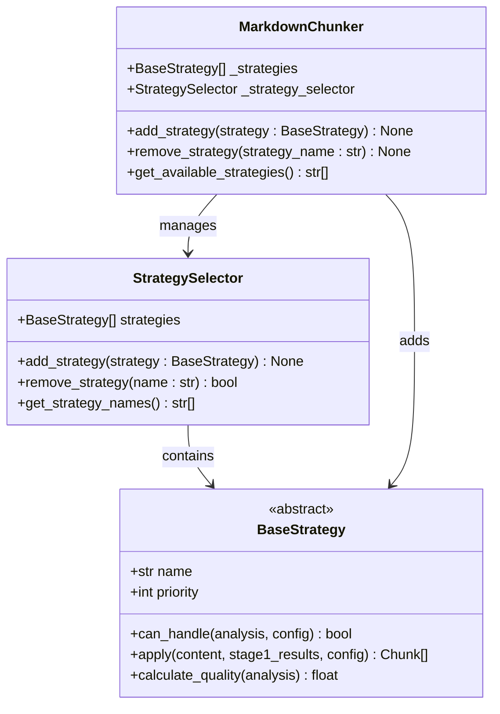
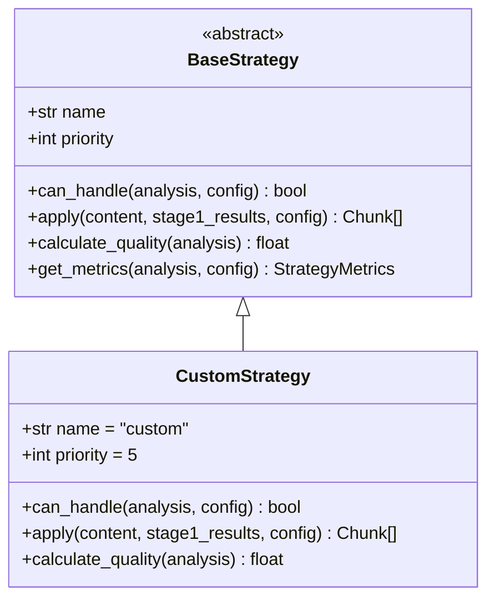

# Strategy Management Methods

<cite>
**Referenced Files in This Document**
- [markdown_chunker/chunker/core.py](file://markdown_chunker/chunker/core.py)
- [markdown_chunker/chunker/selector.py](file://markdown_chunker/chunker/selector.py)
- [markdown_chunker/chunker/orchestrator.py](file://markdown_chunker/chunker/orchestrator.py)
- [markdown_chunker/chunker/strategies/base.py](file://markdown_chunker/chunker/strategies/base.py)
- [tests/chunker/test_dynamic_strategy_management.py](file://tests/chunker/test_dynamic_strategy_management.py)
- [tests/chunker/test_strategy_selector.py](file://tests/chunker/test_strategy_selector.py)
- [examples/api_usage.py](file://examples/api_usage.py)
- [markdown_chunker/chunker/types.py](file://markdown_chunker/chunker/types.py)
</cite>

## Table of Contents
1. [Introduction](#introduction)
2. [Method Overview](#method-overview)
3. [add_strategy() Method](#add_strategy-method)
4. [remove_strategy() Method](#remove_strategy-method)
5. [get_available_strategies() Method](#get_available_strategies-method)
6. [Implementation Examples](#implementation-examples)
7. [Common Issues and Solutions](#common-issues-and-solutions)
8. [Thread Safety Considerations](#thread-safety-considerations)
9. [Best Practices](#best-practices)
10. [Troubleshooting Guide](#troubleshooting-guide)

## Introduction

The MarkdownChunker strategy management system provides dynamic control over the available chunking strategies through three core methods: `add_strategy()`, `remove_strategy()`, and `get_available_strategies()`. These methods enable runtime customization of the chunking behavior, allowing developers to integrate custom strategies, remove unused strategies, and inspect the current strategy configuration.

Strategies are specialized algorithms that determine how Markdown content is segmented into chunks. The system includes six built-in strategies (code, mixed, list, table, structural, sentences) that automatically select the optimal approach based on content analysis. Dynamic strategy management allows extending this functionality with custom strategies tailored to specific use cases.

## Method Overview

The strategy management system consists of three primary methods that operate on the global strategy registry within the MarkdownChunker instance:



**Diagram sources**
- [markdown_chunker/chunker/core.py](file://markdown_chunker/chunker/core.py#L541-L564)
- [markdown_chunker/chunker/selector.py](file://markdown_chunker/chunker/selector.py#L274-L306)
- [markdown_chunker/chunker/strategies/base.py](file://markdown_chunker/chunker/strategies/base.py#L16-L380)

## add_strategy() Method

The `add_strategy()` method enables dynamic integration of custom strategies into the chunking pipeline. This method accepts a BaseStrategy-derived object and incorporates it into the strategy selection process.

### Method Signature

```python
def add_strategy(self, strategy: BaseStrategy) -> None:
```

### Parameter Details

| Parameter | Type | Description |
|-----------|------|-------------|
| strategy | BaseStrategy | The strategy instance to add to the selector. Must inherit from BaseStrategy and implement all required abstract methods. |

### Strategy Integration Process

When a custom strategy is added, the system performs several critical operations:

1. **Validation**: Checks for duplicate strategy names to prevent conflicts
2. **Registration**: Adds the strategy to the internal strategies list
3. **Reorganization**: Sorts strategies by priority (lower numbers = higher priority)
4. **Selector Recreation**: Updates the StrategySelector with the new configuration
5. **Orchestrator Sync**: Ensures the ChunkingOrchestrator uses the updated selector

### Implementation Requirements

Custom strategies must implement the BaseStrategy interface:



**Diagram sources**
- [markdown_chunker/chunker/strategies/base.py](file://markdown_chunker/chunker/strategies/base.py#L16-L380)

### Automatic Selection Participation

Once registered, custom strategies participate in automatic strategy selection alongside built-in strategies. The selection process considers:

- **Priority**: Lower priority numbers take precedence
- **Applicability**: Whether the strategy can handle the content type
- **Quality Score**: How well the strategy suits the content characteristics

### Example Implementation

Here's a complete example of implementing and registering a custom strategy:

```python
# Custom strategy implementation example
class CustomStrategy(BaseStrategy):
    def __init__(self):
        self._name = "custom"
        self._priority = 5
    
    @property
    def name(self) -> str:
        return self._name
    
    @property
    def priority(self) -> int:
        return self._priority
    
    def can_handle(self, analysis, config):
        # Custom logic to determine applicability
        return analysis.complexity_score > 0.7
    
    def calculate_quality(self, analysis):
        # Calculate quality based on content characteristics
        return analysis.complexity_score
    
    def apply(self, md_text, stage1_results, config):
        # Custom chunking implementation
        # Return list of Chunk objects
        pass
```

**Section sources**
- [markdown_chunker/chunker/core.py](file://markdown_chunker/chunker/core.py#L541-L553)
- [markdown_chunker/chunker/selector.py](file://markdown_chunker/chunker/selector.py#L274-L289)

## remove_strategy() Method

The `remove_strategy()` method permanently removes strategies from the chunking pipeline, making them unavailable for both automatic selection and manual override. This method is essential for optimizing performance by eliminating unused strategies.

### Method Signature

```python
def remove_strategy(self, strategy_name: str) -> None:
```

### Parameter Details

| Parameter | Type | Description |
|-----------|------|-------------|
| strategy_name | str | Exact case-sensitive name of the strategy to remove. Must match one of the available strategy names. |

### Removal Process

The removal process follows these steps:

1. **Strategy Lookup**: Searches for the strategy by exact name match
2. **Removal**: Removes the strategy from the internal strategies list
3. **Selector Recreation**: Updates the StrategySelector with the modified strategy list
4. **Orchestrator Sync**: Ensures the ChunkingOrchestrator uses the updated selector

### Impact Analysis

Removing a strategy has several effects:

- **Automatic Selection**: Removed strategies cannot be selected automatically
- **Manual Override**: Attempts to use removed strategies with `chunk(strategy="name")` will fail
- **Performance**: Reduces memory usage and improves selection speed
- **Fallback Behavior**: Built-in strategies remain available for fallback

### Case-Sensitive Matching

The strategy name parameter is case-sensitive and must match exactly:

```python
# Correct usage
chunker.remove_strategy("code")      # Removes code strategy
chunker.remove_strategy("Code")      # Different from previous (case-sensitive)

# Incorrect usage - will not remove anything
chunker.remove_strategy("CODE")      # Won't match "code"
chunker.remove_strategy("code ")     # Won't match due to extra space
```

### Built-in Strategy Protection

While built-in strategies can be removed, doing so permanently disables them. The system does not provide restoration mechanisms:

```python
# Built-in strategies can be removed but not restored
chunker.remove_strategy("sentences")  # Cannot be re-added later
chunker.remove_strategy("code")       # Cannot be re-added later
```

**Section sources**
- [markdown_chunker/chunker/core.py](file://markdown_chunker/chunker/core.py#L554-L564)
- [markdown_chunker/chunker/selector.py](file://markdown_chunker/chunker/selector.py#L291-L306)

## get_available_strategies() Method

The `get_available_strategies()` method returns a list of all currently available strategy names that can be used with the chunk() method's strategy parameter. This method provides essential information for conditional logic and strategy inspection.

### Method Signature

```python
def get_available_strategies(self) -> List[str]:
```

### Return Value

Returns a list of strategy names (strings) that can be passed to the chunk() method's strategy parameter. The list includes both built-in and custom strategies.

### Default Strategy Names

The system includes six built-in strategies by default:

| Strategy Name | Purpose | Priority |
|---------------|---------|----------|
| code | Handles code-heavy documents | 1 |
| mixed | Handles mixed content documents | 2 |
| list | Handles list-heavy documents | 3 |
| table | Handles table-heavy documents | 4 |
| structural | Handles structurally complex documents | 5 |
| sentences | Fallback strategy for plain text | 6 |

### Conditional Logic Usage

The method enables sophisticated conditional logic for strategy selection:

```python
# Example conditional strategy selection
available_strategies = chunker.get_available_strategies()

if "custom" in available_strategies:
    # Use custom strategy when available
    chunks = chunker.chunk(document, strategy="custom")
elif "code" in available_strategies and contains_code(document):
    # Use code strategy for code-heavy content
    chunks = chunker.chunk(document, strategy="code")
else:
    # Fall back to automatic selection
    chunks = chunker.chunk(document)
```

### Dynamic Strategy Modification Detection

The method reflects the current state after dynamic modifications:

```python
# Track strategy availability changes
initial_strategies = chunker.get_available_strategies()
print(f"Initial strategies: {initial_strategies}")

# Add custom strategy
chunker.add_strategy(CustomStrategy())

# Check updated availability
updated_strategies = chunker.get_available_strategies()
print(f"After addition: {updated_strategies}")

# Remove strategy
chunker.remove_strategy("custom")

# Verify removal
final_strategies = chunker.get_available_strategies()
print(f"After removal: {final_strategies}")
```

### Order and Consistency

The order of strategies in the returned list is not guaranteed and may change after modifications. For reliable ordering, sort the list explicitly:

```python
available_strategies = sorted(chunker.get_available_strategies())
```

**Section sources**
- [markdown_chunker/chunker/core.py](file://markdown_chunker/chunker/core.py#L603-L641)
- [markdown_chunker/chunker/selector.py](file://markdown_chunker/chunker/selector.py#L308-L310)

## Implementation Examples

### Basic Strategy Management Workflow

```python
from markdown_chunker import MarkdownChunker
from markdown_chunker.chunker.strategies.base import BaseStrategy

# Initialize chunker
chunker = MarkdownChunker()

# 1. Check available strategies initially
initial_strategies = chunker.get_available_strategies()
print(f"Initial strategies: {initial_strategies}")

# 2. Add custom strategy
class CustomStrategy(BaseStrategy):
    @property
    def name(self) -> str:
        return "custom"
    
    @property
    def priority(self) -> int:
        return 5
    
    def can_handle(self, analysis, config):
        return True
    
    def calculate_quality(self, analysis):
        return 0.8
    
    def apply(self, md_text, stage1_results, config):
        # Custom implementation
        pass

chunker.add_strategy(CustomStrategy())

# 3. Verify addition
updated_strategies = chunker.get_available_strategies()
print(f"After addition: {updated_strategies}")

# 4. Use custom strategy
chunks = chunker.chunk(document, strategy="custom")

# 5. Remove strategy
chunker.remove_strategy("custom")

# 6. Verify removal
final_strategies = chunker.get_available_strategies()
print(f"After removal: {final_strategies}")
```

### Dynamic Strategy Selection Based on Content

```python
def select_optimal_strategy(chunker, content):
    """Select best strategy based on content characteristics."""
    available_strategies = chunker.get_available_strategies()
    
    # Check for specialized strategies
    if "code" in available_strategies and contains_code_blocks(content):
        return "code"
    elif "table" in available_strategies and contains_tables(content):
        return "table"
    elif "list" in available_strategies and contains_lists(content):
        return "list"
    elif "custom" in available_strategies:
        return "custom"
    else:
        return "auto"  # Let system choose

# Usage
strategy = select_optimal_strategy(chunker, document)
chunks = chunker.chunk(document, strategy=strategy)
```

### Monitoring Strategy Availability

```python
def monitor_strategy_availability(chunker):
    """Monitor strategy availability and log changes."""
    import logging
    
    def log_strategy_state():
        strategies = chunker.get_available_strategies()
        logging.info(f"Available strategies: {strategies}")
        return strategies
    
    # Initial state
    initial_state = log_strategy_state()
    
    # Add custom strategy
    chunker.add_strategy(CustomStrategy())
    after_add = log_strategy_state()
    
    # Remove strategy
    chunker.remove_strategy("custom")
    after_remove = log_strategy_state()
    
    return {
        "initial": initial_state,
        "after_add": after_add,
        "after_remove": after_remove
    }

# Usage
results = monitor_strategy_availability(chunker)
```

### Error Handling and Validation

```python
def safe_strategy_operation(chunker, strategy_name, operation):
    """Safely perform strategy operations with error handling."""
    try:
        available_strategies = chunker.get_available_strategies()
        
        if operation == "add":
            if strategy_name in available_strategies:
                raise ValueError(f"Strategy '{strategy_name}' already exists")
            chunker.add_strategy(CustomStrategy())
            return True, f"Added strategy: {strategy_name}"
        
        elif operation == "remove":
            if strategy_name not in available_strategies:
                return False, f"Strategy '{strategy_name}' not found"
            chunker.remove_strategy(strategy_name)
            return True, f"Removed strategy: {strategy_name}"
        
        elif operation == "check":
            return strategy_name in available_strategies, f"Strategy '{strategy_name}' available: {strategy_name in available_strategies}"
        
        else:
            raise ValueError(f"Unknown operation: {operation}")
    
    except Exception as e:
        return False, f"Operation failed: {str(e)}"
```

**Section sources**
- [tests/chunker/test_dynamic_strategy_management.py](file://tests/chunker/test_dynamic_strategy_management.py#L41-L264)
- [examples/api_usage.py](file://examples/api_usage.py#L1-L356)

## Common Issues and Solutions

### Duplicate Strategy Names

**Problem**: Attempting to add a strategy with a name that already exists causes a ValueError.

**Solution**: Check strategy availability before adding:

```python
def add_strategy_safely(chunker, strategy):
    """Add strategy safely with duplicate checking."""
    strategy_name = strategy.name
    
    if strategy_name in chunker.get_available_strategies():
        # Handle duplicate - either skip or replace
        print(f"Strategy '{strategy_name}' already exists, skipping addition")
        return False
    
    chunker.add_strategy(strategy)
    return True
```

### Built-in Strategy Removal

**Problem**: Removing built-in strategies permanently disables them.

**Solution**: Plan strategy removal carefully:

```python
# Check before removal
available_strategies = chunker.get_available_strategies()
if "sentences" in available_strategies:
    # Only remove if absolutely necessary
    chunker.remove_strategy("sentences")
```

### Strategy Not Found Errors

**Problem**: Using removed strategies with chunk() method raises errors.

**Solution**: Validate strategy availability:

```python
def chunk_with_validation(chunker, content, strategy=None):
    """Chunk with strategy validation."""
    if strategy and strategy not in chunker.get_available_strategies():
        raise ValueError(f"Strategy '{strategy}' not available. "
                         f"Available strategies: {chunker.get_available_strategies()}")
    
    return chunker.chunk(content, strategy=strategy)
```

### Memory and Performance Considerations

**Problem**: Too many strategies can impact performance.

**Solution**: Remove unused strategies:

```python
# Remove strategies not used in production
unused_strategies = ["experimental", "legacy"]
for strategy_name in unused_strategies:
    if strategy_name in chunker.get_available_strategies():
        chunker.remove_strategy(strategy_name)
```

### Strategy Selector Recreation Issues

**Problem**: Manual selector recreation may be needed in some cases.

**Solution**: The system handles selector recreation automatically, but verify:

```python
# Verify selector is properly recreated
original_selector = chunker._strategy_selector
chunker.add_strategy(CustomStrategy())
assert chunker._strategy_selector is not original_selector
```

**Section sources**
- [tests/chunker/test_dynamic_strategy_management.py](file://tests/chunker/test_dynamic_strategy_management.py#L183-L200)
- [markdown_chunker/chunker/selector.py](file://markdown_chunker/chunker/selector.py#L281-L283)

## Thread Safety Considerations

### Current Thread Safety Status

The strategy management methods are **not inherently thread-safe**. Concurrent modifications to the strategy registry can lead to race conditions and inconsistent state.

### Known Limitations

1. **Concurrent Add/Remove Operations**: Multiple threads attempting to modify strategies simultaneously
2. **Selector Recreation**: The selector recreation process is not atomic
3. **State Consistency**: Internal state may become inconsistent during modifications

### Recommended Approaches

#### 1. Single-Threaded Initialization Pattern

```python
import threading

# Global lock for strategy modifications
strategy_lock = threading.Lock()

def initialize_strategies(chunker):
    """Initialize strategies in a thread-safe manner."""
    with strategy_lock:
        # Add all strategies atomically
        strategies_to_add = [CustomStrategy1(), CustomStrategy2()]
        for strategy in strategies_to_add:
            chunker.add_strategy(strategy)

# Usage
initialize_strategies(chunker)
```

#### 2. Strategy Modification Queuing

```python
class StrategyManager:
    """Thread-safe strategy management wrapper."""
    
    def __init__(self, chunker):
        self.chunker = chunker
        self.lock = threading.Lock()
        self.pending_operations = []
    
    def queue_strategy_operation(self, operation, *args, **kwargs):
        """Queue strategy operation for thread-safe execution."""
        with self.lock:
            self.pending_operations.append((operation, args, kwargs))
    
    def process_pending_operations(self):
        """Process all queued operations."""
        with self.lock:
            operations = self.pending_operations.copy()
            self.pending_operations.clear()
        
        for operation, args, kwargs in operations:
            operation(*args, **kwargs)
```

#### 3. Immutable Strategy Patterns

```python
class ImmutableStrategyRegistry:
    """Immutable strategy registry for thread-safe access."""
    
    def __init__(self, initial_strategies):
        self._lock = threading.RLock()
        self._strategies = tuple(initial_strategies)
    
    def get_strategies(self):
        """Get immutable copy of strategies."""
        with self._lock:
            return self._strategies
    
    def add_strategy(self, strategy):
        """Add strategy immutably."""
        with self._lock:
            self._strategies = self._strategies + (strategy,)
```

### Best Practices for Multi-threaded Environments

1. **Initialization Phase**: Perform all strategy modifications during application startup
2. **Read Operations**: Strategy retrieval is generally safe for concurrent reads
3. **Batch Operations**: Group related strategy operations together
4. **Error Handling**: Implement robust error handling for concurrent modifications
5. **Monitoring**: Monitor for race conditions in production environments

**Section sources**
- [markdown_chunker/chunker/performance.py](file://markdown_chunker/chunker/performance.py#L1-L49)
- [tests/chunker/test_performance.py](file://tests/chunker/test_performance.py#L48-L97)

## Best Practices

### Strategy Design Guidelines

1. **Priority Assignment**: Choose appropriate priorities (1-6) based on strategy importance
2. **Applicability Logic**: Implement robust `can_handle()` methods
3. **Quality Scoring**: Provide meaningful quality scores for strategy selection
4. **Error Handling**: Implement comprehensive error handling in `apply()` method
5. **Documentation**: Document strategy behavior and requirements

### Performance Optimization

1. **Minimal Strategies**: Remove unused strategies to improve performance
2. **Priority Ordering**: Place frequently used strategies with lower priorities
3. **Lazy Loading**: Consider lazy loading for expensive strategies
4. **Memory Management**: Monitor memory usage with many strategies

### Development Workflow

1. **Testing**: Thoroughly test custom strategies with various content types
2. **Validation**: Use `validate_strategies()` method for configuration validation
3. **Monitoring**: Monitor strategy selection performance
4. **Documentation**: Document custom strategy behavior and requirements

### Production Deployment

1. **Staging Testing**: Test strategy modifications in staging environments
2. **Gradual Rollout**: Gradually introduce new strategies
3. **Monitoring**: Monitor chunking performance and quality
4. **Rollback Plan**: Have rollback plans for problematic strategy additions

**Section sources**
- [markdown_chunker/chunker/selector.py](file://markdown_chunker/chunker/selector.py#L225-L256)
- [tests/chunker/test_strategy_selector.py](file://tests/chunker/test_strategy_selector.py#L254-L276)

## Troubleshooting Guide

### Common Error Messages

#### "Strategy with name '...' already exists"

**Cause**: Attempting to add a strategy with a duplicate name.

**Solution**: 
```python
# Check before adding
if strategy.name not in chunker.get_available_strategies():
    chunker.add_strategy(strategy)
else:
    print(f"Strategy '{strategy.name}' already exists")
```

#### "Strategy '...' not found"

**Cause**: Using a removed or non-existent strategy name.

**Solution**:
```python
# Validate strategy availability
available = chunker.get_available_strategies()
if strategy_name not in available:
    raise ValueError(f"Strategy '{strategy_name}' not available. "
                     f"Available: {available}")
```

#### "No strategy can handle the content"

**Cause**: Content doesn't match any available strategy's criteria.

**Solution**:
```python
# Check strategy applicability
from markdown_chunker.chunker.strategies.sentences_strategy import SentencesStrategy

# Add fallback strategy if needed
if not any(s.can_handle(analysis, config) for s in chunker._strategies):
    chunker.add_strategy(SentencesStrategy())
```

### Debugging Strategy Issues

#### Strategy Selection Debugging

```python
def debug_strategy_selection(chunker, content):
    """Debug strategy selection process."""
    from markdown_chunker.parser import ParserInterface
    
    # Parse content
    parser = ParserInterface()
    stage1_results = parser.process_document(content)
    
    # Check each strategy
    for strategy in chunker._strategies:
        can_handle = strategy.can_handle(stage1_results.analysis, chunker.config)
        quality = strategy.calculate_quality(stage1_results.analysis)
        print(f"Strategy {strategy.name}: can_handle={can_handle}, quality={quality}")
```

#### Strategy Registry Inspection

```python
def inspect_strategy_registry(chunker):
    """Inspect current strategy registry state."""
    print(f"Total strategies: {len(chunker._strategies)}")
    print("Strategy details:")
    
    for i, strategy in enumerate(chunker._strategies):
        print(f"  {i+1}. {strategy.name} (priority: {strategy.priority})")
    
    # Check selector state
    selector = chunker._strategy_selector
    print(f"Selector mode: {selector.mode}")
    print(f"Selector strategies: {[s.name for s in selector.strategies]}")
```

### Performance Troubleshooting

#### Slow Strategy Selection

**Symptoms**: Long delays in chunking operations

**Diagnosis**:
```python
import time

def measure_strategy_selection(chunker, content):
    """Measure strategy selection performance."""
    start_time = time.time()
    
    # Force strategy selection
    chunker.chunk(content, strategy="auto")
    
    selection_time = time.time() - start_time
    print(f"Strategy selection took: {selection_time:.3f} seconds")
    
    return selection_time > 0.1  # Flag as slow if > 100ms
```

**Solutions**:
1. Reduce number of strategies
2. Optimize strategy `can_handle()` methods
3. Increase strategy priorities for commonly used strategies

#### Memory Usage Issues

**Symptoms**: High memory consumption with many strategies

**Diagnosis**:
```python
def monitor_memory_usage(chunker):
    """Monitor memory usage of strategy registry."""
    import sys
    
    total_size = sys.getsizeof(chunker._strategies)
    for strategy in chunker._strategies:
        total_size += sys.getsizeof(strategy)
    
    print(f"Strategy registry size: {total_size:,} bytes")
    
    # Suggest removal of unused strategies
    if len(chunker._strategies) > 6:
        print("Consider removing unused strategies to reduce memory usage")
```

**Section sources**
- [markdown_chunker/chunker/orchestrator.py](file://markdown_chunker/chunker/orchestrator.py#L319-L339)
- [markdown_chunker/chunker/selector.py](file://markdown_chunker/chunker/selector.py#L225-L256)