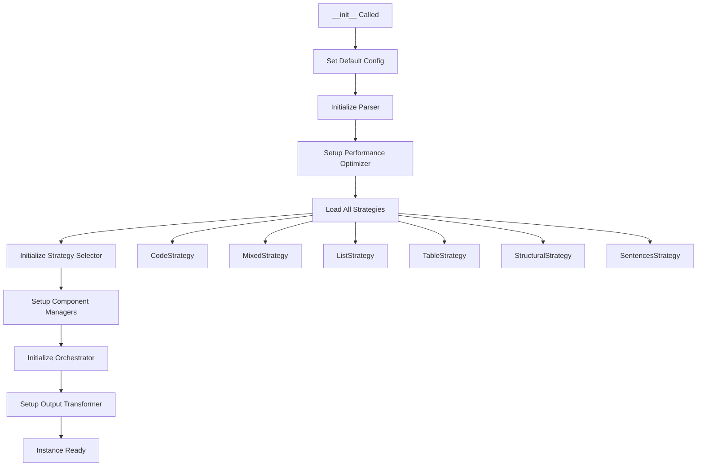
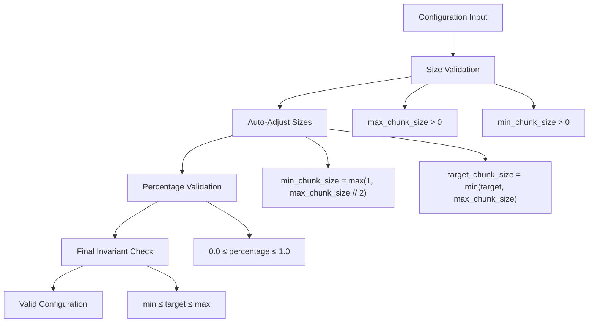
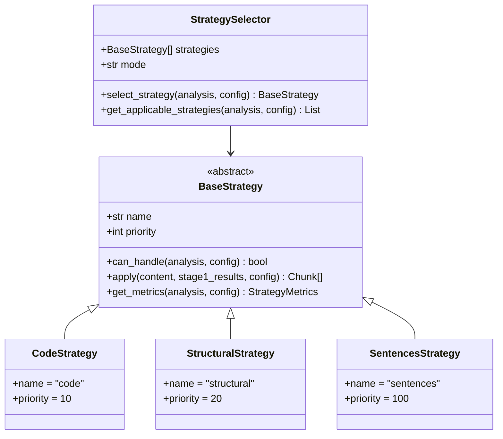
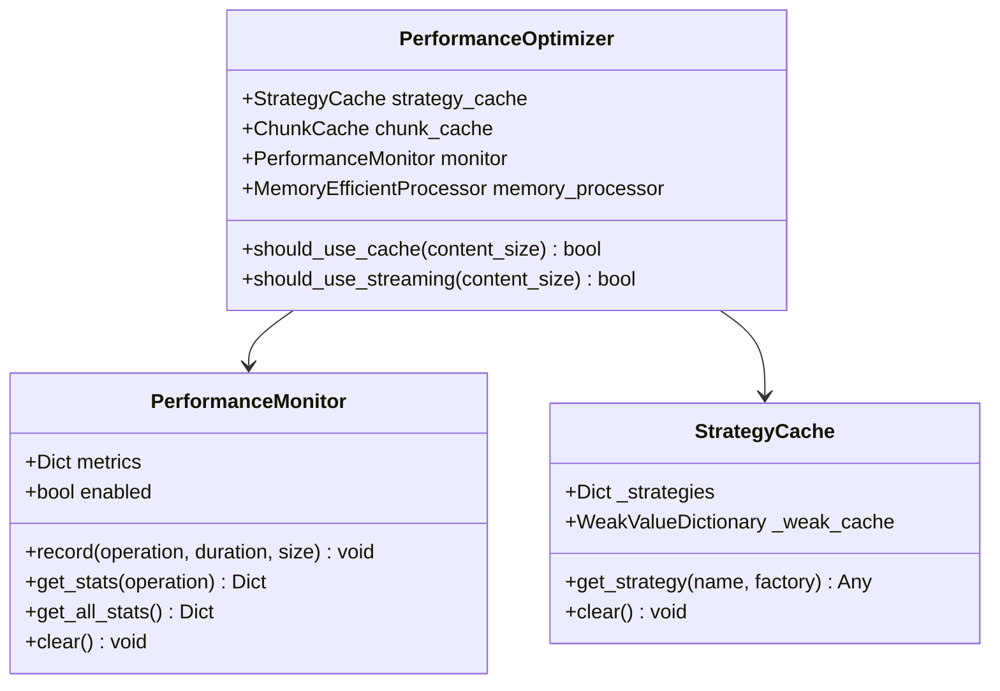
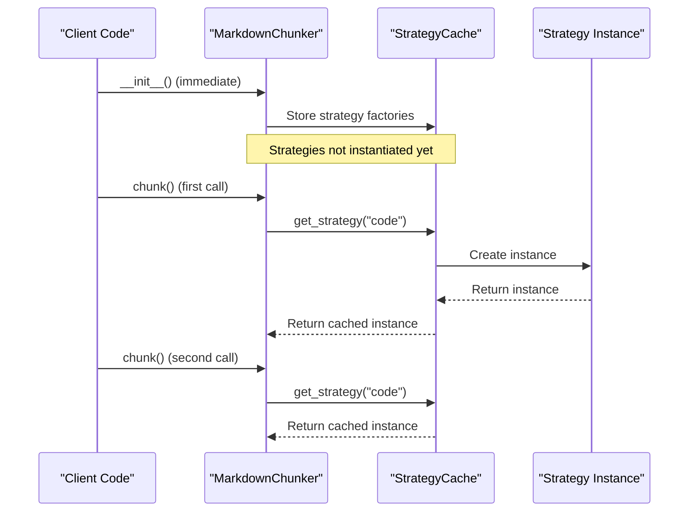

# MarkdownChunker.__init__ Method Documentation

<cite>
**Referenced Files in This Document**
- [markdown_chunker/chunker/core.py](file://markdown_chunker/chunker/core.py)
- [markdown_chunker/chunker/types.py](file://markdown_chunker/chunker/types.py)
- [markdown_chunker/chunker/orchestrator.py](file://markdown_chunker/chunker/orchestrator.py)
- [markdown_chunker/chunker/selector.py](file://markdown_chunker/chunker/selector.py)
- [markdown_chunker/chunker/performance.py](file://markdown_chunker/chunker/performance.py)
- [markdown_chunker/chunker/components/overlap_manager.py](file://markdown_chunker/chunker/components/overlap_manager.py)
- [markdown_chunker/chunker/components/metadata_enricher.py](file://markdown_chunker/chunker/components/metadata_enricher.py)
- [markdown_chunker/chunker/components/fallback_manager.py](file://markdown_chunker/chunker/components/fallback_manager.py)
- [examples/basic_usage.py](file://examples/basic_usage.py)
- [tests/chunker/test_chunker.py](file://tests/chunker/test_chunker.py)
- [tests/chunker/test_config_profiles.py](file://tests/chunker/test_config_profiles.py)
- [tests/chunker/test_chunk_config_validation.py](file://tests/chunker/test_chunk_config_validation.py)
</cite>

## Table of Contents
1. [Method Signature and Parameters](#method-signature-and-parameters)
2. [Initialization Sequence](#initialization-sequence)
3. [Configuration System](#configuration-system)
4. [Component Initialization](#component-initialization)
5. [Performance Monitoring](#performance-monitoring)
6. [Thread Safety and Lazy Loading](#thread-safety-and-lazy-loading)
7. [Usage Examples](#usage-examples)
8. [Common Issues and Solutions](#common-issues-and-solutions)
9. [Best Practices](#best-practices)

## Method Signature and Parameters

The `MarkdownChunker.__init__` method initializes a new chunking instance with configurable behavior:

```python
def __init__(
    self,
    config: Optional[ChunkConfig] = None,
    enable_performance_monitoring: bool = False,
):
```

### Parameters

| Parameter | Type | Default | Description |
|-----------|------|---------|-------------|
| `config` | `Optional[ChunkConfig]` | `None` | Configuration object controlling chunking behavior. If `None`, uses default configuration with `max_chunk_size=4096`, `min_chunk_size=512`, and `enable_overlap=True`. |
| `enable_performance_monitoring` | `bool` | `False` | Enables performance monitoring and optimization. When `True`, tracks timing metrics for all operations with minimal overhead (<5%). |

**Section sources**
- [markdown_chunker/chunker/core.py](file://markdown_chunker/chunker/core.py#L61-L152)

## Initialization Sequence

The initialization follows a carefully orchestrated sequence that ensures all components are properly configured and ready for chunking operations:



**Diagram sources**
- [markdown_chunker/chunker/core.py](file://markdown_chunker/chunker/core.py#L118-L152)

### Step-by-Step Initialization

1. **Configuration Setup** (`lines 118-119`)
   - If no config provided, creates default `ChunkConfig()`
   - Initializes parser interface for Stage 1 analysis

2. **Performance Infrastructure** (`lines 122-125`)
   - Creates `PerformanceOptimizer` instance
   - Sets monitoring enabled/disabled based on parameter
   - Establishes performance tracking infrastructure

3. **Strategy Loading** (`lines 127-135`)
   - Loads all 6 built-in strategies into `_strategies` list
   - Strategies are instantiated immediately but lazily accessed
   - Each strategy implements the `BaseStrategy` interface

4. **Component Initialization** (`lines 137-142`)
   - `StrategySelector`: Manages strategy selection logic
   - `OverlapManager`: Handles chunk overlap for context preservation
   - `MetadataEnricher`: Adds comprehensive metadata to chunks
   - `FallbackManager`: Provides error recovery mechanisms
   - `DataCompletenessValidator`: Ensures data integrity

5. **Orchestrator Setup** (`lines 144-151`)
   - Creates `ChunkingOrchestrator` with all dependencies
   - Establishes the main execution pipeline
   - Links all components together

**Section sources**
- [markdown_chunker/chunker/core.py](file://markdown_chunker/chunker/core.py#L118-L152)

## Configuration System

The configuration system provides fine-grained control over chunking behavior through the `ChunkConfig` class:

### Default Configuration

```python
# Default values from ChunkConfig.default()
max_chunk_size: int = 4096
min_chunk_size: int = 512
target_chunk_size: int = 2048
enable_overlap: bool = True
overlap_size: int = 200
overlap_percentage: float = 0.1
```

### Configuration Profiles

The system provides factory methods for common use cases:

| Profile | Purpose | Key Settings |
|---------|---------|--------------|
| `for_code_heavy()` | Code documentation | `max_chunk_size=6144`, `code_ratio_threshold=0.5`, `preserve_code_blocks=True` |
| `for_dify_rag()` | RAG systems | `max_chunk_size=3072`, `overlap_size=150`, `preserve_list_hierarchy=True` |
| `for_fast_processing()` | Performance optimization | `max_chunk_size=8192`, `enable_overlap=False`, `enable_streaming=True` |

### Validation and Auto-Adjustment

The configuration system includes robust validation:



**Diagram sources**
- [markdown_chunker/chunker/types.py](file://markdown_chunker/chunker/types.py#L621-L665)

**Section sources**
- [markdown_chunker/chunker/types.py](file://markdown_chunker/chunker/types.py#L497-L800)
- [tests/chunker/test_chunk_config_validation.py](file://tests/chunker/test_chunk_config_validation.py#L13-L207)

## Component Initialization

Each component serves a specific purpose in the chunking pipeline:

### Strategy Management



**Diagram sources**
- [markdown_chunker/chunker/selector.py](file://markdown_chunker/chunker/selector.py#L23-L322)
- [markdown_chunker/chunker/strategies/base.py](file://markdown_chunker/chunker/strategies/base.py)

### Component Responsibilities

| Component | Responsibility | Key Features |
|-----------|---------------|--------------|
| **OverlapManager** | Context preservation | Sentence-aware overlap, fence preservation, configurable overlap size |
| **MetadataEnricher** | Chunk enhancement | Content statistics, strategy-specific metadata, searchability features |
| **FallbackManager** | Error recovery | 3-level fallback chain, strategy-specific fallbacks, graceful degradation |
| **DataCompletenessValidator** | Quality assurance | Content coverage validation, warning generation |

**Section sources**
- [markdown_chunker/chunker/components/overlap_manager.py](file://markdown_chunker/chunker/components/overlap_manager.py#L13-L447)
- [markdown_chunker/chunker/components/metadata_enricher.py](file://markdown_chunker/chunker/components/metadata_enricher.py#L13-L414)
- [markdown_chunker/chunker/components/fallback_manager.py](file://markdown_chunker/chunker/components/fallback_manager.py#L31-L310)

## Performance Monitoring

Performance monitoring is built into the initialization process with minimal overhead:

### Monitoring Infrastructure



**Diagram sources**
- [markdown_chunker/chunker/performance.py](file://markdown_chunker/chunker/performance.py#L210-L243)

### Performance Characteristics

- **Overhead**: Less than 5% for typical operations
- **Granularity**: Operation-level timing metrics
- **Storage**: Efficient memory usage with automatic cleanup
- **Features**: Throughput calculations, size-based optimizations

**Section sources**
- [markdown_chunker/chunker/performance.py](file://markdown_chunker/chunker/performance.py#L13-L243)

## Thread Safety and Lazy Loading

### Thread Safety

The MarkdownChunker exhibits the following thread safety characteristics:

- **Read Operations**: Fully thread-safe for concurrent reads
- **Write Operations**: Not thread-safe for configuration changes
- **Stateless Design**: Most operations are stateless and reusable

### Lazy Loading Behavior

Strategies are initialized with lazy loading for optimal performance:



**Diagram sources**
- [markdown_chunker/chunker/performance.py](file://markdown_chunker/chunker/performance.py#L13-L30)

**Section sources**
- [markdown_chunker/chunker/core.py](file://markdown_chunker/chunker/core.py#L113-L118)
- [markdown_chunker/chunker/performance.py](file://markdown_chunker/chunker/performance.py#L13-L30)

## Usage Examples

### Basic Initialization

```python
# Default configuration
chunker = MarkdownChunker()
chunks = chunker.chunk("# Hello\nWorld")

# With performance monitoring
chunker = MarkdownChunker(enable_performance_monitoring=True)
chunks = chunker.chunk("# Test")
stats = chunker.get_performance_stats()
print(f"Average time: {stats['chunk']['avg_time']:.3f}s")
```

### Custom Configuration

```python
from markdown_chunker import ChunkConfig

# Custom configuration
config = ChunkConfig(
    max_chunk_size=2048,
    min_chunk_size=256,
    enable_overlap=True,
    overlap_size=100
)
chunker = MarkdownChunker(config)
result = chunker.chunk("# Test", include_analysis=True)
```

### Configuration Profiles

```python
# Code-heavy documents
config = ChunkConfig.for_code_heavy()
chunker = MarkdownChunker(config)
chunks = chunker.chunk(code_document)

# RAG system configuration
config = ChunkConfig.for_dify_rag()
chunker = MarkdownChunker(config)
chunks = chunker.chunk(document)
```

### Advanced Usage with Error Handling

```python
try:
    chunker = MarkdownChunker(config)
    result = chunker.chunk_with_analysis(markdown_text)
    
    if result.fallback_used:
        print(f"Fallback used at level {result.fallback_level}")
    
    print(f"Strategy: {result.strategy_used}")
    print(f"Chunks: {len(result.chunks)}")
    
except Exception as e:
    print(f"Chunking failed: {e}")
```

**Section sources**
- [examples/basic_usage.py](file://examples/basic_usage.py#L14-L364)
- [tests/chunker/test_chunker.py](file://tests/chunker/test_chunker.py#L38-L74)

## Common Issues and Solutions

### Configuration Validation Errors

**Issue**: Invalid configuration parameters causing initialization failure.

**Solution**: Use factory methods or validate configurations:

```python
# Safe configuration creation
config = ChunkConfig(
    max_chunk_size=4096,
    min_chunk_size=512,  # Valid range
    overlap_percentage=0.1  # Valid range
)

# Or use factory methods
config = ChunkConfig.for_code_heavy()
```

### Performance Monitoring Overhead

**Issue**: Unexpected performance impact from monitoring.

**Solution**: Enable monitoring only when needed:

```python
# Production: disable monitoring
chunker = MarkdownChunker()

# Development: enable monitoring
chunker = MarkdownChunker(enable_performance_monitoring=True)
```

### Memory Usage with Large Documents

**Issue**: High memory usage for large documents.

**Solution**: Use streaming configuration or custom chunking:

```python
# Use large document profile
config = ChunkConfig.for_large_documents()
chunker = MarkdownChunker(config)

# Or process in batches
chunks = chunker.chunk(large_document, strategy="sentences")
```

### Strategy Selection Problems

**Issue**: Unexpected strategy selection.

**Solution**: Explicit strategy override or debug selection:

```python
# Force specific strategy
chunks = chunker.chunk(text, strategy="code")

# Debug strategy selection
from markdown_chunker.chunker import MarkdownChunker
chunker = MarkdownChunker()
result = chunker.chunk_with_analysis(text)
print(f"Selected strategy: {result.strategy_used}")
```

**Section sources**
- [tests/chunker/test_chunk_config_validation.py](file://tests/chunker/test_chunk_config_validation.py#L13-L207)

## Best Practices

### Configuration Management

1. **Use Factory Methods**: Prefer configuration profiles over manual configuration
2. **Validate Early**: Test configurations before production deployment
3. **Environment-Specific**: Use different configurations for dev/prod

### Performance Optimization

1. **Enable Monitoring**: Use performance monitoring during development
2. **Lazy Loading**: Leverage built-in lazy loading for strategy reuse
3. **Batch Processing**: Process multiple documents with the same chunker instance

### Error Handling

1. **Fallback Awareness**: Check for fallback usage in production
2. **Graceful Degradation**: Implement fallback strategies in your application
3. **Monitoring**: Track performance metrics for optimization

### Thread Safety

1. **Instance Reuse**: Create chunker instances once and reuse them
2. **Immutable Configuration**: Avoid changing configuration after initialization
3. **Concurrent Reads**: Safe for concurrent read operations

**Section sources**
- [markdown_chunker/chunker/core.py](file://markdown_chunker/chunker/core.py#L113-L118)
- [tests/chunker/test_config_profiles.py](file://tests/chunker/test_config_profiles.py#L6-L70)