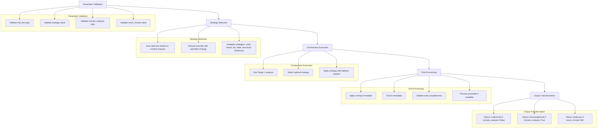
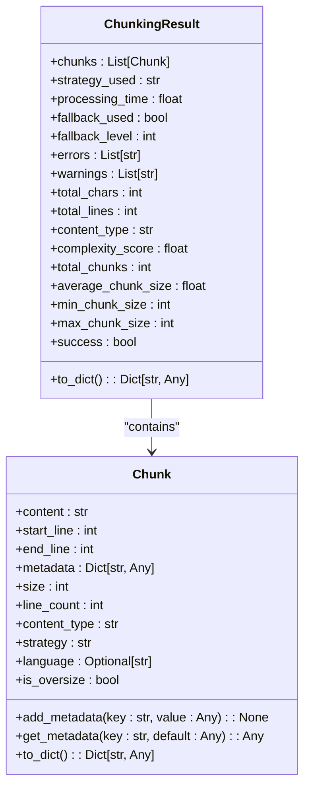
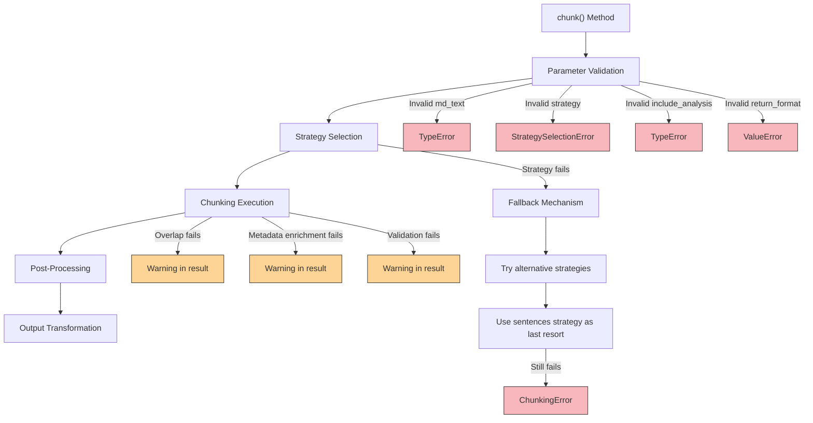
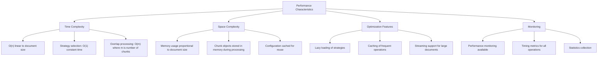
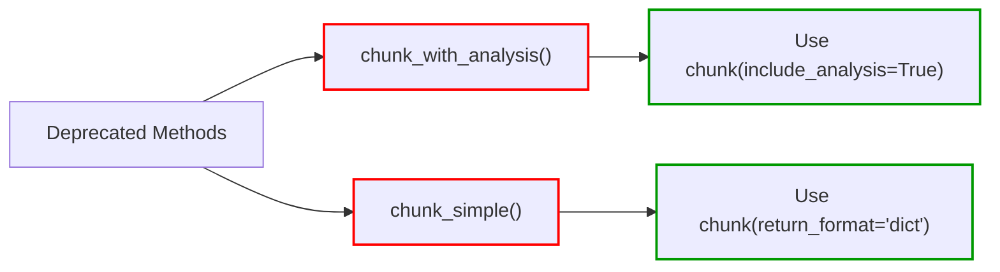

# chunk Method

<cite>
**Referenced Files in This Document**   
- [core.py](file://markdown_chunker/chunker/core.py)
- [types.py](file://markdown_chunker/chunker/types.py)
- [orchestrator.py](file://markdown_chunker/chunker/orchestrator.py)
- [transformer.py](file://markdown_chunker/chunker/transformer.py)
- [overlap_manager.py](file://markdown_chunker/chunker/components/overlap_manager.py)
- [metadata_enricher.py](file://markdown_chunker/chunker/components/metadata_enricher.py)
- [basic_usage.py](file://examples/basic_usage.py)
- [api_usage.py](file://examples/api_usage.py)
</cite>

## Table of Contents
1. [Introduction](#introduction)
2. [Parameter Reference](#parameter-reference)
3. [Processing Pipeline](#processing-pipeline)
4. [Output Formats](#output-formats)
5. [Practical Examples](#practical-examples)
6. [Error Handling](#error-handling)
7. [Performance Characteristics](#performance-characteristics)
8. [Deprecated Methods](#deprecated-methods)

## Introduction
The `chunk` method is the primary interface for processing markdown content in the MarkdownChunker system. It provides a unified, flexible API for chunking markdown documents with adaptive strategy selection, comprehensive analysis, and multiple output formats. The method automatically analyzes content to select the optimal chunking strategy while allowing manual override when needed. It supports detailed analysis metadata and JSON-serializable dictionary output for API integration.

**Section sources**
- [core.py](file://markdown_chunker/chunker/core.py#L155-L247)

## Parameter Reference

### md_text (required)
The markdown text to process. Must be a valid UTF-8 string. The method accepts empty or whitespace-only strings for backward compatibility, which will return an empty list of chunks.

### strategy (optional)
Optional strategy override. When not specified, the system automatically selects the optimal strategy based on content analysis. Valid values include:
- **code**: For code-heavy documents (≥70% code content)
- **mixed**: For mixed content with diverse elements
- **list**: For list-heavy documents (≥5 lists)
- **table**: For table-heavy documents (≥3 tables)
- **structural**: For well-structured documents with headers
- **sentences**: For simple text documents

### include_analysis (boolean)
Flag to control the level of detail in the return value:
- **False**: Returns a simple `List[Chunk]` (default, backward compatible)
- **True**: Returns a `ChunkingResult` object with comprehensive metadata including strategy used, processing time, and any warnings or errors

### return_format (string)
Output format for the result:
- **"objects"**: Returns Python objects (`List[Chunk]` or `ChunkingResult`)
- **"dict"**: Returns a JSON-serializable dictionary representation suitable for API responses

**Section sources**
- [core.py](file://markdown_chunker/chunker/core.py#L155-L247)

## Processing Pipeline



**Diagram sources**
- [core.py](file://markdown_chunker/chunker/core.py#L248-L263)
- [orchestrator.py](file://markdown_chunker/chunker/orchestrator.py#L55-L118)

### Parameter Validation
The method begins by validating all input parameters. It checks that `md_text` is a string, `strategy` is a valid string from the available strategies, `include_analysis` is a boolean, and `return_format` is either "objects" or "dict". Invalid parameters raise appropriate exceptions.

### Strategy Selection
The system either automatically selects the optimal strategy based on content analysis or uses the manually specified strategy. The automatic selection analyzes the document's content type, complexity, and element distribution to determine the best approach.

### Orchestrator Execution
The orchestrator coordinates the chunking process, running Stage 1 analysis to understand the document structure, selecting the appropriate strategy, and applying it to create chunks. It handles fallback scenarios if the primary strategy fails.

### Post-Processing
After initial chunking, several post-processing steps are applied:
- **Overlap**: Adds overlapping content between adjacent chunks if enabled in the configuration
- **Metadata Enrichment**: Adds comprehensive metadata including chunk position, statistics, and strategy information
- **Validation**: Ensures data completeness and structural integrity
- **Preamble Processing**: Handles document preamble according to configuration

### Output Transformation
The final step transforms the result according to the requested format, either returning Python objects or JSON-serializable dictionaries.

**Section sources**
- [core.py](file://markdown_chunker/chunker/core.py#L248-L263)
- [orchestrator.py](file://markdown_chunker/chunker/orchestrator.py#L55-L118)
- [transformer.py](file://markdown_chunker/chunker/transformer.py#L23-L47)

## Output Formats



**Diagram sources**
- [types.py](file://markdown_chunker/chunker/types.py#L36-L495)

The `chunk` method supports three primary output formats based on the `include_analysis` and `return_format` parameters:

### List[Chunk] (Default)
When `include_analysis=False` and `return_format="objects"`, the method returns a simple list of `Chunk` objects. This is the backward-compatible format.

### ChunkingResult (Detailed Analysis)
When `include_analysis=True` and `return_format="objects"`, the method returns a `ChunkingResult` object containing the chunks plus comprehensive metadata about the chunking process.

### Dictionary (API Format)
When `return_format="dict"`, the method returns a JSON-serializable dictionary regardless of the `include_analysis` value. This format is ideal for API responses and web applications.

**Section sources**
- [types.py](file://markdown_chunker/chunker/types.py#L36-L495)
- [transformer.py](file://markdown_chunker/chunker/transformer.py#L23-L47)

## Practical Examples

### Basic Usage
```python
chunker = MarkdownChunker()
chunks = chunker.chunk("# Hello\n\nWorld")
print(len(chunks))  # Output: 1
print(chunks[0].content)  # Output: '# Hello\n\nWorld'
```

### Forcing Specific Strategy
```python
# Force code strategy for code-heavy documents
chunks = chunker.chunk(code_document, strategy="code")
print(chunks[0].metadata['strategy'])  # Output: 'code'

# Force structural strategy for documentation
result = chunker.chunk(documentation, strategy="structural", include_analysis=True)
print(result.strategy_used)  # Output: 'structural'
```

### Obtaining Detailed Analysis
```python
# Get comprehensive analysis metadata
result = chunker.chunk("# Test\n\nContent", include_analysis=True)
print(result.strategy_used)  # Strategy that was used
print(result.processing_time)  # Processing duration
print(result.processing_time)  # Processing duration
print(len(result.chunks))  # Number of chunks created
print(result.average_chunk_size)  # Statistical information
```

### Returning Dictionary Format for APIs
```python
# Return JSON-serializable dictionary
data = chunker.chunk("# Test\n\nContent", return_format="dict")
print(data['chunks'][0]['content'])  # Access content
print(data['strategy_used'])  # Access metadata
print(data['processing_time'])  # Access performance metrics

# Direct JSON serialization
import json
json_data = json.dumps(data)
```

### Combined Parameters
```python
# Combine multiple options
data = chunker.chunk(
    "# Test",
    strategy="structural",
    include_analysis=True,
    return_format="dict"
)
print(data['metadata']['strategy_used'])  # Complete metadata access
```

**Section sources**
- [basic_usage.py](file://examples/basic_usage.py#L14-L363)
- [api_usage.py](file://examples/api_usage.py#L16-L355)

## Error Handling



**Diagram sources**
- [core.py](file://markdown_chunker/chunker/core.py#L347-L409)
- [orchestrator.py](file://markdown_chunker/chunker/orchestrator.py#L207-L240)

The `chunk` method implements comprehensive error handling at multiple levels:

### Parameter Validation Errors
- **TypeError**: Raised when `md_text` is not a string or `include_analysis` is not a boolean
- **StrategySelectionError**: Raised when the specified strategy is not found in the available strategies
- **ValueError**: Raised when `return_format` is not "objects" or "dict"

### Empty Input Handling
The method allows empty or whitespace-only strings for backward compatibility. In such cases, it returns an empty list of chunks rather than raising an exception.

### Strategy Selection Errors
If the specified strategy is invalid or cannot handle the content, a `StrategySelectionError` is raised with details about the available strategies.

### Fallback Mechanism
The system implements a robust fallback mechanism:
1. If the primary strategy fails, it tries alternative strategies
2. If manual strategy override fails, it falls back to automatic selection
3. As a last resort, it uses the sentences strategy which can handle any text content
4. Only if all strategies fail does it raise a `ChunkingError`

### Non-Critical Warnings
Post-processing steps like overlap application, metadata enrichment, and validation may fail without stopping the chunking process. These failures are recorded as warnings in the `ChunkingResult` object.

**Section sources**
- [core.py](file://markdown_chunker/chunker/core.py#L347-L409)
- [orchestrator.py](file://markdown_chunker/chunker/orchestrator.py#L207-L240)
- [errors.py](file://markdown_chunker/chunker/errors.py#L1-L58)

## Performance Characteristics



**Diagram sources**
- [core.py](file://markdown_chunker/chunker/core.py#L122-L126)
- [performance.py](file://markdown_chunker/chunker/performance.py#L1-L49)

The `chunk` method is designed for efficient processing with the following performance characteristics:

### Time Complexity
The overall time complexity is O(n) where n is the size of the input document. The method processes the document in a single pass with additional linear operations for post-processing.

### Space Complexity
Memory usage is proportional to the document size and number of chunks created. The system uses caching to minimize memory overhead for repeated operations.

### Optimization Features
- **Lazy Loading**: Strategies are loaded only when needed
- **Caching**: Frequent operations and configurations are cached
- **Streaming**: Support for processing large documents without loading everything into memory

### Performance Monitoring
When enabled, the system tracks detailed performance metrics including:
- Processing time for each operation
- Memory usage statistics
- Operation counts and averages
- Performance bottlenecks

These metrics can be accessed via the `get_performance_stats()` method on the chunker instance.

**Section sources**
- [core.py](file://markdown_chunker/chunker/core.py#L122-L126)
- [performance.py](file://markdown_chunker/chunker/performance.py#L1-L49)

## Deprecated Methods



**Diagram sources**
- [core.py](file://markdown_chunker/chunker/core.py#L410-L447)
- [core.py](file://markdown_chunker/chunker/core.py#L719-L776)

The `chunk` method replaces two previously used methods which are now deprecated:

### chunk_with_analysis() (Deprecated)
This method is deprecated and will be removed in version 2.0.0. Users should instead use `chunk(include_analysis=True)` which provides the same functionality with a more unified API.

### chunk_simple() (Deprecated)
This method is deprecated and will be removed in version 2.0.0. Users should instead use `chunk(return_format='dict')` which provides identical dictionary output with better consistency.

The unified `chunk` method reduces API complexity by combining these separate methods into a single, flexible interface with clear parameter options.

**Section sources**
- [core.py](file://markdown_chunker/chunker/core.py#L410-L447)
- [core.py](file://markdown_chunker/chunker/core.py#L719-L776)