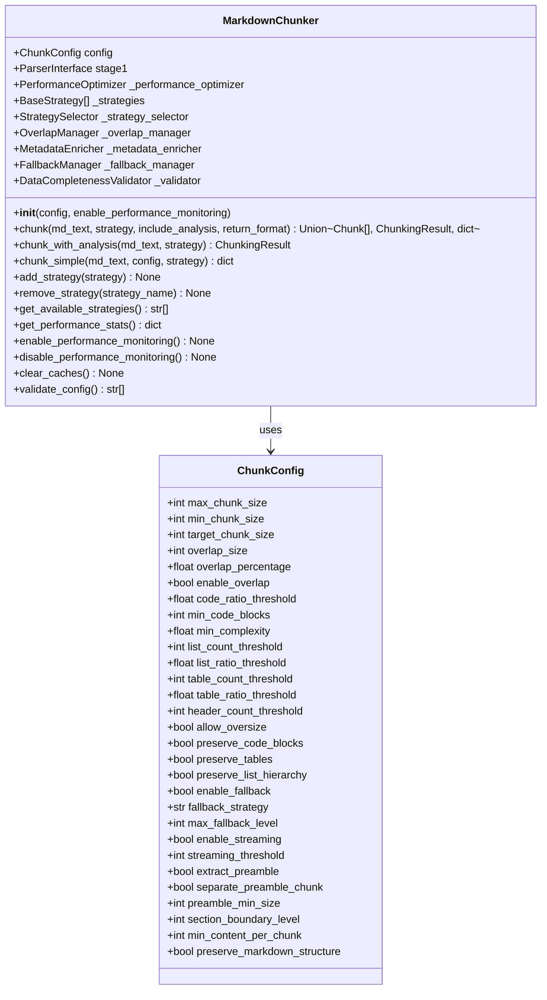

# Python Library API Documentation

<cite>
**Referenced Files in This Document**
- [markdown_chunker/__init__.py](file://markdown_chunker/__init__.py)
- [markdown_chunker/chunker/__init__.py](file://markdown_chunker/chunker/__init__.py)
- [markdown_chunker/chunker/core.py](file://markdown_chunker/chunker/core.py)
- [markdown_chunker/chunker/types.py](file://markdown_chunker/chunker/types.py)
- [markdown_chunker/api/__init__.py](file://markdown_chunker/api/__init__.py)
- [markdown_chunker/api/types.py](file://markdown_chunker/api/types.py)
- [markdown_chunker/api/error_handler.py](file://markdown_chunker/api/error_handler.py)
- [examples/basic_usage.py](file://examples/basic_usage.py)
- [examples/api_usage.py](file://examples/api_usage.py)
- [markdown_chunker/chunker/performance.py](file://markdown_chunker/chunker/performance.py)
</cite>

## Table of Contents
1. [Introduction](#introduction)
2. [Core Classes](#core-classes)
3. [Data Structures](#data-structures)
4. [Configuration System](#configuration-system)
5. [API Methods Reference](#api-methods-reference)
6. [Usage Examples](#usage-examples)
7. [Error Handling](#error-handling)
8. [Performance Monitoring](#performance-monitoring)
9. [Advanced Features](#advanced-features)
10. [Integration Patterns](#integration-patterns)

## Introduction

The Python Markdown Chunker library provides intelligent chunking of Markdown documents with automatic strategy selection based on content analysis. The library offers both synchronous and asynchronous processing capabilities, flexible configuration options, and comprehensive API integration support.

### Key Features

- **Adaptive Strategy Selection**: Automatically chooses optimal chunking strategies based on content analysis
- **Multiple Chunking Strategies**: Six specialized strategies for different content types
- **Flexible Configuration**: Fine-grained control over chunking behavior
- **Performance Monitoring**: Built-in performance tracking and optimization
- **REST API Support**: Ready-to-use API adapters for web integration
- **Error Handling**: Comprehensive error handling with fallback mechanisms

## Core Classes

### MarkdownChunker

The main interface class for chunking Markdown documents. Orchestrates the entire chunking process including content analysis, strategy selection, chunk creation, overlap management, and metadata enrichment.



**Diagram sources**
- [markdown_chunker/chunker/core.py](file://markdown_chunker/chunker/core.py#L41-L118)
- [markdown_chunker/chunker/types.py](file://markdown_chunker/chunker/types.py#L497-L1061)

**Section sources**
- [markdown_chunker/chunker/core.py](file://markdown_chunker/chunker/core.py#L41-L118)
- [markdown_chunker/__init__.py](file://markdown_chunker/__init__.py#L28-L29)

## Data Structures

### Chunk

Represents a single chunk of content with metadata and computed properties.

| Field | Type | Description |
|-------|------|-------------|
| `content` | `str` | The actual chunk content |
| `start_line` | `int` | Starting line number (1-based) |
| `end_line` | `int` | Ending line number (1-based) |
| `metadata` | `Dict[str, Any]` | Chunk metadata and properties |

#### Properties

| Property | Type | Description |
|----------|------|-------------|
| `size` | `int` | Character count of content |
| `line_count` | `int` | Number of lines spanned |
| `content_type` | `str` | Content type (code, text, list, table, mixed, header, preamble) |
| `strategy` | `str` | Strategy used for chunking |
| `language` | `Optional[str]` | Programming language for code chunks |
| `is_oversize` | `bool` | Whether chunk exceeds max size limits |

#### Methods

| Method | Parameters | Returns | Description |
|--------|------------|---------|-------------|
| `add_metadata(key, value)` | `key: str, value: Any` | `None` | Add metadata to chunk |
| `get_metadata(key, default)` | `key: str, default: Any` | `Any` | Retrieve metadata with default |
| `get_section_path()` | None | `List[str]` | Get hierarchical section path |
| `get_source_range()` | None | `tuple[int, int]` | Get character offset range |
| `get_section_id()` | None | `str` | Get stable section identifier |
| `to_dict()` | None | `Dict[str, Any]` | Convert to dictionary |
| `from_dict(data)` | `data: Dict[str, Any]` | `Chunk` | Create from dictionary |

**Section sources**
- [markdown_chunker/chunker/types.py](file://markdown_chunker/chunker/types.py#L36-L318)

### ChunkingResult

Contains the complete result of a chunking operation with statistics and metadata.

| Field | Type | Description |
|-------|------|-------------|
| `chunks` | `List[Chunk]` | Generated chunks |
| `strategy_used` | `str` | Selected strategy |
| `processing_time` | `float` | Processing duration in seconds |
| `fallback_used` | `bool` | Whether fallback strategy was used |
| `fallback_level` | `int` | Fallback recursion level |
| `errors` | `List[str]` | Error messages |
| `warnings` | `List[str]` | Warning messages |
| `total_chars` | `int` | Total character count |
| `total_lines` | `int` | Total line count |
| `content_type` | `str` | Detected content type |
| `complexity_score` | `float` | Content complexity score |

#### Statistics Properties

| Property | Type | Description |
|----------|------|-------------|
| `total_chunks` | `int` | Total number of chunks |
| `average_chunk_size` | `float` | Mean chunk size |
| `min_chunk_size` | `int` | Smallest chunk size |
| `max_chunk_size` | `int` | Largest chunk size |
| `success` | `bool` | Whether operation succeeded |

**Section sources**
- [markdown_chunker/chunker/types.py](file://markdown_chunker/chunker/types.py#L322-L493)

### ChunkConfig

Configuration class controlling all aspects of chunking behavior.

| Parameter | Type | Default | Description |
|-----------|------|---------|-------------|
| `max_chunk_size` | `int` | `4096` | Maximum chunk size in characters |
| `min_chunk_size` | `int` | `512` | Minimum chunk size in characters |
| `target_chunk_size` | `int` | `2048` | Target chunk size in characters |
| `overlap_size` | `int` | `200` | Overlap size in characters |
| `overlap_percentage` | `float` | `0.1` | Overlap as percentage of chunk size |
| `enable_overlap` | `bool` | `True` | Enable chunk overlap |
| `code_ratio_threshold` | `float` | `0.3` | Code content threshold |
| `min_code_blocks` | `int` | `1` | Minimum code blocks for code strategy |
| `min_complexity` | `float` | `0.3` | Minimum complexity for mixed strategy |
| `list_count_threshold` | `int` | `5` | Minimum lists for list strategy |
| `list_ratio_threshold` | `float` | `0.6` | List content threshold |
| `table_count_threshold` | `int` | `3` | Minimum tables for table strategy |
| `table_ratio_threshold` | `float` | `0.4` | Table content threshold |
| `header_count_threshold` | `int` | `3` | Minimum headers for structural strategy |
| `allow_oversize` | `bool` | `True` | Allow oversized chunks |
| `preserve_code_blocks` | `bool` | `True` | Preserve code block integrity |
| `preserve_tables` | `bool` | `True` | Preserve table integrity |
| `preserve_list_hierarchy` | `bool` | `True` | Preserve list structure |
| `enable_fallback` | `bool` | `True` | Enable fallback strategies |
| `fallback_strategy` | `str` | `"sentences"` | Fallback strategy name |
| `max_fallback_level` | `int` | `4` | Maximum fallback depth |
| `enable_streaming` | `bool` | `False` | Enable streaming for large documents |
| `streaming_threshold` | `int` | `10*1024*1024` | Streaming threshold in bytes |
| `extract_preamble` | `bool` | `True` | Extract preamble information |
| `separate_preamble_chunk` | `bool` | `False` | Create separate preamble chunk |
| `preamble_min_size` | `int` | `10` | Minimum preamble size |
| `section_boundary_level` | `int` | `2` | Section boundary level (1-6) |
| `min_content_per_chunk` | `int` | `50` | Minimum content per chunk |
| `preserve_markdown_structure` | `bool` | `True` | Preserve markdown structure |

**Section sources**
- [markdown_chunker/chunker/types.py](file://markdown_chunker/chunker/types.py#L497-L1061)

## Configuration System

### Factory Methods

The library provides several factory methods for common configuration scenarios:

| Method | Purpose | Typical Use Case |
|--------|---------|------------------|
| `default()` | Balanced settings | General documents |
| `for_code_heavy()` | Code-heavy documents | API docs, tutorials |
| `for_structured_docs()` | Structured documentation | User manuals |
| `for_dify_rag()` | RAG systems | Information retrieval |
| `for_chat_context()` | Chat/LLM context | Conversational AI |
| `for_search_indexing()` | Search applications | Content indexing |
| `for_large_documents()` | Large documents | Books, articles |
| `compact()` | Small chunks | Precise matching |

### Custom Configuration

```python
from markdown_chunker import ChunkConfig

# Custom configuration
config = ChunkConfig(
    max_chunk_size=2048,
    min_chunk_size=256,
    enable_overlap=True,
    overlap_size=100,
    code_ratio_threshold=0.5
)

# Create chunker with custom config
chunker = MarkdownChunker(config)
```

**Section sources**
- [markdown_chunker/chunker/types.py](file://markdown_chunker/chunker/types.py#L666-L1061)

## API Methods Reference

### Core Methods

#### `chunk()`

Primary chunking method supporting multiple return formats.

**Signature:**
```python
def chunk(
    self,
    md_text: str,
    strategy: Optional[str] = None,
    include_analysis: bool = False,
    return_format: Literal["objects", "dict"] = "objects",
) -> Union[List[Chunk], ChunkingResult, dict]
```

**Parameters:**
- `md_text` (str): Markdown content to process
- `strategy` (Optional[str]): Strategy override ("code", "mixed", "list", "table", "structural", "sentences")
- `include_analysis` (bool): Include detailed analysis metadata
- `return_format` (str): Output format ("objects" or "dict")

**Returns:**
- `List[Chunk]`: When `include_analysis=False`, `return_format="objects"`
- `ChunkingResult`: When `include_analysis=True`, `return_format="objects"`
- `dict`: When `return_format="dict"`

**Raises:**
- `ValueError`: If `md_text` is invalid
- `StrategySelectionError`: If specified strategy is not found
- `ChunkingError`: If chunking fails completely

#### `chunk_with_analysis()`

Deprecated method - use `chunk(include_analysis=True)` instead.

**Signature:**
```python
def chunk_with_analysis(
    self, 
    md_text: str, 
    strategy: Optional[str] = None
) -> ChunkingResult
```

#### `chunk_simple()`

Deprecated method - use `chunk(return_format="dict")` instead.

**Signature:**
```python
def chunk_simple(
    self,
    md_text: str,
    config: Optional[dict] = None,
    strategy: Optional[str] = None,
) -> dict
```

### Strategy Management Methods

#### `add_strategy()`

Add a custom strategy to the chunker.

**Signature:**
```python
def add_strategy(self, strategy: BaseStrategy) -> None
```

**Parameters:**
- `strategy` (BaseStrategy): Custom strategy instance

**Notes:**
- Strategy selector is recreated after adding
- Duplicate strategy names override existing ones
- Custom strategies participate in automatic selection

#### `remove_strategy()`

Remove a strategy from the chunker.

**Signature:**
```python
def remove_strategy(self, strategy_name: str) -> None
```

**Parameters:**
- `strategy_name` (str): Name of strategy to remove

**Notes:**
- Strategy selector is recreated after removal
- Removing all strategies causes chunking to fail
- Built-in strategies can be removed but not restored

#### `get_available_strategies()`

Get list of available strategy names.

**Signature:**
```python
def get_available_strategies(self) -> List[str]
```

**Returns:**
- `List[str]`: Available strategy names

**Notes:**
- Order of strategies is not guaranteed
- Strategy names are case-sensitive
- Empty list means no strategies available

### Performance Methods

#### `get_performance_stats()`

Get performance statistics for all operations.

**Signature:**
```python
def get_performance_stats(self) -> dict
```

**Returns:**
- `dict`: Performance metrics including:
  - `'chunk'`: Stats for chunk() method
  - `'strategy_selection'`: Strategy selection metrics
  - `'overlap'`: Overlap processing metrics
  - `'metadata'`: Metadata enrichment metrics

#### `enable_performance_monitoring()`

Enable performance monitoring.

#### `disable_performance_monitoring()`

Disable performance monitoring.

#### `clear_caches()`

Clear all performance caches.

**Section sources**
- [markdown_chunker/chunker/core.py](file://markdown_chunker/chunker/core.py#L155-L774)

## Usage Examples

### Basic Usage

#### Synchronous Processing

```python
from markdown_chunker import MarkdownChunker, ChunkConfig

# Basic usage with default configuration
chunker = MarkdownChunker()
chunks = chunker.chunk("# Hello\n\nWorld")

print(f"Generated {len(chunks)} chunks")
for chunk in chunks:
    print(f"Size: {chunk.size} chars")
    print(f"Lines: {chunk.start_line}-{chunk.end_line}")
```

#### With Detailed Analysis

```python
# With detailed analysis
result = chunker.chunk("# Hello\n\nWorld", include_analysis=True)
print(f"Strategy used: {result.strategy_used}")
print(f"Processing time: {result.processing_time:.3f}s")
print(f"Total chunks: {len(result.chunks)}")
```

### Configuration Examples

#### Custom Configuration

```python
# Custom configuration
config = ChunkConfig(
    max_chunk_size=200,
    min_chunk_size=50,
    enable_overlap=True,
    overlap_size=30
)

chunker = MarkdownChunker(config)
result = chunker.chunk_with_analysis(document)
```

#### Using Configuration Profiles

```python
# Code-heavy document
config = ChunkConfig.for_code_heavy()
chunker = MarkdownChunker(config)
chunks = chunker.chunk(code_document)

# RAG system configuration
config = ChunkConfig.for_dify_rag()
chunker = MarkdownChunker(config)
```

### Advanced Usage

#### Strategy Override

```python
# Force specific strategy
chunks = chunker.chunk(document, strategy="code")
chunks = chunker.chunk(document, strategy="structural")
```

#### Dynamic Strategy Management

```python
# Add custom strategy
chunker.add_strategy(CustomStrategy())

# Remove strategy
chunker.remove_strategy("table")

# Check available strategies
available = chunker.get_available_strategies()
```

#### Performance Monitoring

```python
# Enable monitoring
chunker = MarkdownChunker(enable_performance_monitoring=True)

# Process documents
for doc in documents:
    chunker.chunk(doc)

# Get statistics
stats = chunker.get_performance_stats()
print(f"Average chunk time: {stats['chunk']['avg_time']:.3f}s")
```

**Section sources**
- [examples/basic_usage.py](file://examples/basic_usage.py#L14-L364)

## Error Handling

### Error Types

The library handles various error types with specific error classes:

| Error Type | Description | Handling |
|------------|-------------|----------|
| `StrategySelectionError` | Invalid strategy specified | Catch and suggest alternatives |
| `ConfigurationError` | Invalid configuration | Validate before use |
| `ChunkingError` | Chunking failed | Fallback mechanism applies |
| `ValueError` | Invalid input parameters | Validate input data |
| `TypeError` | Wrong parameter types | Check parameter types |

### Error Handling Patterns

#### Graceful Degradation

```python
from markdown_chunker.chunker.errors import StrategySelectionError, ChunkingError

try:
    result = chunker.chunk(document, strategy="invalid")
except StrategySelectionError as e:
    # Fall back to automatic selection
    result = chunker.chunk(document)
except ChunkingError as e:
    # Handle chunking failure
    print(f"Chunking failed: {e}")
    # Consider using fallback content
```

#### Validation

```python
# Validate configuration
errors = chunker.validate_config()
if errors:
    print(f"Configuration errors: {errors}")

# Check result validity
if result.success:
    process_chunks(result.chunks)
else:
    print(f"Errors: {result.errors}")
```

### API Error Handling

For REST API integration, use the built-in error handler:

```python
from markdown_chunker.api import APIErrorHandler

handler = APIErrorHandler(include_traceback=True)

try:
    result = chunker.chunk(document)
    response = APIResponse.success_response(
        chunks=[c.to_dict() for c in result.chunks],
        metadata=result.get_summary()
    )
except Exception as e:
    response = handler.handle_exception(e)
```

**Section sources**
- [markdown_chunker/api/error_handler.py](file://markdown_chunker/api/error_handler.py#L18-L235)

## Performance Monitoring

### Performance Features

The library includes comprehensive performance monitoring capabilities:

#### Metrics Collected

- **Chunking Operations**: Time, size, throughput
- **Strategy Selection**: Performance by strategy
- **Overlap Processing**: Overlap computation time
- **Metadata Enrichment**: Metadata processing time
- **Fallback Operations**: Fallback usage statistics

#### Performance Optimization

```python
# Enable monitoring
chunker = MarkdownChunker(enable_performance_monitoring=True)

# Process documents
chunker.chunk(document1)
chunker.chunk(document2)

# Get detailed statistics
stats = chunker.get_performance_stats()

# Monitor specific operations
chunk_stats = stats.get('chunk', {})
print(f"Total operations: {chunk_stats.get('count', 0)}")
print(f"Average time: {chunk_stats.get('avg_time', 0):.3f}s")
print(f"Throughput: {chunk_stats.get('throughput', 0):.1f} chars/sec")
```

#### Performance Tuning

```python
# Optimize for throughput
config = ChunkConfig(
    max_chunk_size=8192,  # Larger chunks
    min_chunk_size=1024,  # Reduce fragmentation
    enable_overlap=False,  # Disable overlap for speed
    enable_streaming=True  # For large documents
)

# Optimize for latency
config = ChunkConfig(
    max_chunk_size=1024,  # Smaller chunks
    enable_overlap=True,   # Maintain context
    overlap_size=100       # Moderate overlap
)
```

**Section sources**
- [markdown_chunker/chunker/performance.py](file://markdown_chunker/chunker/performance.py#L32-L200)

## Advanced Features

### Strategy Selection

The library automatically selects the optimal strategy based on content analysis:

#### Available Strategies

| Strategy | Content Type | Thresholds | Use Case |
|----------|--------------|------------|----------|
| `code` | Code blocks | `code_ratio_threshold: 0.3+` | Code-heavy documents |
| `mixed` | Mixed content | `min_complexity: 0.3+` | Complex documents |
| `list` | Lists | `list_ratio_threshold: 0.6+` | List-heavy documents |
| `table` | Tables | `table_ratio_threshold: 0.4+` | Table-heavy documents |
| `structural` | Headers | `header_count_threshold: 3+` | Structured documents |
| `sentences` | Text | General | Simple text documents |

#### Custom Strategies

```python
from markdown_chunker.chunker.strategies.base import BaseStrategy

class CustomStrategy(BaseStrategy):
    def __init__(self):
        super().__init__()
        self.name = "custom"
        self.priority = 50
    
    def can_handle(self, analysis, config):
        return analysis.complexity_score > 0.5
    
    def apply(self, text, stage1_results, config):
        # Custom chunking logic
        return [Chunk(text, 1, 1, {})]

# Add custom strategy
chunker.add_strategy(CustomStrategy())
```

### Metadata Enrichment

Each chunk receives comprehensive metadata:

```python
# Access chunk metadata
chunk = chunks[0]
print(f"Strategy: {chunk.strategy}")
print(f"Content type: {chunk.content_type}")
print(f"Language: {chunk.language}")
print(f"Oversize: {chunk.is_oversize}")
print(f"Section path: {chunk.get_section_path()}")

# Add custom metadata
chunk.add_metadata("custom_field", "value")
chunk.add_metadata("importance", 0.95)
```

### Overlap Management

Automatic overlap creation for context preservation:

```python
# Enable overlap
config = ChunkConfig(
    enable_overlap=True,
    overlap_size=200
)

chunker = MarkdownChunker(config)
result = chunker.chunk(document)

# Check overlap
for chunk in result.chunks:
    if chunk.get_metadata("has_overlap"):
        print(f"Chunk {chunk.start_line} has overlap")
```

**Section sources**
- [markdown_chunker/chunker/core.py](file://markdown_chunker/chunker/core.py#L127-L140)

## Integration Patterns

### REST API Integration

The library provides ready-to-use API adapters:

```python
from markdown_chunker.api import APIAdapter, APIRequest, APIResponse

# Create adapter
adapter = APIAdapter()

# Create request
request = APIRequest(
    content="# Hello World\n\nThis is a test document.",
    config=None,  # Use defaults
    strategy="auto"
)

# Process request
response = adapter.process_request(request)

if response.success:
    print(f"Chunks: {len(response.chunks)}")
    print(f"Strategy: {response.metadata['strategy_used']}")
else:
    print(f"Error: {response.errors}")
```

### Batch Processing

```python
from markdown_chunker import MarkdownChunker, ChunkConfig

# Batch processing with performance monitoring
chunker = MarkdownChunker(enable_performance_monitoring=True)

documents = [doc1, doc2, doc3]
results = []

for doc in documents:
    result = chunker.chunk(doc, include_analysis=True)
    results.append({
        "chunks": len(result.chunks),
        "strategy": result.strategy_used,
        "time": result.processing_time
    })

# Get performance statistics
stats = chunker.get_performance_stats()
print(f"Average processing time: {stats['chunk']['avg_time']:.3f}s")
```

### Streaming Processing

For large documents, enable streaming:

```python
config = ChunkConfig(
    enable_streaming=True,
    streaming_threshold=5 * 1024 * 1024  # 5MB
)

chunker = MarkdownChunker(config)

# Process large document
result = chunker.chunk(large_document)
```

### Asynchronous Processing

```python
import asyncio
from markdown_chunker import MarkdownChunker

async def process_document_async(content):
    loop = asyncio.get_event_loop()
    chunker = MarkdownChunker()
    
    # Process in executor to avoid blocking
    result = await loop.run_in_executor(
        None, 
        lambda: chunker.chunk(content, include_analysis=True)
    )
    
    return result

# Usage
async def main():
    result = await process_document_async(document)
    print(f"Processed {len(result.chunks)} chunks")
```

**Section sources**
- [examples/api_usage.py](file://examples/api_usage.py#L16-L356)

## Conclusion

The Python Markdown Chunker library provides a comprehensive solution for intelligent Markdown document chunking. Its adaptive strategy selection, flexible configuration system, and robust error handling make it suitable for a wide range of applications from simple document processing to complex RAG systems.

Key benefits include:
- **Intelligent Strategy Selection**: Automatic optimization based on content analysis
- **Flexible Configuration**: Fine-grained control over chunking behavior  
- **Performance Monitoring**: Built-in metrics and optimization
- **Robust Error Handling**: Graceful degradation and fallback mechanisms
- **API Integration**: Ready-to-use REST API support
- **Extensibility**: Custom strategy and component support

The library's design prioritizes both ease of use for simple cases and flexibility for advanced scenarios, making it an excellent choice for Markdown processing in various applications.