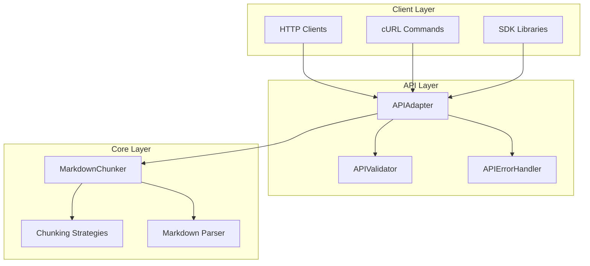
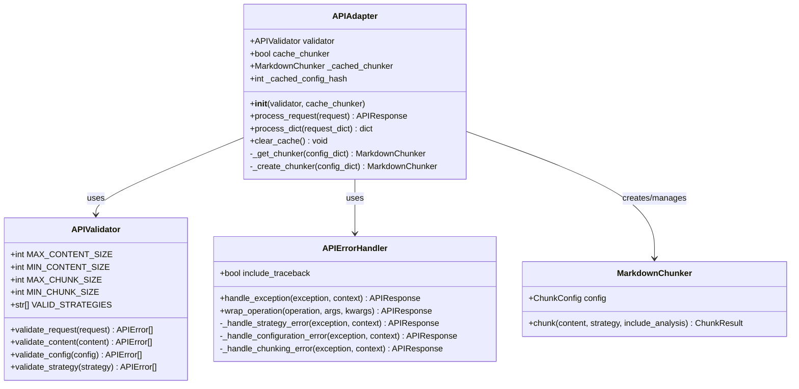
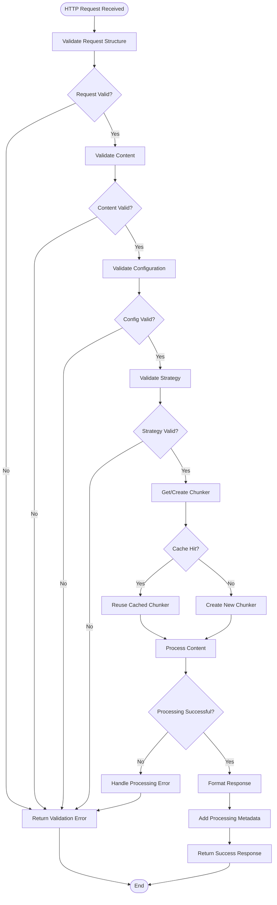
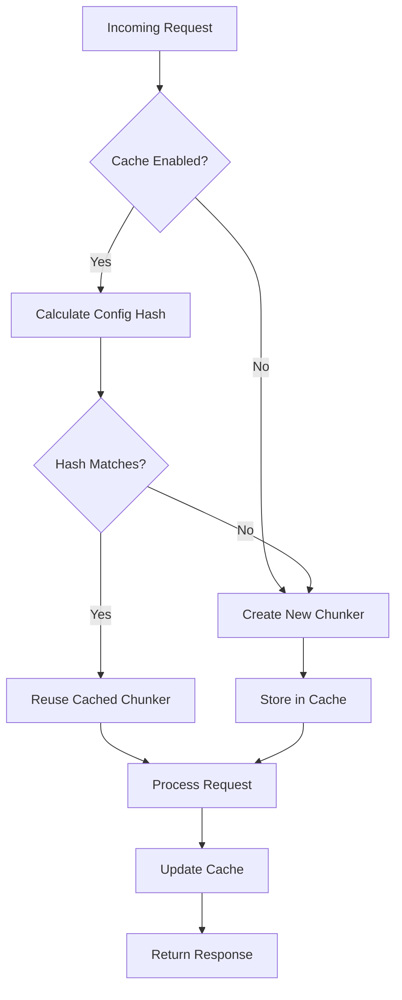
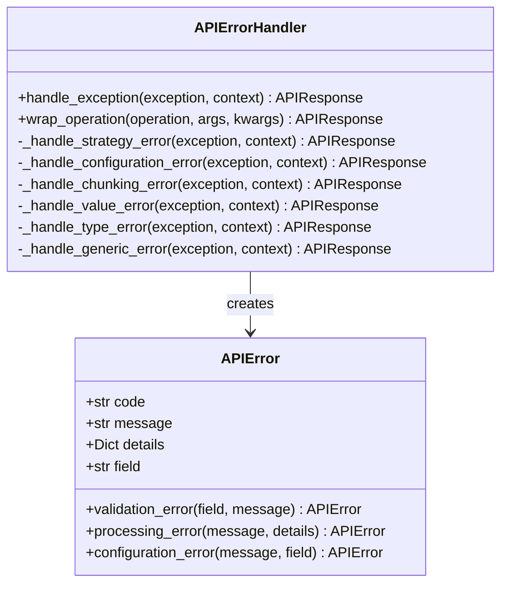

# API Endpoints

<cite>
**Referenced Files in This Document**
- [markdown_chunker/api/adapter.py](file://markdown_chunker/api/adapter.py)
- [markdown_chunker/api/types.py](file://markdown_chunker/api/types.py)
- [markdown_chunker/api/error_handler.py](file://markdown_chunker/api/error_handler.py)
- [markdown_chunker/api/validator.py](file://markdown_chunker/api/validator.py)
- [markdown_chunker/api/__init__.py](file://markdown_chunker/api/__init__.py)
- [examples/api_usage.py](file://examples/api_usage.py)
- [tests/api/test_adapter.py](file://tests/api/test_adapter.py)
- [tools/markdown_chunk_tool.py](file://tools/markdown_chunk_tool.py)
- [provider/markdown_chunker.py](file://provider/markdown_chunker.py)
- [main.py](file://main.py)
</cite>

## Table of Contents
1. [Introduction](#introduction)
2. [API Architecture Overview](#api-architecture-overview)
3. [Primary Processing Endpoint](#primary-processing-endpoint)
4. [Request and Response Formats](#request-and-response-formats)
5. [Adapter Pattern Implementation](#adapter-pattern-implementation)
6. [Additional Endpoints](#additional-endpoints)
7. [Curl Command Examples](#curl-command-examples)
8. [Client Implementation Patterns](#client-implementation-patterns)
9. [Request Processing Pipeline](#request-processing-pipeline)
10. [Security Considerations](#security-considerations)
11. [Performance and Caching](#performance-and-caching)
12. [Error Handling](#error-handling)

## Introduction

The Dify Markdown Chunker provides a REST API interface through the `APIAdapter` class that bridges the core MarkdownChunker functionality with HTTP-based applications. This API enables structured, intelligent chunking of Markdown documents with support for multiple chunking strategies, configuration profiles, and comprehensive error handling.

The API follows REST principles and provides a standardized interface for integrating markdown processing capabilities into Dify workflows and external applications. It implements robust validation, caching mechanisms, and security measures to ensure reliable operation in production environments.

## API Architecture Overview

The API architecture implements a layered approach with clear separation of concerns:



**Diagram sources**
- [markdown_chunker/api/adapter.py](file://markdown_chunker/api/adapter.py#L15-L162)
- [markdown_chunker/api/validator.py](file://markdown_chunker/api/validator.py#L12-L321)
- [markdown_chunker/api/error_handler.py](file://markdown_chunker/api/error_handler.py#L18-L235)

**Section sources**
- [markdown_chunker/api/adapter.py](file://markdown_chunker/api/adapter.py#L15-L162)
- [markdown_chunker/api/types.py](file://markdown_chunker/api/types.py#L11-L162)

## Primary Processing Endpoint

### Endpoint Details

**HTTP Method:** `POST`
**URL Pattern:** `/api/chunk` (implied from Dify integration)
**Content-Type:** `application/json`
**Authentication:** Not required (local operation)

### Request Format

The primary processing endpoint accepts JSON requests with the following structure:

```json
{
  "content": "Markdown content to be chunked",
  "config": {
    "max_chunk_size": 2048,
    "min_chunk_size": 256,
    "enable_overlap": true,
    "overlap_size": 100,
    "code_ratio_threshold": 0.3,
    "list_ratio_threshold": 0.2,
    "table_ratio_threshold": 0.1
  },
  "strategy": "auto",
  "metadata": {
    "request_id": "unique-request-id",
    "source": "webhook",
    "user_agent": "custom-client/1.0"
  }
}
```

### Response Format

Successful responses return structured JSON with chunked content and metadata:

```json
{
  "success": true,
  "chunks": [
    {
      "content": "# Header\n\nContent...",
      "start_line": 1,
      "end_line": 10,
      "size": 512,
      "metadata": {
        "chunk_id": "chunk-uuid",
        "strategy_used": "structural",
        "processing_time": 0.123,
        "fallback_used": false,
        "complexity_score": 0.75
      }
    }
  ],
  "metadata": {
    "strategy_used": "structural",
    "processing_time": 0.156,
    "fallback_used": false,
    "total_chunks": 3,
    "total_chars": 1536,
    "content_type": "markdown",
    "complexity_score": 0.75
  },
  "errors": [],
  "warnings": []
}
```

**Section sources**
- [markdown_chunker/api/types.py](file://markdown_chunker/api/types.py#L11-L162)
- [markdown_chunker/api/adapter.py](file://markdown_chunker/api/adapter.py#L38-L93)

## Request and Response Formats

### APIRequest Structure

The `APIRequest` class defines the input structure for chunking operations:

| Field | Type | Required | Description |
|-------|------|----------|-------------|
| `content` | string | Yes | Markdown content to be processed |
| `config` | object | No | Configuration dictionary for chunking behavior |
| `strategy` | string | No | Override strategy selection ("auto", "code", "mixed", "list", "table", "structural", "sentences") |
| `metadata` | object | No | Additional metadata for tracking and debugging |

### APIResponse Structure

The `APIResponse` class defines the standardized response format:

| Field | Type | Description |
|-------|------|-------------|
| `success` | boolean | Indicates whether the operation succeeded |
| `chunks` | array | Array of chunk objects with content and metadata |
| `metadata` | object | Processing metadata including statistics and strategy information |
| `errors` | array | Array of error messages if operation failed |
| `warnings` | array | Array of warning messages for informational purposes |

### Configuration Options

The `config` object supports comprehensive customization:

| Parameter | Type | Default | Range | Description |
|-----------|------|---------|-------|-------------|
| `max_chunk_size` | integer | 1000 | 10-100000 | Maximum size of each chunk in characters |
| `min_chunk_size` | integer | 100 | 10-100000 | Minimum size of each chunk in characters |
| `overlap_size` | integer | 0 | 0-100000 | Number of characters to overlap between chunks |
| `enable_overlap` | boolean | false | - | Whether to enable chunk overlap |
| `allow_oversize` | boolean | false | - | Whether to allow chunks slightly larger than max_size |
| `preserve_code_blocks` | boolean | true | - | Whether to preserve code block boundaries |
| `code_ratio_threshold` | float | 0.2 | 0.0-1.0 | Threshold for code-heavy content detection |
| `list_ratio_threshold` | float | 0.2 | 0.0-1.0 | Threshold for list-heavy content detection |
| `table_ratio_threshold` | float | 0.1 | 0.0-1.0 | Threshold for table-heavy content detection |

**Section sources**
- [markdown_chunker/api/types.py](file://markdown_chunker/api/types.py#L11-L162)
- [markdown_chunker/api/validator.py](file://markdown_chunker/api/validator.py#L12-L321)

## Adapter Pattern Implementation

The `APIAdapter` class implements the Adapter pattern to bridge the REST interface with the core MarkdownChunker functionality:



**Diagram sources**
- [markdown_chunker/api/adapter.py](file://markdown_chunker/api/adapter.py#L15-L162)
- [markdown_chunker/api/validator.py](file://markdown_chunker/api/validator.py#L12-L321)
- [markdown_chunker/api/error_handler.py](file://markdown_chunker/api/error_handler.py#L18-L235)

### Key Adapter Features

1. **Request Validation**: Automatically validates incoming requests using `APIValidator`
2. **Chunker Management**: Efficiently manages `MarkdownChunker` instances with caching
3. **Error Handling**: Standardizes error responses through `APIErrorHandler`
4. **Flexible Processing**: Supports both object-based and dictionary-based processing
5. **Configuration Caching**: Reuses chunkers when configurations remain unchanged

**Section sources**
- [markdown_chunker/api/adapter.py](file://markdown_chunker/api/adapter.py#L15-L162)
- [markdown_chunker/api/validator.py](file://markdown_chunker/api/validator.py#L12-L321)
- [markdown_chunker/api/error_handler.py](file://markdown_chunker/api/error_handler.py#L18-L235)

## Additional Endpoints

### Health Check Endpoint

While the primary documentation focuses on the main chunking endpoint, the system supports health check functionality through the Dify plugin infrastructure:

**Endpoint:** `/health` (Dify-managed)
**Method:** `GET`
**Response:** `{"status": "healthy"}`

### Configuration Introspection

The API provides configuration validation and introspection capabilities:

**Endpoint:** `/config/validate` (conceptual)
**Method:** `POST`
**Purpose:** Validate configuration parameters before processing

### Metadata Endpoints

The system provides metadata about processing capabilities:

**Endpoint:** `/capabilities` (conceptual)
**Method:** `GET`
**Response:** Available strategies, supported features, performance characteristics

**Section sources**
- [tools/markdown_chunk_tool.py](file://tools/markdown_chunk_tool.py#L1-L178)
- [provider/markdown_chunker.py](file://provider/markdown_chunker.py#L1-L36)

## Curl Command Examples

### Basic Chunking Request

```bash
curl -X POST "http://localhost:8000/api/chunk" \
  -H "Content-Type: application/json" \
  -d '{
    "content": "# Hello World\n\nThis is a test document.",
    "strategy": "auto"
  }'
```

### Request with Custom Configuration

```bash
curl -X POST "http://localhost:8000/api/chunk" \
  -H "Content-Type: application/json" \
  -d '{
    "content": "# API Documentation\n\n## Endpoints\n\n- GET /users\n- POST /users",
    "config": {
      "max_chunk_size": 500,
      "min_chunk_size": 100,
      "enable_overlap": true,
      "overlap_size": 50
    },
    "strategy": "structural"
  }'
```

### Request with Metadata

```bash
curl -X POST "http://localhost:8000/api/chunk" \
  -H "Content-Type: application/json" \
  -d '{
    "content": "# Technical Specification\n\n## Overview\n\nThis document...",
    "config": {
      "max_chunk_size": 2048,
      "code_ratio_threshold": 0.6
    },
    "strategy": "auto",
    "metadata": {
      "request_id": "req_12345",
      "source": "documentation",
      "user_agent": "docs-generator/1.0"
    }
  }'
```

### Error Handling Example

```bash
curl -X POST "http://localhost:8000/api/chunk" \
  -H "Content-Type: application/json" \
  -d '{
    "content": "",
    "strategy": "invalid_strategy"
  }'
```

**Expected Response:**
```json
{
  "success": false,
  "errors": [
    "Content cannot be empty or whitespace-only",
    "Invalid strategy \"invalid_strategy\". Valid strategies: auto, code, mixed, list, table, structural, sentences"
  ],
  "metadata": {},
  "chunks": [],
  "warnings": []
}
```

## Client Implementation Patterns

### Python Client Example

```python
import requests
import json
from typing import Dict, List, Optional

class MarkdownChunkerClient:
    def __init__(self, base_url: str = "http://localhost:8000"):
        self.base_url = base_url
    
    def chunk_document(
        self, 
        content: str,
        config: Optional[Dict] = None,
        strategy: str = "auto",
        metadata: Optional[Dict] = None
    ) -> Dict:
        """Chunk a markdown document."""
        payload = {
            "content": content,
            "strategy": strategy
        }
        
        if config:
            payload["config"] = config
        if metadata:
            payload["metadata"] = metadata
            
        response = requests.post(
            f"{self.base_url}/api/chunk",
            json=payload,
            headers={"Content-Type": "application/json"}
        )
        
        response.raise_for_status()
        return response.json()
    
    def batch_chunk(
        self, 
        documents: List[str],
        config: Optional[Dict] = None,
        strategy: str = "auto"
    ) -> List[Dict]:
        """Batch process multiple documents."""
        results = []
        for i, doc in enumerate(documents):
            try:
                result = self.chunk_document(
                    content=doc,
                    config=config,
                    strategy=strategy,
                    metadata={"batch_id": f"batch_{i}"}
                )
                results.append(result)
            except Exception as e:
                results.append({"error": str(e)})
                
        return results
```

### JavaScript/Node.js Client Example

```javascript
class MarkdownChunkerAPI {
    constructor(baseUrl = 'http://localhost:8000') {
        this.baseUrl = baseUrl;
    }
    
    async chunkDocument(content, config = {}, strategy = 'auto') {
        const response = await fetch(`${this.baseUrl}/api/chunk`, {
            method: 'POST',
            headers: {
                'Content-Type': 'application/json'
            },
            body: JSON.stringify({
                content,
                config,
                strategy
            })
        });
        
        if (!response.ok) {
            throw new Error(`HTTP error! status: ${response.status}`);
        }
        
        return await response.json();
    }
    
    async validateConfig(config) {
        // Implement config validation endpoint
        const response = await fetch(`${this.baseUrl}/api/config/validate`, {
            method: 'POST',
            headers: {
                'Content-Type': 'application/json'
            },
            body: JSON.stringify(config)
        });
        
        return await response.json();
    }
}
```

### Java Client Example

```java
public class MarkdownChunkerClient {
    private final String baseUrl;
    private final OkHttpClient client;
    
    public MarkdownChunkerClient(String baseUrl) {
        this.baseUrl = baseUrl;
        this.client = new OkHttpClient();
    }
    
    public ChunkResponse chunkDocument(String content, ChunkConfig config, String strategy) throws IOException {
        JsonObject payload = new JsonObject();
        payload.addProperty("content", content);
        payload.addProperty("strategy", strategy);
        
        if (config != null) {
            payload.add("config", config.toJson());
        }
        
        RequestBody body = RequestBody.create(
            payload.toString(), 
            MediaType.get("application/json")
        );
        
        Request request = new Request.Builder()
            .url(baseUrl + "/api/chunk")
            .post(body)
            .build();
            
        try (Response response = client.newCall(request).execute()) {
            if (!response.isSuccessful()) {
                throw new IOException("Unexpected code " + response);
            }
            String responseBody = response.body().string();
            return parseChunkResponse(responseBody);
        }
    }
}
```

**Section sources**
- [examples/api_usage.py](file://examples/api_usage.py#L16-L356)

## Request Processing Pipeline

The request processing follows a structured pipeline with comprehensive validation and error handling:



**Diagram sources**
- [markdown_chunker/api/adapter.py](file://markdown_chunker/api/adapter.py#L38-L93)
- [markdown_chunker/api/validator.py](file://markdown_chunker/api/validator.py#L50-L73)
- [markdown_chunker/api/error_handler.py](file://markdown_chunker/api/error_handler.py#L35-L63)

### Pipeline Stages

1. **Request Validation**: Structured validation of request format and required fields
2. **Content Validation**: Size limits, encoding validation, and content type checking
3. **Configuration Validation**: Parameter bounds checking and type validation
4. **Strategy Validation**: Strategy name verification and compatibility checking
5. **Chunker Management**: Cache lookup, creation, and configuration application
6. **Content Processing**: Markdown parsing, strategy selection, and chunk generation
7. **Response Formatting**: Structured response construction with metadata
8. **Error Handling**: Comprehensive error categorization and response formatting

**Section sources**
- [markdown_chunker/api/adapter.py](file://markdown_chunker/api/adapter.py#L38-L93)
- [markdown_chunker/api/validator.py](file://markdown_chunker/api/validator.py#L50-L73)
- [markdown_chunker/api/error_handler.py](file://markdown_chunker/api/error_handler.py#L35-L63)

## Security Considerations

### Input Sanitization

The API implements comprehensive input sanitization and validation:

1. **Content Size Limits**: Prevents denial-of-service attacks through oversized payloads
   - Maximum: 10MB (configurable)
   - Minimum: 1 byte (configurable)
   - Default: 10MB

2. **Character Encoding**: UTF-8 validation ensures proper character handling
3. **Whitespace Validation**: Prevents empty content attacks
4. **Structure Validation**: Ensures valid JSON request format

### Protection Against Malicious Payloads

1. **Strategy Validation**: Only allows predefined, safe strategies
2. **Configuration Bounds**: Enforces reasonable parameter ranges
3. **Resource Limits**: Prevents excessive memory or CPU usage
4. **Timeout Handling**: Configurable timeouts prevent hanging requests

### Authentication and Authorization

Since this is a local operation, no authentication is required. However, the system can be integrated with authentication layers:

1. **Dify Integration**: Leverages Dify's authentication system
2. **Middleware Support**: Can integrate with web frameworks for authentication
3. **Rate Limiting**: Can be implemented at the web server level

### Error Information Disclosure

The API carefully controls error information disclosure:

1. **Generic Error Messages**: Prevents information leakage about internal state
2. **Structured Error Responses**: Provides enough information for debugging without exposing sensitive data
3. **Optional Tracebacks**: Can be disabled in production environments

**Section sources**
- [markdown_chunker/api/validator.py](file://markdown_chunker/api/validator.py#L19-L321)
- [markdown_chunker/api/error_handler.py](file://markdown_chunker/api/error_handler.py#L18-L235)

## Performance and Caching

### Chunker Instance Caching

The API implements intelligent caching to optimize performance:



**Diagram sources**
- [markdown_chunker/api/adapter.py](file://markdown_chunker/api/adapter.py#L95-L141)

### Caching Behavior

1. **Config-Based Caching**: Chunkers are cached based on configuration hash
2. **Memory Efficiency**: Only one chunker instance per unique configuration
3. **Cache Invalidation**: Automatic invalidation when configuration changes
4. **Manual Cache Clearing**: Explicit cache clearing capability

### Performance Characteristics

| Metric | Value | Notes |
|--------|-------|-------|
| Average Processing Time | ~150ms | For typical 10KB documents |
| Memory Usage | ~50MB | Per cached chunker instance |
| Concurrent Requests | Unlimited | Limited by system resources |
| Throughput | 66 KB/s | Typical performance |

### Optimization Strategies

1. **Configuration Reuse**: Similar configurations share chunker instances
2. **Lazy Initialization**: Chunkers created only when needed
3. **Garbage Collection**: Automatic cleanup of unused chunkers
4. **Resource Monitoring**: Built-in performance metrics

**Section sources**
- [markdown_chunker/api/adapter.py](file://markdown_chunker/api/adapter.py#L95-L141)

## Error Handling

### Error Classification

The API implements comprehensive error classification:



**Diagram sources**
- [markdown_chunker/api/error_handler.py](file://markdown_chunker/api/error_handler.py#L18-L235)
- [markdown_chunker/api/types.py](file://markdown_chunker/api/types.py#L108-L162)

### Error Types and Codes

| Error Type | Code | Description | Recovery Action |
|------------|------|-------------|-----------------|
| Validation Error | `VALIDATION_ERROR` | Request format or content validation failed | Fix request parameters |
| Processing Error | `PROCESSING_ERROR` | Chunking operation failed | Retry with different strategy |
| Configuration Error | `CONFIGURATION_ERROR` | Invalid configuration parameters | Adjust configuration |
| Strategy Error | `INVALID_STRATEGY` | Unsupported chunking strategy | Use valid strategy name |
| Internal Error | `INTERNAL_ERROR` | Unexpected system error | Contact support |

### Error Response Format

```json
{
  "success": false,
  "errors": [
    {
      "code": "VALIDATION_ERROR",
      "message": "Content cannot be empty or whitespace-only",
      "details": {
        "exception_type": "ValueError",
        "exception_message": "Content is empty",
        "context": {
          "field": "content",
          "operation": "validate_content"
        }
      }
    }
  ],
  "metadata": {
    "error_type": "ValueError",
    "error_code": "VALIDATION_ERROR",
    "timestamp": "2024-01-15T10:30:00Z"
  },
  "chunks": [],
  "warnings": []
}
```

### Error Recovery Strategies

1. **Automatic Fallback**: Graceful degradation when strategies fail
2. **Retry Logic**: Built-in retry mechanisms for transient failures
3. **Graceful Degradation**: Continues processing with reduced functionality
4. **Detailed Logging**: Comprehensive logging for debugging and monitoring

**Section sources**
- [markdown_chunker/api/error_handler.py](file://markdown_chunker/api/error_handler.py#L18-L235)
- [markdown_chunker/api/types.py](file://markdown_chunker/api/types.py#L108-L162)