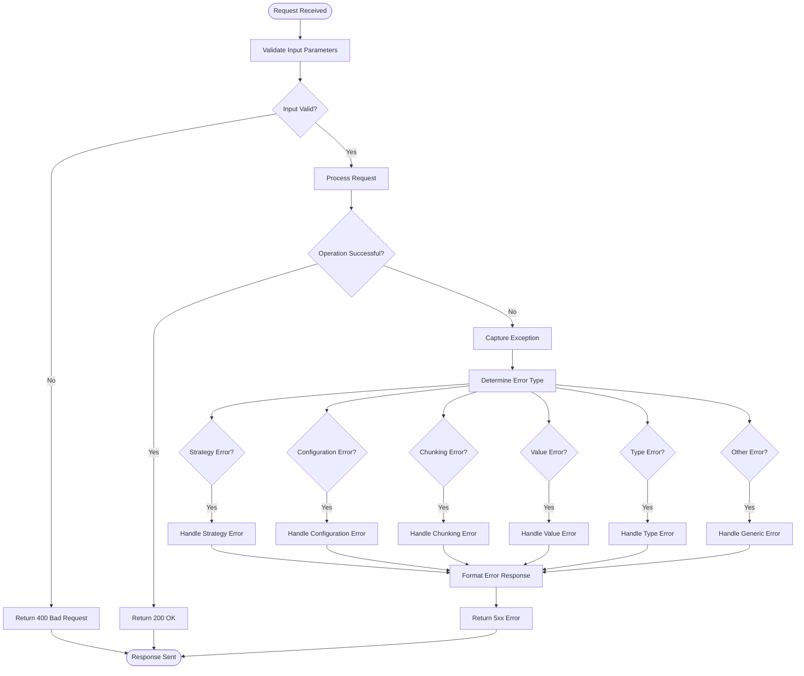

# Error Handling & Status Codes

<cite>
**Referenced Files in This Document**   
- [error_handler.py](file://markdown_chunker/api/error_handler.py)
- [adapter.py](file://markdown_chunker/api/adapter.py)
- [types.py](file://markdown_chunker/api/types.py)
- [validator.py](file://markdown_chunker/api/validator.py)
- [errors.py](file://markdown_chunker/chunker/errors.py)
- [api_documentation.md](file://tests/fixtures/real_documents/api_documentation.md)
</cite>

## Table of Contents
1. [Introduction](#introduction)
2. [HTTP Status Codes](#http-status-codes)
3. [Error Response Format](#error-response-format)
4. [Standard Error Codes](#standard-error-codes)
5. [Error Handling Pipeline](#error-handling-pipeline)
6. [Rate Limiting Implementation](#rate-limiting-implementation)
7. [Common Error Scenarios](#common-error-scenarios)
8. [Client-Side Handling Strategies](#client-side-handling-strategies)
9. [Troubleshooting Guide](#troubleshooting-guide)

## Introduction
This document provides comprehensive documentation for the REST API's error handling system. It covers all aspects of error management, including HTTP status codes, error response formats, standard error codes, the error handling pipeline, rate limiting implementation, and client-side handling strategies. The API follows standard REST principles for error reporting, using appropriate HTTP status codes and providing detailed error information in a consistent JSON format.

## HTTP Status Codes
The API uses standard HTTP status codes to indicate the result of requests. Each status code has specific use cases and indicates different types of errors or success conditions.

### 200 OK
Indicates a successful request where the operation completed as expected. This status is returned for successful GET, PUT, and POST requests that process correctly.

**Use Cases:**
- Successful retrieval of resources
- Successful update of existing resources
- Successful processing of chunking operations
- Successful configuration updates

### 400 Bad Request
Indicates that the server cannot process the request due to client error, typically invalid request parameters or malformed data.

**Use Cases:**
- Invalid JSON in request body
- Missing required parameters
- Invalid parameter values
- Request content that violates validation rules
- Configuration parameters outside acceptable ranges

### 401 Unauthorized
Indicates that the request lacks valid authentication credentials for the requested resource.

**Use Cases:**
- Missing authentication token
- Invalid authentication token
- Expired authentication credentials
- Malformed authorization header

### 403 Forbidden
Indicates that the server understood the request but refuses to authorize it, typically due to insufficient permissions.

**Use Cases:**
- User lacks required permissions for the operation
- Access to specific resources is restricted
- Attempting to modify read-only resources
- Security policy violations

### 404 Not Found
Indicates that the requested resource could not be found.

**Use Cases:**
- Requested endpoint does not exist
- Resource with specified identifier does not exist
- Invalid API version requested
- Missing required components

### 429 Too Many Requests
Indicates that the user has sent too many requests in a given amount of time (rate limiting).

**Use Cases:**
- Exceeding rate limit for API requests
- Too many requests from a single IP address
- Exceeding quota for specific operations
- Abuse prevention mechanisms triggered

### 500 Internal Server Error
Indicates that the server encountered an unexpected condition that prevented it from fulfilling the request.

**Use Cases:**
- Unhandled exceptions in server code
- Database connection failures
- External service failures
- Unexpected system errors
- Critical processing failures

### Other Status Codes
The API may also use additional HTTP status codes as appropriate:

- **204 No Content**: Successful request with no content to return (e.g., successful deletion)
- **409 Conflict**: Request conflicts with current state of the resource (e.g., duplicate creation)
- **413 Payload Too Large**: Request payload exceeds the server's limits
- **422 Unprocessable Entity**: Well-formed request that contains semantic errors
- **503 Service Unavailable**: Server is temporarily unable to handle the request

**Section sources**
- [api_documentation.md](file://tests/fixtures/real_documents/api_documentation.md#L249-L258)

## Error Response Format
The API returns error details in a standardized JSON format that provides comprehensive information about the error condition.

### Standard Error Response Structure
```json
{
  "success": false,
  "errors": ["Error message 1", "Error message 2"],
  "metadata": {
    "error_type": "ErrorTypeName",
    "error_code": "ERROR_CODE",
    "details": {
      "exception_type": "ExceptionType",
      "exception_message": "Detailed error message",
      "context": {
        "operation": "operation_name"
      }
    }
  }
}
```

### Response Fields
- **success**: Boolean indicating whether the operation was successful
- **errors**: Array of human-readable error messages
- **metadata**: Object containing detailed error information
  - **error_type**: The type of error that occurred
  - **error_code**: Standardized error code for programmatic handling
  - **details**: Additional diagnostic information

### Error Response Examples
**Validation Error Example:**
```json
{
  "success": false,
  "errors": ["Content is too large (maximum 10485760 bytes, got 15728640)"],
  "metadata": {
    "error_type": "ValueError",
    "error_code": "INVALID_VALUE",
    "details": {
      "exception_type": "ValueError",
      "exception_message": "Content is too large (maximum 10485760 bytes, got 15728640)",
      "context": {
        "operation": "process_request"
      }
    }
  }
}
```

**Configuration Error Example:**
```json
{
  "success": false,
  "errors": ["Configuration error: Invalid config parameter"],
  "metadata": {
    "error_type": "ConfigurationError",
    "error_code": "INVALID_CONFIGURATION",
    "details": {
      "exception_type": "ConfigurationError",
      "exception_message": "Invalid config parameter",
      "context": {
        "operation": "process_request"
      }
    }
  }
}
```

**Generic Error Example:**
```json
{
  "success": false,
  "errors": ["Unexpected error: Something went wrong"],
  "metadata": {
    "error_type": "RuntimeError",
    "error_code": "INTERNAL_ERROR",
    "details": {
      "exception_type": "RuntimeError",
      "exception_message": "Something went wrong",
      "context": {
        "operation": "process_request"
      }
    }
  }
}
```

**Section sources**
- [types.py](file://markdown_chunker/api/types.py#L48-L65)
- [error_handler.py](file://markdown_chunker/api/error_handler.py#L72-L79)

## Standard Error Codes
The API uses standardized error codes to facilitate programmatic error handling. These codes are consistent across all endpoints and provide a reliable way to identify specific error conditions.

### VALIDATION_ERROR
Indicates that the request data failed validation checks.

**Causes:**
- Invalid data types
- Missing required fields
- Values outside acceptable ranges
- Format violations

**Example Usage:**
```json
{
  "error_code": "VALIDATION_ERROR",
  "message": "Invalid email format"
}
```

### PROCESSING_ERROR
Indicates that an error occurred during request processing.

**Causes:**
- Chunking operations failure
- Content parsing errors
- Data transformation issues
- Internal processing exceptions

**Example Usage:**
```json
{
  "error_code": "PROCESSING_ERROR",
  "message": "Chunking failed: Strategy 'code' failed"
}
```

### RATE_LIMIT_EXCEEDED
Indicates that the client has exceeded the allowed rate of requests.

**Causes:**
- Too many requests in a time period
- Exceeding account-specific limits
- Violating rate limiting policies

**Example Usage:**
```json
{
  "error_code": "RATE_LIMIT_EXCEEDED",
  "message": "Too many requests"
}
```

### INVALID_STRATEGY
Indicates that the requested chunking strategy is invalid or not available.

**Causes:**
- Unknown strategy name
- Strategy not supported for content type
- Disabled strategy in configuration

**Example Usage:**
```json
{
  "error_code": "INVALID_STRATEGY",
  "message": "Strategy 'invalid_strategy' failed: Strategy not found"
}
```

### INVALID_CONFIGURATION
Indicates that the provided configuration is invalid.

**Causes:**
- Invalid configuration parameters
- Conflicting configuration options
- Values outside acceptable ranges
- Malformed configuration structure

**Example Usage:**
```json
{
  "error_code": "INVALID_CONFIGURATION",
  "message": "Configuration error: Invalid config parameter"
}
```

### CHUNKING_FAILED
Indicates that the chunking operation failed.

**Causes:**
- Content that cannot be properly chunked
- Data loss during processing
- Validation failures in generated chunks
- Strategy execution failures

**Example Usage:**
```json
{
  "error_code": "CHUNKING_FAILED",
  "message": "Chunking failed: Strategy 'structural' failed"
}
```

### INVALID_VALUE
Indicates that a provided value is invalid.

**Causes:**
- Values outside acceptable ranges
- Invalid data formats
- Unsupported values for parameters
- Type mismatches

**Example Usage:**
```json
{
  "error_code": "INVALID_VALUE",
  "message": "Invalid value: max_chunk_size must be between 10 and 100000"
}
```

### INVALID_TYPE
Indicates that a provided value has an invalid type.

**Causes:**
- Wrong data type for parameter
- Non-numeric values for numeric parameters
- Non-boolean values for boolean parameters
- Type mismatches in configuration

**Example Usage:**
```json
{
  "error_code": "INVALID_TYPE",
  "message": "Type error: max_chunk_size must be integer, got str"
}
```

### INTERNAL_ERROR
Indicates an unexpected internal server error.

**Causes:**
- Unhandled exceptions
- System failures
- External service failures
- Critical processing errors

**Example Usage:**
```json
{
  "error_code": "INTERNAL_ERROR",
  "message": "Unexpected error: Something went wrong"
}
```

**Section sources**
- [error_handler.py](file://markdown_chunker/api/error_handler.py#L76-L157)
- [types.py](file://markdown_chunker/api/types.py#L120-L124)

## Error Handling Pipeline
The API implements a comprehensive error handling pipeline that captures exceptions, processes them through a centralized handler, and generates standardized responses.

### Pipeline Architecture


**Diagram sources**
- [error_handler.py](file://markdown_chunker/api/error_handler.py#L35-L63)
- [adapter.py](file://markdown_chunker/api/adapter.py#L48-L93)

### Exception Capture
The error handling pipeline begins with exception capture at multiple levels:

1. **Input Validation**: The APIValidator captures validation errors before processing begins
2. **Request Processing**: The APIAdapter wraps processing operations in try-catch blocks
3. **Chunking Operations**: The MarkdownChunker raises specific exception types for different error conditions
4. **Strategy Execution**: Individual strategies raise StrategyError exceptions when they fail

### Error Type Determination
The APIErrorHandler determines the appropriate error type by checking the exception type:

```python
def handle_exception(self, exception: Exception, context: Optional[Dict[str, Any]] = None) -> APIResponse:
    if isinstance(exception, StrategySelectionError):
        return self._handle_strategy_error(exception, context)
    elif isinstance(exception, ConfigurationError):
        return self._handle_configuration_error(exception, context)
    elif isinstance(exception, ChunkingError):
        return self._handle_chunking_error(exception, context)
    elif isinstance(exception, ValueError):
        return self._handle_value_error(exception, context)
    elif isinstance(exception, TypeError):
        return self._handle_type_error(exception, context)
    else:
        return self._handle_generic_error(exception, context)
```

### Response Generation
Once the error type is determined, the appropriate handler method generates a standardized response with the correct error code, message, and metadata.

### Error Context
The pipeline preserves context information throughout the error handling process, including:
- The original operation being performed
- Request-specific metadata
- Exception details and stack traces (when enabled)
- Validation context and field information

**Section sources**
- [error_handler.py](file://markdown_chunker/api/error_handler.py#L35-L159)
- [adapter.py](file://markdown_chunker/api/adapter.py#L48-L93)

## Rate Limiting Implementation
The API implements rate limiting to prevent abuse and ensure fair usage of resources.

### Rate Limit Headers
The API includes rate limiting information in response headers:

- **X-RateLimit-Limit**: The maximum number of requests allowed in the time period
- **X-RateLimit-Remaining**: The number of requests remaining in the current time period
- **X-RateLimit-Reset**: The time at which the rate limit will reset (Unix timestamp)

**Example Headers:**
```
X-RateLimit-Limit: 1000
X-RateLimit-Remaining: 950
X-RateLimit-Reset: 1700150400
```

### Rate Limit Configuration
The rate limiting system supports different tiers with varying limits:

- **Free tier**: 100 requests per hour
- **Pro tier**: 1000 requests per hour
- **Enterprise**: 10000 requests per hour

### Rate Limit Exceeded Response
When a client exceeds the rate limit, the API returns a 429 status code with detailed error information:

```json
{
    "error": "rate_limit_exceeded",
    "message": "Too many requests",
    "retry_after": 3600
}
```

The `retry_after` field indicates the number of seconds the client should wait before making another request.

### Implementation Details
The rate limiting system tracks requests by:
- Client IP address
- Authentication token (when provided)
- Request endpoint
- Time window (typically one hour)

The system uses a sliding window algorithm to provide accurate rate limiting that prevents burst attacks while allowing legitimate usage patterns.

**Section sources**
- [api_documentation.md](file://tests/fixtures/real_documents/api_documentation.md#L261-L267)
- [test_full_pipeline.py](file://tests/integration/test_full_pipeline.py#L74-L87)

## Common Error Scenarios
This section documents common error scenarios and their causes, providing guidance for troubleshooting and resolution.

### Empty or Whitespace-Only Content
**Error Code:** INVALID_VALUE
**HTTP Status:** 400
**Cause:** The request content is empty or contains only whitespace characters.

**Solution:**
- Ensure the content field contains meaningful text
- Remove leading/trailing whitespace if appropriate
- Validate content before sending the request

### Content Size Exceeds Limits
**Error Code:** INVALID_VALUE
**HTTP Status:** 400
**Cause:** The content size exceeds the maximum allowed size of 10MB.

**Solution:**
- Split large documents into smaller chunks before processing
- Compress content if possible
- Use streaming for very large documents

### Invalid Chunk Size Configuration
**Error Code:** INVALID_CONFIGURATION
**HTTP Status:** 400
**Cause:** Configuration parameters for chunk sizes are invalid:
- max_chunk_size outside 10-100000 range
- min_chunk_size less than 10
- min_chunk_size greater than max_chunk_size

**Solution:**
- Ensure max_chunk_size is between 10 and 100000
- Ensure min_chunk_size is at least 10
- Ensure min_chunk_size is not greater than max_chunk_size

### Invalid Strategy Name
**Error Code:** INVALID_STRATEGY
**HTTP Status:** 400
**Cause:** The requested strategy name is not in the list of valid strategies.

**Valid Strategies:**
- auto
- code
- mixed
- list
- table
- structural
- sentences

**Solution:**
- Use one of the valid strategy names
- Use "auto" for automatic strategy selection
- Check for typos in the strategy name

### Invalid Configuration Type
**Error Code:** INVALID_TYPE
**HTTP Status:** 400
**Cause:** Configuration parameters have incorrect data types:
- max_chunk_size must be an integer
- enable_overlap must be a boolean
- overlap_size must be an integer

**Solution:**
- Ensure numeric parameters are numbers, not strings
- Ensure boolean parameters are true/false, not strings
- Validate configuration structure before sending

### No Strategy Can Handle Content
**Error Code:** CHUNKING_FAILED
**HTTP Status:** 500
**Cause:** No available strategy can process the provided content type.

**Solution:**
- Try with different content
- Use "auto" strategy for automatic selection
- Check content format and encoding

### Internal Server Error
**Error Code:** INTERNAL_ERROR
**HTTP Status:** 500
**Cause:** Unexpected error during processing.

**Solution:**
- Retry the request after a short delay
- Check if the issue persists with different content
- Contact support if the problem continues

**Section sources**
- [validator.py](file://markdown_chunker/api/validator.py#L75-L128)
- [error_handler.py](file://markdown_chunker/api/error_handler.py#L52-L63)

## Client-Side Handling Strategies
This section provides recommendations for client-side error handling to create robust applications.

### Error Response Parsing
Clients should parse error responses to extract both human-readable messages and machine-readable error codes:

```python
def handle_api_response(response):
    if response.status_code == 200:
        return process_success(response.json())
    else:
        error_data = response.json()
        error_code = error_data['metadata']['error_code']
        error_messages = error_data['errors']
        
        # Handle based on error code
        if error_code == 'RATE_LIMIT_EXCEEDED':
            handle_rate_limit_error(error_data)
        elif error_code == 'VALIDATION_ERROR':
            handle_validation_error(error_data)
        elif error_code == 'INTERNAL_ERROR':
            handle_internal_error(error_data)
        else:
            handle_generic_error(error_data)
```

### Retry Logic
Implement intelligent retry logic for transient errors:

```python
import time
import random

def make_api_request_with_retry(url, data, max_retries=3):
    for attempt in range(max_retries):
        try:
            response = requests.post(url, json=data)
            
            if response.status_code == 200:
                return response.json()
            elif response.status_code == 429:
                # Rate limit exceeded - use retry-after header
                retry_after = response.headers.get('Retry-After', 60)
                time.sleep(int(retry_after))
            elif response.status_code >= 500:
                # Server error - exponential backoff
                time.sleep(2 ** attempt + random.uniform(0, 1))
            else:
                # Client error - don't retry
                return response.json()
                
        except requests.RequestException:
            if attempt == max_retries - 1:
                raise
            # Exponential backoff for network errors
            time.sleep(2 ** attempt + random.uniform(0, 1))
    
    return None
```

### Rate Limit Handling
Handle rate limiting gracefully by respecting rate limit headers:

```python
def handle_rate_limit(response):
    limit = int(response.headers.get('X-RateLimit-Limit', 1000))
    remaining = int(response.headers.get('X-RateLimit-Remaining', 0))
    reset_time = int(response.headers.get('X-RateLimit-Reset', 0))
    
    # Calculate time until reset
    current_time = int(time.time())
    wait_time = max(0, reset_time - current_time)
    
    if remaining == 0:
        # Wait until rate limit resets
        time.sleep(wait_time)
        return True  # Retry after wait
    elif remaining < limit * 0.1:
        # Rate limit is nearly exhausted
        # Consider slowing down requests
        pass
        
    return False  # No need to wait
```

### Validation Error Handling
Display validation errors to users in a helpful way:

```python
def display_validation_errors(error_data):
    for error_message in error_data['errors']:
        # Extract field information if available
        details = error_data['metadata']['details']
        field = details.get('context', {}).get('field')
        
        if field:
            print(f"Error in {field}: {error_message}")
        else:
            print(f"Validation error: {error_message}")
```

### Fallback Strategies
Implement fallback strategies for critical operations:

```python
def process_with_fallback(content, strategy=None):
    # Primary attempt
    result = attempt_processing(content, strategy)
    
    if result.success:
        return result
        
    # Fallback to auto strategy
    if strategy and strategy != 'auto':
        result = attempt_processing(content, 'auto')
        if result.success:
            return result
            
    # Fallback to simplified processing
    if not result.success:
        return fallback_processing(content)
        
    return result
```

### Error Logging
Log errors for debugging and monitoring:

```python
import logging

def log_api_error(response, request_data):
    error_data = response.json()
    error_code = error_data['metadata']['error_code']
    status_code = response.status_code
    
    logging.error(
        f"API request failed: "
        f"status={status_code}, "
        f"error_code={error_code}, "
        f"errors={error_data['errors']}"
    )
    
    # Include request details for debugging (without sensitive data)
    logging.debug(f"Request content length: {len(request_data.get('content', ''))}")
```

**Section sources**
- [test_full_pipeline.py](file://tests/integration/test_full_pipeline.py#L145-L152)
- [api_documentation.md](file://tests/fixtures/real_documents/api_documentation.md#L230-L258)

## Troubleshooting Guide
This section provides guidance for troubleshooting common issues with the API.

### Request Validation Failures
**Symptoms:**
- 400 Bad Request responses
- VALIDATION_ERROR error codes
- Specific field validation messages

**Troubleshooting Steps:**
1. Check that all required fields are present
2. Verify data types match expected types
3. Ensure values are within acceptable ranges
4. Validate JSON structure is correct
5. Check for typos in field names

**Common Fixes:**
- Convert string numbers to actual numbers
- Ensure booleans are true/false, not "true"/"false"
- Verify content is not empty or whitespace-only
- Check that strategy names are valid

### Configuration Issues
**Symptoms:**
- INVALID_CONFIGURATION error codes
- 400 Bad Request responses
- Messages about invalid parameters

**Troubleshooting Steps:**
1. Review configuration parameter names
2. Verify parameter values are within acceptable ranges
3. Check for conflicting configuration options
4. Validate the entire configuration structure

**Common Fixes:**
- Ensure max_chunk_size is between 10 and 100000
- Ensure min_chunk_size is at least 10
- Make sure min_chunk_size is not greater than max_chunk_size
- Verify overlap_size is non-negative

### Rate Limit Problems
**Symptoms:**
- 429 Too Many Requests responses
- RATE_LIMIT_EXCEEDED error codes
- Requests being rejected after successful initial calls

**Troubleshooting Steps:**
1. Check X-RateLimit-Remaining header to monitor usage
2. Implement proper retry logic with exponential backoff
3. Cache responses when possible to reduce requests
4. Batch multiple operations when supported

**Common Fixes:**
- Add delays between requests
- Implement exponential backoff for retries
- Use the retry_after value from error responses
- Consider upgrading to a higher tier if limits are consistently reached

### Chunking Failures
**Symptoms:**
- CHUNKING_FAILED error codes
- 500 Internal Server Error responses
- Messages about strategy failures

**Troubleshooting Steps:**
1. Try with different content to isolate the issue
2. Use the "auto" strategy instead of a specific strategy
3. Simplify the content structure
4. Check for unusual formatting or encoding issues

**Common Fixes:**
- Remove complex nested structures
- Ensure proper Markdown formatting
- Try with smaller content samples
- Use default configuration initially

### Performance Issues
**Symptoms:**
- Slow response times
- Timeout errors
- High resource usage

**Troubleshooting Steps:**
1. Monitor processing time in response metadata
2. Check for large content sizes
3. Review configuration for performance impact
4. Test with smaller content samples

**Common Fixes:**
- Split large documents into smaller chunks
- Adjust chunk size configuration
- Disable overlap for better performance
- Use simpler strategies for straightforward content

### Debugging Tips
1. **Enable detailed error messages** during development to get more information
2. **Log request and response data** (without sensitive information) for analysis
3. **Test with small, simple examples** first, then scale up
4. **Use the validation endpoint** to check requests before processing
5. **Monitor rate limit headers** to avoid exceeding limits
6. **Implement comprehensive error handling** to catch and respond to all error types

**Section sources**
- [validator.py](file://markdown_chunker/api/validator.py#L75-L128)
- [error_handler.py](file://markdown_chunker/api/error_handler.py#L52-L63)
- [api_documentation.md](file://tests/fixtures/real_documents/api_documentation.md#L230-L258)