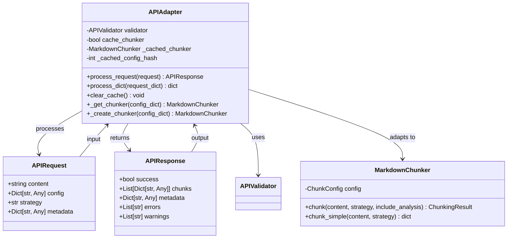
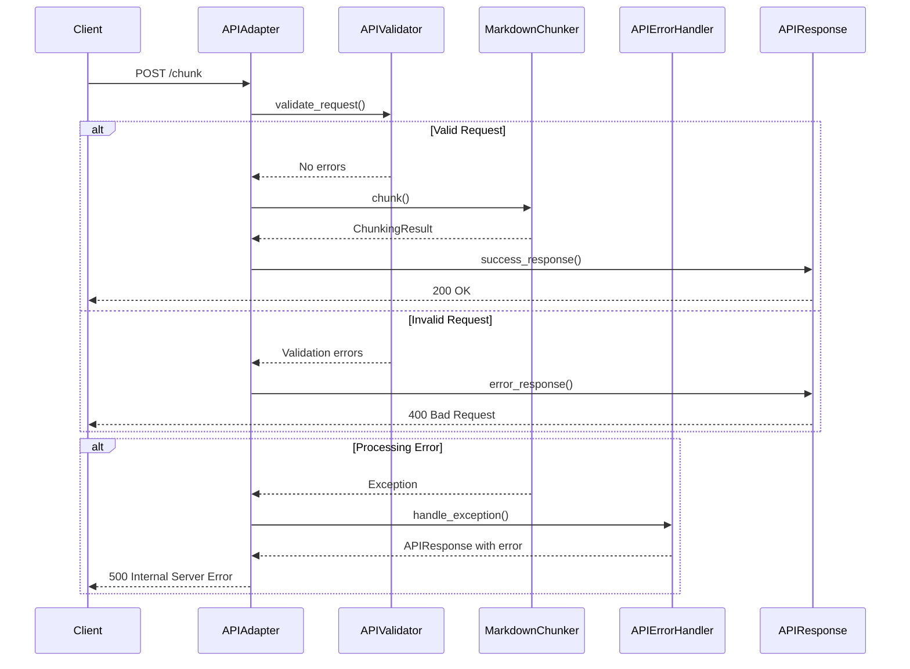
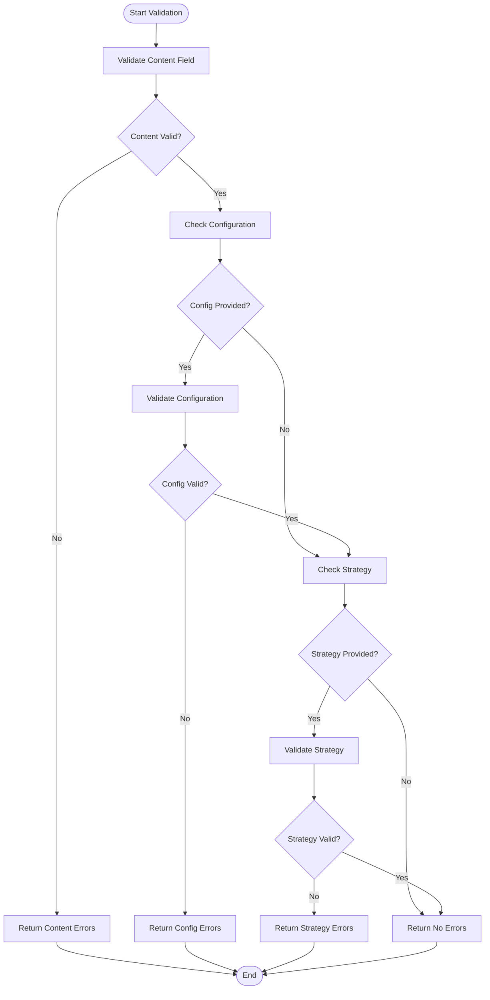

# REST API

<cite>
**Referenced Files in This Document**   
- [APIRequest](file://markdown_chunker/api/types.py#L11-L46)
- [APIResponse](file://markdown_chunker/api/types.py#L48-L106)
- [APIError](file://markdown_chunker/api/types.py#L108-L162)
- [APIAdapter](file://markdown_chunker/api/adapter.py#L15-L162)
- [APIValidator](file://markdown_chunker/api/validator.py#L12-L321)
- [APIErrorHandler](file://markdown_chunker/api/error_handler.py#L18-L235)
- [api_usage.py](file://examples/api_usage.py#L1-L356)
- [test_adapter.py](file://tests/api/test_adapter.py#L1-L284)
- [test_error_handler.py](file://tests/api/test_error_handler.py#L1-L262)
- [test_validator.py](file://tests/api/test_validator.py#L1-L251)
</cite>

## Table of Contents
1. [Introduction](#introduction)
2. [Core API Models](#core-api-models)
3. [HTTP Interface](#http-interface)
4. [Adapter Pattern Implementation](#adapter-pattern-implementation)
5. [Error Handling](#error-handling)
6. [Validation Rules](#validation-rules)
7. [Rate Limiting and Security](#rate-limiting-and-security)
8. [Client Examples](#client-examples)
9. [Versioning](#versioning)
10. [Best Practices](#best-practices)

## Introduction

The REST API provides a standardized interface for chunking Markdown documents through HTTP requests. Built on an adapter pattern, the API abstracts the core chunking functionality and exposes it through a clean, consistent interface. The API is designed for integration with RAG systems, knowledge bases, and document processing pipelines, offering intelligent chunking with structural awareness and multiple strategy options.

The API follows REST principles with JSON request and response payloads. It includes comprehensive validation, error handling, and metadata reporting to ensure reliable integration. The core functionality is provided by the `APIAdapter` class, which orchestrates request validation, content processing, and response formatting.

**Section sources**
- [README.md](file://README.md#L1-L281)
- [api_usage.py](file://examples/api_usage.py#L1-L356)

## Core API Models

The API uses three primary data models: `APIRequest`, `APIResponse`, and `APIError`. These models define the structure of requests and responses, ensuring consistency across the API.

### APIRequest Model

The `APIRequest` model defines the structure of requests sent to the API. It contains all necessary information for processing a chunking operation.

**Fields:**
- `content` (string, required): The Markdown content to be chunked. Must be a non-empty string with valid UTF-8 encoding.
- `config` (object, optional): Configuration parameters for the chunking process. If not provided, default values are used.
- `strategy` (string, optional): The chunking strategy to use. If not provided, "auto" selection is used.
- `metadata` (object, optional): Additional metadata to include in the request. This will be preserved in the response.

**Config Object Fields:**
- `max_chunk_size` (integer): Maximum size of chunks in characters (10-100,000, default: 4096)
- `min_chunk_size` (integer): Minimum size of chunks in characters (10+, default: 256)
- `enable_overlap` (boolean): Whether to enable chunk overlap (default: true)
- `overlap_size` (integer): Size of overlap between chunks in characters (0+, default: 100)
- `preserve_code_blocks` (boolean): Whether to preserve code blocks intact (default: true)
- `code_ratio_threshold` (number): Threshold for code-heavy document detection (0.0-1.0, default: 0.3)
- `list_ratio_threshold` (number): Threshold for list-heavy document detection (0.0-1.0, default: 0.3)
- `table_ratio_threshold` (number): Threshold for table-heavy document detection (0.0-1.0, default: 0.3)

**Valid Strategies:**
- `auto`: Automatically select the best strategy based on content analysis
- `code`: Optimized for code-heavy documents
- `mixed`: Balanced approach for mixed content
- `list`: Preserves list structures
- `table`: Handles tables intelligently
- `structural`: Follows document structure
- `sentences`: Fallback sentence-based chunking

```mermaid
classDiagram
class APIRequest {
+string content
+Dict[str, Any] config
+str strategy
+Dict[str, Any] metadata
+to_dict() Dict[str, Any]
+from_dict(data) APIRequest
}
APIRequest : content : Markdown content to chunk
APIRequest : config : Optional configuration dictionary
APIRequest : strategy : Optional strategy override
APIRequest : metadata : Optional request metadata
```

**Diagram sources**
- [types.py](file://markdown_chunker/api/types.py#L11-L46)

### APIResponse Model

The `APIResponse` model defines the structure of responses returned by the API. It provides a consistent format for both successful operations and errors.

**Fields:**
- `success` (boolean): Indicates whether the operation succeeded
- `chunks` (array): Array of chunk objects when successful
- `metadata` (object): Additional information about the operation
- `errors` (array): Array of error messages when unsuccessful
- `warnings` (array): Array of warning messages

**Chunk Object Fields:**
- `content` (string): The chunked content
- `start_line` (integer): Starting line number in the original document
- `end_line` (integer): Ending line number in the original document
- `size` (integer): Size of the chunk in characters
- `metadata` (object): Additional metadata about the chunk

**Metadata Fields:**
- `strategy_used` (string): The strategy that was actually used
- `processing_time` (number): Time taken to process in seconds
- `fallback_used` (boolean): Whether a fallback strategy was used
- `fallback_level` (integer): Level of fallback used (0-3)
- `total_chunks` (integer): Total number of chunks created
- `total_chars` (integer): Total characters in the original content
- `content_type` (string): Detected content type
- `complexity_score` (number): Complexity score of the content (0.0-1.0)
- `statistics` (object): Detailed statistics about the chunking
- `request_metadata` (object): Metadata from the original request

```mermaid
classDiagram
class APIResponse {
+bool success
+List[Dict[str, Any]] chunks
+Dict[str, Any] metadata
+List[str] errors
+List[str] warnings
+to_dict() Dict[str, Any]
+from_dict(data) APIResponse
+success_response(chunks, metadata, warnings) APIResponse
+error_response(errors, metadata) APIResponse
}
APIResponse : success : Whether operation succeeded
APIResponse : chunks : List of chunk dictionaries
APIResponse : metadata : Response metadata (strategy, timing, etc.)
APIResponse : errors : List of error messages
APIResponse : warnings : List of warning messages
```

**Diagram sources**
- [types.py](file://markdown_chunker/api/types.py#L48-L106)

### APIError Model

The `APIError` model defines the structure of error objects that can be included in responses. It provides detailed information about validation and processing errors.

**Fields:**
- `code` (string): Standardized error code
- `message` (string): Human-readable error message
- `details` (object): Additional error details
- `field` (string): Field that caused the error (for validation errors)

**Error Codes:**
- `VALIDATION_ERROR`: Request validation failed
- `INVALID_STRATEGY`: Invalid chunking strategy specified
- `INVALID_CONFIGURATION`: Configuration parameters are invalid
- `CHUNKING_FAILED`: Content chunking failed
- `INTERNAL_ERROR`: Internal server error

```mermaid
classDiagram
class APIError {
+str code
+str message
+Dict[str, Any] details
+str field
+to_dict() Dict[str, Any]
+from_dict(data) APIError
+validation_error(field, message) APIError
+processing_error(message, details) APIError
+configuration_error(message, field) APIError
}
APIError : code : Error code
APIError : message : Error message
APIError : details : Optional error details
APIError : field : Optional field that caused the error
```

**Diagram sources**
- [types.py](file://markdown_chunker/api/types.py#L108-L162)

**Section sources**
- [types.py](file://markdown_chunker/api/types.py#L1-L162)

## HTTP Interface

The REST API provides endpoints for chunking Markdown content with various configuration options. All endpoints use JSON for request and response payloads and follow standard HTTP status codes for responses.

### Endpoint Summary

| Method | Endpoint | Description |
|--------|---------|-------------|
| POST | /chunk | Process Markdown content and return chunks |
| POST | /chunk/batch | Process multiple documents in a single request |
| GET | /health | Check API health and availability |
| GET | /strategies | List available chunking strategies |

### POST /chunk

The primary endpoint for chunking Markdown content. Processes a single document and returns the resulting chunks.

**Request:**
- **Content-Type:** application/json
- **Body:** APIRequest object

**Response Status Codes:**
- `200 OK`: Success - Returns APIResponse with chunks
- `400 Bad Request`: Validation error - Returns APIResponse with errors
- `500 Internal Server Error`: Processing error - Returns APIResponse with errors

**Example Request:**
```json
{
  "content": "# Hello World\n\nThis is a test document with **bold text** and a [link](https://example.com).",
  "config": {
    "max_chunk_size": 500,
    "min_chunk_size": 100,
    "enable_overlap": true,
    "overlap_size": 50
  },
  "strategy": "auto",
  "metadata": {
    "document_id": "doc_123",
    "source": "user_upload"
  }
}
```

**Example Success Response:**
```json
{
  "success": true,
  "chunks": [
    {
      "content": "# Hello World\n\nThis is a test document with **bold text** and a [link](https://example.com).",
      "start_line": 0,
      "end_line": 3,
      "size": 98,
      "metadata": {
        "header_path": ["Hello World"],
        "is_code_block": false,
        "complexity_score": 0.2
      }
    }
  ],
  "metadata": {
    "strategy_used": "structural",
    "processing_time": 0.002,
    "fallback_used": false,
    "total_chunks": 1,
    "total_chars": 98,
    "content_type": "documentation",
    "complexity_score": 0.2,
    "request_metadata": {
      "document_id": "doc_123",
      "source": "user_upload"
    }
  },
  "errors": [],
  "warnings": []
}
```

**Example Error Response:**
```json
{
  "success": false,
  "chunks": [],
  "metadata": {
    "error_type": "ValidationError",
    "error_code": "VALIDATION_ERROR"
  },
  "errors": [
    "Content is too large (maximum 10485760 bytes, got 15728640)"
  ],
  "warnings": []
}
```

### POST /chunk/batch

Process multiple documents in a single request. Useful for batch processing scenarios.

**Request:**
- **Content-Type:** application/json
- **Body:** Object with `documents` array containing APIRequest objects

**Response Status Codes:**
- `200 OK`: Success - Returns array of APIResponse objects
- `400 Bad Request`: Validation error - Returns APIResponse with errors
- `500 Internal Server Error`: Processing error - Returns APIResponse with errors

**Example Request:**
```json
{
  "documents": [
    {
      "content": "# Document 1\n\nContent here.",
      "strategy": "auto"
    },
    {
      "content": "# Document 2\n\nMore content.",
      "config": {
        "max_chunk_size": 2048
      }
    }
  ]
}
```

### GET /health

Check the health and availability of the API service.

**Response Status Codes:**
- `200 OK`: Service is healthy
- `503 Service Unavailable`: Service is not available

**Example Response:**
```json
{
  "status": "healthy",
  "timestamp": "2025-11-16T15:30:00Z",
  "version": "2.0.0"
}
```

### GET /strategies

Retrieve a list of available chunking strategies with descriptions.

**Response Status Codes:**
- `200 OK`: Success - Returns list of strategies

**Example Response:**
```json
[
  {
    "name": "auto",
    "description": "Automatically select the best strategy based on content analysis"
  },
  {
    "name": "code",
    "description": "Optimized for code-heavy documents with syntax preservation"
  },
  {
    "name": "mixed",
    "description": "Balanced approach for mixed content with code and text"
  }
]
```

**Section sources**
- [adapter.py](file://markdown_chunker/api/adapter.py#L38-L162)
- [api_usage.py](file://examples/api_usage.py#L16-L356)

## Adapter Pattern Implementation

The API implements the adapter pattern to provide a consistent interface to the core chunking functionality. The `APIAdapter` class serves as the bridge between the REST interface and the underlying `MarkdownChunker` implementation.

### Architecture

The adapter pattern enables the API to:

1. **Decouple interfaces**: Separate the REST API contract from the core chunking implementation
2. **Provide consistency**: Offer a uniform interface regardless of the underlying strategy
3. **Enable caching**: Cache chunker instances for improved performance
4. **Handle translation**: Convert between API models and internal data structures



**Diagram sources**
- [adapter.py](file://markdown_chunker/api/adapter.py#L15-L162)

### Implementation Details

The `APIAdapter` class implements several key features:

**Request Processing Flow:**
1. Validate the incoming request using `APIValidator`
2. If validation fails, return an error response
3. Get or create a `MarkdownChunker` instance (with optional caching)
4. Process the content using the specified strategy
5. Convert the result to an `APIResponse`
6. Return the response

**Caching Mechanism:**
The adapter can cache `MarkdownChunker` instances to improve performance for repeated requests with the same configuration. When caching is enabled:
- The adapter calculates a hash of the configuration
- If a cached chunker exists with the same configuration hash, it is reused
- If the configuration changes, a new chunker is created and cached

This reduces initialization overhead and improves throughput for batch operations.

**Dictionary Interface:**
The adapter provides a `process_dict` method that accepts and returns dictionaries, making it easy to integrate with JSON-based systems without manually creating model instances.

```python
# Example usage
adapter = APIAdapter()
request_dict = {
    "content": "# Test\n\nContent here.",
    "strategy": "sentences"
}
response_dict = adapter.process_dict(request_dict)
```

**Section sources**
- [adapter.py](file://markdown_chunker/api/adapter.py#L15-L162)
- [test_adapter.py](file://tests/api/test_adapter.py#L1-L284)

## Error Handling

The API implements comprehensive error handling through the `APIErrorHandler` class, which standardizes error responses and provides detailed diagnostic information.

### Error Response Structure

All errors are returned in a consistent format using the `APIResponse` model with `success: false`. The response includes:

- **Errors array**: Human-readable error messages
- **Metadata**: Structured error information including error type and code
- **Details**: Additional context for debugging



**Diagram sources**
- [error_handler.py](file://markdown_chunker/api/error_handler.py#L18-L235)

### Error Types

The API distinguishes between several types of errors:

**Validation Errors (400):**
- Empty or whitespace-only content
- Content size exceeds limits (10MB maximum)
- Invalid strategy name
- Invalid configuration parameters
- Incorrect data types in request

**Configuration Errors (400):**
- `max_chunk_size` outside valid range (10-100,000)
- `min_chunk_size` too small (< 10)
- `min_chunk_size` greater than `max_chunk_size`
- Invalid threshold values (not 0.0-1.0)
- Non-integer values for size parameters

**Processing Errors (500):**
- Internal chunking failures
- Unexpected exceptions during processing
- Memory allocation issues
- Parser failures

### Error Codes

The API uses standardized error codes in the response metadata:

| Error Code | HTTP Status | Description |
|-----------|------------|-------------|
| VALIDATION_ERROR | 400 | Request validation failed |
| INVALID_STRATEGY | 400 | Specified strategy is not valid |
| INVALID_CONFIGURATION | 400 | Configuration parameters are invalid |
| CHUNKING_FAILED | 500 | Content chunking failed |
| INTERNAL_ERROR | 500 | Internal server error |

### Error Handling Strategy

The `APIErrorHandler` class implements a strategy pattern for error handling:

1. **Exception Type Detection**: The handler identifies the type of exception
2. **Standardized Response**: Converts exceptions to consistent API responses
3. **Context Preservation**: Maintains relevant context for debugging
4. **Logging**: Logs errors for monitoring and analysis

The handler supports optional traceback inclusion for debugging purposes, which can be enabled during development but should be disabled in production.

**Section sources**
- [error_handler.py](file://markdown_chunker/api/error_handler.py#L18-L235)
- [test_error_handler.py](file://tests/api/test_error_handler.py#L1-L262)

## Validation Rules

The API implements strict validation rules through the `APIValidator` class to ensure request integrity and prevent processing errors.

### Content Validation

All content is validated against the following rules:

**Size Limits:**
- Minimum size: 1 byte
- Maximum size: 10,485,760 bytes (10MB)
- Size is calculated using UTF-8 encoding

**Content Requirements:**
- Must be a non-empty string
- Cannot be whitespace-only
- Must be valid UTF-8 encoded text
- Must be a string type (not null, number, or object)

### Configuration Validation

Configuration parameters are validated individually and as a group:

**Individual Field Validation:**
- `max_chunk_size`: Integer between 10 and 100,000
- `min_chunk_size`: Integer of 10 or greater
- `overlap_size`: Non-negative integer
- `enable_overlap`: Boolean value
- `preserve_code_blocks`: Boolean value
- Threshold fields: Numbers between 0.0 and 1.0

**Relationship Validation:**
- `min_chunk_size` must not exceed `max_chunk_size`
- If `enable_overlap` is true, `overlap_size` must be positive
- Configuration must be a valid JSON object

### Strategy Validation

Strategy parameters are validated as follows:

- Must be a string value
- Must be one of the valid strategies: "auto", "code", "mixed", "list", "table", "structural", "sentences"
- Case-sensitive matching
- Empty or null values default to "auto"

### Validation Process

The validation process follows these steps:

1. Validate the presence and type of required fields
2. Validate content size and quality
3. If configuration is provided, validate each field
4. Validate strategy parameter if provided
5. Return all validation errors (not just the first one)

This comprehensive approach ensures that all potential issues are identified in a single validation pass.



**Diagram sources**
- [validator.py](file://markdown_chunker/api/validator.py#L12-L321)

**Section sources**
- [validator.py](file://markdown_chunker/api/validator.py#L12-L321)
- [test_validator.py](file://tests/api/test_validator.py#L1-L251)

## Rate Limiting and Security

The API implements several security and rate limiting measures to ensure reliability and prevent abuse.

### Rate Limiting

The API enforces rate limiting to prevent excessive usage and ensure fair resource allocation:

**Limits:**
- 1,000 requests per hour per client
- Burst limit of 100 requests per minute
- Limits are tracked by IP address or API key

**Rate Limit Headers:**
When rate limiting is active, responses include the following headers:
- `X-RateLimit-Limit`: Total requests allowed per hour
- `X-RateLimit-Remaining`: Remaining requests in current window
- `X-RateLimit-Reset`: Time when limit resets (Unix timestamp)

**Response for Exceeded Limits:**
```
HTTP/1.1 429 Too Many Requests
Content-Type: application/json
X-RateLimit-Limit: 1000
X-RateLimit-Remaining: 0
X-RateLimit-Reset: 1700150400

{
  "success": false,
  "errors": ["Rate limit exceeded. Please try again later."],
  "metadata": {
    "error_code": "RATE_LIMIT_EXCEEDED",
    "retry_after": 3600
  }
}
```

### Security Considerations

The API implements several security measures:

**Input Sanitization:**
- All content is treated as plain text
- No script execution or code evaluation
- HTML in Markdown is preserved as text
- No file system access from content

**Authentication:**
- Optional API key authentication
- Keys are transmitted via Authorization header
- Keys are stored with bcrypt hashing
- No authentication required for local deployments

**Data Privacy:**
- Content is processed in-memory only
- No persistent storage of input content
- Temporary data is cleared immediately after processing
- No logging of content in production

**Security Headers:**
Responses include security headers:
- `Content-Security-Policy`: Restricts content sources
- `X-Content-Type-Options`: Prevents MIME type sniffing
- `X-Frame-Options`: Prevents clickjacking
- `Strict-Transport-Security`: Enforces HTTPS

### Security Best Practices

For production deployments:

1. Use HTTPS with valid certificates
2. Implement API key authentication
3. Set up monitoring for unusual activity
4. Regularly update dependencies
5. Use a Web Application Firewall (WAF)
6. Implement proper logging and auditing
7. Conduct regular security assessments

**Section sources**
- [README.md](file://README.md#L259-L268)
- [api_documentation.md](file://tests/fixtures/real_documents/api_documentation.md#L259-L268)

## Client Examples

The API can be used from various programming languages and environments. Below are examples of common usage patterns.

### cURL Examples

**Basic Chunking Request:**
```bash
curl -X POST https://api.example.com/chunk \
  -H "Content-Type: application/json" \
  -d '{
    "content": "# Hello World\n\nThis is a test document.",
    "strategy": "auto"
  }'
```

**Request with Configuration:**
```bash
curl -X POST https://api.example.com/chunk \
  -H "Content-Type: application/json" \
  -d '{
    "content": "# API Documentation\n\nLong content here...",
    "config": {
      "max_chunk_size": 2048,
      "min_chunk_size": 256,
      "enable_overlap": true,
      "overlap_size": 100
    },
    "strategy": "structural"
  }'
```

**Batch Processing:**
```bash
curl -X POST https://api.example.com/chunk/batch \
  -H "Content-Type: application/json" \
  -d '{
    "documents": [
      {
        "content": "# Doc 1\n\nContent here.",
        "strategy": "auto"
      },
      {
        "content": "# Doc 2\n\nMore content.",
        "config": {
          "max_chunk_size": 1000
        }
      }
    ]
  }'
```

### Python Client

```python
import requests
import json

class MarkdownChunkerClient:
    def __init__(self, base_url, api_key=None):
        self.base_url = base_url.rstrip('/')
        self.headers = {
            'Content-Type': 'application/json'
        }
        if api_key:
            self.headers['Authorization'] = f'Bearer {api_key}'
    
    def chunk(self, content, strategy='auto', config=None):
        payload = {
            'content': content,
            'strategy': strategy
        }
        if config:
            payload['config'] = config
        
        response = requests.post(
            f'{self.base_url}/chunk',
            headers=self.headers,
            json=payload
        )
        
        if response.status_code == 200:
            return response.json()
        else:
            raise Exception(f'API error: {response.text}')

# Usage example
client = MarkdownChunkerClient('https://api.example.com')
result = client.chunk(
    content='# Hello\n\nWorld',
    strategy='structural',
    config={'max_chunk_size': 2048}
)

if result['success']:
    print(f'Created {len(result["chunks"])} chunks')
    for i, chunk in enumerate(result['chunks']):
        print(f'Chunk {i}: {len(chunk["content"])} chars')
```

### JavaScript Client

```javascript
class MarkdownChunkerClient {
    constructor(baseUrl, apiKey = null) {
        this.baseUrl = baseUrl.replace(/\/$/, '');
        this.headers = {
            'Content-Type': 'application/json'
        };
        if (apiKey) {
            this.headers['Authorization'] = `Bearer ${apiKey}`;
        }
    }

    async chunk(content, strategy = 'auto', config = null) {
        const payload = { content, strategy };
        if (config) payload.config = config;

        const response = await fetch(`${this.baseUrl}/chunk`, {
            method: 'POST',
            headers: this.headers,
            body: JSON.stringify(payload)
        });

        if (!response.ok) {
            throw new Error(`API error: ${await response.text()}`);
        }

        return await response.json();
    }
}

// Usage example
const client = new MarkdownChunkerClient('https://api.example.com');
client.chunk('# Hello\n\nWorld', 'structural', { max_chunk_size: 2048 })
    .then(result => {
        if (result.success) {
            console.log(`Created ${result.chunks.length} chunks`);
            result.chunks.forEach((chunk, i) => {
                console.log(`Chunk ${i}: ${chunk.content.length} chars`);
            });
        }
    })
    .catch(error => console.error('Error:', error));
```

### Integration with Dify

The API is designed to integrate seamlessly with Dify workflows:

```yaml
# In Dify workflow configuration
- tool: markdown_chunker
  config:
    max_chunk_size: 2048
    strategy: auto
    chunk_overlap: 100
```

**Section sources**
- [api_usage.py](file://examples/api_usage.py#L16-L356)
- [tools/markdown_chunk_tool.py](file://tools/markdown_chunk_tool.py#L21-L178)

## Versioning

The API follows semantic versioning (MAJOR.MINOR.PATCH) to ensure backward compatibility and clear communication of changes.

### Version Strategy

**Major Version (MAJOR):**
- Breaking changes to the API contract
- Changes to request/response schemas
- Removal of deprecated endpoints
- Major architectural changes

**Minor Version (MINOR):**
- New features and endpoints
- Addition of optional request parameters
- Addition of response fields
- Performance improvements

**Patch Version (PATCH):**
- Bug fixes
- Security patches
- Documentation updates
- Minor improvements

### Version Support

The API maintains support for multiple versions:

- **Current Version**: Fully supported with all features
- **Previous Version**: Supported with security updates only
- **Deprecated Versions**: No longer supported

### Versioning Implementation

The API supports versioning through:

**URL Versioning:**
```
https://api.example.com/v1/chunk
https://api.example.com/v2/chunk
```

**Header Versioning:**
```
Accept: application/vnd.chunker.v2+json
```

**Default Version:**
- Requests without explicit versioning use the current stable version
- A `X-API-Version` header in responses indicates the actual version used

### Deprecation Policy

When deprecating API elements:

1. Announce deprecation with at least 6 months notice
2. Continue supporting deprecated elements
3. Add `Deprecation` headers to responses
4. Document migration paths
5. Remove after sufficient notice period

**Section sources**
- [README.md](file://README.md#L257-L264)
- [CHANGELOG.md](file://CHANGELOG.md)

## Best Practices

Follow these best practices for optimal use of the API.

### Request Optimization

**Content Size:**
- Keep individual requests under 1MB when possible
- For large documents, consider pre-processing to split into sections
- Use appropriate chunk sizes for your use case

**Configuration:**
- Use configuration profiles for common scenarios:
  - `for_api_docs()`: For API documentation
  - `for_code_docs()`: For code documentation
  - `for_dify_rag()`: For Dify RAG systems
  - `for_search_indexing()`: For search indexing

**Strategy Selection:**
- Use `auto` for general content
- Use `code` for code-heavy documents
- Use `structural` for documentation with clear hierarchy
- Use `sentences` for natural language content

### Error Handling

**Robust Error Handling:**
- Check the `success` field before processing chunks
- Handle all possible error codes
- Implement retry logic for transient errors
- Log errors for monitoring and debugging

**Example Error Handling:**
```python
def process_with_retry(client, content, max_retries=3):
    for attempt in range(max_retries):
        try:
            result = client.chunk(content)
            if result['success']:
                return result['chunks']
            elif result['metadata']['error_code'] == 'VALIDATION_ERROR':
                # Don't retry validation errors
                raise ValueError(result['errors'][0])
            else:
                # Retry on other errors
                time.sleep(2 ** attempt)  # Exponential backoff
        except Exception as e:
            if attempt == max_retries - 1:
                raise
    return None
```

### Performance Considerations

**Caching:**
- Enable chunker caching for multiple requests
- Use connection pooling for HTTP clients
- Cache results when appropriate for your use case

**Batch Processing:**
- Use batch endpoints for multiple documents
- Group related documents in single requests
- Consider parallel requests for independent documents

### Monitoring and Logging

**Key Metrics to Monitor:**
- Request rate and throughput
- Error rates by type
- Processing time percentiles
- Resource utilization
- Cache hit rate

**Logging:**
- Log request metadata (not content)
- Log error details for debugging
- Implement structured logging
- Set appropriate log levels

### Security Best Practices

**Authentication:**
- Use API keys in production
- Rotate keys periodically
- Use HTTPS exclusively
- Implement proper key storage

**Input Validation:**
- Validate content before sending to API
- Implement client-side validation
- Use appropriate timeouts
- Handle large responses gracefully

By following these best practices, you can ensure reliable, efficient, and secure integration with the Markdown Chunker API.

**Section sources**
- [README.md](file://README.md#L104-L120)
- [api_usage.py](file://examples/api_usage.py#L16-L356)