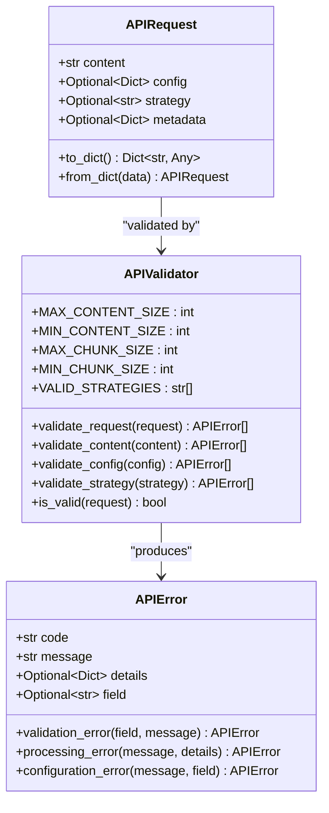
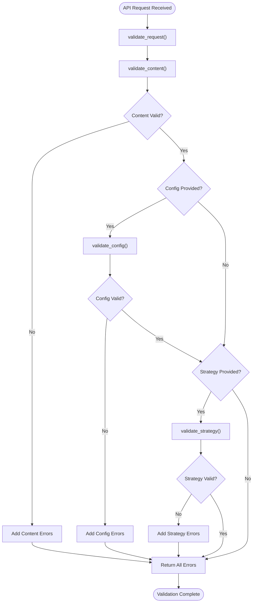

# Request Model

<cite>
**Referenced Files in This Document**
- [markdown_chunker/api/types.py](file://markdown_chunker/api/types.py)
- [markdown_chunker/api/validator.py](file://markdown_chunker/api/validator.py)
- [markdown_chunker/api/adapter.py](file://markdown_chunker/api/adapter.py)
- [examples/api_usage.py](file://examples/api_usage.py)
- [tests/api/test_adapter.py](file://tests/api/test_adapter.py)
- [tests/api/test_validator.py](file://tests/api/test_validator.py)
</cite>

## Table of Contents
1. [Introduction](#introduction)
2. [APIRequest Model Overview](#apirequest-model-overview)
3. [Field Specifications](#field-specifications)
4. [Validation Process](#validation-process)
5. [Common Error Cases](#common-error-cases)
6. [Python Implementation Examples](#python-implementation-examples)
7. [JSON Payload Mapping](#json-payload-mapping)
8. [Edge Cases and Edge Conditions](#edge-cases-and-edge-conditions)
9. [Best Practices](#best-practices)
10. [Troubleshooting Guide](#troubleshooting-guide)

## Introduction

The APIRequest model serves as the primary data structure for REST API interactions in the Markdown Chunker system. It encapsulates all necessary information for processing markdown content, including the content itself, configuration parameters, strategy preferences, and metadata. This model ensures type safety, validation, and proper serialization for HTTP-based communication.

The APIRequest model is designed with flexibility in mind, allowing for optional configuration while maintaining strict validation rules to prevent processing errors and ensure reliable results.

## APIRequest Model Overview

The APIRequest model is implemented as a dataclass that provides structured access to request parameters with built-in validation capabilities.



**Diagram sources**
- [markdown_chunker/api/types.py](file://markdown_chunker/api/types.py#L11-L45)
- [markdown_chunker/api/validator.py](file://markdown_chunker/api/validator.py#L12-L320)

**Section sources**
- [markdown_chunker/api/types.py](file://markdown_chunker/api/types.py#L11-L45)
- [markdown_chunker/api/validator.py](file://markdown_chunker/api/validator.py#L12-L320)

## Field Specifications

### Content Field

**Type:** `str`  
**Required:** Yes  
**Description:** The markdown content to be processed and chunked.

**Validation Rules:**
- Must be a string type
- Cannot be null or undefined
- Cannot be empty or whitespace-only
- Size must be between 1 byte and 10MB (UTF-8 encoded)
- Must contain actual content (no just whitespace)

**Default Value:** None (required field)

### Config Field

**Type:** `Optional[Dict[str, Any]]`  
**Required:** No  
**Description:** Configuration dictionary containing chunking parameters.

**Available Configuration Options:**

| Parameter | Type | Range | Default | Description |
|-----------|------|-------|---------|-------------|
| `max_chunk_size` | int | 10-100,000 | System default | Maximum size of each chunk in characters |
| `min_chunk_size` | int | 10-100,000 | System default | Minimum size of each chunk in characters |
| `overlap_size` | int | 0-100,000 | 0 | Number of characters to overlap between chunks |
| `enable_overlap` | bool | true/false | false | Whether to enable overlapping between chunks |
| `allow_oversize` | bool | true/false | false | Allow chunks larger than max_chunk_size if content doesn't split naturally |
| `preserve_code_blocks` | bool | true/false | true | Preserve code blocks in their entirety |
| `code_ratio_threshold` | float | 0.0-1.0 | 0.3 | Ratio threshold for detecting code-heavy content |
| `list_ratio_threshold` | float | 0.0-1.0 | 0.3 | Ratio threshold for detecting list-heavy content |
| `table_ratio_threshold` | float | 0.0-1.0 | 0.3 | Ratio threshold for detecting table-heavy content |

**Default Value:** `None` (uses system defaults)

### Strategy Field

**Type:** `Optional[str]`  
**Required:** No  
**Description:** Override strategy for content chunking.

**Valid Strategies:**
- `"auto"`: Automatic strategy selection (default)
- `"code"`: Code-focused chunking strategy
- `"mixed"`: Mixed content strategy
- `"list"`: List-focused strategy
- `"table"`: Table-focused strategy
- `"structural"`: Structural hierarchy strategy
- `"sentences"`: Sentence-based chunking strategy

**Default Value:** `None` (uses automatic selection)

### Metadata Field

**Type:** `Optional[Dict[str, Any]]`  
**Required:** No  
**Description:** Additional metadata for request tracking and debugging.

**Default Value:** `{}` (empty dictionary)

**Section sources**
- [markdown_chunker/api/types.py](file://markdown_chunker/api/types.py#L11-L45)
- [markdown_chunker/api/validator.py](file://markdown_chunker/api/validator.py#L19-L33)

## Validation Process

The APIValidator performs comprehensive validation of APIRequest objects through a multi-stage process:



**Diagram sources**
- [markdown_chunker/api/validator.py](file://markdown_chunker/api/validator.py#L50-L73)

### Content Validation

Content validation ensures the markdown content meets quality and size requirements:

1. **Presence Check**: Verifies content is not null or undefined
2. **Type Check**: Confirms content is a string
3. **Size Validation**: Ensures content size is within acceptable bounds (1-10MB)
4. **Content Quality**: Prevents empty or whitespace-only content

### Configuration Validation

Configuration validation covers multiple parameter categories:

1. **Chunk Size Parameters**: Validates `max_chunk_size` and `min_chunk_size` ranges and relationships
2. **Overlap Settings**: Validates overlap size and boolean flags
3. **Boolean Fields**: Ensures boolean configuration values are properly typed
4. **Threshold Values**: Validates ratio thresholds (0.0-1.0)

### Strategy Validation

Strategy validation ensures the selected strategy is one of the supported options:

- Checks strategy type (must be string)
- Validates against the list of supported strategies
- Provides helpful error messages with valid strategy options

**Section sources**
- [markdown_chunker/api/validator.py](file://markdown_chunker/api/validator.py#L50-L320)

## Common Error Cases

### Invalid Content Errors

**Empty Content:**
```python
# Invalid - empty string
request = APIRequest(content="")

# Invalid - whitespace only
request = APIRequest(content="   \n\t   ")
```

**Content Size Issues:**
```python
# Invalid - content too small (below minimum)
request = APIRequest(content="a")  # Single character

# Invalid - content too large (above maximum)
long_content = "x" * (10 * 1024 * 1024 + 1)  # 10MB + 1 byte
request = APIRequest(content=long_content)
```

### Invalid Configuration Errors

**Chunk Size Mismatches:**
```python
# Invalid - min_chunk_size > max_chunk_size
config = {"max_chunk_size": 100, "min_chunk_size": 200}
request = APIRequest(content="# Test", config=config)

# Invalid - chunk size out of range
config = {"max_chunk_size": 5}  # Below minimum
request = APIRequest(content="# Test", config=config)
```

**Invalid Boolean Values:**
```python
# Invalid - boolean values must be true/false
config = {"enable_overlap": "true"}  # String instead of boolean
request = APIRequest(content="# Test", config=config)
```

**Invalid Threshold Values:**
```python
# Invalid - threshold out of range
config = {"code_ratio_threshold": 1.5}  # Above 1.0
request = APIRequest(content="# Test", config=config)
```

### Invalid Strategy Errors

```python
# Invalid - unsupported strategy
request = APIRequest(content="# Test", strategy="invalid_strategy")

# Invalid - strategy must be string
request = APIRequest(content="# Test", strategy=123)
```

**Section sources**
- [tests/api/test_adapter.py](file://tests/api/test_adapter.py#L61-L84)
- [tests/api/test_validator.py](file://tests/api/test_validator.py#L14-L251)

## Python Implementation Examples

### Basic API Request Creation

```python
from markdown_chunker.api import APIRequest

# Simple request with minimal parameters
request = APIRequest(
    content="# Hello World\n\nThis is a test document."
)

# Request with strategy override
request = APIRequest(
    content="# API Documentation\n\n## Overview",
    strategy="auto"
)
```

### Advanced Configuration Example

```python
from markdown_chunker.api import APIRequest

# Complex configuration with multiple parameters
config = {
    "max_chunk_size": 2048,
    "min_chunk_size": 512,
    "overlap_size": 100,
    "enable_overlap": True,
    "allow_oversize": False,
    "preserve_code_blocks": True,
    "code_ratio_threshold": 0.6,
    "list_ratio_threshold": 0.4,
    "table_ratio_threshold": 0.3
}

request = APIRequest(
    content="""
    # Technical Documentation
    
    ```python
    def example_function():
        return "Hello"
    ```
    
    ## Features
    - Feature 1
    - Feature 2
    """,
    config=config,
    strategy="structural"
)
```

### Request with Metadata

```python
from markdown_chunker.api import APIRequest

# Request with additional metadata for tracking
request = APIRequest(
    content="# User Guide\n\nThis is a user documentation.",
    metadata={
        "request_id": "req_12345",
        "user_id": "user_67890",
        "source": "web_interface",
        "timestamp": "2024-01-15T10:30:00Z"
    }
)
```

### Dictionary-Based Construction

```python
from markdown_chunker.api import APIRequest

# Create request from dictionary
request_dict = {
    "content": "# Test Document",
    "config": {"max_chunk_size": 1024},
    "strategy": "auto",
    "metadata": {"source": "api_client"}
}

request = APIRequest.from_dict(request_dict)
```

**Section sources**
- [examples/api_usage.py](file://examples/api_usage.py#L16-L356)
- [markdown_chunker/api/types.py](file://markdown_chunker/api/types.py#L37-L45)

## JSON Payload Mapping

The APIRequest model maps directly to JSON payloads for HTTP communication:

### Standard Request Format

```json
{
    "content": "# Markdown Content\n\nThis is the markdown document to be processed.",
    "config": {
        "max_chunk_size": 2048,
        "min_chunk_size": 512,
        "overlap_size": 100,
        "enable_overlap": true
    },
    "strategy": "auto",
    "metadata": {
        "request_id": "unique_request_identifier",
        "user_agent": "custom_client/1.0"
    }
}
```

### Minimal Request Format

```json
{
    "content": "# Simple Document"
}
```

### Request with Strategy Only

```json
{
    "content": "# Document with Strategy",
    "strategy": "structural"
}
```

### Request with Configuration Only

```json
{
    "content": "# Document with Config",
    "config": {
        "max_chunk_size": 4096,
        "code_ratio_threshold": 0.7
    }
}
```

### Serialization and Deserialization

The APIRequest model provides built-in methods for JSON serialization:

```python
# Convert to dictionary for JSON serialization
request_dict = request.to_dict()

# Deserialize from dictionary
deserialized_request = APIRequest.from_dict(request_dict)
```

**Section sources**
- [markdown_chunker/api/types.py](file://markdown_chunker/api/types.py#L28-L45)

## Edge Cases and Edge Conditions

### Empty Content Handling

The system gracefully handles various forms of empty or invalid content:

```python
# Edge case: Null content
try:
    request = APIRequest(content=None)
except Exception as e:
    # Will be caught by validation
    pass

# Edge case: Unicode whitespace
request = APIRequest(content="\u00A0\u200B\uFEFF")  # Non-breaking spaces
```

### Malformed Configuration Handling

```python
# Edge case: Partial configuration
config = {
    "max_chunk_size": 1000,
    # Missing min_chunk_size (will use defaults)
    "overlap_size": 50
}
request = APIRequest(content="# Test", config=config)

# Edge case: Configuration with invalid keys
config = {
    "max_chunk_size": 1000,
    "invalid_key": "value",  # Ignored silently
    "another_invalid": 123
}
request = APIRequest(content="# Test", config=config)
```

### Strategy Edge Cases

```python
# Edge case: Case sensitivity in strategy
request = APIRequest(content="# Test", strategy="AUTO")  # Will fail validation

# Edge case: Strategy with special characters
request = APIRequest(content="# Test", strategy="auto-strategy")  # Will fail validation
```

### Memory and Performance Edge Cases

```python
# Edge case: Very large content (approaching limits)
large_content = "x" * (5 * 1024 * 1024)  # 5MB content
request = APIRequest(content=large_content)

# Edge case: Very small content
tiny_content = "x"  # Single character
request = APIRequest(content=tiny_content)
```

### Metadata Edge Cases

```python
# Edge case: Complex metadata structures
metadata = {
    "nested": {
        "deep": {
            "value": "complex_structure"
        }
    },
    "arrays": [1, 2, 3],
    "special_chars": "!@#$%^&*()"
}
request = APIRequest(content="# Test", metadata=metadata)
```

**Section sources**
- [tests/api/test_adapter.py](file://tests/api/test_adapter.py#L61-L84)
- [tests/api/test_validator.py](file://tests/api/test_validator.py#L14-L251)

## Best Practices

### Content Preparation

1. **Ensure Content Quality**: Provide meaningful markdown content with proper structure
2. **Avoid Empty Content**: Always include substantial content to be processed
3. **Character Encoding**: Use UTF-8 encoding for international content support

### Configuration Guidelines

1. **Reasonable Chunk Sizes**: Choose chunk sizes appropriate for your use case
2. **Overlap Considerations**: Enable overlap only when beneficial for your application
3. **Threshold Tuning**: Adjust ratio thresholds based on your content characteristics

### Strategy Selection

1. **Automatic Selection**: Use "auto" strategy for general-purpose processing
2. **Specific Strategies**: Choose specific strategies for specialized content types
3. **Testing**: Validate strategy choices with representative content samples

### Error Handling

1. **Validation First**: Always validate requests before processing
2. **Graceful Degradation**: Handle validation errors gracefully
3. **Meaningful Messages**: Provide clear error messages for debugging

### Performance Optimization

1. **Caching**: Utilize adapter caching for repeated requests with same configuration
2. **Batch Processing**: Process multiple documents efficiently
3. **Resource Management**: Monitor memory usage with large content

**Section sources**
- [examples/api_usage.py](file://examples/api_usage.py#L1-L356)
- [markdown_chunker/api/adapter.py](file://markdown_chunker/api/adapter.py#L15-L162)

## Troubleshooting Guide

### Common Validation Errors

**Content Validation Failures:**
- **Error**: "Content is required"
  - **Cause**: Content parameter is null or undefined
  - **Solution**: Ensure content is provided as a non-null string

- **Error**: "Content must be a string"
  - **Cause**: Content parameter is not a string type
  - **Solution**: Convert content to string before creating request

- **Error**: "Content is too small (minimum X bytes)"
  - **Cause**: Content is empty or too short
  - **Solution**: Provide content with sufficient length

- **Error**: "Content is too large (maximum Y bytes)"
  - **Cause**: Content exceeds size limits
  - **Solution**: Reduce content size or split into smaller chunks

### Configuration Validation Issues

**Chunk Size Problems:**
- **Error**: "max_chunk_size must be between X and Y"
  - **Cause**: Chunk size values outside acceptable range
  - **Solution**: Adjust chunk size parameters within valid ranges

- **Error**: "min_chunk_size cannot be greater than max_chunk_size"
  - **Cause**: Logical inconsistency in chunk size configuration
  - **Solution**: Ensure min_chunk_size ≤ max_chunk_size

**Boolean Configuration Issues:**
- **Error**: "enable_overlap must be boolean"
  - **Cause**: Boolean parameter has incorrect type
  - **Solution**: Use true/false values for boolean parameters

### Strategy Validation Problems

- **Error**: "Invalid strategy 'X'. Valid strategies: auto, code, mixed, ..."
  - **Cause**: Unsupported strategy name
  - **Solution**: Use one of the supported strategy names

### General Troubleshooting Steps

1. **Validate Input**: Check all parameters meet validation criteria
2. **Review Error Messages**: Carefully read validation error messages
3. **Test with Simple Content**: Start with minimal content to isolate issues
4. **Check Configuration**: Verify all configuration parameters are valid
5. **Monitor Resource Usage**: Ensure adequate memory and processing capacity

**Section sources**
- [tests/api/test_adapter.py](file://tests/api/test_adapter.py#L61-L84)
- [tests/api/test_validator.py](file://tests/api/test_validator.py#L14-L251)