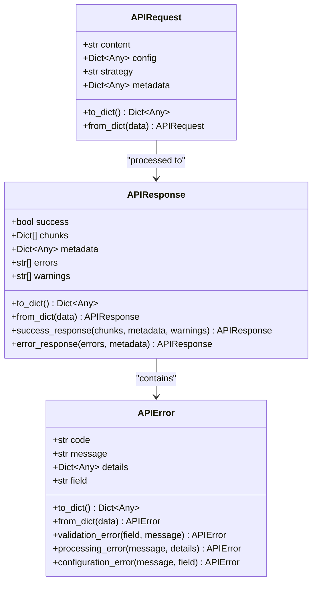
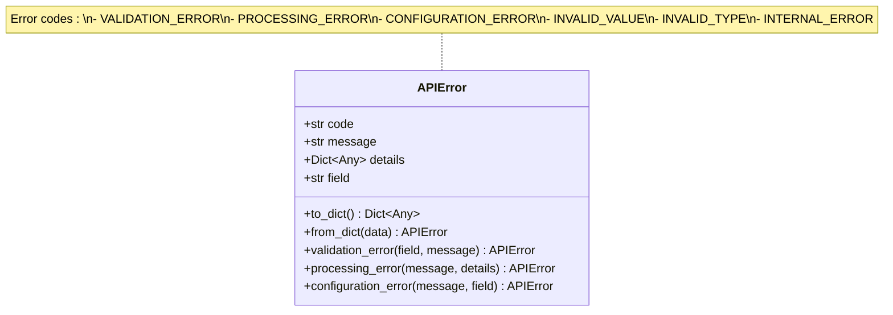
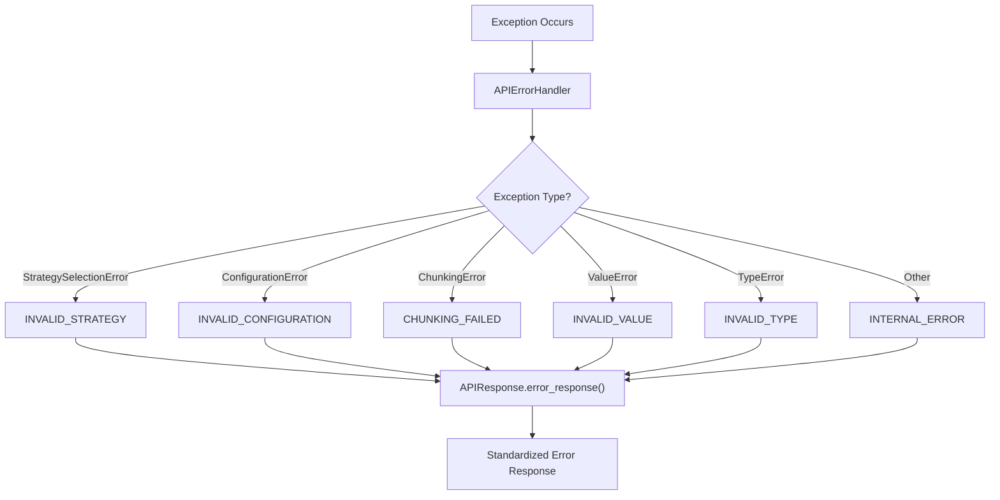

# Response Model

<cite>
**Referenced Files in This Document**
- [markdown_chunker/api/types.py](file://markdown_chunker/api/types.py)
- [markdown_chunker/api/error_handler.py](file://markdown_chunker/api/error_handler.py)
- [markdown_chunker/api/adapter.py](file://markdown_chunker/api/adapter.py)
- [markdown_chunker/api/validator.py](file://markdown_chunker/api/validator.py)
- [tests/api/test_error_handler.py](file://tests/api/test_error_handler.py)
- [examples/api_usage.py](file://examples/api_usage.py)
</cite>

## Table of Contents
1. [Introduction](#introduction)
2. [APIResponse Model](#apiresponse-model)
3. [APIError Structure](#apierror-structure)
4. [Success Response Patterns](#success-response-patterns)
5. [Error Response Patterns](#error-response-patterns)
6. [Error Transformation Pipeline](#error-transformation-pipeline)
7. [JSON Response Examples](#json-response-examples)
8. [Usage Examples](#usage-examples)
9. [Best Practices](#best-practices)
10. [Troubleshooting](#troubleshooting)

## Introduction

The Markdown Chunker API employs a standardized response model that provides consistent success and error handling across all operations. The response system is built around two primary structures: `APIResponse` for successful operations and `APIError` for error conditions. This documentation covers the complete response model architecture, including success patterns, error handling, and practical usage examples.

## APIResponse Model

The `APIResponse` class serves as the primary container for all API responses, whether successful or containing errors. It follows a dataclass structure with five core fields that provide comprehensive information about the operation outcome.



**Diagram sources**
- [markdown_chunker/api/types.py](file://markdown_chunker/api/types.py#L48-L106)

### Core Fields

| Field | Type | Description | Purpose |
|-------|------|-------------|---------|
| `success` | `bool` | Operation success indicator | Primary flag for determining response status |
| `chunks` | `List[Dict[str, Any]]` | Processed content chunks | Contains the actual chunked content data |
| `metadata` | `Dict[str, Any]` | Response metadata | Strategy, timing, statistics, and context information |
| `errors` | `List[str]` | Error messages | Human-readable error descriptions |
| `warnings` | `List[str]` | Warning messages | Non-fatal issues or recommendations |

**Section sources**
- [markdown_chunker/api/types.py](file://markdown_chunker/api/types.py#L48-L76)

## APIError Structure

The `APIError` class provides a structured approach to error representation with four key attributes that enable comprehensive error reporting and handling.



**Diagram sources**
- [markdown_chunker/api/types.py](file://markdown_chunker/api/types.py#L108-L161)

### Error Attributes

| Attribute | Type | Description | Usage Context |
|-----------|------|-------------|---------------|
| `code` | `str` | Machine-readable error identifier | Enables programmatic error handling |
| `message` | `str` | Human-readable error description | User-facing error communication |
| `details` | `Optional[Dict[str, Any]]` | Additional error context | Debugging and diagnostic information |
| `field` | `Optional[str]` | Related field name | Validation error specificity |

### Predefined Error Constructors

The APIError class provides several class methods for creating specific types of errors:

- **Validation Errors**: `APIError.validation_error(field, message)` - For input validation failures
- **Processing Errors**: `APIError.processing_error(message, details)` - For processing-related failures  
- **Configuration Errors**: `APIError.configuration_error(message, field)` - For configuration issues

**Section sources**
- [markdown_chunker/api/types.py](file://markdown_chunker/api/types.py#L134-L161)

## Success Response Patterns

Success responses follow a consistent pattern that provides comprehensive information about the chunking operation while maintaining simplicity for client consumption.

### Success Response Creation

The `success_response` class method provides the primary mechanism for creating successful responses:

```python
# Basic success response
response = APIResponse.success_response(
    chunks=[{"content": "...", "size": 100}],
    metadata={"strategy_used": "auto", "processing_time": 0.123}
)

# Success response with warnings
response = APIResponse.success_response(
    chunks=chunks,
    metadata=metadata,
    warnings=["Low chunk quality detected"]
)
```

### Success Response Structure

A typical successful response contains:

```json
{
  "success": true,
  "chunks": [
    {
      "content": "# Header\n\nContent...",
      "size": 150,
      "start_line": 1,
      "end_line": 5
    }
  ],
  "metadata": {
    "strategy_used": "structural",
    "processing_time": 0.156,
    "total_chunks": 3,
    "total_chars": 450,
    "fallback_used": false
  },
  "errors": [],
  "warnings": []
}
```

**Section sources**
- [markdown_chunker/api/types.py](file://markdown_chunker/api/types.py#L88-L106)

## Error Response Patterns

Error responses are structured to provide maximum information while remaining consistent across different error types. The error handling system automatically transforms various exception types into standardized APIError objects.

### Error Response Creation

The `error_response` class method creates error responses with minimal parameters:

```python
# Basic error response
response = APIResponse.error_response(
    errors=["Invalid content provided"],
    metadata={"error_type": "ValueError"}
)
```

### Automatic Error Transformation

The `APIErrorHandler` class automatically converts various exception types into appropriate error responses:



**Diagram sources**
- [markdown_chunker/api/error_handler.py](file://markdown_chunker/api/error_handler.py#L35-L63)

### Error Response Structure

Error responses include comprehensive metadata about the error condition:

```json
{
  "success": false,
  "chunks": [],
  "metadata": {
    "error_type": "ValueError",
    "error_code": "INVALID_VALUE",
    "details": {
      "exception_type": "ValueError",
      "exception_message": "Invalid value provided",
      "context": {
        "request_id": "req_123",
        "operation": "process_request"
      }
    }
  },
  "errors": ["Invalid value: Invalid value provided"],
  "warnings": []
}
```

**Section sources**
- [markdown_chunker/api/error_handler.py](file://markdown_chunker/api/error_handler.py#L120-L159)

## Error Transformation Pipeline

The error transformation pipeline converts internal exceptions into standardized APIError objects with appropriate error codes and metadata.

### Exception-to-Error Mapping

| Exception Type | Error Code | Description |
|----------------|------------|-------------|
| `StrategySelectionError` | `INVALID_STRATEGY` | Invalid chunking strategy specified |
| `ConfigurationError` | `INVALID_CONFIGURATION` | Invalid configuration parameters |
| `ChunkingError` | `CHUNKING_FAILED` | Chunking operation failed |
| `ValueError` | `INVALID_VALUE` | Invalid input value provided |
| `TypeError` | `INVALID_TYPE` | Type mismatch in input parameters |
| `RuntimeError` | `INTERNAL_ERROR` | Unexpected runtime error |
| Other Exceptions | `INTERNAL_ERROR` | Generic unexpected error |

### Error Details Generation

The error handler automatically generates detailed error information:

```python
# Error details structure
{
    "exception_type": "ValueError",
    "exception_message": "Invalid parameter value",
    "context": {
        "request_id": "abc123",
        "operation": "validate_request"
    },
    "traceback": "Full stack trace (when enabled)"
}
```

**Section sources**
- [markdown_chunker/api/error_handler.py](file://markdown_chunker/api/error_handler.py#L161-L176)

## JSON Response Examples

### Successful Response Example

```json
{
  "success": true,
  "chunks": [
    {
      "content": "# Introduction\n\nThis is the first chunk of content.",
      "size": 50,
      "start_line": 1,
      "end_line": 3
    },
    {
      "content": "# Implementation\n\nThis is the second chunk.",
      "size": 40,
      "start_line": 5,
      "end_line": 8
    }
  ],
  "metadata": {
    "strategy_used": "structural",
    "processing_time": 0.045,
    "total_chunks": 2,
    "total_chars": 90,
    "fallback_used": false,
    "fallback_level": 0,
    "complexity_score": 0.75
  },
  "errors": [],
  "warnings": [
    "Content contains multiple headers in single chunk"
  ]
}
```

### Validation Failure Example

```json
{
  "success": false,
  "chunks": [],
  "metadata": {
    "error_type": "ValidationError",
    "error_code": "VALIDATION_ERROR",
    "details": {
      "exception_type": "ValidationError",
      "exception_message": "Content is too small",
      "context": {
        "min_content_size": 100,
        "actual_size": 50
      }
    }
  },
  "errors": [
    "Content is too small (minimum 100 bytes)"
  ],
  "warnings": []
}
```

### Processing Error Example

```json
{
  "success": false,
  "chunks": [],
  "metadata": {
    "error_type": "ChunkingError",
    "error_code": "CHUNKING_FAILED",
    "details": {
      "exception_type": "ChunkingError",
      "exception_message": "Failed to process content",
      "context": {
        "strategy": "structural",
        "content_length": 10000
      }
    }
  },
  "errors": [
    "Chunking failed: Failed to process content"
  ],
  "warnings": []
}
```

### System Exception Example

```json
{
  "success": false,
  "chunks": [],
  "metadata": {
    "error_type": "MemoryError",
    "error_code": "INTERNAL_ERROR",
    "details": {
      "exception_type": "MemoryError",
      "exception_message": "Out of memory",
      "context": {
        "memory_limit": "2GB",
        "requested_memory": "3GB"
      },
      "traceback": "Stack trace information..."
    }
  },
  "errors": [
    "Unexpected error: Out of memory"
  ],
  "warnings": []
}
```

## Usage Examples

### Basic API Usage

```python
from markdown_chunker.api import APIAdapter, APIRequest

# Create adapter and request
adapter = APIAdapter()
request = APIRequest(
    content="# Test Document\n\nContent here.",
    config={"max_chunk_size": 1000}
)

# Process request
response = adapter.process_request(request)

# Handle response
if response.success:
    print(f"Success! {len(response.chunks)} chunks generated")
    for chunk in response.chunks:
        print(f"Chunk size: {chunk['size']}")
else:
    print(f"Error: {response.errors[0]}")
    print(f"Error code: {response.metadata.get('error_code', 'UNKNOWN')}")
```

### Error Handling Pattern

```python
from markdown_chunker.api import APIAdapter, APIRequest

def process_document(content: str, config: dict = None):
    """Process document with comprehensive error handling."""
    adapter = APIAdapter()
    
    try:
        request = APIRequest(content=content, config=config)
        response = adapter.process_request(request)
        
        if response.success:
            return {
                "success": True,
                "chunks": response.chunks,
                "metadata": response.metadata
            }
        else:
            # Extract error information
            error_info = {
                "error": response.errors[0],
                "error_code": response.metadata.get("error_code"),
                "error_type": response.metadata.get("error_type")
            }
            
            # Log error details
            print(f"Processing failed: {error_info}")
            
            return {
                "success": False,
                "error": error_info
            }
            
    except Exception as e:
        # Handle unexpected errors
        return {
            "success": False,
            "error": {
                "message": f"Unexpected error: {str(e)}",
                "type": type(e).__name__
            }
        }
```

### Batch Processing with Error Recovery

```python
from markdown_chunker.api import APIAdapter, APIRequest

def batch_process_documents(documents: List[str], config: dict = None):
    """Process multiple documents with error recovery."""
    adapter = APIAdapter()
    results = []
    
    for i, doc in enumerate(documents):
        try:
            request = APIRequest(content=doc, config=config)
            response = adapter.process_request(request)
            
            if response.success:
                results.append({
                    "index": i,
                    "success": True,
                    "chunks": len(response.chunks),
                    "strategy": response.metadata.get("strategy_used")
                })
                
                # Log successful processing
                if response.warnings:
                    print(f"Document {i}: {len(response.chunks)} chunks, {len(response.warnings)} warnings")
                    
            else:
                # Handle individual document failure
                error = response.errors[0]
                error_code = response.metadata.get("error_code", "UNKNOWN")
                
                results.append({
                    "index": i,
                    "success": False,
                    "error": error,
                    "error_code": error_code
                })
                
        except Exception as e:
            # Handle catastrophic failure
            results.append({
                "index": i,
                "success": False,
                "error": f"Catastrophic failure: {str(e)}"
            })
    
    return results
```

**Section sources**
- [examples/api_usage.py](file://examples/api_usage.py#L16-L46)
- [examples/api_usage.py](file://examples/api_usage.py#L134-L173)

## Best Practices

### Response Handling Guidelines

1. **Always Check Success Flag**: Verify `response.success` before accessing chunks or metadata
2. **Handle Errors Gracefully**: Provide meaningful error messages to users
3. **Log Error Details**: Capture error metadata for debugging purposes
4. **Provide Context**: Include request context in error responses when appropriate
5. **Use Appropriate Error Codes**: Leverage predefined error codes for programmatic handling

### Performance Considerations

1. **Cache Chunkers**: Use `cache_chunker=True` in production environments
2. **Batch Requests**: Process multiple documents together when possible
3. **Monitor Processing Time**: Track response times for performance optimization
4. **Handle Large Content**: Implement streaming for very large documents

### Security Best Practices

1. **Sanitize Input**: Validate all incoming content and configurations
2. **Limit Resource Usage**: Set reasonable limits on content size and processing time
3. **Secure Error Information**: Avoid exposing sensitive information in error messages
4. **Rate Limiting**: Implement appropriate rate limiting for API endpoints

## Troubleshooting

### Common Issues and Solutions

#### Empty Response Chunks

**Problem**: Response contains empty chunks or no chunks at all
**Solution**: 
- Check content validity and size
- Verify configuration parameters
- Review strategy selection
- Examine warnings for quality indicators

#### Validation Errors

**Problem**: `VALIDATION_ERROR` responses for seemingly valid input
**Solution**:
- Verify content encoding and size limits
- Check configuration parameter ranges
- Ensure proper field types
- Review strategy availability

#### Processing Failures

**Problem**: `CHUNKING_FAILED` errors during processing
**Solution**:
- Reduce content size or complexity
- Try different chunking strategies
- Check system resource availability
- Enable detailed logging

#### Memory Issues

**Problem**: Out of memory errors during processing
**Solution**:
- Reduce `max_chunk_size` configuration
- Process content in smaller batches
- Increase available memory
- Use streaming processing for large documents

### Debugging Tools

1. **Enable Tracebacks**: Use `APIErrorHandler(include_traceback=True)` for detailed debugging
2. **Monitor Warnings**: Pay attention to warning messages for quality indicators
3. **Check Metadata**: Examine response metadata for processing statistics
4. **Validate Configurations**: Use the validator to test configuration parameters

**Section sources**
- [tests/api/test_error_handler.py](file://tests/api/test_error_handler.py#L95-L116)
- [markdown_chunker/api/adapter.py](file://markdown_chunker/api/adapter.py#L38-L93)