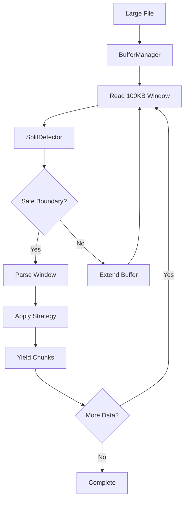

# Streaming API

<cite>
**Referenced Files in This Document**   
- [README.md](file://README.md)
- [docs/api/streaming.md](file://docs/api/streaming.md)
- [docs/research/features/14-streaming-processing.md](file://docs/research/features/14-streaming-processing.md)
- [docs/architecture/README.md](file://docs/architecture/README.md)
- [adapter.py](file://adapter.py)
</cite>

## Table of Contents
1. [Introduction](#introduction)
2. [StreamingConfig Model](#streamingconfig-model)
3. [Internal Data Flow](#internal-data-flow)
4. [Performance Benefits](#performance-benefits)
5. [Error Recovery Patterns](#error-recovery-patterns)
6. [Streaming vs Batch Processing](#streaming-vs-batch-processing)
7. [Code Examples](#code-examples)

## Introduction

The streaming processing capabilities in dify-markdown-chunker-1 provide memory-efficient processing for large Markdown files through an iterator-based interface. This implementation enables processing of files exceeding 10MB with less than 50MB of RAM usage by utilizing buffer-based chunking with smart window boundary detection. The streaming API maintains high-quality chunk boundaries while preserving document structure, including code blocks, tables, lists, and LaTeX formulas.

The core design follows an iterator pattern that yields chunks one at a time, allowing immediate processing of each chunk without loading the entire document into memory. This approach is particularly beneficial for resource-constrained environments and large-scale document processing workflows where memory efficiency is critical.

**Section sources**
- [README.md](file://README.md#L80-L84)
- [docs/api/streaming.md](file://docs/api/streaming.md#L5-L12)

## StreamingConfig Model

The `StreamingConfig` class provides configuration parameters for controlling the behavior of streaming chunking operations. This model defines key parameters that balance memory usage, processing quality, and performance characteristics.

### Configuration Parameters

| Parameter | Type | Default | Description |
|---------|------|---------|-------------|
| `buffer_size` | int | 100,000 | Size of buffer window in characters (100KB) |
| `overlap_lines` | int | 20 | Context lines preserved between buffer windows |
| `max_memory_mb` | int | 100 | Maximum memory usage ceiling in megabytes |
| `safe_split_threshold` | float | 0.8 | Position within buffer to start looking for split points |

The configuration allows fine-tuning of the streaming process based on specific requirements:

- **Memory-constrained environments**: Reduce `buffer_size` and `max_memory_mb` to minimize RAM usage
- **Large file optimization**: Increase `buffer_size` to reduce window transitions
- **Context preservation**: Adjust `overlap_lines` to control context continuity between windows

The `safe_split_threshold` parameter determines where the system begins searching for safe split points within each buffer window, defaulting to 80% of the buffer size to ensure adequate space for boundary detection.

**Section sources**
- [docs/api/streaming.md](file://docs/api/streaming.md#L15-L40)
- [docs/research/features/14-streaming-processing.md](file://docs/research/features/14-streaming-processing.md#L53-L59)

## Internal Data Flow

The streaming implementation follows a structured data flow that processes large files in manageable windows while maintaining document integrity and chunk quality.



**Diagram sources**
- [docs/architecture/README.md](file://docs/architecture/README.md#L182-L196)

The process begins with the BufferManager reading a window of text from the input stream. The SplitDetector then analyzes the buffer to find safe split points that respect document structure. When a safe boundary is identified, the window is parsed and chunks are yielded through the iterator. If no safe boundary is found, the buffer is extended to prevent splitting atomic blocks.

Key aspects of the data flow include:

- **Backpressure handling**: The iterator pattern naturally provides backpressure by only requesting additional data when the consumer is ready
- **Boundary preservation**: Code blocks, tables, and other atomic structures are never split across window boundaries
- **Overlap management**: Context lines are preserved between windows to maintain semantic continuity
- **Progressive processing**: Chunks are yielded as soon as they are ready, enabling immediate downstream processing

The system uses a preview analysis of the first 100KB to select the global chunking strategy, ensuring consistency across all windows regardless of content variations.

**Section sources**
- [docs/architecture/README.md](file://docs/architecture/README.md#L180-L199)
- [docs/research/features/14-streaming-processing.md](file://docs/research/features/14-streaming-processing.md#L108-L147)

## Performance Benefits

The streaming implementation provides significant performance advantages for processing large Markdown files, particularly in memory-constrained environments.

### Memory Efficiency

| File Size | Batch Processing Memory | Streaming Memory |
|---------|------------------------|------------------|
| 1MB | ~10MB | ~5MB |
| 10MB | ~100MB | ~10MB |
| 100MB | >1GB (OOM risk) | ~20MB |

The streaming approach maintains constant memory usage regardless of input file size, making it suitable for processing very large documents (100MB+) that would otherwise cause out-of-memory errors with batch processing.

### Processing Characteristics

- **Throughput**: ~20MB/second on standard hardware
- **Overhead**: ~10-15% slower than batch processing due to window management
- **Scalability**: Performance remains consistent regardless of document size

The memory usage is bounded by the formula: `Peak Memory ≈ buffer_size + overlap_size + processing_overhead`, with the `max_memory_mb` parameter enforcing a strict upper limit.

### Quality Preservation

Despite the streaming nature, chunk quality is maintained through:

- **Atomic block preservation**: Code blocks, tables, and LaTeX formulas are never split
- **Smart boundary detection**: Split points are chosen at natural document boundaries
- **Context overlap**: Overlap lines preserve semantic continuity between windows
- **Consistent strategy application**: Global strategy selection ensures uniform processing

**Section sources**
- [docs/api/streaming.md](file://docs/api/streaming.md#L186-L204)
- [docs/research/features/14-streaming-processing.md](file://docs/research/features/14-streaming-processing.md#L368-L373)

## Error Recovery Patterns

The streaming API includes robust error handling mechanisms for dealing with interrupted streams and edge cases.

### Common Issues and Solutions

**Out of Memory Despite Streaming:**
```python
# Solution: Reduce buffer size
config = StreamingConfig(buffer_size=50_000, max_memory_mb=50)
chunker.chunk_file_streaming(file_path, config)
```

**File Not Found:**
```python
from pathlib import Path

file_path = "docs.md"
if not Path(file_path).exists():
    raise FileNotFoundError(f"File not found: {file_path}")

chunks = chunker.chunk_file_streaming(file_path)
```

**Encoding Issues:**
```python
# Explicitly specify encoding
with open(file_path, "r", encoding="utf-8") as f:
    for chunk in chunker.chunk_stream(f):
        process_chunk(chunk)
```

The system automatically handles partial reads and stream interruptions by maintaining window state and resuming processing from the last safe boundary. For network streams or unreliable sources, implementing retry logic with exponential backoff is recommended.

**Section sources**
- [docs/api/streaming.md](file://docs/api/streaming.md#L264-L293)

## Streaming vs Batch Processing

The choice between streaming and batch processing depends on file size, memory constraints, and required features.

### When to Use Batch Processing (`chunk()`)

- ✅ Files <10MB
- ✅ Ample memory available (>100MB RAM)
- ✅ Need fastest processing speed
- ✅ Require full-document features (semantic boundaries)

### When to Use Streaming (`chunk_file_streaming()`)

- ✅ Files >10MB
- ✅ Memory-constrained environments (<100MB RAM)
- ✅ Need progress tracking
- ✅ Processing very large documentation (100MB+)

### Feature Compatibility

| Feature | Batch | Streaming |
|---------|-------|-----------|
| All chunking strategies | ✅ | ✅ |
| Overlap context | ✅ | ✅ |
| Metadata enrichment | ✅ | ✅ |
| Hierarchical chunking | ✅ | ⚠️ Limited* |
| LaTeX preservation | ✅ | ✅ |
| Nested fencing | ✅ | ✅ |
| Semantic boundaries | ✅ | ❌ Future** |

\* Hierarchy built post-streaming; document summary may be limited  
\** Requires full-document embeddings; planned for future release

The streaming API trades a small amount of processing speed (~10-15% overhead) for guaranteed memory bounds, making it the preferred choice for large files and resource-constrained environments.

**Section sources**
- [docs/api/streaming.md](file://docs/api/streaming.md#L295-L324)

## Code Examples

### Direct Python Usage

```python
from chunkana import MarkdownChunker, StreamingConfig
import os

# Process large files with minimal memory usage
chunker = MarkdownChunker()

# Configure streaming for memory-constrained environments
streaming_config = StreamingConfig(
    buffer_size=100_000,  # 100KB buffer windows
    max_memory_mb=50      # Strict 50MB memory limit
)

# Stream process large file
file_path = "large_documentation.md"
chunk_count = 0

for chunk in chunker.chunk_file_streaming(file_path, streaming_config):
    # Process each chunk immediately
    chunk_count += 1
    print(f"Processed chunk {chunk_count}: {len(chunk.content)} chars")
    
    # Access streaming-specific metadata
    window_idx = chunk.metadata.get('stream_window_index', 0)
    print(f"  From window: {window_idx}")

print(f"Total chunks processed: {chunk_count}")
```

### Progress Tracking

```python
import os
from chunkana import MarkdownChunker

chunker = MarkdownChunker()
file_path = "large_documentation.md"
file_size = os.path.getsize(file_path)

processed_bytes = 0
for chunk in chunker.chunk_file_streaming(file_path):
    processed_bytes += len(chunk.content)
    progress = (processed_bytes / file_size) * 100
    print(f"\rProgress: {progress:.1f}%", end="")

print("\nDone!")
```

### Dify Workflow Integration

```yaml
- node: chunk_large_document
  type: tool
  tool: advanced_markdown_chunker
  config:
    max_chunk_size: 2048
    strategy: auto
    chunk_overlap: 100
    include_metadata: true
  input:
    input_text: ${load_document.content}
    streaming_config:
      buffer_size: 100000
      max_memory_mb: 50
```

The streaming API can be consumed in both Dify workflows and direct Python applications, providing consistent behavior across different usage scenarios.

**Section sources**
- [README.md](file://README.md#L578-L617)
- [docs/api/streaming.md](file://docs/api/streaming.md#L106-L119)