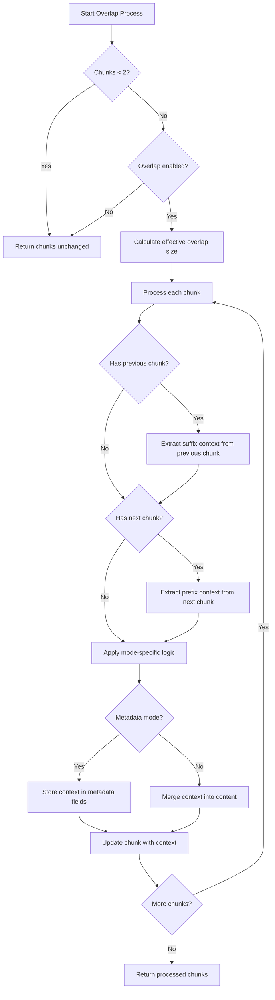
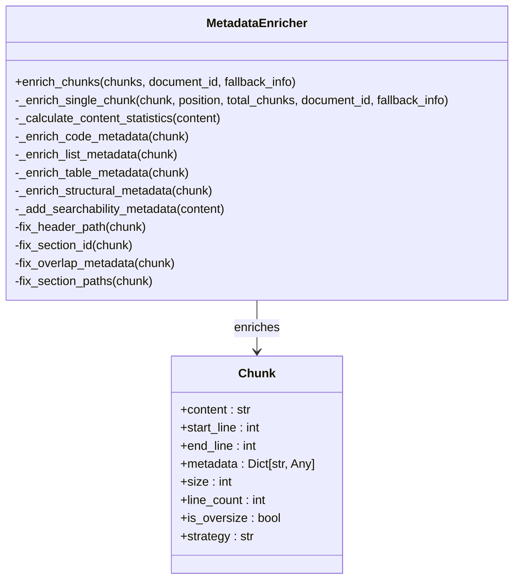
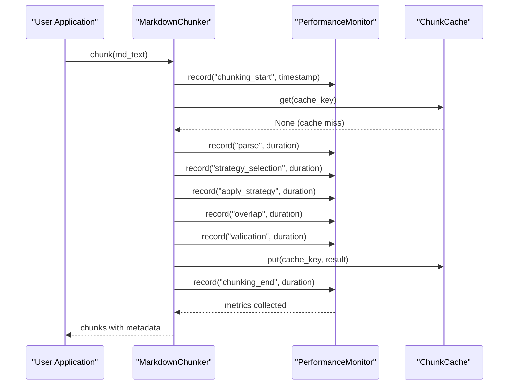
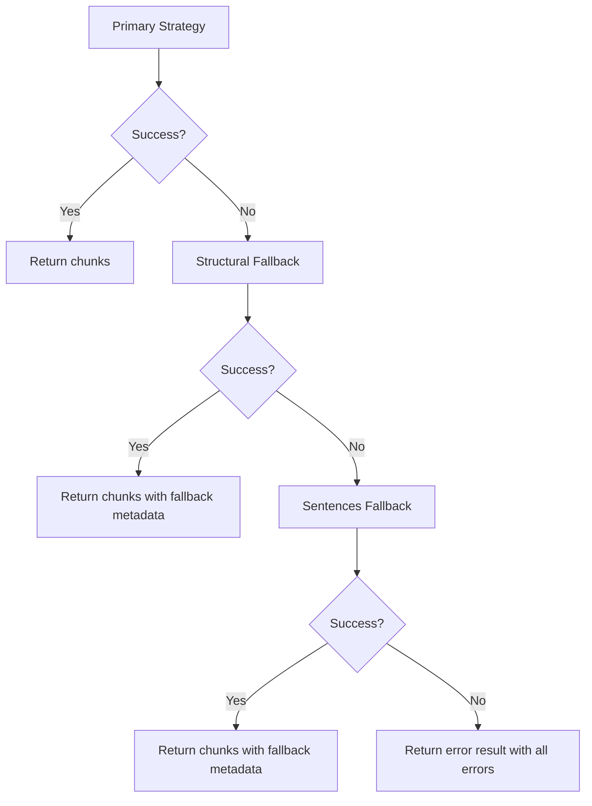
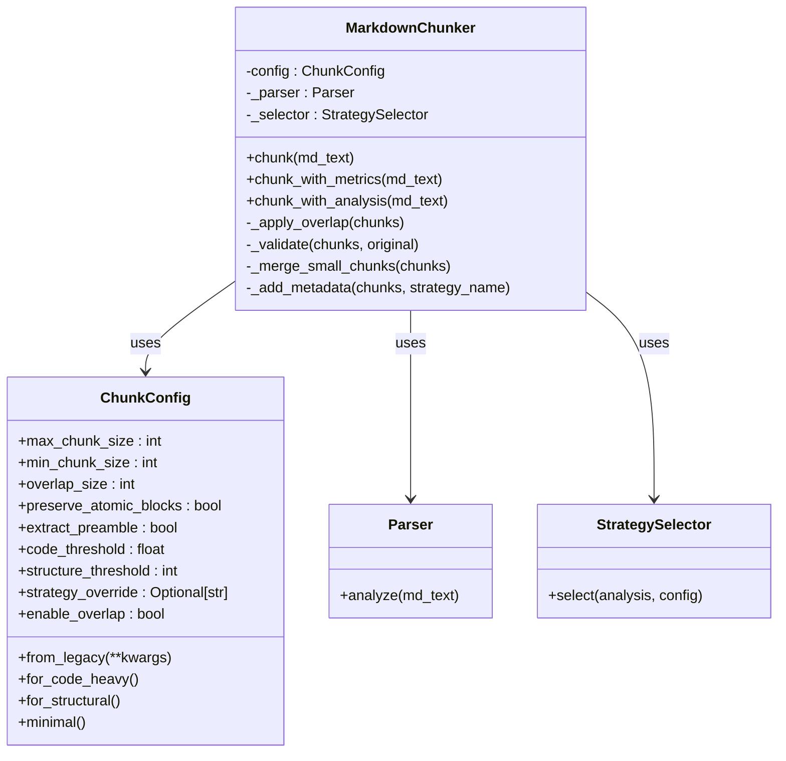
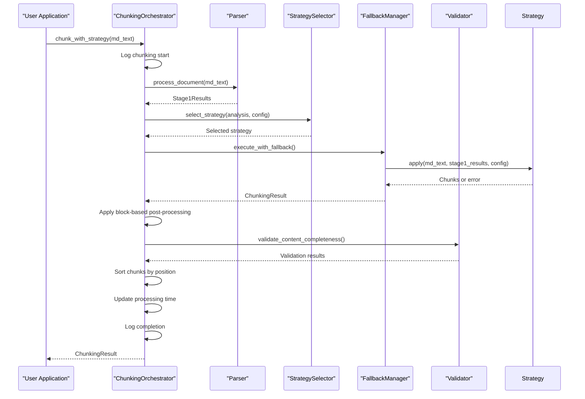

# Advanced Features

<cite>
**Referenced Files in This Document**   
- [orchestrator.py](file://markdown_chunker_legacy/chunker/orchestrator.py)
- [overlap_manager.py](file://markdown_chunker_legacy/chunker/components/overlap_manager.py)
- [metadata_enricher.py](file://markdown_chunker_legacy/chunker/components/metadata_enricher.py)
- [performance.py](file://markdown_chunker_legacy/chunker/performance.py)
- [fallback_manager.py](file://markdown_chunker_legacy/chunker/components/fallback_manager.py)
- [chunker.py](file://markdown_chunker_v2/chunker.py)
- [config.py](file://markdown_chunker_v2/config.py)
- [types.py](file://markdown_chunker_v2/types.py)
- [test_overlap_manager.py](file://tests/chunker/test_components/test_overlap_manager.py)
- [test_metadata_enricher.py](file://tests/chunker/test_components/test_metadata_enricher.py)
- [api_usage.py](file://examples/api_usage.py)
- [basic_usage.py](file://examples/basic_usage.py)
</cite>

## Table of Contents
1. [Overlap Management System](#overlap-management-system)
2. [Metadata Enrichment Process](#metadata-enrichment-process)
3. [Performance Monitoring Capabilities](#performance-monitoring-capabilities)
4. [Fallback Mechanisms](#fallback-mechanisms)
5. [Component Injection System](#component-injection-system)
6. [Orchestrator Coordination](#orchestrator-coordination)
7. [Advanced Configuration Examples](#advanced-configuration-examples)

## Overlap Management System

The Markdown chunker implements a sophisticated overlap management system designed to ensure context continuity between adjacent chunks. This system operates through block-aware overlap boundaries that align with structural elements in the Markdown content, preserving block integrity and preventing data loss or duplication issues. The overlap manager supports two distinct handling modes: metadata mode and legacy mode. In metadata mode, context from neighboring chunks is stored in metadata fields (previous_content and next_content) while keeping the core content clean. In legacy mode, context is merged directly into the content itself, creating a continuous text flow.

The overlap manager calculates effective overlap size based on either a fixed character count or a percentage of average chunk size. It extracts context using block-aligned extraction, which identifies content blocks such as paragraphs, headers, lists, code blocks, and tables. When extracting suffix context (for previous_content), the manager collects blocks from the end of a chunk until reaching the target size, with special handling to ensure content blocks are prioritized over headers when possible. Similarly, when extracting prefix context (for next_content), it collects blocks from the beginning of a chunk.

Critical safeguards prevent unbalanced code fences by verifying that the number of opening and closing code block markers (```) is even in any extracted context. The system also enforces a 50% total overlap limit to prevent excessive duplication. If no complete blocks fit within the target overlap size, the manager returns an empty string rather than falling back to character-based extraction, preserving structural integrity.



**Diagram sources**
- [overlap_manager.py](file://markdown_chunker_legacy/chunker/components/overlap_manager.py#L62-L137)

**Section sources**
- [overlap_manager.py](file://markdown_chunker_legacy/chunker/components/overlap_manager.py#L38-L800)
- [test_overlap_manager.py](file://tests/chunker/test_components/test_overlap_manager.py#L11-L405)

## Metadata Enrichment Process

The metadata enrichment process adds valuable information to each chunk, enhancing its usability and searchability. The MetadataEnricher component systematically enriches chunks with various types of metadata, including position information, content statistics, strategy-specific details, and searchability features. Each chunk receives position metadata such as chunk_index (sequential position), total_chunks (total number of chunks), is_first_chunk, and is_last_chunk flags.

Content statistics are calculated for each chunk, providing line_count, word_count, char_count, avg_line_length, and avg_word_length metrics. Strategy-specific enrichment adds additional metadata based on the chunk's content type: code chunks receive code_block_count, has_inline_code, has_imports, and has_comments; list chunks receive ordered_item_count, unordered_item_count, task_item_count, and has_nested_lists; table chunks receive table_row_count, table_count, and has_column_alignment; structural chunks receive header_count, min_header_level, max_header_level, and paragraph_count.

Searchability metadata improves chunk discoverability by adding a preview field (first sentence or line), and flags for content features like has_urls, has_emails, has_numbers, has_bold, has_italic, and has_inline_code. The enricher also normalizes metadata across chunks, ensuring consistency in fields like header_path, section_id, and overlap_size. Header paths are built hierarchically based on header levels, while section IDs are generated through consistent slugification of header text to ensure identical headers produce identical IDs.



**Diagram sources**
- [metadata_enricher.py](file://markdown_chunker_legacy/chunker/components/metadata_enricher.py#L13-L713)

**Section sources**
- [metadata_enricher.py](file://markdown_chunker_legacy/chunker/components/metadata_enricher.py#L13-L713)
- [test_metadata_enricher.py](file://tests/chunker/test_components/test_metadata_enricher.py#L11-L372)

## Performance Monitoring Capabilities

The Markdown chunker includes comprehensive performance monitoring capabilities that track and analyze processing metrics throughout the chunking pipeline. The PerformanceMonitor class records execution duration, input size, and timestamps for various operations, enabling detailed analysis of system performance. Metrics are collected for key operations such as strategy selection, chunk application, overlap processing, and validation.

The monitoring system provides statistical analysis through the get_stats method, which calculates count, total_time, avg_time, min_time, max_time, avg_size, and throughput for each operation. These metrics help identify performance bottlenecks and optimize configuration parameters. The timed decorator automatically records execution time for decorated functions, particularly those in classes that have a _performance_monitor attribute, ensuring comprehensive coverage of critical operations.

Caching mechanisms enhance performance by storing frequently used results. The StrategyCache maintains instances of strategy classes to avoid repeated instantiation, while the ChunkCache stores complete chunking results to prevent reprocessing identical content. The cached_sentence_split function uses LRU caching for frequently encountered text segments, but limits caching to small to medium texts to prevent memory bloat.

The PerformanceOptimizer coordinates these optimization techniques, determining when to use caching based on content size (enabled for documents under 50KB) and when to use streaming processing for very large documents (over 1MB). It also provides methods to estimate memory usage and determine optimal chunk sizes based on document characteristics.



**Diagram sources**
- [performance.py](file://markdown_chunker_legacy/chunker/performance.py#L32-L243)

**Section sources**
- [performance.py](file://markdown_chunker_legacy/chunker/performance.py#L1-L243)
- [chunker.py](file://markdown_chunker_v2/chunker.py#L1-L357)

## Fallback Mechanisms

The Markdown chunker implements a robust three-level fallback chain to ensure processing success even when encountering malformed or complex Markdown. The FallbackManager orchestrates this error recovery system, which guarantees that chunking always succeeds and never loses content. The fallback chain consists of three levels: primary strategy (selected by strategy selector), structural fallback (for specialized strategies that fail), and sentences fallback (universal fallback that always works).

When the primary strategy fails or returns no chunks, the system automatically progresses to the next level in the chain. The execute_with_fallback method attempts the primary strategy first, logging success or capturing errors and warnings. If the primary strategy fails, it tries the structural fallback unless the primary was already structural. If the structural fallback also fails, it proceeds to the sentences fallback, which uses a reliable sentence-based chunking approach that can handle virtually any Markdown content.

Each fallback level adds metadata to indicate the fallback level used and the reason for fallback. The system preserves all accumulated errors and warnings throughout the fallback process, providing comprehensive diagnostic information. Even if all strategies fail, the system returns an error result with detailed information rather than raising an exception, ensuring graceful degradation.

The fallback manager includes validation methods to verify the fallback chain configuration and statistics methods to monitor fallback usage. This comprehensive approach ensures robustness when processing edge cases, malformed Markdown, or documents with complex structures that challenge the primary chunking strategies.



**Diagram sources**
- [fallback_manager.py](file://markdown_chunker_legacy/chunker/components/fallback_manager.py#L31-L312)

**Section sources**
- [fallback_manager.py](file://markdown_chunker_legacy/chunker/components/fallback_manager.py#L31-L312)
- [orchestrator.py](file://markdown_chunker_legacy/chunker/orchestrator.py#L37-L666)

## Component Injection System

The component injection system in the Markdown chunker allows for customization of the chunking pipeline through dependency injection and modular design. The v2 implementation simplifies the architecture by consolidating types and reducing configuration parameters from 32 to 8 core parameters, making the system more accessible while maintaining flexibility. The ChunkConfig class serves as the central configuration point, with sensible defaults and validation to ensure configuration integrity.

The system supports component injection through constructor parameters, allowing users to inject custom implementations of key components. The MarkdownChunker class accepts a configuration object and internally manages parser and strategy selector instances, but the architecture allows for replacing these components. The simplified pipeline consists of discrete steps: parse, select strategy, apply strategy, merge small chunks, apply overlap, add metadata, and validate.

Configuration profiles provide predefined settings for common use cases, such as code-heavy documents, structured documents, and minimal configurations. These profiles can be accessed through class methods like for_code_heavy, for_structural, and minimal, making it easy to apply optimized settings without manual configuration. The from_legacy class method provides backward compatibility by mapping deprecated parameter names to current ones with appropriate deprecation warnings.

The component injection system enables customization at multiple levels: configuration parameters control behavior, strategy selection can be overridden, and the overall pipeline can be extended through the addition of new strategies or processing steps. This modular approach allows developers to tailor the chunker to specific requirements while maintaining the core reliability and performance characteristics.



**Diagram sources**
- [chunker.py](file://markdown_chunker_v2/chunker.py#L21-L357)
- [config.py](file://markdown_chunker_v2/config.py#L12-L170)

**Section sources**
- [chunker.py](file://markdown_chunker_v2/chunker.py#L1-L357)
- [config.py](file://markdown_chunker_v2/config.py#L1-L170)
- [types.py](file://markdown_chunker_v2/types.py#L1-L272)

## Orchestrator Coordination

The ChunkingOrchestrator coordinates the entire processing flow, managing the sequence of operations and handling error conditions gracefully. It serves as the central coordinator that integrates stage 1 analysis, strategy selection, chunking execution, and post-processing steps. The orchestrator follows a four-phase process: running stage 1 content analysis, selecting the optimal strategy, applying the strategy with fallback support, and coordinating error handling.

During initialization, the orchestrator sets up the chunking configuration, strategy selector, fallback manager, and parser interface. It also initializes block-based post-processing components when available, including the block_overlap_manager, header_path_validator, and chunk_size_normalizer. The chunk_with_strategy method implements the main processing flow, beginning with stage 1 analysis to understand the document's content type, complexity, and structural elements.

Strategy selection occurs through either automatic selection based on content analysis or manual override. The orchestrator uses the fallback manager to execute strategies, ensuring that if a strategy fails, the system automatically falls back to alternative approaches. After chunking, the orchestrator applies block-based post-processing to fix various issues, including block-based overlap (MC-003), header path validation (MC-006), and chunk size normalization (MC-004).

The orchestrator includes comprehensive error handling, validating content completeness to detect significant content loss, checking for excessive duplication, and validating overlap accuracy. It ensures all oversized chunks are properly flagged with reasons such as code_block_integrity or table_integrity. Finally, it sorts chunks by document position and updates processing time metrics before returning the results.



**Diagram sources**
- [orchestrator.py](file://markdown_chunker_legacy/chunker/orchestrator.py#L44-L666)

**Section sources**
- [orchestrator.py](file://markdown_chunker_legacy/chunker/orchestrator.py#L44-L666)

## Advanced Configuration Examples

The Markdown chunker supports various advanced configurations that leverage its features for specific use cases. Configuration profiles provide optimized settings for different document types: code-heavy documents benefit from larger chunk sizes and lower code thresholds, structured documents use moderate overlap to maintain section context, and chat context configurations prioritize smaller chunks with significant overlap for conversational AI applications.

For API documentation, a configuration with a max_chunk_size of 3072, min_chunk_size of 256, and a code_ratio_threshold of 0.6 ensures that code examples remain intact while maintaining reasonable chunk sizes. Code documentation profiles use even larger chunk sizes (up to 8192 characters) with minimal overlap to preserve code block integrity. Chat context configurations use smaller max_chunk_size (1536) with substantial overlap (200 characters) to maintain conversational context across chunks.

Custom configurations can combine multiple features: enabling overlap with block-based splitting preserves structural integrity while maintaining context continuity; using the structural strategy with header path validation ensures accurate section hierarchy; and applying metadata enrichment with searchability features enhances retrieval quality. The system also supports batch processing of multiple documents with consistent configuration, streaming responses for large documents, and simplified APIs for easy integration.

The examples demonstrate how to use the API with custom configurations, handle errors gracefully, process documents in batch, and simulate streaming responses. These patterns show how to leverage the advanced features for real-world applications, from documentation processing to conversational AI systems.

**Section sources**
- [api_usage.py](file://examples/api_usage.py#L1-L356)
- [basic_usage.py](file://examples/basic_usage.py#L1-L364)
- [config.py](file://markdown_chunker_v2/config.py#L137-L169)