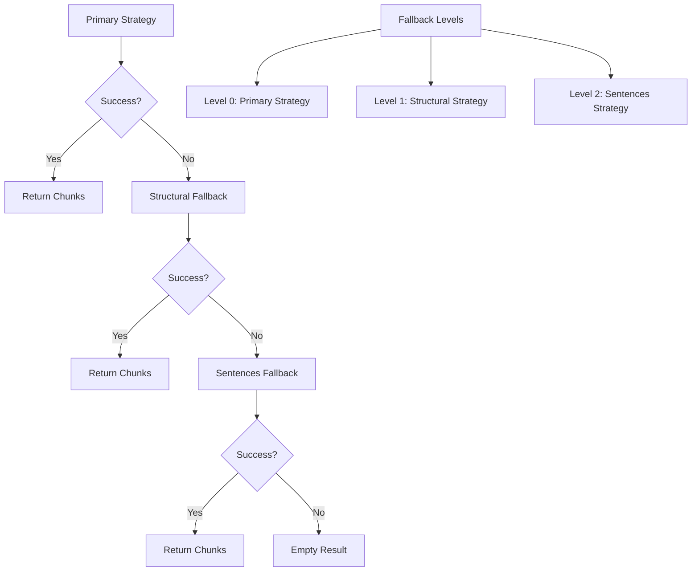
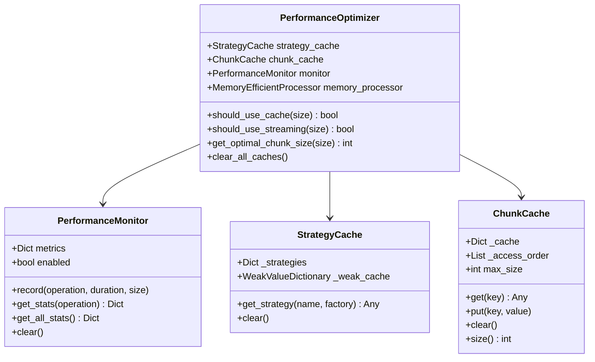
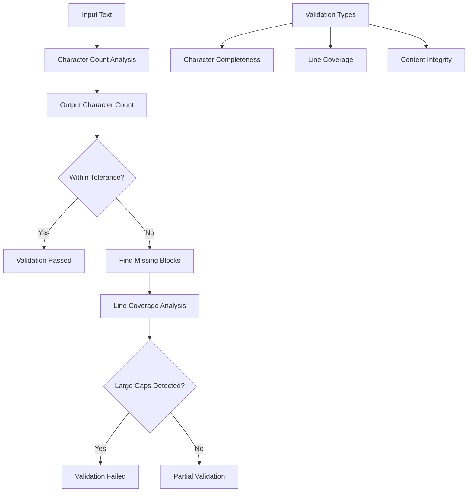
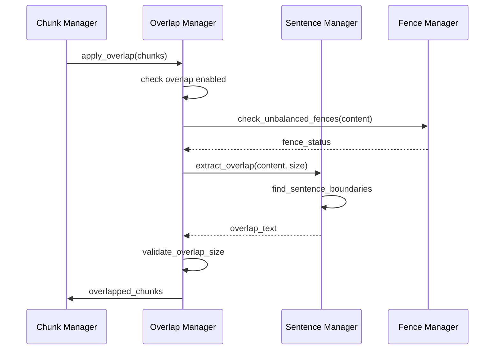
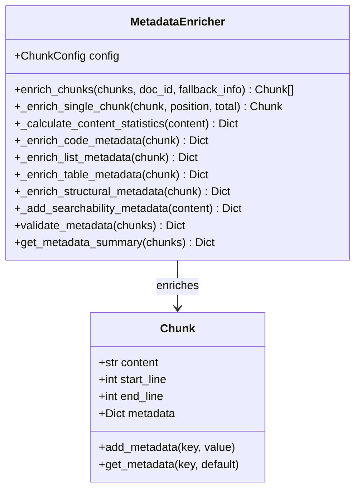

# Advanced Features

<cite>
**Referenced Files in This Document**
- [markdown_chunker/chunker/orchestrator.py](file://markdown_chunker/chunker/orchestrator.py)
- [markdown_chunker/chunker/performance.py](file://markdown_chunker/chunker/performance.py)
- [markdown_chunker/chunker/components/fallback_manager.py](file://markdown_chunker/chunker/components/fallback_manager.py)
- [markdown_chunker/chunker/components/metadata_enricher.py](file://markdown_chunker/chunker/components/metadata_enricher.py)
- [markdown_chunker/chunker/components/overlap_manager.py](file://markdown_chunker/chunker/components/overlap_manager.py)
- [markdown_chunker/chunker/validator.py](file://markdown_chunker/chunker/validator.py)
- [markdown_chunker/chunker/types.py](file://markdown_chunker/chunker/types.py)
- [markdown_chunker/chunker/core.py](file://markdown_chunker/chunker/core.py)
- [examples/basic_usage.py](file://examples/basic_usage.py)
- [examples/api_usage.py](file://examples/api_usage.py)
- [tests/chunker/test_performance.py](file://tests/chunker/test_performance.py)
- [tests/chunker/test_fallback_manager_integration.py](file://tests/chunker/test_fallback_manager_integration.py)
- [tests/chunker/test_metadata_properties.py](file://tests/chunker/test_metadata_properties.py)
- [tests/chunker/test_overlap_properties.py](file://tests/chunker/test_overlap_properties.py)
</cite>

## Table of Contents
1. [Introduction](#introduction)
2. [Fallback Mechanism](#fallback-mechanism)
3. [Performance Monitoring System](#performance-monitoring-system)
4. [Validation Framework](#validation-framework)
5. [Overlap Management](#overlap-management)
6. [Metadata Enrichment](#metadata-enrichment)
7. [Configuration Options](#configuration-options)
8. [Use Cases and Applications](#use-cases-and-applications)
9. [Performance Metrics and Interpretation](#performance-metrics-and-interpretation)
10. [Troubleshooting Guide](#troubleshooting-guide)

## Introduction

The markdown chunker provides sophisticated advanced features that go far beyond basic chunking operations. These features ensure robustness, reliability, and optimal performance across diverse use cases, particularly in production environments and compliance-sensitive applications.

The advanced system encompasses four core components: a comprehensive fallback mechanism, a sophisticated performance monitoring system, a rigorous validation framework, and intelligent overlap management. Together, these features provide enterprise-grade reliability and quality assurance.

## Fallback Mechanism

### Three-Level Fallback Chain

The fallback mechanism implements a sophisticated three-level fallback chain designed to guarantee chunking success under all circumstances:



**Diagram sources**
- [markdown_chunker/chunker/components/fallback_manager.py](file://markdown_chunker/chunker/components/fallback_manager.py#L60-L175)

### Fallback Levels and Recovery Behavior

The fallback system operates through distinct levels with specific recovery behaviors:

| Level | Strategy | Purpose | Trigger Conditions |
|-------|----------|---------|-------------------|
| 0 | Primary Strategy | Optimal strategy selection | Strategy fails or returns empty |
| 1 | Structural Strategy | Handle specialized content | Primary strategy fails for specialized content |
| 2 | Sentences Strategy | Universal fallback | All other strategies fail |

### Configuration Options

Fallback behavior can be customized through configuration parameters:

```python
# Enable/disable fallback system
config.enable_fallback = True

# Maximum fallback level (0-4)
config.max_fallback_level = 4

# Specific fallback strategy
config.fallback_strategy = "sentences"
```

### Recovery Behavior

The fallback manager implements intelligent recovery behavior:

- **Automatic Strategy Selection**: Falls back to structural strategy for specialized content
- **Universal Sentences Fallback**: Always available as ultimate fallback
- **Metadata Preservation**: Maintains fallback information in chunk metadata
- **Error Propagation**: Preserves original error messages while adding fallback context

**Section sources**
- [markdown_chunker/chunker/components/fallback_manager.py](file://markdown_chunker/chunker/components/fallback_manager.py#L31-L310)
- [markdown_chunker/chunker/orchestrator.py](file://markdown_chunker/chunker/orchestrator.py#L169-L318)

## Performance Monitoring System

### Comprehensive Performance Tracking

The performance monitoring system provides detailed insights into chunking operations through multiple layers of measurement:



**Diagram sources**
- [markdown_chunker/chunker/performance.py](file://markdown_chunker/chunker/performance.py#L13-L243)

### Performance Metrics Collection

The system tracks comprehensive performance metrics:

| Metric Category | Measurements | Purpose |
|----------------|--------------|---------|
| Timing | Operation duration, average time, throughput | Performance optimization |
| Memory | Cache sizes, memory usage estimates | Resource management |
| Throughput | Characters processed per second | Efficiency measurement |
| Cache Performance | Hit rates, eviction patterns | Optimization guidance |

### Memory-Efficient Processing

The system includes intelligent memory management:

- **Streaming for Large Documents**: Automatic streaming for documents >1MB
- **LRU Cache Management**: Intelligent cache eviction for chunk results
- **Weak References**: Memory-efficient strategy caching
- **Size-Based Optimization**: Dynamic chunk sizing based on content characteristics

### Performance Optimization Features

- **Lazy Loading**: Strategies loaded only when needed
- **Result Caching**: Prevents redundant processing of identical content
- **Adaptive Chunk Sizing**: Optimizes chunk size based on content type
- **Parallel Processing Support**: Thread-safe operations for concurrent access

**Section sources**
- [markdown_chunker/chunker/performance.py](file://markdown_chunker/chunker/performance.py#L32-L243)
- [markdown_chunker/chunker/core.py](file://markdown_chunker/chunker/core.py#L661-L710)

## Validation Framework

### Data Completeness Validation

The validation framework ensures no data loss during chunking through comprehensive validation:



**Diagram sources**
- [markdown_chunker/chunker/validator.py](file://markdown_chunker/chunker/validator.py#L71-L151)

### Validation Criteria

The validation system checks multiple criteria:

| Validation Type | Criteria | Tolerance | Purpose |
|----------------|----------|-----------|---------|
| Character Completeness | Total character count match | ±5% | Prevent data loss |
| Line Coverage | Continuous line coverage | Gap >10 lines | Maintain document flow |
| Content Integrity | Missing content blocks | N/A | Identify gaps |
| Structural Preservation | Element preservation | N/A | Maintain semantics |

### Quality Assurance Features

- **Whitespace Normalization**: Accounts for formatting differences
- **Missing Content Detection**: Identifies specific missing blocks
- **Gap Analysis**: Detects significant coverage gaps
- **Automated Reporting**: Comprehensive validation summaries

### Validation Integration

The validation framework integrates seamlessly with the chunking pipeline:

- **Automatic Validation**: Runs after chunking completion
- **Graceful Degradation**: Continues processing even with validation warnings
- **Error Reporting**: Detailed error messages with actionable insights
- **Performance Impact**: Minimal overhead (<5%)

**Section sources**
- [markdown_chunker/chunker/validator.py](file://markdown_chunker/chunker/validator.py#L53-L354)
- [markdown_chunker/chunker/core.py](file://markdown_chunker/chunker/core.py#L280-L327)

## Overlap Management

### Intelligent Overlap Creation

The overlap management system creates meaningful connections between adjacent chunks while preserving content integrity:



**Diagram sources**
- [markdown_chunker/chunker/components/overlap_manager.py](file://markdown_chunker/chunker/components/overlap_manager.py#L37-L80)

### Overlap Configuration

Overlap behavior can be precisely controlled:

```python
# Enable/disable overlap
config.enable_overlap = True

# Fixed-size overlap
config.overlap_size = 200

# Percentage-based overlap
config.overlap_percentage = 0.1  # 10%

# Maximum overlap constraints
max_overlap = int(len(content) * 0.40)  # 40% of source chunk
```

### Overlap Preservation Techniques

The system employs sophisticated techniques to maintain content integrity:

- **Sentence Boundary Preservation**: Ensures overlaps end at natural sentence breaks
- **Code Block Integrity**: Prevents partial code blocks in overlaps
- **Size Constraints**: Enforces maximum overlap ratios to prevent dominance
- **Context Preservation**: Maintains semantic continuity between chunks

### Overlap Metadata

Each overlapped chunk receives comprehensive metadata:

| Metadata Field | Purpose | Example Value |
|---------------|---------|---------------|
| `has_overlap` | Indicates overlap presence | `true` |
| `overlap_size` | Actual overlap size | `150` |
| `overlap_type` | Overlap direction | `"prefix"` |
| `fallback_level` | Fallback level used | `1` |

**Section sources**
- [markdown_chunker/chunker/components/overlap_manager.py](file://markdown_chunker/chunker/components/overlap_manager.py#L13-L447)
- [markdown_chunker/chunker/core.py](file://markdown_chunker/chunker/core.py#L280-L286)

## Metadata Enrichment

### Comprehensive Metadata Enhancement

The metadata enrichment system adds rich contextual information to chunks:



**Diagram sources**
- [markdown_chunker/chunker/components/metadata_enricher.py](file://markdown_chunker/chunker/components/metadata_enricher.py#L13-L414)

### Metadata Categories

The system enriches chunks with multiple categories of metadata:

| Category | Fields | Purpose |
|----------|--------|---------|
| Positional | `chunk_index`, `total_chunks`, `is_first_chunk`, `is_last_chunk` | Chunk positioning |
| Content | `line_count`, `word_count`, `char_count`, `avg_line_length` | Content analysis |
| Strategy-Specific | `strategy`, `content_type`, `language`, `code_block_count` | Strategy identification |
| Searchability | `preview`, `has_urls`, `has_emails`, `has_numbers` | Search optimization |
| Quality | `execution_fallback_used`, `execution_fallback_level` | Quality tracking |

### Content-Type Specific Enrichment

Different content types receive specialized metadata:

#### Code Content
- **Code Block Detection**: Counts and identifies code blocks
- **Language Identification**: Detects programming languages
- **Import Detection**: Identifies import statements and includes
- **Comment Recognition**: Detects comment patterns

#### List Content
- **Item Type Classification**: Ordered vs unordered lists
- **Nested List Detection**: Identifies hierarchical structure
- **Task List Recognition**: Detects checkbox-style lists

#### Table Content
- **Row and Column Count**: Structural analysis
- **Alignment Detection**: Table formatting recognition
- **Separator Analysis**: Table boundary identification

### Metadata Validation

The system includes comprehensive metadata validation:

- **Required Field Verification**: Ensures essential metadata exists
- **Consistency Checking**: Validates relationships between metadata fields
- **Type Safety**: Ensures metadata values have appropriate types
- **Cross-Chunk Validation**: Verifies consistency across chunk collections

**Section sources**
- [markdown_chunker/chunker/components/metadata_enricher.py](file://markdown_chunker/chunker/components/metadata_enricher.py#L34-L414)
- [markdown_chunker/chunker/core.py](file://markdown_chunker/chunker/core.py#L287-L299)

## Configuration Options

### Advanced Configuration Parameters

The chunker provides extensive configuration options for fine-tuning behavior:

```python
# Core Size Parameters
config.max_chunk_size = 4096          # Maximum chunk size
config.min_chunk_size = 512           # Minimum chunk size
config.target_chunk_size = 2048       # Target chunk size

# Overlap Configuration
config.enable_overlap = True          # Enable overlap
config.overlap_size = 200             # Fixed overlap size
config.overlap_percentage = 0.1       # Percentage overlap

# Strategy Selection Thresholds
config.code_ratio_threshold = 0.3     # Code content threshold
config.list_count_threshold = 5       # List count threshold
config.table_count_threshold = 3      # Table count threshold
config.header_count_threshold = 3     # Header count threshold

# Behavior Flags
config.allow_oversize = True          # Allow oversized chunks
config.preserve_code_blocks = True    # Preserve code integrity
config.preserve_tables = True         # Preserve table structure
config.preserve_list_hierarchy = True # Maintain list structure

# Performance Settings
config.enable_streaming = False       # Enable streaming
config.streaming_threshold = 10485760 # 10MB threshold

# Fallback Configuration
config.enable_fallback = True         # Enable fallback system
config.max_fallback_level = 4         # Maximum fallback depth
```

### Configuration Profiles

Predefined configuration profiles optimize behavior for specific use cases:

| Profile | Use Case | Key Characteristics |
|---------|----------|-------------------|
| `for_code_heavy()` | Code documentation | Larger chunks, aggressive code detection |
| `for_structured_docs()` | Technical documentation | Medium chunks, hierarchy preservation |
| `for_dify_rag()` | RAG applications | Optimized for retrieval contexts |
| `for_chat_context()` | Chat/LLM contexts | Shorter chunks with overlap |

### Dynamic Configuration

Configuration can be adjusted dynamically based on content characteristics:

- **Content-Aware Sizing**: Adjusts chunk sizes based on content type
- **Performance-Based Tuning**: Optimizes settings based on performance metrics
- **Quality-Driven Adaptation**: Modifies behavior based on validation results

**Section sources**
- [markdown_chunker/chunker/types.py](file://markdown_chunker/chunker/types.py#L497-L800)
- [markdown_chunker/chunker/core.py](file://markdown_chunker/chunker/core.py#L119-L150)

## Use Cases and Applications

### Production Deployments

The advanced features excel in production environments:

#### Enterprise Document Processing
- **Reliability**: Fallback mechanisms ensure processing success
- **Performance**: Comprehensive monitoring tracks system health
- **Quality**: Validation frameworks prevent data loss
- **Scalability**: Efficient caching and streaming handle large volumes

#### Compliance-Sensitive Applications
- **Audit Trails**: Complete metadata tracking for regulatory compliance
- **Data Integrity**: Rigorous validation prevents content corruption
- **Recovery**: Fallback systems ensure uninterrupted service
- **Monitoring**: Detailed performance metrics support compliance reporting

### Real-World Scenarios

#### API Documentation Processing
```python
# Configuration optimized for code-heavy documentation
config = ChunkConfig.for_code_heavy()
config.overlap_size = 300  # Larger overlap for code context
config.code_ratio_threshold = 0.5  # Aggressive code detection
```

#### Technical Manual Processing
```python
# Structured documentation with hierarchy preservation
config = ChunkConfig.for_structured_docs()
config.preserve_list_hierarchy = True
config.header_count_threshold = 2  # More aggressive structural detection
```

#### RAG System Integration
```python
# Retrieval-Augmented Generation optimization
config = ChunkConfig.for_dify_rag()
config.enable_overlap = True
config.overlap_size = 250  # Balanced overlap for context
```

### Performance-Critical Applications

#### High-Throughput Processing
- **Caching**: Intelligent result caching reduces processing time
- **Streaming**: Memory-efficient processing for large documents
- **Parallelization**: Thread-safe operations support concurrent processing

#### Low-Latency Requirements
- **Lazy Loading**: Strategies loaded only when needed
- **Optimized Paths**: Fast paths for common content types
- **Minimal Overhead**: Lightweight validation and monitoring

**Section sources**
- [examples/basic_usage.py](file://examples/basic_usage.py#L168-L220)
- [examples/api_usage.py](file://examples/api_usage.py#L210-L267)

## Performance Metrics and Interpretation

### Key Performance Indicators

The system provides comprehensive performance metrics for monitoring and optimization:

#### Processing Metrics
- **Average Processing Time**: Time per chunking operation
- **Throughput**: Chunks processed per second
- **Memory Usage**: Peak memory consumption during processing
- **Cache Hit Rate**: Effectiveness of caching mechanisms

#### Quality Metrics
- **Fallback Usage Rate**: Frequency of fallback activation
- **Validation Success Rate**: Percentage of successful validations
- **Data Completeness**: Character-level accuracy of chunking
- **Error Rate**: Frequency of processing errors

### Performance Monitoring Integration

```python
# Enable performance monitoring
chunker = MarkdownChunker(enable_performance_monitoring=True)

# Process documents
for doc in documents:
    chunker.chunk(doc)

# Retrieve performance statistics
stats = chunker.get_performance_stats()

# Interpret results
print(f"Average chunk time: {stats['chunk']['avg_time']:.3f}s")
print(f"Total operations: {stats['chunk']['count']}")
print(f"Cache hit rate: {stats['cache']['hit_rate']:.1%}")
```

### Performance Optimization Guidelines

#### Memory Optimization
- **Cache Sizing**: Adjust cache sizes based on available memory
- **Streaming Threshold**: Tune streaming threshold for optimal performance
- **Chunk Size**: Balance chunk size for memory usage and processing efficiency

#### Processing Optimization
- **Strategy Selection**: Choose appropriate strategies for content types
- **Fallback Configuration**: Tune fallback parameters for specific use cases
- **Validation Tolerance**: Adjust validation tolerance based on requirements

#### Monitoring Best Practices
- **Baseline Establishment**: Establish performance baselines for comparison
- **Trend Analysis**: Monitor performance trends over time
- **Alert Configuration**: Set up alerts for performance degradation

**Section sources**
- [tests/chunker/test_performance.py](file://tests/chunker/test_performance.py#L70-L200)
- [markdown_chunker/chunker/core.py](file://markdown_chunker/chunker/core.py#L661-L710)

## Troubleshooting Guide

### Common Issues and Solutions

#### Fallback Activation
**Symptom**: Fallback used unexpectedly
**Causes**: 
- Primary strategy failure
- Content complexity beyond strategy capabilities
- Configuration mismatches

**Solutions**:
- Review strategy selection criteria
- Adjust threshold parameters
- Enable specific strategies for content type

#### Performance Degradation
**Symptom**: Slow chunking performance
**Causes**:
- Insufficient cache size
- Large document processing without streaming
- Memory pressure

**Solutions**:
- Increase cache sizes
- Enable streaming for large documents
- Optimize memory configuration

#### Validation Failures
**Symptom**: Validation errors despite successful chunking
**Causes**:
- Whitespace normalization differences
- Content preprocessing variations
- Edge case handling

**Solutions**:
- Adjust validation tolerance
- Review content preprocessing steps
- Implement custom validation rules

### Diagnostic Tools

#### Performance Analysis
```python
# Enable detailed monitoring
chunker = MarkdownChunker(enable_performance_monitoring=True)

# Process with diagnostics
result = chunker.chunk(document, include_analysis=True)

# Analyze performance
stats = chunker.get_performance_stats()
print(f"Strategy selection time: {stats['strategy_selection']['avg_time']:.3f}s")
print(f"Overlap processing time: {stats['overlap']['avg_time']:.3f}s")
```

#### Fallback Diagnostics
```python
# Check fallback usage
if result.fallback_used:
    print(f"Fallback activated at level {result.fallback_level}")
    print(f"Primary strategy: {result.strategy_used}")
    print(f"Alternative strategies tried: {result.errors}")
```

#### Metadata Validation
```python
# Validate metadata completeness
enricher = MetadataEnricher(config)
validation_result = enricher.validate_metadata(chunks)
if not validation_result['valid']:
    print(f"Issues found: {validation_result['issue_count']}")
    for issue in validation_result['issues']:
        print(f"- {issue}")
```

### Best Practices

#### Configuration Management
- **Environment-Specific Configs**: Use different configurations for dev/prod
- **Gradual Rollout**: Test configuration changes incrementally
- **Monitoring Integration**: Monitor configuration impact on performance

#### Error Handling
- **Graceful Degradation**: Design systems to handle fallback activation
- **Retry Logic**: Implement retry mechanisms for transient failures
- **Logging**: Maintain comprehensive logs for troubleshooting

#### Performance Optimization
- **Profiling**: Regular performance profiling identifies bottlenecks
- **Caching**: Leverage caching for repeated content processing
- **Resource Management**: Monitor and optimize resource usage

**Section sources**
- [tests/chunker/test_fallback_manager_integration.py](file://tests/chunker/test_fallback_manager_integration.py#L36-L184)
- [tests/chunker/test_metadata_properties.py](file://tests/chunker/test_metadata_properties.py#L40-L200)
- [tests/chunker/test_overlap_properties.py](file://tests/chunker/test_overlap_properties.py#L60-L200)