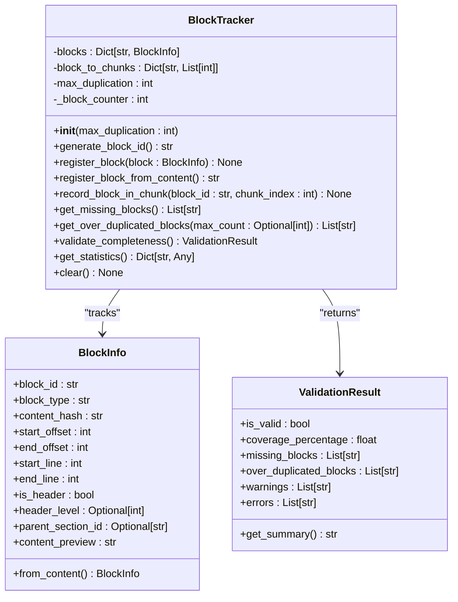
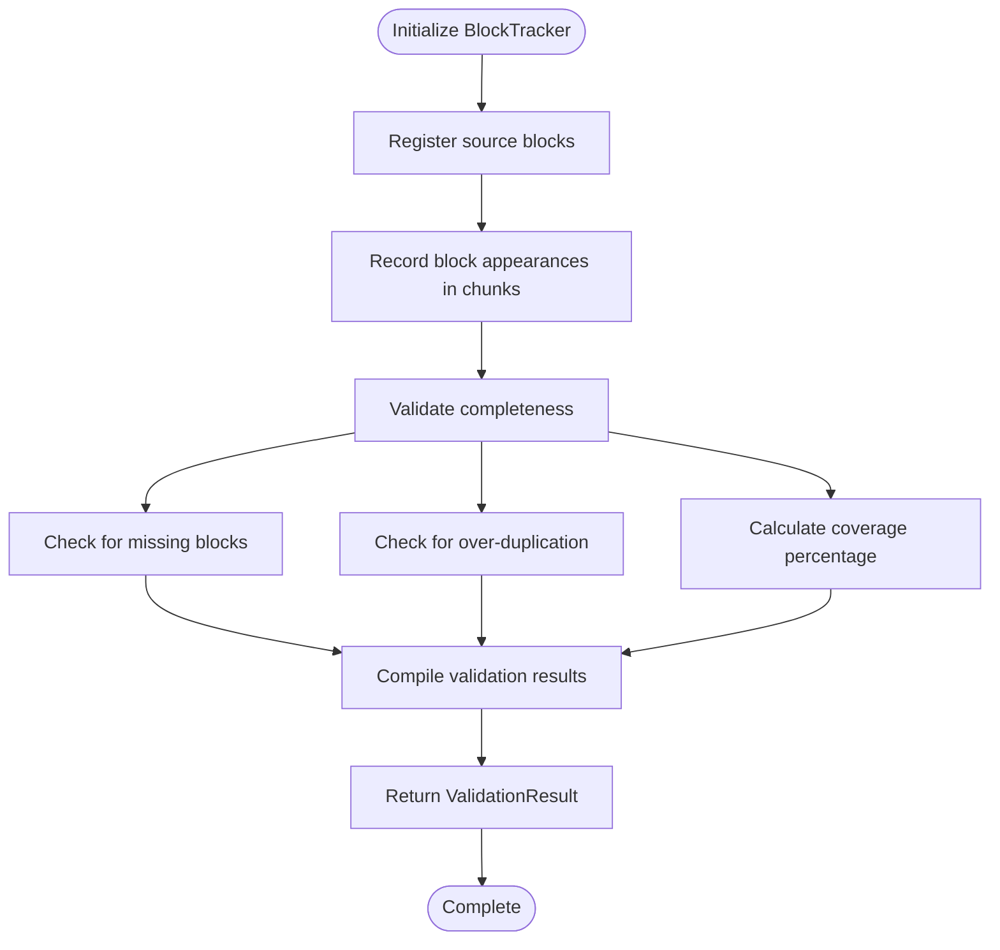
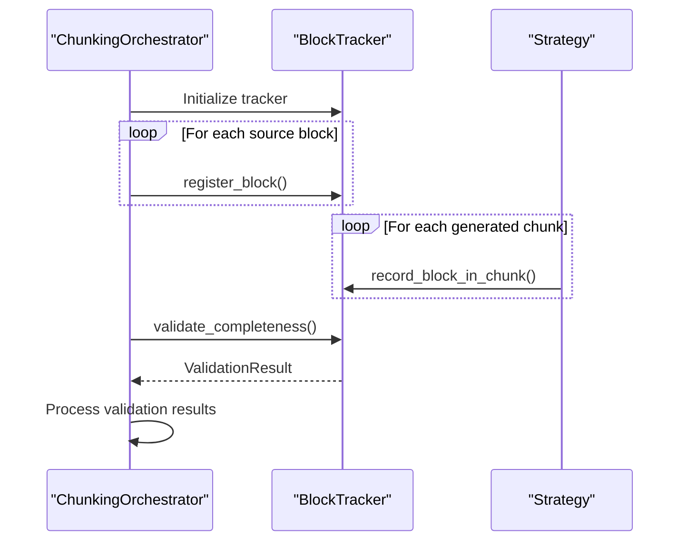

# Block Tracker

<cite>
**Referenced Files in This Document**   
- [block_tracker.py](file://markdown_chunker/chunker/components/block_tracker.py)
- [orchestrator.py](file://markdown_chunker/chunker/orchestrator.py)
- [core.py](file://markdown_chunker/chunker/core.py)
</cite>

## Table of Contents
1. [Introduction](#introduction)
2. [Core Components](#core-components)
3. [Architecture Overview](#architecture-overview)
4. [Detailed Component Analysis](#detailed-component-analysis)
5. [Usage and Integration](#usage-and-integration)
6. [Validation and Error Handling](#validation-and-error-handling)
7. [Conclusion](#conclusion)

## Introduction
The Block Tracker is a critical component in the markdown_chunker system designed to ensure content integrity during the chunking process. It addresses the fundamental issue of content loss on chunk boundaries by tracking all content blocks from the source document and validating their presence in the output chunks. The component also prevents excessive duplication of non-header blocks across consecutive chunks, maintaining both completeness and efficiency in the chunking process.

**Section sources**
- [block_tracker.py](file://markdown_chunker/chunker/components/block_tracker.py#L1-L10)

## Core Components
The Block Tracker consists of three primary components: BlockInfo, ValidationResult, and the BlockTracker class itself. BlockInfo represents individual content blocks with metadata including block type, content hash, position information, and header status. ValidationResult provides a structured output for validation results, including coverage percentage, missing blocks, and over-duplicated blocks. The BlockTracker class orchestrates the tracking process, registering source blocks and recording their appearance in output chunks.

**Section sources**
- [block_tracker.py](file://markdown_chunker/chunker/components/block_tracker.py#L16-L343)

## Architecture Overview

**Diagram sources**
- [block_tracker.py](file://markdown_chunker/chunker/components/block_tracker.py#L16-L343)

## Detailed Component Analysis

### BlockInfo Analysis
The BlockInfo class represents a single content block in the source document. Each block is an atomic unit of markdown content that should not be split across chunks, including paragraphs, lists, tables, code blocks, and headers. The class stores essential metadata for each block, including its position in the document (character offsets and line numbers), content hash for integrity verification, and preview text for debugging purposes. The block_id serves as a unique identifier, while the is_header flag and header_level properties enable special handling of header blocks.

**Section sources**
- [block_tracker.py](file://markdown_chunker/chunker/components/block_tracker.py#L16-L68)

### ValidationResult Analysis
The ValidationResult class encapsulates the outcome of the completeness validation process. It provides a comprehensive assessment of the chunking operation, indicating whether all source blocks are properly represented in the output. The validation result includes quantitative metrics such as coverage percentage and qualitative information about missing or over-duplicated blocks. The class also collects warnings and errors, offering detailed feedback for troubleshooting. The get_summary method provides a human-readable summary of the validation outcome, making it easy to quickly assess the quality of the chunking process.

**Section sources**
- [block_tracker.py](file://markdown_chunker/chunker/components/block_tracker.py#L70-L93)

### BlockTracker Class Analysis
The BlockTracker class implements the core tracking functionality, ensuring that every source block appears in at least one output chunk while preventing excessive duplication. The tracker maintains two primary data structures: a dictionary of block information and a mapping of blocks to the chunks they appear in. During operation, the tracker first registers all source blocks, then records which blocks appear in each generated chunk. The validation process checks for missing blocks and identifies non-header blocks that appear in more than the allowed number of consecutive chunks. The tracker also provides statistical information about the chunking process, including total block count and coverage metrics.

**Diagram sources**
- [block_tracker.py](file://markdown_chunker/chunker/components/block_tracker.py#L95-L343)

## Usage and Integration
The Block Tracker integrates with the chunking pipeline through the orchestrator component, which coordinates the overall chunking process. When chunking a document, the orchestrator first analyzes the content to identify logical blocks, then uses the BlockTracker to monitor these blocks throughout the chunking operation. The tracker is initialized at the beginning of the process, registers all identified blocks from the source document, and records their appearance in each generated chunk. After chunking completes, the orchestrator invokes the validation process to ensure content completeness before returning the final results.

**Diagram sources**
- [orchestrator.py](file://markdown_chunker/chunker/orchestrator.py#L65-L162)
- [block_tracker.py](file://markdown_chunker/chunker/components/block_tracker.py#L261-L317)

## Validation and Error Handling
The Block Tracker implements a robust validation system that detects content loss and excessive duplication. The validation process identifies blocks that do not appear in any output chunk, which indicates potential data loss. It also detects non-header blocks that appear in more than the configured maximum number of consecutive chunks, preventing unnecessary duplication. The system generates detailed error messages with examples of problematic blocks, facilitating debugging and resolution. Validation results include both errors (critical issues like missing blocks) and warnings (potential issues like low coverage), allowing for graduated response to different quality levels.

**Section sources**
- [block_tracker.py](file://markdown_chunker/chunker/components/block_tracker.py#L261-L317)

## Conclusion
The Block Tracker plays a vital role in ensuring the reliability and quality of the markdown chunking process. By systematically tracking content blocks and validating their representation in output chunks, it prevents data loss and controls duplication, maintaining the integrity of the original content. The component's design balances thorough validation with practical performance considerations, providing comprehensive feedback while remaining efficient enough for production use. Its integration with the broader chunking system ensures that content completeness is verified at every stage, making it an essential safeguard in the document processing pipeline.