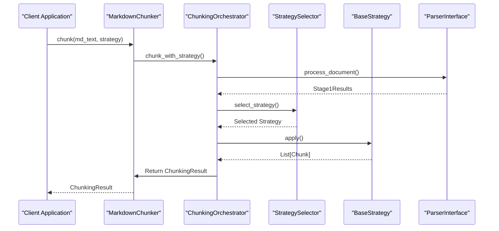
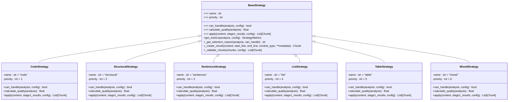
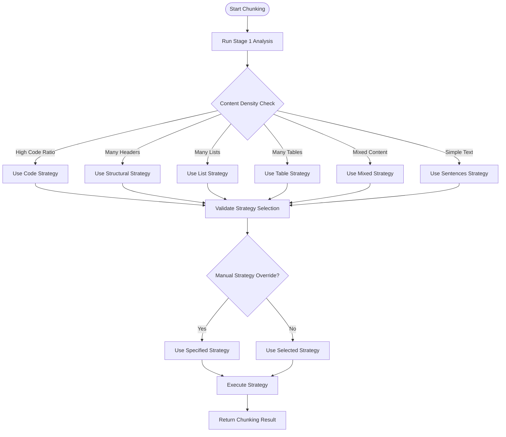
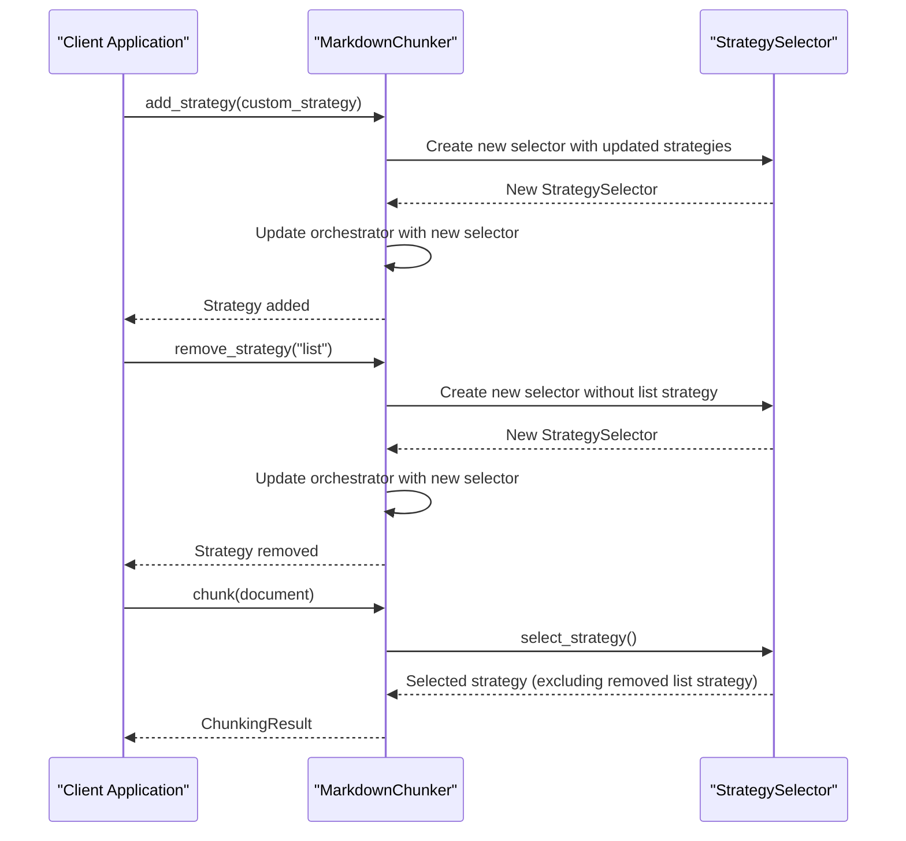

# Component Injection System

<cite>
**Referenced Files in This Document**   
- [markdown_chunker_legacy/chunker/core.py](file://markdown_chunker_legacy/chunker/core.py)
- [markdown_chunker_legacy/chunker/orchestrator.py](file://markdown_chunker_legacy/chunker/orchestrator.py)
- [markdown_chunker_legacy/chunker/selector.py](file://markdown_chunker_legacy/chunker/selector.py)
- [markdown_chunker_legacy/chunker/strategies/base.py](file://markdown_chunker_legacy/chunker/strategies/base.py)
- [markdown_chunker_legacy/chunker/types.py](file://markdown_chunker_legacy/chunker/types.py)
- [tests/chunker/test_dynamic_strategy_management.py](file://tests/chunker/test_dynamic_strategy_management.py)
- [tests/chunker/test_integration.py](file://tests/chunker/test_integration.py)
</cite>

## Table of Contents
1. [Introduction](#introduction)
2. [Orchestrator Pattern and Dependency Injection](#orchestrator-pattern-and-dependency-injection)
3. [Interface Contracts for Injectable Components](#interface-contracts-for-injectable-components)
4. [Configuration-Driven Component Selection](#configuration-driven-component-selection)
5. [Component Replacement Scenarios](#component-replacement-scenarios)
6. [Customization of Chunking Pipeline](#customization-of-chunking-pipeline)
7. [Common Issues and Troubleshooting](#common-issues-and-troubleshooting)
8. [Implementing Custom Components](#implementing-custom-components)
9. [Conclusion](#conclusion)

## Introduction
The Markdown chunker implements a sophisticated component injection system that enables flexible and extensible document processing. This system allows for dynamic injection of key components such as parsers, strategies, and post-processors through an orchestrator pattern. The architecture supports runtime validation of component contracts, configuration-driven selection of appropriate components, and factory patterns for instantiating components as needed. This document details how the injection system works, focusing on the mechanisms that enable customization of the chunking pipeline for specialized use cases while maintaining system integrity and performance.

## Orchestrator Pattern and Dependency Injection

The component injection system in the Markdown chunker is built around the orchestrator pattern, which coordinates the selection and execution of chunking strategies. The `ChunkingOrchestrator` class serves as the central coordinator that manages the lifecycle of various components and ensures proper dependency injection throughout the chunking process.

The orchestrator receives its dependencies through constructor injection, including the chunking configuration, strategy selector, fallback manager, and parser interface. This approach promotes loose coupling and makes the system more testable and maintainable. When a chunking operation is initiated, the orchestrator follows a structured process:

1. **Stage 1 Analysis**: The orchestrator first runs content analysis using the injected parser to understand the document's structure and characteristics.
2. **Strategy Selection**: Based on the analysis results, the orchestrator works with the strategy selector to determine the optimal chunking approach.
3. **Execution with Fallback**: The selected strategy is applied with built-in fallback support in case of failures.
4. **Post-processing**: Additional components are applied to refine the chunks, such as overlap management and metadata enrichment.

This pattern enables the system to handle complex document processing workflows while maintaining clear separation of concerns. The orchestrator doesn't need to know the implementation details of individual strategies but only their interface contracts, allowing for easy extension and replacement of components.

**Diagram sources**
- [markdown_chunker_legacy/chunker/orchestrator.py](file://markdown_chunker_legacy/chunker/orchestrator.py#L86-L189)
- [markdown_chunker_legacy/chunker/core.py](file://markdown_chunker_legacy/chunker/core.py#L155-L268)

**Section sources**
- [markdown_chunker_legacy/chunker/orchestrator.py](file://markdown_chunker_legacy/chunker/orchestrator.py#L44-L666)
- [markdown_chunker_legacy/chunker/core.py](file://markdown_chunker_legacy/chunker/core.py#L41-L796)

## Interface Contracts for Injectable Components

The component injection system relies on well-defined interface contracts that ensure consistency and interoperability across different components. These contracts are enforced at runtime through type checking and validation mechanisms, providing a robust foundation for component replacement and customization.

The primary interface contract is defined by the `BaseStrategy` abstract base class, which establishes the required methods and properties that all chunking strategies must implement. This contract includes:

- **name**: A human-readable identifier for the strategy
- **priority**: A numeric value indicating the strategy's selection priority
- **can_handle()**: A method to determine if the strategy can process the given content
- **apply()**: The main method that executes the chunking logic
- **calculate_quality()**: A method to assess how well-suited the strategy is for the content

These interface contracts are validated at runtime when strategies are added to the system. The `StrategySelector` class performs validation to ensure that all strategies conform to the expected interface before they are made available for selection. This runtime validation prevents integration issues and ensures that only properly implemented components are used in the chunking pipeline.

The system also defines contracts for other injectable components such as the parser interface and post-processors. These contracts specify the expected input and output formats, error handling behavior, and performance characteristics. By adhering to these contracts, developers can create custom components that seamlessly integrate with the existing system.

**Diagram sources**
- [markdown_chunker_legacy/chunker/strategies/base.py](file://markdown_chunker_legacy/chunker/strategies/base.py#L16-L426)
- [markdown_chunker_legacy/chunker/types.py](file://markdown_chunker_legacy/chunker/types.py#L36-L800)

**Section sources**
- [markdown_chunker_legacy/chunker/strategies/base.py](file://markdown_chunker_legacy/chunker/strategies/base.py#L16-L426)

## Configuration-Driven Component Selection

The component injection system employs a configuration-driven approach to component selection, allowing users to customize the chunking behavior based on their specific requirements. The `ChunkConfig` class serves as the central configuration mechanism that controls various aspects of the chunking process, including size limits, strategy selection thresholds, and behavior flags.

Configuration-driven selection works by evaluating the document characteristics against predefined thresholds in the configuration. For example, the system can automatically select the code strategy for documents with a high code ratio (configurable via `code_ratio_threshold`) or the structural strategy for documents with multiple headers (configurable via `header_count_threshold`). This approach enables the system to adapt to different document types without requiring manual intervention.

The selection process is further refined by priority-based ordering of strategies. Each strategy has a priority value, and when multiple strategies could potentially handle a document, the one with the highest priority (lowest numeric value) is selected. This priority system can be customized through configuration, allowing users to adjust the selection behavior to suit their specific use cases.

Factory methods on the `ChunkConfig` class provide pre-configured profiles for common scenarios, such as `for_code_heavy()` for technical documentation or `for_structured_docs()` for well-organized manuals. These factory methods encapsulate best practices and optimal settings for specific document types, making it easy for users to achieve good results without deep knowledge of all configuration parameters.

**Diagram sources**
- [markdown_chunker_legacy/chunker/selector.py](file://markdown_chunker_legacy/chunker/selector.py#L58-L235)
- [markdown_chunker_legacy/chunker/types.py](file://markdown_chunker_legacy/chunker/types.py#L500-L800)

**Section sources**
- [markdown_chunker_legacy/chunker/selector.py](file://markdown_chunker_legacy/chunker/selector.py#L23-L466)
- [markdown_chunker_legacy/chunker/types.py](file://markdown_chunker_legacy/chunker/types.py#L500-L800)

## Component Replacement Scenarios

The component injection system supports dynamic component replacement, allowing strategies to be added or removed at runtime without disrupting the overall system. This capability is demonstrated in the test cases `test_dynamic_strategy_management` and `test_integration`, which verify that the system can handle component modifications while maintaining functionality.

The `MarkdownChunker` class provides methods for adding and removing strategies through `add_strategy()` and `remove_strategy()`. When a strategy is added or removed, the system automatically recreates the strategy selector to incorporate the changes. This ensures that the updated set of strategies is immediately available for selection in subsequent chunking operations.

In the `test_dynamic_strategy_management` test, several scenarios are validated:
- Adding a new strategy recreates the strategy selector and makes the strategy available for selection
- Removing a strategy removes it from the available strategies and recreates the selector
- The selector mode is preserved when adding or removing strategies
- Multiple add/remove operations can be performed in sequence without issues
- The chunking functionality continues to work after all operations

These tests confirm that the component injection system maintains consistency and reliability even when the component set is modified dynamically. The system handles edge cases such as removing non-existent strategies gracefully and preserves the selector's operational mode across modifications.

The integration tests further validate component replacement by testing various document types with different strategies. For example, the `test_code_strategy_selection` verifies that the code strategy is selected for code-heavy content, while `test_structural_strategy_selection` confirms that the structural strategy is chosen for documents with clear section hierarchies. These tests ensure that the component selection logic works correctly across different scenarios and document types.

**Diagram sources**
- [tests/chunker/test_dynamic_strategy_management.py](file://tests/chunker/test_dynamic_strategy_management.py#L38-L264)
- [tests/chunker/test_integration.py](file://tests/chunker/test_integration.py#L12-L308)

**Section sources**
- [tests/chunker/test_dynamic_strategy_management.py](file://tests/chunker/test_dynamic_strategy_management.py#L8-L264)
- [tests/chunker/test_integration.py](file://tests/chunker/test_integration.py#L6-L308)

## Customization of Chunking Pipeline

The component injection system enables extensive customization of the chunking pipeline for specialized use cases. Users can extend the system by implementing custom strategies that inherit from the `BaseStrategy` class and registering them with the chunker. This approach allows for domain-specific chunking logic tailored to particular document types or application requirements.

Customization is achieved through several mechanisms:
- **Custom Strategies**: Developers can create new strategies by implementing the `BaseStrategy` interface and registering them with the chunker using `add_strategy()`.
- **Configuration Profiles**: The `ChunkConfig` class supports factory methods that create pre-configured settings for specific use cases, which can be extended with custom profiles.
- **Runtime Modification**: Strategies can be added or removed at runtime, allowing the system to adapt to changing requirements without restarting.

For specialized use cases, such as processing API documentation or technical manuals, custom strategies can implement domain-specific rules for identifying and preserving important structural elements. For example, a custom strategy for API documentation might prioritize preserving code examples and parameter tables, while a strategy for academic papers might focus on maintaining citation integrity and section hierarchies.

The system also supports configuration-driven customization through the `ChunkConfig` object, which allows fine-tuning of various parameters such as chunk size limits, overlap settings, and strategy selection thresholds. This enables users to optimize the chunking behavior for their specific applications, whether it's for search indexing, RAG systems, or chat context management.

The flexibility of the injection system means that the same core architecture can be adapted to handle diverse document types and use cases, from simple blog posts to complex technical documentation, without requiring changes to the underlying framework.

## Common Issues and Troubleshooting

While the component injection system is designed for reliability, several common issues may arise when working with custom components or complex configurations. Understanding these issues and their solutions is crucial for maintaining system stability and performance.

**Component Compatibility Issues**: One common issue occurs when custom strategies do not fully implement the `BaseStrategy` interface or violate the expected contract. This can lead to runtime errors when the system attempts to use the strategy. To prevent this, all custom strategies should be thoroughly tested against the interface contract, and the `validate_strategies()` method can be used to verify configuration correctness.

**Lifecycle Management Problems**: Improper lifecycle management can occur when strategies maintain state between invocations or when resources are not properly cleaned up. Since strategies are reused across multiple chunking operations, they should be stateless or properly manage their internal state. The system provides hooks for initialization and cleanup that should be used appropriately.

**Performance Considerations**: Custom strategies that perform expensive operations can impact overall system performance. Strategies should be optimized for efficiency, and expensive computations should be cached when possible. The system's performance monitoring capabilities can help identify bottlenecks in custom components.

**Fallback Chain Issues**: Problems can arise when the fallback mechanism doesn't work as expected, particularly when custom strategies fail to handle errors properly. Strategies should implement robust error handling and provide meaningful error messages to facilitate debugging.

To troubleshoot these issues, the system provides several diagnostic tools:
- The `explain_selection()` method in `StrategySelector` provides detailed information about why a particular strategy was selected
- Performance metrics are available through the `get_performance_stats()` method
- Comprehensive logging is available to trace the execution flow and identify issues
- Validation methods can verify the correctness of strategy configurations

By following best practices and using these diagnostic tools, developers can effectively resolve common issues and ensure their custom components integrate smoothly with the system.

## Implementing Custom Components

Implementing custom components that integrate with the injection system requires adherence to specific guidelines and best practices. The process involves creating a new strategy class that inherits from `BaseStrategy` and implementing the required methods while following the system's conventions for error handling and performance.

To create a custom strategy, developers should:
1. Subclass `BaseStrategy` and implement the abstract methods
2. Define a unique name and appropriate priority for the strategy
3. Implement the `can_handle()` method to determine when the strategy should be used
4. Implement the `apply()` method with the core chunking logic
5. Implement `calculate_quality()` to indicate how well-suited the strategy is for different content types

Proper error handling is critical in custom components. Strategies should catch and handle exceptions appropriately, providing meaningful error messages that can help diagnose issues. The system expects strategies to fail gracefully rather than crashing, allowing the fallback mechanism to recover from errors.

Performance considerations are also important when implementing custom components. Strategies should be optimized for efficiency, avoiding unnecessary computations or memory allocations. For expensive operations, consider implementing caching mechanisms or leveraging the system's built-in performance optimization features.

When testing custom components, it's important to verify that they work correctly in the context of the entire system, not just in isolation. This includes testing with different document types, verifying that the fallback mechanism works as expected, and ensuring that the component integrates properly with the configuration system.

By following these guidelines, developers can create custom components that seamlessly integrate with the injection system and extend the capabilities of the Markdown chunker for specialized use cases.

## Conclusion
The component injection system in the Markdown chunker provides a flexible and extensible architecture for document processing. Through the orchestrator pattern, well-defined interface contracts, and configuration-driven selection, the system enables dynamic component management and customization for specialized use cases. The ability to add, remove, and replace components at runtime, combined with robust error handling and performance monitoring, makes the system both powerful and reliable. By following the guidelines for implementing custom components, developers can extend the system to handle diverse document types and application requirements while maintaining system integrity and performance.