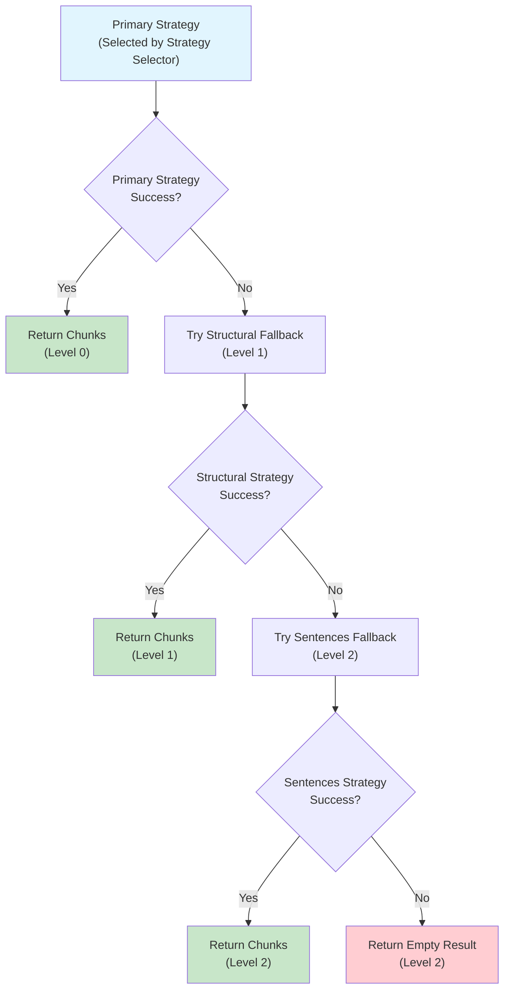
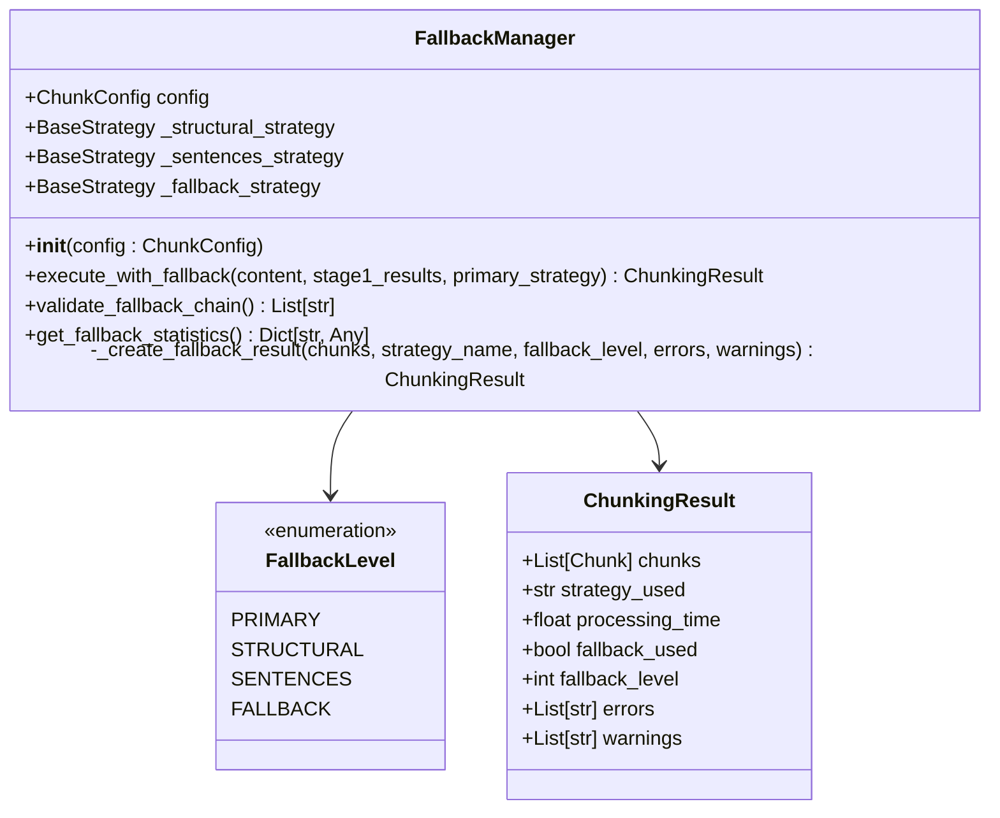
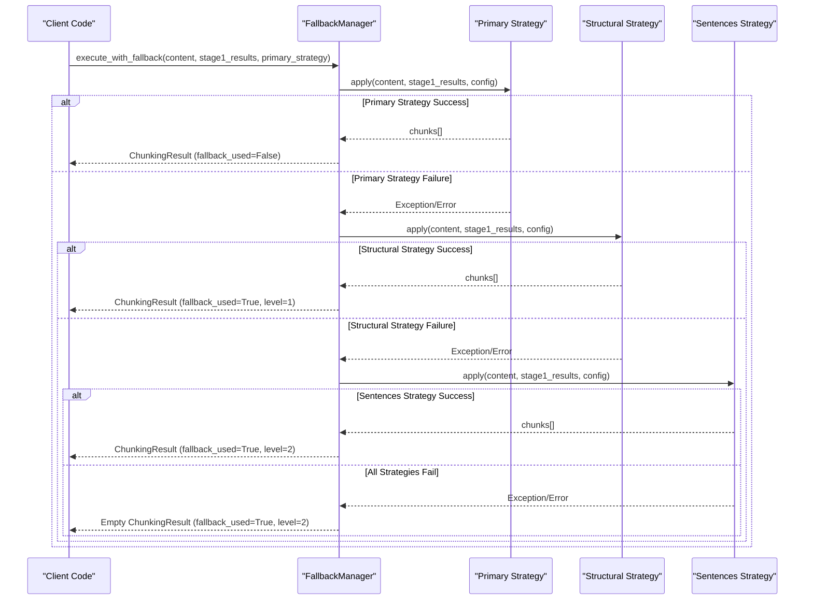
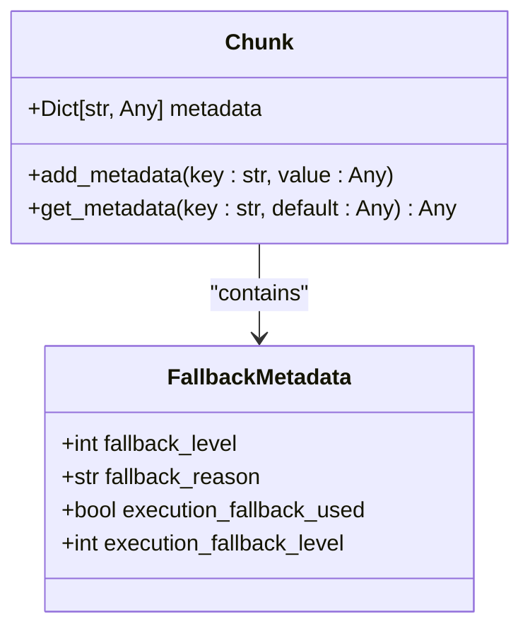

# Fallback Mechanism

<cite>
**Referenced Files in This Document**
- [fallback_manager.py](file://markdown_chunker/chunker/components/fallback_manager.py)
- [test_fallback_manager.py](file://tests/chunker/test_components/test_fallback_manager.py)
- [test_fallback_manager_integration.py](file://tests/chunker/test_fallback_manager_integration.py)
- [test_fallback_properties.py](file://tests/chunker/test_fallback_properties.py)
- [test_fallback_metadata_preservation.py](file://tests/chunker/test_fallback_metadata_preservation.py)
- [types.py](file://markdown_chunker/chunker/types.py)
- [sentences_strategy.py](file://markdown_chunker/chunker/strategies/sentences_strategy.py)
- [structural_strategy.py](file://markdown_chunker/chunker/strategies/structural_strategy.py)
- [basic_usage.py](file://examples/basic_usage.py)
- [api_usage.py](file://examples/api_usage.py)
</cite>

## Table of Contents
1. [Introduction](#introduction)
2. [Fallback Chain Architecture](#fallback-chain-architecture)
3. [FallbackManager Class](#fallbackmanager-class)
4. [Configuration Options](#configuration-options)
5. [Fallback Levels and Strategies](#fallback-levels-and-strategies)
6. [Metadata and Monitoring](#metadata-and-monitoring)
7. [Testing and Validation](#testing-and-validation)
8. [Common Issues and Solutions](#common-issues-and-solutions)
9. [Best Practices](#best-practices)
10. [Troubleshooting Guide](#troubleshooting-guide)

## Introduction

The fallback mechanism in the Markdown Chunker ensures chunking reliability by implementing a 3-level error recovery system. This system guarantees that content will always be chunked successfully, even when primary strategies fail due to unexpected content patterns, parsing errors, or configuration mismatches.

The fallback system operates on the principle that "chunking should never fail" - if the primary strategy encounters an error, the system automatically attempts alternative approaches until either successful chunking occurs or all strategies are exhausted.

## Fallback Chain Architecture

The fallback mechanism implements a hierarchical three-level system designed to progressively handle increasingly difficult content scenarios:



**Diagram sources**
- [fallback_manager.py](file://markdown_chunker/chunker/components/fallback_manager.py#L60-L175)

### Key Design Principles

1. **Progressive Degradation**: Each fallback level represents a simpler, more reliable strategy
2. **Content Preservation**: All strategies guarantee content won't be lost
3. **Automatic Recovery**: No manual intervention required
4. **Transparent Monitoring**: Full visibility into fallback usage and reasons

**Section sources**
- [fallback_manager.py](file://markdown_chunker/chunker/components/fallback_manager.py#L31-L45)

## FallbackManager Class

The [`FallbackManager`](file://markdown_chunker/chunker/components/fallback_manager.py#L31-L310) class serves as the central orchestrator for the fallback system, managing strategy execution and error recovery.

### Class Initialization

The FallbackManager requires a [`ChunkConfig`](file://markdown_chunker/chunker/types.py#L498-L608) object for configuration:



**Diagram sources**
- [fallback_manager.py](file://markdown_chunker/chunker/components/fallback_manager.py#L31-L310)
- [types.py](file://markdown_chunker/chunker/types.py#L322-L495)

### Core Methods

#### execute_with_fallback Method

The [`execute_with_fallback`](file://markdown_chunker/chunker/components/fallback_manager.py#L60-L175) method implements the complete fallback orchestration:



**Diagram sources**
- [fallback_manager.py](file://markdown_chunker/chunker/components/fallback_manager.py#L60-L175)

**Section sources**
- [fallback_manager.py](file://markdown_chunker/chunker/components/fallback_manager.py#L60-L175)

## Configuration Options

The fallback behavior is controlled through several configuration parameters in [`ChunkConfig`](file://markdown_chunker/chunker/types.py#L498-L608):

### enable_fallback Parameter

The [`enable_fallback`](file://markdown_chunker/chunker/types.py#L601) flag controls whether the fallback system is active:

| Value | Behavior | Use Case |
|-------|----------|----------|
| `True` (Default) | Enables complete fallback chain | Production environments requiring reliability |
| `False` | Disables fallback, primary strategy only | Performance-critical scenarios where failure is acceptable |

### fallback_strategy Parameter

Controls which strategy is used as the ultimate fallback:

| Value | Strategy | Use Case |
|-------|----------|----------|
| `"sentences"` (Default) | SentencesStrategy | Universal fallback for any content type |
| `"structural"` | StructuralStrategy | Structured content fallback |

### max_fallback_level Parameter

Limits the depth of fallback attempts:

| Value | Description | Impact |
|-------|-------------|---------|
| `4` (Default) | Up to 3 fallback levels | Balanced reliability vs performance |
| `2` | Primary + 2 fallbacks | Conservative approach |
| `1` | Primary only | Minimal overhead |

**Section sources**
- [types.py](file://markdown_chunker/chunker/types.py#L601-L603)

## Fallback Levels and Strategies

### Level 0: Primary Strategy (No Fallback)

The primary strategy is selected by the strategy selector based on content analysis and configuration thresholds. This level represents the optimal chunking approach for the given content.

**Characteristics:**
- Uses the most appropriate strategy for the content type
- Optimized for semantic preservation
- Fastest execution time
- No fallback metadata added

### Level 1: Structural Fallback

The [`StructuralStrategy`](file://markdown_chunker/chunker/strategies/structural_strategy.py#L55-L200) provides header-based chunking for structured documents:

**When Structural Fallback is Triggered:**
- Primary strategy throws an exception
- Primary strategy returns empty chunks
- Primary strategy is the SentencesStrategy itself

**Structural Strategy Features:**
- Preserves header hierarchy in metadata
- Creates semantically meaningful sections
- Supports multi-level structures (H1-H6)
- Maintains section path information

**Quality Score Calculation:**
The structural strategy calculates quality based on:
- Header count (≥3 headers: +0.3, ≥5: +0.4, ≥10: +0.5)
- Hierarchy depth (≥2 levels: +0.1, ≥3: +0.2, ≥4: +0.3)
- Structure clarity (+0.2 bonus for clear hierarchy)
- Code content penalty (×0.5 if code_ratio > 0.5)

### Level 2: Sentences Fallback

The [`SentencesStrategy`](file://markdown_chunker/chunker/strategies/sentences_strategy.py#L21-L200) serves as the universal fallback, guaranteed to work for any content:

**When Sentences Fallback is Triggered:**
- Structural strategy fails
- Primary strategy consistently fails
- All other strategies exhausted

**Sentences Strategy Features:**
- Always returns chunks (guaranteed success)
- Splits text into sentences using regex patterns
- Groups sentences respecting size limits
- Preserves paragraph boundaries when possible
- Works with any content type

**Sentence Boundary Patterns:**
- Standard endings: `.?!` followed by space/newline
- End-of-line endings
- Endings before quotes: `'"`
- Handles international punctuation

**Quality Score Calculation:**
Base score of 0.3 with penalties for structured content:
- Code content: -0.1 per 10% code ratio
- Headers: -0.1 per 10% header ratio  
- Lists: -0.05 per 10% list ratio
- Tables: -0.05 per 10% table ratio
- Bonus for simple text: +0.2 for high text_ratio, +0.1 for low complexity

**Section sources**
- [fallback_manager.py](file://markdown_chunker/chunker/components/fallback_manager.py#L22-L29)
- [structural_strategy.py](file://markdown_chunker/chunker/strategies/structural_strategy.py#L140-L196)
- [sentences_strategy.py](file://markdown_chunker/chunker/strategies/sentences_strategy.py#L76-L126)

## Metadata and Monitoring

### Fallback Metadata

Each chunk produced during fallback includes comprehensive metadata for tracking and analysis:



**Diagram sources**
- [fallback_manager.py](file://markdown_chunker/chunker/components/fallback_manager.py#L198-L204)

#### Metadata Fields

| Field | Type | Description | Values |
|-------|------|-------------|--------|
| `fallback_level` | Integer | Level of fallback used (0-2) | 0=primary, 1=structural, 2=sentences |
| `fallback_reason` | String | Explanation for fallback usage | "Primary strategy failed, used structural" |
| `execution_fallback_used` | Boolean | Legacy fallback tracking | `True` when fallback occurred |
| `execution_fallback_level` | Integer | Legacy fallback level | Same as `fallback_level` |

### Monitoring and Statistics

The FallbackManager provides several methods for monitoring fallback usage:

#### validate_fallback_chain()

Validates the fallback configuration and reports issues:

```python
issues = manager.validate_fallback_chain()
# Returns: ["Fallback is disabled in configuration"]
```

#### get_fallback_statistics()

Provides statistical information about fallback usage:

```python
stats = manager.get_fallback_statistics()
# Returns: {
#   "fallback_enabled": True,
#   "max_fallback_level": 2,
#   "structural_strategy": "structural",
#   "sentences_strategy": "sentences"
# }
```

**Section sources**
- [fallback_manager.py](file://markdown_chunker/chunker/components/fallback_manager.py#L215-L244)
- [test_fallback_manager.py](file://tests/chunker/test_components/test_fallback_manager.py#L216-L235)

## Testing and Validation

### validate_fallback_chain Utility

The [`validate_fallback_chain`](file://markdown_chunker/chunker/components/fallback_manager.py#L269-L309) function tests strategies against content to evaluate fallback behavior:

```python
results = validate_fallback_chain(
    content="Test content",
    config=ChunkConfig.default(),
    strategies=[strategy1, strategy2, strategy3]
)
```

**Test Results Structure:**
```python
{
    "strategy_name": {
        "success": True/False,
        "chunk_count": int,
        "fallback_used": True/False,
        "fallback_level": int,
        "strategy_used": str,
        "errors": int,
        "warnings": int
    }
}
```

### Property-Based Testing

The fallback system includes comprehensive property-based tests to ensure reliability:

```python
@given(content=markdown_content(), stage1=mock_stage1_results())
def test_property_fallback_metadata_correct(content, stage1):
    """Property: Fallback chunks have correct metadata."""
    config = ChunkConfig(max_chunk_size=2000)
    manager = FallbackManager(config)
    
    failing_strategy = FailingStrategy()
    result = manager.execute_with_fallback(content, stage1, failing_strategy)
    
    # Verify fallback metadata in chunks
    for chunk in result.chunks:
        assert "fallback_level" in chunk.metadata
        assert chunk.metadata["fallback_level"] in [1, 2]
        assert "fallback_reason" in chunk.metadata
```

### Integration Testing

The fallback system undergoes extensive integration testing to ensure proper coordination with the broader chunking pipeline:

**Section sources**
- [test_fallback_manager.py](file://tests/chunker/test_components/test_fallback_manager.py#L274-L289)
- [test_fallback_properties.py](file://tests/chunker/test_fallback_properties.py#L205-L233)

## Common Issues and Solutions

### Issue 1: All Strategies Fail

**Symptoms:**
- Empty result with `fallback_used=True` and `fallback_level=2`
- Error messages indicating all strategies failed
- No chunks returned despite content being present

**Causes:**
- Extremely malformed content
- Memory constraints preventing strategy execution
- Configuration issues causing all strategies to reject content

**Solutions:**
1. **Verify Content Integrity**: Ensure input content is valid UTF-8
2. **Increase Memory Allocation**: Check system resources
3. **Review Configuration**: Validate chunk size and strategy thresholds
4. **Enable Debug Logging**: Capture detailed error information

### Issue 2: Fallback Not Triggering

**Symptoms:**
- Primary strategy fails but no fallback occurs
- Empty result without fallback metadata
- Expected fallback behavior not observed

**Causes:**
- `enable_fallback` set to `False`
- Configuration validation blocking fallback
- Exception in fallback strategy itself

**Solutions:**
1. **Check Configuration**: Verify `enable_fallback=True`
2. **Validate Fallback Chain**: Use `validate_fallback_chain()` method
3. **Test Individual Strategies**: Isolate which strategies are failing
4. **Review Error Logs**: Check for exceptions in fallback strategies

### Issue 3: Incorrect Fallback Level

**Symptoms:**
- Wrong fallback level reported (`fallback_level=0` when fallback occurred)
- Conflicting metadata values
- Inconsistent fallback behavior

**Causes:**
- Metadata enrichment conflicts
- Race conditions in strategy execution
- Configuration inconsistencies

**Solutions:**
1. **Verify Metadata Consistency**: Check that all chunks have identical fallback metadata
2. **Review Strategy Implementation**: Ensure strategies don't modify fallback metadata
3. **Test with Simple Content**: Isolate the issue with minimal examples

### Issue 4: Performance Degradation

**Symptoms:**
- Slow chunking with fallback enabled
- High memory usage during fallback
- Timeout errors during strategy execution

**Causes:**
- Large content triggering multiple fallback attempts
- Inefficient fallback strategies
- Resource constraints

**Solutions:**
1. **Optimize Content**: Reduce content size or complexity
2. **Adjust Configuration**: Increase timeouts or reduce chunk sizes
3. **Monitor Resources**: Track memory and CPU usage
4. **Consider Strategy Selection**: Use more targeted strategy selection

**Section sources**
- [test_fallback_manager.py](file://tests/chunker/test_components/test_fallback_manager.py#L158-L182)
- [test_fallback_manager_integration.py](file://tests/chunker/test_fallback_manager_integration.py#L130-L138)

## Best Practices

### Configuration Guidelines

1. **Enable Fallback in Production**: Always set `enable_fallback=True` for reliable operation
2. **Balance Performance vs Reliability**: Adjust `max_chunk_size` and `max_fallback_level` based on requirements
3. **Monitor Fallback Usage**: Track fallback rates to identify content patterns
4. **Test Edge Cases**: Validate fallback behavior with malformed content

### Content Preparation

1. **Validate Input**: Ensure content is UTF-8 encoded
2. **Handle Large Documents**: Consider streaming for very large content
3. **Prepare Structured Content**: Use consistent formatting for better strategy selection
4. **Test with Real Data**: Validate against representative content samples

### Monitoring and Maintenance

1. **Track Fallback Metrics**: Monitor fallback rates and levels
2. **Log Fallback Events**: Record when fallback occurs for analysis
3. **Update Strategies**: Keep fallback strategies updated with new content types
4. **Performance Testing**: Regularly test fallback performance under load

### Error Handling

1. **Graceful Degradation**: Expect fallback to occur occasionally
2. **Content Preservation**: Verify all content is included in final chunks
3. **Metadata Validation**: Ensure fallback metadata is consistent
4. **Recovery Procedures**: Implement procedures for fallback failures

## Troubleshooting Guide

### Step 1: Verify Configuration

```python
# Check fallback configuration
config = ChunkConfig.default()
print(f"Fallback enabled: {config.enable_fallback}")

# Validate fallback chain
from markdown_chunker.chunker.components.fallback_manager import FallbackManager
manager = FallbackManager(config)
issues = manager.validate_fallback_chain()
if issues:
    print(f"Configuration issues: {issues}")
```

### Step 2: Test Individual Strategies

```python
# Test strategies individually
from markdown_chunker.chunker.components.fallback_manager import validate_fallback_chain
results = validate_fallback_chain(
    content="Sample content",
    config=config,
    strategies=[strategy1, strategy2, strategy3]
)
print(f"Strategy test results: {results}")
```

### Step 3: Analyze Fallback Behavior

```python
# Enable debug logging
import logging
logging.basicConfig(level=logging.DEBUG)

# Test with problematic content
try:
    result = chunker.chunk(problematic_content)
    print(f"Fallback used: {result.fallback_used}")
    print(f"Fallback level: {result.fallback_level}")
    for chunk in result.chunks:
        print(f"Chunk metadata: {chunk.metadata}")
except Exception as e:
    print(f"Unexpected error: {e}")
```

### Step 4: Review Error Patterns

Common error patterns and their solutions:

| Error Pattern | Likely Cause | Solution |
|---------------|--------------|----------|
| `All strategies failed` | Malformed content | Validate input encoding and structure |
| `Memory allocation failed` | Large content | Reduce chunk size or increase memory |
| `Timeout during strategy` | Complex content | Increase timeout or simplify content |
| `Empty chunks returned` | Strategy rejection | Adjust strategy thresholds |

### Step 5: Performance Optimization

```python
# Optimize for performance
config = ChunkConfig(
    max_chunk_size=2048,  # Reduce chunk size
    enable_fallback=True,  # Keep fallback enabled
    max_fallback_level=2   # Limit fallback depth
)

# Monitor performance
import time
start_time = time.time()
result = chunker.chunk_with_analysis(content)
processing_time = time.time() - start_time
print(f"Processing time: {processing_time:.3f}s")
```

**Section sources**
- [test_fallback_manager.py](file://tests/chunker/test_components/test_fallback_manager.py#L184-L202)
- [basic_usage.py](file://examples/basic_usage.py#L84-L86)