# Fallback Mechanisms

<cite>
**Referenced Files in This Document**
- [fallback_manager.py](file://markdown_chunker_legacy/chunker/components/fallback_manager.py)
- [test_fallback_manager.py](file://tests/chunker/test_components/test_fallback_manager.py)
- [test_fallback_manager_integration.py](file://tests/chunker/test_fallback_manager_integration.py)
- [test_fallback_properties.py](file://tests/chunker/test_fallback_properties.py)
- [orchestrator.py](file://markdown_chunker_legacy/chunker/orchestrator.py)
- [core.py](file://markdown_chunker_legacy/chunker/core.py)
- [types.py](file://markdown_chunker_legacy/chunker/types.py)
- [sentences_strategy.py](file://markdown_chunker_legacy/chunker/strategies/sentences_strategy.py)
- [structural_strategy.py](file://markdown_chunker_legacy/chunker/strategies/structural_strategy.py)
- [errors.py](file://markdown_chunker_legacy/chunker/errors.py)
</cite>

## Table of Contents
1. [Introduction](#introduction)
2. [Architecture Overview](#architecture-overview)
3. [FallbackManager Implementation](#fallbackmanager-implementation)
4. [Multi-Level Fallback Strategy](#multi-level-fallback-strategy)
5. [Error Detection and Propagation](#error-detection-and-propagation)
6. [Orchestrator Coordination](#orchestrator-coordination)
7. [Configuration Options](#configuration-options)
8. [Error Handling and Recovery](#error-handling-and-recovery)
9. [Testing and Validation](#testing-and-validation)
10. [Custom Fallback Strategies](#custom-fallback-strategies)
11. [Common Issues and Solutions](#common-issues-and-solutions)
12. [Best Practices](#best-practices)

## Introduction

The Markdown chunker implements a sophisticated fallback mechanism designed to ensure robustness and reliability when primary chunking strategies fail. This system provides a three-tier fallback chain that guarantees chunking always succeeds, even with problematic or edge-case content. The fallback mechanism operates transparently, automatically detecting failures and seamlessly transitioning to more resilient strategies.

The fallback system serves several critical purposes:
- **Guaranteed Success**: Ensures chunking never fails completely
- **Graceful Degradation**: Maintains functionality when specialized strategies fail
- **Content Preservation**: Minimizes data loss during fallback transitions
- **Error Transparency**: Provides detailed error information for debugging
- **Performance Monitoring**: Tracks fallback usage for system optimization

## Architecture Overview

The fallback mechanism operates within a layered architecture that separates concerns between strategy selection, execution, and error recovery.

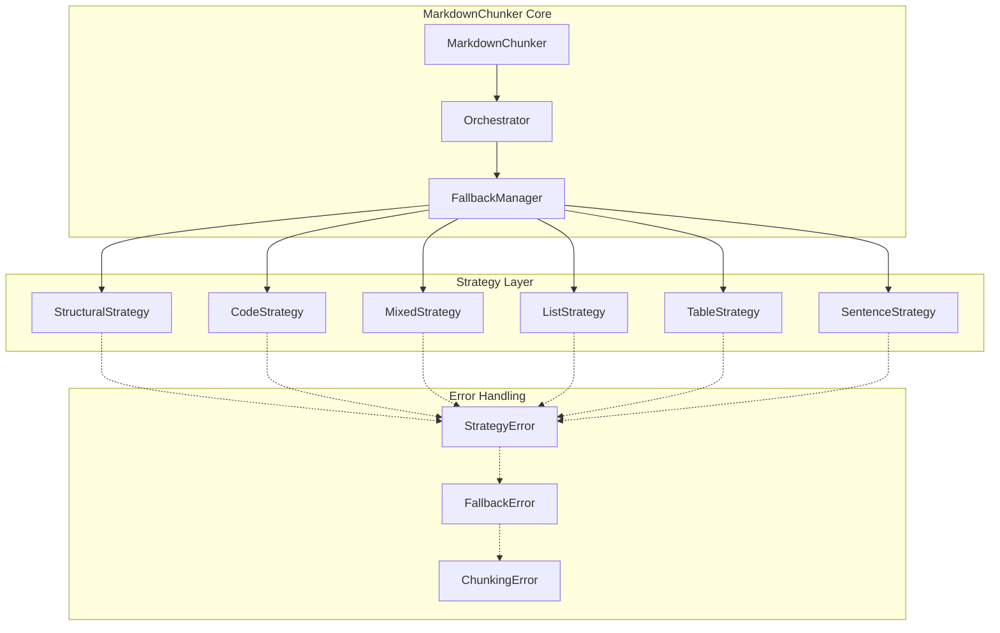

**Diagram sources**
- [core.py](file://markdown_chunker_legacy/chunker/core.py#L41-L110)
- [orchestrator.py](file://markdown_chunker_legacy/chunker/orchestrator.py#L44-L85)
- [fallback_manager.py](file://markdown_chunker_legacy/chunker/components/fallback_manager.py#L31-L60)

**Section sources**
- [core.py](file://markdown_chunker_legacy/chunker/core.py#L41-L110)
- [orchestrator.py](file://markdown_chunker_legacy/chunker/orchestrator.py#L44-L85)

## FallbackManager Implementation

The `FallbackManager` class serves as the central coordinator for fallback operations, implementing a three-level fallback chain with sophisticated error detection and recovery mechanisms.

### Core Components

The FallbackManager consists of several key components:

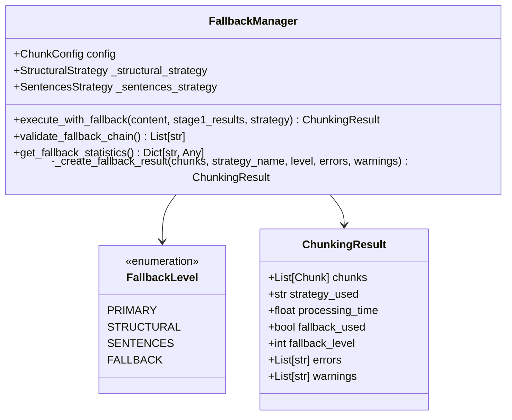

**Diagram sources**
- [fallback_manager.py](file://markdown_chunker_legacy/chunker/components/fallback_manager.py#L31-L60)
- [types.py](file://markdown_chunker_legacy/chunker/types.py#L325-L340)

### Initialization and Configuration

The FallbackManager initializes with a configuration object and creates instances of specialized fallback strategies:

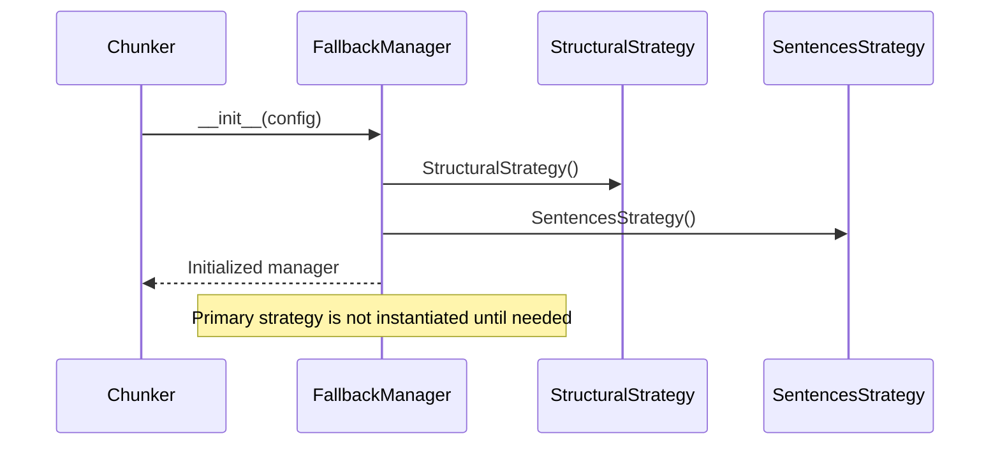

**Diagram sources**
- [fallback_manager.py](file://markdown_chunker_legacy/chunker/components/fallback_manager.py#L47-L58)

**Section sources**
- [fallback_manager.py](file://markdown_chunker_legacy/chunker/components/fallback_manager.py#L47-L58)

## Multi-Level Fallback Strategy

The fallback system implements a carefully designed three-level hierarchy that provides progressively more robust chunking approaches.

### Level 0: Primary Strategy

The primary strategy represents the optimal choice for the given content type. This level uses the strategy selected by the strategy selector or manually specified by the user.

**Characteristics:**
- Highest priority and quality score
- Optimized for specific content types
- Expected to succeed for well-formed documents
- Minimal fallback probability

### Level 1: Structural Fallback

When the primary strategy fails, the system attempts the structural fallback strategy. This strategy handles documents with header hierarchies and structured content.

**Key Features:**
- Preserves header relationships and document structure
- Handles multi-level header hierarchies
- Combines short sections to meet size requirements
- Maintains semantic coherence

### Level 2: Sentences Fallback

The sentences fallback serves as the universal safety net, capable of handling any content type by splitting text into sentences and grouping them appropriately.

**Reliability Factors:**
- Always available regardless of content type
- Handles malformed or unusual content gracefully
- Provides predictable, consistent chunking behavior
- Minimal processing requirements

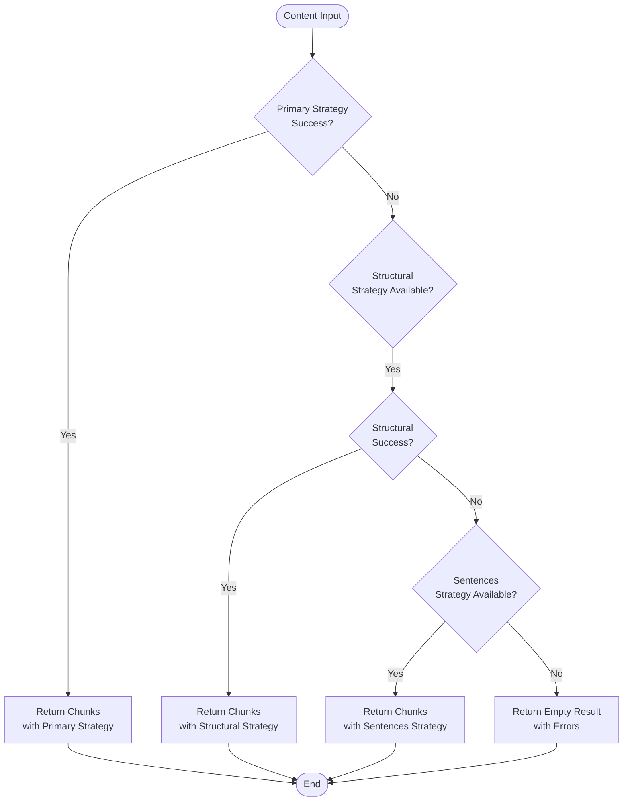

**Diagram sources**
- [fallback_manager.py](file://markdown_chunker_legacy/chunker/components/fallback_manager.py#L60-L177)

**Section sources**
- [fallback_manager.py](file://markdown_chunker_legacy/chunker/components/fallback_manager.py#L60-L177)

## Error Detection and Propagation

The fallback system implements comprehensive error detection and propagation mechanisms to ensure transparent error reporting and effective recovery.

### Error Detection Mechanisms

The system detects failures through multiple pathways:

1. **Exception Handling**: Catches all exceptions thrown by strategies
2. **Empty Result Detection**: Identifies when strategies return empty chunk lists
3. **Quality Thresholds**: Evaluates strategy performance against expectations
4. **Content Validation**: Verifies chunk completeness and integrity

### Error Classification

Errors are classified into several categories:

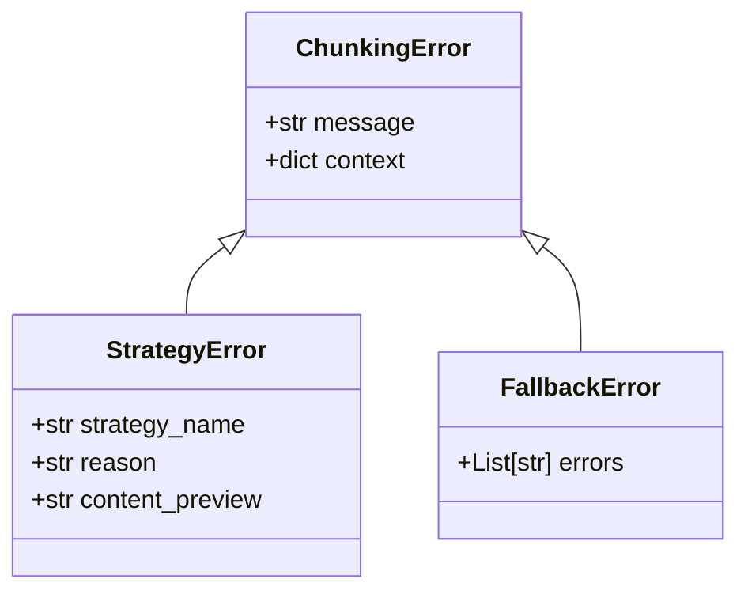

**Diagram sources**
- [errors.py](file://markdown_chunker_legacy/chunker/errors.py#L11-L210)

### Error Propagation Pipeline

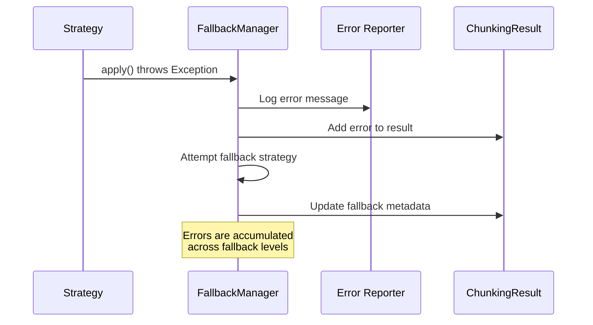

**Diagram sources**
- [fallback_manager.py](file://markdown_chunker_legacy/chunker/components/fallback_manager.py#L106-L110)

**Section sources**
- [errors.py](file://markdown_chunker_legacy/chunker/errors.py#L11-L210)

## Orchestrator Coordination

The orchestrator manages the overall chunking process and coordinates fallback decisions through strategic integration points.

### Strategy Selection Integration

The orchestrator integrates fallback management into the strategy selection process:

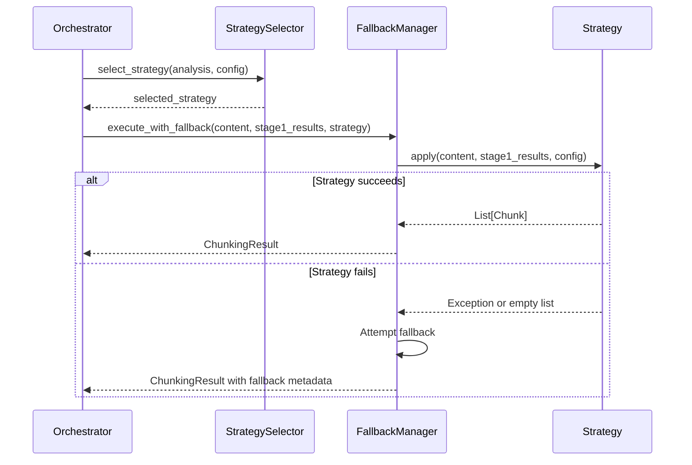

**Diagram sources**
- [orchestrator.py](file://markdown_chunker_legacy/chunker/orchestrator.py#L240-L370)

### Manual Strategy Override Handling

When users specify manual strategies, the orchestrator applies fallback differently:

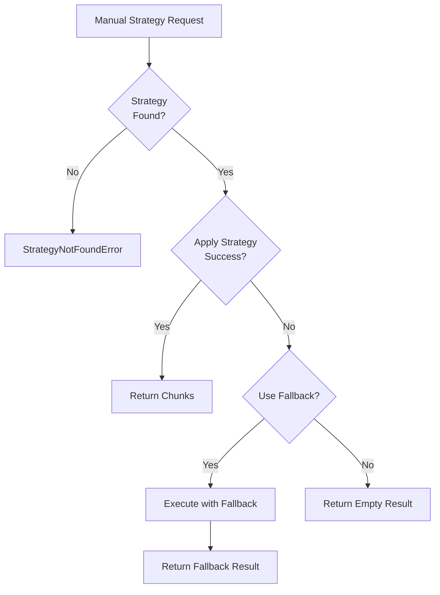

**Diagram sources**
- [orchestrator.py](file://markdown_chunker_legacy/chunker/orchestrator.py#L264-L311)

**Section sources**
- [orchestrator.py](file://markdown_chunker_legacy/chunker/orchestrator.py#L240-L370)

## Configuration Options

The fallback system provides extensive configuration options to customize behavior for different use cases.

### Core Configuration Parameters

| Parameter | Type | Default | Description |
|-----------|------|---------|-------------|
| `enable_fallback` | bool | True | Enables/disables fallback mechanism |
| `fallback_strategy` | str | "sentences" | Primary fallback strategy |
| `max_fallback_level` | int | 4 | Maximum fallback depth |
| `allow_oversize` | bool | True | Permit oversized chunks for integrity |

### Strategy-Specific Settings

Each strategy contributes to fallback behavior through its configuration:

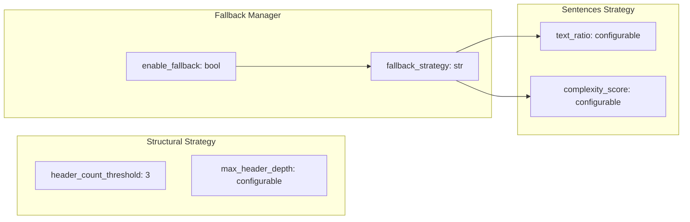

**Diagram sources**
- [types.py](file://markdown_chunker_legacy/chunker/types.py#L500-L620)

### Advanced Configuration Options

The system supports advanced configuration for specialized scenarios:

- **Timeout Thresholds**: Control processing time limits
- **Memory Constraints**: Manage resource usage during fallback
- **Logging Levels**: Configure error reporting verbosity
- **Performance Monitoring**: Track fallback effectiveness

**Section sources**
- [types.py](file://markdown_chunker_legacy/chunker/types.py#L500-L620)

## Error Handling and Recovery

The fallback system implements sophisticated error handling and recovery mechanisms to ensure system stability and data integrity.

### Recovery Strategies

The system employs multiple recovery strategies based on error characteristics:

1. **Immediate Fallback**: When primary strategy fails
2. **Graceful Degradation**: When strategy returns empty chunks
3. **Universal Fallback**: When all strategies fail
4. **Emergency Mode**: When fallback itself encounters issues

### Error Context Preservation

The system preserves error context throughout the fallback process:

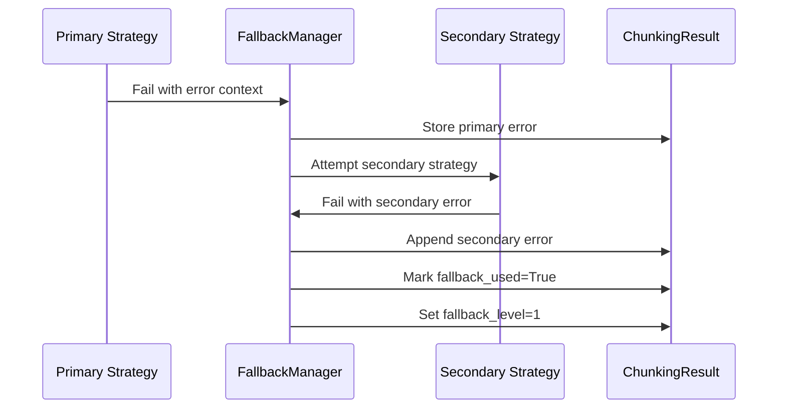

**Diagram sources**
- [fallback_manager.py](file://markdown_chunker_legacy/chunker/components/fallback_manager.py#L106-L110)

### Recovery Validation

After fallback execution, the system validates recovery success:

- **Chunk Count Verification**: Ensures at least one chunk is produced
- **Content Completeness**: Validates no significant content loss
- **Metadata Integrity**: Confirms fallback metadata is properly applied

**Section sources**
- [fallback_manager.py](file://markdown_chunker_legacy/chunker/components/fallback_manager.py#L106-L177)

## Testing and Validation

The fallback system includes comprehensive testing to ensure reliability and correctness.

### Unit Testing Framework

The test suite covers multiple scenarios:

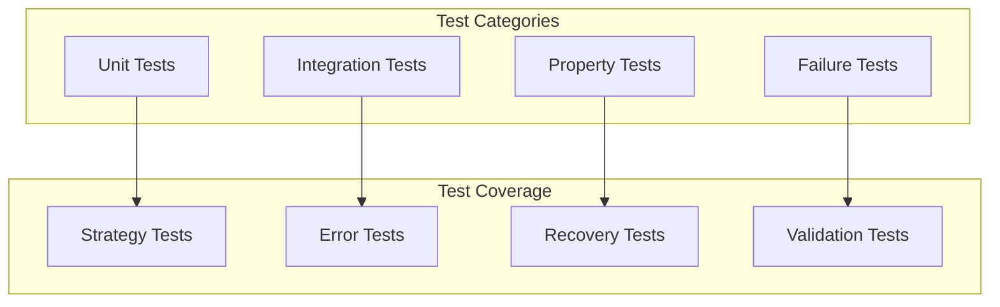

**Diagram sources**
- [test_fallback_manager.py](file://tests/chunker/test_components/test_fallback_manager.py#L1-L371)
- [test_fallback_properties.py](file://tests/chunker/test_fallback_properties.py#L1-L504)

### Property-Based Testing

The system uses property-based testing to validate fallback behavior:

- **Deterministic Behavior**: Ensures consistent results for same inputs
- **Content Preservation**: Validates minimal data loss during fallback
- **Error Accumulation**: Tests proper error message collection
- **Fallback Levels**: Verifies correct fallback level assignment

### Integration Testing

Integration tests validate fallback behavior within the complete system:

- **End-to-End Workflows**: Tests complete chunking pipelines
- **Error Propagation**: Validates error handling through the stack
- **Performance Impact**: Measures fallback overhead
- **Resource Management**: Ensures proper cleanup during failures

**Section sources**
- [test_fallback_manager.py](file://tests/chunker/test_components/test_fallback_manager.py#L1-L371)
- [test_fallback_properties.py](file://tests/chunker/test_fallback_properties.py#L1-L504)

## Custom Fallback Strategies

The system supports custom fallback strategies for specialized requirements.

### Strategy Implementation Requirements

Custom fallback strategies must implement the BaseStrategy interface:

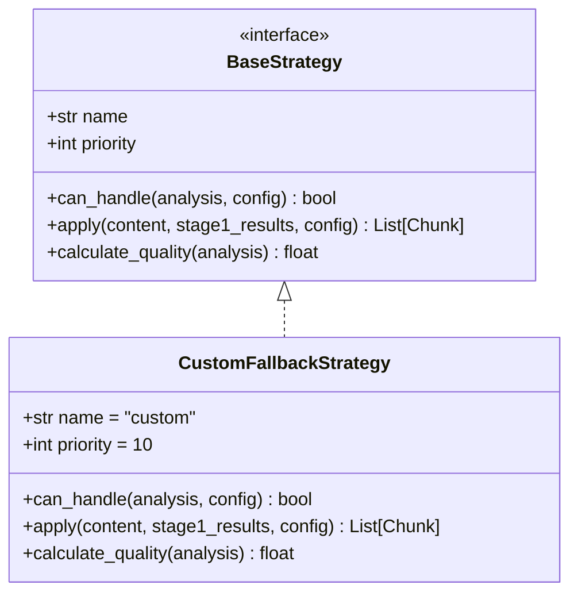

**Diagram sources**
- [fallback_manager.py](file://markdown_chunker_legacy/chunker/components/fallback_manager.py#L14-L18)

### Integration with Fallback System

Custom strategies integrate seamlessly with the fallback system:

1. **Registration**: Add strategy to the strategy selector
2. **Priority Assignment**: Set appropriate priority for fallback ordering
3. **Quality Calculation**: Implement quality scoring for strategy selection
4. **Error Handling**: Ensure proper exception handling

### Best Practices for Custom Strategies

- **Robust Error Handling**: Catch and handle all potential exceptions
- **Content Validation**: Verify input validity before processing
- **Performance Optimization**: Minimize processing time for fallback scenarios
- **Metadata Enhancement**: Provide meaningful metadata for debugging

**Section sources**
- [core.py](file://markdown_chunker_legacy/chunker/core.py#L516-L567)

## Common Issues and Solutions

The fallback system addresses several common issues that can arise during chunking operations.

### Infinite Fallback Loops

The system prevents infinite fallback loops through several mechanisms:

1. **Strategy Deduplication**: Prevents attempting the same strategy multiple times
2. **Fallback Level Tracking**: Limits fallback depth to prevent recursion
3. **Empty Result Detection**: Stops fallback when no chunks are produced
4. **Exception Limiting**: Caps the number of consecutive failures

### Memory and Performance Issues

The system manages memory and performance through:

- **Lazy Loading**: Strategies are instantiated only when needed
- **Resource Cleanup**: Proper cleanup of temporary resources
- **Processing Time Monitoring**: Early termination of slow strategies
- **Memory Usage Limits**: Prevention of excessive memory consumption

### Data Integrity Concerns

Data integrity is maintained through:

- **Content Validation**: Verification of chunk completeness
- **Metadata Preservation**: Maintenance of original content information
- **Error Reporting**: Detailed error messages for debugging
- **Fallback Transparency**: Clear indication of fallback usage

### Configuration Conflicts

The system resolves configuration conflicts through:

- **Default Values**: Sensible defaults for all configuration options
- **Validation**: Comprehensive validation of configuration parameters
- **Auto-correction**: Automatic adjustment of invalid configurations
- **Conflict Resolution**: Clear precedence rules for conflicting settings

**Section sources**
- [fallback_manager.py](file://markdown_chunker_legacy/chunker/components/fallback_manager.py#L106-L177)

## Best Practices

Effective use of the fallback mechanism requires adherence to established best practices.

### Configuration Guidelines

- **Enable Fallback**: Always enable fallback for production systems
- **Monitor Usage**: Track fallback rates to identify problematic content
- **Optimize Strategies**: Tune strategy parameters for your content type
- **Set Appropriate Limits**: Configure timeouts and resource limits

### Development Practices

- **Test Fallback Paths**: Ensure all code paths are tested with fallback
- **Validate Error Messages**: Provide clear, actionable error messages
- **Monitor Performance**: Track fallback impact on processing time
- **Document Behavior**: Clearly document fallback behavior for users

### Operational Considerations

- **Fallback Rate Monitoring**: Monitor fallback usage patterns
- **Error Analysis**: Analyze fallback errors to improve strategies
- **Capacity Planning**: Account for fallback overhead in resource planning
- **User Communication**: Inform users when fallback occurs

### Debugging and Troubleshooting

When fallback issues occur:

1. **Check Logs**: Review detailed error logs for failure reasons
2. **Analyze Patterns**: Look for common failure patterns in content
3. **Test Strategies**: Isolate and test individual strategies
4. **Review Configuration**: Verify configuration parameters are appropriate

The fallback mechanism represents a critical component of the Markdown chunker's reliability infrastructure, providing robust error recovery while maintaining data integrity and system performance. Its thoughtful design ensures that chunking operations remain successful even under challenging conditions, making it an essential feature for production deployments.