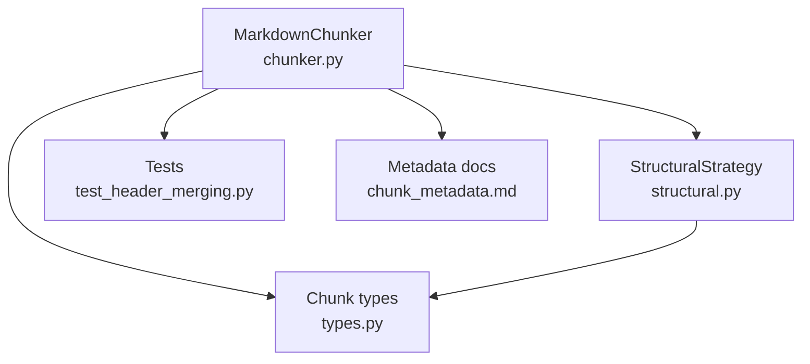
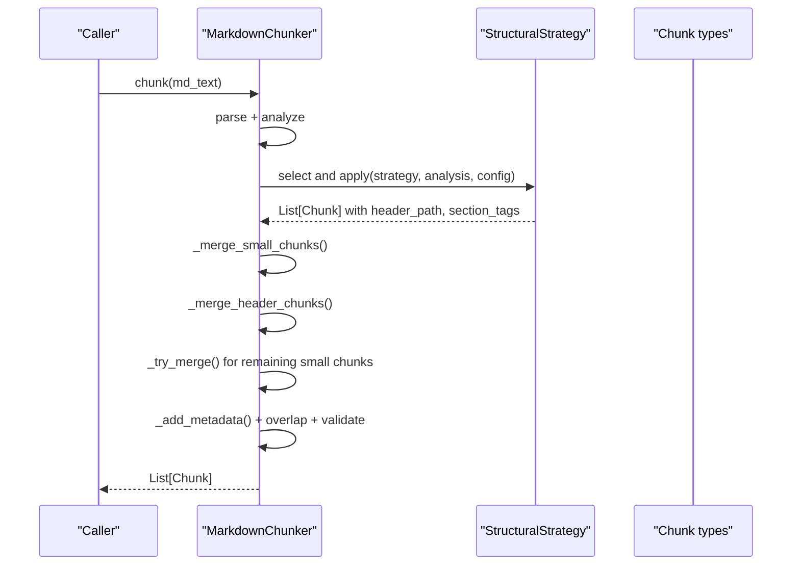
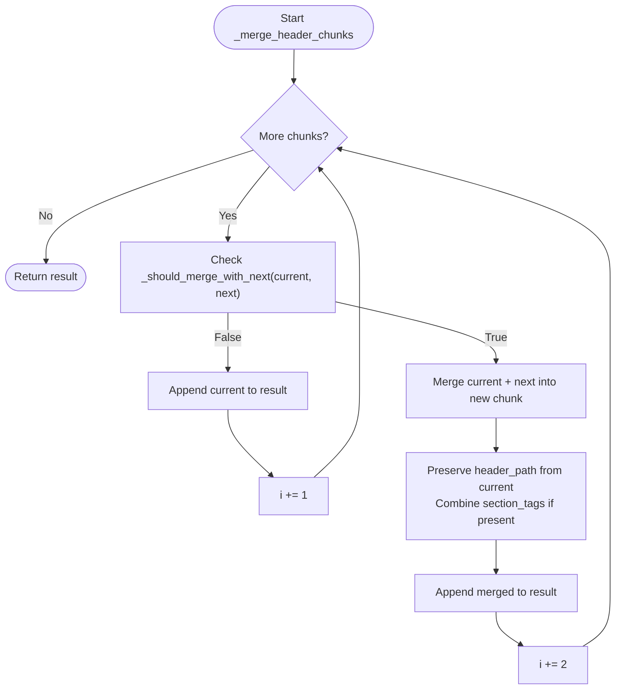
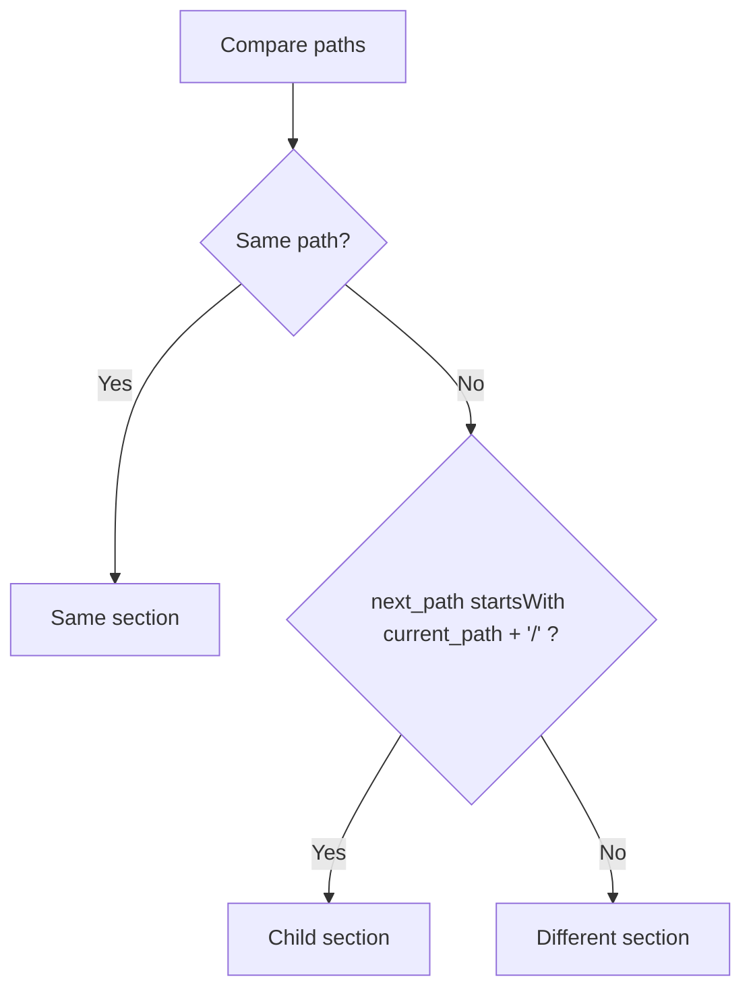
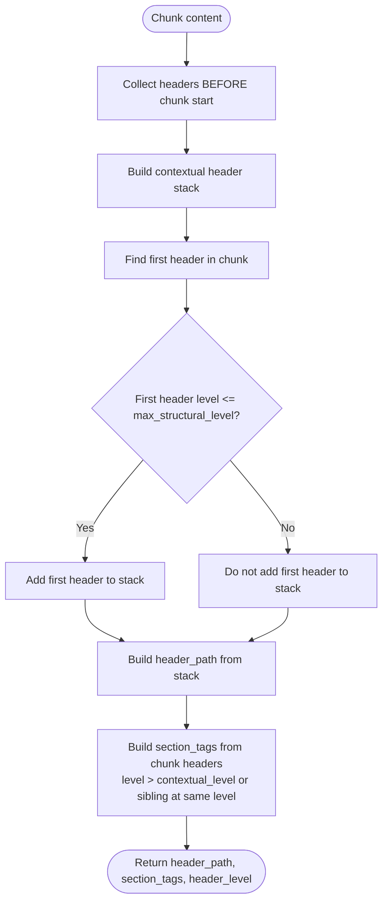
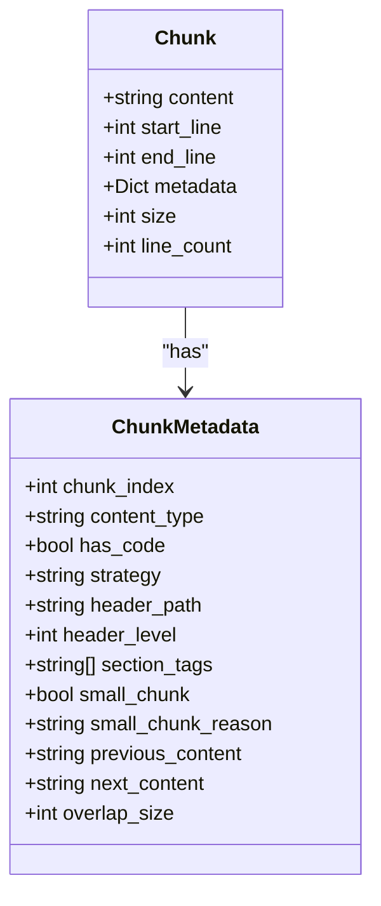
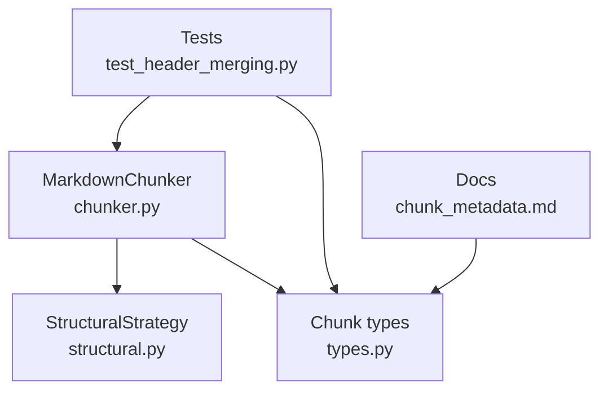

# Header Merging Logic

<cite>
**Referenced Files in This Document**
- [chunker.py](file://markdown_chunker_v2/chunker.py)
- [structural.py](file://markdown_chunker_v2/strategies/structural.py)
- [types.py](file://markdown_chunker_v2/types.py)
- [test_header_merging.py](file://tests/test_header_merging.py)
- [chunk_metadata.md](file://docs/api/chunk_metadata.md)
</cite>

## Table of Contents
1. [Introduction](#introduction)
2. [Project Structure](#project-structure)
3. [Core Components](#core-components)
4. [Architecture Overview](#architecture-overview)
5. [Detailed Component Analysis](#detailed-component-analysis)
6. [Dependency Analysis](#dependency-analysis)
7. [Performance Considerations](#performance-considerations)
8. [Troubleshooting Guide](#troubleshooting-guide)
9. [Conclusion](#conclusion)

## Introduction
This document explains the header merging logic used to improve chunking quality by combining small header-only chunks with their immediate section body. It focuses on the v2 chunker pipeline, how header paths are computed, and how merging decisions are made based on structural context and content characteristics.

## Project Structure
The header merging logic lives in the v2 chunker pipeline and interacts with the structural strategy that builds header paths and section tags. The tests validate expected behavior and edge cases.

**Diagram sources**
- [chunker.py](file://markdown_chunker_v2/chunker.py#L43-L90)
- [structural.py](file://markdown_chunker_v2/strategies/structural.py#L60-L166)
- [types.py](file://markdown_chunker_v2/types.py#L100-L170)
- [test_header_merging.py](file://tests/test_header_merging.py#L1-L193)
- [chunk_metadata.md](file://docs/api/chunk_metadata.md#L104-L110)

**Section sources**
- [chunker.py](file://markdown_chunker_v2/chunker.py#L43-L90)
- [structural.py](file://markdown_chunker_v2/strategies/structural.py#L60-L166)
- [types.py](file://markdown_chunker_v2/types.py#L100-L170)
- [test_header_merging.py](file://tests/test_header_merging.py#L1-L193)
- [chunk_metadata.md](file://docs/api/chunk_metadata.md#L104-L110)

## Core Components
- MarkdownChunker: orchestrates parsing, strategy selection, strategy application, small-chunk merging (including header merging), overlap, metadata addition, and validation.
- StructuralStrategy: splits documents by structural headers, computes header_path and section_tags, and creates chunks with structural semantics.
- Chunk: the unit of output with metadata fields including header_path, header_level, section_tags, content_type, and others.
- Tests: validate header merging behavior and edge cases.

Key responsibilities:
- Header merging runs before size-based merging to reduce isolated header chunks.
- header_path and section_tags are derived from structural headers and contextual logic.
- Preamble chunks are separated and never merged with structural content.

**Section sources**
- [chunker.py](file://markdown_chunker_v2/chunker.py#L263-L307)
- [chunker.py](file://markdown_chunker_v2/chunker.py#L309-L421)
- [structural.py](file://markdown_chunker_v2/strategies/structural.py#L120-L166)
- [types.py](file://markdown_chunker_v2/types.py#L100-L170)
- [test_header_merging.py](file://tests/test_header_merging.py#L1-L193)

## Architecture Overview
The v2 pipeline applies structural strategy to produce chunks with header_path and section_tags. The small-chunk merger then attempts header merging before general size-based merging.

**Diagram sources**
- [chunker.py](file://markdown_chunker_v2/chunker.py#L43-L90)
- [chunker.py](file://markdown_chunker_v2/chunker.py#L263-L307)
- [chunker.py](file://markdown_chunker_v2/chunker.py#L309-L421)
- [structural.py](file://markdown_chunker_v2/strategies/structural.py#L60-L166)
- [types.py](file://markdown_chunker_v2/types.py#L100-L170)

## Detailed Component Analysis

### Header Merging Decision Logic
Header merging occurs during the small-chunk phase and is implemented in two steps:
1. A dedicated pass to merge small header-only chunks with their immediate successor.
2. General size-based merging for remaining small chunks.

The decision to merge a small header-only chunk with the next chunk depends on:
- Header level: only levels 1 and 2 are eligible.
- Size threshold: current header chunk must be under a character threshold (heuristic).
- Content type: current chunk must not be preamble; next chunk must not be preamble.
- Section membership: next chunk must be in the same section or a child section.
- Metadata presence: both chunks must have header_path metadata.

**Diagram sources**
- [chunker.py](file://markdown_chunker_v2/chunker.py#L309-L364)
- [chunker.py](file://markdown_chunker_v2/chunker.py#L366-L421)

**Section sources**
- [chunker.py](file://markdown_chunker_v2/chunker.py#L309-L364)
- [chunker.py](file://markdown_chunker_v2/chunker.py#L366-L421)

### Section Membership and Logical Section Matching
To decide whether the next chunk belongs to the same logical section or is a child:
- header_path values are compared.
- Same section: identical paths.
- Child section: next_path starts with current_path + '/'.
- Preamble chunks are handled specially and never merge with structural content.

**Diagram sources**
- [chunker.py](file://markdown_chunker_v2/chunker.py#L404-L420)

**Section sources**
- [chunker.py](file://markdown_chunker_v2/chunker.py#L404-L420)

### Structural Strategy and Header Path Semantics
The structural strategy builds header_path and section_tags:
- header_path is derived from the contextual header stack (ancestors before chunk start).
- section_tags contains headers deeper than the root section (contextual_level) or siblings of the root (same level).
- max_structural_level controls where chunk boundaries occur but does not affect header_path construction.

**Diagram sources**
- [structural.py](file://markdown_chunker_v2/strategies/structural.py#L200-L237)
- [structural.py](file://markdown_chunker_v2/strategies/structural.py#L239-L270)
- [structural.py](file://markdown_chunker_v2/strategies/structural.py#L271-L338)
- [structural.py](file://markdown_chunker_v2/strategies/structural.py#L390-L481)

**Section sources**
- [structural.py](file://markdown_chunker_v2/strategies/structural.py#L120-L166)
- [structural.py](file://markdown_chunker_v2/strategies/structural.py#L200-L237)
- [structural.py](file://markdown_chunker_v2/strategies/structural.py#L239-L270)
- [structural.py](file://markdown_chunker_v2/strategies/structural.py#L271-L338)
- [structural.py](file://markdown_chunker_v2/strategies/structural.py#L390-L481)

### Chunk Metadata and Preamble Handling
- header_path: hierarchical path to the first structural header in the chunk; preamble uses a special path.
- section_tags: local headers within the chunk’s root section.
- content_type: distinguishes preamble from structural content.
- small_chunk and small_chunk_reason: flags for undersized chunks that cannot merge.

**Diagram sources**
- [types.py](file://markdown_chunker_v2/types.py#L100-L170)
- [chunk_metadata.md](file://docs/api/chunk_metadata.md#L104-L110)

**Section sources**
- [types.py](file://markdown_chunker_v2/types.py#L100-L170)
- [chunk_metadata.md](file://docs/api/chunk_metadata.md#L104-L110)

### Test Coverage and Expected Behavior
The tests validate:
- Small top-level headers merge with child sections.
- Large headers do not merge.
- Level 3+ headers do not trigger merging.
- Preamble is not merged with headers.
- Same-section merging works.
- Metadata is preserved after merge.
- Edge cases: empty document, only headers, no headers, single chunk.

**Section sources**
- [test_header_merging.py](file://tests/test_header_merging.py#L1-L193)

## Dependency Analysis
- MarkdownChunker depends on StructuralStrategy for initial chunking and on Chunk types for metadata.
- StructuralStrategy computes header_path and section_tags used by header merging logic.
- Tests depend on MarkdownChunker and ChunkConfig to exercise merging behavior.

**Diagram sources**
- [chunker.py](file://markdown_chunker_v2/chunker.py#L43-L90)
- [structural.py](file://markdown_chunker_v2/strategies/structural.py#L60-L166)
- [types.py](file://markdown_chunker_v2/types.py#L100-L170)
- [test_header_merging.py](file://tests/test_header_merging.py#L1-L193)
- [chunk_metadata.md](file://docs/api/chunk_metadata.md#L104-L110)

**Section sources**
- [chunker.py](file://markdown_chunker_v2/chunker.py#L43-L90)
- [structural.py](file://markdown_chunker_v2/strategies/structural.py#L60-L166)
- [types.py](file://markdown_chunker_v2/types.py#L100-L170)
- [test_header_merging.py](file://tests/test_header_merging.py#L1-L193)
- [chunk_metadata.md](file://docs/api/chunk_metadata.md#L104-L110)

## Performance Considerations
- Header merging is linear in the number of chunks and performs inexpensive string checks and path comparisons.
- The structural strategy precomputes header_path and section_tags, minimizing repeated computation later.
- Size thresholds and heuristics keep merging lightweight and predictable.

[No sources needed since this section provides general guidance]

## Troubleshooting Guide
Common issues and resolutions:
- Unexpected lack of merging:
  - Verify header level is 1 or 2 and size is below the threshold.
  - Confirm both chunks have header_path metadata and next chunk is not preamble.
  - Ensure the next chunk is in the same section or a child section.
- Preamble not separating:
  - Ensure the first header appears after initial content; StructuralStrategy creates preamble chunks automatically.
- Metadata missing after merge:
  - The merger preserves header_path from the current chunk and combines section_tags when present.

**Section sources**
- [chunker.py](file://markdown_chunker_v2/chunker.py#L309-L421)
- [structural.py](file://markdown_chunker_v2/strategies/structural.py#L83-L99)
- [chunk_metadata.md](file://docs/api/chunk_metadata.md#L104-L110)

## Conclusion
The header merging logic improves chunk quality by combining small header-only chunks with their section body, guided by structural context and metadata. It leverages header_path and section_tags computed by the structural strategy, enforces sensible constraints (levels, size, preamble separation), and integrates cleanly into the v2 pipeline before general size-based merging.