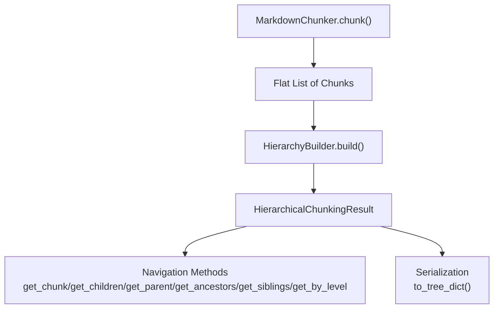
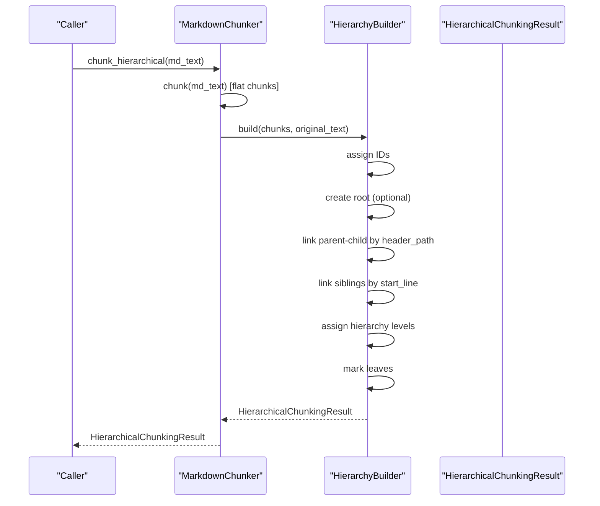
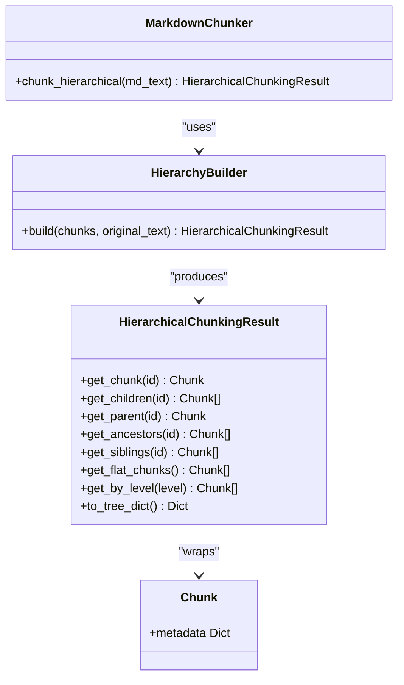

# Hierarchical Chunking

<cite>
**Referenced Files in This Document**
- [hierarchy.py](file://markdown_chunker_v2/hierarchy.py)
- [chunker.py](file://markdown_chunker_v2/chunker.py)
- [types.py](file://markdown_chunker_v2/types.py)
- [config.py](file://markdown_chunker_v2/config.py)
- [test_hierarchical_chunking.py](file://tests/chunker/test_hierarchical_chunking.py)
- [test_hierarchical_integration.py](file://tests/integration/test_hierarchical_integration.py)
- [11-hierarchical-chunking.md](file://docs/research/features/11-hierarchical-chunking.md)
- [chunk_metadata.md](file://docs/api/chunk_metadata.md)
</cite>

## Table of Contents
1. [Introduction](#introduction)
2. [Project Structure](#project-structure)
3. [Core Components](#core-components)
4. [Architecture Overview](#architecture-overview)
5. [Detailed Component Analysis](#detailed-component-analysis)
6. [Dependency Analysis](#dependency-analysis)
7. [Performance Considerations](#performance-considerations)
8. [Troubleshooting Guide](#troubleshooting-guide)
9. [Conclusion](#conclusion)

## Introduction
This document explains the hierarchical chunking feature that builds parent-child-sibling relationships on top of flat chunks produced by the MarkdownChunker. It enables multi-level retrieval and navigation across document sections, paragraphs, and the document root. The feature is implemented as a post-processing step that enriches existing Chunk metadata with identifiers and navigational fields, and returns a wrapper with convenience methods for traversing the hierarchy.

## Project Structure
Hierarchical chunking spans several modules:
- Core logic: HierarchyBuilder and HierarchicalChunkingResult
- Integration: MarkdownChunker’s chunk_hierarchical method
- Types and configuration: Chunk metadata fields and ChunkConfig
- Tests: Unit and integration coverage validating invariants and performance

**Diagram sources**
- [chunker.py](file://markdown_chunker_v2/chunker.py#L176-L207)
- [hierarchy.py](file://markdown_chunker_v2/hierarchy.py#L223-L303)

**Section sources**
- [chunker.py](file://markdown_chunker_v2/chunker.py#L176-L207)
- [hierarchy.py](file://markdown_chunker_v2/hierarchy.py#L223-L303)

## Core Components
- HierarchicalChunkingResult: Wrapper around chunks with O(1) lookup index and navigation helpers.
- HierarchyBuilder: Post-processes flat chunks to assign IDs, create parent-child and sibling links, compute hierarchy levels, mark leaves, and optionally create a root document summary.
- MarkdownChunker.chunk_hierarchical: Orchestrates flat chunking then applies HierarchyBuilder to produce hierarchical results.
- Chunk metadata: Enriched with chunk_id, parent_id, children_ids, prev_sibling_id, next_sibling_id, hierarchy_level, is_leaf, and is_root (when created).

Key behaviors:
- Unique IDs: Short hashes generated per chunk for compactness.
- Parent-child: Derived from header_path metadata; preamble becomes child of root; orphaned chunks link to root.
- Sibling order: Ordered by start_line within each parent group.
- Levels: Computed from tree depth; mapped to 0–3 levels (document, section, subsection, paragraph).
- Backward compatibility: get_flat_chunks returns only leaf chunks for systems not supporting hierarchy.

**Section sources**
- [hierarchy.py](file://markdown_chunker_v2/hierarchy.py#L14-L198)
- [hierarchy.py](file://markdown_chunker_v2/hierarchy.py#L199-L738)
- [chunker.py](file://markdown_chunker_v2/chunker.py#L176-L207)
- [types.py](file://markdown_chunker_v2/types.py#L186-L321)

## Architecture Overview
The hierarchical chunking pipeline integrates with the main chunker:

**Diagram sources**
- [chunker.py](file://markdown_chunker_v2/chunker.py#L176-L207)
- [hierarchy.py](file://markdown_chunker_v2/hierarchy.py#L223-L303)

## Detailed Component Analysis

### HierarchicalChunkingResult
Responsibilities:
- O(1) lookup via internal index keyed by chunk_id.
- Navigation APIs:
  - get_chunk(chunk_id)
  - get_children(chunk_id)
  - get_parent(chunk_id)
  - get_ancestors(chunk_id)
  - get_siblings(chunk_id)
  - get_flat_chunks() returns only leaf chunks
  - get_by_level(level)
- Serialization: to_tree_dict() produces a JSON-safe tree using IDs instead of object references.

Design notes:
- Index built in __post_init__ from chunks’ metadata.
- Tree preview truncation avoids large payloads in serialized nodes.

**Section sources**
- [hierarchy.py](file://markdown_chunker_v2/hierarchy.py#L14-L198)

### HierarchyBuilder
Responsibilities:
- Assign unique chunk_id to each chunk.
- Optionally create a root document-level chunk with a generated summary and title.
- Build parent-child links using header_path metadata; preamble chunks become children of root; orphans link to root.
- Build sibling links by grouping chunks by parent_id and sorting by start_line.
- Assign hierarchy_level based on tree depth (BFS) with a 0–3 mapping.
- Mark leaf chunks (no children).
- Optional validation:
  - Parent-child counts match actual children.
  - Sibling chains are complete, continuous, and acyclic.

Implementation highlights:
- Complexity kept low by method decomposition and early exits.
- Validation can be disabled for performance-sensitive scenarios.

**Section sources**
- [hierarchy.py](file://markdown_chunker_v2/hierarchy.py#L199-L738)

### MarkdownChunker Integration
- chunk_hierarchical orchestrates flat chunking then delegates to HierarchyBuilder.
- Config-driven behavior:
  - include_document_summary controls whether a root document chunk is created.
- Backward compatibility:
  - chunk() returns flat chunks without hierarchy metadata.
  - chunk_hierarchical() returns a wrapper with navigation methods.

**Section sources**
- [chunker.py](file://markdown_chunker_v2/chunker.py#L176-L207)
- [config.py](file://markdown_chunker_v2/config.py#L58-L94)

### Data Model and Metadata
Chunk metadata fields used by hierarchical chunking:
- chunk_id: Unique short ID
- parent_id: Parent chunk ID
- children_ids: List of child IDs
- prev_sibling_id, next_sibling_id: Sibling linkage
- hierarchy_level: 0–3 mapping
- is_leaf: Boolean indicating no children
- is_root: Present on the root document chunk when created
- header_path: Used to derive parent-child relationships
- header_level: Used to compute hierarchy_level mapping

Notes:
- header_path is populated by strategies and parsers; hierarchical chunking relies on it.
- Preamble chunks use a special header_path value and are linked to root.

**Section sources**
- [types.py](file://markdown_chunker_v2/types.py#L186-L321)
- [chunk_metadata.md](file://docs/api/chunk_metadata.md#L42-L79)
- [11-hierarchical-chunking.md](file://docs/research/features/11-hierarchical-chunking.md#L1-L120)

### Navigation and Retrieval Patterns
Common usage patterns validated by tests:
- Retrieve root and iterate children to traverse sections.
- Navigate up via get_parent and upward via get_ancestors.
- Retrieve siblings for cross-referencing within the same parent.
- Filter by hierarchy level for multi-level retrieval.
- Obtain only leaf chunks for flat retrieval compatibility.

**Section sources**
- [test_hierarchical_chunking.py](file://tests/chunker/test_hierarchical_chunking.py#L147-L271)
- [test_hierarchical_integration.py](file://tests/integration/test_hierarchical_integration.py#L1-L115)

### Validation and Invariants
HierarchyBuilder includes validation routines to ensure:
- Parent-child relationships are symmetric and consistent.
- Sibling chains are complete, ordered by start_line, and acyclic.
- Children counts match actual children.
- Root has no parent; exactly one root exists.
- All IDs resolve to valid chunks.

These validations run by default and can be disabled for performance.

**Section sources**
- [hierarchy.py](file://markdown_chunker_v2/hierarchy.py#L565-L738)
- [test_hierarchical_chunking.py](file://tests/chunker/test_hierarchical_chunking.py#L376-L465)
- [test_hierarchical_integration.py](file://tests/integration/test_hierarchical_integration.py#L1-L115)

## Dependency Analysis
Relationships:
- MarkdownChunker depends on HierarchyBuilder to produce hierarchical results.
- HierarchyBuilder depends on Chunk metadata (header_path, header_level) to infer parent-child relationships.
- HierarchicalChunkingResult depends on Chunk and uses metadata to implement navigation.

**Diagram sources**
- [chunker.py](file://markdown_chunker_v2/chunker.py#L176-L207)
- [hierarchy.py](file://markdown_chunker_v2/hierarchy.py#L14-L198)
- [types.py](file://markdown_chunker_v2/types.py#L186-L321)

**Section sources**
- [chunker.py](file://markdown_chunker_v2/chunker.py#L176-L207)
- [hierarchy.py](file://markdown_chunker_v2/hierarchy.py#L14-L198)
- [types.py](file://markdown_chunker_v2/types.py#L186-L321)

## Performance Considerations
- O(1) navigation: Index lookup by chunk_id.
- Sibling ordering: Sorting by start_line within each parent group.
- BFS level assignment: Linear-time traversal from root.
- Optional validation: Can be disabled to reduce overhead.
- Memory: Root summary is lightweight; children reuse content references.

Empirical tests demonstrate:
- Fast processing on large documents with many headers.
- O(1) navigation operations remain fast even with many chunks.

**Section sources**
- [hierarchy.py](file://markdown_chunker_v2/hierarchy.py#L14-L198)
- [test_hierarchical_integration.py](file://tests/integration/test_hierarchical_integration.py#L168-L215)

## Troubleshooting Guide
Common issues and resolutions:
- Missing chunk_id: Ensure chunk_hierarchical is used; flat chunk() does not populate hierarchy metadata.
- Orphaned chunks: If header_path is empty or unparsable, chunks link to root automatically.
- Broken sibling chains: Validation enforces continuity; disable validation only if you accept risks.
- Unexpected hierarchy levels: Levels are derived from tree depth; header_level mapping caps at 3.
- Large documents: Performance remains acceptable; consider disabling validation if needed.

Validation and integration tests provide confidence that invariants hold under varied corpus documents.

**Section sources**
- [test_hierarchical_chunking.py](file://tests/chunker/test_hierarchical_chunking.py#L272-L375)
- [test_hierarchical_integration.py](file://tests/integration/test_hierarchical_integration.py#L1-L115)
- [hierarchy.py](file://markdown_chunker_v2/hierarchy.py#L565-L738)

## Conclusion
Hierarchical chunking augments flat chunks with robust parent-child-sibling relationships and navigation methods. It enables multi-level retrieval, breadcrumb-like navigation, and backward-compatible leaf-only retrieval. The implementation is modular, validated, and configurable, with optional performance tuning via validation control and root summary toggles.