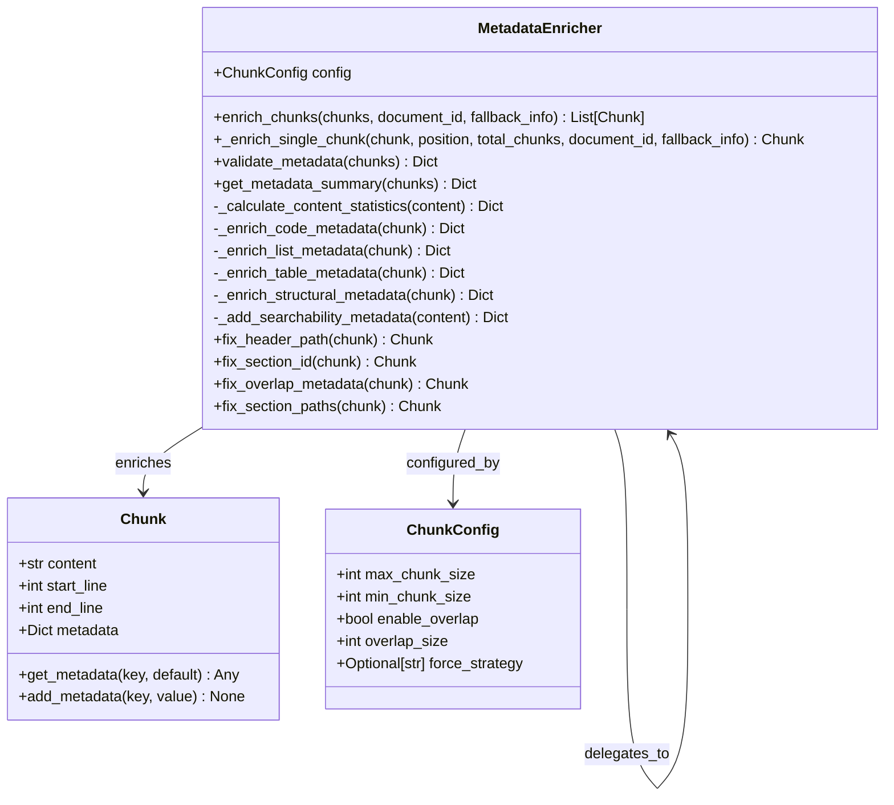
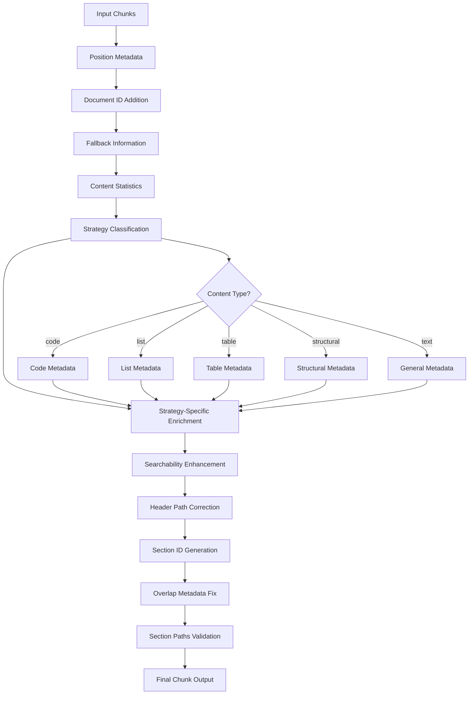
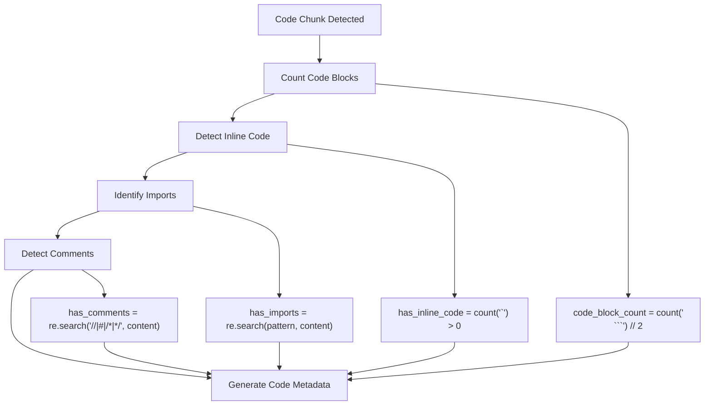
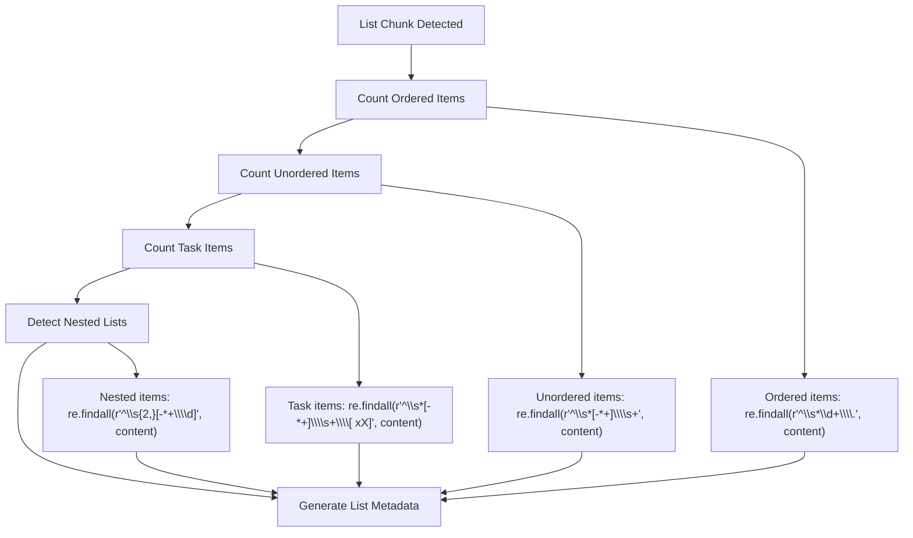
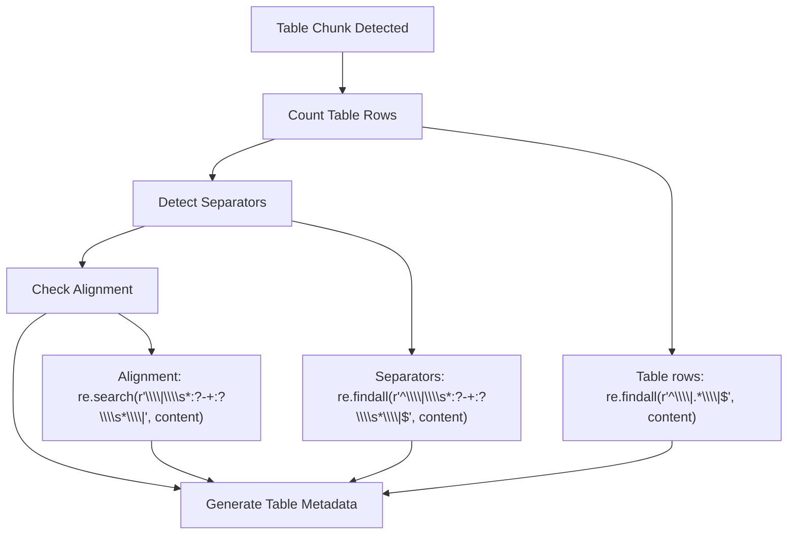
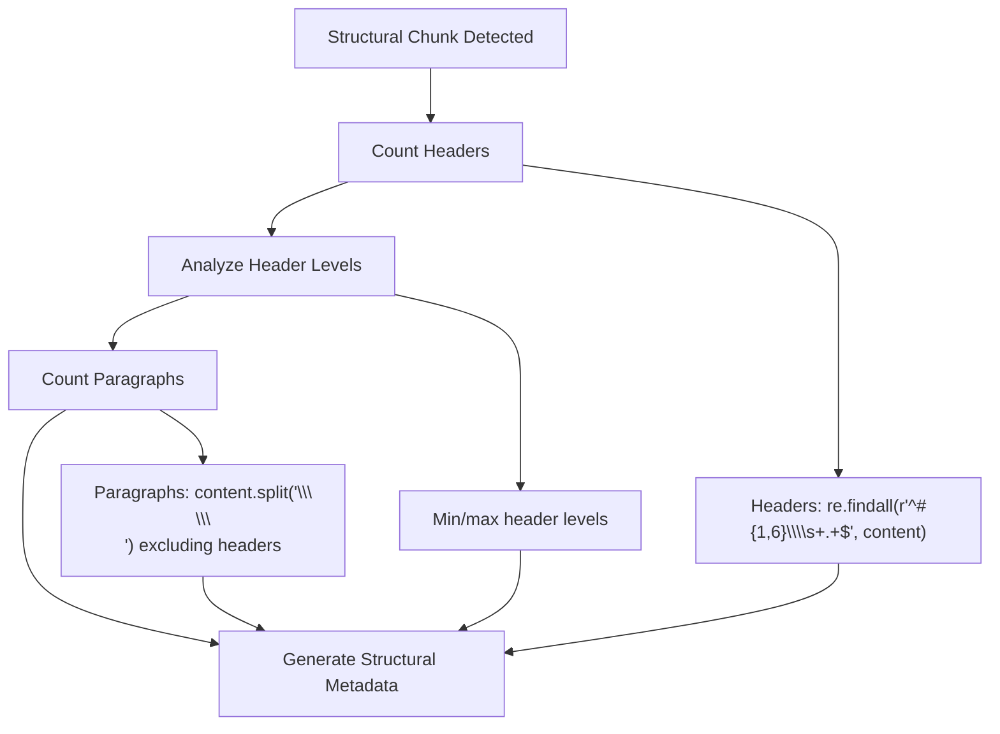
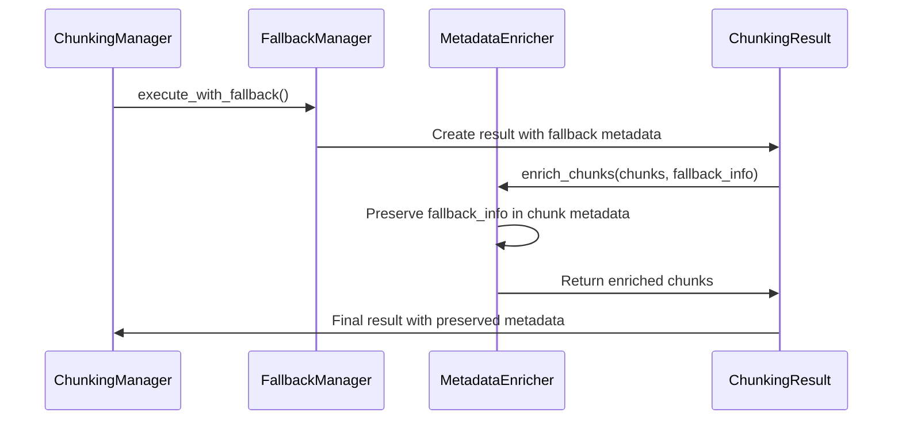
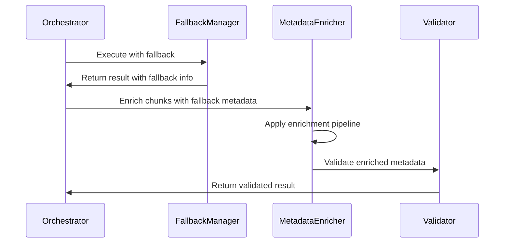

# Metadata Enrichment

<cite>
**Referenced Files in This Document**
- [metadata_enricher.py](file://markdown_chunker_legacy/chunker/components/metadata_enricher.py)
- [test_metadata_enricher.py](file://tests/chunker/test_components/test_metadata_enricher.py)
- [test_metadata_properties.py](file://tests/chunker/test_metadata_properties.py)
- [test_fallback_metadata_preservation.py](file://tests/chunker/test_fallback_metadata_preservation.py)
- [test_regression_prevention.py](file://tests/chunker/test_regression_prevention.py)
- [types.py](file://markdown_chunker/chunker/types.py)
- [types.py](file://markdown_chunker_v2/types.py)
- [orchestrator.py](file://markdown_chunker_legacy/chunker/orchestrator.py)
</cite>

## Table of Contents
1. [Introduction](#introduction)
2. [MetadataEnricher Architecture](#metadataenricher-architecture)
3. [Core Data Model](#core-data-model)
4. [Metadata Enrichment Process](#metadata-enrichment-process)
5. [Strategy-Specific Enrichment](#strategy-specific-enrichment)
6. [Fallback Metadata Preservation](#fallback-metadata-preservation)
7. [Integration with Core Components](#integration-with-core-components)
8. [Quality Assurance and Regression Prevention](#quality-assurance-and-regression-prevention)
9. [Downstream Applications](#downstream-applications)
10. [Best Practices and Troubleshooting](#best-practices-and-troubleshooting)

## Introduction

The MetadataEnricher component serves as the cornerstone of the Dify Markdown Chunker's metadata system, providing comprehensive enrichment of chunk metadata to enhance searchability, navigation, and downstream processing capabilities. This component transforms raw chunks into rich, contextual data structures that preserve essential information about content structure, strategy application, and processing lineage.

The metadata enrichment process operates as a post-processing phase that enhances chunks with strategic insights, statistical information, and navigational aids while maintaining strict consistency guarantees across all processing scenarios, including fallback situations and error conditions.

## MetadataEnricher Architecture

The MetadataEnricher follows a modular, strategy-based architecture that separates concerns and enables extensible enrichment capabilities:



**Diagram sources**
- [metadata_enricher.py](file://markdown_chunker_legacy/chunker/components/metadata_enricher.py#L13-L713)
- [types.py](file://markdown_chunker_v2/types.py#L99-L272)

**Section sources**
- [metadata_enricher.py](file://markdown_chunker_legacy/chunker/components/metadata_enricher.py#L13-L713)

## Core Data Model

The metadata enrichment system operates on a comprehensive data model that captures essential information about each chunk:

### Fundamental Metadata Fields

| Field | Type | Purpose | Example |
|-------|------|---------|---------|
| `chunk_index` | int | Position in chunk sequence (0-based) | `0`, `1`, `2` |
| `total_chunks` | int | Total number of chunks in document | `5` |
| `is_first_chunk` | bool | Indicates first chunk in sequence | `true` |
| `is_last_chunk` | bool | Indicates last chunk in sequence | `false` |
| `document_id` | str | Unique identifier for source document | `"doc_12345"` |
| `strategy` | str | Applied chunking strategy | `"structural"`, `"code"`, `"mixed"` |
| `content_type` | str | Content categorization | `"text"`, `"code"`, `"list"`, `"table"` |

### Content Statistics

The system automatically calculates comprehensive content statistics:

| Field | Type | Calculation | Purpose |
|-------|------|-------------|---------|
| `line_count` | int | Number of lines in content | Content size estimation |
| `word_count` | int | Word count using space splitting | Readability assessment |
| `char_count` | int | Character count | Memory usage estimation |
| `avg_line_length` | float | `char_count / line_count` | Formatting analysis |
| `avg_word_length` | float | `sum(len(word) for word in words) / word_count` | Text complexity measure |

### Strategy-Specific Metadata

Different content types receive specialized metadata enrichment:

#### Code Content Metadata
- `code_block_count`: Number of code blocks (`````)
- `has_inline_code`: Presence of inline code (`backticks`)
- `has_imports`: Detection of import/include statements
- `has_comments`: Presence of code comments

#### List Content Metadata
- `ordered_item_count`: Number of numbered list items
- `unordered_item_count`: Number of bullet list items
- `task_item_count`: Number of checkbox items
- `has_nested_lists`: Presence of indented nested lists
- `nested_item_count`: Number of nested list items

#### Table Content Metadata
- `table_row_count`: Number of table rows
- `table_count`: Number of distinct tables
- `has_column_alignment`: Presence of column alignment indicators

#### Structural Content Metadata
- `header_count`: Number of headers
- `min_header_level`: Lowest header level (1-6)
- `max_header_level`: Highest header level (1-6)
- `paragraph_count`: Number of paragraphs

**Section sources**
- [metadata_enricher.py](file://markdown_chunker_legacy/chunker/components/metadata_enricher.py#L156-L339)

## Metadata Enrichment Process

The enrichment process follows a systematic pipeline that ensures comprehensive metadata coverage while maintaining performance and consistency:



**Diagram sources**
- [metadata_enricher.py](file://markdown_chunker_legacy/chunker/components/metadata_enricher.py#L69-L154)

### Enrichment Pipeline Stages

#### 1. Position and Sequence Metadata
Each chunk receives positional information that establishes its role within the document sequence:

```python
# Position metadata added during enrichment
enriched_metadata = {
    "chunk_index": position,           # 0-based index
    "total_chunks": total_chunks,     # Total chunk count
    "is_first_chunk": position == 0,  # Boolean flag
    "is_last_chunk": position == total_chunks - 1  # Boolean flag
}
```

#### 2. Document Context Integration
Source document identification enables cross-document analysis and deduplication:

```python
# Document ID propagation
if document_id:
    enriched_metadata["document_id"] = document_id
```

#### 3. Fallback Context Preservation
Fallback metadata maintains processing lineage and error context:

```python
# Fallback information preservation
if fallback_info:
    enriched_metadata["execution_fallback_used"] = fallback_info.get("fallback_used", False)
    enriched_metadata["execution_fallback_level"] = fallback_info.get("fallback_level", 0)
    enriched_metadata["execution_strategy_used"] = fallback_info.get("strategy_used", "unknown")
```

#### 4. Content Intelligence Extraction
Statistical analysis provides insights into content characteristics:

```python
# Content statistics calculation
lines = content.split("\n")
words = content.split()
stats = {
    "line_count": len(lines),
    "word_count": len(words),
    "char_count": len(content),
    "avg_line_length": len(content) / len(lines) if lines else 0,
    "avg_word_length": sum(len(w) for w in words) / len(words) if words else 0,
}
```

**Section sources**
- [metadata_enricher.py](file://markdown_chunker_legacy/chunker/components/metadata_enricher.py#L47-L154)

## Strategy-Specific Enrichment

The MetadataEnricher applies specialized enrichment logic based on the detected content type and strategy used for chunking:

### Code Content Enrichment

Code chunks receive comprehensive programming language analysis:



**Diagram sources**
- [metadata_enricher.py](file://markdown_chunker_legacy/chunker/components/metadata_enricher.py#L177-L210)

#### Code Metadata Fields
- **`code_block_count`**: Number of fenced code blocks (divided by 2 for pairs)
- **`has_inline_code`**: Boolean indicating presence of inline code elements
- **`has_imports`**: Boolean detecting import/include statements
- **`has_comments`**: Boolean identifying comment patterns

### List Content Enrichment

List chunks receive hierarchical structure analysis:



**Diagram sources**
- [metadata_enricher.py](file://markdown_chunker_legacy/chunker/components/metadata_enricher.py#L212-L239)

#### List Metadata Fields
- **`ordered_item_count`**: Number of numbered list items
- **`unordered_item_count`**: Number of bullet list items
- **`task_item_count`**: Number of checkbox-style items
- **`has_nested_lists`**: Boolean indicating nested list structure
- **`nested_item_count`**: Number of nested list items

### Table Content Enrichment

Table chunks receive structural analysis:



**Diagram sources**
- [metadata_enricher.py](file://markdown_chunker_legacy/chunker/components/metadata_enricher.py#L241-L266)

#### Table Metadata Fields
- **`table_row_count`**: Number of rows in table structure
- **`table_count`**: Number of distinct tables identified
- **`has_column_alignment`**: Boolean indicating column alignment

### Structural Content Enrichment

Structural chunks receive hierarchical analysis:



**Diagram sources**
- [metadata_enricher.py](file://markdown_chunker_legacy/chunker/components/metadata_enricher.py#L268-L299)

#### Structural Metadata Fields
- **`header_count`**: Number of headers in chunk
- **`min_header_level`**: Lowest header level (1-6)
- **`max_header_level`**: Highest header level (1-6)
- **`paragraph_count`**: Number of paragraphs

**Section sources**
- [metadata_enricher.py](file://markdown_chunker_legacy/chunker/components/metadata_enricher.py#L177-L299)

## Fallback Metadata Preservation

The metadata enrichment system implements robust fallback metadata preservation to ensure processing lineage is maintained even when fallback strategies are employed:

### Fallback Metadata Structure



**Diagram sources**
- [test_fallback_metadata_preservation.py](file://tests/chunker/test_fallback_metadata_preservation.py#L39-L156)

### Fallback Metadata Fields

| Field | Type | Purpose | Example |
|-------|------|---------|---------|
| `execution_fallback_used` | bool | Indicates fallback activation | `true` |
| `execution_fallback_level` | int | Fallback severity level (1-4) | `3` |
| `execution_strategy_used` | str | Strategy that was attempted | `"structural"` |

### Preservation Mechanisms

The system employs several mechanisms to ensure fallback metadata accuracy:

#### 1. Explicit Metadata Propagation
Fallback information is explicitly passed to the enrichment process:

```python
# Fallback info preservation during enrichment
fallback_info = {
    "fallback_used": result.fallback_used,
    "fallback_level": result.fallback_level,
    "strategy_used": result.strategy_used
}

enriched_chunks = self.enrich_chunks(
    chunks, 
    document_id=document_id, 
    fallback_info=fallback_info
)
```

#### 2. Error Logic Isolation
Fallback metadata is preserved independently of error detection logic:

```python
# Metadata preservation takes precedence over error-based logic
if result.fallback_used:
    # Preserve FallbackManager metadata exactly
    fallback_level = result.fallback_level
    strategy_used = result.strategy_used
else:
    # Use error-based logic only if fallback wasn't used
    fallback_level = 1 if errors else 0
```

#### 3. Validation and Consistency Checks
The system validates fallback metadata consistency:

```python
# Validation ensures metadata accuracy
def validate_metadata(self, chunks):
    for chunk in chunks:
        # Verify fallback metadata consistency
        if chunk.get_metadata("execution_fallback_used"):
            fallback_level = chunk.get_metadata("execution_fallback_level")
            assert 1 <= fallback_level <= 4, "Invalid fallback level"
```

**Section sources**
- [test_fallback_metadata_preservation.py](file://tests/chunker/test_fallback_metadata_preservation.py#L39-L303)

## Integration with Core Components

The MetadataEnricher integrates seamlessly with the broader chunking architecture, serving as a critical post-processing component:

### Orchestrator Integration



**Diagram sources**
- [orchestrator.py](file://markdown_chunker_legacy/chunker/orchestrator.py#L86-L189)

### Component Interaction Patterns

#### 1. Strategy Selection Coordination
The orchestrator coordinates strategy selection with metadata enrichment:

```python
# Strategy selection with metadata consideration
selected_strategy = self._strategy_selector.select_strategy(
    stage1_results.analysis, self.config
)

# Enrich with strategy metadata
result = self._fallback_manager.execute_with_fallback(
    md_text, stage1_results, selected_strategy
)

# Metadata enrichment occurs after strategy application
result.chunks = self._metadata_enricher.enrich_chunks(
    result.chunks, 
    document_id=document_id,
    fallback_info={
        "fallback_used": result.fallback_used,
        "fallback_level": result.fallback_level,
        "strategy_used": result.strategy_used
    }
)
```

#### 2. Validation Pipeline Integration
Metadata validation integrates with content completeness checking:

```python
# Post-processing validation pipeline
result = self._apply_block_based_postprocessing(result, stage1_results)

# Metadata validation ensures consistency
validation = self._metadata_enricher.validate_metadata(result.chunks)
if not validation["valid"]:
    # Handle validation errors appropriately
    logger.warning(f"Metadata validation failed: {validation['issues']}")
```

#### 3. Error Recovery Mechanisms
The system implements graceful error recovery while preserving metadata:

```python
# Error recovery preserves metadata context
try:
    chunks = selected_strategy.apply(md_text, stage1_results, self.config)
    if not chunks:
        # Use fallback with preserved metadata context
        return self._fallback_manager.execute_with_fallback(
            md_text, stage1_results, selected_strategy
        )
except Exception as e:
    # Fallback preserves original error context
    return self._fallback_manager.execute_with_fallback(
        md_text, stage1_results, selected_strategy
    )
```

**Section sources**
- [orchestrator.py](file://markdown_chunker_legacy/chunker/orchestrator.py#L240-L389)

## Quality Assurance and Regression Prevention

The metadata enrichment system incorporates comprehensive quality assurance measures to prevent regressions and ensure data integrity:

### Property-Based Testing

The system employs property-based testing to validate metadata consistency:

```python
# Property: All chunks have required metadata fields
@given(chunks=st.lists(chunk_with_strategy(), min_size=1, max_size=5))
def test_property_metadata_has_required_fields(chunks):
    enricher = MetadataEnricher(config)
    enriched = enricher.enrich_chunks(chunks)
    
    required_fields = ["chunk_index", "total_chunks", "is_first_chunk", "is_last_chunk"]
    for chunk in enriched:
        for field in required_fields:
            assert field in chunk.metadata, f"Missing required field: {field}"
```

### Regression Prevention Tests

Critical regression tests ensure metadata accuracy across various scenarios:

#### 1. Header Path Accuracy
Tests verify header path consistency and accuracy:

```python
# Header path regression prevention
def test_header_path_accuracy_regression():
    chunker = MarkdownChunker()
    content = "# Main Header\n\n## Sub Header\n\nContent"
    result = chunker.chunk_with_analysis(content)
    
    for chunk in result.chunks:
        header_path = chunk.metadata.get("header_path", "")
        assert header_path.startswith("/"), "Header path should start with '/'"
        assert len(header_path.split("/")) <= 6, "Header path too deep"
```

#### 2. Metadata Drift Prevention
Tests prevent metadata drift in long documents:

```python
# Metadata drift regression prevention
def test_metadata_drift_regression():
    # Test with long document to prevent drift
    long_content = "# Header\n\n" + "\n".join([f"Line {i}" for i in range(1000)])
    chunker = MarkdownChunker()
    result = chunker.chunk_with_analysis(long_content)
    
    # Verify metadata consistency across chunks
    for i, chunk in enumerate(result.chunks):
        assert chunk.metadata["chunk_index"] == i
        assert chunk.metadata["total_chunks"] == len(result.chunks)
```

#### 3. Fallback Metadata Accuracy
Tests ensure fallback metadata reflects actual usage:

```python
# Fallback metadata accuracy regression
def test_fallback_metadata_accuracy_regression():
    config = ChunkConfig(max_chunk_size=100)
    chunker = MarkdownChunker(config)
    content = "Long content that triggers fallback"
    
    result = chunker.chunk_with_analysis(content)
    
    if result.fallback_used:
        assert isinstance(result.fallback_level, int)
        assert 1 <= result.fallback_level <= 4
        for chunk in result.chunks:
            assert "strategy" in chunk.metadata
```

### Validation Framework

The system implements comprehensive validation:

```python
# Metadata validation framework
def validate_metadata(self, chunks):
    issues = []
    
    # Check required fields
    required_fields = ["strategy", "content_type"]
    for i, chunk in enumerate(chunks):
        for field in required_fields:
            if field not in chunk.metadata:
                issues.append(f"Chunk {i}: Missing required field '{field}'")
    
    # Check chunk indices
    for i, chunk in enumerate(chunks):
        chunk_index = chunk.get_metadata("chunk_index")
        if chunk_index is not None and chunk_index != i:
            issues.append(f"Chunk {i}: Incorrect chunk_index {chunk_index}")
    
    return {"valid": len(issues) == 0, "issues": issues}
```

**Section sources**
- [test_metadata_properties.py](file://tests/chunker/test_metadata_properties.py#L42-L321)
- [test_fallback_metadata_preservation.py](file://tests/chunker/test_fallback_metadata_preservation.py#L308-L366)
- [test_regression_prevention.py](file://tests/chunker/test_regression_prevention.py#L308-L366)

## Downstream Applications

The enriched metadata enables sophisticated downstream applications and integrations:

### RAG System Integration

Rich metadata enhances Retrieval-Augmented Generation (RAG) systems:

#### 1. Semantic Search Enhancement
```python
# Enhanced search capabilities using metadata
search_query = "Python code examples"
relevant_chunks = [
    chunk for chunk in chunks 
    if ("code" in chunk.metadata.get("content_type", "") or 
        "python" in chunk.content.lower()) and
       chunk.metadata.get("has_imports", False)
]
```

#### 2. Context-Aware Retrieval
```python
# Context-aware retrieval using header paths
def find_related_content(base_chunk, chunks):
    base_path = base_chunk.metadata.get("header_path", "")
    return [
        chunk for chunk in chunks
        if chunk.metadata.get("header_path", "").startswith(base_path)
    ]
```

### Document Navigation Systems

Metadata enables sophisticated navigation features:

#### 1. Hierarchical Navigation
```python
# Generate navigation tree from header paths
def build_navigation_tree(chunks):
    tree = {}
    for chunk in chunks:
        header_path = chunk.metadata.get("header_path", "")
        if header_path:
            parts = header_path.strip("/").split("/")
            current = tree
            for part in parts:
                if part not in current:
                    current[part] = {}
                current = current[part]
    return tree
```

#### 2. Content Type Filtering
```python
# Filter chunks by content type for specialized processing
code_chunks = [chunk for chunk in chunks if "code" in chunk.metadata.get("content_type", "")]
list_chunks = [chunk for chunk in chunks if "list" in chunk.metadata.get("content_type", "")]
```

### Analytics and Monitoring

Metadata supports comprehensive analytics:

#### 1. Content Analysis Dashboard
```python
# Generate content analysis metrics
def analyze_content_distribution(chunks):
    content_types = {}
    strategies = {}
    
    for chunk in chunks:
        content_type = chunk.metadata.get("content_type", "unknown")
        strategy = chunk.metadata.get("strategy", "unknown")
        
        content_types[content_type] = content_types.get(content_type, 0) + 1
        strategies[strategy] = strategies.get(strategy, 0) + 1
    
    return {
        "content_type_distribution": content_types,
        "strategy_distribution": strategies,
        "average_chunk_size": sum(c.size for c in chunks) / len(chunks)
    }
```

#### 2. Quality Metrics
```python
# Monitor chunk quality using metadata
def monitor_chunk_quality(chunks):
    undersized = sum(1 for chunk in chunks if chunk.size < 256)
    oversized = sum(1 for chunk in chunks if chunk.size > 4096)
    
    return {
        "undersized_chunks": undersized,
        "oversized_chunks": oversized,
        "quality_score": (len(chunks) - (undersized + oversized)) / len(chunks)
    }
```

### Content Management Systems

Metadata enables advanced content management:

#### 1. Dynamic Content Grouping
```python
# Group related content using metadata
def group_related_content(chunks):
    groups = {}
    for chunk in chunks:
        strategy = chunk.metadata.get("strategy", "unknown")
        content_type = chunk.metadata.get("content_type", "unknown")
        
        key = f"{strategy}_{content_type}"
        if key not in groups:
            groups[key] = []
        groups[key].append(chunk)
    return groups
```

#### 2. Content Migration Support
```python
# Prepare content for migration using metadata
def prepare_migration(chunks):
    migration_data = []
    for chunk in chunks:
        migration_data.append({
            "content": chunk.content,
            "metadata": {
                "original_line_start": chunk.start_line,
                "original_line_end": chunk.end_line,
                "strategy": chunk.metadata.get("strategy"),
                "content_type": chunk.metadata.get("content_type"),
                "header_path": chunk.metadata.get("header_path"),
                "section_id": chunk.metadata.get("section_id")
            }
        })
    return migration_data
```

## Best Practices and Troubleshooting

### Performance Optimization

#### 1. Efficient Metadata Processing
```python
# Optimize metadata enrichment for large documents
def optimize_enrichment(chunks, batch_size=100):
    enriched_chunks = []
    for i in range(0, len(chunks), batch_size):
        batch = chunks[i:i + batch_size]
        # Process batch efficiently
        batch_enriched = metadata_enricher.enrich_chunks(batch)
        enriched_chunks.extend(batch_enriched)
    return enriched_chunks
```

#### 2. Lazy Loading Strategies
```python
# Implement lazy loading for expensive metadata operations
class LazyMetadata:
    def __init__(self, chunk):
        self.chunk = chunk
        self._cached = {}
    
    def get_expensive_metadata(self):
        if "expensive_calculation" not in self._cached:
            # Perform expensive calculation only once
            self._cached["expensive_calculation"] = self._perform_expensive_calculation()
        return self._cached["expensive_calculation"]
```

### Common Issues and Solutions

#### 1. Metadata Drift in Long Documents
**Problem**: Metadata becomes inconsistent in long documents due to processing variations.

**Solution**: Implement consistent header path extraction:
```python
# Consistent header path extraction
def fix_header_path(self, chunk):
    # Use content-based extraction rather than relying on external context
    headers = self._extract_headers_from_content(chunk.content)
    if headers:
        header_path = self._build_header_path(headers)
        chunk.metadata["header_path"] = header_path
    return chunk
```

#### 2. Fallback Metadata Conflicts
**Problem**: Fallback metadata conflicts with error-based logic.

**Solution**: Isolate fallback metadata logic:
```python
# Isolated fallback metadata logic
def enrich_chunks(self, chunks, document_id=None, fallback_info=None):
    if fallback_info:
        # Preserve fallback metadata exactly as provided
        for chunk in chunks:
            chunk.metadata.update({
                "execution_fallback_used": fallback_info.get("fallback_used", False),
                "execution_fallback_level": fallback_info.get("fallback_level", 0),
                "execution_strategy_used": fallback_info.get("strategy_used", "unknown")
            })
    return chunks
```

#### 3. Memory Usage Optimization
**Problem**: Large documents consume excessive memory during enrichment.

**Solution**: Implement streaming enrichment:
```python
# Streaming metadata enrichment for large documents
def stream_enrichment(chunks_generator, batch_size=50):
    for batch in batched(chunks_generator, batch_size):
        enriched_batch = metadata_enricher.enrich_chunks(batch)
        yield from enriched_batch
```

### Debugging and Monitoring

#### 1. Metadata Validation Tools
```python
# Comprehensive metadata validation
def debug_metadata(chunks):
    validation = metadata_enricher.validate_metadata(chunks)
    if not validation["valid"]:
        print(f"Metadata validation failed: {validation['issues']}")
    
    summary = metadata_enricher.get_metadata_summary(chunks)
    print(f"Chunk distribution: {summary['strategies']}")
    print(f"Content types: {summary['content_types']}")
```

#### 2. Performance Monitoring
```python
# Monitor enrichment performance
import time

def timed_enrichment(chunks):
    start_time = time.time()
    enriched = metadata_enricher.enrich_chunks(chunks)
    processing_time = time.time() - start_time
    
    print(f"Enriched {len(chunks)} chunks in {processing_time:.3f}s")
    print(f"Average enrichment time: {processing_time / len(chunks):.3f}s per chunk")
    
    return enriched
```

### Integration Guidelines

#### 1. API Design Patterns
```python
# Clean API for metadata enrichment
class ChunkProcessor:
    def __init__(self, config):
        self.metadata_enricher = MetadataEnricher(config)
    
    def process_chunks(self, chunks, document_id=None, fallback_info=None):
        # Validate input
        if not chunks:
            return []
        
        # Enrich metadata
        enriched = self.metadata_enricher.enrich_chunks(
            chunks, 
            document_id=document_id, 
            fallback_info=fallback_info
        )
        
        # Validate output
        validation = self.metadata_enricher.validate_metadata(enriched)
        if not validation["valid"]:
            raise ValueError(f"Metadata validation failed: {validation['issues']}")
        
        return enriched
```

#### 2. Error Handling Patterns
```python
# Robust error handling for metadata operations
def safe_enrichment(chunks, document_id=None, fallback_info=None):
    try:
        return metadata_enricher.enrich_chunks(chunks, document_id, fallback_info)
    except Exception as e:
        # Log error and return minimal metadata
        logger.error(f"Metadata enrichment failed: {e}")
        return [
            Chunk(
                chunk.content, 
                chunk.start_line, 
                chunk.end_line, 
                {"enrichment_failed": True, "error": str(e)}
            ) 
            for chunk in chunks
        ]
```

**Section sources**
- [metadata_enricher.py](file://markdown_chunker_legacy/chunker/components/metadata_enricher.py#L342-L426)
- [test_metadata_enricher.py](file://tests/chunker/test_components/test_metadata_enricher.py#L285-L372)