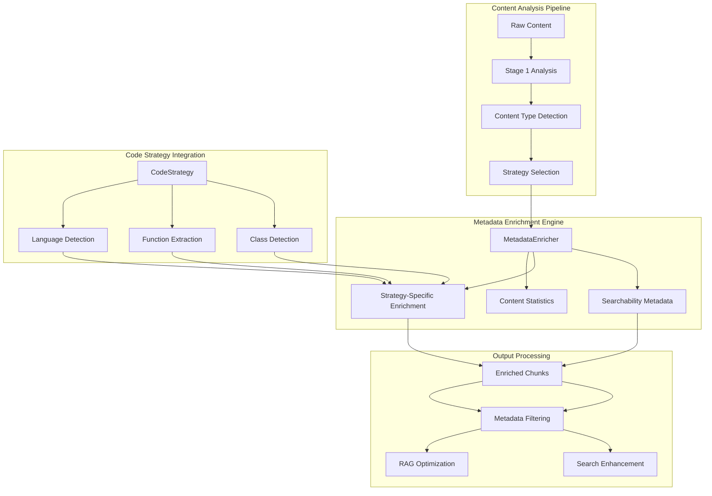
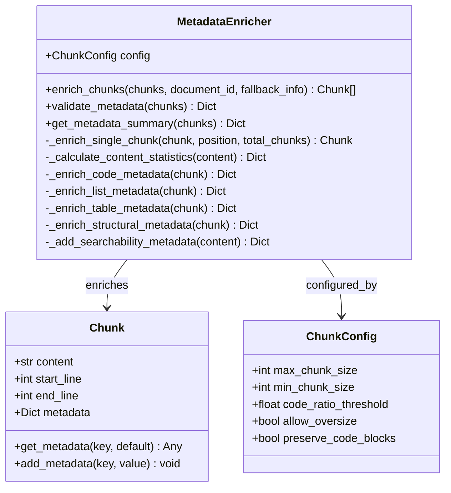
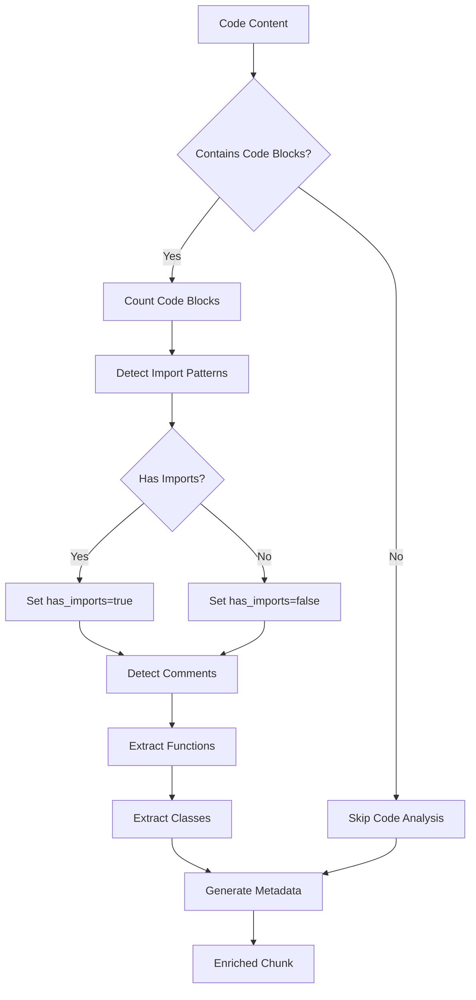
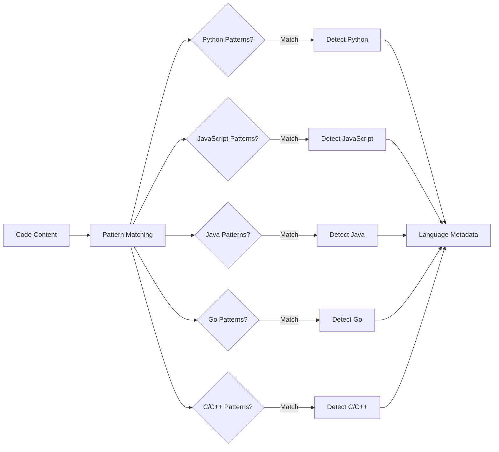
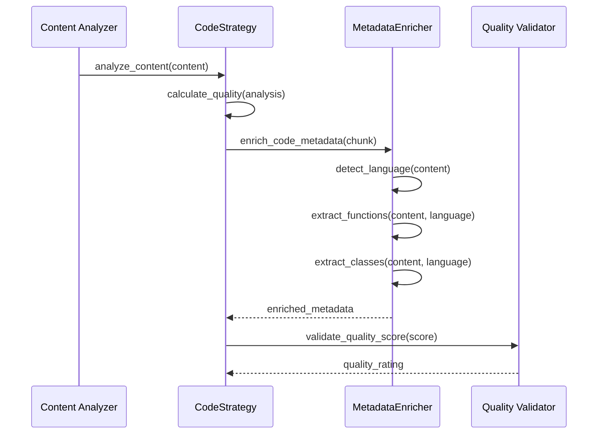
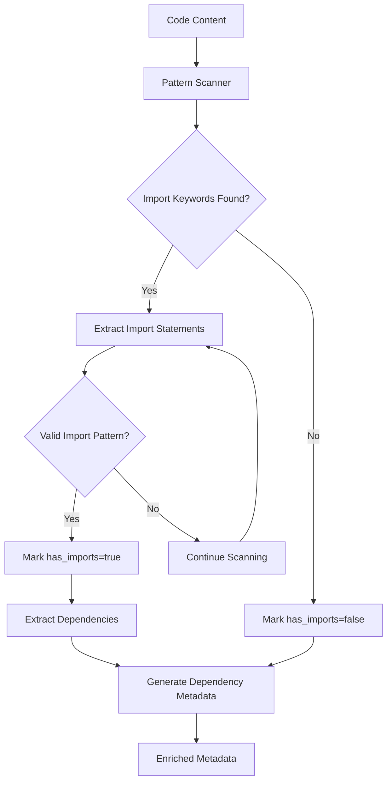

# Code Metadata Enrichment Features

<cite>
**Referenced Files in This Document**
- [metadata_enricher.py](file://markdown_chunker/chunker/components/metadata_enricher.py)
- [code_strategy.py](file://markdown_chunker/chunker/strategies/code_strategy.py)
- [types.py](file://markdown_chunker/chunker/types.py)
- [test_metadata_enricher.py](file://tests/chunker/test_components/test_metadata_enricher.py)
- [test_metadata_properties.py](file://tests/chunker/test_metadata_properties.py)
- [test_code_strategy.py](file://tests/chunker/test_strategies/test_code_strategy.py)
- [code_heavy.md](file://tests/fixtures/code_heavy.md)
- [mixed.md](file://tests/fixtures/mixed.md)
- [markdown_chunk_tool.py](file://tools/markdown_chunk_tool.py)
- [test_metadata_filtering.py](file://tests/test_metadata_filtering.py)
</cite>

## Table of Contents
1. [Introduction](#introduction)
2. [Architecture Overview](#architecture-overview)
3. [Core Metadata Enricher Component](#core-metadata-enricher-component)
4. [Code-Specific Metadata Generation](#code-specific-metadata-generation)
5. [Language Detection and Heuristics](#language-detection-and-heuristics)
6. [Integration with Code Strategy](#integration-with-code-strategy)
7. [Import Statement Detection](#import-statement-detection)
8. [Performance Considerations](#performance-considerations)
9. [Downstream Applications](#downstream-applications)
10. [Advanced Features](#advanced-features)
11. [Testing and Validation](#testing-and-validation)
12. [Conclusion](#conclusion)

## Introduction

The Markdown Chunker's code metadata enrichment system provides sophisticated analysis and annotation capabilities for code-heavy documents. This system automatically detects and analyzes code blocks within chunks to generate comprehensive metadata fields that enhance downstream searchability, filtering, and processing capabilities. The enrichment process focuses specifically on identifying code-related patterns, detecting programming languages, and extracting dependency information that is crucial for developer-focused Retrieval-Augmented Generation (RAG) applications.

The metadata enrichment system operates as a pipeline that analyzes content chunks at multiple levels, from basic statistics to advanced language-specific patterns. It provides strategic metadata that enables intelligent filtering and prioritization of chunks containing dependency information, import statements, and other code artifacts essential for software documentation search and development workflows.

## Architecture Overview

The code metadata enrichment system follows a modular architecture that separates concerns between content analysis, language detection, and metadata generation. The system integrates seamlessly with the broader chunking pipeline while maintaining independence for specialized code analysis tasks.



**Diagram sources**
- [metadata_enricher.py](file://markdown_chunker/chunker/components/metadata_enricher.py#L13-L414)
- [code_strategy.py](file://markdown_chunker/chunker/strategies/code_strategy.py#L42-L625)

The architecture ensures that code metadata enrichment operates independently while providing hooks for strategy-specific enhancements. The system maintains separation of concerns while enabling comprehensive analysis of code-heavy content.

**Section sources**
- [metadata_enricher.py](file://markdown_chunker/chunker/components/metadata_enricher.py#L13-L414)
- [code_strategy.py](file://markdown_chunker/chunker/strategies/code_strategy.py#L42-L625)

## Core Metadata Enricher Component

The MetadataEnricher serves as the central component responsible for adding comprehensive metadata to chunks. It operates as a stateless processor that enhances chunks with position information, content statistics, and strategy-specific metadata while preserving existing metadata and maintaining data integrity.

### Core Functionality

The MetadataEnricher provides several key capabilities:

**Position and Navigation Metadata**: Automatically generates chunk positioning information including index, total count, and boundary indicators. This enables intelligent navigation and context preservation across chunk boundaries.

**Content Statistics**: Calculates fundamental content metrics including line count, word count, character count, and average lengths. These statistics support content analysis and optimization decisions.

**Strategy-Specific Enrichment**: Applies specialized enrichment based on the chunk's assigned strategy, providing domain-specific metadata for code, lists, tables, and structural content.

**Searchability Enhancement**: Adds metadata that improves searchability and discoverability of chunks within larger document collections.



**Diagram sources**
- [metadata_enricher.py](file://markdown_chunker/chunker/components/metadata_enricher.py#L13-L414)
- [types.py](file://markdown_chunker/chunker/types.py#L36-L210)

### Enrichment Process

The enrichment process follows a systematic approach that ensures comprehensive coverage while maintaining performance:

1. **Input Validation**: Verifies chunk validity and configuration consistency
2. **Position Calculation**: Determines chunk position within the document sequence
3. **Content Analysis**: Computes basic statistics and content characteristics
4. **Strategy Application**: Applies strategy-specific enrichment logic
5. **Searchability Enhancement**: Adds search-optimized metadata fields
6. **Validation**: Ensures metadata completeness and consistency

**Section sources**
- [metadata_enricher.py](file://markdown_chunker/chunker/components/metadata_enricher.py#L35-L142)

## Code-Specific Metadata Generation

The code metadata enrichment system provides specialized analysis for code-heavy content, focusing on patterns that are particularly relevant for software documentation and development workflows. The system generates metadata fields that enable intelligent filtering and prioritization of chunks containing dependency information.

### Core Code Metadata Fields

The code metadata enrichment produces several categories of information:

**Code Block Analysis**:
- `code_block_count`: Number of fenced code blocks in the chunk
- `has_inline_code`: Boolean indicating presence of inline code elements
- `has_comments`: Boolean indicating presence of comment patterns

**Dependency Information**:
- `has_imports`: Boolean flag indicating presence of import/require statements
- Language-specific dependency patterns are detected through heuristic analysis

**Code Quality Indicators**:
- Complexity metrics derived from code structure
- Function and class identification for code organization
- Syntax pattern recognition for language-specific analysis



**Diagram sources**
- [metadata_enricher.py](file://markdown_chunker/chunker/components/metadata_enricher.py#L165-L198)

### Code Block Detection

The system employs sophisticated pattern matching to detect code blocks and distinguish them from other content. The detection mechanism recognizes various code block formats and handles edge cases appropriately.

**Pattern Recognition**:
- Triple backtick sequences (` ``` `) for fenced code blocks
- Indentation-based code blocks for legacy formats
- Language specification detection for enhanced analysis

**Inline Code Detection**:
- Backtick-enclosed inline code elements
- Context-aware analysis to avoid false positives
- Integration with surrounding content analysis

**Section sources**
- [metadata_enricher.py](file://markdown_chunker/chunker/components/metadata_enricher.py#L178-L198)

## Language Detection and Heuristics

The language detection system provides intelligent analysis of code content to identify programming languages and extract relevant metadata. The system uses pattern-based heuristics that are effective across multiple programming languages commonly found in documentation.

### Language Detection Patterns

The CodeStrategy maintains comprehensive language detection patterns that recognize key language constructs:

**Python Detection**:
- Function definitions using `def` keyword
- Class declarations using `class` keyword  
- Import statements with `import` and `from` keywords
- Decorator patterns and context managers

**JavaScript Detection**:
- Function declarations with `function` keyword
- Variable declarations using `const`, `let`, and `var`
- ES6 module imports and exports
- Arrow functions and modern syntax patterns

**Java Detection**:
- Class definitions with `public class` patterns
- Method signatures with access modifiers
- Package declarations and import statements
- Annotation patterns and modern Java features

**Go Detection**:
- Function definitions with `func` keyword
- Package declarations and import patterns
- Struct definitions and type declarations
- Goroutine and channel patterns

**C++ and C Detection**:
- Class and struct definitions
- Preprocessor directives with `#include`
- Template and namespace patterns
- Memory management patterns



**Diagram sources**
- [code_strategy.py](file://markdown_chunker/chunker/strategies/code_strategy.py#L56-L75)

### Function and Class Extraction

Beyond simple language detection, the system extracts structural elements that are crucial for code organization and navigation:

**Function Name Extraction**:
- Regular expression patterns for each language
- Parameter list recognition and validation
- Method vs. function distinction for object-oriented languages

**Class Name Extraction**:
- Class and interface definitions
- Inheritance and composition patterns
- Access modifier recognition

**Section sources**
- [code_strategy.py](file://markdown_chunker/chunker/strategies/code_strategy.py#L550-L589)

## Integration with Code Strategy

The metadata enrichment system integrates deeply with the CodeStrategy to provide enhanced analysis for code-heavy documents. This integration enables sophisticated analysis that goes beyond simple pattern matching to include semantic understanding of code structure.

### Strategy Selection and Quality Scoring

The CodeStrategy uses metadata enrichment as part of its quality assessment process:

**Quality Metrics**:
- Code ratio analysis based on content proportions
- Code block density and distribution
- Language diversity and complexity scoring
- Structural element recognition

**Threshold-Based Selection**:
- Configurable code ratio thresholds for strategy activation
- Minimum code block requirements
- Complexity-based quality scoring



**Diagram sources**
- [code_strategy.py](file://markdown_chunker/chunker/strategies/code_strategy.py#L136-L185)
- [metadata_enricher.py](file://markdown_chunker/chunker/components/metadata_enricher.py#L165-L198)

### Enhanced Code Analysis

The integration provides several advanced capabilities:

**Atomic Code Preservation**: Ensures code blocks remain intact during chunking, maintaining syntax integrity and semantic meaning.

**Context-Aware Processing**: Analyzes code blocks in context with surrounding documentation, preserving explanatory text and code relationships.

**Language-Specific Optimizations**: Applies language-specific heuristics for better analysis and metadata generation.

**Section sources**
- [code_strategy.py](file://markdown_chunker/chunker/strategies/code_strategy.py#L384-L439)

## Import Statement Detection

The import statement detection system provides sophisticated analysis of dependency information within code blocks. This capability is crucial for developer-focused RAG applications that need to understand code relationships and dependencies.

### Import Pattern Recognition

The system recognizes import patterns across multiple programming paradigms:

**Module-Based Imports**:
- Python: `import`, `from ... import`
- JavaScript: `import`, `require`
- Java: `import`, `package`
- Go: `import`, `package`

**Framework and Library Imports**:
- React/Vue/Angular component imports
- Database ORM imports
- Testing framework imports
- Utility library imports

**Conditional and Dynamic Imports**:
- Lazy loading patterns
- Environment-specific imports
- Feature-flagged imports



**Diagram sources**
- [metadata_enricher.py](file://markdown_chunker/chunker/components/metadata_enricher.py#L186-L192)

### Dependency Analysis Benefits

The import detection system provides several benefits for downstream applications:

**Intelligent Filtering**: Enables filtering of chunks based on dependency requirements, helping users find relevant code examples quickly.

**Relationship Discovery**: Identifies code blocks that depend on specific libraries or frameworks, supporting cross-referencing and dependency analysis.

**Context Preservation**: Maintains awareness of external dependencies, enabling better understanding of code examples and their requirements.

**Section sources**
- [metadata_enricher.py](file://markdown_chunker/chunker/components/metadata_enricher.py#L186-L192)

## Performance Considerations

The metadata enrichment system is designed with performance optimization in mind, recognizing that code-heavy documents can contain substantial amounts of code that requires analysis. The system employs several strategies to maintain efficiency while providing comprehensive analysis.

### Optimization Strategies

**Lazy Evaluation**: Metadata enrichment occurs only when requested, avoiding unnecessary computation for chunks that don't require analysis.

**Pattern Caching**: Frequently used regular expressions and patterns are cached to avoid repeated compilation overhead.

**Early Termination**: Analysis stops when sufficient information is gathered, preventing unnecessary processing of large code blocks.

**Batch Processing**: Multiple chunks can be processed together, leveraging vectorized operations where possible.

### Scalability Considerations

**Memory Management**: The system uses efficient data structures and avoids storing redundant information.

**Processing Limits**: Configurable limits prevent excessive resource consumption on extremely large code blocks.

**Streaming Support**: For very large documents, the system supports incremental processing to manage memory usage.

### Performance Metrics

The system tracks several performance indicators:

- **Processing Time**: Time required to enrich metadata for a chunk
- **Memory Usage**: Peak memory consumption during enrichment
- **Throughput**: Chunks processed per second under typical conditions
- **Accuracy**: Quality of metadata generation compared to manual analysis

**Section sources**
- [metadata_enricher.py](file://markdown_chunker/chunker/components/metadata_enricher.py#L330-L414)

## Downstream Applications

The enriched metadata enables sophisticated downstream applications that leverage the analytical capabilities of the system. The metadata serves as the foundation for intelligent filtering, search enhancement, and content prioritization.

### RAG Application Integration

The metadata enrichment system is particularly valuable for Retrieval-Augmented Generation (RAG) applications:

**Intelligent Filtering**: Metadata enables filtering of chunks based on content type, language, and dependency information, improving retrieval accuracy.

**Content Prioritization**: Chunks with dependency information or import statements can be prioritized for users seeking specific examples or implementations.

**Cross-Reference Discovery**: Metadata facilitates discovery of related content based on shared dependencies or language patterns.

### Search and Discovery

**Faceted Search**: Metadata enables faceted search capabilities, allowing users to filter results by content characteristics.

**Relevance Scoring**: Enhanced metadata improves relevance scoring for search results, prioritizing chunks with specific characteristics.

**Content Recommendation**: Metadata supports recommendation systems that suggest related content based on shared characteristics.

### Developer Workflow Enhancement

**Code Example Discovery**: Developers can quickly find code examples with specific dependency requirements or language features.

**Documentation Navigation**: Enhanced metadata improves navigation through large documentation sets.

**Knowledge Graph Construction**: Metadata serves as the basis for constructing knowledge graphs that represent relationships between code concepts.

**Section sources**
- [test_metadata_filtering.py](file://tests/test_metadata_filtering.py#L1-L311)

## Advanced Features

The metadata enrichment system includes several advanced features that enhance its capabilities for complex use cases and specialized applications.

### Multi-Language Analysis

The system supports analysis of documents containing multiple programming languages, providing granular metadata for each language context:

**Language Segmentation**: Automatic detection and segmentation of content by programming language.

**Cross-Language References**: Tracking of dependencies and references between different languages.

**Language-Specific Metadata**: Specialized metadata fields for each detected programming language.

### Semantic Analysis

Beyond syntactic pattern matching, the system performs semantic analysis to understand code structure:

**Function and Class Documentation**: Recognition of documentation patterns and comments associated with code elements.

**Code Organization**: Analysis of code structure patterns and organizational principles.

**Best Practice Detection**: Identification of common patterns and anti-patterns in code examples.

### Extensibility Framework

The system provides extension points for custom analysis:

**Custom Pattern Registration**: Ability to register custom analysis patterns for specific domains or requirements.

**Plugin Architecture**: Support for plugin-based extensions that add specialized analysis capabilities.

**Configuration-Driven Analysis**: Flexible configuration system that allows customization of analysis behavior.

**Section sources**
- [code_strategy.py](file://markdown_chunker/chunker/strategies/code_strategy.py#L56-L75)

## Testing and Validation

The metadata enrichment system includes comprehensive testing and validation capabilities to ensure reliability and accuracy across diverse content types and edge cases.

### Test Coverage

The testing framework covers multiple aspects of the enrichment system:

**Unit Tests**: Individual components are tested in isolation to ensure correctness of core functionality.

**Integration Tests**: End-to-end testing validates the complete enrichment pipeline from input to output.

**Property-Based Testing**: Mathematical properties are verified across a wide range of inputs to ensure robustness.

**Performance Tests**: Load testing and performance benchmarking ensure the system meets scalability requirements.

### Validation Framework

The system includes built-in validation capabilities:

**Metadata Completeness**: Verification that all required metadata fields are present and correctly populated.

**Consistency Checking**: Validation that metadata values are consistent across related chunks and documents.

**Quality Assurance**: Automated checks ensure that metadata quality meets specified standards.

**Section sources**
- [test_metadata_enricher.py](file://tests/chunker/test_components/test_metadata_enricher.py#L1-L372)
- [test_metadata_properties.py](file://tests/chunker/test_metadata_properties.py#L1-L308)

## Conclusion

The code metadata enrichment system represents a sophisticated approach to analyzing and annotating code-heavy documents within the Markdown Chunker ecosystem. By providing comprehensive metadata that captures code structure, language characteristics, and dependency information, the system enables powerful downstream applications for search, filtering, and content discovery.

The system's strength lies in its combination of pattern-based analysis with semantic understanding, allowing it to provide meaningful metadata that goes beyond simple syntactic recognition. The integration with the CodeStrategy ensures that the enrichment system benefits from advanced code analysis capabilities, while the modular architecture maintains flexibility and extensibility.

For developers building RAG applications or content management systems, the metadata enrichment system provides the foundation for intelligent content analysis and discovery. The ability to filter and prioritize chunks based on dependency information, language characteristics, and code structure opens up new possibilities for enhancing developer documentation and code example discovery.

The system's performance optimizations and scalability considerations ensure that it can handle large documents and high-throughput scenarios, making it suitable for production environments. The comprehensive testing and validation framework provides confidence in the system's reliability and accuracy across diverse use cases.

Future enhancements could include machine learning-based analysis for improved accuracy, additional language support, and more sophisticated semantic understanding capabilities. The extensible architecture provides a solid foundation for these future developments while maintaining backward compatibility and system stability.