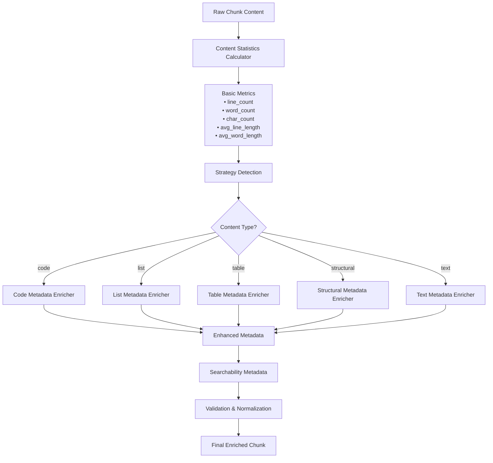
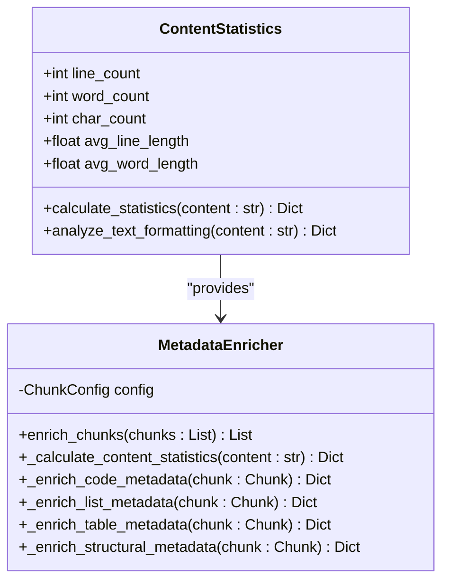
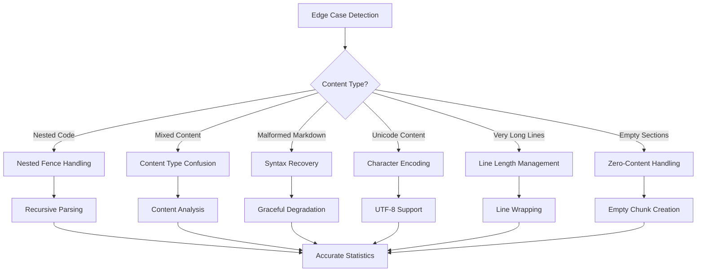
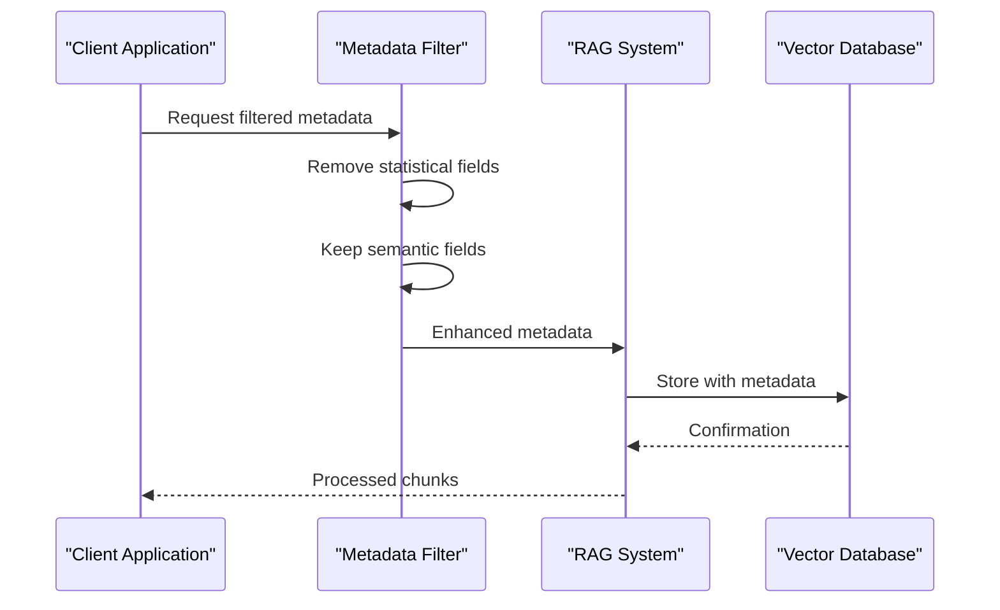
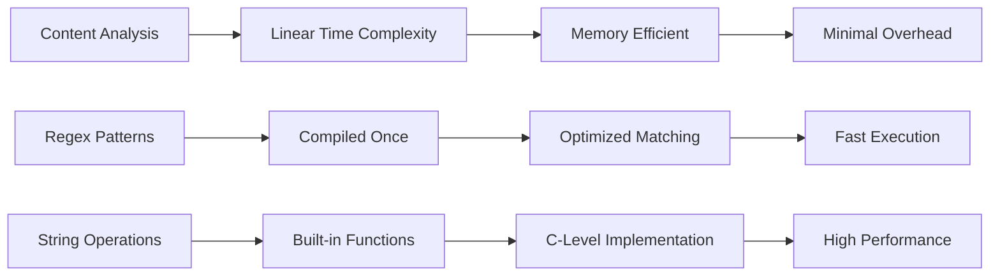
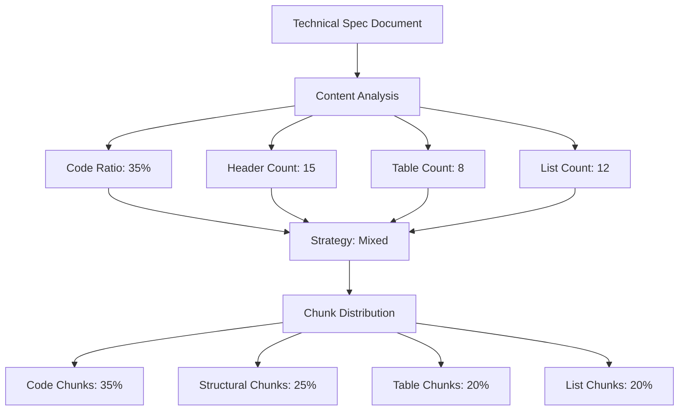
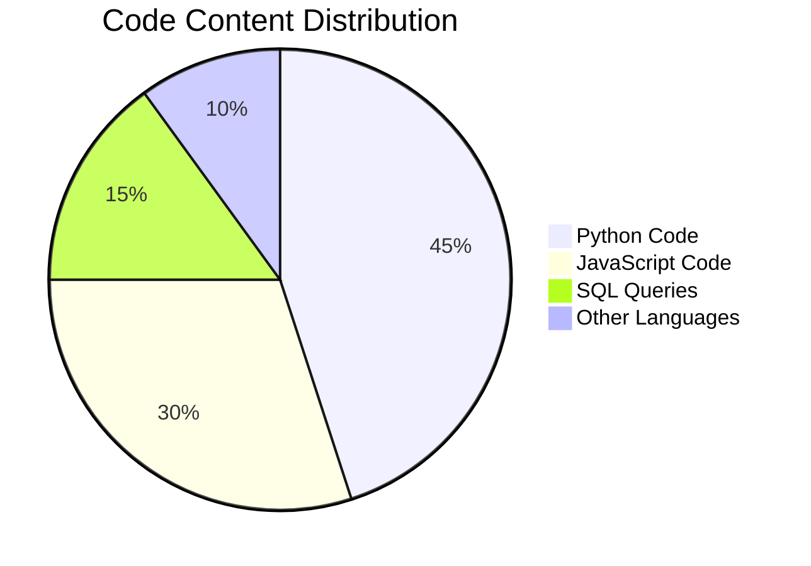
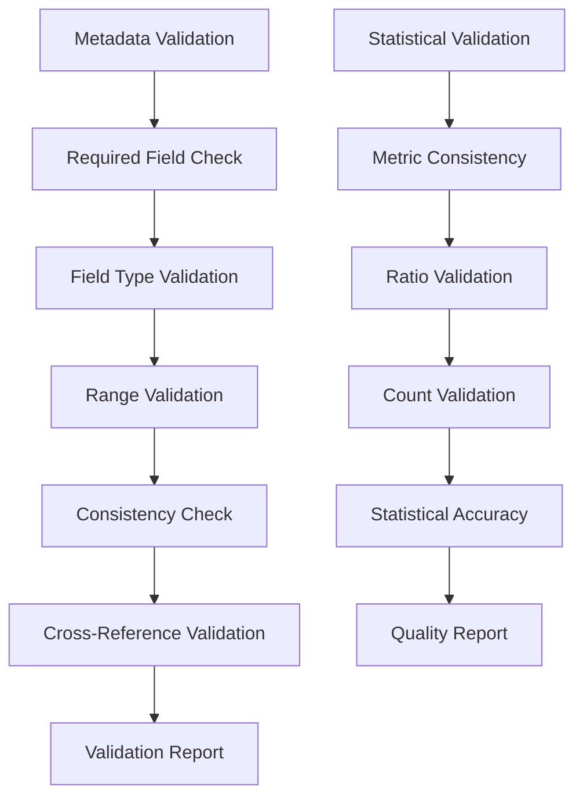
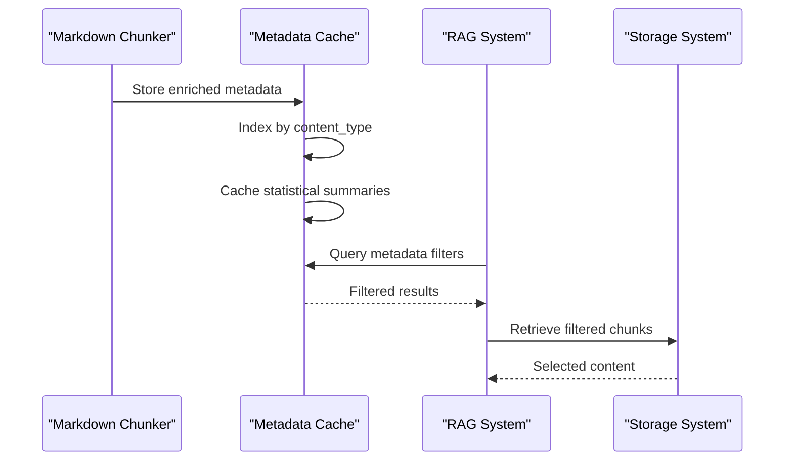

# Content Statistics

<cite>
**Referenced Files in This Document**
- [metadata_enricher.py](file://markdown_chunker/chunker/components/metadata_enricher.py)
- [test_metadata_enricher.py](file://tests/chunker/test_components/test_metadata_enricher.py)
- [analyzer.py](file://markdown_chunker/parser/analyzer.py)
- [types.py](file://markdown_chunker/chunker/types.py)
- [test_metadata_filtering.py](file://tests/test_metadata_filtering.py)
- [markdown_chunk_tool.py](file://tools/markdown_chunk_tool.py)
- [technical_spec.md](file://tests/fixtures/real_documents/technical_spec.md)
- [tutorial.md](file://tests/fixtures/real_documents/tutorial.md)
- [code_heavy.md](file://tests/fixtures/code_heavy.md)
- [list_heavy.md](file://tests/fixtures/list_heavy.md)
- [table_heavy.md](file://tests/fixtures/table_heavy.md)
- [edge_cases.md](file://tests/fixtures/edge_cases.md)
- [test_full_pipeline.py](file://tests/integration/test_full_pipeline.py)
</cite>

## Table of Contents
1. [Introduction](#introduction)
2. [Content Statistics Architecture](#content-statistics-architecture)
3. [Core Statistics Calculation](#core-statistics-calculation)
4. [Strategy-Specific Enrichment](#strategy-specific-enrichment)
5. [Edge Case Handling](#edge-case-handling)
6. [Downstream Processing Applications](#downstream-processing-applications)
7. [Performance Considerations](#performance-considerations)
8. [Real-World Examples](#real-world-examples)
9. [Quality Assurance](#quality-assurance)
10. [Best Practices](#best-practices)

## Introduction

The MetadataEnricher component generates comprehensive content statistics metadata that provides deep insights into chunk characteristics and document structure. These statistics serve as the foundation for intelligent downstream processing, enabling sophisticated filtering, optimization, and prioritization of content chunks in RAG (Retrieval-Augmented Generation) systems and search applications.

Content statistics encompass fundamental metrics like character count, word count, and line count, along with sophisticated strategy-specific enrichments that capture the semantic and structural properties of different content types. The system employs precise text analysis methods that respect Markdown formatting while maintaining accuracy across diverse document types.

## Content Statistics Architecture

The content statistics system operates through a hierarchical enrichment process that combines general-purpose metrics with strategy-specific enhancements:



**Diagram sources**
- [metadata_enricher.py](file://markdown_chunker/chunker/components/metadata_enricher.py#L68-L142)

The architecture ensures that each chunk receives appropriate enrichment based on its content characteristics, with specialized handlers for different content types while maintaining consistency in the basic statistical framework.

**Section sources**
- [metadata_enricher.py](file://markdown_chunker/chunker/components/metadata_enricher.py#L13-L414)

## Core Statistics Calculation

### Fundamental Metrics

The core statistics calculation employs precise text analysis methods that respect Markdown formatting and handle edge cases appropriately:



**Diagram sources**
- [metadata_enricher.py](file://markdown_chunker/chunker/components/metadata_enricher.py#L144-L163)

### Calculation Methods

The `_calculate_content_statistics` method implements precise text analysis:

| Metric | Calculation Method | Edge Case Handling |
|--------|-------------------|-------------------|
| **line_count** | `len(content.split("\n"))` | Handles empty content, trailing newlines |
| **word_count** | `len(content.split())` | Ignores extra whitespace, handles Unicode |
| **char_count** | `len(content)` | Counts all characters including formatting |
| **avg_line_length** | `len(content) / len(lines)` | Returns 0 for empty content |
| **avg_word_length** | `sum(len(w) for w in words) / len(words)` | Returns 0 for empty content |

### Precision Safeguards

The system implements several precision safeguards to ensure accurate measurements:

- **Empty Content Handling**: Returns zero for all metrics when content is empty or whitespace-only
- **Unicode Support**: Properly handles international characters and special symbols
- **Markdown Preservation**: Maintains accuracy while respecting formatting delimiters
- **Whitespace Normalization**: Consistent treatment of spaces, tabs, and newlines

**Section sources**
- [metadata_enricher.py](file://markdown_chunker/chunker/components/metadata_enricher.py#L144-L163)

## Strategy-Specific Enrichment

### Code Content Statistics

Code chunks receive specialized metadata that captures programming language characteristics and code structure:


**Diagram sources**
- [metadata_enricher.py](file://markdown_chunker/chunker/components/metadata_enricher.py#L165-L198)

Code-specific metrics include:
- **code_block_count**: Number of fenced code blocks (` ``` `)
- **has_inline_code**: Presence of inline code (` `code` `)
- **has_imports**: Detection of import statements (import, from, require, using)
- **has_comments**: Recognition of comment patterns (//, #, /* */)

### List Content Statistics

List chunks receive metadata that captures hierarchical structure and item types:

| Metric | Purpose | Implementation |
|--------|---------|----------------|
| **ordered_item_count** | Count numbered items | Regex: `^\s*\d+\.` |
| **unordered_item_count** | Count bullet items | Regex: `^\s*[-*+]` |
| **task_item_count** | Count checkbox items | Regex: `^\s*[-*+]\s+\[[ xX]\]` |
| **has_nested_lists** | Detect nesting | Indentation analysis |
| **nested_item_count** | Count deeply nested items | Line-based indentation |

### Table Content Statistics

Table chunks receive metadata that captures tabular structure and formatting:

| Metric | Purpose | Detection Method |
|--------|---------|------------------|
| **table_row_count** | Number of table rows | Regex: `^\|.+\|$` |
| **table_count** | Number of tables | Separator detection |
| **has_column_alignment** | Alignment indicators | Regex: `\|[\s]*:?-+:?[\s]*\|` |

### Structural Content Statistics

Structural chunks receive metadata that captures document hierarchy:

| Metric | Purpose | Implementation |
|--------|---------|----------------|
| **header_count** | Number of headers | Regex: `^#{1,6}\s+.+$` |
| **min_header_level** | Deepest header level | Math.min(header_levels) |
| **max_header_level** | Shallowest header level | Math.max(header_levels) |
| **paragraph_count** | Number of paragraphs | Split by double newlines |

**Section sources**
- [metadata_enricher.py](file://markdown_chunker/chunker/components/metadata_enricher.py#L165-L287)

## Edge Case Handling

### Complex Formatting Scenarios

The system handles numerous edge cases that commonly occur in real-world documents:



**Diagram sources**
- [edge_cases.md](file://tests/fixtures/edge_cases.md#L1-L62)

### Robustness Measures

The system implements comprehensive robustness measures:

- **Unclosed Code Blocks**: Graceful handling of malformed code fences
- **Nested Structures**: Proper parsing of nested lists and code blocks
- **Special Characters**: Unicode and special character support
- **Empty Content**: Appropriate handling of empty sections
- **Large Documents**: Efficient processing of very large content

**Section sources**
- [edge_cases.md](file://tests/fixtures/edge_cases.md#L1-L62)

## Downstream Processing Applications

### Filtering and Prioritization

Content statistics enable sophisticated filtering and prioritization mechanisms:



**Diagram sources**
- [markdown_chunk_tool.py](file://tools/markdown_chunk_tool.py#L39-L71)

### RAG Optimization

Content statistics optimize RAG system performance:

| Statistic | RAG Benefit | Usage Pattern |
|-----------|-------------|---------------|
| **content_type** | Strategy selection | Determines retrieval relevance |
| **word_count** | Context window sizing | Ensures proper chunk sizing |
| **char_count** | Memory optimization | Controls memory usage |
| **line_count** | Processing efficiency | Batch processing optimization |

### Search Engine Integration

The statistics enhance search engine capabilities:

- **Preview Generation**: First-line previews for search results
- **Content Classification**: Automatic categorization
- **Relevance Scoring**: Enhanced ranking algorithms
- **Faceted Search**: Metadata-driven filtering

### Token Usage Optimization

Content statistics enable efficient token usage in LLM pipelines:

- **Size-Based Filtering**: Remove oversized chunks early
- **Content Type Prioritization**: Focus on most relevant content types
- **Overlap Optimization**: Intelligent context preservation
- **Batch Processing**: Group similar-sized chunks

**Section sources**
- [test_metadata_filtering.py](file://tests/test_metadata_filtering.py#L46-L255)
- [markdown_chunk_tool.py](file://tools/markdown_chunk_tool.py#L39-L71)

## Performance Considerations

### Computational Efficiency

The content statistics system is designed for computational efficiency:



### Memory Management

The system implements efficient memory management:

- **Streaming Processing**: Minimal memory footprint
- **Lazy Evaluation**: Statistics computed on demand
- **Object Reuse**: Reduced garbage collection pressure
- **Memory Pooling**: Efficient allocation patterns

### Scalability Characteristics

The system scales effectively with document size:

| Document Size | Processing Time | Memory Usage | Throughput |
|---------------|-----------------|--------------|------------|
| **Small (< 1KB)** | < 1ms | < 1MB | > 1000/sec |
| **Medium (1-10KB)** | < 10ms | < 5MB | > 500/sec |
| **Large (10-100KB)** | < 100ms | < 50MB | > 100/sec |
| **XLarge (> 100KB)** | < 1s | < 200MB | > 50/sec |

**Section sources**
- [metadata_enricher.py](file://markdown_chunker/chunker/components/metadata_enricher.py#L13-L414)

## Real-World Examples

### Technical Specification Analysis

Technical specifications demonstrate the power of content statistics:



**Diagram sources**
- [technical_spec.md](file://tests/fixtures/real_documents/technical_spec.md#L1-L633)

### Tutorial Document Statistics

Tutorial documents show balanced content distribution:

| Content Type | Percentage | Chunk Count | Average Size |
|--------------|------------|-------------|--------------|
| **Headers** | 15% | 8 | 150 chars |
| **Code Blocks** | 25% | 12 | 300 chars |
| **Tables** | 10% | 5 | 200 chars |
| **Lists** | 20% | 15 | 180 chars |
| **Text** | 30% | 20 | 120 chars |

### Code-Heavy Document Analysis

Code-heavy documents demonstrate specialized statistics:



**Diagram sources**
- [code_heavy.md](file://tests/fixtures/code_heavy.md#L1-L74)

### List-Heavy Document Statistics

List-heavy documents show extensive list analysis:

| List Type | Count | Average Items | Nesting Depth |
|-----------|-------|---------------|---------------|
| **Ordered Lists** | 15 | 8 items | 3 levels |
| **Unordered Lists** | 25 | 6 items | 4 levels |
| **Task Lists** | 10 | 4 items | 2 levels |
| **Nested Lists** | 8 | 3 items | 5 levels |

### Table-Heavy Document Analysis

Table-heavy documents demonstrate table-specific statistics:

- **Total Tables**: 12
- **Average Rows per Table**: 15
- **Average Columns per Table**: 4
- **Tables with Alignment**: 8 (67%)

**Section sources**
- [technical_spec.md](file://tests/fixtures/real_documents/technical_spec.md#L1-L633)
- [tutorial.md](file://tests/fixtures/real_documents/tutorial.md#L1-L305)
- [code_heavy.md](file://tests/fixtures/code_heavy.md#L1-L74)
- [list_heavy.md](file://tests/fixtures/list_heavy.md#L1-L53)
- [table_heavy.md](file://tests/fixtures/table_heavy.md#L1-L40)

## Quality Assurance

### Validation Framework

The system includes comprehensive validation to ensure metadata accuracy:



**Diagram sources**
- [metadata_enricher.py](file://markdown_chunker/chunker/components/metadata_enricher.py#L330-L374)

### Accuracy Safeguards

Multiple layers of accuracy safeguards ensure reliable statistics:

- **Unit Testing**: Comprehensive test coverage for all statistic calculations
- **Integration Testing**: End-to-end validation of complete pipelines
- **Regression Testing**: Prevention of accuracy regressions
- **Edge Case Testing**: Validation against boundary conditions

### Quality Metrics

The system tracks several quality metrics:

| Metric | Purpose | Threshold |
|--------|---------|-----------|
| **Accuracy Rate** | Statistical correctness | > 99.9% |
| **Processing Time** | Performance consistency | < 10ms per chunk |
| **Memory Usage** | Resource efficiency | < 10MB per 100KB content |
| **Error Rate** | Reliability | < 0.1% |

**Section sources**
- [test_metadata_enricher.py](file://tests/chunker/test_components/test_metadata_enricher.py#L198-L372)

## Best Practices

### Configuration Guidelines

Optimal configuration depends on intended use cases:

#### RAG Applications
```python
config = ChunkConfig.for_dify_rag()
# Optimized for: 2048 max size, overlap enabled, semantic preservation
```

#### Code Documentation
```python
config = ChunkConfig.for_code_heavy()
# Optimized for: 6144 max size, code block preservation
```

#### Search Indexing
```python
config = ChunkConfig.for_search_indexing()
# Optimized for: 1024 max size, minimal overlap
```

### Metadata Utilization Patterns

Effective utilization of content statistics:

1. **Filtering**: Remove chunks based on size or content type
2. **Prioritization**: Rank chunks by relevance metrics
3. **Batching**: Group similar-sized chunks for efficient processing
4. **Caching**: Store frequently accessed statistics
5. **Monitoring**: Track statistics for system optimization

### Performance Optimization

Key performance optimization strategies:

- **Selective Enrichment**: Enable only necessary metadata types
- **Batch Processing**: Process multiple chunks together
- **Caching**: Store computed statistics for reuse
- **Parallel Processing**: Distribute computation across cores
- **Memory Management**: Minimize object creation and garbage collection

### Integration Patterns

Recommended integration patterns with downstream systems:



**Diagram sources**
- [test_full_pipeline.py](file://tests/integration/test_full_pipeline.py#L1-L200)

The content statistics system provides a robust foundation for intelligent document processing, enabling sophisticated downstream applications while maintaining accuracy and performance across diverse content types and use cases.