# General Metadata Enrichment Features

<cite>
**Referenced Files in This Document**
- [metadata_enricher.py](file://markdown_chunker/chunker/components/metadata_enricher.py)
- [test_metadata_enricher.py](file://tests/chunker/test_components/test_metadata_enricher.py)
- [core.py](file://markdown_chunker/chunker/core.py)
- [orchestrator.py](file://markdown_chunker/chunker/orchestrator.py)
- [types.py](file://markdown_chunker/chunker/types.py)
- [rag_integration.py](file://examples/rag_integration.py)
- [dify_integration.py](file://examples/dify_integration.py)
- [README.md](file://README.md)
</cite>

## Table of Contents
1. [Introduction](#introduction)
2. [Core Metadata Enrichment Architecture](#core-metadata-enrichment-architecture)
3. [Universal Positional Metadata](#universal-positional-metadata)
4. [Content Statistics and Analysis](#content-statistics-and-analysis)
5. [Strategy-Specific Enrichment](#strategy-specific-enrichment)
6. [Searchability and Discovery Features](#searchability-and-discovery-features)
7. [Validation and Consistency](#validation-and-consistency)
8. [Pipeline Integration](#pipeline-integration)
9. [RAG System Integration](#rag-system-integration)
10. [Best Practices and Usage Patterns](#best-practices-and-usage-patterns)
11. [Troubleshooting and Performance](#troubleshooting-and-performance)

## Introduction

The MetadataEnricher class serves as the cornerstone of the Dify Markdown Chunker's metadata enhancement system, providing comprehensive structural and analytical metadata to chunks throughout the processing pipeline. This component automatically injects universal fields that support pagination, ordering, context reconstruction, and downstream processing requirements, particularly for Retrieval-Augmented Generation (RAG) systems.

The enricher operates as a unified metadata processor that combines general positional information with strategy-specific enhancements, ensuring consistent metadata across all chunk types while preserving original metadata and adding contextual intelligence for downstream applications.

## Core Metadata Enrichment Architecture

The MetadataEnricher follows a modular design pattern that separates concerns between universal metadata injection and strategy-specific enrichment. The architecture consists of several key components:


**Diagram sources**
- [metadata_enricher.py](file://markdown_chunker/chunker/components/metadata_enricher.py#L13-L414)
- [types.py](file://markdown_chunker/chunker/types.py#L36-L414)

The enricher operates through a two-phase process: universal metadata injection followed by strategy-specific enhancement. Universal metadata includes positional information, document context, and content statistics, while strategy-specific metadata provides domain-aware features tailored to code, lists, tables, and structural content.

**Section sources**
- [metadata_enricher.py](file://markdown_chunker/chunker/components/metadata_enricher.py#L13-L414)

## Universal Positional Metadata

The core structural metadata provided by the MetadataEnricher forms the foundation for chunk ordering, pagination, and context reconstruction. These universal fields are automatically injected during the chunk processing pipeline:

### Positional Information Fields

| Field Name | Type | Purpose | Example Value |
|------------|------|---------|---------------|
| `chunk_index` | int | Zero-based position in chunk sequence | `0`, `1`, `2` |
| `total_chunks` | int | Total number of chunks in document | `15` |
| `is_first_chunk` | bool | Indicates first chunk in sequence | `true` |
| `is_last_chunk` | bool | Indicates last chunk in sequence | `false` |

### Implementation Details

The positional metadata injection occurs during the `_enrich_single_chunk` method, which processes each chunk individually while maintaining sequence context:


**Diagram sources**
- [metadata_enricher.py](file://markdown_chunker/chunker/components/metadata_enricher.py#L56-L96)

### Context Reconstruction Benefits

These universal fields enable sophisticated downstream processing capabilities:

- **Pagination Support**: Applications can easily implement pagination by using `chunk_index` and `total_chunks`
- **Sequential Processing**: Systems can process chunks in order using the positional indicators
- **Boundary Detection**: Applications can identify chunk boundaries using `is_first_chunk` and `is_last_chunk`
- **Context Window Creation**: RAG systems can create context windows around specific chunks

**Section sources**
- [metadata_enricher.py](file://markdown_chunker/chunker/components/metadata_enricher.py#L56-L96)

## Content Statistics and Analysis

The MetadataEnricher provides comprehensive content analysis through automated statistical calculations, enabling intelligent downstream processing decisions and content optimization.

### Statistical Metrics

The enricher calculates several categories of content statistics:

#### Quantitative Measurements
- **Line Count**: Total number of lines in the chunk content
- **Word Count**: Total word count for readability analysis
- **Character Count**: Total character count for size management
- **Average Line Length**: Mean line length for formatting assessment
- **Average Word Length**: Mean word length for complexity analysis

#### Calculation Methodology


**Diagram sources**
- [metadata_enricher.py](file://markdown_chunker/chunker/components/metadata_enricher.py#L144-L163)

### Practical Applications

These statistics serve multiple purposes in downstream systems:

- **Size Optimization**: Applications can optimize chunk sizes based on average lengths
- **Content Analysis**: Systems can assess content density and complexity
- **Formatting Decisions**: Applications can make formatting choices based on line characteristics
- **Performance Tuning**: Systems can optimize processing based on content characteristics

**Section sources**
- [metadata_enricher.py](file://markdown_chunker/chunker/components/metadata_enricher.py#L144-L163)

## Strategy-Specific Enrichment

The MetadataEnricher provides domain-aware metadata enhancement based on the content type and strategy used for chunk creation. This strategy-specific enrichment enables intelligent downstream processing and content-aware optimizations.

### Code Content Enhancement

For code-heavy chunks, the enricher provides specialized metadata:

#### Code Detection Features
- **Code Block Count**: Number of fenced code blocks detected
- **Inline Code Presence**: Boolean indicating presence of inline code
- **Import/Include Detection**: Identifies import statements and includes
- **Comment Detection**: Recognizes various comment styles

#### Code Metadata Schema

| Field Pattern | Type | Purpose |
|---------------|------|---------|
| `code_block_count` | int | Number of ``` code blocks |
| `has_inline_code` | bool | Presence of `inline` code |
| `has_imports` | bool | Import statement detection |
| `has_comments` | bool | Comment presence indicator |

### List Content Enhancement

For list-containing chunks, the enricher provides hierarchical structure analysis:

#### List Structure Analysis
- **Ordered Item Count**: Number of numbered list items
- **Unordered Item Count**: Number of bullet list items  
- **Task Item Count**: Number of checkbox-style items
- **Nested List Detection**: Presence of indented sub-lists
- **Nested Item Count**: Number of nested list items

### Table Content Enhancement

For table-containing chunks, the enricher provides structural analysis:

#### Table Structure Analysis
- **Table Row Count**: Number of table rows detected
- **Table Count**: Number of distinct tables
- **Column Alignment**: Presence of column alignment indicators

### Structural Content Enhancement

For structurally organized chunks, the enricher provides hierarchy analysis:

#### Header Analysis
- **Header Count**: Total number of headers detected
- **Minimum Header Level**: Deepest header level (smallest number)
- **Maximum Header Level**: Shallowest header level (largest number)
- **Paragraph Count**: Number of paragraph blocks

### Strategy Selection Logic


**Diagram sources**
- [metadata_enricher.py](file://markdown_chunker/chunker/components/metadata_enricher.py#L118-L130)

**Section sources**
- [metadata_enricher.py](file://markdown_chunker/chunker/components/metadata_enricher.py#L165-L327)

## Searchability and Discovery Features

The MetadataEnricher enhances chunks with searchability metadata that improves discoverability and retrieval performance in downstream applications, particularly RAG systems and search engines.

### Searchability Enhancements

#### Preview Generation
- **First Sentence Extraction**: Extracts the first sentence or line as a preview
- **Length Limiting**: Caps preview length at 200 characters with ellipsis
- **Content Summarization**: Provides concise content summaries

#### Feature Detection
The enricher identifies and annotates various content features:

| Feature Category | Detection Method | Purpose |
|------------------|------------------|---------|
| URLs | Regex pattern matching | Link identification |
| Email Addresses | Email pattern recognition | Contact information |
| Numbers | Numeric pattern detection | Data identification |
| Formatting | Markdown syntax detection | Rich content |
| Special Characters | Character set analysis | Content diversity |

### Searchability Metadata Schema


**Diagram sources**
- [metadata_enricher.py](file://markdown_chunker/chunker/components/metadata_enricher.py#L289-L327)

### Practical Applications

These searchability features enable:

- **Intelligent Search**: Applications can index and search based on content features
- **Relevance Scoring**: Systems can rank results based on feature presence
- **Content Classification**: Applications can categorize content by features
- **User Experience**: Systems can provide rich previews and highlights

**Section sources**
- [metadata_enricher.py](file://markdown_chunker/chunker/components/metadata_enricher.py#L289-L327)

## Validation and Consistency

The MetadataEnricher includes comprehensive validation logic to ensure metadata consistency across chunk sequences and prevent index mismatches or incorrect flagging.

### Validation Framework

#### Required Field Validation
The validator ensures essential metadata fields are present:


**Diagram sources**
- [metadata_enricher.py](file://markdown_chunker/chunker/components/metadata_enricher.py#L330-L374)

#### Consistency Checks

The validation system performs several critical consistency checks:

1. **Index Validation**: Ensures `chunk_index` values match their position
2. **Count Validation**: Verifies `total_chunks` values are consistent
3. **Field Presence**: Confirms required metadata fields exist
4. **Type Consistency**: Validates data types across chunks

### Validation Results

The validation system returns comprehensive reports:

| Report Field | Type | Purpose |
|--------------|------|---------|
| `valid` | bool | Overall validation success |
| `issue_count` | int | Number of validation issues |
| `issues` | List[str] | Detailed issue descriptions |

### Error Prevention

The validation framework prevents common metadata inconsistencies:

- **Index Mismatches**: Prevents incorrect positioning in sequences
- **Count Inconsistencies**: Ensures accurate chunk counting
- **Missing Fields**: Guarantees required metadata availability
- **Type Errors**: Maintains data type consistency

**Section sources**
- [metadata_enricher.py](file://markdown_chunker/chunker/components/metadata_enricher.py#L330-L374)

## Pipeline Integration

The MetadataEnricher integrates seamlessly into the chunking pipeline, operating as a critical post-processing component that enhances chunks after strategy application and before final output transformation.

### Pipeline Stages


**Diagram sources**
- [core.py](file://markdown_chunker/chunker/core.py#L256-L345)
- [orchestrator.py](file://markdown_chunker/chunker/orchestrator.py#L55-L118)

### Integration Points

#### Post-Strategy Application
The enricher operates immediately after strategy application, ensuring that strategy-specific metadata is available for subsequent processing stages.

#### Pre-Output Transformation
Metadata enrichment occurs before output transformation, allowing downstream systems to rely on consistent metadata formats.

#### Error Handling Integration
The enricher participates in the pipeline's error handling mechanism, with graceful degradation if enrichment fails.

### Configuration Integration

The enricher respects configuration settings that affect its behavior:

- **Overlap Settings**: Influence metadata for overlapping chunks
- **Fallback Information**: Incorporate fallback strategy metadata
- **Document Context**: Respect document-level configuration

**Section sources**
- [core.py](file://markdown_chunker/chunker/core.py#L286-L300)

## RAG System Integration

The MetadataEnricher provides essential metadata that enables sophisticated RAG (Retrieval-Augmented Generation) system functionality, supporting context reconstruction, relevance scoring, and intelligent retrieval.

### RAG-Optimized Metadata

#### Context Window Support
The universal positional metadata enables efficient context window creation:

```mermaid
flowchart TD
TargetChunk[Target Chunk] --> GetPosition["Get chunk_index and total_chunks"]
GetPosition --> CalcWindow["Calculate Window Bounds<br/>(index ± window_size)"]
CalcWindow --> ValidateBounds["Validate Bounds<br/>(0 to total_chunks)"]
ValidateBounds --> CollectChunks["Collect Surrounding Chunks"]
CollectChunks --> CreateContext["Create Context String"]
CreateContext --> MarkTarget["Mark Target Chunk"]
MarkTarget --> ReturnContext["Return Context Window"]
```



**Diagram sources**
- [rag_integration.py](file://examples/rag_integration.py#L101-L136)

#### Content Type Filtering
The enricher's content type metadata enables intelligent filtering:

| Content Type | RAG Use Case | Filtering Criteria |
|--------------|--------------|-------------------|
| `code` | Code retrieval | Language-specific queries |
| `text` | General text | Broad semantic search |
| `list` | Structured data | Hierarchical queries |
| `table` | Tabular data | Column-based filtering |
| `structured` | Document structure | Header-based navigation |

### Embedding Preparation

The enricher's metadata supports efficient embedding generation:

#### Embedding Metadata Schema
- **Content Type**: Enables content-aware embedding strategies
- **Language**: Supports multilingual embedding approaches
- **Structure**: Facilitates hierarchical embedding organization
- **Features**: Provides feature-rich embedding contexts

### Vector Database Integration

The enricher's metadata facilitates vector database operations:

- **Chunk Identification**: Unique chunk identifiers for database keys
- **Source Tracking**: Document and section information for provenance
- **Content Analysis**: Metadata for query optimization
- **Quality Indicators**: Confidence scores for retrieval ranking

**Section sources**
- [rag_integration.py](file://examples/rag_integration.py#L13-L432)

## Best Practices and Usage Patterns

### Configuration Recommendations

#### Production Deployment
For production RAG systems, configure the enricher with:

```python
# Recommended configuration for RAG systems
config = ChunkConfig(
    max_chunk_size=512,  # Smaller chunks for embeddings
    min_chunk_size=100,  # Minimum content preservation
    enable_overlap=True, # Context preservation
    overlap_size=50      # 10% overlap for context
)
```

#### Development and Testing
For development environments:

```python
# Development-friendly configuration
config = ChunkConfig(
    max_chunk_size=1024,  # Larger chunks for testing
    min_chunk_size=200,   # Reasonable minimum
    enable_overlap=False  # Simplified for testing
)
```

### Metadata Utilization Patterns

#### Chunk Reassembly
Use universal metadata for document reconstruction:

```python
# Reassemble original document from chunks
def reconstruct_document(chunks):
    return "".join(chunk.content for chunk in sorted(
        chunks, 
        key=lambda c: c.metadata.get('chunk_index', 0)
    ))
```

#### Content Analysis
Leverage enriched metadata for content analysis:

```python
# Analyze content distribution by type
def analyze_content_distribution(chunks):
    content_types = {}
    for chunk in chunks:
        content_type = chunk.metadata.get('content_type', 'unknown')
        content_types[content_type] = content_types.get(content_type, 0) + 1
    return content_types
```

### Performance Optimization

#### Batch Processing
Process chunks in batches for optimal performance:

```python
# Efficient batch processing
def process_large_document(document, chunker):
    result = chunker.chunk_with_analysis(document)
    enriched_chunks = enricher.enrich_chunks(
        result.chunks,
        document_id=result.document_id
    )
    return enriched_chunks
```

#### Memory Management
Monitor memory usage during enrichment:

```python
# Memory-efficient processing
def stream_process_chunks(chunks):
    for i, chunk in enumerate(chunks):
        enriched = enricher._enrich_single_chunk(
            chunk, i, len(chunks)
        )
        yield enriched
```

**Section sources**
- [test_metadata_enricher.py](file://tests/chunker/test_components/test_metadata_enricher.py#L285-L371)

## Troubleshooting and Performance

### Common Issues and Solutions

#### Metadata Validation Failures
**Problem**: Validation reports indicate metadata inconsistencies
**Solution**: Ensure chunks are processed in order and validate before enrichment

#### Performance Degradation
**Problem**: Enrichment causing performance bottlenecks
**Solution**: Use batch processing and consider selective enrichment for large documents

#### Missing Strategy Metadata
**Problem**: Strategy-specific metadata not appearing
**Solution**: Verify strategy selection and ensure content matches expected patterns

### Performance Monitoring

#### Benchmarking Enrichment
Monitor enrichment performance:

```python
import time

def benchmark_enrichment(chunks):
    start_time = time.time()
    enriched = enricher.enrich_chunks(chunks)
    end_time = time.time()
    
    print(f"Enrichment time: {end_time - start_time:.3f}s")
    print(f"Chunks processed: {len(enriched)}")
    print(f"Throughput: {len(enriched)/(end_time-start_time):.2f} chunks/sec")
    
    return enriched
```

#### Memory Usage Analysis
Track memory consumption during enrichment:

```python
import psutil
import os

def monitor_memory_usage(chunks):
    process = psutil.Process(os.getpid())
    initial_memory = process.memory_info().rss
    
    enriched = enricher.enrich_chunks(chunks)
    
    final_memory = process.memory_info().rss
    memory_delta = final_memory - initial_memory
    
    print(f"Memory delta: {(memory_delta/1024/1024):.2f} MB")
    
    return enriched
```

### Debugging Tools

#### Metadata Inspection
Inspect enriched metadata for debugging:

```python
def inspect_metadata(chunks):
    for i, chunk in enumerate(chunks):
        metadata = chunk.metadata
        print(f"Chunk {i}:")
        print(f"  Position: {metadata.get('chunk_index')}/{metadata.get('total_chunks')}")
        print(f"  Type: {metadata.get('content_type')}")
        print(f"  Strategy: {metadata.get('strategy')}")
        print(f"  Stats: {metadata.get('word_count')} words, {metadata.get('char_count')} chars")
```

#### Validation Reporting
Generate detailed validation reports:

```python
def detailed_validation_report(chunks):
    validation = enricher.validate_metadata(chunks)
    
    print(f"Validation Status: {'PASS' if validation['valid'] else 'FAIL'}")
    print(f"Issues Found: {validation['issue_count']}")
    
    if not validation['valid']:
        print("Issues:")
        for issue in validation['issues']:
            print(f"  - {issue}")
    
    return validation
```

**Section sources**
- [test_metadata_enricher.py](file://tests/chunker/test_components/test_metadata_enricher.py#L197-L234)