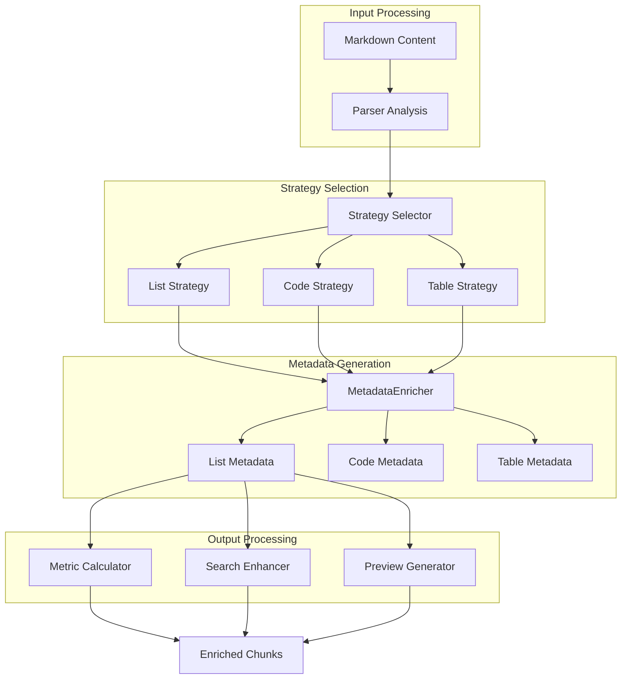
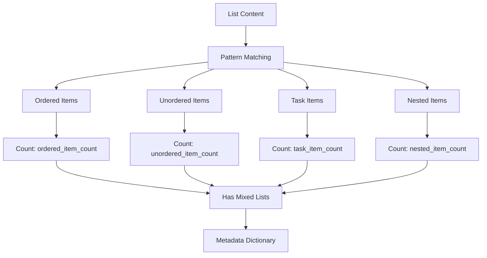
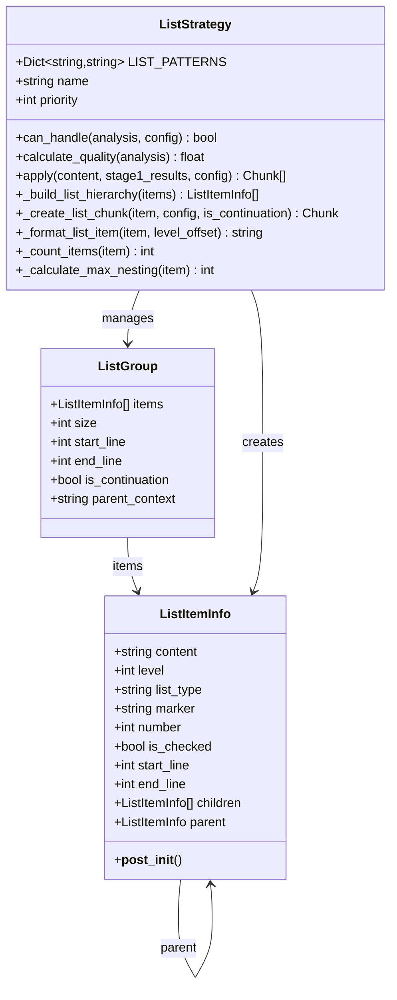
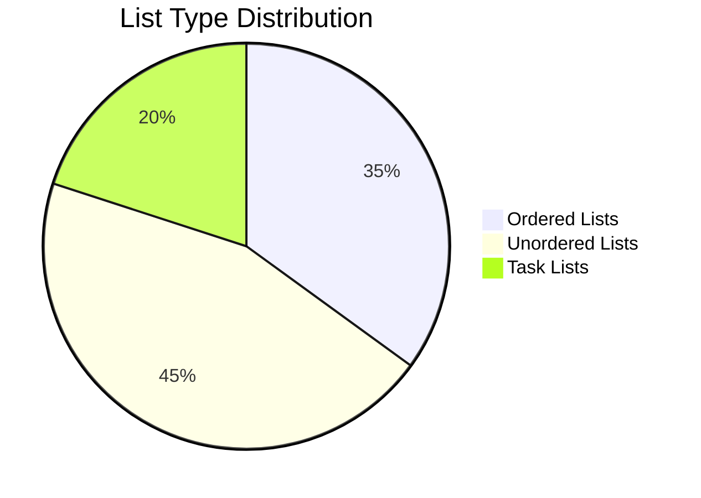
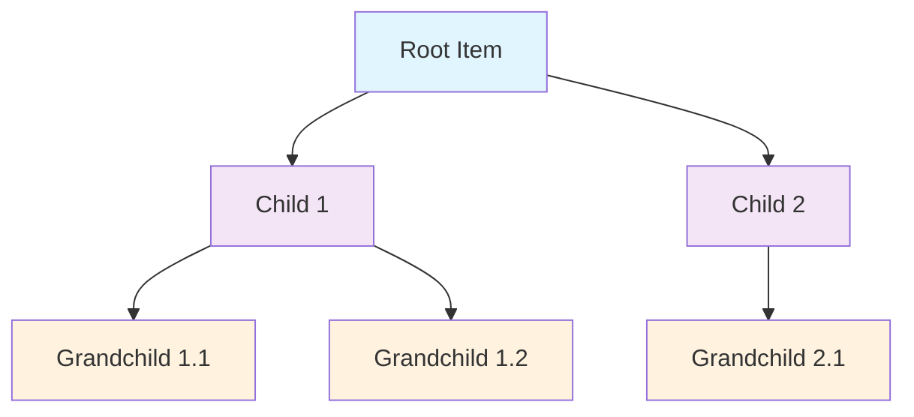
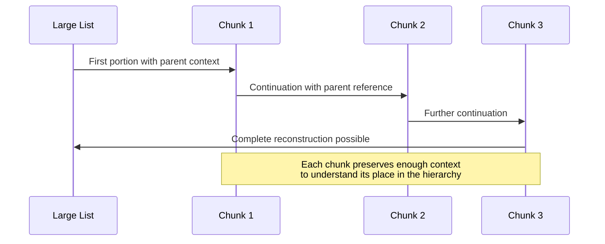

# List Metadata

<cite>
**Referenced Files in This Document**
- [metadata_enricher.py](file://markdown_chunker/chunker/components/metadata_enricher.py)
- [list_strategy.py](file://markdown_chunker/chunker/strategies/list_strategy.py)
- [types.py](file://markdown_chunker/chunker/types.py)
- [test_metadata_enricher.py](file://tests/chunker/test_components/test_metadata_enricher.py)
- [test_list_strategy.py](file://tests/chunker/test_strategies/test_list_strategy.py)
- [list_heavy.md](file://tests/fixtures/list_heavy.md)
- [orchestrator.py](file://markdown_chunker/chunker/orchestrator.py)
</cite>

## Table of Contents
1. [Introduction](#introduction)
2. [System Architecture](#system-architecture)
3. [MetadataEnricher Component](#metadataenricher-component)
4. [List Strategy Integration](#list-strategy-integration)
5. [List Metadata Fields](#list-metadata-fields)
6. [Hierarchical Structure Preservation](#hierarchical-structure-preservation)
7. [Mixed List Type Detection](#mixed-list-type-detection)
8. [Fragment Reconstruction](#fragment-reconstruction)
9. [Search Relevance Enhancement](#search-relevance-enhancement)
10. [Performance Considerations](#performance-considerations)
11. [Testing and Validation](#testing-and-validation)
12. [Conclusion](#conclusion)

## Introduction

The list-specific metadata enrichment system in the Markdown Chunker provides comprehensive semantic understanding of list structures within markdown documents. This system analyzes ordered, unordered, task, and nested lists to generate rich metadata that enables intelligent chunking, search enhancement, and context preservation. The metadata includes quantitative measures like item counts and nesting depths, as well as qualitative indicators like list type distributions and structural characteristics.

The system operates through two primary components: the MetadataEnricher, which adds strategy-specific metadata to chunks, and the ListStrategy, which processes list-heavy documents while maintaining hierarchical relationships. Together, they provide the foundation for applications requiring procedural content understanding, such as checklist extraction, step-by-step guide processing, and task management systems.

## System Architecture

The list metadata enrichment system follows a modular architecture that separates concerns between metadata analysis and list processing:

**Diagram sources**
- [orchestrator.py](file://markdown_chunker/chunker/orchestrator.py#L23-L118)
- [metadata_enricher.py](file://markdown_chunker/chunker/components/metadata_enricher.py#L13-L142)

The architecture ensures that list metadata is generated consistently across different chunking strategies while maintaining the hierarchical integrity of list structures.

**Section sources**
- [orchestrator.py](file://markdown_chunker/chunker/orchestrator.py#L23-L118)
- [metadata_enricher.py](file://markdown_chunker/chunker/components/metadata_enricher.py#L13-L142)

## MetadataEnricher Component

The MetadataEnricher serves as the central component for adding comprehensive metadata to chunks, with specialized handling for list content. It operates by analyzing content patterns and applying strategy-specific enrichment logic.

### Core Functionality

The MetadataEnricher provides several key capabilities:

1. **Positional Metadata**: Tracks chunk positioning within the document sequence
2. **Content Statistics**: Calculates word count, line count, and character metrics
3. **Strategy-Specific Enrichment**: Applies specialized metadata based on content type
4. **Searchability Enhancement**: Adds preview text and content feature detection
5. **Validation and Normalization**: Ensures metadata consistency and completeness

### List Metadata Enrichment

For list content, the MetadataEnricher applies sophisticated pattern matching to extract meaningful metadata:

**Diagram sources**
- [metadata_enricher.py](file://markdown_chunker/chunker/components/metadata_enricher.py#L200-L227)

The enrichment process uses regular expressions to identify different list types and their characteristics, ensuring accurate classification and counting.

**Section sources**
- [metadata_enricher.py](file://markdown_chunker/chunker/components/metadata_enricher.py#L200-L227)

## List Strategy Integration

The ListStrategy integrates closely with the metadata enrichment system to maintain list hierarchy while generating meaningful metadata. The strategy builds hierarchical structures from flat list items and generates metadata that reflects the true nature of the list organization.

### Hierarchical Structure Building

The ListStrategy creates a tree-like structure from linear list items by analyzing indentation levels and parent-child relationships:

**Diagram sources**
- [list_strategy.py](file://markdown_chunker/chunker/strategies/list_strategy.py#L26-L58)
- [list_strategy.py](file://markdown_chunker/chunker/strategies/list_strategy.py#L58-L853)

### Metadata Generation Process

The ListStrategy generates comprehensive metadata for each list chunk:

| Field | Description | Calculation Method |
|-------|-------------|-------------------|
| `list_type` | Primary list type (ordered, unordered, task) | Determined from markers and content patterns |
| `item_count` | Total number of items including children | Recursive counting of all descendants |
| `max_nesting` | Maximum nesting level in the list | Depth calculation from root to deepest child |
| `has_nested_items` | Indicates presence of nested lists | Boolean flag based on children count |
| `is_continuation` | Marks chunks that continue previous lists | Based on chunk boundaries vs. list structure |
| `start_number` | Starting number for ordered lists | Extracted from the first item's marker |
| `is_checked` | Task completion status for task lists | Boolean extracted from checkbox state |

**Section sources**
- [list_strategy.py](file://markdown_chunker/chunker/strategies/list_strategy.py#L605-L641)
- [list_strategy.py](file://markdown_chunker/chunker/strategies/list_strategy.py#L730-L759)

## List Metadata Fields

The system generates several categories of metadata that provide comprehensive understanding of list structures:

### Quantitative Metrics

These fields provide numerical measurements of list characteristics:

- **`ordered_item_count`**: Number of numbered items in the list
- **`unordered_item_count`**: Number of bullet-point items
- **`task_item_count`**: Number of checklist/task items
- **`nested_item_count`**: Number of items with indentation indicating nesting
- **`item_count`**: Total number of items including all descendants

### Qualitative Indicators

These fields describe structural and functional characteristics:

- **`list_type`**: Primary list type (determined from majority or dominant type)
- **`has_nested_lists`**: Boolean indicating presence of nested structures
- **`has_task_items`**: Boolean indicating presence of checklist items
- **`max_nesting`**: Maximum depth of nested list structure
- **`is_continuation`**: Indicates if the chunk continues a previous list

### List Type Distribution

The system tracks the distribution of different list types within chunks:

**Diagram sources**
- [list_strategy.py](file://markdown_chunker/chunker/strategies/list_strategy.py#L815-L852)

**Section sources**
- [metadata_enricher.py](file://markdown_chunker/chunker/components/metadata_enricher.py#L213-L227)
- [list_strategy.py](file://markdown_chunker/chunker/strategies/list_strategy.py#L605-L641)

## Hierarchical Structure Preservation

The system maintains strict hierarchical integrity through several mechanisms:

### Parent-Child Relationships

Each list item maintains explicit parent-child relationships, enabling accurate reconstruction of the original structure:

**Diagram sources**
- [list_strategy.py](file://markdown_chunker/chunker/strategies/list_strategy.py#L373-L407)

### Level-Based Navigation

The system uses indentation-based level detection to maintain structural accuracy:

- **Level 1**: Top-level items
- **Level 2+**: Nested items with progressive indentation
- **Consistent Formatting**: Maintains original indentation patterns

### Continuation Handling

For large lists that exceed chunk size limits, the system preserves context through continuation chunks:

- **Parent Context**: Includes parent items when continuing nested structures
- **Context Preservation**: Maintains list hierarchy across chunk boundaries
- **Seamless Integration**: Continuation chunks integrate naturally with parent structures

**Section sources**
- [list_strategy.py](file://markdown_chunker/chunker/strategies/list_strategy.py#L373-L407)
- [list_strategy.py](file://markdown_chunker/chunker/strategies/list_strategy.py#L589-L604)

## Mixed List Type Detection

The system handles documents containing multiple list types by detecting and managing mixed content intelligently:

### Detection Logic

The mixed list detection operates through several mechanisms:

1. **Pattern Recognition**: Identifies different list markers and patterns
2. **Type Classification**: Categorizes items as ordered, unordered, or task lists
3. **Distribution Analysis**: Analyzes the prevalence of different list types
4. **Context Awareness**: Considers the surrounding content for accurate classification

### Handling Complex Scenarios

The system addresses challenging scenarios such as:

- **Mixed Type Documents**: Documents containing multiple list types
- **Nested Mixed Lists**: Lists with different types at different nesting levels
- **Incomplete Lists**: Lists with inconsistent formatting or missing markers

### Metadata Accuracy in Complex Nesting

In complex nesting scenarios, the system maintains accuracy through:

- **Recursive Analysis**: Deep analysis of nested structures
- **Context Preservation**: Maintaining accurate parent-child relationships
- **Type Consistency**: Ensuring consistent type labeling across the hierarchy

**Section sources**
- [list_strategy.py](file://markdown_chunker/chunker/strategies/list_strategy.py#L351-L371)
- [list_strategy.py](file://markdown_chunker/chunker/strategies/list_strategy.py#L706-L728)

## Fragment Reconstruction

The metadata system enables effective reconstruction of list context from fragmented chunks:

### Context Preservation

Each chunk includes sufficient metadata to understand its position within the larger list structure:

- **Parent Information**: References to parent items when applicable
- **Sibling Relationships**: Awareness of adjacent items
- **Hierarchy Level**: Exact nesting level within the structure

### Continuation Strategies

For large lists requiring fragmentation, the system employs several continuation strategies:

**Diagram sources**
- [list_strategy.py](file://markdown_chunker/chunker/strategies/list_strategy.py#L589-L604)

### Application Support

The reconstructed context supports various applications:

- **Checklist Extraction**: Accurate extraction of task lists with completion status
- **Step-by-Step Guides**: Proper sequencing of procedural content
- **Instruction Processing**: Maintaining logical flow in instructional materials
- **Task Management**: Integration with task management systems

**Section sources**
- [list_strategy.py](file://markdown_chunker/chunker/strategies/list_strategy.py#L589-L604)
- [list_strategy.py](file://markdown_chunker/chunker/strategies/list_strategy.py#L706-L728)

## Search Relevance Enhancement

The list metadata significantly improves search relevance for procedural content through several mechanisms:

### Semantic Enhancement

The system adds semantic information that enhances searchability:

- **Content Preview**: Generates preview text for quick identification
- **Feature Detection**: Identifies URLs, emails, numbers, and formatting
- **Structure Indicators**: Highlights list structure and hierarchy
- **Content Type**: Specifies list type for targeted searches

### Procedural Content Optimization

For documents containing procedural content, the system provides:

- **Step Tracking**: Identifies sequential steps in ordered lists
- **Task Completion**: Highlights completed vs. pending tasks
- **Hierarchy Awareness**: Understands importance based on nesting level
- **Content Weighting**: Prioritizes significant list items

### Search Field Utilization

The enriched metadata enables sophisticated search capabilities:

| Search Field | Use Case | Example Query |
|--------------|----------|---------------|
| `list_type` | Filter by list type | `list_type:"ordered"` |
| `item_count` | Find lists with specific sizes | `item_count:>10` |
| `max_nesting` | Locate complex structures | `max_nesting:>3` |
| `has_task_items` | Find checklist documents | `has_task_items:true` |
| `is_continuation` | Find fragmented content | `is_continuation:false` |

### Relevance Scoring

The metadata enables intelligent relevance scoring:

- **Content Type Weighting**: Different list types receive appropriate weights
- **Completeness Indicators**: Completed tasks may receive higher relevance
- **Hierarchy Importance**: Deeper nesting may indicate higher importance
- **Context Preservation**: Continuation chunks maintain relevance

**Section sources**
- [metadata_enricher.py](file://markdown_chunker/chunker/components/metadata_enricher.py#L289-L327)
- [list_strategy.py](file://markdown_chunker/chunker/strategies/list_strategy.py#L815-L852)

## Performance Considerations

The list metadata enrichment system is designed for efficient processing of large documents:

### Pattern Matching Efficiency

The system uses optimized regular expressions for pattern matching:

- **Compiled Patterns**: Regular expressions are compiled once for reuse
- **Multi-line Matching**: Efficient handling of multi-line list items
- **Lazy Evaluation**: Minimal processing for non-list content

### Memory Management

Memory usage is optimized through:

- **Streaming Processing**: Processing occurs in streams to minimize memory footprint
- **Lazy Loading**: Metadata is generated only when needed
- **Efficient Data Structures**: Optimized data structures for list hierarchy storage

### Scalability Features

The system scales effectively with document size:

- **Linear Complexity**: Processing time scales linearly with content size
- **Batch Processing**: Multiple chunks can be processed simultaneously
- **Incremental Analysis**: Metadata can be updated incrementally

### Optimization Strategies

Several optimization strategies enhance performance:

- **Early Termination**: Stop processing when sufficient information is gathered
- **Caching**: Cache frequently accessed metadata
- **Parallel Processing**: Utilize multiple cores for independent operations

**Section sources**
- [metadata_enricher.py](file://markdown_chunker/chunker/components/metadata_enricher.py#L200-L227)
- [list_strategy.py](file://markdown_chunker/chunker/strategies/list_strategy.py#L500-L520)

## Testing and Validation

The system includes comprehensive testing to ensure reliability and accuracy:

### Unit Tests

Extensive unit tests cover individual components:

- **Pattern Matching**: Tests for accurate list type detection
- **Hierarchy Building**: Validates tree construction accuracy
- **Metadata Generation**: Ensures correct metadata field creation
- **Edge Cases**: Handles unusual formatting and malformed lists

### Integration Tests

Integration tests verify system-wide functionality:

- **End-to-End Processing**: Complete pipeline testing
- **Cross-Component Interaction**: Validates component cooperation
- **Real Document Testing**: Uses realistic documents for validation
- **Performance Benchmarks**: Measures system performance

### Validation Framework

The system includes robust validation:

- **Metadata Consistency**: Ensures metadata accuracy
- **Structure Integrity**: Validates hierarchical correctness
- **Content Preservation**: Verifies no information loss
- **Error Handling**: Tests graceful degradation

### Test Coverage

Key test areas include:

- **List Type Detection**: Accuracy in identifying different list types
- **Nesting Handling**: Correct processing of nested structures
- **Mixed Content**: Handling of documents with multiple list types
- **Large Documents**: Performance with extensive list content
- **Edge Cases**: Robustness with malformed or unusual content

**Section sources**
- [test_metadata_enricher.py](file://tests/chunker/test_components/test_metadata_enricher.py#L1-L372)
- [test_list_strategy.py](file://tests/chunker/test_strategies/test_list_strategy.py#L1-L802)

## Conclusion

The list-specific metadata enrichment system provides a comprehensive solution for understanding and processing list structures within markdown documents. Through its sophisticated combination of pattern matching, hierarchical analysis, and metadata generation, the system enables accurate reconstruction of list context, improved search relevance, and support for applications requiring procedural content understanding.

The system's strength lies in its ability to maintain strict hierarchical integrity while providing rich semantic information that enhances downstream applications. The integration between the MetadataEnricher and ListStrategy ensures consistent metadata generation across different chunking scenarios, while the comprehensive testing framework guarantees reliability and accuracy.

Key benefits of the system include:

- **Accurate List Understanding**: Precise detection and classification of different list types
- **Hierarchical Integrity**: Strict preservation of parent-child relationships
- **Rich Metadata**: Comprehensive semantic information for enhanced processing
- **Scalable Performance**: Efficient processing of large documents
- **Robust Validation**: Comprehensive testing and validation framework

The system serves as a foundation for applications requiring procedural content processing, from task management systems to documentation analysis tools, providing the semantic understanding necessary for intelligent content processing and retrieval.