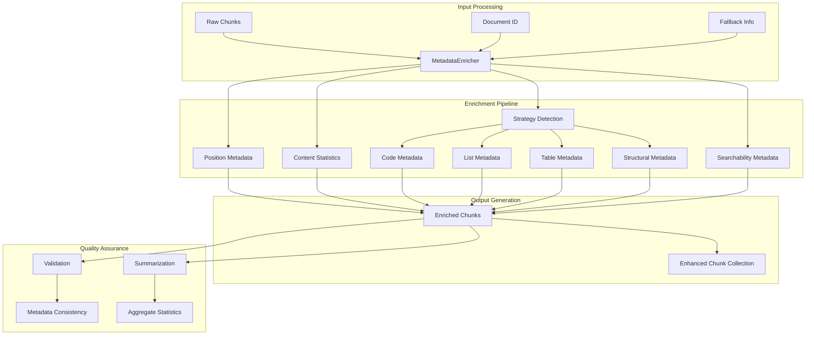
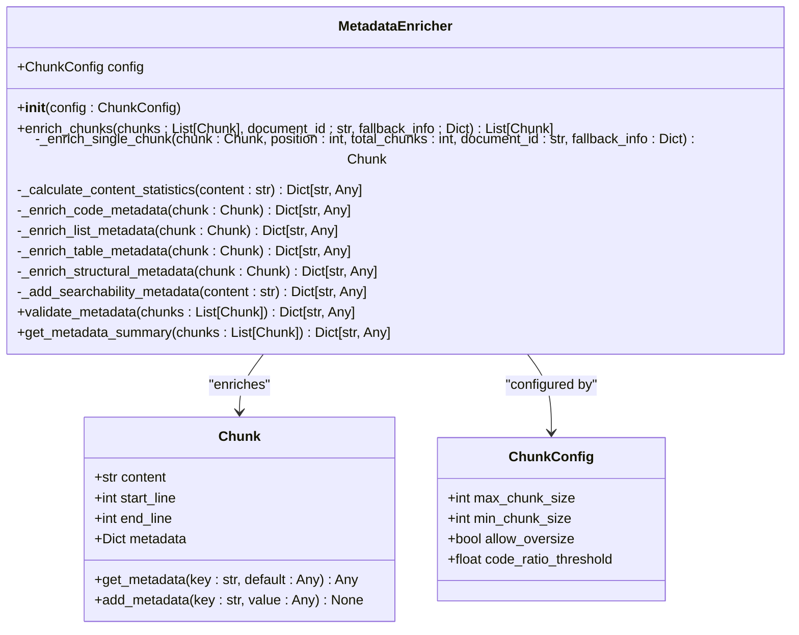
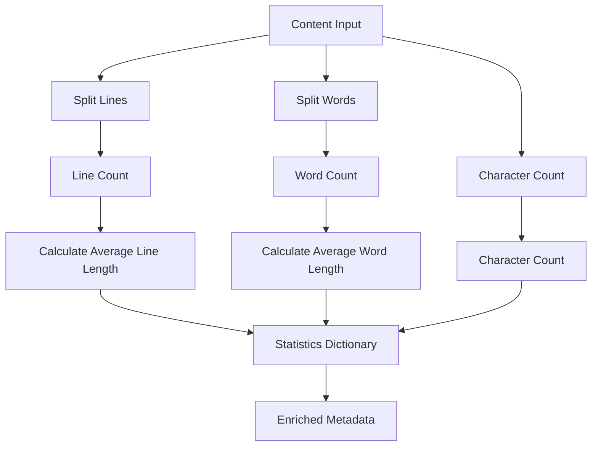
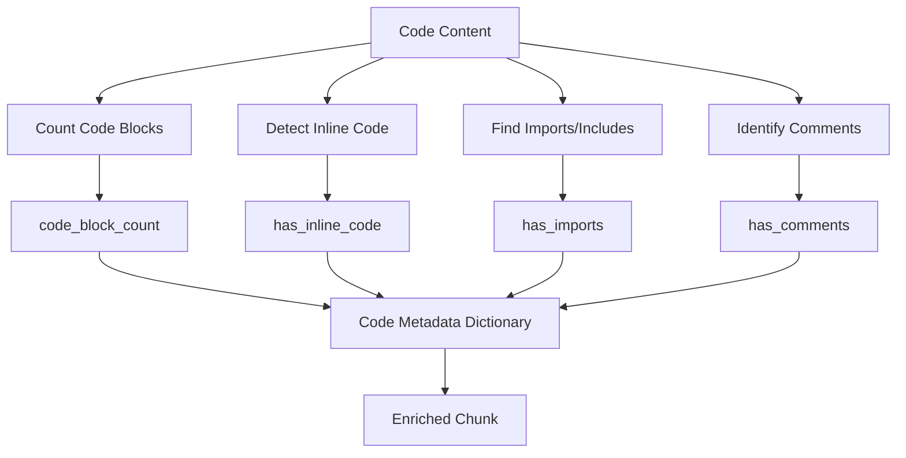
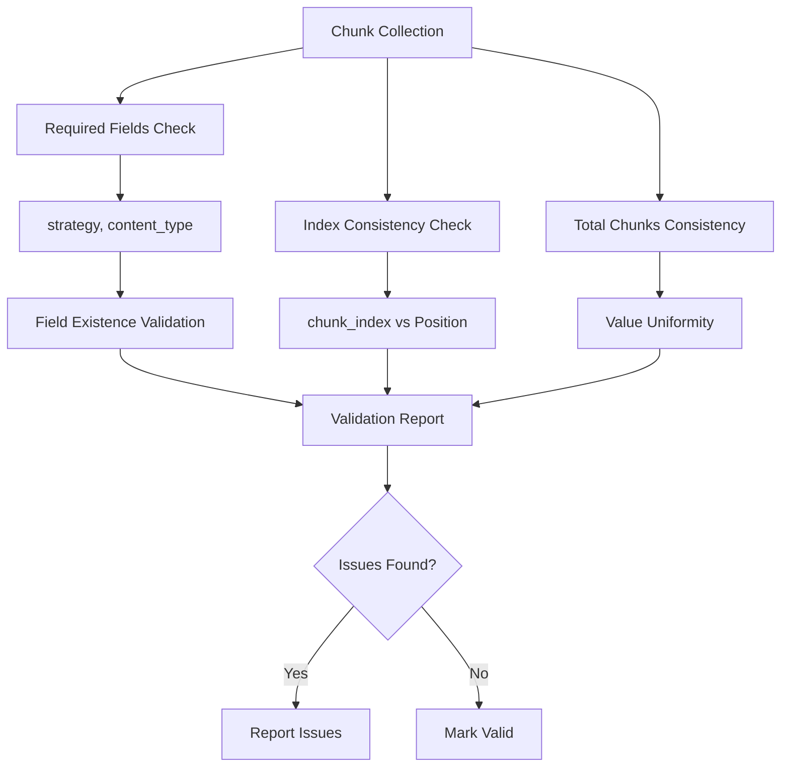

# Metadata Enrichment

<cite>
**Referenced Files in This Document**
- [metadata_enricher.py](file://markdown_chunker/chunker/components/metadata_enricher.py)
- [test_metadata_enricher.py](file://tests/chunker/test_components/test_metadata_enricher.py)
- [types.py](file://markdown_chunker/chunker/types.py)
- [code_heavy.md](file://tests/fixtures/code_heavy.md)
- [list_heavy.md](file://tests/fixtures/list_heavy.md)
- [table_heavy.md](file://tests/fixtures/table_heavy.md)
- [README.md](file://README.md)
</cite>

## Table of Contents
1. [Introduction](#introduction)
2. [System Architecture](#system-architecture)
3. [MetadataEnricher Class Overview](#metadataenricher-class-overview)
4. [General Metadata Enhancement](#general-metadata-enhancement)
5. [Content Statistics Calculation](#content-statistics-calculation)
6. [Strategy-Specific Enrichment](#strategy-specific-enrichment)
7. [Searchability Metadata](#searchability-metadata)
8. [Validation and Summarization](#validation-and-summarization)
9. [Downstream Applications](#downstream-applications)
10. [Performance Considerations](#performance-considerations)
11. [Testing and Quality Assurance](#testing-and-quality-assurance)
12. [Conclusion](#conclusion)

## Introduction

The MetadataEnricher component is a sophisticated system that enhances markdown chunks with comprehensive metadata to improve their usability, searchability, and downstream processing capabilities. This system serves as a critical bridge between raw content chunks and intelligent downstream applications, providing rich contextual information that enables advanced retrieval and processing workflows.

The metadata enrichment system operates as a post-processing layer that analyzes each chunk's content and structure, adding strategic metadata that reflects the chunk's characteristics, position within the document, and potential use cases. This enriched metadata enables downstream systems to make informed decisions about how to process, store, and retrieve the chunks effectively.

## System Architecture

The metadata enrichment system follows a modular architecture that separates concerns between general metadata enhancement and strategy-specific enrichment. The system integrates seamlessly with the chunking pipeline and provides extensible functionality for different content types.



**Diagram sources**
- [metadata_enricher.py](file://markdown_chunker/chunker/components/metadata_enricher.py#L34-L142)

**Section sources**
- [metadata_enricher.py](file://markdown_chunker/chunker/components/metadata_enricher.py#L13-L30)

## MetadataEnricher Class Overview

The MetadataEnricher class serves as the central orchestrator for metadata enhancement, providing a clean interface for enriching chunks with comprehensive contextual information. The class is designed with immutability in mind, creating new chunks with enriched metadata rather than modifying existing ones.



**Diagram sources**
- [metadata_enricher.py](file://markdown_chunker/chunker/components/metadata_enricher.py#L13-L414)
- [types.py](file://markdown_chunker/chunker/types.py#L36-L210)

The MetadataEnricher provides several key methods for metadata enhancement:

- **enrich_chunks()**: Main orchestration method that processes multiple chunks
- **validate_metadata()**: Ensures metadata consistency across all chunks
- **get_metadata_summary()**: Provides aggregate statistics across the chunk collection
- Strategy-specific enrichment methods for different content types

**Section sources**
- [metadata_enricher.py](file://markdown_chunker/chunker/components/metadata_enricher.py#L34-L142)

## General Metadata Enhancement

The general metadata enhancement focuses on providing positional and contextual information that helps downstream systems understand the chunk's role within the larger document structure. This metadata includes positioning indicators, document identification, and execution context information.

### Positional Metadata

Positional metadata establishes the chunk's place within the overall document and chunk collection:

| Field | Type | Description | Purpose |
|-------|------|-------------|---------|
| `chunk_index` | integer | Zero-based position in chunk sequence | Enables ordered processing |
| `total_chunks` | integer | Total number of chunks in document | Validation and progress tracking |
| `is_first_chunk` | boolean | Indicates if chunk is first in sequence | Special handling for introductions |
| `is_last_chunk` | boolean | Indicates if chunk is last in sequence | Completion detection |

### Document Context Metadata

Document context metadata provides information about the source document and execution environment:

| Field | Type | Description | Use Cases |
|-------|------|-------------|-----------|
| `document_id` | string | Unique identifier for source document | Cross-referencing and caching |
| `execution_fallback_used` | boolean | Indicates fallback strategy activation | Monitoring and optimization |
| `execution_fallback_level` | integer | Depth of fallback strategy chain | Debugging and analytics |
| `execution_strategy_used` | string | Strategy employed for chunking | Performance analysis |

### Content Statistics

Content statistics provide quantitative measures of the chunk's content characteristics:



**Diagram sources**
- [metadata_enricher.py](file://markdown_chunker/chunker/components/metadata_enricher.py#L144-L163)

**Section sources**
- [metadata_enricher.py](file://markdown_chunker/chunker/components/metadata_enricher.py#L68-L142)

## Content Statistics Calculation

The content statistics calculation system provides comprehensive quantitative analysis of chunk content, enabling downstream systems to make informed decisions based on content characteristics. The system calculates multiple statistical measures that reflect different aspects of content density and structure.

### Statistical Measures

The system calculates four primary statistical measures:

1. **Basic Counts**: Line count, word count, and character count
2. **Density Metrics**: Average line length and average word length
3. **Content Density**: Ratio-based measurements for content analysis

### Implementation Details

The statistics calculation follows a straightforward but comprehensive approach:

- **Line Count**: Uses newline splitting to determine line boundaries
- **Word Count**: Uses whitespace splitting for word boundary detection  
- **Character Count**: Direct character counting for precision
- **Average Metrics**: Calculated as totals divided by respective counts

These statistics serve multiple purposes in downstream applications, including content filtering, size-based processing decisions, and quality assessment.

**Section sources**
- [metadata_enricher.py](file://markdown_chunker/chunker/components/metadata_enricher.py#L144-L163)

## Strategy-Specific Enrichment

Strategy-specific enrichment provides specialized metadata tailored to different content types and chunking strategies. Each enrichment strategy analyzes the content structure and adds domain-specific metadata that enhances downstream processing capabilities.

### Code Metadata Enrichment

Code metadata enrichment focuses on identifying and analyzing code-related content within chunks:



**Diagram sources**
- [metadata_enricher.py](file://markdown_chunker/chunker/components/metadata_enricher.py#L165-L198)

#### Code-Specific Metadata Fields

| Field | Type | Description | Use Cases |
|-------|------|-------------|-----------|
| `code_block_count` | integer | Number of fenced code blocks | Content type detection |
| `has_inline_code` | boolean | Presence of inline code markers | Formatting analysis |
| `has_imports` | boolean | Detection of import/include statements | Code complexity assessment |
| `has_comments` | boolean | Presence of comment markers | Documentation quality |

### List Metadata Enrichment

List metadata enrichment analyzes hierarchical list structures and provides detailed information about list composition:

#### List-Specific Metadata Fields

| Field | Type | Description | Use Cases |
|-------|------|-------------|-----------|
| `ordered_item_count` | integer | Number of numbered list items | List type analysis |
| `unordered_item_count` | integer | Number of bullet list items | Formatting detection |
| `task_item_count` | integer | Number of checkbox items | Task management |
| `has_nested_lists` | boolean | Presence of indented sublists | Structure complexity |
| `nested_item_count` | integer | Total count of nested items | Depth analysis |

### Table Metadata Enrichment

Table metadata enrichment identifies tabular content and analyzes table structure:

#### Table-Specific Metadata Fields

| Field | Type | Description | Use Cases |
|-------|------|-------------|-----------|
| `table_row_count` | integer | Number of table rows | Content type classification |
| `table_count` | integer | Number of distinct tables | Document structure analysis |
| `has_column_alignment` | boolean | Presence of column alignment markers | Formatting detection |

### Structural Metadata Enrichment

Structural metadata enrichment analyzes document structure and hierarchy:

#### Structural-Specific Metadata Fields

| Field | Type | Description | Use Cases |
|-------|------|-------------|-----------|
| `header_count` | integer | Number of markdown headers | Document organization |
| `min_header_level` | integer | Smallest header level (1-6) | Hierarchy analysis |
| `max_header_level` | integer | Largest header level (1-6) | Structure complexity |
| `paragraph_count` | integer | Number of paragraph blocks | Content segmentation |

**Section sources**
- [metadata_enricher.py](file://markdown_chunker/chunker/components/metadata_enricher.py#L165-L287)

## Searchability Metadata

Searchability metadata enhances chunks with features that improve retrieval and indexing capabilities. This metadata enables downstream systems to optimize search operations and provide better user experiences.

### Preview Generation

The preview system extracts representative content from chunks for display and indexing purposes:

```mermaid
flowchart TD
A[Chunk Content] --> B[Extract First Line]
B --> C{Line Length > 200?}
C --> |Yes| D[Truncate to 200 chars + "..."]
C --> |No| E[Use Full Line]
D --> F[Preview Text]
E --> F
F --> G[Add to Metadata]
```

**Diagram sources**
- [metadata_enricher.py](file://markdown_chunker/chunker/components/metadata_enricher.py#L289-L307)

### Content Feature Detection

The searchability system detects various content features that enhance retrieval:

#### Feature Detection Fields

| Field | Type | Description | Search Benefits |
|-------|------|-------------|-----------------|
| `has_urls` | boolean | Presence of web links | Link extraction and indexing |
| `has_emails` | boolean | Presence of email addresses | Contact information extraction |
| `has_numbers` | boolean | Presence of numeric content | Numeric search support |
| `has_bold` | boolean | Presence of bold formatting | Importance indication |
| `has_italic` | boolean | Presence of italic formatting | Emphasis detection |
| `has_inline_code` | boolean | Presence of inline code | Code-aware search |

### Implementation Strategy

The searchability metadata uses regular expression patterns to efficiently detect content features without requiring full-text processing. This approach balances accuracy with performance, providing quick feature detection for large-scale processing.

**Section sources**
- [metadata_enricher.py](file://markdown_chunker/chunker/components/metadata_enricher.py#L289-L327)

## Validation and Summarization

The validation and summarization system ensures metadata consistency and provides aggregate insights across chunk collections. These systems serve as quality assurance mechanisms and analytical tools for monitoring chunking performance.

### Metadata Validation

The validation system performs comprehensive checks to ensure metadata integrity:



**Diagram sources**
- [metadata_enricher.py](file://markdown_chunker/chunker/components/metadata_enricher.py#L330-L374)

#### Validation Checks

The validation system performs several critical checks:

1. **Required Field Validation**: Ensures essential metadata fields exist
2. **Index Consistency**: Verifies chunk indices match their positions
3. **Total Chunks Consistency**: Confirms uniform total chunk counts
4. **Metadata Integrity**: Validates data types and ranges

### Metadata Summarization

The summarization system provides aggregate statistics across chunk collections:

#### Summary Statistics

| Metric | Description | Use Cases |
|--------|-------------|-----------|
| `total_chunks` | Total number of chunks | Processing volume tracking |
| `strategies` | Distribution of chunking strategies | Strategy effectiveness analysis |
| `content_types` | Distribution of content types | Content analysis |
| `total_words` | Aggregate word count | Size estimation |
| `total_lines` | Aggregate line count | Line-based processing |
| `avg_words_per_chunk` | Average words per chunk | Size normalization |
| `avg_lines_per_chunk` | Average lines per chunk | Line-based analysis |

**Section sources**
- [metadata_enricher.py](file://markdown_chunker/chunker/components/metadata_enricher.py#L330-L413)

## Downstream Applications

The enriched metadata enables numerous downstream applications that leverage the additional context and structure information. These applications range from content processing systems to search engines and analytics platforms.

### Content Processing Systems

Enriched metadata enables sophisticated content processing workflows:

- **Strategy-Based Processing**: Different processing pipelines for different content types
- **Quality Assessment**: Automated evaluation of chunk quality and completeness
- **Content Classification**: Automatic categorization based on enriched metadata
- **Size Optimization**: Dynamic adjustment of processing parameters based on content characteristics

### Search and Retrieval Systems

The searchability metadata enhances retrieval capabilities:

- **Relevance Scoring**: Weighted scoring based on content features
- **Faceted Search**: Filtering and sorting based on metadata attributes
- **Preview Generation**: Automatic snippet generation for search results
- **Content Discovery**: Enhanced discovery through enriched metadata

### Analytics and Monitoring

The validation and summarization systems support comprehensive analytics:

- **Performance Monitoring**: Tracking chunking performance across different content types
- **Quality Assurance**: Automated validation of chunk quality
- **Trend Analysis**: Long-term analysis of content characteristics
- **Optimization Insights**: Data-driven improvements to chunking strategies

### Real-World Examples

Based on the test fixtures and real-world usage patterns:

#### Code Documentation Processing
- **Input**: Code-heavy documents with multiple programming languages
- **Enrichment**: Code block detection, language identification, import analysis
- **Applications**: API documentation generation, code review automation

#### Technical Manual Processing  
- **Input**: Structured documents with headers, lists, and tables
- **Enrichment**: Header hierarchy analysis, list structure detection
- **Applications**: Knowledge base creation, FAQ generation

#### Data Analysis Processing
- **Input**: Documents containing tables and numerical data
- **Enrichment**: Table structure analysis, data type detection
- **Applications**: Data extraction, reporting systems

**Section sources**
- [test_metadata_enricher.py](file://tests/chunker/test_components/test_metadata_enricher.py#L285-L371)

## Performance Considerations

The metadata enrichment system is designed with performance in mind, balancing comprehensive analysis with efficient processing. Several optimization strategies ensure the system remains practical for large-scale document processing.

### Processing Efficiency

The system employs several efficiency strategies:

- **Single-Pass Analysis**: Each chunk is analyzed once with comprehensive metadata
- **Pattern Matching**: Regular expressions provide fast content feature detection
- **Lazy Evaluation**: Metadata is calculated only when needed
- **Memory Efficiency**: Minimal memory overhead for large document processing

### Scalability Factors

Key factors affecting scalability include:

- **Content Complexity**: More complex content requires more sophisticated analysis
- **Chunk Volume**: Linear scaling with number of chunks processed
- **Metadata Depth**: Deeper metadata analysis increases processing time
- **Strategy Diversity**: Greater variety of content types increases complexity

### Optimization Recommendations

For optimal performance:

1. **Batch Processing**: Process chunks in batches to amortize initialization costs
2. **Selective Enrichment**: Disable unnecessary enrichment for specific use cases
3. **Caching**: Cache frequently accessed metadata for repeated queries
4. **Parallel Processing**: Leverage multiple cores for independent chunk processing

## Testing and Quality Assurance

The metadata enrichment system includes comprehensive testing that validates both functionality and quality. The testing approach combines unit tests, integration tests, and property-based testing to ensure robustness.

### Test Coverage

The testing system covers multiple aspects:

- **Unit Tests**: Individual method testing with specific scenarios
- **Integration Tests**: End-to-end functionality testing
- **Property-Based Tests**: Mathematical guarantees through formal properties
- **Edge Case Tests**: Boundary condition and error scenario testing

### Quality Metrics

Key quality metrics include:

- **Test Coverage**: Comprehensive coverage of all functionality
- **Edge Case Handling**: Robustness against unusual inputs
- **Performance Benchmarks**: Consistent performance across different document types
- **Regression Prevention**: Protection against breaking changes

**Section sources**
- [test_metadata_enricher.py](file://tests/chunker/test_components/test_metadata_enricher.py#L1-L371)

## Conclusion

The MetadataEnricher system represents a sophisticated approach to enhancing markdown chunks with comprehensive contextual information. By providing rich metadata that reflects content characteristics, positioning, and searchability features, the system enables downstream applications to make informed decisions and provide enhanced functionality.

The system's modular design allows for easy extension and customization while maintaining consistency and reliability. The comprehensive validation and summarization capabilities ensure data quality and provide valuable insights into chunking performance.

Key benefits of the metadata enrichment system include:

- **Enhanced Usability**: Rich contextual information enables better downstream processing
- **Improved Searchability**: Search-friendly metadata enhances retrieval capabilities  
- **Quality Assurance**: Validation and summarization ensure data integrity
- **Scalability**: Efficient processing supports large-scale document analysis
- **Flexibility**: Extensible design accommodates diverse use cases

The system serves as a foundation for advanced document processing workflows and demonstrates the value of metadata-rich approaches in content analysis and retrieval systems.