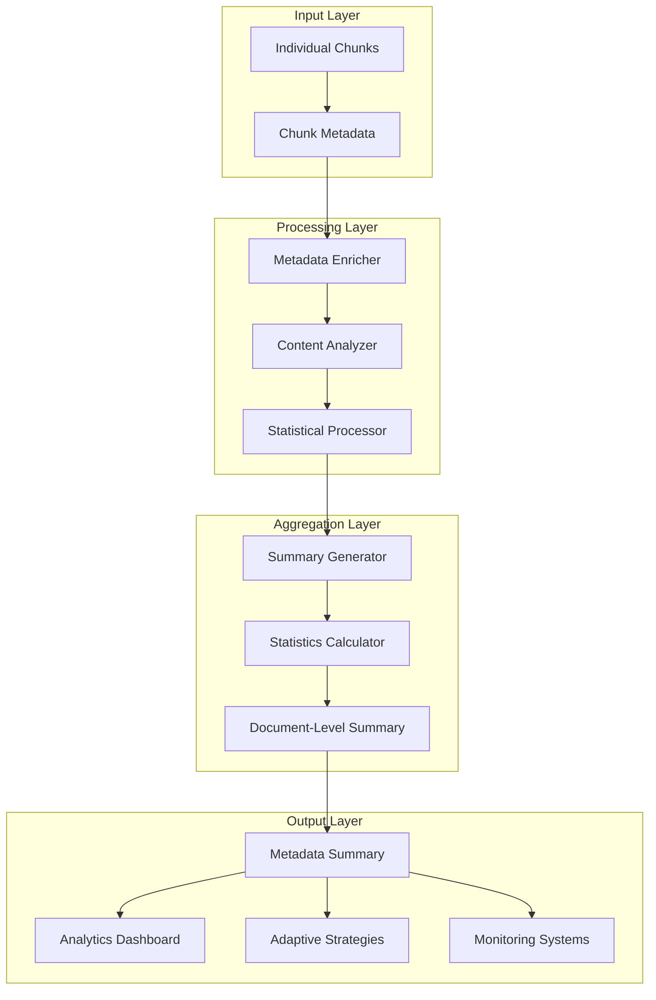
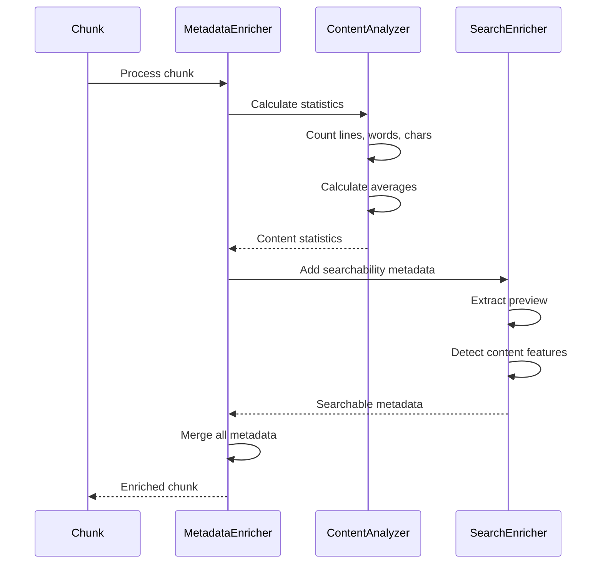
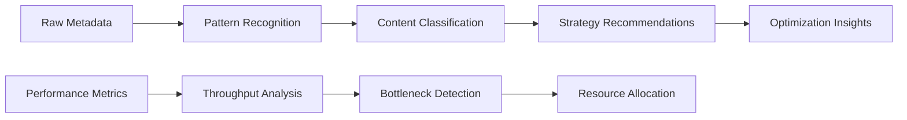
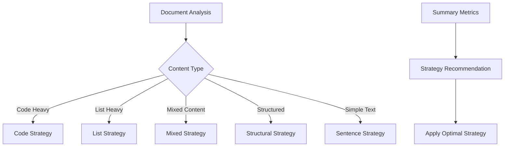
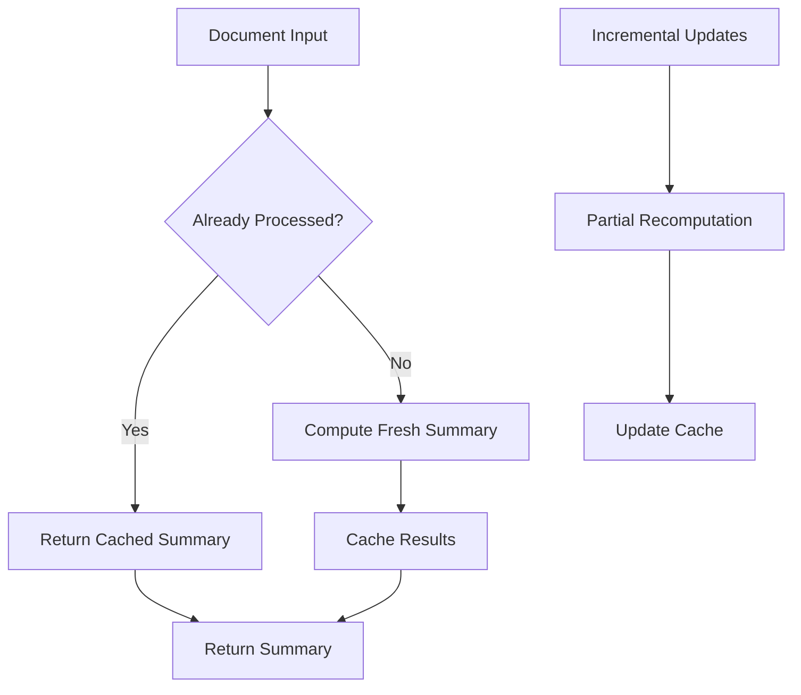

# Metadata Summary

<cite>
**Referenced Files in This Document**
- [metadata_enricher.py](file://markdown_chunker/chunker/components/metadata_enricher.py)
- [core.py](file://markdown_chunker/chunker/core.py)
- [orchestrator.py](file://markdown_chunker/chunker/orchestrator.py)
- [types.py](file://markdown_chunker/chunker/types.py)
- [performance.py](file://markdown_chunker/chunker/performance.py)
- [analyzer.py](file://markdown_chunker/parser/analyzer.py)
- [types.py](file://markdown_chunker/parser/types.py)
- [api_usage.py](file://examples/api_usage.py)
- [dify_integration.py](file://examples/dify_integration.py)
- [test_metadata_filtering.py](file://tests/test_metadata_filtering.py)
</cite>

## Table of Contents
1. [Introduction](#introduction)
2. [System Architecture](#system-architecture)
3. [Core Components](#core-components)
4. [Metadata Aggregation Process](#metadata-aggregation-process)
5. [Summary Metrics and Statistics](#summary-metrics-and-statistics)
6. [Use Cases and Applications](#use-cases-and-applications)
7. [Performance Optimizations](#performance-optimizations)
8. [Observability and Monitoring](#observability-and-monitoring)
9. [Implementation Examples](#implementation-examples)
10. [Best Practices](#best-practices)

## Introduction

The metadata aggregation system in the Markdown Chunker provides comprehensive document-level statistics and analytics through the `get_metadata_summary` method. This system transforms per-chunk metadata into actionable insights that enable intelligent document processing, adaptive chunking strategies, and informed decision-making in automated workflows.

The metadata summary serves as a powerful observability layer that reveals document composition patterns, content distribution, and processing characteristics. It enables monitoring systems to track document health, optimize chunking strategies dynamically, and provide meaningful analytics for content management platforms.

## System Architecture

The metadata aggregation system operates within a multi-layered architecture that processes metadata at multiple granularities:



**Diagram sources**
- [metadata_enricher.py](file://markdown_chunker/chunker/components/metadata_enricher.py#L375-L412)
- [core.py](file://markdown_chunker/chunker/core.py#L265-L300)

**Section sources**
- [metadata_enricher.py](file://markdown_chunker/chunker/components/metadata_enricher.py#L12-L412)
- [core.py](file://markdown_chunker/chunker/core.py#L41-L118)

## Core Components

### MetadataEnricher Class

The [`MetadataEnricher`](file://markdown_chunker/chunker/components/metadata_enricher.py#L13-L412) serves as the central orchestrator for metadata processing, providing comprehensive enrichment capabilities for individual chunks and document summaries.

Key responsibilities include:
- **Per-chunk enrichment**: Adding contextual metadata like position, strategy, and content type
- **Content analysis**: Calculating statistics for code, lists, tables, and structural elements
- **Searchability enhancement**: Creating previews and detecting content features
- **Validation**: Ensuring metadata consistency and completeness

### Summary Generation Method

The [`get_metadata_summary`](file://markdown_chunker/chunker/components/metadata_enricher.py#L375-L412) method performs document-level aggregation by collecting and analyzing metadata across all chunks.

```mermaid
flowchart TD
A[Input: List of Chunks] --> B{Empty List?}
B --> |Yes| C[Return: {"total_chunks": 0}]
B --> |No| D[Initialize Statistics]
D --> E[Iterate Through Chunks]
E --> F[Extract Strategy]
F --> G[Extract Content Type]
G --> H[Sum Word Counts]
H --> I[Sum Line Counts]
I --> J[Update Statistics]
J --> K{More Chunks?}
K --> |Yes| E
K --> |No| L[Calculate Averages]
L --> M[Generate Summary]
M --> N[Return Summary]
```

**Diagram sources**
- [metadata_enricher.py](file://markdown_chunker/chunker/components/metadata_enricher.py#L375-L412)

**Section sources**
- [metadata_enricher.py](file://markdown_chunker/chunker/components/metadata_enricher.py#L375-L412)

## Metadata Aggregation Process

### Per-Chunk Metadata Collection

Each chunk undergoes comprehensive metadata enrichment during the post-processing phase:



**Diagram sources**
- [metadata_enricher.py](file://markdown_chunker/chunker/components/metadata_enricher.py#L68-L142)

### Document-Level Aggregation

The summary generation process aggregates per-chunk metadata into comprehensive document statistics:

| Metric Category | Fields | Purpose |
|----------------|--------|---------|
| **Quantitative** | `total_chunks`, `total_words`, `total_lines` | Document size and scale |
| **Strategic** | `strategies`, `content_types` | Processing patterns |
| **Performance** | `avg_words_per_chunk`, `avg_lines_per_chunk` | Efficiency metrics |
| **Distribution** | Strategy/content type frequencies | Composition analysis |

**Section sources**
- [metadata_enricher.py](file://markdown_chunker/chunker/components/metadata_enricher.py#L385-L412)

## Summary Metrics and Statistics

### Core Document Statistics

The metadata summary provides essential document-level metrics:

#### Quantitative Measures
- **Total Chunks**: Number of processed chunks (`total_chunks`)
- **Word Count**: Cumulative word count across all chunks (`total_words`)
- **Line Count**: Total line count for the document (`total_lines`)
- **Average Metrics**: Words and lines per chunk (`avg_words_per_chunk`, `avg_lines_per_chunk`)

#### Strategic Distribution
- **Strategy Usage**: Frequency of each chunking strategy (`strategies`)
- **Content Types**: Distribution of content types across chunks (`content_types`)

### Advanced Analytics

Beyond basic counts, the system provides sophisticated analytical capabilities:



**Diagram sources**
- [analyzer.py](file://markdown_chunker/parser/analyzer.py#L74-L256)
- [types.py](file://markdown_chunker/parser/types.py#L605-L634)

**Section sources**
- [analyzer.py](file://markdown_chunker/parser/analyzer.py#L74-L256)
- [types.py](file://markdown_chunker/parser/types.py#L605-L634)

## Use Cases and Applications

### Monitoring and Analytics

The metadata summary enables comprehensive monitoring of document processing workflows:

#### Real-time Monitoring
- **Processing Health**: Track chunking success rates and failure patterns
- **Performance Metrics**: Monitor average processing times and throughput
- **Resource Utilization**: Analyze memory and CPU consumption patterns

#### Historical Analytics
- **Trend Analysis**: Identify patterns in document composition over time
- **Quality Assessment**: Measure chunk quality and consistency
- **Capacity Planning**: Predict resource requirements based on document characteristics

### Adaptive Processing Strategies

The summary data drives intelligent strategy selection:

#### Dynamic Strategy Selection


**Diagram sources**
- [types.py](file://markdown_chunker/parser/types.py#L636-L649)

#### Threshold-Based Optimization
- **Code Ratio Thresholds**: Adjust strategy selection based on code density
- **Size Constraints**: Optimize chunk sizes for different content types
- **Complexity Scoring**: Apply appropriate strategies based on document complexity

### RAG (Retrieval-Augmented Generation) Optimization

The metadata summary enhances RAG systems by providing semantic context:

#### Semantic Filtering
- **Content Type Filtering**: Exclude irrelevant content types from retrieval
- **Strategy-Based Ranking**: Rank chunks by processing strategy effectiveness
- **Quality Indicators**: Filter based on chunk quality metrics

#### Context Preservation
- **Positional Information**: Maintain document structure awareness
- **Cross-Reference Tracking**: Preserve relationships between related chunks
- **Metadata Enrichment**: Add domain-specific metadata for better retrieval

**Section sources**
- [test_metadata_filtering.py](file://tests/test_metadata_filtering.py#L42-L200)

## Performance Optimizations

### Efficient Large Document Processing

The system implements several optimizations for handling large documents efficiently:

#### Lazy Loading and Caching
- **Strategy Caching**: Reuse strategy instances across multiple documents
- **Metadata Caching**: Cache computed statistics for repeated queries
- **Memory Management**: Process documents in chunks to minimize memory footprint

#### Parallel Processing
- **Concurrent Analysis**: Analyze multiple documents simultaneously
- **Pipeline Processing**: Overlap analysis and processing stages
- **Resource Pooling**: Share computational resources across operations

### Computation Avoidance

The system avoids redundant computation through intelligent caching and incremental updates:



**Diagram sources**
- [performance.py](file://markdown_chunker/chunker/performance.py#L121-L200)

### Memory-Efficient Processing

For extremely large documents, the system employs memory-efficient processing techniques:

#### Streaming Analysis
- **Progressive Analysis**: Analyze documents incrementally as they arrive
- **Windowed Processing**: Process documents in smaller segments
- **Garbage Collection**: Explicitly manage memory allocation and deallocation

#### Compression Techniques
- **Metadata Compression**: Reduce storage requirements for summary data
- **Delta Encoding**: Store only changes between document versions
- **Index Optimization**: Create efficient indexes for quick access to summary data

**Section sources**
- [performance.py](file://markdown_chunker/chunker/performance.py#L121-L200)

## Observability and Monitoring

### Comprehensive Metrics Collection

The metadata aggregation system provides extensive observability capabilities:

#### Processing Metrics
- **Execution Time**: Track processing duration for each document
- **Resource Usage**: Monitor CPU and memory consumption
- **Error Rates**: Track failure rates and error patterns

#### Quality Metrics
- **Chunk Quality**: Measure semantic coherence and completeness
- **Content Coverage**: Verify that all content is properly chunked
- **Strategy Effectiveness**: Evaluate strategy selection accuracy

### Alerting and Notifications

The system supports proactive monitoring through configurable alerts:

#### Threshold-Based Alerts
- **Performance Degradation**: Alert when processing times exceed thresholds
- **Quality Issues**: Notify when chunk quality falls below acceptable levels
- **Resource Exhaustion**: Warn when resource usage approaches limits

#### Pattern-Based Alerts
- **Anomaly Detection**: Identify unusual processing patterns
- **Trend Analysis**: Alert on emerging trends in document characteristics
- **Capacity Warnings**: Predict future capacity requirements

### Dashboard Integration

The metadata summary integrates seamlessly with monitoring dashboards:

#### Real-Time Dashboards
- **Processing Status**: Live view of ongoing processing operations
- **Performance Trends**: Historical performance data visualization
- **Quality Metrics**: Real-time quality assessment indicators

#### Historical Reporting
- **Daily Reports**: Automated daily summaries of processing activity
- **Weekly Analysis**: Comprehensive weekly performance reviews
- **Monthly Trends**: Long-term trend analysis and forecasting

**Section sources**
- [performance.py](file://markdown_chunker/chunker/performance.py#L32-L104)

## Implementation Examples

### Basic Usage Example

Here's how to use the metadata summary in practical scenarios:

```python
# Example: Basic metadata summary usage
from markdown_chunker import MarkdownChunker

# Initialize chunker
chunker = MarkdownChunker()

# Process document with analysis
result = chunker.chunk_with_analysis(document_content)

# Access metadata summary
summary = result.metadata.get('statistics', {})
print(f"Total chunks: {summary.get('total_chunks', 0)}")
print(f"Average chunk size: {summary.get('avg_chunk_size', 0):.1f} chars")
print(f"Strategy used: {result.strategy_used}")
```

### Monitoring Integration Example

```python
# Example: Monitoring integration
def monitor_document_processing(document_id, content):
    chunker = MarkdownChunker()
    
    # Process document
    start_time = time.time()
    result = chunker.chunk_with_analysis(content)
    processing_time = time.time() - start_time
    
    # Extract summary metrics
    summary = result.metadata.get('statistics', {})
    
    # Log monitoring data
    metrics = {
        'document_id': document_id,
        'total_chunks': summary.get('total_chunks', 0),
        'processing_time': processing_time,
        'strategy': result.strategy_used,
        'chunk_size_distribution': calculate_chunk_size_distribution(result.chunks)
    }
    
    # Send to monitoring system
    send_to_monitoring(metrics)
```

### Adaptive Strategy Selection Example

```python
# Example: Adaptive strategy selection based on metadata
def select_optimal_strategy(content_analysis):
    """Select strategy based on document characteristics."""
    ratios = content_analysis.get('ratios', {})
    elements = content_analysis.get('elements', {})
    
    # Code-heavy documents
    if ratios.get('code', 0) > 0.7 and elements.get('code_blocks', 0) >= 3:
        return "code"
    
    # List-heavy documents
    if (elements.get('lists', 0) >= 5 or 
        ratios.get('list', 0) > 0.6):
        return "list"
    
    # Table-heavy documents
    if (elements.get('tables', 0) >= 3 or 
        ratios.get('table', 0) > 0.4):
        return "table"
    
    # Structured documents
    if (content_analysis.get('metrics', {}).get('max_header_depth', 0) > 1 and
        content_analysis.get('metrics', {}).get('has_mixed_content', False)):
        return "structural"
    
    return "sentences"
```

**Section sources**
- [api_usage.py](file://examples/api_usage.py#L90-L110)
- [dify_integration.py](file://examples/dify_integration.py#L240-L260)

## Best Practices

### Metadata Design Principles

#### Granularity Control
- **Appropriate Level**: Balance between detailed insights and processing overhead
- **Relevance Filtering**: Include only metadata that contributes to decision-making
- **Storage Efficiency**: Optimize storage requirements for large-scale deployments

#### Consistency Standards
- **Naming Conventions**: Use consistent naming patterns across all metadata fields
- **Data Types**: Maintain consistent data types for comparable metrics
- **Units of Measurement**: Standardize units across different measurements

### Performance Guidelines

#### Processing Optimization
- **Batch Processing**: Process multiple documents together when possible
- **Parallel Execution**: Leverage concurrent processing for independent operations
- **Resource Management**: Monitor and control resource consumption

#### Caching Strategies
- **Intelligent Caching**: Cache frequently accessed metadata summaries
- **Cache Invalidation**: Implement proper cache invalidation policies
- **Memory Management**: Balance cache size with available memory

### Security and Privacy

#### Data Protection
- **Sensitive Information**: Avoid storing sensitive information in metadata
- **Access Control**: Implement proper access controls for metadata systems
- **Audit Trails**: Maintain logs of metadata access and modifications

#### Compliance Considerations
- **Data Retention**: Implement appropriate data retention policies
- **Privacy Regulations**: Comply with relevant privacy regulations
- **Security Standards**: Follow industry security best practices

### Scalability Considerations

#### Horizontal Scaling
- **Distributed Processing**: Distribute metadata processing across multiple nodes
- **Load Balancing**: Implement load balancing for metadata services
- **Fault Tolerance**: Design for failure tolerance and recovery

#### Vertical Scaling
- **Resource Optimization**: Optimize resource utilization for single-node deployments
- **Performance Tuning**: Tune system parameters for optimal performance
- **Capacity Planning**: Plan for growth and scaling requirements

**Section sources**
- [metadata_enricher.py](file://markdown_chunker/chunker/components/metadata_enricher.py#L329-L374)