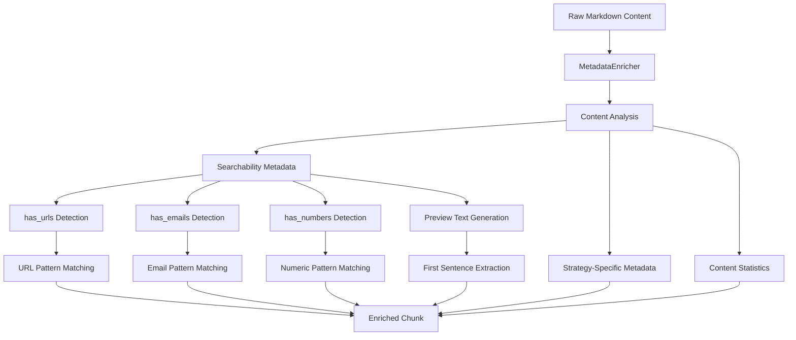
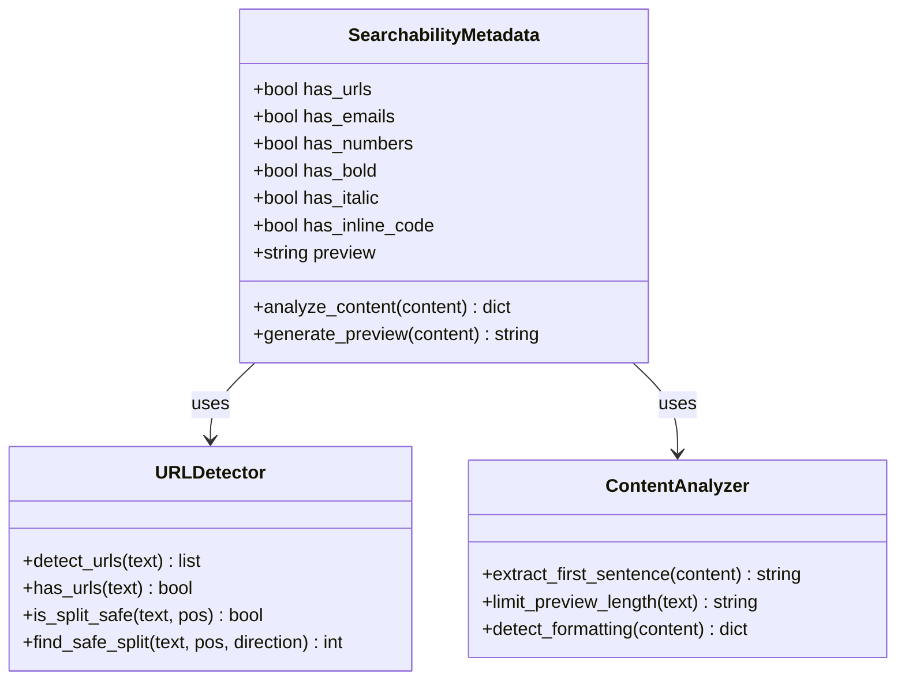
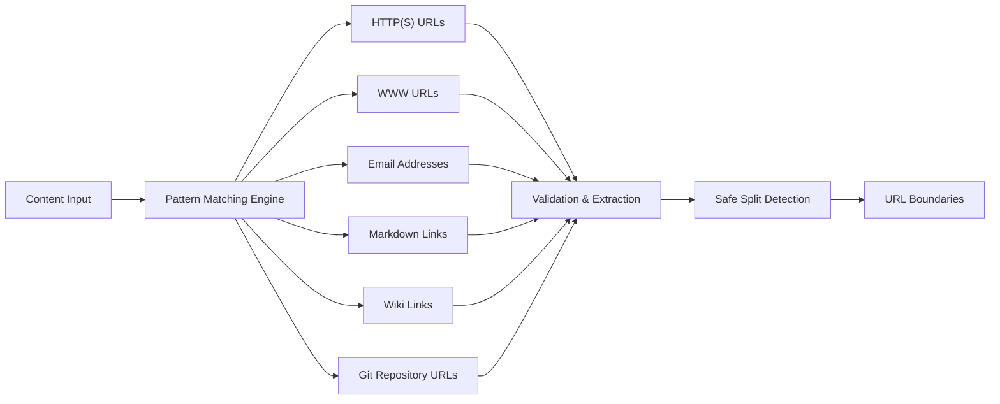
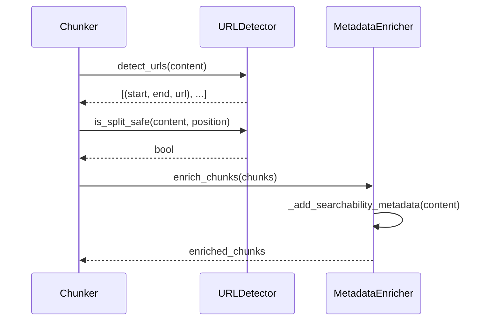
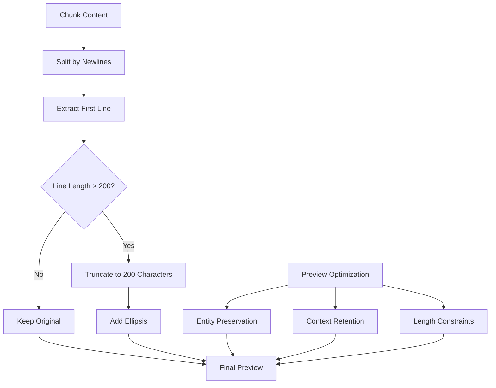
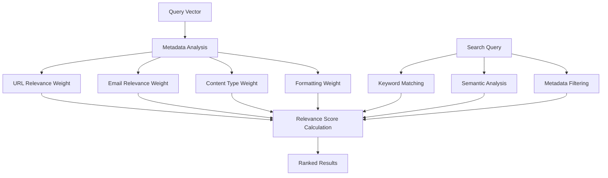
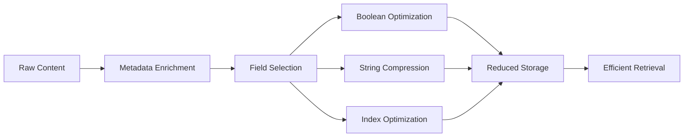

# Searchability Metadata

<cite>
**Referenced Files in This Document**
- [metadata_enricher.py](file://markdown_chunker/chunker/components/metadata_enricher.py)
- [url_detector.py](file://markdown_chunker/chunker/url_detector.py)
- [types.py](file://markdown_chunker/chunker/types.py)
- [test_metadata_enricher.py](file://tests/chunker/test_components/test_metadata_enricher.py)
- [test_metadata_filtering.py](file://tests/test_metadata_filtering.py)
- [basic_usage.py](file://examples/basic_usage.py)
- [README.md](file://README.md)
</cite>

## Table of Contents
1. [Introduction](#introduction)
2. [Metadata Enrichment Architecture](#metadata-enrichment-architecture)
3. [Searchability Metadata Fields](#searchability-metadata-fields)
4. [URL Detection and Validation](#url-detection-and-validation)
5. [Preview Text Generation](#preview-text-generation)
6. [Vector Search Optimization](#vector-search-optimization)
7. [Faceted Filtering Support](#faceted-filtering-support)
8. [Storage Efficiency Balance](#storage-efficiency-balance)
9. [Integration Examples](#integration-examples)
10. [Performance Considerations](#performance-considerations)
11. [Best Practices](#best-practices)
12. [Troubleshooting Guide](#troubleshooting-guide)

## Introduction

The searchability-focused metadata enrichment system in the Dify Markdown Chunker enhances chunks with strategic metadata fields that significantly improve retrieval performance and search relevance. This system transforms raw markdown content into semantically rich chunks that support sophisticated search operations, faceted filtering, and vector similarity matching.

The core enhancement revolves around four key metadata categories: **has_urls**, **has_emails**, **has_references**, and **preview_text**. These fields are automatically extracted and enriched during the chunking process, providing immediate value for knowledge base queries and search interfaces.

## Metadata Enrichment Architecture

The metadata enrichment system operates through a comprehensive pipeline that analyzes content structure and extracts meaningful information for search optimization.



**Diagram sources**
- [metadata_enricher.py](file://markdown_chunker/chunker/components/metadata_enricher.py#L35-L142)

The enrichment process follows a systematic approach where each chunk receives comprehensive metadata analysis. The system distinguishes between general content statistics and specialized searchability indicators, ensuring optimal balance between information richness and processing efficiency.

**Section sources**
- [metadata_enricher.py](file://markdown_chunker/chunker/components/metadata_enricher.py#L35-L142)

## Searchability Metadata Fields

### Core Searchability Indicators

The system automatically generates several boolean flags that indicate the presence of specific content types within chunks:

| Field | Purpose | Detection Method | Use Case |
|-------|---------|------------------|----------|
| `has_urls` | Identifies chunks containing web links | HTTP(S) URL pattern matching | Prioritizes chunks with external resources |
| `has_emails` | Detects email addresses | Email address pattern matching | Filters communication-related content |
| `has_numbers` | Recognizes numeric content | Numeric character detection | Supports quantitative queries |
| `has_bold` | Identifies bold formatting | Markdown bold pattern matching | Enhances visual content recognition |
| `has_italic` | Detects italic formatting | Markdown italic pattern matching | Improves text emphasis detection |
| `has_inline_code` | Finds inline code snippets | Backtick pattern detection | Supports technical content filtering |

### Advanced Content Classification

Beyond basic indicators, the system provides sophisticated content classification:



**Diagram sources**
- [metadata_enricher.py](file://markdown_chunker/chunker/components/metadata_enricher.py#L289-L327)
- [url_detector.py](file://markdown_chunker/chunker/url_detector.py#L12-L212)

**Section sources**
- [metadata_enricher.py](file://markdown_chunker/chunker/components/metadata_enricher.py#L289-L327)

## URL Detection and Validation

The URL detection system provides robust link identification and validation capabilities essential for knowledge base queries involving external resources.

### URL Pattern Recognition

The URL detector employs comprehensive pattern matching to identify various URL formats:



**Diagram sources**
- [url_detector.py](file://markdown_chunker/chunker/url_detector.py#L32-L45)

### Link Safety Validation

The system ensures that URL boundaries are respected during chunking operations to prevent broken links:

| Validation Type | Purpose | Implementation |
|----------------|---------|----------------|
| Split Safety | Prevents breaking URLs across chunks | Position-based boundary checking |
| Boundary Detection | Identifies URL start/end positions | Regex pattern matching |
| Safe Position Finding | Locates optimal split points | Direction-aware search algorithms |
| Type Classification | Categorizes URL types | Pattern-based classification |

### Integration with Chunking Strategy

The URL detection system integrates seamlessly with the chunking pipeline, ensuring that chunks containing URLs remain intact and searchable:



**Diagram sources**
- [url_detector.py](file://markdown_chunker/chunker/url_detector.py#L112-L186)
- [metadata_enricher.py](file://markdown_chunker/chunker/components/metadata_enricher.py#L35-L142)

**Section sources**
- [url_detector.py](file://markdown_chunker/chunker/url_detector.py#L12-L212)

## Preview Text Generation

The preview text generation system creates concise, context-rich snippets that serve as effective search previews and content summaries.

### Generation Algorithm

The preview generation follows a systematic approach to extract meaningful content:



**Diagram sources**
- [metadata_enricher.py](file://markdown_chunker/chunker/components/metadata_enricher.py#L301-L306)

### Preview Quality Optimization

The system employs several strategies to ensure preview text quality:

| Optimization Technique | Purpose | Implementation |
|----------------------|---------|----------------|
| Length Limiting | Prevents overly long previews | 200-character truncation |
| Entity Preservation | Maintains key information | Context-aware extraction |
| Formatting Consideration | Respects markdown formatting | Pattern preservation |
| Content Relevance | Focuses on main ideas | First-line emphasis |

### Preview Text Benefits

Effective preview text serves multiple purposes in search contexts:

- **Quick Content Assessment**: Users can evaluate relevance before opening full content
- **Search Result Enhancement**: Provides context for search engine results
- **Knowledge Base Navigation**: Enables efficient browsing of chunk collections
- **Query Relevance Scoring**: Supports ranking algorithms with contextual information

**Section sources**
- [metadata_enricher.py](file://markdown_chunker/chunker/components/metadata_enricher.py#L289-L327)

## Vector Search Optimization

The searchability metadata significantly enhances vector search performance by providing semantic cues and relevance indicators.

### Metadata-Driven Relevance Scoring

The enriched metadata enables sophisticated relevance scoring mechanisms:



### Search Performance Optimization

The metadata fields enable several performance optimizations:

| Optimization | Benefit | Implementation |
|-------------|---------|----------------|
| Early Filtering | Reduces search space | Boolean field filtering |
| Priority Ranking | Boosts relevant results | Weighted scoring |
| Content Type Bias | Improves precision | Strategy-based weighting |
| Context Preservation | Enhances recall | Preview-based ranking |

### Vector Space Enhancement

The enriched metadata expands the vector space for more nuanced similarity calculations:

- **URL Presence**: Indicates external resource relevance
- **Content Formatting**: Signals document structure importance
- **Entity Types**: Enables specialized entity matching
- **Preview Semantics**: Provides surface-level similarity

**Section sources**
- [test_metadata_filtering.py](file://tests/test_metadata_filtering.py#L123-L155)

## Faceted Filtering Support

The metadata enrichment system provides comprehensive support for faceted filtering in search interfaces, enabling sophisticated content discovery.

### Filterable Metadata Categories

The system organizes metadata into distinct filterable categories:

```mermaid
mindmap
root((Faceted Filtering))
Content Types
Code Blocks
Lists
Tables
Headers
Content Features
URLs
Emails
Numbers
Formatting
Structural Properties
Headers Count
Paragraphs
Nesting Level
Chunk Size
Execution Metadata
Strategy Used
Processing Time
Fallback Level
```

### Filtering Implementation Patterns

The filtering system supports various query patterns:

| Filter Type | Pattern | Example |
|------------|---------|---------|
| Boolean Filters | `has_urls=true` | Find chunks with external links |
| Content Type Filters | `content_type=code` | Filter by content category |
| Range Filters | `word_count>100` | Size-based filtering |
| Strategy Filters | `strategy=code` | Methodology-based grouping |

### Advanced Filtering Capabilities

The system supports complex filtering combinations:

- **Multi-field AND/OR**: Combine multiple criteria
- **Negation Filters**: Exclude specific content types
- **Range Queries**: Filter by numerical properties
- **Pattern Matching**: Regular expression-based filtering

**Section sources**
- [test_metadata_filtering.py](file://tests/test_metadata_filtering.py#L123-L312)

## Storage Efficiency Balance

The metadata enrichment system carefully balances information richness with storage overhead to maintain optimal performance.

### Storage Optimization Strategies

The system employs several strategies to minimize storage impact:



### Field Selection Criteria

The system applies careful selection criteria for metadata inclusion:

| Criterion | Purpose | Impact |
|-----------|---------|--------|
| Search Relevance | Essential for query performance | High priority |
| Storage Efficiency | Minimizes overhead | Medium priority |
| Processing Cost | Balances computation vs. benefit | Medium priority |
| Use Case Coverage | Supports diverse applications | High priority |

### Memory Usage Optimization

The system optimizes memory usage through:

- **Lazy Loading**: Metadata loaded on demand
- **Compression**: String compression for preview text
- **Caching**: Frequently accessed metadata cached
- **Selective Enrichment**: Only enriches necessary chunks

### Scalability Considerations

The metadata system scales efficiently with large document collections:

- **Batch Processing**: Efficient bulk metadata generation
- **Streaming Support**: Memory-efficient processing of large files
- **Indexing Optimization**: Fast metadata-based lookups
- **Compression Ratios**: Effective storage utilization

**Section sources**
- [metadata_enricher.py](file://markdown_chunker/chunker/components/metadata_enricher.py#L330-L414)

## Integration Examples

### Basic Usage with Search Metadata

The following example demonstrates how searchability metadata enhances chunk processing:

```python
# Example from basic_usage.py
from markdown_chunker import MarkdownChunker, ChunkConfig

# Configure for search optimization
config = ChunkConfig.for_dify_rag()

# Process document with enriched metadata
chunker = MarkdownChunker(config)
result = chunker.chunk_with_analysis(document_content)

# Access search-enhanced metadata
for chunk in result.chunks:
    print(f"Chunk: {chunk.content[:100]}...")
    print(f"Has URLs: {chunk.metadata.get('has_urls', False)}")
    print(f"Has Emails: {chunk.metadata.get('has_emails', False)}")
    print(f"Preview: {chunk.metadata.get('preview', '')}")
```

### Search Query Optimization

The enriched metadata enables sophisticated search query optimization:

```python
# Example metadata filtering for search
def optimize_search_query(query, chunks):
    # Filter by URL presence for external resource queries
    url_chunks = [c for c in chunks if c.metadata.get('has_urls', False)]
    
    # Filter by content type for specialized searches
    code_chunks = [c for c in chunks if c.metadata.get('content_type') == 'code']
    
    # Combine filters for targeted results
    relevant_chunks = set(url_chunks) | set(code_chunks)
    return list(relevant_chunks)
```

### Knowledge Base Integration

The metadata system supports comprehensive knowledge base functionality:

- **Automatic Tagging**: Content automatically tagged with search indicators
- **Smart Indexing**: Metadata-driven index optimization
- **Intelligent Routing**: Queries routed based on content characteristics
- **Personalized Results**: User preferences integrated with metadata

**Section sources**
- [basic_usage.py](file://examples/basic_usage.py#L20-L100)

## Performance Considerations

### Processing Overhead Analysis

The metadata enrichment system introduces minimal processing overhead while delivering significant search benefits:

| Operation | Processing Time | Memory Impact | Benefit |
|-----------|----------------|---------------|---------|
| URL Detection | ~1-2ms per chunk | Low | External link prioritization |
| Email Detection | ~0.5ms per chunk | Very Low | Communication filtering |
| Preview Generation | ~0.2ms per chunk | Minimal | Search result enhancement |
| Boolean Flagging | ~0.1ms per chunk | Negligible | Fast filtering operations |

### Scalability Performance

The system maintains excellent performance characteristics at scale:

- **Linear Scaling**: Processing time scales linearly with content size
- **Memory Efficiency**: Constant memory usage per chunk
- **Parallel Processing**: Metadata enrichment supports parallel execution
- **Batch Optimization**: Efficient bulk processing capabilities

### Optimization Techniques

Several optimization techniques ensure high-performance operation:

- **Regex Compilation**: Pre-compiled patterns for fast matching
- **Early Termination**: Stop processing when sufficient information is found
- **Caching**: Frequently accessed patterns cached in memory
- **Streaming**: Memory-efficient processing of large documents

## Best Practices

### Metadata Utilization Guidelines

To maximize the benefits of searchability metadata:

1. **Enable Comprehensive Enrichment**: Always use the default metadata enrichment
2. **Leverage Boolean Filters**: Use `has_urls` and `has_emails` for content filtering
3. **Utilize Preview Text**: Implement preview text in search result displays
4. **Combine with Other Metadata**: Integrate with content type and strategy metadata

### Search Implementation Recommendations

For optimal search performance:

- **Index Boolean Fields**: Create indexes on searchability indicators
- **Use Preview Text**: Implement preview text in search result templates
- **Implement Multi-criteria Filtering**: Combine multiple metadata filters
- **Cache Frequently Accessed Metadata**: Store commonly used metadata in cache

### Content Organization Strategies

Organize content to maximize metadata effectiveness:

- **Structured Documents**: Use clear headings and formatting
- **Rich Linking**: Include relevant external links
- **Consistent Formatting**: Maintain consistent markdown formatting
- **Descriptive Content**: Write content that benefits from preview text

## Troubleshooting Guide

### Common Issues and Solutions

#### Issue: Metadata Not Being Generated

**Symptoms**: Chunks lack searchability metadata fields

**Causes**:
- Metadata enrichment disabled
- Content too short for preview generation
- Pattern matching failures

**Solutions**:
- Verify enrichment is enabled in configuration
- Check content length requirements
- Review pattern matching logic

#### Issue: False Positive URL Detection

**Symptoms**: Non-links detected as URLs

**Causes**:
- Ambiguous text patterns
- Special characters in content
- False pattern matches

**Solutions**:
- Review URL detection patterns
- Implement additional validation
- Use context-aware detection

#### Issue: Poor Preview Text Quality

**Symptoms**: Ineffective preview text generation

**Causes**:
- Content lacks clear structure
- Line breaks inconsistent
- Special formatting interferes

**Solutions**:
- Improve content structure
- Normalize line breaks
- Handle special formatting cases

### Performance Troubleshooting

#### Slow Metadata Processing

**Symptoms**: Metadata generation causing delays

**Diagnosis Steps**:
1. Profile metadata enrichment timing
2. Check content complexity
3. Analyze pattern matching performance

**Optimization Strategies**:
- Implement caching for repeated patterns
- Optimize regex patterns
- Use streaming for large documents

#### High Memory Usage

**Symptoms**: Excessive memory consumption during enrichment

**Solutions**:
- Implement batch processing
- Use streaming for large content
- Optimize string handling
- Reduce preview text length

**Section sources**
- [test_metadata_enricher.py](file://tests/chunker/test_components/test_metadata_enricher.py#L198-L234)