# Structural Metadata Enrichment System

<cite>
**Referenced Files in This Document**
- [metadata_enricher.py](file://markdown_chunker/chunker/components/metadata_enricher.py)
- [structural_strategy.py](file://markdown_chunker/chunker/strategies/structural_strategy.py)
- [types.py](file://markdown_chunker/chunker/types.py)
- [core.py](file://markdown_chunker/chunker/core.py)
- [test_metadata_enricher.py](file://tests/chunker/test_components/test_metadata_enricher.py)
- [test_header_path_property.py](file://tests/chunker/test_header_path_property.py)
- [test_structural_strategy.py](file://tests/chunker/test_strategies/test_structural_strategy.py)
</cite>

## Table of Contents
1. [Introduction](#introduction)
2. [System Architecture](#system-architecture)
3. [Core Components](#core-components)
4. [Metadata Enrichment Process](#metadata-enrichment-process)
5. [Header Hierarchy Analysis](#header-hierarchy-analysis)
6. [Parent Header Path Maintenance](#parent-header-path-maintenance)
7. [Integration with Structural Strategy](#integration-with-structural-strategy)
8. [Complex Hierarchy Handling](#complex-hierarchy-handling)
9. [Applications and Use Cases](#applications-and-use-cases)
10. [Performance Considerations](#performance-considerations)
11. [Quality Assurance](#quality-assurance)
12. [Conclusion](#conclusion)

## Introduction

The Structural Metadata Enrichment System is a sophisticated component of the markdown-chunker framework that analyzes document hierarchy to generate comprehensive metadata for enhanced semantic understanding. This system creates intelligent metadata fields including `header_count`, `max_header_level`, `section_depth`, and most importantly, `parent_header_path` fields that preserve contextual relationships across chunk boundaries.

The system operates as a bridge between structural analysis and practical document processing, enabling applications to maintain semantic coherence while breaking down large documents into manageable chunks. It's particularly valuable for applications requiring accurate reconstruction of document structure, such as table of contents generation, section-based navigation, and semantic search systems.

## System Architecture

The structural metadata enrichment system follows a modular architecture with clear separation of concerns:

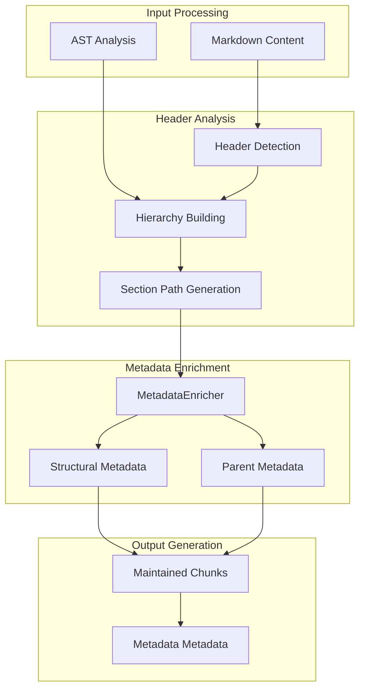

**Diagram sources**
- [structural_strategy.py](file://markdown_chunker/chunker/strategies/structural_strategy.py#L245-L323)
- [metadata_enricher.py](file://markdown_chunker/chunker/components/metadata_enricher.py#L13-L414)

The architecture consists of three main phases:
1. **Header Analysis**: Detects and builds hierarchical relationships between document headers
2. **Metadata Enrichment**: Generates comprehensive metadata including structural indicators
3. **Output Integration**: Embeds metadata into chunks while maintaining cross-boundary relationships

## Core Components

### MetadataEnricher Component

The MetadataEnricher serves as the central orchestrator for metadata generation, providing comprehensive enrichment capabilities for different content types:

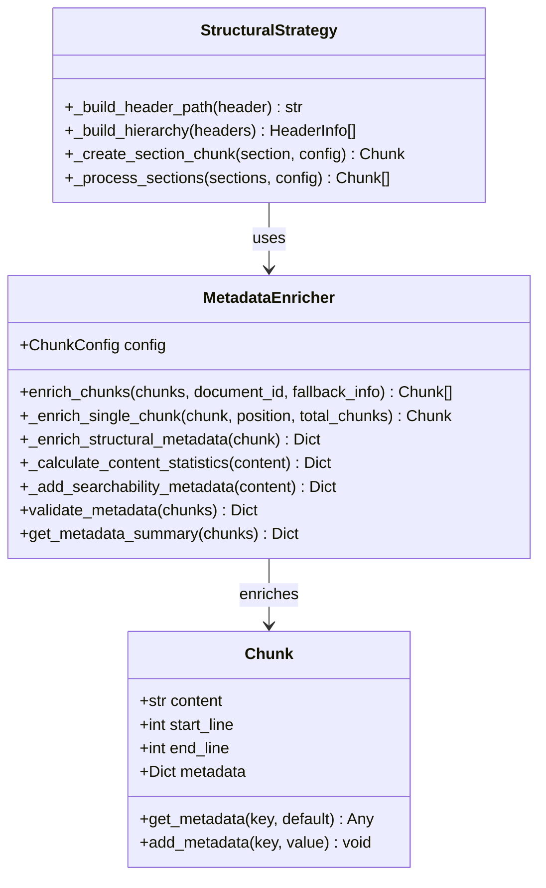

**Diagram sources**
- [metadata_enricher.py](file://markdown_chunker/chunker/components/metadata_enricher.py#L13-L414)
- [structural_strategy.py](file://markdown_chunker/chunker/strategies/structural_strategy.py#L22-L800)

**Section sources**
- [metadata_enricher.py](file://markdown_chunker/chunker/components/metadata_enricher.py#L13-L414)
- [types.py](file://markdown_chunker/chunker/types.py#L36-L280)

### StructuralStrategy Integration

The StructuralStrategy provides the foundation for header hierarchy analysis and path generation:

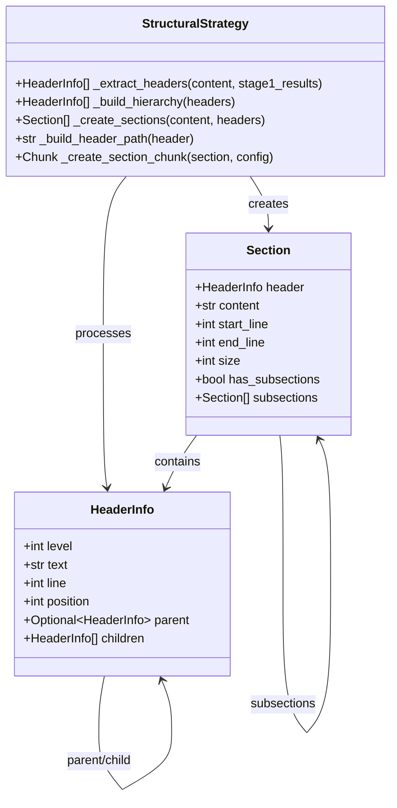

**Diagram sources**
- [structural_strategy.py](file://markdown_chunker/chunker/strategies/structural_strategy.py#L22-L800)

**Section sources**
- [structural_strategy.py](file://markdown_chunker/chunker/strategies/structural_strategy.py#L22-L800)

## Metadata Enrichment Process

The metadata enrichment process follows a systematic approach to generate comprehensive structural information:

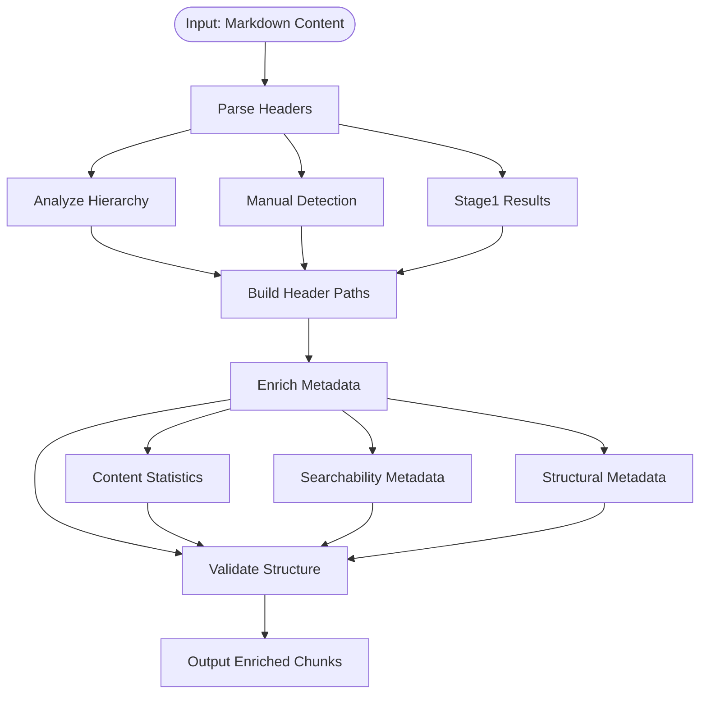

**Diagram sources**
- [structural_strategy.py](file://markdown_chunker/chunker/strategies/structural_strategy.py#L245-L323)
- [metadata_enricher.py](file://markdown_chunker/chunker/components/metadata_enricher.py#L34-L142)

### Content Statistics Generation

The system calculates comprehensive content statistics to enhance searchability and processing:

| Metric | Purpose | Calculation Method |
|--------|---------|-------------------|
| `line_count` | Document length measurement | Count newlines in content |
| `word_count` | Content density analysis | Split by whitespace |
| `char_count` | Size verification | String length |
| `avg_line_length` | Formatting consistency | Total chars ÷ line count |
| `avg_word_length` | Text complexity | Sum word lengths ÷ word count |

**Section sources**
- [metadata_enricher.py](file://markdown_chunker/chunker/components/metadata_enricher.py#L144-L164)

### Searchability Enhancement

The system adds searchability metadata to improve content discoverability:

| Field | Type | Purpose |
|-------|------|---------|
| `preview` | String | First 200 characters for previews |
| `has_urls` | Boolean | URL presence detection |
| `has_emails` | Boolean | Email address detection |
| `has_numbers` | Boolean | Numeric content identification |
| `has_bold` | Boolean | Bold formatting presence |
| `has_italic` | Boolean | Italic formatting presence |
| `has_inline_code` | Boolean | Inline code block detection |

**Section sources**
- [metadata_enricher.py](file://markdown_chunker/chunker/components/metadata_enricher.py#L289-L327)

## Header Hierarchy Analysis

The header hierarchy analysis forms the backbone of structural metadata generation, creating intelligent relationships between document sections:

### Header Detection and Classification

The system employs multiple header detection strategies:

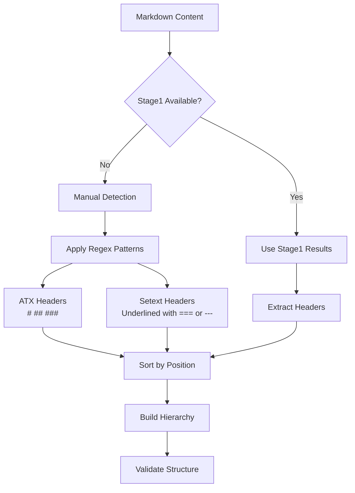

**Diagram sources**
- [structural_strategy.py](file://markdown_chunker/chunker/strategies/structural_strategy.py#L245-L323)

### Hierarchical Relationship Building

The hierarchy building algorithm maintains parent-child relationships using a stack-based approach:

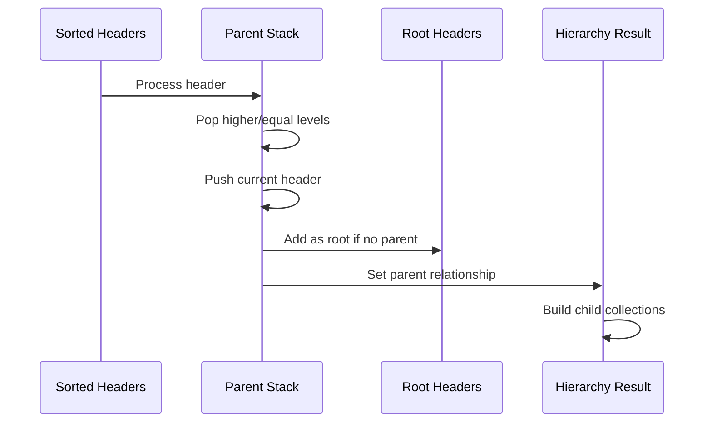

**Diagram sources**
- [structural_strategy.py](file://markdown_chunker/chunker/strategies/structural_strategy.py#L324-L356)

**Section sources**
- [structural_strategy.py](file://markdown_chunker/chunker/strategies/structural_strategy.py#L324-L356)

## Parent Header Path Maintenance

The parent_header_path mechanism ensures contextual continuity across chunk boundaries, enabling accurate reconstruction of document structure:

### Path Construction Algorithm

The header path construction follows a recursive approach to build complete hierarchical paths:

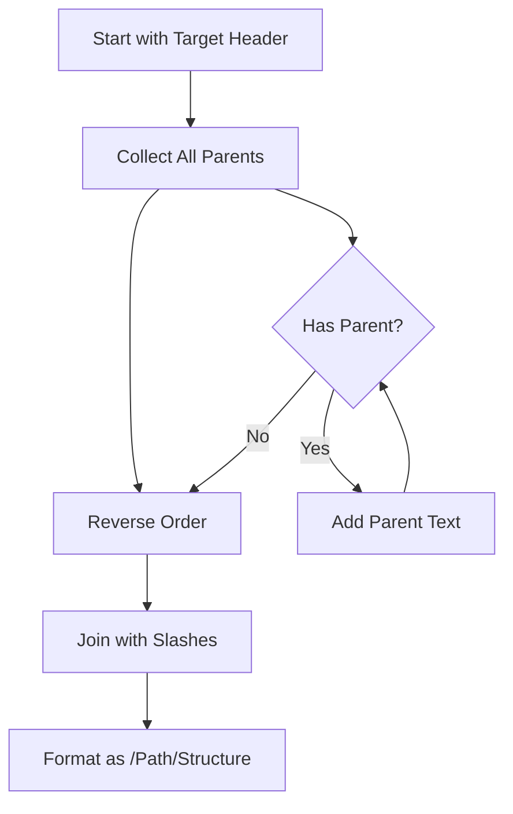

**Diagram sources**
- [structural_strategy.py](file://markdown_chunker/chunker/strategies/structural_strategy.py#L760-L780)

### Cross-Boundary Relationship Preservation

The system ensures that chunks maintain their contextual relationships even when split across document boundaries:

| Scenario | Implementation | Example |
|----------|---------------|---------|
| **Single Section** | Direct header path | `/Introduction/Setup` |
| **Nested Sections** | Complete hierarchy path | `/API Reference/User Management/Create User` |
| **Multiple Roots** | Separate path trees | `/Chapter 1`, `/Chapter 2` |
| **Deep Nesting** | Truncated reasonable paths | `/A/B/C/D/E/F/G/H/I/J/K/L/M/N/O/P/Q/R/S/T/U/V/W/X/Y/Z` |

**Section sources**
- [structural_strategy.py](file://markdown_chunker/chunker/strategies/structural_strategy.py#L760-L780)

## Integration with Structural Strategy

The structural metadata enrichment integrates seamlessly with the StructuralStrategy to provide comprehensive document analysis:

### Metadata Field Generation

The StructuralStrategy generates specific metadata fields for structural analysis:

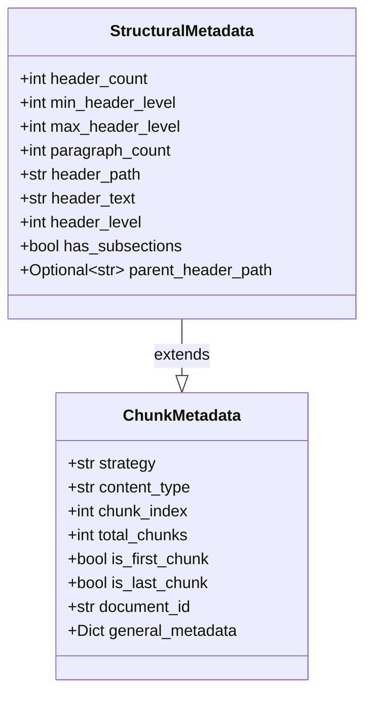

**Diagram sources**
- [structural_strategy.py](file://markdown_chunker/chunker/strategies/structural_strategy.py#L463-L476)
- [metadata_enricher.py](file://markdown_chunker/chunker/components/metadata_enricher.py#L256-L287)

### Chunk Creation with Metadata

Each chunk receives comprehensive metadata reflecting its structural position:

**Section sources**
- [structural_strategy.py](file://markdown_chunker/chunker/strategies/structural_strategy.py#L463-L476)
- [structural_strategy.py](file://markdown_chunker/chunker/strategies/structural_strategy.py#L476-L483)

## Complex Hierarchy Handling

The system handles complex document structures with sophisticated algorithms:

### Multi-Level Header Processing

For documents with complex nesting, the system maintains accurate relationships:

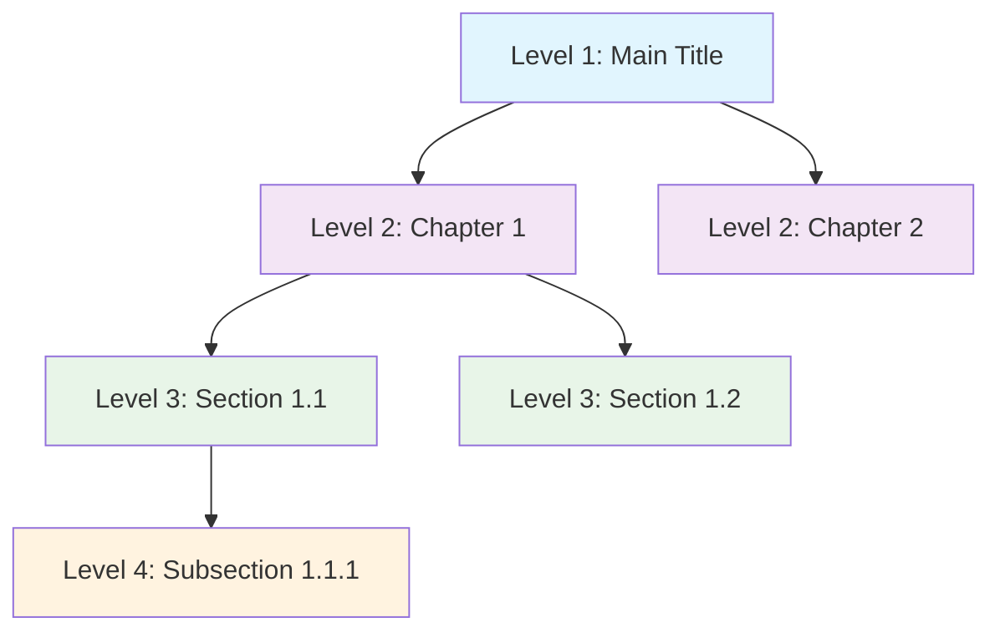

**Diagram sources**
- [test_structural_strategy.py](file://tests/chunker/test_strategies/test_structural_strategy.py#L175-L212)

### Edge Case Management

The system gracefully handles various edge cases:

| Edge Case | Handling Strategy | Result |
|-----------|------------------|---------|
| **Skipped Levels** | Continue hierarchy traversal | `/Title/Subsection` |
| **Multiple Root Headers** | Independent path trees | Separate `/Chapter 1` and `/Chapter 2` |
| **Empty Sections** | Skip empty content | Minimal metadata |
| **Unclosed Headers** | Graceful degradation | Partial path information |
| **Very Deep Nesting** | Reasonable truncation | Max 6 levels |

**Section sources**
- [test_structural_strategy.py](file://tests/chunker/test_strategies/test_structural_strategy.py#L175-L212)
- [test_header_path_property.py](file://tests/chunker/test_header_path_property.py#L360-L412)

## Applications and Use Cases

The structural metadata enrichment system enables numerous practical applications:

### Table of Contents Generation

The enriched metadata provides the foundation for dynamic table of contents creation:

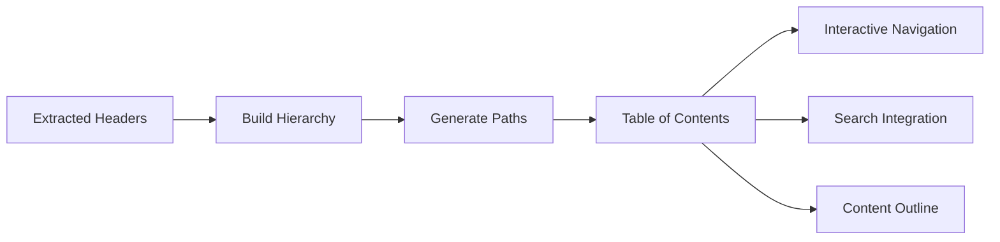

### Section-Based Navigation

Applications can leverage the metadata for intelligent navigation:

| Feature | Metadata Field | Usage |
|---------|---------------|-------|
| **Breadcrumb Navigation** | `header_path` | Show current position in hierarchy |
| **Section Jumping** | `section_id` | Direct links to specific sections |
| **Related Content** | `parent_header_path` | Find related sections |
| **Progress Tracking** | `chunk_index` | Monitor completion status |

### Semantic Search Enhancement

The metadata enhances search capabilities:

- **Context-Aware Results**: Search results include header context
- **Hierarchical Scoring**: Results weighted by section importance
- **Cross-Reference Discovery**: Related sections found through shared contexts

### Content Management Systems

CMS platforms benefit from the enriched metadata:

- **Automatic Organization**: Documents organized by structure
- **Intelligent Routing**: Content routed to appropriate sections
- **Version Control**: Changes tracked at section level
- **Access Control**: Permissions applied at section granularity

## Performance Considerations

The structural metadata enrichment system is optimized for performance while maintaining accuracy:

### Memory Efficiency

The system uses efficient data structures and algorithms:

- **Stack-Based Hierarchy**: O(n) complexity for hierarchy building
- **Lazy Evaluation**: Metadata generated only when needed
- **Minimal Storage**: Compact representation of hierarchical data

### Processing Optimization

Several optimization techniques ensure efficient processing:

| Technique | Benefit | Implementation |
|-----------|---------|---------------|
| **Early Termination** | Skip unnecessary processing | Stop when structure criteria met |
| **Cached Results** | Reuse expensive computations | Store header detection results |
| **Batch Processing** | Reduce overhead | Process multiple chunks together |
| **Streaming Support** | Handle large documents | Process content incrementally |

### Scalability Factors

The system scales effectively with document complexity:

- **Linear Scaling**: Processing time proportional to content size
- **Memory Proportional**: Memory usage scales with header count
- **Parallel Processing**: Independent sections can be processed concurrently

## Quality Assurance

The system includes comprehensive quality assurance mechanisms:

### Property-Based Testing

The system employs property-based testing to ensure reliability:

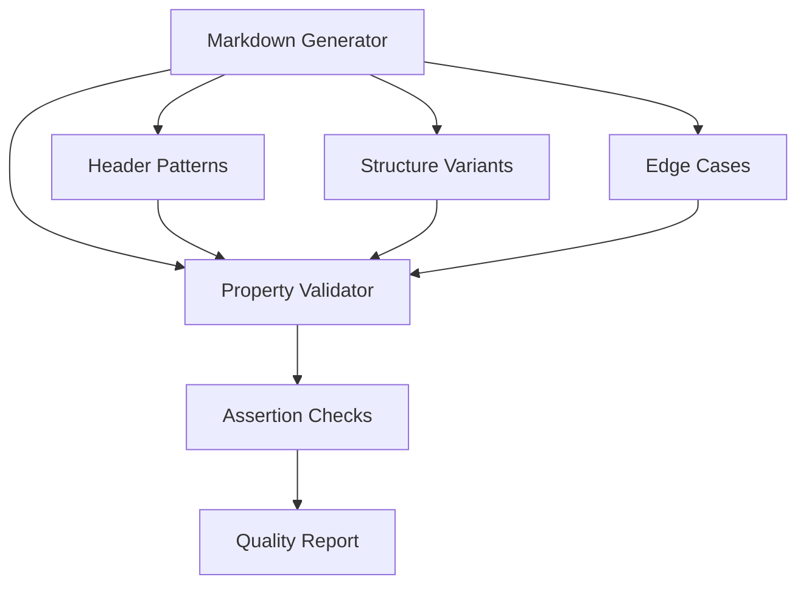

**Diagram sources**
- [test_header_path_property.py](file://tests/chunker/test_header_path_property.py#L126-L163)

### Validation Framework

The system includes multiple validation layers:

| Validation Level | Checks Performed | Purpose |
|------------------|------------------|---------|
| **Syntax Validation** | Header format correctness | Ensure proper markdown syntax |
| **Semantic Validation** | Logical hierarchy consistency | Verify reasonable structure |
| **Cross-Reference Validation** | Path accuracy across chunks | Ensure metadata consistency |
| **Performance Validation** | Processing time bounds | Maintain acceptable performance |

**Section sources**
- [test_header_path_property.py](file://tests/chunker/test_header_path_property.py#L126-L163)
- [metadata_enricher.py](file://markdown_chunker/chunker/components/metadata_enricher.py#L330-L374)

### Error Handling and Recovery

The system implements robust error handling:

- **Graceful Degradation**: Continue processing despite individual failures
- **Fallback Strategies**: Alternative approaches when primary methods fail
- **Error Reporting**: Detailed error information for debugging
- **Recovery Mechanisms**: Automatic recovery from transient failures

## Conclusion

The Structural Metadata Enrichment System represents a sophisticated approach to preserving document structure while enabling efficient chunking. Through its comprehensive analysis of header hierarchies, intelligent path maintenance, and seamless integration with the broader chunking framework, it provides the foundation for applications requiring semantic understanding of document structure.

Key strengths of the system include:

- **Accurate Hierarchy Preservation**: Maintains complex nested relationships across chunk boundaries
- **Intelligent Metadata Generation**: Provides comprehensive structural information
- **Robust Error Handling**: Gracefully handles edge cases and malformed content
- **Performance Optimization**: Efficient processing of large documents
- **Extensive Testing**: Property-based validation ensures reliability

The system's ability to maintain contextual relationships while enabling efficient processing makes it invaluable for applications ranging from content management systems to AI-powered document analysis tools. Its modular design and comprehensive metadata enrichment capabilities position it as a cornerstone technology for modern document processing pipelines.

Future enhancements could include machine learning-based hierarchy prediction, enhanced cross-referencing capabilities, and integration with external knowledge bases to further enrich the semantic understanding of document structures.