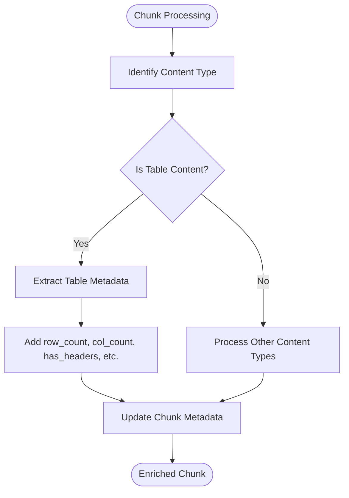
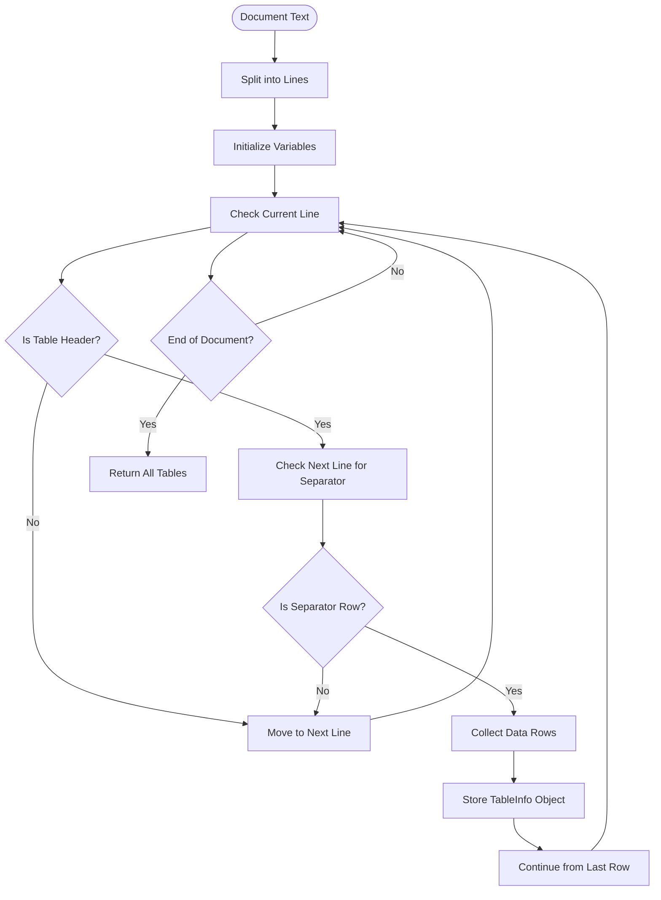
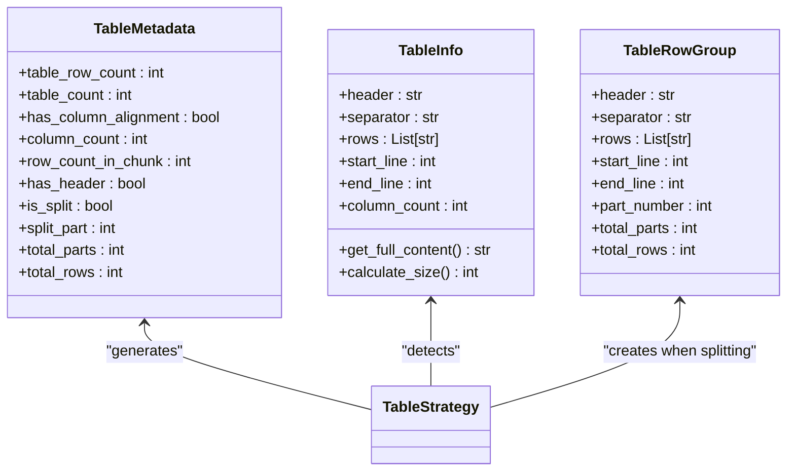
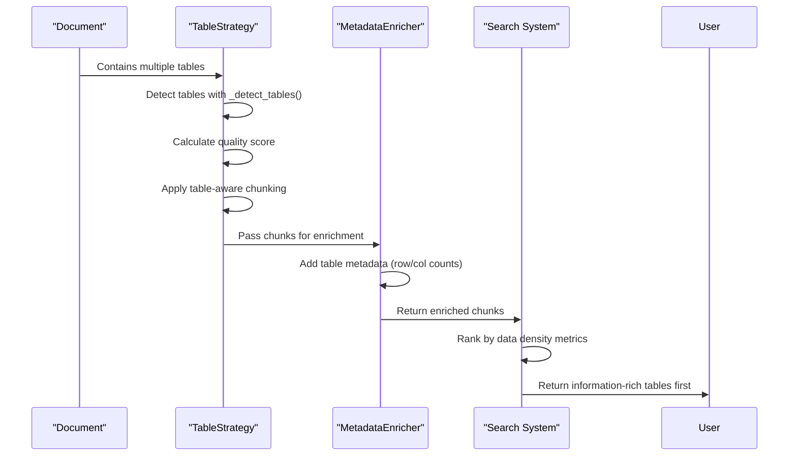

# Table Metadata

<cite>
**Referenced Files in This Document**   
- [metadata_enricher.py](file://markdown_chunker/chunker/components/metadata_enricher.py)
- [table_strategy.py](file://markdown_chunker/chunker/strategies/table_strategy.py)
- [types.py](file://markdown_chunker/chunker/types.py)
- [table_heavy.md](file://tests/fixtures/table_heavy.md)
</cite>

## Table of Contents
1. [Introduction](#introduction)
2. [Metadata Enrichment Process](#metadata-enrichment-process)
3. [Table Boundary Detection](#table-boundary-detection)
4. [Table Metadata Extraction](#table-metadata-extraction)
5. [Data Density and Search Prioritization](#data-density-and-search-prioritization)
6. [Edge Case Handling](#edge-case-handling)
7. [Integration with RAG Systems](#integration-with-rag-systems)
8. [Conclusion](#conclusion)

## Introduction
The table metadata enrichment system provides comprehensive analysis of Markdown tables to enhance their discoverability and usability in retrieval-augmented generation (RAG) systems. This documentation details how the MetadataEnricher component extracts structural information from tables and integrates with the TableStrategy to accurately detect and process tabular data, even in complex documents with nested structures and edge cases.

**Section sources**
- [metadata_enricher.py](file://markdown_chunker/chunker/components/metadata_enricher.py#L1-L414)
- [table_strategy.py](file://markdown_chunker/chunker/strategies/table_strategy.py#L1-L466)

## Metadata Enrichment Process
The MetadataEnricher class systematically enhances chunk metadata with comprehensive information about table structure and content. It operates as part of the chunking pipeline, adding strategy-specific metadata based on the content type of each chunk.

When a chunk is identified as containing table content (via the "table" strategy or "table" content_type), the enricher invokes the `_enrich_table_metadata` method to extract table-specific metrics. This process occurs during the `_enrich_single_chunk` method execution, which determines the appropriate enrichment strategy based on the chunk's metadata.

The enrichment process preserves all original metadata while adding new fields that describe the table's characteristics. This ensures backward compatibility while providing enhanced information for downstream applications.

**Diagram sources**
- [metadata_enricher.py](file://markdown_chunker/chunker/components/metadata_enricher.py#L119-L127)
- [metadata_enricher.py](file://markdown_chunker/chunker/components/metadata_enricher.py#L229-L254)

## Table Boundary Detection
The TableStrategy class implements robust table boundary detection using pattern matching and line-by-line analysis. It identifies tables by detecting the characteristic three-part structure of Markdown tables: header row, separator row, and data rows.

The detection process begins with the `_detect_tables` method, which scans the document line by line to identify potential table structures. A valid table requires:
1. A header row matching the pattern `^\|.+\|$` (lines starting and ending with pipes)
2. A separator row matching `^\|[\s:|-]+\|$` (containing alignment indicators)
3. At least one data row that follows the table structure

The algorithm handles complex documents by tracking line positions and ensuring tables are properly bounded. When a table is detected, it creates a TableInfo object containing the header, separator, rows, line positions, and column count.

**Diagram sources**
- [table_strategy.py](file://markdown_chunker/chunker/strategies/table_strategy.py#L156-L210)
- [table_strategy.py](file://markdown_chunker/chunker/strategies/table_strategy.py#L212-L226)

## Table Metadata Extraction
The MetadataEnricher extracts several key metrics from detected tables to support downstream processing and search functionality. These metrics include row_count, col_count, has_headers, alignment_types, and data_density.

The extraction process uses regular expressions to count table rows and detect structural elements. For row counting, it uses `^\|.+\|$` to match all lines that follow the table row pattern. Column count is determined by counting pipe characters in the header row and subtracting one (since pipes delimit columns).

The `has_headers` metric is set to true when a table has both a header row and separator row, indicating a properly structured table with labeled columns. Alignment detection examines the separator row for colon characters that indicate left, center, or right alignment.

**Diagram sources**
- [metadata_enricher.py](file://markdown_chunker/chunker/components/metadata_enricher.py#L242-L254)
- [table_strategy.py](file://markdown_chunker/chunker/strategies/table_strategy.py#L33-L40)
- [table_strategy.py](file://markdown_chunker/chunker/strategies/table_strategy.py#L42-L54)

## Data Density and Search Prioritization
Data density is an implicit metric derived from the relationship between table size and content richness. While not explicitly named as "data_density" in the metadata, this concept is captured through the combination of row_count, col_count, and the presence of meaningful content.

Tables with higher data density (more rows and columns relative to document size) are prioritized in search results because they typically contain more structured information. The TableStrategy's quality calculation rewards documents with multiple tables or high table ratios, making them more likely to be selected for processing.

In RAG systems, chunks containing high-density tables are more valuable because they provide structured data that can be easily parsed and utilized. The metadata enrichment process supports this by preserving table structure even when tables are split across multiple chunks, ensuring that header information is duplicated in each chunk for context preservation.

**Diagram sources**
- [table_strategy.py](file://markdown_chunker/chunker/strategies/table_strategy.py#L98-L125)
- [metadata_enricher.py](file://markdown_chunker/chunker/components/metadata_enricher.py#L229-L254)

## Edge Case Handling
The table processing system handles various edge cases to ensure robust performance with real-world Markdown documents. This includes tables within lists, merged cells (simulated through content), and alignment variations.

When tables appear within lists, the system maintains proper indentation while preserving table structure. The line-by-line detection algorithm ignores leading whitespace when matching table patterns, allowing it to identify tables regardless of their nesting level.

For alignment variations, the system detects left, center, and right alignment through separator row analysis. A left-aligned column has dashes only on the right (`:---`), center-aligned has colons on both sides (`:---:`), and right-aligned has a colon only on the left (`---:`).

The system also handles large tables by splitting them into row groups while duplicating headers for readability. This ensures that even when a table is split across multiple chunks, each chunk contains sufficient context to understand the data.

**Section sources**
- [table_strategy.py](file://markdown_chunker/chunker/strategies/table_strategy.py#L293-L343)
- [table_strategy.py](file://markdown_chunker/chunker/strategies/table_strategy.py#L174-L181)
- [table_heavy.md](file://tests/fixtures/table_heavy.md#L1-L40)

## Integration with RAG Systems
The table metadata enrichment features are designed to enhance the performance of RAG systems by improving the discoverability and usability of tabular information. The extracted metadata supports data extraction workflows by providing structural information that can be used to parse and interpret table content.

In RAG applications, the metadata helps prioritize information-rich tables in search results, ensuring that users are presented with the most valuable structured data first. The preservation of table boundaries and structure during chunking ensures that tables remain intact and interpretable, even when split across multiple chunks.

The system's ability to handle complex documents with nested tables and edge cases makes it suitable for processing real-world documentation, API references, and technical specifications where tables are commonly used to present structured information.

**Section sources**
- [metadata_enricher.py](file://markdown_chunker/chunker/components/metadata_enricher.py#L229-L254)
- [table_strategy.py](file://markdown_chunker/chunker/strategies/table_strategy.py#L271-L275)

## Conclusion
The table metadata enrichment system provides comprehensive analysis of Markdown tables, extracting structural information that enhances their discoverability and usability in RAG systems. By accurately detecting table boundaries and extracting key metrics like row and column counts, header presence, and alignment types, the system enables more effective search and data extraction workflows. The integration between the MetadataEnricher and TableStrategy ensures that tables are properly identified and processed, even in complex documents with nested structures and edge cases.