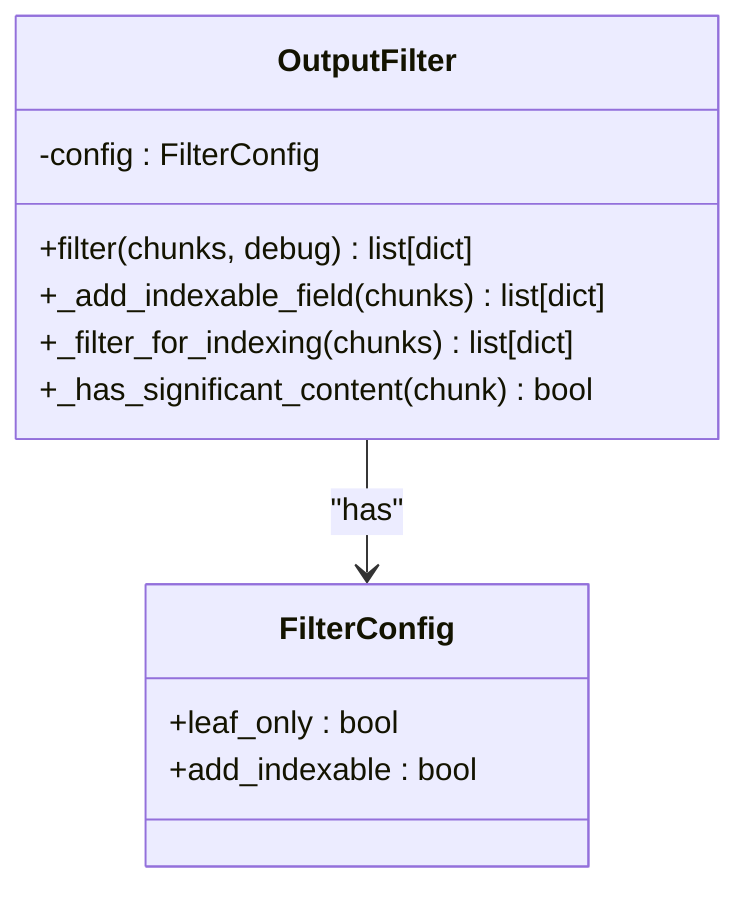
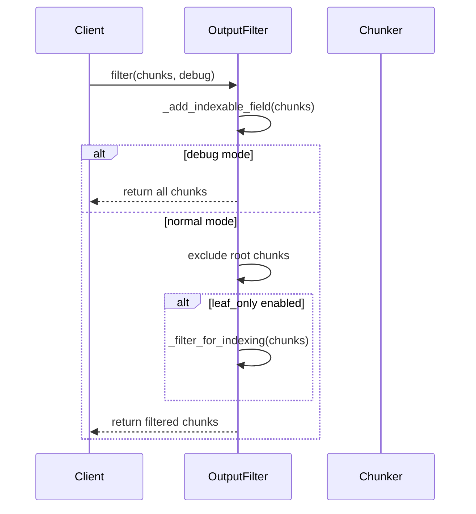
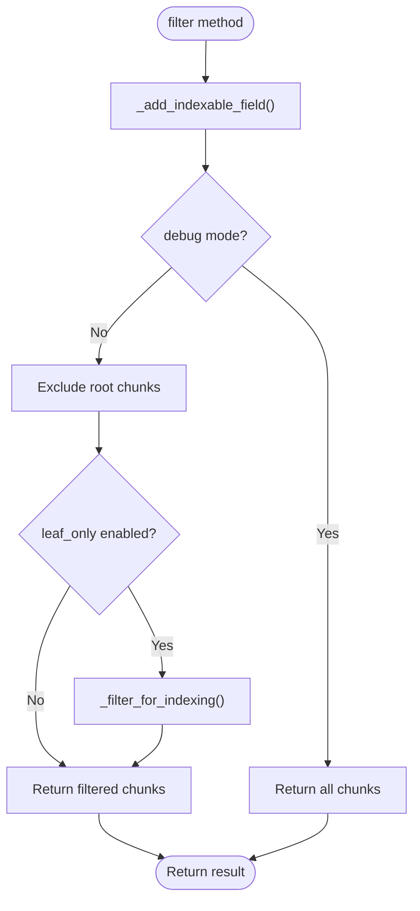
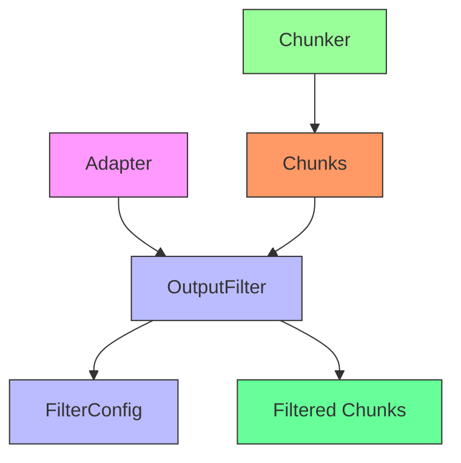

# Output Filter

<cite>
**Referenced Files in This Document**   
- [output_filter.py](file://output_filter.py)
- [adapter.py](file://adapter.py)
- [docs/reference/output-format.md](file://docs/reference/output-format.md)
</cite>

## Table of Contents
1. [Introduction](#introduction)
2. [Core Components](#core-components)
3. [Architecture Overview](#architecture-overview)
4. [Detailed Component Analysis](#detailed-component-analysis)
5. [Dependency Analysis](#dependency-analysis)
6. [Performance Considerations](#performance-considerations)
7. [Troubleshooting Guide](#troubleshooting-guide)
8. [Conclusion](#conclusion)

## Introduction
The Output Filter component is a critical part of the Advanced Markdown Chunker plugin, responsible for processing hierarchical chunking results before they are consumed by downstream systems such as vector databases and indexers. This component ensures that technical nodes like root and internal nodes are properly filtered to prevent accidental indexing while preserving meaningful content. The filter provides configurable behavior through the FilterConfig class, allowing consumers to control whether only leaf chunks are returned and whether indexable fields should be added to metadata. A critical change in version 0.1.3 introduced more sophisticated handling of the indexable field using setdefault() to respect library values, and changed the filtering logic to use the indexable field rather than just the is_leaf flag.

**Section sources**
- [output_filter.py](file://output_filter.py#L1-L116)

## Core Components
The Output Filter component consists of two primary classes: FilterConfig and OutputFilter. FilterConfig serves as a dataclass that defines the configuration parameters for the filtering process, including leaf_only and add_indexable flags. The OutputFilter class implements the core filtering logic, processing chunks according to the specified configuration. The component adds an indexable field to chunk metadata while respecting existing values, excludes root chunks from results, and optionally filters for indexing based on the indexable field rather than just leaf status. The _has_significant_content method evaluates whether non-leaf chunks contain sufficient non-header content (more than 100 characters) to be considered indexable.

**Section sources**
- [output_filter.py](file://output_filter.py#L12-L116)

## Architecture Overview

**Diagram sources **
- [output_filter.py](file://output_filter.py#L16-L116)

## Detailed Component Analysis

### OutputFilter Class Analysis

The OutputFilter class implements a two-stage filtering process that first enhances chunk metadata with indexable information and then applies filtering rules based on configuration.

#### For Object-Oriented Components:

**Diagram sources **
- [output_filter.py](file://output_filter.py#L24-L116)

#### For API/Service Components:

**Diagram sources **
- [output_filter.py](file://output_filter.py#L30-L58)

#### For Complex Logic Components:

**Diagram sources **
- [output_filter.py](file://output_filter.py#L30-L58)

**Section sources**
- [output_filter.py](file://output_filter.py#L24-L116)

### Filter Configuration Analysis
The FilterConfig dataclass provides configuration options for the output filtering process. It contains two boolean fields: leaf_only, which determines whether only leaf chunks should be returned in the filtered output, and add_indexable, which controls whether the indexable field should be added to chunk metadata. These configuration options allow the filtering behavior to be customized based on the specific requirements of downstream consumers.

**Section sources**
- [output_filter.py](file://output_filter.py#L16-L22)

## Dependency Analysis

**Diagram sources **
- [adapter.py](file://adapter.py#L36-L77)
- [output_filter.py](file://output_filter.py#L16-L116)

**Section sources**
- [adapter.py](file://adapter.py#L36-L77)
- [output_filter.py](file://output_filter.py#L16-L116)

## Performance Considerations
The Output Filter component is designed to be lightweight and efficient, with minimal computational overhead. The filtering operations are primarily based on simple dictionary lookups and list comprehensions, making them fast even for large numbers of chunks. The _has_significant_content method performs basic string operations to evaluate content significance, avoiding expensive computations. Since the filter processes chunks after they have been generated by the chunking engine, it does not impact the core chunking performance. The component's memory usage is proportional to the number of chunks being processed, as it operates on the existing chunk data structure without creating significant additional data.

## Troubleshooting Guide
When troubleshooting issues with the Output Filter, consider the following common scenarios: If unexpected chunks are being filtered out, verify the leaf_only configuration setting and check whether the indexable field is being properly set in the metadata. If root chunks are appearing in the output, ensure that the is_root metadata field is correctly set by the chunking engine. For issues with non-leaf chunks not being included when expected, examine the content to ensure it meets the "significant content" threshold of more than 100 non-header characters. When debugging filtering behavior, enable the debug mode which returns all chunks without filtering, allowing inspection of the raw output before filtering is applied.

**Section sources**
- [output_filter.py](file://output_filter.py#L46-L47)

## Conclusion
The Output Filter component plays a crucial role in ensuring that hierarchical chunking results are properly prepared for downstream consumption in RAG systems. By providing configurable filtering based on chunk hierarchy and content significance, it prevents the indexing of technical nodes while preserving meaningful content. The component's design reflects a careful balance between flexibility and simplicity, offering configuration options through the FilterConfig class while maintaining a straightforward filtering interface. Its integration with the migration adapter pattern allows it to work seamlessly with both legacy and modern chunking engines, ensuring backward compatibility while enabling future enhancements. The critical changes in version 0.1.3 improved the robustness of the filtering logic by respecting existing indexable values and using a more sophisticated indexing filter that considers content significance beyond just leaf status.