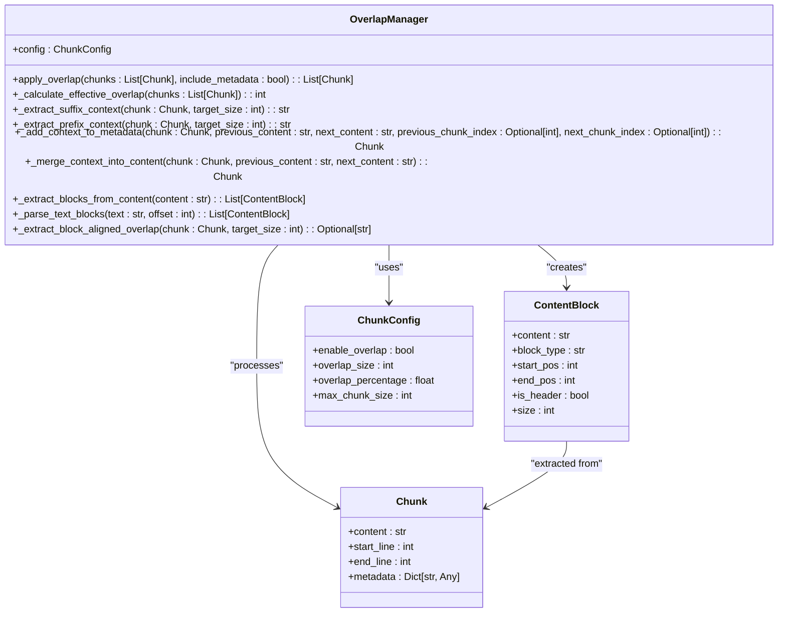
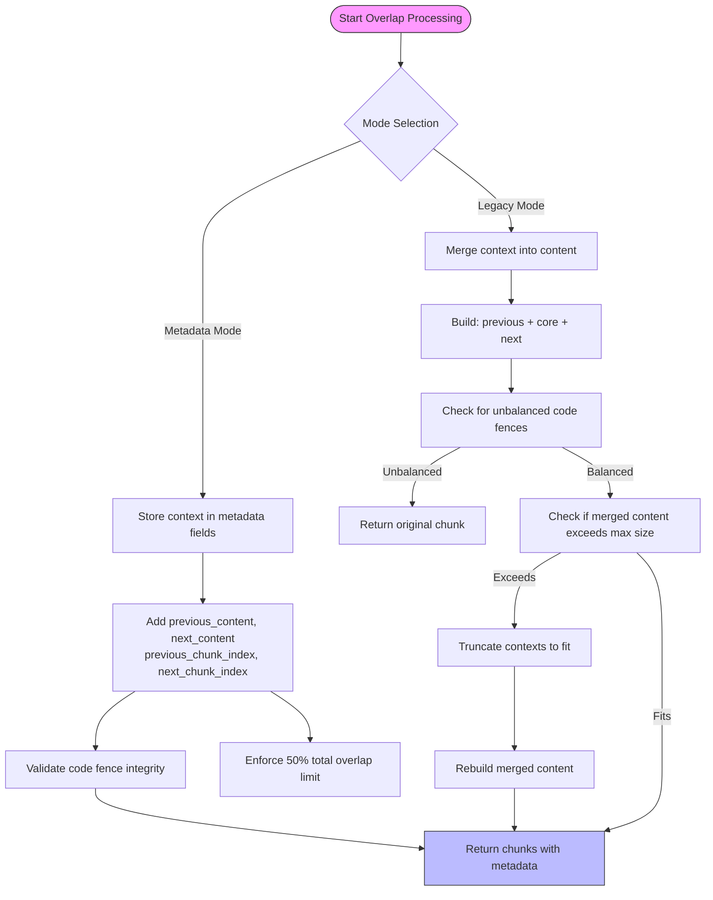
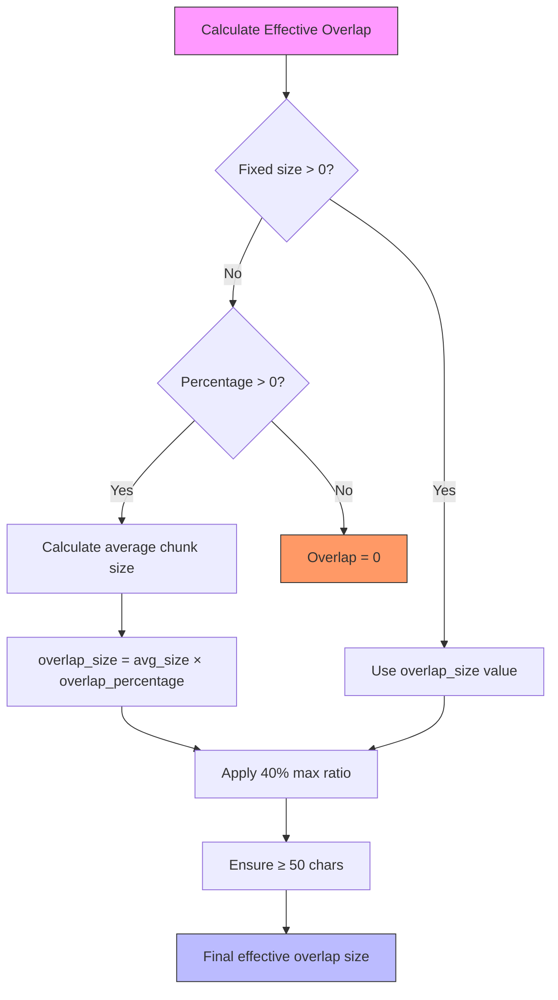
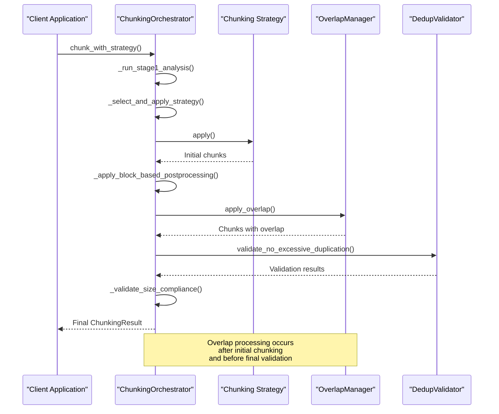
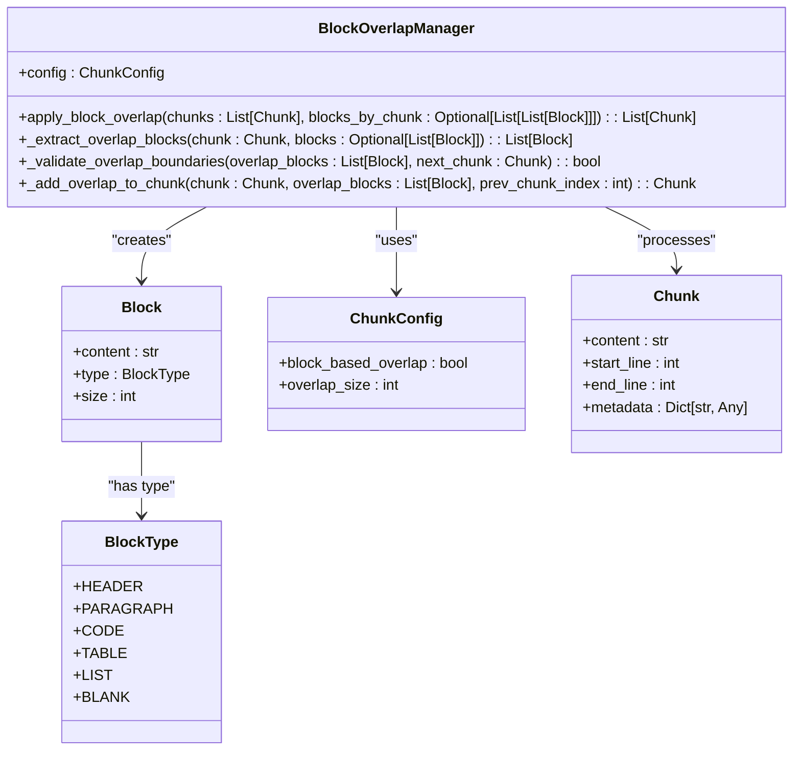
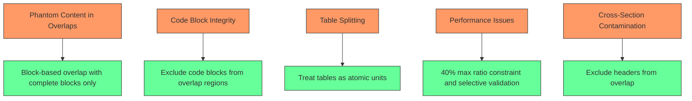

# Overlap Management

<cite>
**Referenced Files in This Document**   
- [overlap_manager.py](file://markdown_chunker_legacy/chunker/components/overlap_manager.py)
- [orchestrator.py](file://markdown_chunker_legacy/chunker/orchestrator.py)
- [block_overlap_manager.py](file://markdown_chunker_legacy/chunker/block_overlap_manager.py)
- [types.py](file://markdown_chunker_legacy/chunker/types.py)
- [test_overlap_manager.py](file://tests/chunker/test_components/test_overlap_manager.py)
- [test_overlap_redesign_integration.py](file://tests/integration/test_overlap_redesign_integration.py)
</cite>

## Table of Contents
1. [Introduction](#introduction)
2. [OverlapManager Implementation](#overlapmanager-implementation)
3. [Overlap Handling Modes](#overlap-handling-modes)
4. [Overlap Size Calculation and Enforcement](#overlap-size-calculation-and-enforcement)
5. [Overlap Processing in the Pipeline](#overlap-processing-in-the-pipeline)
6. [Block-Based Overlap](#block-based-overlap)
7. [Common Issues and Solutions](#common-issues-and-solutions)
8. [Configuration Examples](#configuration-examples)
9. [Conclusion](#conclusion)

## Introduction
The overlap management system in the Markdown chunker is designed to maintain context continuity between adjacent chunks, which is crucial for applications like Retrieval-Augmented Generation (RAG) where context preservation enhances information retrieval and processing. This system ensures that chunks are not isolated fragments but maintain connections with their neighboring content, improving readability and semantic coherence. The core component responsible for this functionality is the OverlapManager class, which operates within the broader chunking pipeline orchestrated by the ChunkingOrchestrator. The system supports multiple overlap handling modes, configurable overlap sizes, and sophisticated block-aware overlap strategies that preserve structural integrity while preventing content duplication.

**Section sources**
- [overlap_manager.py](file://markdown_chunker_legacy/chunker/components/overlap_manager.py#L1-L927)
- [orchestrator.py](file://markdown_chunker_legacy/chunker/orchestrator.py#L1-L666)

## OverlapManager Implementation
The OverlapManager class is the central component responsible for creating overlapping content between adjacent chunks. It implements a sophisticated block-aware approach that aligns overlap boundaries with structural elements in the Markdown content, ensuring that overlaps respect natural content boundaries rather than cutting through paragraphs, code blocks, or tables. The class provides two primary modes of operation: metadata mode and legacy mode, allowing flexibility in how overlap context is stored and accessed.

The implementation uses a block-based approach where content is first parsed into logical blocks (paragraphs, headers, lists, code blocks, and tables) before overlap is applied. This ensures that overlaps consist of complete blocks rather than partial content, preserving the integrity of structural elements. The class includes methods for extracting suffix context from the end of one chunk and prefix context from the beginning of the next chunk, which are then applied according to the configured mode.



**Diagram sources **
- [overlap_manager.py](file://markdown_chunker_legacy/chunker/components/overlap_manager.py#L38-L800)

**Section sources**
- [overlap_manager.py](file://markdown_chunker_legacy/chunker/components/overlap_manager.py#L38-L800)

## Overlap Handling Modes
The overlap management system supports two distinct modes for handling overlap context: metadata mode and legacy mode. These modes provide different approaches to storing and accessing contextual information, allowing users to choose the most appropriate method for their specific use case.

### Metadata Mode
In metadata mode, the overlap context is stored in the chunk's metadata rather than being merged into the content itself. This approach keeps the core content clean and unmodified while making contextual information available through metadata fields. When enabled, the system adds `previous_content` and `next_content` fields to the chunk metadata, containing the contextual text from adjacent chunks. This mode also includes `previous_chunk_index` and `next_chunk_index` fields to indicate the positional relationship between chunks.

The primary advantage of metadata mode is that it preserves the original content structure while providing access to contextual information. This is particularly useful for applications that need to distinguish between core content and contextual information or that perform additional processing on the content before using the context.

### Legacy Mode
Legacy mode follows the traditional approach of merging the overlap context directly into the chunk content. In this mode, the previous chunk's context is prepended to the current chunk, and the next chunk's context is appended, creating a single content string that includes both the core content and its context. This approach results in larger content strings but provides a simpler interface for downstream consumers that expect all relevant text to be in the content field.

The legacy mode includes safeguards to prevent content duplication and ensure that the merged content does not exceed size limits. If the merged content would exceed the maximum chunk size, the system truncates the overlap context to fit within the constraints while preserving as much context as possible.



**Diagram sources **
- [overlap_manager.py](file://markdown_chunker_legacy/chunker/components/overlap_manager.py#L63-L137)
- [overlap_manager.py](file://markdown_chunker_legacy/chunker/components/overlap_manager.py#L343-L477)

**Section sources**
- [overlap_manager.py](file://markdown_chunker_legacy/chunker/components/overlap_manager.py#L63-L477)

## Overlap Size Calculation and Enforcement
The overlap management system employs a sophisticated approach to calculate and enforce overlap size, balancing configuration parameters with content characteristics to ensure optimal context preservation while maintaining performance and structural integrity.

### Size Calculation
The effective overlap size is determined through a hierarchical calculation process that considers both fixed-size and percentage-based configurations. The system first checks if a fixed `overlap_size` is specified in the configuration. If present and greater than zero, this value takes precedence. Otherwise, the system calculates a percentage-based overlap using the `overlap_percentage` parameter and the average chunk size across all chunks.

The calculation also incorporates a maximum ratio constraint of 40% relative to the source chunk size, preventing overlaps from consuming an excessive portion of any single chunk. This ensures that the core content remains the primary focus while still providing sufficient context. For very small chunks, the system applies a minimum threshold of 50 characters to ensure meaningful context is provided.

### Size Enforcement
The system enforces strict limits on overlap size to prevent performance issues and maintain usability. A critical constraint is the 50% total overlap limit, which ensures that the combined size of previous and next context does not exceed half of the final chunk size. This prevents situations where context dominates the content, which could negatively impact downstream processing.

When merging context in legacy mode, the system performs additional validation to ensure the merged content does not exceed the maximum chunk size. If the combined content would exceed this limit, the system truncates the overlap contexts using word-boundary truncation to maintain readability while fitting within constraints.



**Diagram sources **
- [overlap_manager.py](file://markdown_chunker_legacy/chunker/components/overlap_manager.py#L139-L157)
- [overlap_manager.py](file://markdown_chunker_legacy/chunker/components/overlap_manager.py#L179-L182)

**Section sources**
- [overlap_manager.py](file://markdown_chunker_legacy/chunker/components/overlap_manager.py#L139-L182)

## Overlap Processing in the Pipeline
The overlap processing is an integral part of the overall chunking pipeline, coordinated by the ChunkingOrchestrator. It occurs after the initial chunking strategy has been applied and before final validation and post-processing steps. This positioning ensures that overlap is applied to semantically meaningful chunks rather than raw text segments.

The ChunkingOrchestrator manages the entire chunking process, from initial analysis through strategy selection, chunking, and final post-processing. When overlap is enabled, the orchestrator invokes the appropriate overlap management components after the primary chunking strategy has generated the initial set of chunks. The orchestrator also handles error conditions and fallback scenarios, ensuring that the chunking process can continue even if overlap processing encounters issues.

In the current implementation, the orchestrator supports both the traditional OverlapManager and the newer BlockOverlapManager, allowing for different approaches to overlap calculation based on configuration. The block-based approach is preferred as it better preserves structural integrity by aligning overlap boundaries with content blocks.



**Diagram sources **
- [orchestrator.py](file://markdown_chunker_legacy/chunker/orchestrator.py#L86-L190)
- [orchestrator.py](file://markdown_chunker_legacy/chunker/orchestrator.py#L485-L597)

**Section sources**
- [orchestrator.py](file://markdown_chunker_legacy/chunker/orchestrator.py#L86-L597)

## Block-Based Overlap
The block-based overlap system represents a significant advancement over character-based approaches, addressing key issues related to structural integrity and content preservation. This approach treats content as a sequence of atomic blocks rather than a continuous stream of characters, ensuring that overlaps respect natural content boundaries.

The BlockOverlapManager implements this approach by first parsing each chunk into discrete blocks of different types: paragraphs, headers, lists, code blocks, and tables. When calculating overlap, it only includes complete blocks rather than partial content, preventing situations where a paragraph or code block is split across chunks. This is particularly important for maintaining the readability and functionality of code examples and tables.

A critical feature of the block-based system is its handling of special block types. Headers are excluded from overlap to prevent cross-section contamination, ensuring that context from one section doesn't bleed into another. Similarly, code blocks and tables are excluded from overlap regions to maintain their atomic integrity and prevent syntax errors or data corruption.



**Diagram sources **
- [block_overlap_manager.py](file://markdown_chunker_legacy/chunker/block_overlap_manager.py#L16-L264)

**Section sources**
- [block_overlap_manager.py](file://markdown_chunker_legacy/chunker/block_overlap_manager.py#L16-L264)

## Common Issues and Solutions
The overlap management system addresses several common issues that arise in chunking applications, particularly those related to content integrity, duplication, and structural preservation. These solutions are implemented through a combination of algorithmic improvements, configuration options, and validation mechanisms.

### Phantom Content in Overlaps
One common issue is the appearance of "phantom content" in overlaps, where text appears in multiple chunks due to structural requirements rather than intentional overlap. This can occur when headers or other structural elements are included in multiple chunks to maintain context. The system addresses this through careful boundary detection and the use of block-based overlap, which minimizes unnecessary duplication by only including complete blocks in overlap regions.

The integration tests in `test_overlap_redesign_integration.py` specifically verify that context is properly tracked and that there is no unintended duplication beyond what is necessary for structural integrity. The tests validate that previous_content is a genuine suffix of the previous chunk and that next_content is a prefix of the subsequent chunk.

### Code Block Integrity
A critical issue in code-heavy documents is maintaining the integrity of code blocks across chunk boundaries. Splitting a code block can result in syntax errors and render the code unusable. The system prevents this by excluding code blocks from overlap regions and by using the block-based approach that treats code blocks as atomic units.

The tests in `test_overlap_redesign_integration.py` verify that code blocks maintain balanced fences (equal numbers of opening and closing triple backticks) in both the chunk content and any overlap context. This ensures that code blocks remain syntactically valid even when they appear in overlap regions.

### Performance Considerations
Large documents with extensive overlap requirements can impact performance due to the additional processing required. The system addresses this through several optimizations, including the 40% maximum ratio constraint that limits the amount of content processed for overlap, and the use of efficient block extraction algorithms.

The validation system also includes performance safeguards, such as skipping duplication checks for documents larger than 50KB, to prevent performance degradation on very large inputs while still providing validation for typical document sizes.



**Diagram sources **
- [test_overlap_redesign_integration.py](file://tests/integration/test_overlap_redesign_integration.py#L242-L284)
- [overlap_manager.py](file://markdown_chunker_legacy/chunker/components/overlap_manager.py#L179-L182)

**Section sources**
- [test_overlap_redesign_integration.py](file://tests/integration/test_overlap_redesign_integration.py#L242-L284)
- [overlap_manager.py](file://markdown_chunker_legacy/chunker/components/overlap_manager.py#L179-L182)

## Configuration Examples
The overlap management system provides flexible configuration options that can be optimized for different document types and use cases. The ChunkConfig class includes parameters for controlling overlap behavior, allowing users to fine-tune the system for their specific requirements.

### General Documentation
For general documentation with mixed content types, a balanced configuration provides good results:
```python
config = ChunkConfig(
    max_chunk_size=2048,
    enable_overlap=True,
    overlap_size=200,
    overlap_percentage=0.1
)
```
This configuration creates chunks of approximately 2KB with 200-character overlaps, providing sufficient context while maintaining reasonable chunk sizes.

### Code-Heavy Documents
For code-heavy documents such as API references or technical tutorials, a configuration that accommodates larger code blocks is appropriate:
```python
config = ChunkConfig(
    max_chunk_size=6144,
    target_chunk_size=3072,
    code_ratio_threshold=0.5,
    min_code_blocks=2,
    allow_oversize=True,
    preserve_code_blocks=True,
    overlap_size=300
)
```
This configuration increases the maximum chunk size to accommodate complete code examples, uses a more aggressive code detection threshold, and provides larger overlaps to maintain code context.

### Structured Documentation
For well-structured documentation with clear sections and hierarchies, a configuration that emphasizes structural integrity works best:
```python
config = ChunkConfig(
    max_chunk_size=3072,
    target_chunk_size=1536,
    header_count_threshold=2,
    preserve_list_hierarchy=True,
    overlap_size=150,
    block_based_overlap=True
)
```
This configuration creates smaller chunks that respect section boundaries, preserves list structure, and uses block-based overlap for better structural integrity.

### RAG Optimization
For Retrieval-Augmented Generation applications, where context preservation is critical:
```python
config = ChunkConfig(
    max_chunk_size=4096,
    enable_overlap=True,
    overlap_size=400,
    overlap_percentage=0.15,
    enable_content_validation=True,
    block_based_overlap=True
)
```
This configuration prioritizes context preservation with larger overlaps and enables content validation to ensure no information is lost during chunking.

**Section sources**
- [types.py](file://markdown_chunker_legacy/chunker/types.py#L501-L800)
- [basic_usage.py](file://examples/basic_usage.py#L116-L121)

## Conclusion
The overlap management system in the Markdown chunker provides a sophisticated solution for maintaining context continuity between adjacent chunks. Through the OverlapManager class and its block-based counterpart, the system ensures that chunks are not isolated fragments but maintain connections with their neighboring content, enhancing readability and semantic coherence. The implementation supports multiple modes of operation, flexible configuration options, and robust safeguards against common issues like content duplication and structural corruption.

The system's integration into the broader chunking pipeline, coordinated by the ChunkingOrchestrator, ensures that overlap processing occurs at the appropriate stage and benefits from the results of earlier analysis and chunking stages. The block-based approach represents a significant advancement over character-based methods, preserving the integrity of structural elements like code blocks and tables while still providing meaningful context.

By providing configurable overlap sizes, multiple handling modes, and comprehensive validation, the system offers a flexible and reliable solution for applications that require context-preserving chunking, particularly in RAG systems and other information retrieval applications.