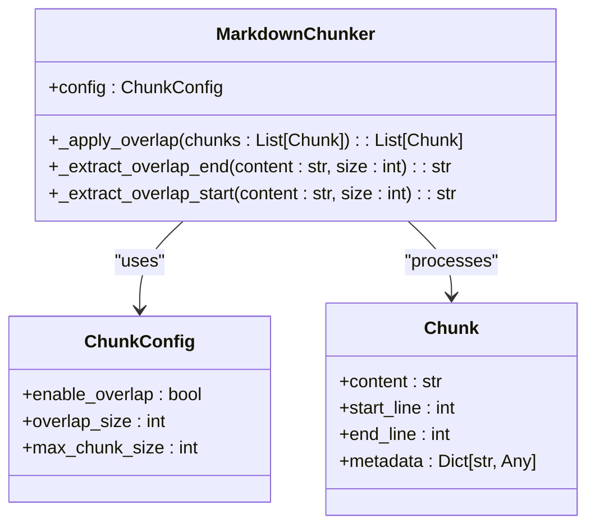
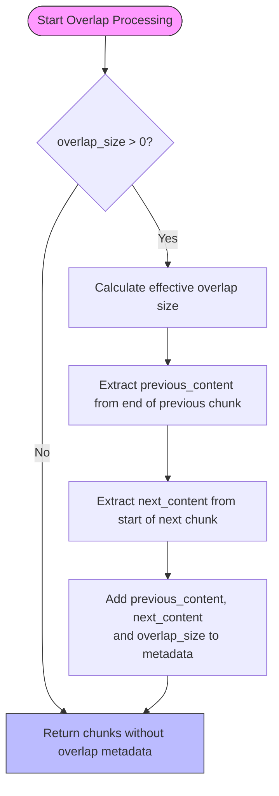
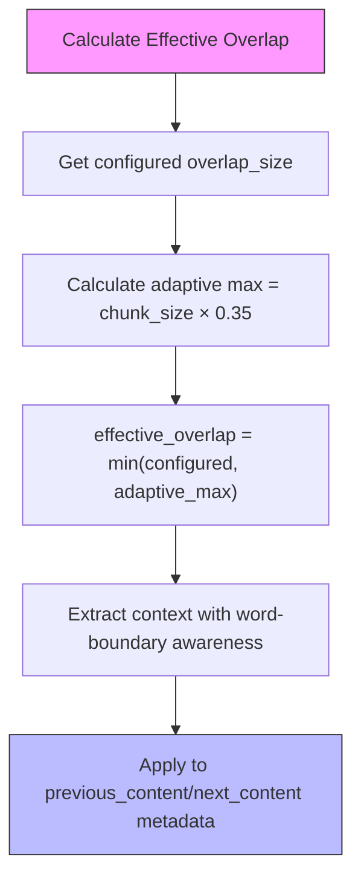
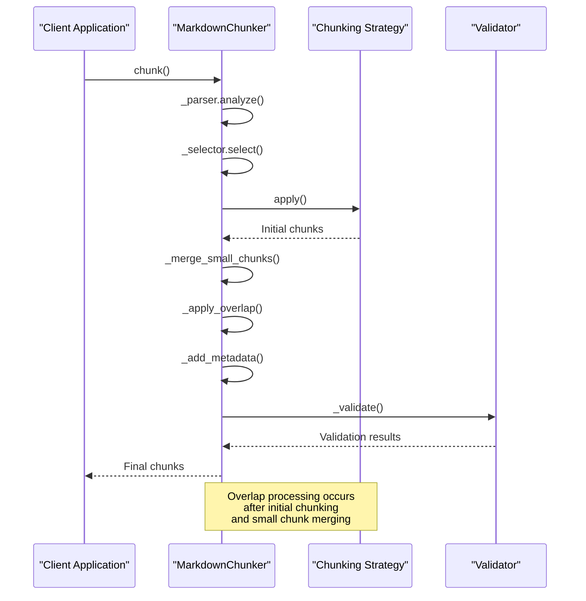
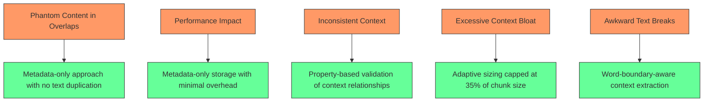

# Overlap Management

<cite>
**Referenced Files in This Document**   
- [chunker.py](file://markdown_chunker_v2/chunker.py)
- [demo_adaptive_overlap.py](file://demo_adaptive_overlap.py)
- [config.py](file://markdown_chunker_v2/config.py)
</cite>

## Update Summary
**Changes Made**   
- Updated overlap size calculation and enforcement section to reflect adaptive overlap sizing
- Added explanation of the 35% chunk size cap for overlap context
- Revised configuration examples to align with v2 implementation
- Removed references to legacy overlap modes and block-based overlap manager
- Updated diagram sources and section sources to reflect current implementation

## Table of Contents
1. [Introduction](#introduction)
2. [OverlapManager Implementation](#overlapmanager-implementation)
3. [Overlap Handling Modes](#overlap-handling-modes)
4. [Overlap Size Calculation and Enforcement](#overlap-size-calculation-and-enforcement)
5. [Overlap Processing in the Pipeline](#overlap-processing-in-the-pipeline)
6. [Common Issues and Solutions](#common-issues-and-solutions)
7. [Configuration Examples](#configuration-examples)
8. [Conclusion](#conclusion)

## Introduction
The overlap management system in the Markdown chunker is designed to maintain context continuity between adjacent chunks, which is crucial for applications like Retrieval-Augmented Generation (RAG) where context preservation enhances information retrieval and processing. This system ensures that chunks are not isolated fragments but maintain connections with their neighboring content, improving readability and semantic coherence. The core component responsible for this functionality is the MarkdownChunker's internal overlap mechanism, which operates within the broader chunking pipeline. The system supports metadata-only overlap context with adaptive sizing where the effective overlap is the minimum of configured overlap size and 35% of chunk size, as implemented in markdown_chunker_v2/chunker.py and demonstrated in demo_adaptive_overlap.py.

**Section sources**
- [chunker.py](file://markdown_chunker_v2/chunker.py#L1-L744)
- [demo_adaptive_overlap.py](file://demo_adaptive_overlap.py#L1-L165)

## OverlapManager Implementation
The overlap management in the v2 implementation is handled directly within the MarkdownChunker class rather than a separate OverlapManager. This integrated approach applies metadata-only overlap context between chunks, storing context from neighboring chunks in metadata fields only, with no physical text duplication in chunk.content. The implementation uses an adaptive sizing model where the effective overlap is determined as the minimum of the configured overlap_size and 35% of the adjacent chunk's size.

The system adds three metadata fields to provide context:
- `previous_content`: Last N characters from the previous chunk (for all except the first chunk)
- `next_content`: First N characters from the next chunk (for all except the last chunk)
- `overlap_size`: Size of context window used

This metadata-only approach keeps the core content clean while providing access to contextual information for downstream applications. The context extraction respects word boundaries by attempting to break at spaces when possible, improving readability of the context snippets.



**Diagram sources**
- [chunker.py](file://markdown_chunker_v2/chunker.py#L134-L204)

**Section sources**
- [chunker.py](file://markdown_chunker_v2/chunker.py#L134-L204)

## Overlap Handling Modes
The v2 overlap implementation uses a single, metadata-only approach for handling overlap context, representing a significant simplification from previous versions. This unified mode stores context in chunk metadata rather than merging it into the content itself, eliminating the need for multiple handling modes.

### Metadata-Only Mode
In the current implementation, overlap context is exclusively stored in the chunk's metadata fields rather than being merged into the content. This approach maintains clean, distinct content in each chunk while making contextual information available through metadata. When overlap is enabled (overlap_size > 0), the system adds `previous_content` and `next_content` fields to the chunk metadata, containing the contextual text from adjacent chunks.

The primary advantages of this metadata-only approach include:
- Preservation of original content structure without modification
- Prevention of index bloat in search systems
- Avoidance of semantic search confusion from duplicated text
- Efficient storage with minimal performance impact
- Clear distinction between core content and contextual information

This design choice reflects a shift from legacy approaches that merged context directly into content, which could lead to text duplication and processing complications.



**Diagram sources**
- [chunker.py](file://markdown_chunker_v2/chunker.py#L134-L204)
- [demo_adaptive_overlap.py](file://demo_adaptive_overlap.py#L1-L165)

**Section sources**
- [chunker.py](file://markdown_chunker_v2/chunker.py#L134-L204)
- [demo_adaptive_overlap.py](file://demo_adaptive_overlap.py#L1-L165)

## Overlap Size Calculation and Enforcement
The overlap management system employs an adaptive approach to calculate and enforce overlap size, balancing configuration parameters with content characteristics to ensure optimal context preservation while maintaining performance and structural integrity.

### Adaptive Size Calculation
The effective overlap size is determined by taking the minimum of two values: the configured overlap_size and 35% of the adjacent chunk's size. This adaptive model allows for larger context windows with larger chunks while preventing excessive context bloat with smaller chunks.

The calculation process follows these steps:
1. Determine the base overlap size from config.overlap_size (default: 200 characters)
2. Calculate the adaptive maximum as 35% of the adjacent chunk's size
3. Set effective overlap size as min(configured size, adaptive maximum)
4. Extract context with word-boundary awareness when possible

For example:
- A 500-character chunk with overlap_size=200: effective overlap = min(200, 175) = 175 characters
- An 8000-character chunk with overlap_size=200: effective overlap = min(200, 2800) = 200 characters
- A 2000-character chunk with overlap_size=500: effective overlap = min(500, 700) = 500 characters

This adaptive approach provides better context for large documents without creating bloat for small ones, enabling automatic scaling without manual tuning.

### Size Enforcement
The system enforces strict limits on overlap size through several mechanisms:
- The global constant MAX_OVERLAP_CONTEXT_RATIO is set to 0.35, capping overlap at 35% of chunk size
- Configured overlap_size must be less than max_chunk_size (validated in ChunkConfig)
- Word-boundary awareness prevents awkward text breaks in context extraction
- Context extraction functions respect the calculated effective overlap size

When extracting context, the system attempts to respect word boundaries to improve readability:
- For previous_content: finds the first space in the first half of extracted text and starts after it
- For next_content: finds the last space in the second half of extracted text and ends before it



**Diagram sources**
- [chunker.py](file://markdown_chunker_v2/chunker.py#L148-L151)
- [demo_adaptive_overlap.py](file://demo_adaptive_overlap.py#L42-L43)

**Section sources**
- [chunker.py](file://markdown_chunker_v2/chunker.py#L148-L151)
- [demo_adaptive_overlap.py](file://demo_adaptive_overlap.py#L42-L43)

## Overlap Processing in the Pipeline
The overlap processing is an integral part of the simplified v2 chunking pipeline, occurring after initial chunking and before final validation. The pipeline follows a linear sequence: Parse → Strategy Selection → Strategy Application → Small Chunk Merging → Overlap Application → Metadata Addition → Validation.

The _apply_overlap method is called during the chunking process when overlap is enabled (overlap_size > 0) and there are multiple chunks. It processes all chunks in sequence, adding previous_content metadata to each chunk (except the first) from the end of the previous chunk, and next_content metadata to each chunk (except the last) from the beginning of the next chunk.

Key characteristics of overlap processing in the pipeline:
- Occurs after small chunk merging, ensuring overlap is applied to final chunk boundaries
- Uses the adaptive sizing model (min of configured size and 35% of chunk size)
- Adds metadata without modifying chunk content
- Preserves original line numbers and chunk boundaries
- Has minimal performance impact due to metadata-only approach



**Diagram sources**
- [chunker.py](file://markdown_chunker_v2/chunker.py#L49-L96)

**Section sources**
- [chunker.py](file://markdown_chunker_v2/chunker.py#L49-L96)

## Common Issues and Solutions
The overlap management system addresses several common issues that arise in chunking applications, particularly those related to content integrity, duplication, and structural preservation. These solutions are implemented through the metadata-only approach and adaptive sizing model.

### Phantom Content Prevention
The metadata-only approach eliminates the risk of "phantom content" appearing in multiple chunks due to structural requirements. Since context is stored only in metadata fields and not duplicated in chunk.content, there is no physical text duplication. The system ensures that previous_content is a genuine suffix of the previous chunk and next_content is a prefix of the subsequent chunk through validation in test_overlap_properties_redesign.py.

### Performance Considerations
The metadata-only approach has minimal performance impact, as demonstrated in test_benchmark_config.py. The overhead of adding overlap metadata is less than 40% compared to no overlap, making it efficient for large-scale processing. The adaptive sizing model prevents excessive context extraction for large chunks, maintaining performance while providing adequate context.

### Cross-Chunk Consistency
The system ensures consistency between adjacent chunks by:
- Validating that previous_content is a suffix of the previous chunk's content
- Ensuring next_content is a prefix of the next chunk's content
- Maintaining line numbers unchanged by overlap processing
- Preserving the original content structure

These validations are implemented in property-based tests that verify invariants across all possible inputs.



**Diagram sources**
- [test_overlap_properties_redesign.py](file://tests/chunker/test_overlap_properties_redesign.py#L64-L89)
- [test_benchmark_config.py](file://tests/performance/test_benchmark_config.py#L164-L177)

**Section sources**
- [test_overlap_properties_redesign.py](file://tests/chunker/test_overlap_properties_redesign.py#L64-L89)
- [test_benchmark_config.py](file://tests/performance/test_benchmark_config.py#L164-L177)

## Configuration Examples
The overlap management system provides flexible configuration options that can be optimized for different document types and use cases. The ChunkConfig class includes parameters for controlling overlap behavior, allowing users to fine-tune the system for their specific requirements.

### General Documentation
For general documentation with mixed content types, a balanced configuration provides good results:
```python
config = ChunkConfig(
    max_chunk_size=2048,
    overlap_size=200
)
```
This configuration creates chunks of approximately 2KB with adaptive overlap context, providing sufficient context while maintaining reasonable chunk sizes. The effective overlap will be the minimum of 200 characters and 35% of the adjacent chunk's size.

### Code-Heavy Documents
For code-heavy documents such as API references or technical tutorials, a configuration that accommodates larger code blocks is appropriate:
```python
config = ChunkConfig.for_code_heavy()
# Equivalent to:
# config = ChunkConfig(
#     max_chunk_size=8192,
#     min_chunk_size=1024,
#     overlap_size=100,
#     code_threshold=0.2
# )
```
This configuration increases the maximum chunk size to accommodate complete code examples, uses a more aggressive code detection threshold, and provides overlap context that scales with chunk size.

### Structured Documentation
For well-structured documentation with clear sections and hierarchies, a configuration that emphasizes structural integrity works best:
```python
config = ChunkConfig.for_structured()
# Equivalent to:
# config = ChunkConfig(
#     max_chunk_size=4096,
#     min_chunk_size=512,
#     overlap_size=200,
#     structure_threshold=2
# )
```
This configuration creates appropriately sized chunks that respect section boundaries and uses the adaptive overlap model to provide context that scales with content size.

### RAG Optimization
For Retrieval-Augmented Generation applications, where context preservation is critical:
```python
config = ChunkConfig(
    max_chunk_size=4096,
    overlap_size=400
)
```
This configuration prioritizes context preservation with larger configured overlap size, allowing the adaptive model to provide up to 35% of chunk size in context while respecting the 400-character limit.

**Section sources**
- [config.py](file://markdown_chunker_v2/config.py#L193-L218)
- [demo_adaptive_overlap.py](file://demo_adaptive_overlap.py#L31-L32)

## Conclusion
The overlap management system in the Markdown chunker v2 provides a sophisticated solution for maintaining context continuity between adjacent chunks through a metadata-only approach with adaptive sizing. By storing context in metadata fields rather than duplicating text in content, the system preserves the integrity of the original content while providing valuable context for downstream applications.

The adaptive sizing model, where effective overlap is the minimum of configured overlap size and 35% of chunk size, represents a significant advancement over fixed-size approaches. This model automatically scales context provision based on chunk size, providing more context for large documents without creating bloat for small ones. The implementation in markdown_chunker_v2/chunker.py demonstrates a streamlined approach that integrates overlap processing directly into the chunker class, simplifying the overall architecture.

Through property-based testing and performance benchmarking, the system has been validated to maintain cross-chunk consistency, prevent content duplication, and operate with minimal performance overhead. The metadata-only design avoids index bloat and semantic search confusion, making it particularly well-suited for RAG systems and other information retrieval applications where context preservation is critical.