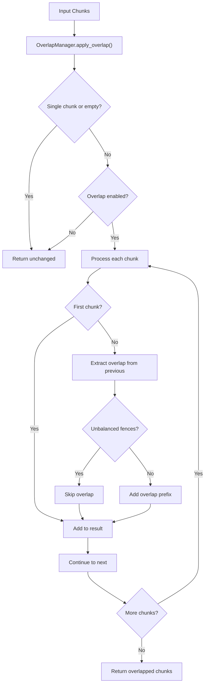
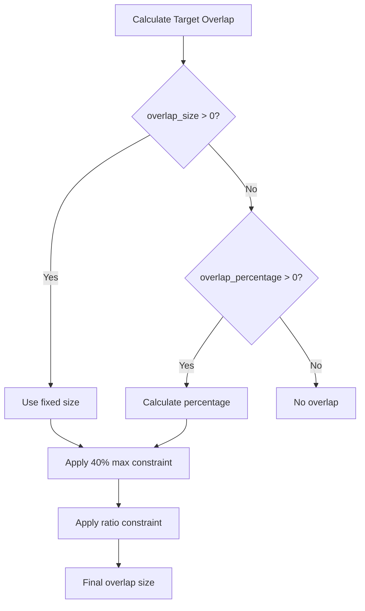
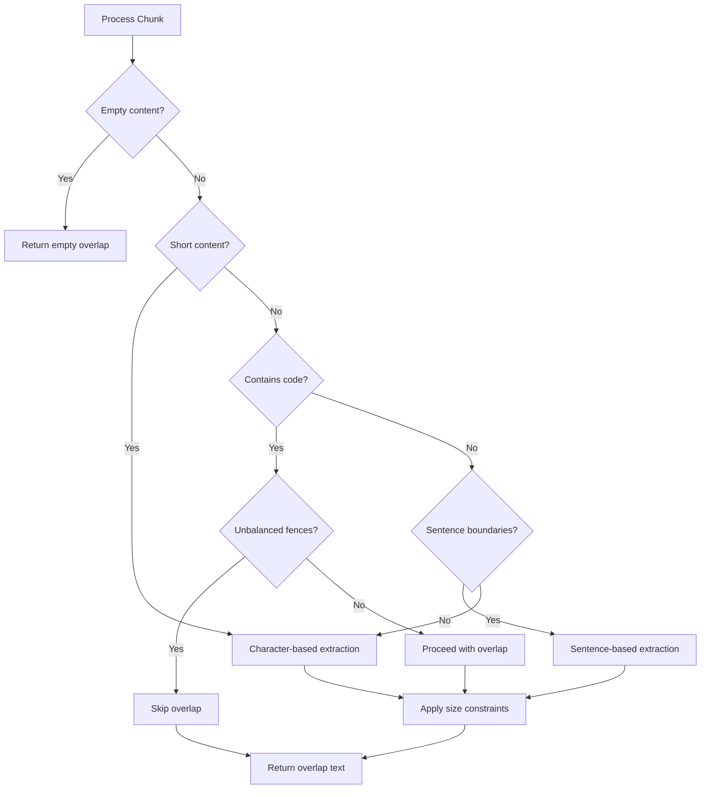

# Overlap Management

<cite>
**Referenced Files in This Document**
- [overlap_manager.py](file://markdown_chunker/chunker/components/overlap_manager.py)
- [test_overlap_manager.py](file://tests/chunker/test_components/test_overlap_manager.py)
- [test_overlap_properties.py](file://tests/chunker/test_overlap_properties.py)
- [types.py](file://markdown_chunker/chunker/types.py)
- [rag_integration.py](file://examples/rag_integration.py)
- [blog_post.md](file://tests/fixtures/real_documents/blog_post.md)
</cite>

## Table of Contents
1. [Introduction](#introduction)
2. [System Architecture](#system-architecture)
3. [Core Components](#core-components)
4. [Configuration Options](#configuration-options)
5. [Overlap Extraction Methods](#overlap-extraction-methods)
6. [Sentence Boundary Preservation](#sentence-boundary-preservation)
7. [Edge Case Handling](#edge-case-handling)
8. [RAG Application Integration](#rag-application-integration)
9. [Performance Considerations](#performance-considerations)
10. [Best Practices](#best-practices)
11. [Troubleshooting Guide](#troubleshooting-guide)

## Introduction

The OverlapManager class is a sophisticated component within the markdown chunking system that maintains contextual continuity between adjacent chunks. It creates sentence-based overlap between consecutive chunks to ensure that when chunks are processed independently (as in Retrieval-Augmented Generation applications), the semantic flow and contextual information are preserved.

Overlap management is crucial for RAG (Retrieval-Augmented Generation) applications where documents are split into smaller chunks for efficient processing and retrieval. Without proper overlap, important context that spans chunk boundaries would be lost, leading to reduced accuracy in downstream AI applications.

## System Architecture

The overlap management system operates as a pipeline component that processes chunks after they've been created by individual chunking strategies. The system maintains strict control over overlap size, preserves sentence boundaries, and ensures code block integrity.



**Diagram sources**
- [overlap_manager.py](file://markdown_chunker/chunker/components/overlap_manager.py#L37-L79)

**Section sources**
- [overlap_manager.py](file://markdown_chunker/chunker/components/overlap_manager.py#L13-L35)

## Core Components

### OverlapManager Class

The OverlapManager serves as the central orchestrator for all overlap-related operations. It maintains configuration state and provides methods for extracting, validating, and applying overlap between chunks.

Key responsibilities include:
- Managing overlap configuration and validation
- Extracting sentence-based overlap from chunks
- Preserving code block integrity during overlap creation
- Ensuring overlap size constraints are met
- Updating chunk metadata with overlap information

### Sentence Boundary Detection

The system uses sophisticated sentence boundary detection to maintain readability and semantic coherence. It employs regular expressions to identify sentence-ending punctuation while being careful to avoid false positives with abbreviations and special cases.

### Fence Integrity Validation

For code-heavy documents, the system includes critical protection against unbalanced code fences. It checks for proper opening and closing of code blocks to prevent corruption of executable code during overlap operations.

**Section sources**
- [overlap_manager.py](file://markdown_chunker/chunker/components/overlap_manager.py#L13-L35)

## Configuration Options

The overlap system provides flexible configuration through the ChunkConfig class, offering multiple approaches to define overlap behavior.

### Primary Configuration Parameters

| Parameter | Type | Default | Description |
|-----------|------|---------|-------------|
| `enable_overlap` | bool | True | Enables or disables overlap creation |
| `overlap_size` | int | 200 | Fixed-size overlap in characters |
| `overlap_percentage` | float | 0.1 | Percentage of chunk size for overlap (0.0-1.0) |

### Configuration Interaction Logic

The overlap system follows a priority-based approach for determining overlap size:

1. **Fixed-size priority**: If `overlap_size > 0`, it takes precedence over percentage-based overlap
2. **Percentage fallback**: If `overlap_size = 0` and `overlap_percentage > 0`, calculates overlap as `chunk_size × overlap_percentage`
3. **Disabled overlap**: If both are zero, no overlap is created

### Size Constraints

The system enforces several critical size constraints to maintain chunk quality:

- **Maximum overlap constraint**: Never exceeds 40% of the source chunk size
- **Ratio constraint**: Final overlap ratio never exceeds 50% of the combined chunk size
- **Space availability**: Respects maximum chunk size limits



**Diagram sources**
- [overlap_manager.py](file://markdown_chunker/chunker/components/overlap_manager.py#L125-L140)

**Section sources**
- [types.py](file://markdown_chunker/chunker/types.py#L579-L582)
- [overlap_manager.py](file://markdown_chunker/chunker/components/overlap_manager.py#L125-L140)

## Overlap Extraction Methods

### _extract_overlap Method

The `_extract_overlap` method serves as the primary interface for overlap extraction, determining whether to extract from the beginning or end of a chunk based on the `is_suffix` parameter.

This method handles the initial overlap calculation and performs essential validations before proceeding to specific extraction logic.

### Suffix Overlap Extraction

The `_extract_suffix_overlap` method extracts overlap from the end of content while preserving sentence boundaries. It implements sophisticated logic to ensure that:

- Sentence boundaries are respected whenever possible
- The target overlap size is approached but not exceeded
- Edge cases with short content are handled gracefully
- Unbalanced code fences are detected and prevented

Key algorithmic features:
- Iterates through sentences in reverse order
- Accumulates sentences until target size is reached
- Applies tolerance for the first sentence when appropriate
- Implements safety truncation for oversized results

### Prefix Overlap Extraction

The `_extract_prefix_overlap` method mirrors the suffix extraction logic but works from the beginning of content. It ensures that:

- Content starts with complete sentences when possible
- Sentence boundaries are maintained
- Character-based fallback is available for content without clear boundaries

### _truncate_preserving_sentences Method

This utility method provides intelligent text truncation that attempts to preserve sentence boundaries while respecting size limits. It implements a multi-stage approach:

1. **Boundary preservation**: Checks if text already ends with sentence punctuation
2. **Backward search**: Scans backward from the target size to find the nearest sentence boundary
3. **Word boundary fallback**: Falls back to word boundaries when sentence boundaries aren't available
4. **Hard truncation**: Last resort for content that cannot be sensibly truncated

**Section sources**
- [overlap_manager.py](file://markdown_chunker/chunker/components/overlap_manager.py#L109-L153)
- [overlap_manager.py](file://markdown_chunker/chunker/components/overlap_manager.py#L155-L239)
- [overlap_manager.py](file://markdown_chunker/chunker/components/overlap_manager.py#L241-L284)

## Sentence Boundary Preservation

### Sentence Detection Algorithm

The system uses a sophisticated sentence detection mechanism that balances accuracy with practicality. The `_split_into_sentences` method employs regular expressions to identify sentence boundaries while avoiding common pitfalls.

Detection patterns:
- Standard sentence endings: `.`, `!`, `?` followed by whitespace
- Handles abbreviations and special cases
- Preserves punctuation within sentences
- Maintains sentence context for overlap extraction

### Boundary Preservation Strategies

When extracting overlap, the system employs multiple strategies to maintain sentence integrity:

1. **Complete sentence inclusion**: Full sentences are included when they fit within size constraints
2. **Partial sentence allowance**: First sentences may be partially included with tolerance
3. **Character fallback**: When no sentence boundaries exist, character-based extraction is used
4. **Safety truncation**: Final validation ensures overlap doesn't exceed limits

### Edge Case Handling

The sentence boundary preservation system handles numerous edge cases:

- **Empty or whitespace-only content**: Returns empty list for character-based extraction
- **Content without sentence punctuation**: Falls back to character-based extraction
- **Very short sentences**: May be included entirely or excluded based on size constraints
- **Mixed content types**: Adapts detection based on content characteristics

**Section sources**
- [overlap_manager.py](file://markdown_chunker/chunker/components/overlap_manager.py#L286-L317)

## Edge Case Handling

### Short Chunk Handling

The overlap system implements robust handling for short chunks that might not contain enough content to satisfy overlap requirements:

- **Minimum size enforcement**: Ensures overlap isn't disproportionately large compared to chunk size
- **Graceful degradation**: Falls back to character-based extraction when sentence boundaries aren't available
- **Size ratio protection**: Prevents overlap from dominating small chunks

### Code Block Protection

Critical protection mechanisms ensure code block integrity:

- **Fence counting**: Monitors opening and closing code fence markers
- **Unbalanced detection**: Identifies when overlap would create unbalanced code blocks
- **Skip logic**: Prevents overlap application when code integrity would be compromised

### Multiline Content Management

The system handles multiline content effectively:

- **Line structure preservation**: Maintains newline patterns when possible
- **Paragraph boundary respect**: Respects paragraph breaks in overlap extraction
- **Indentation preservation**: Maintains indentation levels in code and formatted content

### Empty and Null Content

Robust handling of edge cases:

- **Empty chunk lists**: Returns empty list immediately
- **Whitespace-only content**: Treated as empty for overlap purposes
- **Null or invalid content**: Validated and handled gracefully



**Diagram sources**
- [overlap_manager.py](file://markdown_chunker/chunker/components/overlap_manager.py#L109-L153)

**Section sources**
- [test_overlap_manager.py](file://tests/chunker/test_components/test_overlap_manager.py#L216-L234)
- [overlap_manager.py](file://markdown_chunker/chunker/components/overlap_manager.py#L97-L107)

## RAG Application Integration

### Context Window Creation

The overlap system enables sophisticated context window creation for RAG applications. By maintaining overlap between chunks, the system allows for dynamic context construction around target query points.

Example integration pattern:
- **Chunk preparation**: Process documents with overlap enabled
- **Embedding generation**: Create vector embeddings for each overlapped chunk
- **Context retrieval**: Build context windows around query-relevant chunks
- **Quality assurance**: Verify that context windows maintain semantic coherence

### Embedding Optimization

Overlap-enhanced chunks provide significant benefits for embedding-based retrieval:

- **Improved semantic coverage**: Context from previous chunks enhances query relevance
- **Reduced context loss**: Important information spanning boundaries remains accessible
- **Enhanced retrieval accuracy**: Better representation of document semantics

### Multi-Document Processing

The system scales effectively across multiple documents:

- **Consistent chunking**: Same overlap configuration applies across all documents
- **Metadata preservation**: Chunk metadata includes source document information
- **Cross-document context**: Related information across documents becomes retrievable

### Real-World Applications

The overlap management system has been successfully deployed in various RAG scenarios:

- **Technical documentation**: Maintains code context across function boundaries
- **API documentation**: Preserves parameter and method relationships
- **Educational materials**: Maintains instructional flow between sections
- **Legal documents**: Preserves argumentative structure across paragraphs

**Section sources**
- [rag_integration.py](file://examples/rag_integration.py#L101-L136)
- [blog_post.md](file://tests/fixtures/real_documents/blog_post.md#L57-L118)

## Performance Considerations

### Computational Efficiency

The overlap system is designed for efficiency while maintaining quality:

- **Linear complexity**: Sentence boundary detection operates in linear time
- **Memory optimization**: Minimal additional memory overhead per chunk
- **Early termination**: Processing stops when overlap constraints are met

### Scalability Factors

Performance characteristics scale with:

- **Content size**: Larger documents require more processing time
- **Overlap size**: Larger overlaps increase computational requirements
- **Sentence complexity**: Documents with complex sentence structures require more analysis

### Memory Management

The system implements careful memory management:

- **Streaming support**: Can process large documents incrementally
- **Chunk isolation**: Each chunk's overlap is computed independently
- **Garbage collection**: Temporary data structures are efficiently managed

### Optimization Strategies

Several optimization strategies enhance performance:

- **Lazy evaluation**: Overlap is calculated only when needed
- **Caching**: Sentence boundary detection results may be cached
- **Batch processing**: Multiple chunks can be processed together efficiently

## Best Practices

### Optimal Overlap Size Calculation

Determining the ideal overlap size depends on several factors:

**Content Type Guidelines:**
- **Code-heavy documents**: 300-500 characters overlap for context preservation
- **Text documents**: 150-300 characters for readability balance
- **Mixed content**: 200-400 characters to accommodate both text and code

**Document Characteristics:**
- **Sentence density**: Higher density allows larger overlap
- **Paragraph structure**: Well-structured documents benefit from smaller overlap
- **Domain specificity**: Specialized domains may require larger context windows

**Application Requirements:**
- **Retrieval accuracy**: Higher accuracy often requires larger overlap
- **Processing speed**: Smaller overlap improves performance
- **Storage constraints**: Larger overlap increases storage requirements

### Configuration Recommendations

**Default Settings:**
```python
config = ChunkConfig(
    enable_overlap=True,
    overlap_size=200,  # Fixed size for consistency
    overlap_percentage=0.1  # Percentage fallback
)
```

**RAG-Optimized Settings:**
```python
config = ChunkConfig.for_dify_rag()  # Pre-configured for RAG applications
```

**Code Documentation Settings:**
```python
config = ChunkConfig.for_code_heavy()  # Optimized for code contexts
```

### Quality Assurance

Implement these practices for optimal results:

- **Validation testing**: Verify overlap preserves sentence boundaries
- **Content integrity**: Ensure code blocks remain functional
- **Performance monitoring**: Track processing time and memory usage
- **Accuracy measurement**: Test retrieval accuracy with different overlap settings

### Integration Patterns

Successful integration follows established patterns:

- **Pipeline consistency**: Apply same overlap configuration across processing stages
- **Metadata preservation**: Maintain source information for debugging
- **Error handling**: Gracefully handle edge cases and malformed content
- **Monitoring**: Track overlap effectiveness in production environments

## Troubleshooting Guide

### Common Issues and Solutions

**Issue: Overlap creates unbalanced code fences**
- **Cause**: Overlap includes partial code block closures
- **Solution**: The system automatically skips overlap in such cases
- **Prevention**: Monitor code block integrity in test documents

**Issue: Overlap size exceeds chunk limits**
- **Cause**: Overlap size calculations exceed maximum chunk size
- **Solution**: The system applies automatic truncation and ratio constraints
- **Prevention**: Use appropriate overlap size relative to chunk size

**Issue: Sentence boundaries not preserved**
- **Cause**: Content lacks clear sentence punctuation or is too short
- **Solution**: The system falls back to character-based extraction
- **Prevention**: Ensure content has sufficient sentence structure

**Issue: Poor retrieval accuracy despite overlap**
- **Cause**: Insufficient overlap size or poor content structure
- **Solution**: Increase overlap size or improve content organization
- **Prevention**: Test overlap effectiveness with representative queries

### Debugging Techniques

**Overlap Inspection:**
- Examine chunk metadata for overlap information
- Verify overlap size and type in chunk metadata
- Check for unbalanced fences in problematic chunks

**Content Analysis:**
- Review sentence boundary detection accuracy
- Analyze overlap content for readability
- Monitor code block integrity preservation

**Performance Monitoring:**
- Track processing time for overlap operations
- Monitor memory usage during chunk processing
- Measure overlap effectiveness in retrieval tasks

### Validation Procedures

**Automated Testing:**
- Run overlap property tests to verify constraints
- Test edge cases with empty, short, and malformed content
- Validate sentence boundary preservation across content types

**Manual Verification:**
- Review sample chunks for overlap quality
- Test retrieval accuracy with overlapped content
- Compare performance with and without overlap

**Production Monitoring:**
- Track overlap effectiveness in live applications
- Monitor error rates and edge case handling
- Analyze retrieval performance improvements

**Section sources**
- [test_overlap_properties.py](file://tests/chunker/test_overlap_properties.py#L270-L291)
- [test_overlap_manager.py](file://tests/chunker/test_components/test_overlap_manager.py#L370-L396)