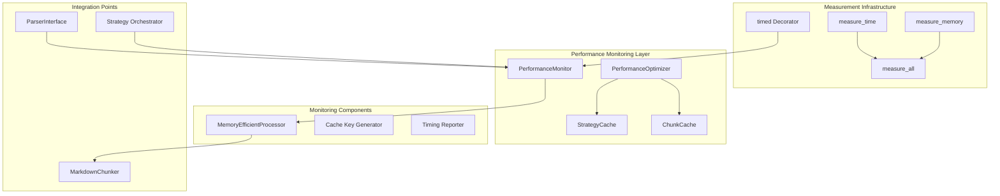
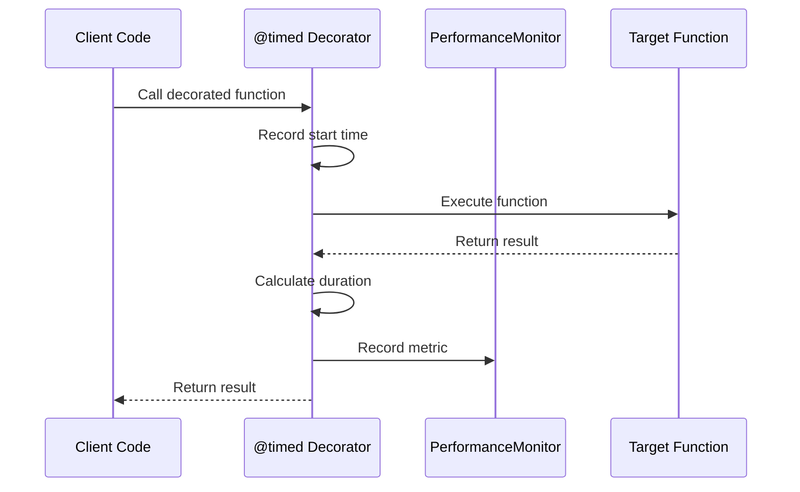
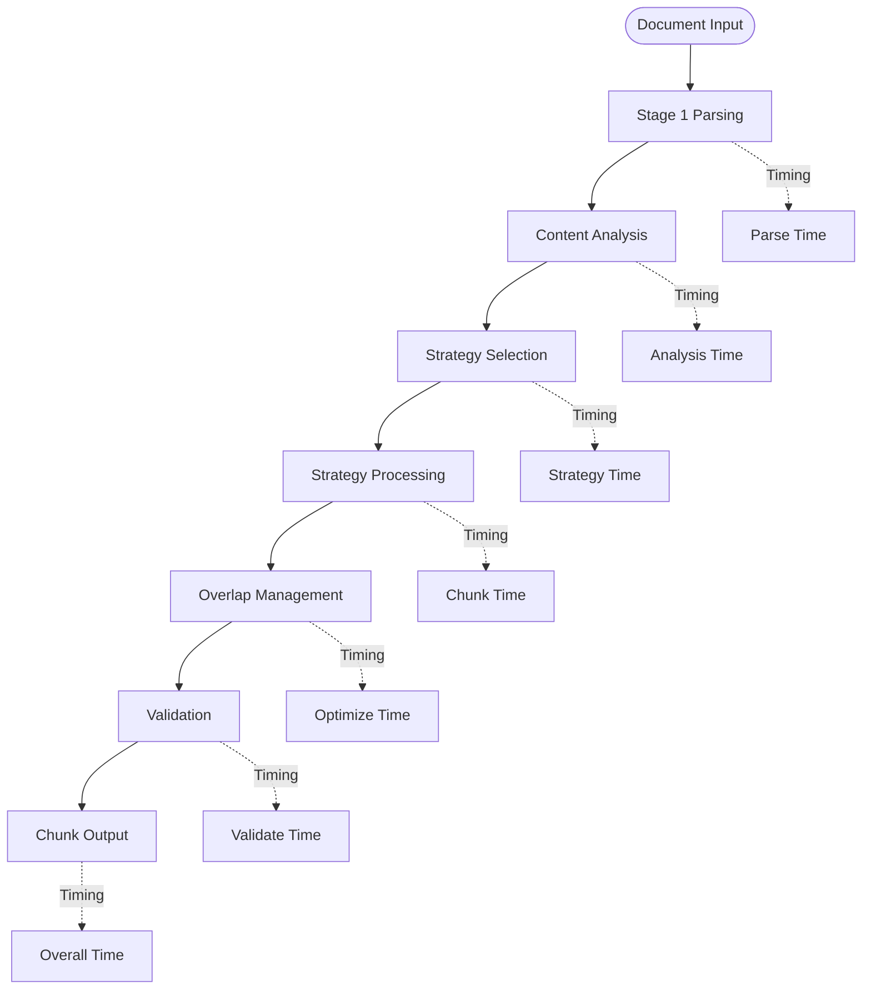
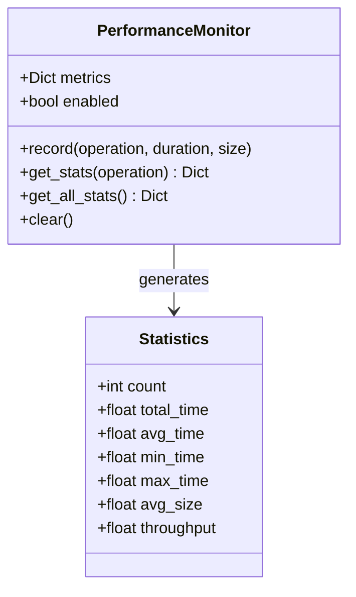
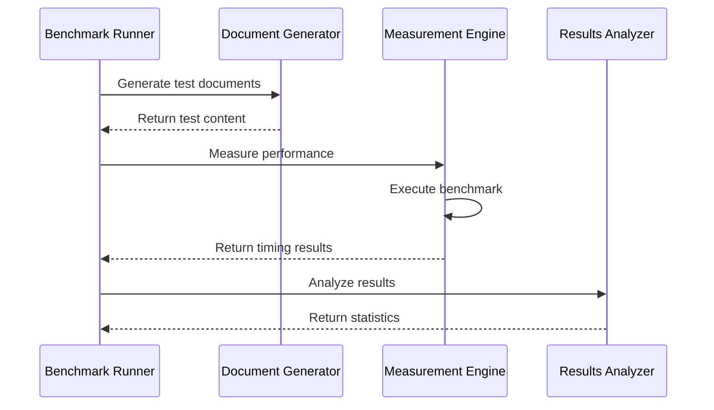

# Performance Monitoring

<cite>
**Referenced Files in This Document**
- [benchmarks/benchmark_chunker.py](file://benchmarks/benchmark_chunker.py)
- [benchmarks/benchmark_parser.py](file://benchmarks/benchmark_parser.py)
- [benchmarks/benchmark_strategies.py](file://benchmarks/benchmark_strategies.py)
- [benchmarks/utils.py](file://benchmarks/utils.py)
- [tests/chunker/test_performance_benchmarks.py](file://tests/chunker/test_performance_benchmarks.py)
- [tests/chunker/test_performance.py](file://tests/chunker/test_performance.py)
- [tests/integration/test_performance_full_pipeline.py](file://tests/integration/test_performance_full_pipeline.py)
- [markdown_chunker_legacy/chunker/performance.py](file://markdown_chunker_legacy/chunker/performance.py)
- [markdown_chunker_legacy/chunker/core.py](file://markdown_chunker_legacy/chunker/core.py)
- [markdown_chunker_legacy/parser/core.py](file://markdown_chunker_legacy/parser/core.py)
- [docs/guides/performance.md](file://docs/guides/performance.md)
</cite>

## Table of Contents
1. [Introduction](#introduction)
2. [Performance Monitoring Architecture](#performance-monitoring-architecture)
3. [Timing Metrics Collection](#timing-metrics-collection)
4. [Performance Reporting System](#performance-reporting-system)
5. [Benchmarking Framework](#benchmarking-framework)
6. [Production Monitoring](#production-monitoring)
7. [Performance Optimization](#performance-optimization)
8. [Common Bottlenecks](#common-bottlenecks)
9. [Performance Budgets](#performance-budgets)
10. [Troubleshooting Guide](#troubleshooting-guide)

## Introduction

The Markdown chunker implements a comprehensive performance monitoring system designed to track timing metrics, measure throughput, and optimize chunking operations across different document types and content structures. This system enables developers to understand performance characteristics, identify bottlenecks, and make informed decisions about configuration tuning and strategy selection.

The performance monitoring infrastructure consists of multiple layers: low-level timing decorators, high-level performance monitors, comprehensive benchmarking frameworks, and production-ready metrics collection systems.

## Performance Monitoring Architecture

The performance monitoring system is built around several key components that work together to provide comprehensive visibility into chunking operations.



**Diagram sources**
- [markdown_chunker_legacy/chunker/performance.py](file://markdown_chunker_legacy/chunker/performance.py#L32-L243)
- [markdown_chunker_legacy/chunker/core.py](file://markdown_chunker_legacy/chunker/core.py#L120-L125)

### Core Monitoring Components

The performance monitoring architecture includes several specialized components:

**PerformanceMonitor**: Central component for collecting and analyzing timing metrics across all operations. Tracks execution time, throughput, and resource usage patterns.

**PerformanceOptimizer**: Coordinates caching strategies, memory management, and performance tuning decisions based on collected metrics.

**StrategyCache**: Implements lazy loading and caching for chunking strategies to reduce initialization overhead.

**ChunkCache**: Provides result caching to avoid reprocessing identical content with the same configuration.

**Section sources**
- [markdown_chunker_legacy/chunker/performance.py](file://markdown_chunker_legacy/chunker/performance.py#L32-L243)

## Timing Metrics Collection

The chunker implements comprehensive timing metrics collection throughout the entire chunking pipeline, capturing both per-component and end-to-end measurements.

### Low-Level Timing Decorators

The system uses a `@timed` decorator pattern to automatically instrument function calls with timing measurements:



**Diagram sources**
- [markdown_chunker_legacy/chunker/performance.py](file://markdown_chunker_legacy/chunker/performance.py#L84-L104)

### Per-Component Timing Measurements

The monitoring system captures timing metrics at multiple levels:

**Stage 1 Parser Timing**: Measures content analysis and element detection performance
- Document processing time
- Element detection speed
- AST construction duration

**Strategy Selection Timing**: Tracks strategy analysis and selection overhead
- Content type detection
- Complexity scoring
- Strategy ranking

**Chunking Strategy Timing**: Monitors individual strategy execution
- Code strategy processing
- Structural strategy analysis
- Mixed content handling
- List and table processing

**Post-Processing Timing**: Measures overlap management and metadata enrichment
- Overlap calculation
- Metadata generation
- Validation overhead

**Section sources**
- [benchmarks/benchmark_parser.py](file://benchmarks/benchmark_parser.py#L17-L44)
- [benchmarks/benchmark_strategies.py](file://benchmarks/benchmark_strategies.py#L19-L77)

### End-to-End Performance Tracking

The system provides comprehensive end-to-end performance tracking through the main chunking pipeline:



**Diagram sources**
- [markdown_chunker_legacy/chunker/core.py](file://markdown_chunker_legacy/chunker/core.py#L155-L200)

**Section sources**
- [benchmarks/benchmark_chunker.py](file://benchmarks/benchmark_chunker.py#L27-L195)

## Performance Reporting System

The performance reporting system provides detailed insights into chunking operations through structured metrics and statistical analysis.

### Metrics Collection Framework

The system collects comprehensive performance metrics including:

**Execution Time Metrics**:
- Single operation timing
- Cumulative processing time
- Average operation duration
- Minimum/maximum execution times

**Throughput Measurements**:
- Characters processed per second
- Documents processed per minute
- Memory bandwidth utilization
- I/O throughput rates

**Resource Utilization**:
- Peak memory consumption
- CPU utilization patterns
- Garbage collection impact
- Memory allocation patterns

### Statistical Analysis and Reporting

The PerformanceMonitor provides sophisticated statistical analysis capabilities:



**Diagram sources**
- [markdown_chunker_legacy/chunker/performance.py](file://markdown_chunker_legacy/chunker/performance.py#L32-L82)

### Performance Dashboard Integration

The reporting system supports integration with monitoring dashboards through standardized metrics export:

**JSON Export Format**: Structured performance data for external monitoring systems
**CSV Export**: Tabular performance data for analysis and trend tracking
**Real-time Metrics**: Streaming performance data for live monitoring
**Historical Trends**: Long-term performance trend analysis

**Section sources**
- [tests/chunker/test_performance.py](file://tests/chunker/test_performance.py#L70-L132)

## Benchmarking Framework

The benchmarking framework provides comprehensive testing and measurement capabilities for different aspects of the chunking system.

### Benchmark Categories

The framework organizes benchmarks into several categories:

**Document Size Benchmarks**: Tests performance across different document sizes
- Small documents (< 1KB)
- Medium documents (1-10KB)
- Large documents (10-100KB)
- Extra-large documents (> 100KB)

**Content Type Benchmarks**: Evaluates performance across different content types
- Text-heavy documents
- Code-heavy documents
- Mixed content documents
- List-heavy documents
- Table-heavy documents

**Strategy-Specific Benchmarks**: Measures individual strategy performance
- Code strategy efficiency
- Structural strategy overhead
- Mixed content handling
- List processing speed
- Table chunking performance

### Benchmark Execution Framework



**Diagram sources**
- [benchmarks/utils.py](file://benchmarks/utils.py#L51-L76)

### Benchmark Utilities

The framework includes specialized utilities for performance measurement:

**Timing Functions**: Precise timing measurement with minimal overhead
**Memory Profiling**: Peak memory usage tracking during execution
**Throughput Calculation**: Real-time throughput computation
**Statistical Analysis**: Comprehensive statistical analysis of benchmark results

**Section sources**
- [benchmarks/benchmark_chunker.py](file://benchmarks/benchmark_chunker.py#L27-L195)
- [benchmarks/benchmark_parser.py](file://benchmarks/benchmark_parser.py#L17-L62)
- [benchmarks/benchmark_strategies.py](file://benchmarks/benchmark_strategies.py#L19-L96)

## Production Monitoring

Production monitoring enables real-time tracking of chunking performance in live environments with minimal overhead.

### Performance Monitoring Configuration

The MarkdownChunker supports performance monitoring through configuration:

```python
# Enable performance monitoring
chunker = MarkdownChunker(enable_performance_monitoring=True)

# Process documents
result = chunker.chunk(document_content)

# Retrieve performance statistics
stats = chunker.get_performance_stats()
```

### Production Metrics Collection

Production monitoring captures essential metrics for operational visibility:

**Operation-Level Metrics**:
- Processing time per document
- Strategy selection frequency
- Cache hit rates
- Error rates and failure patterns

**System-Level Metrics**:
- Memory usage trends
- CPU utilization patterns
- I/O operation timing
- Resource contention indicators

**Quality Metrics**:
- Chunk quality scores
- Semantic coherence measures
- Content completeness validation
- Metadata accuracy tracking

### Monitoring Integration Patterns

The system supports integration with popular monitoring platforms:

**Prometheus Metrics**: Export performance metrics in Prometheus format
**StatsD Integration**: Send metrics to StatsD-compatible collectors
**Custom Hooks**: Pluggable metric collection for custom monitoring systems
**Log Integration**: Structured logging with performance context

**Section sources**
- [markdown_chunker_legacy/chunker/core.py](file://markdown_chunker_legacy/chunker/core.py#L62-L107)

## Performance Optimization

The performance monitoring system drives continuous optimization through data-driven insights and automated tuning.

### Caching Strategies

The system implements multiple caching layers to optimize performance:

**Strategy Caching**: Lazy-loaded strategy instances with weak references
**Result Caching**: Chunk results cached by content hash and configuration
**Memory-Efficient Processing**: Streaming processing for large documents
**Adaptive Configuration**: Dynamic configuration adjustment based on performance data

### Performance Tuning Guidelines

Based on empirical data, the following optimization guidelines apply:

**Document Size Optimization**:
- Small documents (< 1KB): Focus on minimizing overhead
- Medium documents (1-10KB): Balance strategy selection and processing
- Large documents (10-100KB): Prioritize memory efficiency
- Extra-large documents (> 100KB): Implement streaming processing

**Strategy Selection Optimization**:
- Code-heavy documents: Prefer code strategy for optimal performance
- Structured documents: Use structural strategy for best quality
- Mixed content: Leverage mixed strategy for balanced performance
- List/table-heavy: Optimize specific handling for these elements

**Configuration Tuning**:
- Chunk size: Balance between quality and processing overhead
- Overlap settings: Minimize overlap for better performance
- Memory limits: Tune based on available system resources
- Parallel processing: Enable for large document processing

**Section sources**
- [markdown_chunker_legacy/chunker/performance.py](file://markdown_chunker_legacy/chunker/performance.py#L210-L243)

## Common Bottlenecks

Understanding common performance bottlenecks helps in optimizing chunking operations effectively.

### Parser Performance Bottlenecks

**Regex Complexity**: Complex regular expressions in fenced block detection can cause performance issues with deeply nested structures.

**Nesting Resolution**: Resolving complex nesting relationships requires significant computational overhead.

**Input Validation**: Extensive input validation and normalization can become bottleneck for malformed documents.

### Strategy Processing Bottlenecks

**Code Strategy**: Processing large code blocks with complex syntax can be computationally expensive.

**Structural Strategy**: Header-based processing requires extensive tree traversal operations.

**Mixed Strategy**: Balancing multiple content types introduces additional processing overhead.

**List/Table Processing**: Complex list and table structures require sophisticated parsing logic.

### Memory-Related Bottlenecks

**Large Document Processing**: Memory usage grows linearly with document size, potentially causing garbage collection pauses.

**Cache Management**: Excessive caching can lead to memory pressure and increased GC overhead.

**String Operations**: Frequent string concatenation and manipulation can cause memory fragmentation.

### Optimization Recommendations

Based on empirical data, the following optimizations are recommended:

**Parser Optimizations**:
- Implement regex compilation caching
- Optimize nesting resolution algorithms
- Add early termination for malformed input

**Strategy Optimizations**:
- Profile strategy-specific bottlenecks
- Implement lazy evaluation where possible
- Optimize hot code paths

**Memory Optimizations**:
- Use memory-efficient data structures
- Implement streaming processing for large documents
- Optimize garbage collection patterns

**Section sources**
- [markdown_chunker_legacy/parser/core.py](file://markdown_chunker_legacy/parser/core.py#L47-L200)

## Performance Budgets

Establishing performance budgets ensures consistent performance across different environments and use cases.

### Document Size Performance Targets

Based on benchmark data, the following performance targets are established:

| Document Size | Target Time | Target Throughput | Acceptable Range |
|---------------|-------------|-------------------|------------------|
| 1 KB          | < 100ms     | > 10 KB/s         | ±20%             |
| 10 KB         | < 500ms     | > 20 KB/s         | ±25%             |
| 50 KB         | < 2.0s      | > 25 KB/s         | ±30%             |
| 100 KB        | < 5.0s      | > 20 KB/s         | ±35%             |
| 500 KB        | < 20.0s     | > 25 KB/s         | ±40%             |

### Strategy Performance Targets

Individual strategy performance targets help in strategy selection:

| Strategy | Target Time | Memory Usage | Quality Score |
|----------|-------------|--------------|---------------|
| Code     | < 100ms     | Low          | High          |
| Structural | < 500ms   | Medium       | Very High     |
| Mixed    | < 300ms     | Medium       | High          |
| List     | < 150ms     | Low          | High          |
| Table    | < 200ms     | Low          | High          |
| Sentences | < 100ms    | Low          | Medium        |

### Production Environment Targets

Production environments require different performance expectations:

**Development Environment**: More relaxed targets to accommodate debugging overhead
**CI/CD Environment**: Moderate targets with additional overhead for testing
**Production Environment**: Strict targets with minimal overhead
**High-Load Environment**: Aggressive targets with optimization focus

### Monitoring Thresholds

Set up monitoring thresholds for proactive performance management:

**Warning Thresholds**:
- Processing time > 150% of target
- Memory usage > 120% of expected
- Cache hit rate < 80%

**Critical Thresholds**:
- Processing time > 200% of target
- Memory usage > 150% of expected
- Error rate > 5%

**Section sources**
- [tests/chunker/test_performance_benchmarks.py](file://tests/chunker/test_performance_benchmarks.py#L18-L563)

## Troubleshooting Guide

This section provides guidance for diagnosing and resolving performance issues in the Markdown chunker.

### Performance Issue Diagnosis

**Symptoms of Performance Issues**:
- Slow document processing
- High memory usage
- Unexplained timeouts
- Poor chunk quality

**Diagnostic Steps**:
1. Enable performance monitoring
2. Collect baseline metrics
3. Identify bottleneck operations
4. Analyze resource utilization
5. Compare against performance targets

### Common Performance Issues

**Issue: Slow Processing Times**
- **Cause**: Inefficient strategy selection or large document processing
- **Solution**: Enable performance monitoring, analyze strategy selection, consider document preprocessing
- **Prevention**: Use appropriate configuration profiles and document size optimization

**Issue: High Memory Usage**
- **Cause**: Large document processing without streaming or excessive caching
- **Solution**: Implement memory-efficient processing, tune cache sizes, enable garbage collection optimization
- **Prevention**: Monitor memory usage patterns and implement streaming for large documents

**Issue: Poor Chunk Quality**
- **Cause**: Suboptimal strategy selection or configuration issues
- **Solution**: Analyze content characteristics, adjust strategy selection criteria, fine-tune configuration
- **Prevention**: Use content analysis for strategy selection and validate configuration parameters

### Performance Debugging Tools

**Built-in Debugging Features**:
- Performance monitor with detailed timing metrics
- Strategy selection analysis
- Memory usage tracking
- Throughput calculation

**External Tools Integration**:
- Python profiling tools (cProfile, py-spy)
- Memory profilers (memory_profiler, tracemalloc)
- Performance monitoring systems (Prometheus, Grafana)
- Custom logging and metrics collection

### Optimization Workflows

**Performance Optimization Cycle**:
1. Identify performance issues through monitoring
2. Analyze root causes using diagnostic tools
3. Implement targeted optimizations
4. Validate improvements through testing
5. Monitor ongoing performance

**Continuous Improvement**:
- Regular performance benchmarking
- Automated performance regression testing
- Capacity planning based on usage patterns
- Proactive optimization based on trends

**Section sources**
- [tests/integration/test_performance_full_pipeline.py](file://tests/integration/test_performance_full_pipeline.py#L1-L364)