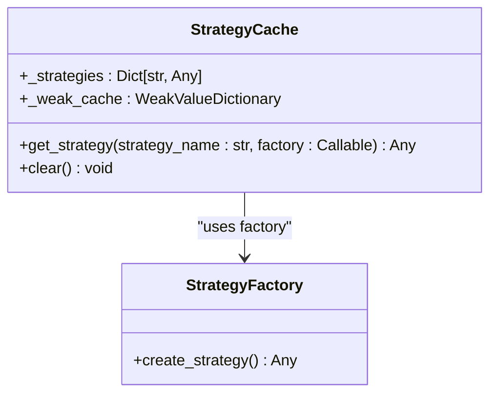
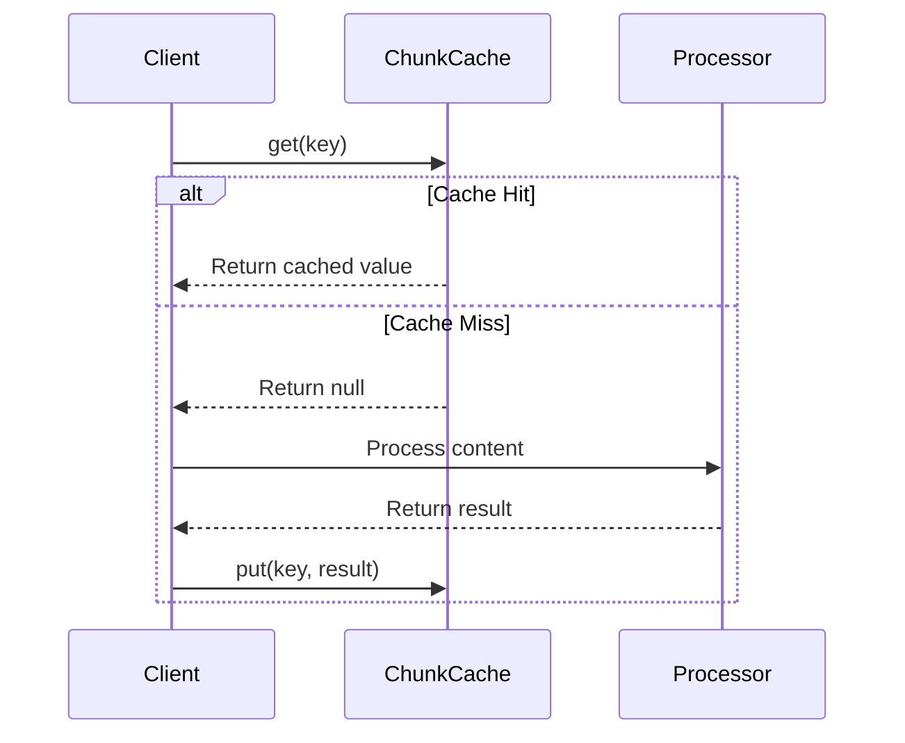
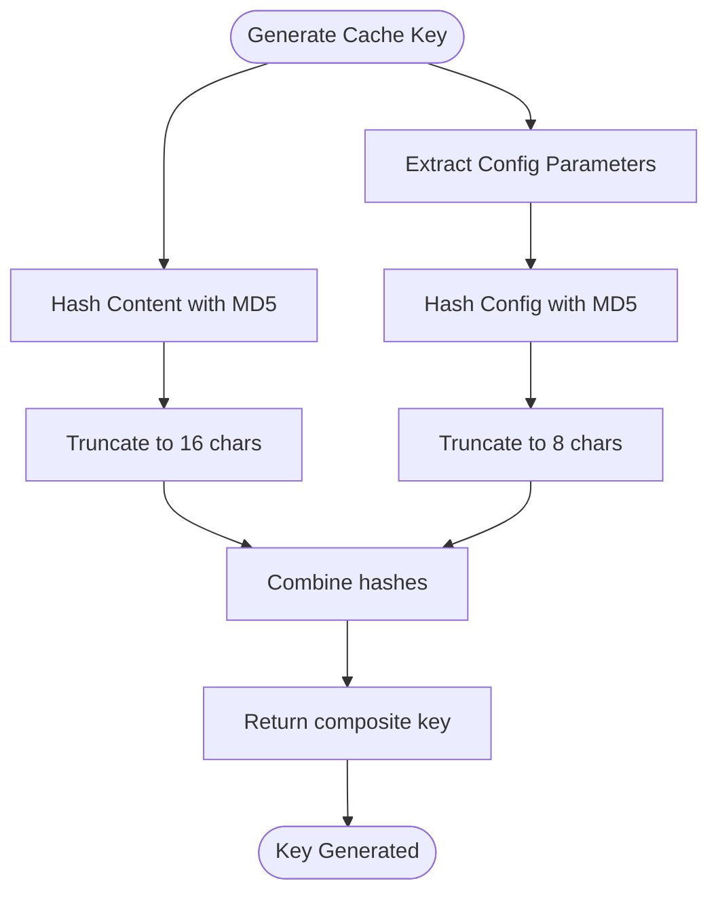
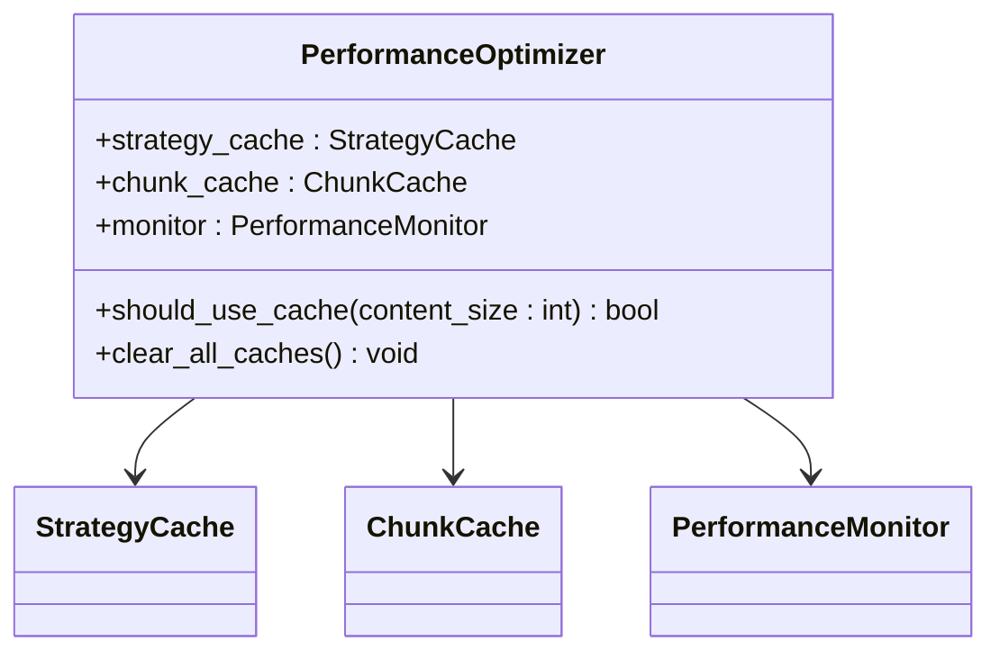

# Caching Mechanisms

<cite>
**Referenced Files in This Document**   
- [performance.py](file://markdown_chunker/chunker/performance.py)
- [core.py](file://markdown_chunker/chunker/core.py)
</cite>

## Table of Contents
1. [Introduction](#introduction)
2. [StrategyCache Implementation](#strategycache-implementation)
3. [ChunkCache Implementation](#chunkcache-implementation)
4. [Cache Key Generation](#cache-key-generation)
5. [Cache Configuration and Management](#cache-configuration-and-management)
6. [Performance Optimization](#performance-optimization)
7. [Usage Examples](#usage-examples)
8. [Conclusion](#conclusion)

## Introduction
The caching system in the Markdown chunker is designed to optimize performance by reducing redundant operations and minimizing initialization overhead. The system employs two primary caching mechanisms: StrategyCache for lazy-loading strategy instances and ChunkCache for storing processed chunk results using an LRU (Least Recently Used) eviction policy. These caches work together to improve throughput in high-volume processing scenarios while maintaining memory efficiency.

**Section sources**
- [performance.py](file://markdown_chunker/chunker/performance.py#L1-L242)

## StrategyCache Implementation

The StrategyCache class provides a mechanism for lazy-loading strategy instances to reduce initialization overhead. This cache stores strategy instances and ensures they are only created when first needed, then reused for subsequent requests. The cache uses factory functions to instantiate strategies on-demand, preventing unnecessary object creation during system initialization.

The get_strategy() method is the primary interface for retrieving strategy instances. When a strategy is requested for the first time, the factory function is invoked to create the instance, which is then stored in the cache. Subsequent requests for the same strategy return the cached instance, eliminating the need for repeated initialization. This approach significantly reduces memory usage and startup time, especially when dealing with multiple strategy types.

**Diagram sources **
- [performance.py](file://markdown_chunker/chunker/performance.py#L13-L28)

**Section sources**
- [performance.py](file://markdown_chunker/chunker/performance.py#L13-L28)

## ChunkCache Implementation

The ChunkCache implements an LRU (Least Recently Used) caching strategy for storing processed chunk results. This cache stores the output of chunking operations, allowing subsequent requests for the same content to be served from cache rather than reprocessing the entire document. The LRU eviction policy ensures that the most frequently accessed items remain in the cache while removing the least recently used entries when the cache reaches its maximum size.

The cache provides three primary methods: put() for storing results, get() for retrieving cached results, and size() for monitoring current cache utilization. When a cache miss occurs, the system processes the content normally and stores the result in the cache for future use. The access order is updated whenever an item is retrieved, ensuring that frequently accessed items are less likely to be evicted.

**Diagram sources **
- [performance.py](file://markdown_chunker/chunker/performance.py#L120-L164)

**Section sources**
- [performance.py](file://markdown_chunker/chunker/performance.py#L120-L164)

## Cache Key Generation

The generate_cache_key() function creates unique keys for cache entries based on both content and configuration parameters. This ensures that different processing configurations produce distinct cache entries, preventing incorrect results when the same content is processed with different settings. The function combines a content hash with a configuration hash to create a composite key that uniquely identifies each processing scenario.

The content hash is generated using MD5 of the input text, truncated to 16 characters for efficiency. The configuration hash includes key parameters such as max_chunk_size, min_chunk_size, and enable_overlap settings. This approach guarantees that changes to configuration parameters result in different cache keys, ensuring that the system processes content appropriately for each configuration.

**Diagram sources **
- [performance.py](file://markdown_chunker/chunker/performance.py#L168-L181)

**Section sources**
- [performance.py](file://markdown_chunker/chunker/performance.py#L168-L181)

## Cache Configuration and Management

The caching system includes comprehensive configuration options and management capabilities. The ChunkCache has a configurable maximum size (default: 100 entries) that can be adjusted based on available memory and performance requirements. The system automatically disables caching for large documents (over 50,000 characters) to prevent excessive memory usage, as determined by the should_use_cache() method in the PerformanceOptimizer class.

Cache invalidation is handled through clear() methods on both StrategyCache and ChunkCache. These methods remove all entries from their respective caches, forcing subsequent requests to recreate strategy instances or reprocess content. The PerformanceOptimizer provides a clear_all_caches() method that simultaneously clears both caches and the performance monitor, offering a convenient way to reset the entire optimization system.

**Diagram sources **
- [performance.py](file://markdown_chunker/chunker/performance.py#L210-L242)

**Section sources**
- [performance.py](file://markdown_chunker/chunker/performance.py#L210-L242)

## Performance Optimization

The caching system delivers significant performance benefits in high-throughput environments with repetitive content processing. By avoiding redundant strategy initialization and document processing, the system reduces CPU utilization and improves response times. The LRU eviction policy ensures optimal cache utilization by prioritizing frequently accessed content.

For small to medium documents, the system leverages caching to deliver consistent performance, while automatically switching to streaming processing for very large documents (over 1MB) to maintain memory efficiency. The PerformanceOptimizer class coordinates these decisions, selecting the optimal processing strategy based on document size and system constraints.

**Section sources**
- [performance.py](file://markdown_chunker/chunker/performance.py#L219-L236)

## Usage Examples

The caching system demonstrates its effectiveness through various usage patterns. In a cache hit scenario, requesting the same document twice results in the second request being served entirely from cache, eliminating processing overhead. When the cache reaches its maximum size, the LRU policy evicts the least recently accessed entry to make room for new content.

Access patterns significantly impact cache behavior. Frequently accessed documents remain in the cache longer, while infrequently accessed documents are more likely to be evicted. The system automatically adapts to changing access patterns, promoting recently accessed items to higher positions in the access order and protecting them from eviction.

**Section sources**
- [performance.py](file://markdown_chunker/chunker/performance.py#L144-L194)

## Conclusion

The caching mechanisms in the Markdown chunker provide a robust solution for optimizing performance in content processing workflows. By combining lazy-loaded strategy instances with LRU-based result caching, the system achieves significant efficiency gains while maintaining memory constraints. The intelligent cache key generation ensures correct behavior across different configurations, and the comprehensive management interface allows for effective cache control. These features make the system particularly well-suited for high-throughput environments where repetitive processing of similar content is common.