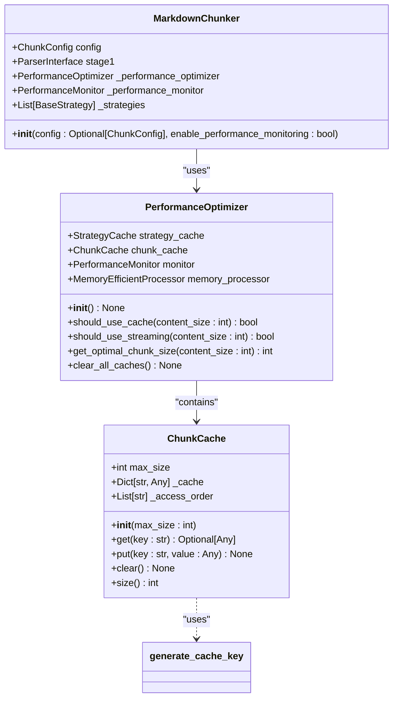
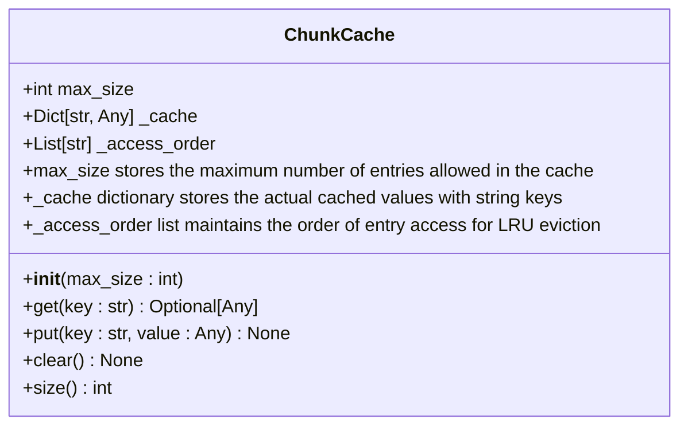
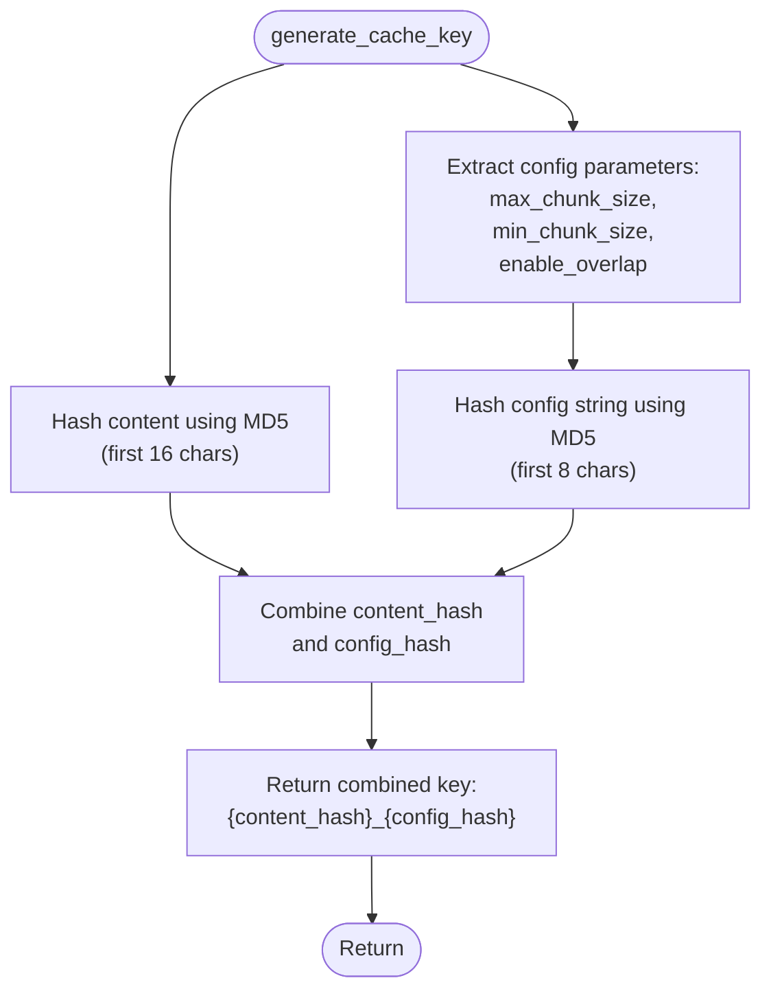
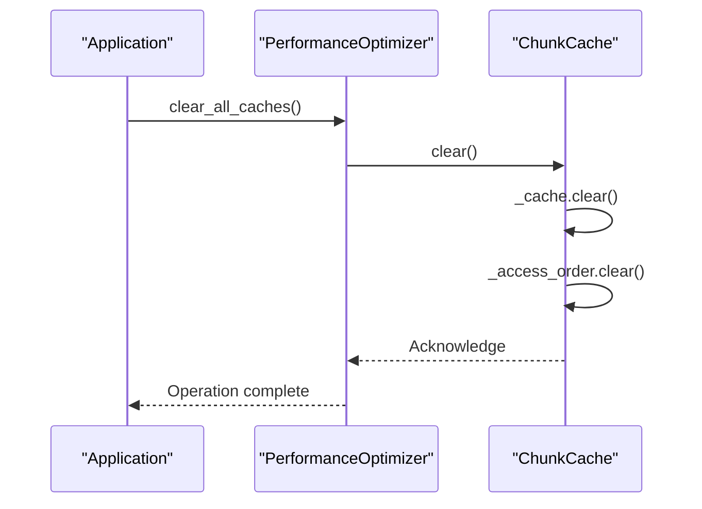

# Chunk Cache

<cite>
**Referenced Files in This Document**   
- [performance.py](file://markdown_chunker/chunker/performance.py#L120-L168)
- [core.py](file://markdown_chunker/chunker/core.py#L123-L124)
- [performance.py](file://markdown_chunker/chunker/performance.py#L214-L215)
</cite>

## Table of Contents
1. [Introduction](#introduction)
2. [Core Components](#core-components)
3. [Architecture Overview](#architecture-overview)
4. [Detailed Component Analysis](#detailed-component-analysis)
5. [Performance Considerations](#performance-considerations)
6. [Troubleshooting Guide](#troubleshooting-guide)
7. [Conclusion](#conclusion)

## Introduction
The ChunkCache class implements an LRU (Least Recently Used) caching mechanism for storing processed chunk results in the markdown chunking system. This cache is designed to improve performance by avoiding redundant processing of identical content with the same configuration. The cache automatically manages memory usage through size limits and eviction policies, while also providing automatic cache disabling for large documents to prevent memory issues. The system integrates with a cache key generation function that creates unique identifiers based on content and configuration parameters, ensuring that different processing scenarios are properly isolated in the cache.

## Core Components
The ChunkCache implementation consists of two primary data structures: the _cache dictionary that stores the actual chunk results and the _access_order list that tracks the usage pattern of cached entries. These components work together to implement the LRU eviction policy, where the least recently accessed items are removed when the cache reaches its maximum capacity. The cache is integrated into the performance optimization system through the PerformanceOptimizer class, which manages its lifecycle and usage decisions based on document size.

**Section sources**
- [performance.py](file://markdown_chunker/chunker/performance.py#L120-L168)

## Architecture Overview


**Diagram sources **
- [performance.py](file://markdown_chunker/chunker/performance.py#L120-L168)
- [performance.py](file://markdown_chunker/chunker/performance.py#L210-L242)
- [core.py](file://markdown_chunker/chunker/core.py#L119-L126)

## Detailed Component Analysis

### ChunkCache Class Analysis
The ChunkCache class implements a custom LRU cache using a dictionary for storage and a list to maintain access order. This implementation provides O(n) complexity for access order updates but offers simplicity and clarity in its operation. The cache is initialized with a default maximum size of 100 entries, which can be customized based on application requirements.

#### Class Diagram


**Diagram sources **
- [performance.py](file://markdown_chunker/chunker/performance.py#L120-L168)

### Method Behavior Analysis

#### put() Method Flow
The put() method handles both new entries and updates to existing entries in the cache. When adding a new entry, it first checks if the cache has reached its maximum size. If the limit is exceeded, it removes the least recently used entry by popping the first key from the _access_order list and deleting the corresponding entry from the _cache dictionary. For existing entries, it updates the access order by removing the key from its current position and appending it to the end of the _access_order list.

```mermaid
flowchart TD
Start([put() called]) --> CheckExistence{"Key exists?"}
CheckExistence --> |Yes| UpdateAccessOrder["Remove key from _access_order<br/>Append key to _access_order<br/>Update value in _cache"]
CheckExistence --> |No| CheckSize{"Cache at max_size?"}
CheckSize --> |Yes| EvictLRU["Remove first key from _access_order<br/>Delete key from _cache"]
CheckSize --> |No| AddNewEntry["Add key to _access_order<br/>Add key-value to _cache"]
UpdateAccessOrder --> End([Return])
EvictLRU --> AddNewEntry
AddNewEntry --> End
```

**Diagram sources **
- [performance.py](file://markdown_chunker/chunker/performance.py#L138-L155)

#### get() Method Flow
The get() method retrieves values from the cache while updating the access order to maintain recency information. It first checks if the requested key exists in the _cache dictionary. If found, it updates the access pattern by removing the key from its current position in the _access_order list and appending it to the end, marking it as recently used. This operation ensures that frequently accessed items remain in the cache longer, while less frequently accessed items are more likely to be evicted.

```mermaid
flowchart TD
Start([get() called]) --> CheckExistence{"Key in _cache?"}
CheckExistence --> |No| ReturnNull["Return None"]
CheckExistence --> |Yes| UpdateAccess["Remove key from _access_order<br/>Append key to _access_order"]
UpdateAccess --> ReturnValue["Return value from _cache"]
ReturnNull --> End([Return])
ReturnValue --> End
```

**Diagram sources **
- [performance.py](file://markdown_chunker/chunker/performance.py#L128-L136)

### Cache Key Generation
The generate_cache_key() function creates unique identifiers for cache entries by combining a content hash with configuration parameters. It uses MD5 hashing to generate a fixed-length identifier from the input content and relevant configuration settings such as max_chunk_size, min_chunk_size, and enable_overlap. This approach ensures that identical content processed with different configurations results in different cache keys, preventing incorrect cache hits when configuration changes affect the output.



**Diagram sources **
- [performance.py](file://markdown_chunker/chunker/performance.py#L168-L181)

### Cache Size Management and Configuration
The ChunkCache class provides several mechanisms for managing cache size and behavior. The size() method returns the current number of entries in the cache, allowing monitoring of cache utilization. The max_size parameter, set during initialization, determines the maximum capacity of the cache before LRU eviction begins. Additionally, the system includes automatic cache disabling for large documents (>50KB) through the PerformanceOptimizer's should_use_cache() method, which prevents memory issues when processing large files.

**Section sources**
- [performance.py](file://markdown_chunker/chunker/performance.py#L123-L124)
- [performance.py](file://markdown_chunker/chunker/performance.py#L219-L222)

### Cache Invalidation and Lifecycle Management
The clear() method provides a mechanism for cache invalidation, removing all entries from both the _cache dictionary and _access_order list. This functionality is essential for maintaining data consistency when configuration changes occur or when memory needs to be freed. The cache is also integrated into a broader performance optimization system through the PerformanceOptimizer class, which coordinates cache clearing across multiple components via the clear_all_caches() method.



**Diagram sources **
- [performance.py](file://markdown_chunker/chunker/performance.py#L157-L160)
- [performance.py](file://markdown_chunker/chunker/performance.py#L238-L241)

## Performance Considerations
The ChunkCache implementation provides significant performance benefits in high-throughput environments with repetitive content processing. By avoiding redundant processing of identical content, the cache can dramatically reduce processing time and computational resources. The LRU eviction policy ensures that the most frequently accessed content remains in the cache, optimizing hit rates. The automatic cache disabling for large documents (>50KB) prevents memory issues while still providing benefits for smaller, frequently processed documents. The integration with the PerformanceOptimizer allows for intelligent cache usage decisions based on document size and system requirements.

**Section sources**
- [performance.py](file://markdown_chunker/chunker/performance.py#L219-L222)

## Troubleshooting Guide
When working with the ChunkCache, several common scenarios may require attention. Cache misses occur when a requested key is not present in the cache, either because it was never added or because it was evicted due to LRU policy. To diagnose cache misses, verify that the generate_cache_key() function is producing consistent keys for identical content and configurations. High eviction rates may indicate that the max_size parameter is too small for the workload; monitoring the cache size() over time can help determine optimal sizing. When cache behavior seems inconsistent, ensure that configuration changes are properly reflected in the cache key generation process. For memory concerns with large documents, the automatic cache disabling feature should prevent issues, but monitoring memory usage in production environments is recommended.

**Section sources**
- [performance.py](file://markdown_chunker/chunker/performance.py#L144-L155)
- [performance.py](file://markdown_chunker/chunker/performance.py#L168-L181)

## Conclusion
The ChunkCache class provides an effective LRU caching solution for the markdown chunking system, significantly improving performance through intelligent result reuse. Its design balances simplicity with functionality, using straightforward data structures to implement a robust caching mechanism. The integration with configuration-aware key generation ensures that processing variations are properly accounted for, while the LRU eviction policy maintains optimal cache utilization. The automatic cache management features, including size limits and document size-based disabling, make the system both powerful and safe for production use. This caching implementation demonstrates how thoughtful design can deliver substantial performance benefits without introducing unnecessary complexity.