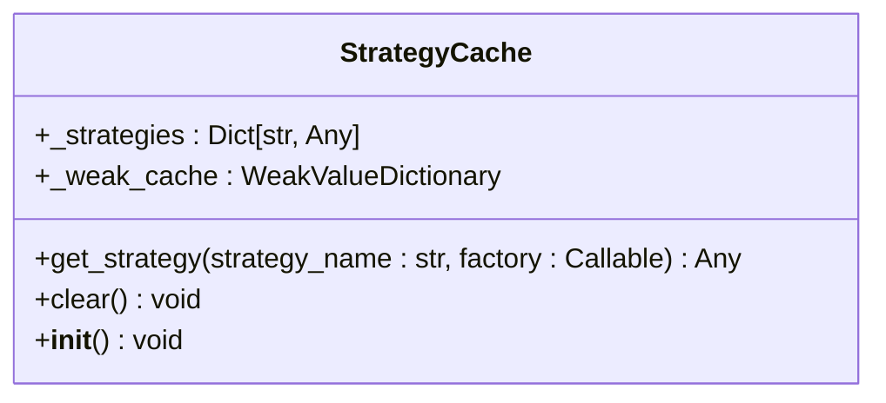
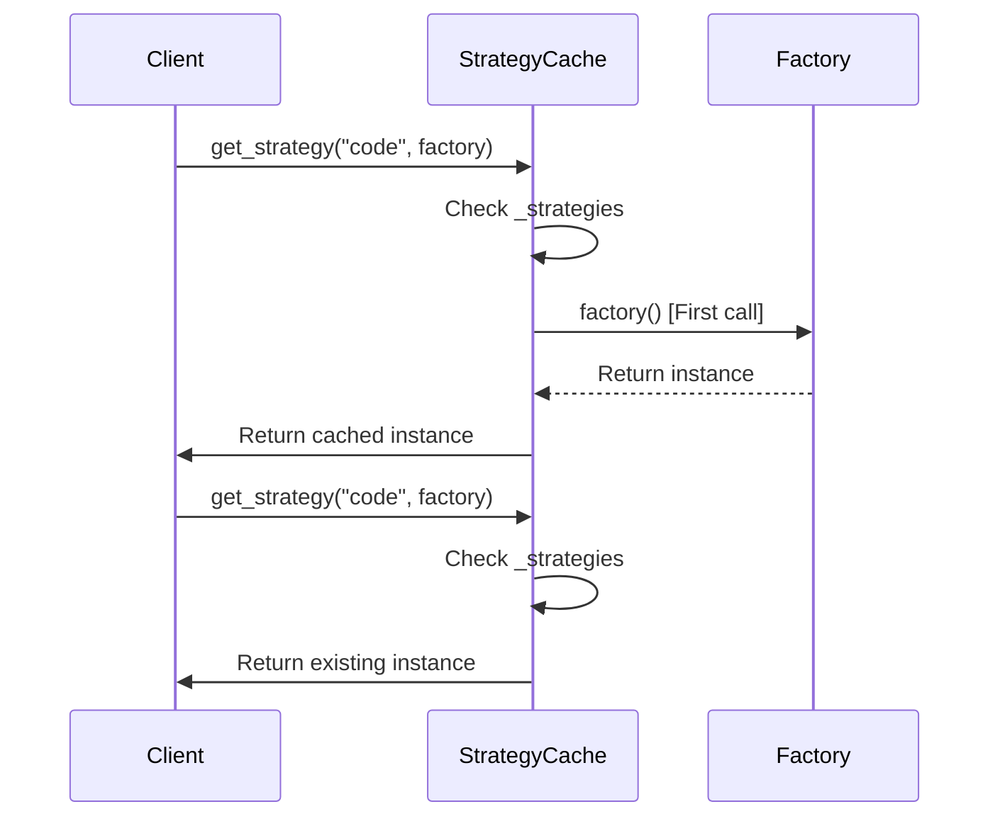
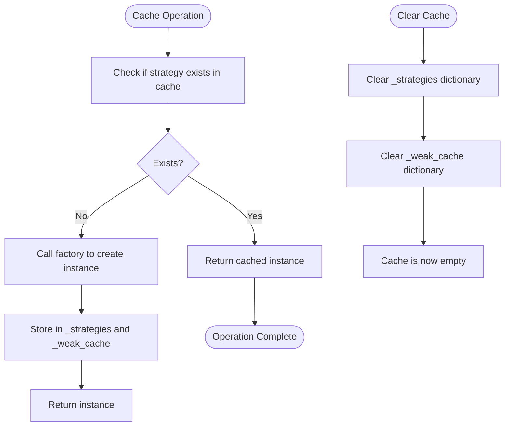
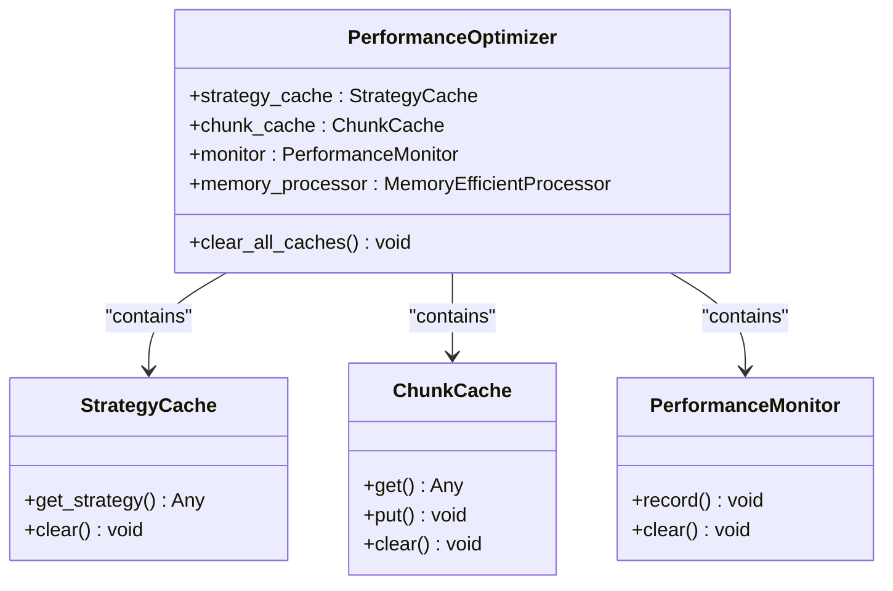

# Strategy Cache

<cite>
**Referenced Files in This Document**   
- [performance.py](file://markdown_chunker/chunker/performance.py#L12-L28)
- [test_performance.py](file://tests/chunker/test_performance.py#L19-L67)
- [core.py](file://markdown_chunker/chunker/core.py#L123-L125)
- [orchestrator.py](file://markdown_chunker/chunker/orchestrator.py#L213-L217)
</cite>

## Table of Contents
1. [Introduction](#introduction)
2. [Core Functionality](#core-functionality)
3. [Lazy Loading Mechanism](#lazy-loading-mechanism)
4. [Internal Storage and Memory Management](#internal-storage-and-memory-management)
5. [Cache Invalidation](#cache-invalidation)
6. [Integration with PerformanceOptimizer](#integration-with-performanceoptimizer)
7. [Thread Safety and Performance](#thread-safety-and-performance)
8. [Usage Examples](#usage-examples)
9. [Conclusion](#conclusion)

## Introduction
The StrategyCache class is a critical performance optimization component in the markdown chunking system. It manages the lifecycle of strategy instances through lazy loading and caching, significantly reducing initialization overhead. By instantiating strategies only when needed and reusing them across operations, StrategyCache improves both memory efficiency and processing speed. This document provides a comprehensive analysis of its implementation, behavior, and integration within the larger system architecture.

**Section sources**
- [performance.py](file://markdown_chunker/chunker/performance.py#L12-L28)

## Core Functionality
The StrategyCache class provides a centralized mechanism for managing strategy instances in the markdown chunking system. Its primary responsibility is to reduce initialization overhead by implementing lazy loading - strategies are only instantiated when first requested through the get_strategy() method. This approach prevents unnecessary object creation during system startup and conserves memory resources.

The cache operates using factory functions that encapsulate the instantiation logic for each strategy type. When a strategy is requested, the cache checks if it already exists in storage. If not, it invokes the corresponding factory function to create the instance and stores it for future use. Subsequent requests for the same strategy return the cached instance, ensuring consistency and preventing redundant creation.

**Diagram sources**
- [performance.py](file://markdown_chunker/chunker/performance.py#L12-L28)

**Section sources**
- [performance.py](file://markdown_chunker/chunker/performance.py#L12-L28)

## Lazy Loading Mechanism
The lazy loading mechanism in StrategyCache is implemented through the get_strategy() method, which serves as the primary interface for accessing strategy instances. This method accepts a strategy name and a factory function as parameters. The factory function contains the logic for creating a new strategy instance when needed.

When get_strategy() is called, it first checks if the requested strategy already exists in the internal _strategies dictionary. If the strategy is not found (indicating it's the first request), the factory function is invoked to create a new instance, which is then stored in the cache. For all subsequent requests with the same strategy name, the cached instance is returned directly without invoking the factory function.

This pattern ensures that expensive initialization operations occur only when absolutely necessary. The tests demonstrate this behavior by tracking factory function calls - the first call to get_strategy() triggers the factory, while subsequent calls with the same name reuse the cached instance without invoking the factory again.

**Diagram sources**
- [performance.py](file://markdown_chunker/chunker/performance.py#L19-L23)
- [test_performance.py](file://tests/chunker/test_performance.py#L22-L39)

**Section sources**
- [performance.py](file://markdown_chunker/chunker/performance.py#L19-L23)
- [test_performance.py](file://tests/chunker/test_performance.py#L22-L39)

## Internal Storage and Memory Management
StrategyCache employs a dual-storage approach for managing strategy instances, combining a standard dictionary with a WeakValueDictionary to optimize memory usage. The primary storage is the _strategies dictionary, which holds strong references to strategy instances, ensuring they remain available as long as they're in the cache.

Complementing this is the _weak_cache field, which uses Python's weakref.WeakValueDictionary. This specialized dictionary holds weak references to strategy instances, allowing them to be garbage collected when no other references exist in the system. This dual approach provides memory-efficient storage by enabling automatic cleanup of unused strategies while maintaining reliable access to actively used ones.

The combination of these storage mechanisms addresses a critical challenge in long-running applications: preventing memory leaks while ensuring performance benefits from caching. The WeakValueDictionary automatically removes entries when the strategy instances are no longer referenced elsewhere in the application, helping to maintain optimal memory usage over time.

**Section sources**
- [performance.py](file://markdown_chunker/chunker/performance.py#L16-L17)

## Cache Invalidation
The clear() method provides explicit cache invalidation functionality, allowing for the removal of all cached strategy instances. This operation is essential for scenarios requiring a clean state, such as configuration changes, testing environments, or memory conservation in long-running processes.

When clear() is invoked, it performs two operations: clearing the primary _strategies dictionary and clearing the _weak_cache WeakValueDictionary. This comprehensive cleanup ensures that all references to strategy instances are removed from the cache, allowing the garbage collector to reclaim the memory used by these objects.

The test cases demonstrate the effectiveness of cache clearing by showing that after calling clear(), subsequent calls to get_strategy() with the same parameters result in the factory function being invoked again. This behavior confirms that the cache has been properly invalidated and that new instances are created rather than returning stale references.

**Diagram sources**
- [performance.py](file://markdown_chunker/chunker/performance.py#L25-L28)
- [test_performance.py](file://tests/chunker/test_performance.py#L52-L67)

**Section sources**
- [performance.py](file://markdown_chunker/chunker/performance.py#L25-L28)
- [test_performance.py](file://tests/chunker/test_performance.py#L52-L67)

## Integration with PerformanceOptimizer
StrategyCache is tightly integrated with the PerformanceOptimizer class, which serves as the central coordinator for performance optimization features in the system. During initialization, PerformanceOptimizer creates an instance of StrategyCache and assigns it to the strategy_cache field, establishing a clear ownership relationship.

This integration enables coordinated cache management across different optimization components. The PerformanceOptimizer's clear_all_caches() method calls the clear() method on the StrategyCache instance, ensuring that strategy caching is managed consistently with other caching mechanisms in the system. This holistic approach to cache management is crucial for maintaining system integrity during operations that require a clean state.

The relationship between these components follows the composition pattern, where PerformanceOptimizer aggregates multiple optimization utilities, including StrategyCache, ChunkCache, and PerformanceMonitor. This design promotes separation of concerns while providing a unified interface for performance-related operations.

**Diagram sources**
- [performance.py](file://markdown_chunker/chunker/performance.py#L210-L242)
- [core.py](file://markdown_chunker/chunker/core.py#L123-L125)

**Section sources**
- [performance.py](file://markdown_chunker/chunker/performance.py#L210-L242)
- [core.py](file://markdown_chunker/chunker/core.py#L123-L125)

## Thread Safety and Performance
While the current implementation of StrategyCache does not explicitly address thread safety, its design has important implications for multi-threaded scenarios. The cache is designed to be used in contexts where multiple strategy types are managed, providing performance benefits by eliminating redundant initialization across different parts of the application.

In single-threaded or thread-confined usage patterns, StrategyCache delivers optimal performance by ensuring that repeated calls to get_strategy() with the same strategy name return the same instance. This consistency is verified in the test suite, which confirms object identity using the 'is' operator to ensure that cached instances are truly reused rather than recreated.

For applications requiring concurrent access, additional synchronization mechanisms would need to be implemented to ensure thread safety. However, in the current architecture, the cache is typically accessed within the context of a single orchestrator instance, reducing the likelihood of race conditions. The performance benefits are most pronounced in scenarios with multiple strategy types, where the overhead of initializing complex strategy objects can be substantial.

**Section sources**
- [test_performance.py](file://tests/chunker/test_performance.py#L41-L50)

## Usage Examples
The test cases provide clear examples of StrategyCache usage patterns that demonstrate its core functionality. The lazy loading behavior is illustrated by tracking factory function invocation counts - the first call to get_strategy() triggers the factory, while subsequent calls reuse the cached instance without invoking the factory again.

For multiple strategy management, the tests show how different strategy names result in separate entries in the cache. Each strategy is instantiated independently through its own factory function, and the cache maintains distinct instances for each strategy type. This demonstrates the cache's ability to manage a collection of different strategy objects efficiently.

The cache clearing example shows the complete lifecycle management of cached strategies. After clearing the cache, requesting a previously cached strategy results in a new instance being created, as evidenced by the incrementing call count in the factory function. This pattern is essential for testing scenarios and dynamic configuration changes where a clean state is required.

These usage patterns highlight the practical benefits of StrategyCache in real-world applications, where reducing initialization overhead and managing memory efficiently are critical for performance.

**Section sources**
- [test_performance.py](file://tests/chunker/test_performance.py#L19-L67)

## Conclusion
The StrategyCache class plays a vital role in optimizing the performance and memory efficiency of the markdown chunking system. By implementing lazy loading through factory functions and maintaining a dual-storage system with both strong and weak references, it effectively balances performance benefits with memory conservation.

The integration with PerformanceOptimizer provides a cohesive approach to system optimization, allowing for coordinated management of caching resources. While the current implementation focuses on single-threaded usage patterns, its design principles provide a solid foundation for potential enhancements to support concurrent access.

Through comprehensive testing, the reliability of the cache's behavior has been validated, confirming that it correctly implements lazy loading, maintains instance identity, and properly handles cache invalidation. These characteristics make StrategyCache an essential component for any system that requires efficient management of expensive-to-create objects.